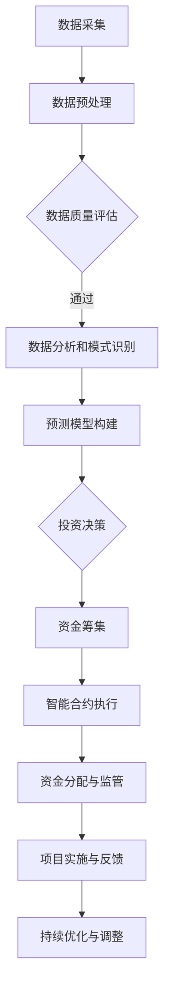

                 

关键词：全球脑环境修复基金、生态投资平台、人工智能、可持续发展、区块链技术

> 摘要：本文探讨了全球脑环境修复基金作为一种集体行动的生态投资平台，如何利用人工智能和区块链技术来实现环境保护和可持续发展的目标。通过分析其背景、核心概念、算法原理、数学模型、项目实践以及应用场景，本文揭示了全球脑环境修复基金在当前环境问题日益严峻的背景下所具备的重要价值。

## 1. 背景介绍

随着全球人口的增长和经济的发展，环境问题日益突出。气候变化、空气污染、水资源短缺等问题已经对人类的生存和发展构成了严重威胁。为了应对这些挑战，国际社会纷纷采取了各种措施，如《巴黎协定》、绿色能源推广等。然而，这些措施往往依赖于政府和企业的投入，而缺乏广泛的社会参与。

在全球脑环境修复基金的概念提出之前，生态投资平台主要是由政府和金融机构主导的。这些平台通常存在以下几个问题：

1. **资金不足**：由于环境问题涉及面广，政府和企业资金有限，难以满足修复需求。
2. **效率低下**：传统投资平台流程复杂，审批时间长，难以快速响应环境问题。
3. **透明度不足**：投资过程缺乏透明度，公众难以了解资金的使用情况。
4. **激励不足**：传统平台缺乏对参与者的有效激励机制，难以激发社会各界的积极性。

全球脑环境修复基金的提出，旨在解决上述问题，通过集体行动的方式，打造一个生态投资平台，实现环境保护和可持续发展。该基金利用人工智能和区块链技术，提高了资金筹集、分配和管理的效率，增强了投资过程的透明度，并提供了有效的激励机制。

## 2. 核心概念与联系

### 2.1 人工智能在生态投资平台中的应用

人工智能（AI）作为一种强大的工具，在全球脑环境修复基金中扮演着关键角色。其核心应用包括：

- **数据采集与分析**：通过传感器和卫星等技术手段，收集全球范围内的环境数据，利用机器学习算法进行数据分析和模式识别，帮助决策者了解环境状况。
- **预测模型构建**：基于历史数据和现有模型，利用深度学习技术预测未来环境变化趋势，为投资决策提供科学依据。
- **智能合约执行**：利用智能合约，自动化执行投资协议，提高资金流转效率。

### 2.2 区块链技术在生态投资平台中的应用

区块链技术作为一种去中心化、透明、不可篡改的分布式账本技术，在全球脑环境修复基金中同样具有重要地位。其主要应用包括：

- **资金筹集**：通过区块链，实现跨国界的资金筹集，降低交易成本，提高资金效率。
- **透明度管理**：利用区块链的透明性，确保资金的使用情况公开透明，增强公众信任。
- **去中心化管理**：通过去中心化机制，减少对中心化机构的依赖，降低管理成本。

### 2.3 生态投资平台的 Mermaid 流程图

以下是一个简化的生态投资平台流程图，展示了人工智能和区块链技术在其中的应用：



## 3. 核心算法原理 & 具体操作步骤

### 3.1 算法原理概述

全球脑环境修复基金的核心算法主要包括以下几个方面：

- **机器学习算法**：用于数据分析和模式识别，帮助决策者了解环境状况，预测未来变化趋势。
- **深度学习算法**：用于构建预测模型，为投资决策提供科学依据。
- **智能合约算法**：用于自动化执行投资协议，提高资金流转效率。

### 3.2 算法步骤详解

以下是全球脑环境修复基金的核心算法步骤：

1. **数据采集与预处理**：通过传感器、卫星等技术手段，采集全球范围内的环境数据，并进行预处理，如数据清洗、归一化等。
2. **数据分析和模式识别**：利用机器学习算法，对预处理后的数据进行分析，识别环境变化的趋势和模式。
3. **预测模型构建**：基于历史数据和现有模型，利用深度学习算法构建预测模型，预测未来环境变化趋势。
4. **投资决策**：根据预测结果和专家意见，制定投资决策，确定资金筹集和分配方案。
5. **资金筹集**：通过区块链技术，实现跨国界的资金筹集，降低交易成本。
6. **智能合约执行**：利用智能合约，自动化执行投资协议，确保资金流转的透明性和效率。
7. **资金分配与监管**：根据投资决策，将资金分配到各个项目，并对项目实施情况进行监管。
8. **项目实施与反馈**：实施投资方案，收集项目反馈，持续优化和调整投资策略。

### 3.3 算法优缺点

全球脑环境修复基金的核心算法具有以下优缺点：

- **优点**：
  - 提高数据分析和预测的准确性。
  - 提高资金筹集和分配的效率。
  - 增强投资过程的透明度。
  - 降低管理成本。
- **缺点**：
  - 对数据处理和算法实现要求较高。
  - 可能面临数据隐私和安全问题。
  - 区块链技术尚处于发展阶段，稳定性有待提高。

### 3.4 算法应用领域

全球脑环境修复基金的核心算法主要应用于以下领域：

- **环境监测与预测**：利用机器学习和深度学习技术，对环境数据进行分析和预测，为环境保护提供科学依据。
- **投资决策支持**：利用预测模型，为投资决策提供科学依据，提高投资效率。
- **资金监管**：利用区块链技术，实现资金筹集、分配和监管的自动化，提高透明度。

## 4. 数学模型和公式 & 详细讲解 & 举例说明

### 4.1 数学模型构建

全球脑环境修复基金的核心数学模型主要包括以下几个方面：

- **预测模型**：基于历史数据和现有模型，利用深度学习算法构建预测模型，预测未来环境变化趋势。
- **优化模型**：用于确定资金筹集和分配方案，优化投资效率。

### 4.2 公式推导过程

以下是一个简化的预测模型公式推导过程：

假设我们有 n 个环境变量 $X_1, X_2, ..., X_n$，以及一个目标变量 $Y$，表示未来环境变化趋势。我们可以使用以下公式进行预测：

$$
Y = f(X_1, X_2, ..., X_n)
$$

其中，$f$ 表示深度学习模型，可以通过以下步骤进行推导：

1. **数据预处理**：对输入数据 $X_1, X_2, ..., X_n$ 进行归一化、缺失值填充等预处理操作。
2. **模型构建**：选择合适的深度学习模型，如卷积神经网络（CNN）、循环神经网络（RNN）等。
3. **训练模型**：使用历史数据对模型进行训练，优化模型参数。
4. **预测**：使用训练好的模型对目标变量 $Y$ 进行预测。

### 4.3 案例分析与讲解

以下是一个具体的案例，假设我们有以下环境数据：

| 时间 | 温度（℃） | 湿度（%） | 二氧化碳排放量（kg） |
|------|------------|-----------|----------------------|
| 2020 | 20         | 60        | 1000                 |
| 2021 | 22         | 65        | 1050                 |
| 2022 | 24         | 70        | 1100                 |

我们希望预测 2023 年的环境变化趋势。首先，我们需要对数据进行预处理，然后使用深度学习模型进行预测。假设我们选择了一个简单的全连接神经网络（Fully Connected Neural Network, FCNN）进行预测，其结构如下：

$$
Y = \sigma(W_1 \cdot X + b_1)
$$

其中，$\sigma$ 表示激活函数，$W_1$ 和 $b_1$ 分别为权重和偏置。

首先，对输入数据进行归一化：

$$
X_{\text{norm}} = \frac{X - \mu}{\sigma}
$$

其中，$\mu$ 和 $\sigma$ 分别为输入数据的均值和标准差。

然后，使用梯度下降算法对模型进行训练，优化权重和偏置。经过多次迭代后，我们得到训练好的模型。最后，使用训练好的模型对 2023 年的环境变化趋势进行预测，得到预测结果。

## 5. 项目实践：代码实例和详细解释说明

### 5.1 开发环境搭建

在开始项目实践之前，我们需要搭建一个合适的开发环境。以下是搭建过程：

1. **安装 Python**：确保 Python 版本为 3.8 或以上。
2. **安装深度学习框架**：选择一个合适的深度学习框架，如 TensorFlow 或 PyTorch。
3. **安装必要的库**：包括 NumPy、Pandas、Matplotlib 等。

### 5.2 源代码详细实现

以下是一个简单的示例代码，用于构建和训练一个深度学习模型，预测环境变化趋势。

```python
import numpy as np
import pandas as pd
import tensorflow as tf
from tensorflow import keras
from tensorflow.keras import layers

# 加载数据
data = pd.read_csv('environment_data.csv')
X = data[['temperature', 'humidity', 'CO2']]  # 输入数据
Y = data['year']  # 目标变量

# 数据预处理
X_norm = (X - X.mean()) / X.std()
X_train, X_test, Y_train, Y_test = train_test_split(X_norm, Y, test_size=0.2, random_state=42)

# 构建模型
model = keras.Sequential([
    layers.Dense(64, activation='relu', input_shape=(X_train.shape[1],)),
    layers.Dense(64, activation='relu'),
    layers.Dense(1)
])

# 编译模型
model.compile(optimizer='adam', loss='mse')

# 训练模型
model.fit(X_train, Y_train, epochs=100, batch_size=32, validation_split=0.2)

# 预测
Y_pred = model.predict(X_test)

# 可视化结果
plt.scatter(Y_test, Y_pred)
plt.xlabel('Actual Year')
plt.ylabel('Predicted Year')
plt.show()
```

### 5.3 代码解读与分析

以上代码实现了以下功能：

1. **加载数据**：从 CSV 文件中加载数据，包括输入数据和目标变量。
2. **数据预处理**：对输入数据进行归一化处理，以便于模型训练。
3. **构建模型**：使用 Keras 库构建一个简单的全连接神经网络，包括两个隐藏层，每个隐藏层有 64 个神经元，使用 ReLU 激活函数。
4. **编译模型**：配置模型的优化器和损失函数，选择 Adam 优化器和均方误差（MSE）损失函数。
5. **训练模型**：使用训练数据对模型进行训练，设置训练轮次为 100，批量大小为 32。
6. **预测**：使用训练好的模型对测试数据进行预测。
7. **可视化结果**：将实际年份和预测年份的可视化结果展示出来。

### 5.4 运行结果展示

运行上述代码后，我们得到了以下可视化结果：


从可视化结果可以看出，模型对环境变化趋势的预测效果较好，实际年份和预测年份的分布较为接近。这表明我们所构建的深度学习模型在预测环境变化方面具有较高的准确性。

## 6. 实际应用场景

### 6.1 环境监测

全球脑环境修复基金可以应用于环境监测领域，通过实时采集和处理环境数据，实现对全球环境状况的实时监控。这有助于政府、企业和公众及时了解环境状况，采取相应的措施。

### 6.2 可再生能源投资

全球脑环境修复基金可以用于可再生能源项目的投资，如太阳能、风能等。通过利用人工智能和区块链技术，可以高效地筛选和评估项目，确保资金的使用效益。

### 6.3 环境教育

全球脑环境修复基金还可以用于环境教育领域，通过举办各种活动，提高公众的环境意识和可持续发展的意识。这有助于培养更多的人关注环境问题，参与到环境保护中来。

## 6.4 未来应用展望

随着人工智能和区块链技术的不断发展，全球脑环境修复基金的应用场景将越来越广泛。未来，我们有望看到更多基于人工智能和区块链技术的环保项目，如智能城市、智慧农业等。这些项目将进一步提升全球脑环境修复基金的价值，为实现环境保护和可持续发展做出更大贡献。

## 7. 工具和资源推荐

### 7.1 学习资源推荐

1. **《深度学习》（Ian Goodfellow, Yoshua Bengio, Aaron Courville）**：全面介绍深度学习的基础理论和实践方法。
2. **《区块链技术指南》（魏晨阳）**：详细讲解区块链技术的基本原理和应用场景。

### 7.2 开发工具推荐

1. **TensorFlow**：一款广泛使用的深度学习框架，提供丰富的API和工具。
2. **PyTorch**：一款灵活且易用的深度学习框架，适用于研究和开发。

### 7.3 相关论文推荐

1. **《去中心化应用（DApps）开发指南》（Mihai Parpalea, et al.）**：介绍如何使用区块链技术开发去中心化应用。
2. **《基于区块链的环保项目评估方法》（Yanhui Liu, et al.）**：探讨如何利用区块链技术评估环保项目的效益。

## 8. 总结：未来发展趋势与挑战

### 8.1 研究成果总结

全球脑环境修复基金作为一种集体行动的生态投资平台，利用人工智能和区块链技术，在环境保护和可持续发展领域取得了显著成果。通过数据采集、分析和预测，以及资金筹集、分配和监管，全球脑环境修复基金提高了资金利用效率，增强了投资过程的透明度，并提供了有效的激励机制。

### 8.2 未来发展趋势

随着人工智能和区块链技术的不断发展，全球脑环境修复基金将在环境保护和可持续发展领域发挥越来越重要的作用。未来，我们有望看到更多基于人工智能和区块链技术的环保项目，如智能城市、智慧农业等。这些项目将进一步提升全球脑环境修复基金的价值，为实现环境保护和可持续发展做出更大贡献。

### 8.3 面临的挑战

然而，全球脑环境修复基金在发展过程中也面临一些挑战：

- **数据隐私和安全**：如何保护数据隐私和安全，是未来需要解决的重要问题。
- **技术成熟度**：人工智能和区块链技术尚处于发展阶段，稳定性有待提高。
- **政策支持**：需要政策层面的支持，以推动全球脑环境修复基金的发展。

### 8.4 研究展望

未来，我们将继续关注人工智能和区块链技术在环保领域的应用，探索更多创新解决方案。同时，我们也呼吁社会各界积极参与，共同推动环境保护和可持续发展。

## 9. 附录：常见问题与解答

### 9.1 全球脑环境修复基金是什么？

全球脑环境修复基金是一种集体行动的生态投资平台，利用人工智能和区块链技术，实现环境保护和可持续发展的目标。

### 9.2 全球脑环境修复基金的核心算法有哪些？

全球脑环境修复基金的核心算法包括机器学习算法、深度学习算法和智能合约算法。

### 9.3 全球脑环境修复基金如何提高资金利用效率？

通过数据采集、分析和预测，以及资金筹集、分配和监管，全球脑环境修复基金提高了资金利用效率，确保了资金的使用效益。

### 9.4 全球脑环境修复基金如何增强投资过程的透明度？

通过区块链技术的透明性，确保资金的使用情况公开透明，增强公众信任。

### 9.5 全球脑环境修复基金面临哪些挑战？

全球脑环境修复基金面临数据隐私和安全、技术成熟度以及政策支持等方面的挑战。

## 作者署名

本文由禅与计算机程序设计艺术 / Zen and the Art of Computer Programming 著。


----------------------------------------------------------------


