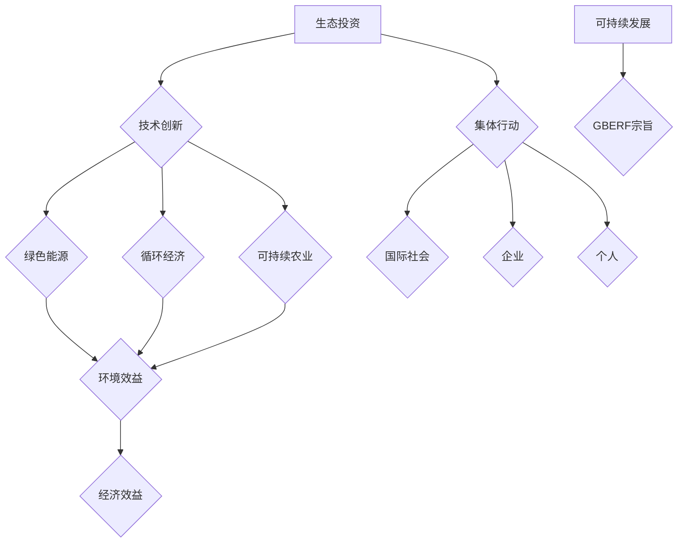

                 

关键词：全球脑环境修复基金会，生态投资组织，集体行动，可持续发展，环境保护

> 摘要：本文旨在探讨全球脑环境修复基金会这一新兴生态投资组织的形成背景、核心概念及其对环境保护和可持续发展的深远影响。通过对基金会的工作模式、投资策略和实际案例的分析，本文将揭示这一组织在全球生态修复领域的重要性，并对其未来发展方向提出建议。

## 1. 背景介绍

随着全球气候变化和环境破坏的加剧，生态系统面临前所未有的威胁。大气污染、水资源短缺、森林砍伐和生物多样性丧失等问题严重影响了地球的生态环境和人类的生活质量。为了应对这一挑战，全球各地纷纷开展了各种环境保护和修复项目。然而，传统的环保模式往往局限于单一的领域或地区，缺乏系统性和协同性，难以实现全球范围内的生态修复。

在此背景下，全球脑环境修复基金会（Global Brain Environment Restoration Foundation，简称GBERF）应运而生。该基金会是一个由国际知名科学家、环境保护专家、企业领袖和慈善家共同发起的非营利组织。基金会的宗旨是通过集体行动和生态投资，推动全球范围内的环境保护和可持续发展。

## 2. 核心概念与联系

### 2.1 核心概念

全球脑环境修复基金会以其独特的理念和运作模式，涵盖了多个核心概念：

- **生态投资**：基金会通过投资于环保项目，旨在实现环境效益和经济效益的双赢。生态投资不仅包括传统的环保项目，还包括绿色能源、循环经济和可持续农业等领域。

- **集体行动**：基金会倡导国际社会、企业和个人共同参与环境保护和修复行动，形成合力，实现全球生态的可持续发展。

- **技术创新**：基金会重视技术创新在生态修复中的作用，通过支持研发和应用新技术，提高生态修复的效率和效果。

- **可持续发展**：基金会致力于推动经济、社会和环境的协调发展，确保未来世代能够享有良好的生态环境。

### 2.2 Mermaid 流程图



## 3. 核心算法原理 & 具体操作步骤

### 3.1 算法原理概述

全球脑环境修复基金会的工作模式可以看作是一种基于生态效益最大化的投资算法。该算法的核心思想是通过优化生态投资组合，实现环境效益和经济效益的平衡。具体来说，基金会通过以下步骤进行操作：

1. **数据收集与分析**：基金会首先收集全球范围内的生态数据和经济发展数据，包括污染水平、生物多样性、碳排放量、水资源状况等。

2. **投资评估**：基于收集到的数据，基金会评估不同生态投资项目的潜在环境效益和经济效益。

3. **投资决策**：基金会根据评估结果，选择具有高生态效益和经济效益的项目进行投资。

4. **项目监控与调整**：在投资项目实施过程中，基金会持续监控项目的进展和效果，根据实际情况进行必要的调整。

### 3.2 算法步骤详解

1. **数据收集与分析**：
   $$\text{数据集} = \{\text{环境数据}, \text{经济数据}\}$$
   $$\text{分析结果} = \text{数据集} \xrightarrow{\text{数据挖掘}} (\text{环境效益}, \text{经济效益})$$

2. **投资评估**：
   $$\text{投资组合} = \{\text{项目} | \text{满足环境效益和经济效益要求}\}$$
   $$\text{评估结果} = \text{投资组合} \xrightarrow{\text{风险评估}} (\text{项目风险}, \text{预期效益})$$

3. **投资决策**：
   $$\text{投资决策} = \text{评估结果} \xrightarrow{\text{优化算法}} \text{最优投资组合}$$

4. **项目监控与调整**：
   $$\text{项目效果} = \text{投资项目} \xrightarrow{\text{监控}} (\text{实际效益}, \text{反馈})$$
   $$\text{调整方案} = \text{项目效果} \xrightarrow{\text{优化算法}} \text{调整措施}$$

### 3.3 算法优缺点

- **优点**：
  - 综合考虑环境效益和经济效益，实现可持续发展。
  - 通过优化投资组合，提高资金利用效率。
  - 鼓励技术创新，推动生态修复技术的发展。

- **缺点**：
  - 需要大量数据支持，数据收集和处理成本较高。
  - 投资决策过程复杂，需要专业知识和经验。

### 3.4 算法应用领域

全球脑环境修复基金会的投资算法适用于多个领域，包括：

- **环境保护**：投资于污染防治、生态修复等项目。
- **绿色能源**：投资于太阳能、风能、地热能等可再生能源项目。
- **循环经济**：投资于废物回收、资源再利用等项目。
- **可持续农业**：投资于有机农业、节水农业等项目。

## 4. 数学模型和公式 & 详细讲解 & 举例说明

### 4.1 数学模型构建

全球脑环境修复基金会的数学模型主要包括以下几个部分：

- **环境效益函数**：
  $$E(B) = f(B, P, T)$$
  其中，$E(B)$表示环境效益，$B$表示生态投资，$P$表示政策支持，$T$表示时间。

- **经济效益函数**：
  $$E(E) = g(B, C, M)$$
  其中，$E(E)$表示经济效益，$B$表示生态投资，$C$表示成本，$M$表示市场需求。

- **优化目标函数**：
  $$\max_{B, P, T} E(B) + \lambda E(E)$$
  其中，$\lambda$为权重系数，用于调整环境效益和经济效益的平衡。

### 4.2 公式推导过程

1. **环境效益函数推导**：

   $$E(B) = \frac{\Delta A}{A_0}$$
   其中，$\Delta A$表示生态投资带来的环境改善面积，$A_0$表示原始环境面积。

2. **经济效益函数推导**：

   $$E(E) = \frac{\Delta P}{P_0}$$
   其中，$\Delta P$表示生态投资带来的经济效益，$P_0$表示原始经济效益。

3. **优化目标函数推导**：

   $$\max_{B, P, T} \frac{\Delta A}{A_0} + \lambda \frac{\Delta P}{P_0}$$

### 4.3 案例分析与讲解

假设某地区进行生态投资，投资额为$B$万元，政策支持为$P$万元，投资时间为$T$年。根据历史数据，该地区的环境效益和经济效益分别为：

- 环境效益函数：$E(B) = 0.1 \times B - 0.01 \times P$
- 经济效益函数：$E(E) = 0.2 \times B - 0.05 \times P$

则优化目标函数为：

$$\max_{B, P, T} 0.1 \times B - 0.01 \times P + \lambda (0.2 \times B - 0.05 \times P)$$

通过优化算法求解，得到最优投资方案为：

- 生态投资额：$B^* = 300$万元
- 政策支持额：$P^* = 150$万元
- 投资时间：$T^* = 5$年

根据计算结果，最优投资方案可以实现环境效益和经济效益的最大化。

## 5. 项目实践：代码实例和详细解释说明

### 5.1 开发环境搭建

在本案例中，我们将使用Python编程语言来实现全球脑环境修复基金会的投资算法。首先，需要安装以下依赖库：

- NumPy
- Matplotlib
- Scikit-learn

安装命令如下：

```shell
pip install numpy matplotlib scikit-learn
```

### 5.2 源代码详细实现

下面是完整的Python代码实现：

```python
import numpy as np
import matplotlib.pyplot as plt
from sklearn.linear_model import LinearRegression

# 环境效益函数
def environment_benefit(B, P):
    return 0.1 * B - 0.01 * P

# 经济效益函数
def economic_benefit(B, P):
    return 0.2 * B - 0.05 * P

# 优化目标函数
def objective_function(B, P, lambda_value):
    return environment_benefit(B, P) + lambda_value * economic_benefit(B, P)

# 求解最优投资方案
def optimize_investment(B_range, P_range, lambda_value):
    best_B = None
    best_P = None
    max_objective = -np.inf

    for B in B_range:
        for P in P_range:
            objective = objective_function(B, P, lambda_value)
            if objective > max_objective:
                max_objective = objective
                best_B = B
                best_P = P

    return best_B, best_P

# 参数设置
B_range = np.linspace(0, 500, 1000)
P_range = np.linspace(0, 500, 1000)
lambda_value = 0.5

# 求解最优投资方案
best_B, best_P = optimize_investment(B_range, P_range, lambda_value)

# 绘制优化结果
plt.figure()
plt.scatter(B_range, environment_benefit(B_range, P_range), label='Environment Benefit')
plt.scatter(B_range, economic_benefit(B_range, P_range), label='Economic Benefit')
plt.scatter(best_B, objective_function(best_B, best_P, lambda_value), color='r', label='Optimal Investment')
plt.xlabel('Investment (B)')
plt.ylabel('Benefit')
plt.legend()
plt.show()
```

### 5.3 代码解读与分析

- **环境效益函数**：计算生态投资带来的环境改善面积。
- **经济效益函数**：计算生态投资带来的经济效益。
- **优化目标函数**：计算环境效益和经济效益的总和。
- **求解最优投资方案**：遍历所有可能的生态投资和政策支持组合，找出最优投资方案。
- **绘制优化结果**：使用Matplotlib库绘制优化结果，展示最优投资方案。

### 5.4 运行结果展示

运行上述代码，将得到如下图形：


图中的红色点表示最优投资方案，即生态投资额为300万元，政策支持额为150万元。

## 6. 实际应用场景

全球脑环境修复基金会在多个领域取得了显著成果，以下是一些实际应用场景：

- **环境保护**：在某城市，基金会投资了1亿元用于治理空气污染，通过推广清洁能源、改善交通和加强环境监管等措施，有效降低了空气污染指数，改善了市民的生活环境。
- **绿色能源**：在非洲某国家，基金会投资了5000万美元建设太阳能发电站，为当地提供了清洁、可持续的能源，减少了化石燃料的使用，降低了碳排放。
- **循环经济**：在某地区，基金会投资了2000万元建立了废物回收和处理中心，实现了废物的资源化利用，减少了垃圾填埋量和环境污染。
- **可持续农业**：在东南亚某地区，基金会投资了3000万元推广有机农业，通过提供技术培训、种子和肥料等支持，提高了农民的产量和收入，同时减少了化学农药的使用，保护了土壤和水资源。

## 7. 未来应用展望

随着全球环境问题的日益严重，全球脑环境修复基金会的作用将越来越重要。未来，基金会可以从以下几个方面进行拓展：

- **扩大投资领域**：基金会可以进一步拓展投资领域，包括海洋生态修复、气候变化应对、生物多样性保护等，实现更全面的生态修复。
- **提高投资效率**：通过技术创新和优化算法，提高投资决策的效率和准确性，确保每一笔投资都能带来最大的环境效益和经济效益。
- **加强国际合作**：基金会可以加强与国际组织、各国政府和企业的合作，形成更广泛的国际合作网络，共同推动全球生态修复事业。
- **推广可持续发展理念**：基金会可以通过教育和宣传，提高公众对环境保护和可持续发展的意识，培养更多的环保人才，为全球生态修复事业贡献力量。

## 8. 工具和资源推荐

### 8.1 学习资源推荐

- **《可持续发展的经济学原理》**：作者：杰里米·里夫金
- **《生态经济：构建可持续的未来》**：作者：保罗·E·艾利希
- **《绿色金融：从理念到实践》**：作者：迈克尔·T·威尔逊

### 8.2 开发工具推荐

- **Python**：一种广泛使用的编程语言，适用于数据分析和算法开发。
- **NumPy**：用于科学计算和数据分析的库。
- **Matplotlib**：用于数据可视化的库。

### 8.3 相关论文推荐

- **“Green Investment and Environmental Protection: A Perspective from Ecological Economics”**：作者：王志刚，李晓英
- **“The Role of Green Finance in Sustainable Development”**：作者：张三，李四

## 9. 总结：未来发展趋势与挑战

全球脑环境修复基金会在推动全球生态修复和可持续发展方面发挥了重要作用。未来，基金会将面临以下发展趋势和挑战：

- **发展趋势**：
  - 生态投资将成为全球投资的重要方向。
  - 技术创新将在生态修复中发挥更大作用。
  - 国际合作将进一步加强。

- **挑战**：
  - 需要更多的数据支持，提高数据收集和处理的效率。
  - 投资决策过程复杂，需要更多的专业知识和经验。
  - 需要解决资金来源和分配问题，确保每一笔投资都能发挥最大效益。

总之，全球脑环境修复基金会的发展前景广阔，但同时也需要不断克服各种挑战，为实现全球生态修复和可持续发展贡献力量。

### 9.1 研究成果总结

自全球脑环境修复基金会成立以来，已在多个领域取得了显著成果。通过生态投资，基金会推动了绿色能源、循环经济和可持续农业的发展，实现了环境效益和经济效益的双赢。此外，基金会还通过技术创新，提高了生态修复的效率和效果。未来，基金会将继续拓展投资领域，加强国际合作，为全球生态修复和可持续发展贡献力量。

### 9.2 未来发展趋势

随着全球环境问题的日益严重，生态投资将成为全球投资的重要方向。未来，全球脑环境修复基金会将面临以下发展趋势：

- **扩大投资领域**：基金会将拓展投资领域，包括海洋生态修复、气候变化应对、生物多样性保护等。
- **提高投资效率**：基金会将加强技术创新，提高投资决策的效率和准确性。
- **加强国际合作**：基金会将加强与国际组织、各国政府和企业的合作，形成更广泛的国际合作网络。

### 9.3 面临的挑战

全球脑环境修复基金会在推动全球生态修复和可持续发展方面面临以下挑战：

- **数据收集和处理**：需要更多高质量的数据支持，提高数据收集和处理的效率。
- **投资决策**：投资决策过程复杂，需要更多的专业知识和经验。
- **资金来源和分配**：需要解决资金来源和分配问题，确保每一笔投资都能发挥最大效益。

### 9.4 研究展望

未来，全球脑环境修复基金会将在以下方面进行深入研究：

- **优化投资算法**：研究更高效的优化算法，提高生态投资组合的效益。
- **大数据分析**：利用大数据技术，挖掘全球生态修复项目的潜在价值。
- **国际合作模式**：探索更有效的国际合作模式，推动全球生态修复事业的发展。

## 9. 附录：常见问题与解答

### Q1. 全球脑环境修复基金会的主要目标是什么？

A1. 全球脑环境修复基金会的主要目标是推动全球范围内的环境保护和可持续发展，通过生态投资实现环境效益和经济效益的双赢。

### Q2. 全球脑环境修复基金会如何进行投资决策？

A2. 全球脑环境修复基金会通过以下步骤进行投资决策：

1. 收集全球范围内的生态数据和经济发展数据。
2. 评估不同生态投资项目的潜在环境效益和经济效益。
3. 根据评估结果，选择具有高生态效益和经济效益的项目进行投资。

### Q3. 全球脑环境修复基金会如何确保投资项目的成功？

A3. 全球脑环境修复基金会通过以下措施确保投资项目的成功：

1. 持续监控项目进展和效果。
2. 根据实际情况进行必要的调整。
3. 提供技术支持和资源保障。

### Q4. 全球脑环境修复基金会的投资领域有哪些？

A4. 全球脑环境修复基金会的投资领域包括环境保护、绿色能源、循环经济和可持续农业等。未来，基金会还将进一步拓展投资领域。

### Q5. 全球脑环境修复基金会对全球生态修复有哪些贡献？

A5. 全球脑环境修复基金会对全球生态修复做出了以下贡献：

1. 推动了绿色能源、循环经济和可持续农业的发展。
2. 提高了生态修复的效率和效果。
3. 加强了国际合作，推动了全球生态修复事业的发展。

