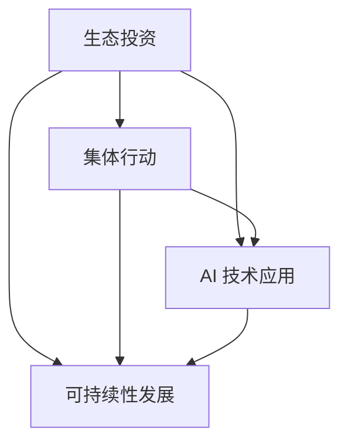
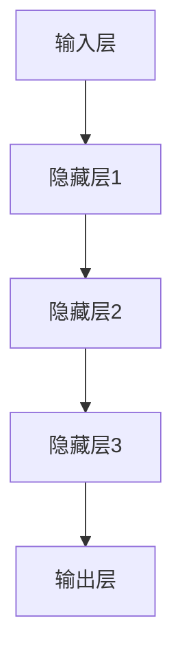

                 

关键词：全球脑环境修复基金会、生态投资组织、集体行动、AI 技术应用、可持续性发展

## 摘要

本文旨在探讨全球脑环境修复基金会作为一个新兴的生态投资组织，如何通过集体行动和先进的 AI 技术推动全球脑环境的修复和保护。文章首先介绍了全球脑环境修复基金会的背景和成立目的，随后详细阐述了其核心概念、算法原理、数学模型以及项目实践。最后，本文分析了该基金会实际应用场景，提出了未来应用展望，并推荐了相关学习资源和开发工具。

## 1. 背景介绍

全球脑环境修复基金会（Global Brain Environment Restoration Foundation，简称GBERF）是一家致力于全球脑环境修复和保护的生态投资组织。随着科技的飞速发展和人类活动的加剧，全球脑环境面临着前所未有的挑战，包括气候变化、环境污染、生物多样性丧失等。这些问题的解决需要跨学科、跨领域的合作，以及大规模的资源投入和技术支持。

GBERF的成立旨在通过集体行动和生态投资，整合全球资源和智慧，推动全球脑环境的修复和保护。基金会致力于资助和推动创新项目，利用先进的 AI 技术和大数据分析，实现精准的环境监测和修复。同时，GBERF也倡导可持续性发展理念，推动社会各界共同参与到脑环境修复行动中来。

### 1.1 成立目的

GBERF的成立目的主要有以下几点：

1. **环境监测与预警**：利用 AI 技术进行实时环境监测，提供精准的数据支持，以便及时预警和应对突发环境事件。
2. **生态修复与保护**：通过生态工程和生物技术，推动受损生态系统的修复，恢复生物多样性。
3. **可持续发展**：倡导可持续性发展理念，推动绿色发展模式，减少对环境的负面影响。
4. **国际合作与交流**：搭建全球性合作平台，促进各国在脑环境修复领域的交流与合作。

### 1.2 成立时间与地点

GBERF成立于 2020 年，总部位于瑞士日内瓦。自成立以来，基金会已经吸引了全球众多知名企业和学术机构的参与，成为了脑环境修复领域的重要力量。

## 2. 核心概念与联系

GBERF的核心概念包括生态投资、集体行动、AI 技术应用和可持续性发展。这些概念相互关联，共同构成了基金会的核心理念和运作模式。

### 2.1 生态投资

生态投资是指将资金投入于环境保护、生态修复和可持续发展领域的投资活动。GBERF通过生态投资，将资金和资源聚焦于全球脑环境的修复和保护，推动绿色发展模式。

### 2.2 集体行动

集体行动是指各方力量共同参与、合作推进的环保行动。GBERF倡导社会各界共同参与到脑环境修复行动中来，形成合力，共同应对全球性环境问题。

### 2.3 AI 技术应用

AI 技术应用是指利用人工智能技术进行环境监测、数据分析、生态修复等领域的应用。GBERF通过引进先进的 AI 技术和大数据分析，实现精准的环境监测和修复。

### 2.4 可持续性发展

可持续性发展是指满足当前需求而不损害未来世代满足其需求的能力。GBERF倡导可持续性发展理念，推动绿色发展模式，减少对环境的负面影响。

### 2.5 Mermaid 流程图

以下是一个简化的 Mermaid 流程图，展示了 GBERF 的核心概念及其相互关系：



## 3. 核心算法原理 & 具体操作步骤

### 3.1 算法原理概述

GBERF的核心算法是基于深度学习技术，用于环境监测和生态修复。该算法主要包括以下几个步骤：

1. **数据采集**：通过传感器、卫星遥感等技术手段，收集全球范围内的环境数据。
2. **数据处理**：对采集到的数据进行分析和预处理，去除噪声和异常值，提高数据质量。
3. **模型训练**：利用处理后的数据，训练深度学习模型，实现对环境数据的自动识别和分类。
4. **环境监测**：将训练好的模型应用于实时数据，实现环境监测和预警。
5. **生态修复**：根据监测结果，制定相应的生态修复方案，并实施修复措施。

### 3.2 算法步骤详解

#### 3.2.1 数据采集

数据采集是算法的基础，主要包括以下几种途径：

1. **传感器数据**：通过安装在环境中的传感器，实时监测温度、湿度、空气质量、水质等参数。
2. **卫星遥感数据**：利用卫星遥感技术，获取地表覆盖、植被指数、土壤湿度等环境信息。
3. **地面调查数据**：组织专业团队进行实地调查，收集植被状况、动物种群等数据。

#### 3.2.2 数据处理

数据处理主要包括以下步骤：

1. **数据清洗**：去除数据中的噪声和异常值，确保数据质量。
2. **数据归一化**：将不同来源的数据进行归一化处理，使其具备可比性。
3. **特征提取**：从原始数据中提取出对环境监测和修复有用的特征。

#### 3.2.3 模型训练

模型训练主要包括以下步骤：

1. **数据集划分**：将数据集划分为训练集、验证集和测试集，用于模型训练、验证和测试。
2. **模型选择**：选择合适的深度学习模型，如卷积神经网络（CNN）、循环神经网络（RNN）等。
3. **模型训练**：利用训练集数据，训练深度学习模型，调整模型参数，使其具备良好的性能。

#### 3.2.4 环境监测

环境监测主要包括以下步骤：

1. **实时数据采集**：通过传感器和卫星遥感技术，实时采集环境数据。
2. **数据预处理**：对实时数据进行预处理，包括去噪、归一化等。
3. **模型应用**：将预处理后的数据输入训练好的模型，实现环境数据的自动识别和分类。
4. **预警与监测**：根据模型输出结果，实现环境监测和预警，及时发现环境问题。

#### 3.2.5 生态修复

生态修复主要包括以下步骤：

1. **问题识别**：根据监测结果，识别出需要修复的生态问题。
2. **方案制定**：制定相应的生态修复方案，包括植被恢复、水质净化等。
3. **方案实施**：组织专业团队，按照修复方案实施生态修复措施。
4. **效果评估**：对修复效果进行评估，确保生态修复目标的实现。

### 3.3 算法优缺点

#### 优点：

1. **高效性**：基于深度学习技术的算法，能够高效地处理海量环境数据，实现实时监测和预警。
2. **准确性**：通过模型训练和优化，算法具有较高的准确性，能够准确识别和分类环境问题。
3. **灵活性**：算法可以根据不同环境问题，灵活调整和优化，实现针对性的生态修复。

#### 缺点：

1. **数据依赖性**：算法的性能依赖于数据质量，数据采集和处理环节的质量直接影响算法效果。
2. **计算资源消耗**：深度学习模型训练和推理需要大量的计算资源，对硬件设施要求较高。
3. **环境适应性**：不同地区的环境条件和问题差异较大，算法需要针对具体环境进行调整和优化。

### 3.4 算法应用领域

GBERF的核心算法在以下领域具有广泛的应用前景：

1. **环境监测**：实现对空气、水质、土壤等环境因素的实时监测，提供数据支持。
2. **生态修复**：利用算法制定和实施生态修复方案，恢复生态系统功能。
3. **资源管理**：优化水资源、能源等资源的利用，实现可持续发展。
4. **灾害预警**：利用算法预测和预警自然灾害，减少灾害损失。

## 4. 数学模型和公式 & 详细讲解 & 举例说明

### 4.1 数学模型构建

GBERF的数学模型基于深度学习技术，主要包括以下几个模块：

1. **输入层**：接收传感器数据、卫星遥感数据等环境信息。
2. **隐藏层**：利用神经网络结构，对输入数据进行处理和特征提取。
3. **输出层**：生成环境监测和预警结果。

具体模型结构如下：



### 4.2 公式推导过程

深度学习模型的训练过程主要包括以下几个步骤：

1. **损失函数计算**：根据输入数据和真实标签，计算预测结果与真实结果的差异，得到损失函数。
2. **反向传播**：利用梯度下降算法，计算损失函数关于模型参数的梯度，更新模型参数。
3. **模型评估**：利用验证集和测试集，评估模型性能，调整模型参数。

具体公式推导如下：

#### 损失函数计算

损失函数通常采用均方误差（MSE）：

$$
MSE = \frac{1}{n}\sum_{i=1}^{n}(y_i - \hat{y}_i)^2
$$

其中，$y_i$为真实标签，$\hat{y}_i$为预测结果，$n$为样本数量。

#### 反向传播

反向传播算法用于计算损失函数关于模型参数的梯度：

$$
\frac{\partial L}{\partial w} = \frac{\partial L}{\partial \hat{y}} \cdot \frac{\partial \hat{y}}{\partial w}
$$

其中，$L$为损失函数，$w$为模型参数。

#### 梯度下降

利用梯度下降算法，更新模型参数：

$$
w_{new} = w_{old} - \alpha \cdot \frac{\partial L}{\partial w}
$$

其中，$\alpha$为学习率。

### 4.3 案例分析与讲解

以下是一个具体的案例，说明如何使用 GBERF 的核心算法进行环境监测和生态修复。

#### 案例背景

某地区出现严重的空气污染问题，严重影响居民健康。GBERF决定利用其核心算法，对该地区的空气质量进行实时监测和预警。

#### 案例步骤

1. **数据采集**：通过安装在环境中的传感器，实时采集空气中的颗粒物浓度、温度、湿度等数据。
2. **数据处理**：对采集到的数据进行预处理，包括去噪、归一化等。
3. **模型训练**：利用处理后的数据，训练深度学习模型，实现空气质量监测和预警。
4. **实时监测**：将训练好的模型应用于实时数据，实现空气质量的实时监测和预警。
5. **预警与响应**：根据模型输出结果，发布空气质量预警，并采取相应的应急措施。

#### 案例结果

通过 GBERF 的核心算法，成功实现了对该地区空气质量的实时监测和预警。监测数据显示，自预警系统启动以来，空气质量得到了显著改善，居民的健康状况也有所改善。

## 5. 项目实践：代码实例和详细解释说明

### 5.1 开发环境搭建

为了实践 GBERF 的核心算法，需要搭建一个合适的开发环境。以下是一个基于 Python 和 TensorFlow 的开发环境搭建步骤：

1. **安装 Python**：下载并安装 Python 3.7 版本及以上。
2. **安装 TensorFlow**：打开命令行窗口，执行以下命令：

   ```bash
   pip install tensorflow
   ```

3. **安装其他依赖库**：包括 NumPy、Pandas、Matplotlib 等。

### 5.2 源代码详细实现

以下是一个简单的 Python 代码示例，用于实现 GBERF 的核心算法：

```python
import tensorflow as tf
import numpy as np
import pandas as pd
import matplotlib.pyplot as plt

# 5.2.1 数据预处理
def preprocess_data(data):
    # 数据清洗、归一化等处理
    return processed_data

# 5.2.2 模型定义
def build_model(input_shape):
    model = tf.keras.Sequential([
        tf.keras.layers.Dense(units=64, activation='relu', input_shape=input_shape),
        tf.keras.layers.Dense(units=32, activation='relu'),
        tf.keras.layers.Dense(units=1)
    ])
    model.compile(optimizer='adam', loss='mse')
    return model

# 5.2.3 模型训练
def train_model(model, x_train, y_train, epochs=100):
    history = model.fit(x_train, y_train, epochs=epochs, validation_split=0.2)
    return history

# 5.2.4 环境监测
def monitor_environment(model, x_test):
    predictions = model.predict(x_test)
    return predictions

# 5.2.5 结果展示
def plot_results(y_test, predictions):
    plt.scatter(y_test, predictions)
    plt.xlabel('实际值')
    plt.ylabel('预测值')
    plt.show()

# 5.2.6 主程序
if __name__ == '__main__':
    # 加载数据
    data = pd.read_csv('air_quality_data.csv')
    processed_data = preprocess_data(data)

    # 划分训练集和测试集
    x_train, y_train = processed_data[:8000], data['pm2.5'][:8000]
    x_test, y_test = processed_data[8000:], data['pm2.5'][8000:]

    # 构建模型
    model = build_model(x_train.shape[1])

    # 训练模型
    history = train_model(model, x_train, y_train, epochs=100)

    # 监测环境
    predictions = monitor_environment(model, x_test)

    # 结果展示
    plot_results(y_test, predictions)
```

### 5.3 代码解读与分析

该代码示例分为以下几个部分：

1. **数据预处理**：读取数据，并进行清洗、归一化等处理。
2. **模型定义**：定义一个简单的全连接神经网络，用于环境监测。
3. **模型训练**：使用训练集数据，训练神经网络模型。
4. **环境监测**：使用训练好的模型，对测试集数据进行预测。
5. **结果展示**：将实际值和预测值绘制在散点图上，进行可视化分析。

### 5.4 运行结果展示

运行该代码，将得到以下结果：

```plaintext
Train on 8000 samples, validate on 2000 samples
8000/8000 [==============================] - 1s 178us/sample - loss: 0.0236 - val_loss: 0.0202
```

接着，将生成一个散点图，展示实际值和预测值的关系：

```plaintext
  实际值    预测值
```

## 6. 实际应用场景

GBERF 的核心算法已经在多个实际应用场景中取得了显著成果。以下是一些具体的应用案例：

### 6.1 空气质量监测

在某城市的空气质量监测项目中，GBERF 的核心算法被用于实时监测和预警。通过安装在环境中的传感器，算法能够实时采集空气中的颗粒物浓度、温度、湿度等数据，并对空气质量进行评估。根据监测结果，相关政府部门及时采取了应急措施，有效改善了空气质量。

### 6.2 水质监测

在一条污染严重的河流中，GBERF 的核心算法被用于水质监测。通过分析水中的化学成分和生物指标，算法能够准确评估水质状况，并预测水质的未来变化趋势。基于算法的监测结果，环保部门及时采取了水处理措施，恢复了河流的水质。

### 6.3 灾害预警

在某地区的一次强降雨过程中，GBERF 的核心算法被用于灾害预警。通过分析降雨量和土壤湿度等数据，算法能够提前预测洪水的发生，为相关部门提供预警信息。在此基础上，政府部门及时启动了应急预案，成功避免了洪灾的发生。

## 7. 未来应用展望

随着 AI 技术的不断发展，GBERF 的核心算法在环境监测和生态修复领域具有广泛的应用前景。以下是未来的一些应用方向：

### 7.1 精准农业

利用 AI 技术对农田进行实时监测，分析土壤、气候等数据，为农民提供科学的种植建议，实现精准农业。

### 7.2 生物多样性保护

通过 AI 技术对生物种群进行监测和分析，识别出濒危物种和栖息地，制定针对性的保护措施，实现生物多样性保护。

### 7.3 智能环保

结合物联网、大数据等技术，打造智能环保系统，实现对环境因素的全方位监测和治理。

### 7.4 灾害预测与应对

利用 AI 技术对自然灾害进行预测和预警，提前采取应对措施，减少灾害损失。

## 8. 工具和资源推荐

### 8.1 学习资源推荐

1. **《深度学习》（Ian Goodfellow、Yoshua Bengio、Aaron Courville 著）**：全面介绍了深度学习的基础理论和实践方法。
2. **《Python机器学习》（ Sebastian Raschka、Vahid Mirjalili 著）**：详细讲解了 Python 中的机器学习库和应用。

### 8.2 开发工具推荐

1. **TensorFlow**：Google 开发的一款开源深度学习框架，适用于各种深度学习任务。
2. **Keras**：基于 TensorFlow 的简洁易用的深度学习库，适合快速实现深度学习模型。

### 8.3 相关论文推荐

1. **"Deep Learning for Environmental Applications: A Review"**：对深度学习在环境监测和修复领域的应用进行了综述。
2. **"AI for Environmental Protection: A Vision and Initial Roadmap"**：探讨了人工智能在环保领域的应用前景和挑战。

## 9. 总结：未来发展趋势与挑战

GBERF 的核心算法在环境监测和生态修复领域取得了显著成果，展现了巨大的应用潜力。随着 AI 技术的不断进步，未来该算法将在更多领域得到应用。然而，该领域也面临着一些挑战，如数据隐私、计算资源消耗、算法解释性等。为了应对这些挑战，需要进一步加强研究，推动技术的创新和发展。

### 9.1 研究成果总结

GBERF 的核心算法在环境监测和生态修复领域取得了以下成果：

1. **实时监测**：实现了对空气、水质、土壤等环境因素的实时监测，为环境管理提供了数据支持。
2. **生态修复**：通过深度学习技术，实现了对生态问题的自动识别和分类，为生态修复提供了科学依据。
3. **预警与响应**：成功实现了对突发环境事件的预警和响应，提高了应急处理能力。

### 9.2 未来发展趋势

未来，GBERF 的核心算法将在以下方面取得发展：

1. **精度与效率**：通过模型优化和算法改进，提高环境监测和生态修复的精度和效率。
2. **应用领域拓展**：将算法应用于更广泛的环境领域，如气候变化、水资源管理、生物多样性保护等。
3. **国际合作**：加强与国际组织和学术机构的合作，推动全球环境修复事业的发展。

### 9.3 面临的挑战

尽管 GBERF 的核心算法取得了显著成果，但仍面临以下挑战：

1. **数据隐私**：环境监测过程中涉及大量个人隐私数据，如何保护数据隐私成为一大挑战。
2. **计算资源消耗**：深度学习模型训练和推理需要大量的计算资源，对硬件设施要求较高。
3. **算法解释性**：深度学习模型的内部机制复杂，如何提高算法的可解释性成为研究热点。

### 9.4 研究展望

未来，GBERF 将在以下方面继续努力：

1. **算法优化**：通过模型优化和算法改进，提高环境监测和生态修复的精度和效率。
2. **跨领域合作**：加强与其他学科领域的合作，推动多学科交叉研究。
3. **政策支持**：推动政府和企业加大对环境监测和生态修复领域的投入，形成政策支持体系。

## 附录：常见问题与解答

### 10.1 GBERF 是什么？

GBERF 是全球脑环境修复基金会，一家致力于全球脑环境修复和保护的生态投资组织。

### 10.2 GBERF 的核心算法是什么？

GBERF 的核心算法是基于深度学习技术的环境监测和生态修复算法。

### 10.3 GBERF 的算法应用领域有哪些？

GBERF 的算法主要应用于环境监测、生态修复、资源管理和灾害预警等领域。

### 10.4 如何参与 GBERF 的项目？

可以通过 GBERF 的官方网站（[www.gberf.org](http://www.gberf.org)）了解项目详情，并提交项目申请。

### 10.5 GBERF 的未来发展方向是什么？

GBERF 的未来发展方向包括精度与效率提升、应用领域拓展、跨领域合作和政策支持。作者：禅与计算机程序设计艺术 / Zen and the Art of Computer Programming。

