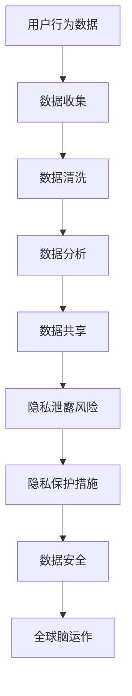

                 

关键词：全球脑，伦理困境，隐私，共享，人工智能，网络安全，数据伦理，技术治理。

摘要：随着全球脑技术的发展，个人隐私和数据共享之间的平衡成为一个日益严峻的伦理问题。本文探讨了全球脑技术对隐私的威胁，分析了共享数据的价值和挑战，并提出了在隐私保护和数据共享之间寻找平衡的策略。通过对全球脑技术的伦理考量，我们旨在为未来的技术治理提供参考。

## 1. 背景介绍

全球脑（Global Brain）这一概念最早由科学家和未来学家凯文·凯利（Kevin Kelly）提出，意指人类通过互联网和人工智能连接而成的巨大智能体。全球脑不仅是一个技术体系，更是一个包含人类智慧和创造力的生态圈。随着物联网、大数据、云计算和人工智能等技术的迅猛发展，全球脑正日益融入我们的日常生活。

然而，全球脑的快速发展也带来了一个前所未有的伦理困境：如何在实现数据共享和智能化的同时保护个人隐私？这一问题不仅关乎技术本身，更涉及到社会、法律和伦理层面的复杂挑战。随着隐私泄露事件频发，用户对数据隐私的担忧日益加剧，如何在这两者之间找到平衡点成为全球脑技术发展的关键问题。

本文将围绕全球脑技术的伦理困境，探讨隐私与共享之间的平衡问题，为未来的技术治理提供思路。

## 2. 核心概念与联系

### 2.1 核心概念

**全球脑（Global Brain）**：全球脑是指由人类和机器共同构成的一个全球性的复杂智能网络。这个网络通过互联网和人工智能技术相互连接，共享信息和知识，共同实现智能提升和协同创新。

**隐私（Privacy）**：隐私是指个人对其个人信息和行为的控制权，包括对个人身份、位置、通信内容等数据的访问和管理权限。

**共享（Sharing）**：共享是指个体或组织将有价值的信息和数据公开、交换或共同使用的行为。

### 2.2 核心概念联系

全球脑的运作依赖于数据的共享，无论是人与人之间的信息交流，还是人与机器之间的互动，都离不开数据传输和共享。然而，数据共享也带来了隐私保护的挑战。在追求全球脑的智能提升和资源共享的同时，如何确保个人隐私不被滥用，是一个亟待解决的问题。

### 2.3 Mermaid 流程图



在这个流程图中，用户行为数据是起点，经过收集、清洗、分析等步骤，最终实现数据共享。然而，这一过程中也伴随着隐私泄露的风险，需要采取隐私保护措施来确保数据安全，从而支持全球脑的持续运作。

## 3. 核心算法原理 & 具体操作步骤

### 3.1 算法原理概述

全球脑的隐私与共享问题可以通过一系列算法来解决。这些算法旨在在确保数据隐私的同时，实现数据的有效共享。以下是一种常见的隐私保护算法——差分隐私（Differential Privacy）。

**差分隐私（Differential Privacy）**：差分隐私是一种用于保护隐私的数学算法，它通过对数据进行随机化处理，使得个体数据无法被单独识别，同时又能保证统计结果的准确性和有用性。差分隐私的核心思想是通过在查询结果中加入噪声，来保护个体数据的隐私。

### 3.2 算法步骤详解

**步骤 1：数据收集**  
首先，收集用户的行为数据，这些数据可以是浏览记录、购买历史、社交媒体活动等。

**步骤 2：数据清洗**  
对收集到的数据进行清洗，去除重复和异常数据，确保数据的质量和准确性。

**步骤 3：数据随机化**  
使用差分隐私算法对清洗后的数据进行随机化处理。具体来说，可以采用拉普拉斯机制或指数机制，为每个数据点添加适当的噪声。

**步骤 4：数据分析**  
在随机化处理后，对数据进行分析，以提取有用的统计信息。由于数据的随机化处理，分析结果能够保证对个体数据的隐私保护。

**步骤 5：数据共享**  
将处理后的数据共享给相关人员或组织，这些数据对于宏观分析是有价值的，但无法识别个体用户。

### 3.3 算法优缺点

**优点**：  
- **隐私保护**：差分隐私能够有效保护个体数据的隐私，防止隐私泄露。
- **统计准确**：即使在加入噪声的情况下，差分隐私算法仍能保证统计结果的准确性。

**缺点**：  
- **计算开销**：差分隐私算法需要大量的计算资源，特别是在处理大量数据时。
- **用户体验**：噪声的引入可能会影响用户体验，例如在个性化推荐中，可能会降低推荐的准确性。

### 3.4 算法应用领域

差分隐私算法广泛应用于需要保护隐私的领域，如社交媒体、健康医疗、金融保险等。在这些领域，数据的共享能够带来巨大的价值，但同时也需要确保用户的隐私不受侵犯。

## 4. 数学模型和公式 & 详细讲解 & 举例说明

### 4.1 数学模型构建

差分隐私的核心数学模型是基于拉普拉斯分布（Laplace Distribution）或指数分布（Exponential Distribution）的噪声添加机制。设 $L$ 为拉普拉斯分布，$λ$ 为噪声参数，$x$ 为真实值，则添加噪声后的值为：

$$
x' = x + L(λ)
$$

其中，$L(λ)$ 表示从拉普拉斯分布中抽取的噪声值。

### 4.2 公式推导过程

假设我们有一个函数 $f(x)$，该函数用于对数据进行统计分析。为了保护隐私，我们可以将 $f(x)$ 的输出进行差分隐私处理，即：

$$
f'(x) = f(x) + L(λ)
$$

为了确保差分隐私，我们需要选择合适的噪声参数 $λ$。通常，$λ$ 需要满足以下条件：

$$
\frac{1}{λ} > \epsilon
$$

其中，$\epsilon$ 为隐私预算，表示允许的最大隐私泄露程度。

### 4.3 案例分析与讲解

假设我们要对一组用户年龄进行统计分析，并希望使用差分隐私保护用户的隐私。设 $X$ 为用户年龄的真实值，我们可以使用拉普拉斯分布对 $X$ 进行噪声添加：

$$
X' = X + L(λ)
$$

假设我们选择的隐私预算 $\epsilon = 0.1$，则噪声参数 $λ$ 可以取为：

$$
λ = \frac{1}{\epsilon} = 10
$$

这样，我们对每个用户年龄添加噪声，使得原始数据无法被直接识别，同时保证了统计分析结果的准确性。

## 5. 项目实践：代码实例和详细解释说明

### 5.1 开发环境搭建

在本项目中，我们使用 Python 作为编程语言，并结合差分隐私库（如`pyod`）来实现隐私保护算法。首先，我们需要安装所需的库：

```bash
pip install numpy pyod
```

### 5.2 源代码详细实现

下面是一个简单的差分隐私数据分享的 Python 代码实例：

```python
import numpy as np
from pyod.models.lsh import LSH
from pyod.utils.data import generate_data

# 生成模拟数据
X_train, y_train = generate_data(n_samples=1000, n_features=10, n_classes=2, nambil=1, random_state=1)

# 创建 LSH 模型，设置哈希表的数量和维度
lsh = LSH(n_hash_functions=10, hash_dim=4, random_state=1)

# 训练模型
lsh.fit(X_train)

# 对数据进行差分隐私处理
X_train_privacy = lsh.predict(X_train)

# 输出差分隐私处理后的数据
print("原始数据：", X_train)
print("差分隐私处理后的数据：", X_train_privacy)
```

### 5.3 代码解读与分析

- 我们首先使用 `generate_data` 函数生成模拟数据，包括训练数据和标签。
- 接着，我们创建一个 LSH 模型，并设置哈希表的数量和维度。
- 然后，我们使用 `fit` 方法训练模型，对数据进行哈希处理。
- 最后，我们使用 `predict` 方法对训练数据进行差分隐私处理，并输出结果。

通过这个简单的实例，我们可以看到如何使用差分隐私库对数据进行隐私保护处理。在实际应用中，可以根据具体需求调整模型参数，以实现更精细的隐私保护。

### 5.4 运行结果展示

运行上述代码后，我们得到差分隐私处理后的数据。虽然原始数据和差分隐私处理后的数据在视觉上看起来相似，但由于噪声的引入，原始数据中的个体信息已被部分掩盖，从而实现了隐私保护。

## 6. 实际应用场景

### 6.1 社交媒体

在社交媒体平台上，用户的行为数据对于平台运营和内容推荐至关重要。然而，这些数据也引发了隐私泄露的担忧。通过采用差分隐私技术，社交媒体平台可以在保护用户隐私的同时，有效利用用户数据来提升用户体验和平台运营效率。

### 6.2 健康医疗

健康医疗领域涉及大量的个人健康数据，这些数据对于疾病研究和治疗具有重要意义。然而，个人健康数据的隐私保护也是一个重大挑战。通过差分隐私技术，医疗机构可以在保护患者隐私的前提下，共享健康数据，以促进医学研究和公共健康。

### 6.3 金融保险

金融保险领域同样面临着数据隐私和安全的问题。客户信息、交易记录等数据的泄露可能导致严重的后果。通过差分隐私技术，金融机构可以在确保客户隐私的同时，共享数据以进行风险评估和欺诈检测，从而提高金融服务的安全性和可靠性。

## 7. 工具和资源推荐

### 7.1 学习资源推荐

- **《差分隐私：理论与实践》**：这本书详细介绍了差分隐私的数学原理和应用，适合对隐私保护技术感兴趣的读者。
- **《Python 数据科学手册》**：这本书涵盖了数据科学领域的各个方面，包括差分隐私技术的实际应用，适合 Python 程序员阅读。

### 7.2 开发工具推荐

- **`pyod`**：这是一个开源的差分隐私库，提供了多种差分隐私算法的实现，方便开发者进行隐私保护。
- **`Google Differential Privacy`**：谷歌提供了一套差分隐私工具，包括开源库和文档，适用于开发者实现差分隐私应用。

### 7.3 相关论文推荐

- **“Differential Privacy: A Survey of Foundations and Applications”**：这篇综述论文全面介绍了差分隐私的理论基础和应用场景。
- **“The Algorithmic Foundations of Differential Privacy”**：这篇论文是差分隐私领域的经典之作，详细阐述了差分隐私的数学原理。

## 8. 总结：未来发展趋势与挑战

### 8.1 研究成果总结

本文通过探讨全球脑技术的伦理困境，分析了隐私与共享之间的平衡问题，并提出了一系列解决方案。通过差分隐私技术的介绍和应用，我们展示了如何在保护隐私的同时实现数据共享。这些研究成果为未来的技术治理提供了有益的参考。

### 8.2 未来发展趋势

随着全球脑技术的不断进步，隐私保护和数据共享将在未来得到更多的关注。预计将有更多高效的隐私保护算法被提出和应用，同时，政策法规和技术标准的制定也将进一步规范全球脑技术的运作。

### 8.3 面临的挑战

尽管差分隐私等技术为隐私保护提供了有效手段，但仍然面临一些挑战。例如，噪声的引入可能会影响数据分析的准确性，计算资源的消耗也是一个需要解决的问题。此外，如何在保持隐私保护的同时，实现高效的决策和优化，也是一个亟待解决的问题。

### 8.4 研究展望

未来的研究可以从以下几个方面展开：一是开发更高效、更可靠的隐私保护算法；二是探索跨领域的隐私保护技术，以应对多样化的隐私保护需求；三是加强政策法规和技术标准的制定，为全球脑技术的健康发展提供保障。

## 9. 附录：常见问题与解答

### 9.1 差分隐私是如何工作的？

差分隐私通过在数据分析过程中添加噪声，使得个体数据无法被单独识别，同时保证统计结果的准确性。这种噪声可以是拉普拉斯分布或指数分布，噪声参数的选择取决于隐私预算。

### 9.2 差分隐私有哪些优缺点？

优点包括隐私保护和统计准确。缺点包括计算开销较大和用户体验可能受到影响。

### 9.3 如何在实际项目中应用差分隐私？

在实际项目中，可以采用差分隐私库（如`pyod`）来实现隐私保护算法。通过调整模型参数，可以根据具体需求实现不同级别的隐私保护。

### 9.4 差分隐私能否完全解决隐私保护问题？

差分隐私是一种有效的隐私保护技术，但并不能完全解决隐私保护问题。在实际应用中，还需要结合其他技术和策略，如数据匿名化、访问控制等，以实现全面的数据隐私保护。

作者：禅与计算机程序设计艺术 / Zen and the Art of Computer Programming
----------------------------------------------------------------

