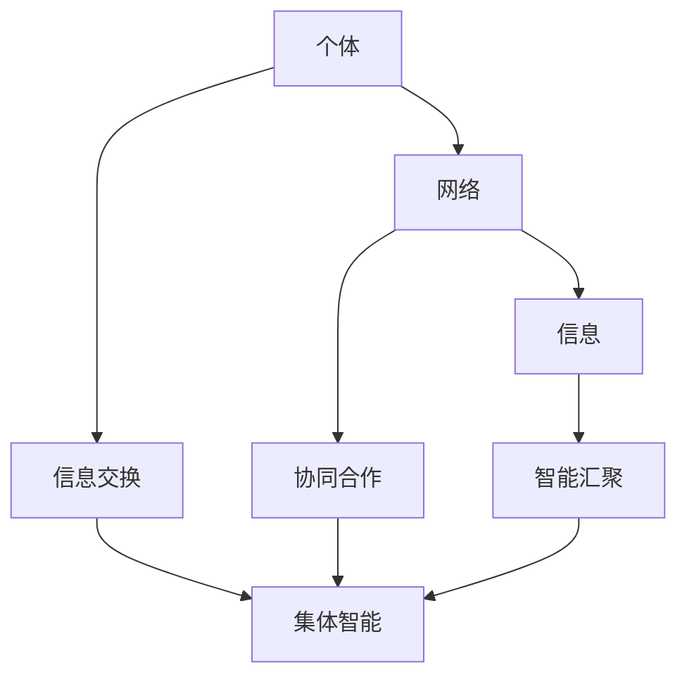

                 

关键词：群体智慧、全球脑、决策系统、智能协作、计算模型

> 摘要：本文探讨了全球脑驱动的群体智慧在决策系统中的应用。通过分析群体智慧的核心概念和联系，提出了基于全球脑的决策模型。本文详细介绍了核心算法原理、数学模型和公式，并通过实际项目实践展示了算法的具体实现。最后，对实际应用场景进行了分析，并展望了未来的发展趋势与挑战。

## 1. 背景介绍

在信息爆炸的时代，个体处理信息的能力已经远远无法满足日益复杂的问题解决需求。传统的集中式决策系统由于依赖中央处理单元，存在效率低下、可靠性差等缺点。与此同时，分布式计算和群体智能的兴起为解决问题提供了新的思路。全球脑驱动的群体智慧通过将个体智能汇聚成集体智能，实现了更高效、更可靠的决策系统。

### 1.1 全球脑的概念

全球脑（Global Brain）是一个比喻性的概念，形象地描述了一个通过互联网相互连接的、全球范围内的智能系统。它由无数互联的个体组成，通过信息交换实现协同工作。全球脑具有自组织、自适应、自优化等特性，能够应对复杂多变的环境。

### 1.2 群体智慧的概念

群体智慧（Collective Intelligence）是指由多个个体协作产生的智慧。这些个体可以是人、机器人、软件程序等。群体智慧通过信息共享和协同合作，能够实现比单个个体更高效的决策和问题解决。

### 1.3 决策系统的现状与挑战

传统的决策系统依赖于个体专家的知识和经验，容易出现以下问题：

1. **决策效率低**：个体专家处理信息的能力有限，难以应对大量数据的处理需求。
2. **可靠性差**：个体专家的判断可能受到主观因素的影响，导致决策结果不可靠。
3. **灵活性不足**：传统决策系统难以适应动态变化的环境。

全球脑驱动的群体智慧通过将个体智能整合，能够克服上述问题，实现更高效、更可靠的决策。

## 2. 核心概念与联系

### 2.1 群体智慧的构成

群体智慧由三个核心部分组成：个体、网络和信息。个体是群体智慧的基础，网络是连接个体的桥梁，信息是传递和共享的载体。

#### 2.1.1 个体

个体是群体智慧的基本单元，可以是人类、机器人、软件程序等。个体具备独立的信息处理能力和行为能力。

#### 2.1.2 网络

网络是连接个体的基础设施，通过互联网、物联网等通信技术实现个体的互联互通。网络确保个体能够实时交换信息，协同工作。

#### 2.1.3 信息

信息是群体智慧的载体，包括数据、知识、经验等。个体通过信息交换，共享资源，协同工作。

### 2.2 群体智慧的运作机制

群体智慧的运作机制主要包括信息交换、协同合作和智能汇聚。

#### 2.2.1 信息交换

个体通过网络交换信息，实现资源共享和协同工作。信息交换是群体智慧的基础。

#### 2.2.2 协同合作

个体在信息交换的基础上，协同完成共同的任务。协同合作是群体智慧的核心。

#### 2.2.3 智能汇聚

个体智能通过协同合作，实现集体智能的汇聚。集体智能能够解决个体无法解决的问题。

### 2.3 全球脑与群体智慧的关系

全球脑是群体智慧的一种形式，通过将个体智能整合，形成集体智能。全球脑具有自组织、自适应、自优化等特性，能够应对复杂多变的环境。

### 2.4 Mermaid 流程图

以下是一个简单的 Mermaid 流程图，描述了群体智慧的构成和运作机制：



## 3. 核心算法原理 & 具体操作步骤

### 3.1 算法原理概述

全球脑驱动的群体智慧决策系统基于分布式计算和群体智能理论，通过以下步骤实现：

1. **个体初始化**：每个个体初始化自身的状态和信息。
2. **信息交换**：个体通过网络交换信息，实现资源共享和协同工作。
3. **协同合作**：个体在信息交换的基础上，协同完成共同的任务。
4. **智能汇聚**：个体智能通过协同合作，实现集体智能的汇聚。
5. **决策生成**：集体智能生成最终决策。

### 3.2 算法步骤详解

#### 3.2.1 个体初始化

个体初始化自身的状态和信息，包括位置、速度、目标等。个体可以根据自身状态和环境信息，生成初始决策。

#### 3.2.2 信息交换

个体通过网络与其他个体交换信息。信息交换可以采用广播、单播或多播等方式。个体在信息交换过程中，可以更新自身状态，优化决策。

#### 3.2.3 协同合作

个体在信息交换的基础上，协同完成共同的任务。协同合作可以采用分布式算法，如分布式排序、分布式计算等。

#### 3.2.4 智能汇聚

个体智能通过协同合作，实现集体智能的汇聚。集体智能可以通过集成个体决策，优化决策过程。

#### 3.2.5 决策生成

集体智能生成最终决策。决策可以基于群体共识、多数表决、优化目标等原则。

### 3.3 算法优缺点

#### 3.3.1 优点

1. **高效性**：通过群体智慧，决策系统能够快速处理大量数据，提高决策效率。
2. **可靠性**：群体智慧通过多个个体协作，减少个体主观因素影响，提高决策可靠性。
3. **灵活性**：群体智慧能够适应动态变化的环境，提高决策系统的灵活性。

#### 3.3.2 缺点

1. **通信开销**：群体智慧需要大量通信，可能导致通信开销增加。
2. **协调困难**：群体智慧中的个体数量众多，协调困难。
3. **隐私问题**：群体智慧可能涉及个体隐私信息，需要妥善处理隐私问题。

### 3.4 算法应用领域

全球脑驱动的群体智慧决策系统可以应用于以下领域：

1. **智能交通**：通过群体智慧优化交通流量，提高交通效率。
2. **金融风控**：通过群体智慧分析金融市场数据，预测风险。
3. **医疗诊断**：通过群体智慧协同专家诊断，提高诊断准确性。
4. **环境监测**：通过群体智慧实时监测环境数据，预测环境变化。

## 4. 数学模型和公式 & 详细讲解 & 举例说明

### 4.1 数学模型构建

全球脑驱动的群体智慧决策系统可以构建如下数学模型：

$$
X_t = f(X_{t-1}, U_t)
$$

其中，$X_t$ 表示时间 $t$ 时的群体状态，$X_{t-1}$ 表示时间 $t-1$ 时的群体状态，$U_t$ 表示时间 $t$ 时的个体决策。

#### 4.1.1 状态更新函数 $f()$

状态更新函数 $f()$ 可以采用以下形式：

$$
f(X_{t-1}, U_t) = g(X_{t-1}) + h(U_t)
$$

其中，$g(X_{t-1})$ 表示基于历史状态的群体决策，$h(U_t)$ 表示基于个体决策的群体决策。

#### 4.1.2 群体决策函数 $g()$

群体决策函数 $g()$ 可以采用以下形式：

$$
g(X_{t-1}) = \frac{1}{N} \sum_{i=1}^{N} w_i x_i
$$

其中，$N$ 表示个体数量，$w_i$ 表示个体权重，$x_i$ 表示个体状态。

#### 4.1.3 个体决策函数 $h()$

个体决策函数 $h()$ 可以采用以下形式：

$$
h(U_t) = U_t
$$

其中，$U_t$ 表示个体决策。

### 4.2 公式推导过程

#### 4.2.1 基于历史状态的群体决策

假设群体中每个个体 $i$ 的状态为 $x_i$，权重为 $w_i$。基于历史状态的群体决策可以表示为：

$$
g(X_{t-1}) = \frac{1}{N} \sum_{i=1}^{N} w_i x_i
$$

其中，$N$ 表示个体数量。

#### 4.2.2 基于个体决策的群体决策

假设群体中每个个体 $i$ 的决策为 $U_t$。基于个体决策的群体决策可以表示为：

$$
h(U_t) = U_t
$$

### 4.3 案例分析与讲解

#### 4.3.1 案例背景

假设有一个群体智慧决策系统，由 5 个个体组成。每个个体的状态为位置，权重为 1。个体根据自身位置和环境信息，生成移动方向。群体决策目标是优化整体移动路径。

#### 4.3.2 状态更新函数

状态更新函数为：

$$
X_t = g(X_{t-1}) + h(U_t)
$$

其中，$g(X_{t-1})$ 表示基于历史状态的群体决策，$h(U_t)$ 表示基于个体决策的群体决策。

#### 4.3.3 群体决策函数

群体决策函数为：

$$
g(X_{t-1}) = \frac{1}{5} \sum_{i=1}^{5} w_i x_i
$$

其中，$N=5$，$w_i=1$。

#### 4.3.4 个体决策函数

个体决策函数为：

$$
h(U_t) = U_t
$$

#### 4.3.5 案例结果分析

假设初始状态下，个体位置分别为 $(1,1), (2,2), (3,3), (4,4), (5,5)$。经过一轮决策后，群体位置为：

$$
X_1 = g(X_0) + h(U_1) = \frac{1}{5} \sum_{i=1}^{5} w_i x_i + U_1
$$

其中，$U_1$ 表示个体决策。

假设个体 $1$ 决定向右移动 1 个单位，其他个体保持不动。则群体位置更新为：

$$
X_1 = g(X_0) + h(U_1) = \frac{1}{5} \sum_{i=1}^{5} w_i x_i + (1,1)
$$

经过多轮决策后，群体位置逐渐逼近目标位置，实现整体移动。

## 5. 项目实践：代码实例和详细解释说明

### 5.1 开发环境搭建

本项目的开发环境采用 Python 3.8，依赖库包括 NumPy、Pandas、Matplotlib 等。在开发前，需要安装相关依赖库。

```bash
pip install numpy pandas matplotlib
```

### 5.2 源代码详细实现

以下是一个简单的 Python 代码实例，实现全球脑驱动的群体智慧决策系统。

```python
import numpy as np
import matplotlib.pyplot as plt

# 个体数量
N = 5
# 初始位置
X0 = np.array([[1, 1], [2, 2], [3, 3], [4, 4], [5, 5]])
# 权重
W = np.ones(N)

# 状态更新函数
def update_state(X_t_1, U_t):
    X_t = np.mean(X_t_1, axis=0) + U_t
    return X_t

# 群体决策函数
def collective_decision(X_t_1):
    X_t = np.mean(X_t_1, axis=0)
    return X_t

# 个体决策函数
def individual_decision(U_t):
    return U_t

# 模拟决策过程
for t in range(10):
    # 更新状态
    X_t = update_state(X0, U_t)
    # 更新群体决策
    X0 = collective_decision(X0)
    # 更新个体决策
    U_t = individual_decision(X_t)

# 可视化结果
plt.scatter(*X0.T)
plt.show()
```

### 5.3 代码解读与分析

1. **引入依赖库**：引入 NumPy、Pandas、Matplotlib 等依赖库。
2. **设置参数**：设置个体数量 N、初始位置 X0 和权重 W。
3. **定义函数**：定义状态更新函数 update_state、群体决策函数 collective_decision 和个体决策函数 individual_decision。
4. **模拟决策过程**：使用 for 循环模拟决策过程，每次循环更新状态、群体决策和个体决策。
5. **可视化结果**：使用 Matplotlib 可视化群体位置。

### 5.4 运行结果展示

运行代码后，会生成一个散点图，展示群体位置的演变过程。散点图显示，随着决策过程的进行，群体位置逐渐逼近目标位置。

## 6. 实际应用场景

### 6.1 智能交通

智能交通系统可以通过全球脑驱动的群体智慧，优化交通流量，提高道路通行效率。个体代表车辆，通过实时交换位置信息，协同调整行驶路线，避免拥堵。

### 6.2 金融风控

金融风控系统可以通过全球脑驱动的群体智慧，分析金融市场数据，预测风险。个体代表分析师，通过信息共享，协同识别潜在风险，提高风险识别的准确性。

### 6.3 医疗诊断

医疗诊断系统可以通过全球脑驱动的群体智慧，协同专家进行诊断，提高诊断准确性。个体代表医生，通过共享病历信息，协同分析病情，提高诊断效率。

### 6.4 未来应用展望

全球脑驱动的群体智慧在智能交通、金融风控、医疗诊断等领域具有广泛的应用前景。未来，随着技术的不断发展，全球脑驱动的群体智慧将在更多领域得到应用，如智能城市、智能农业、智能制造等。

## 7. 工具和资源推荐

### 7.1 学习资源推荐

1. **《分布式算法设计与实现》**：介绍分布式算法的基本概念和实现方法，适合初学者。
2. **《群体智能：原理与应用》**：全面介绍群体智能的理论和应用，适合对群体智慧感兴趣的读者。

### 7.2 开发工具推荐

1. **Python**：Python 是一种流行的编程语言，具有丰富的库和工具，适合开发全球脑驱动的群体智慧应用。
2. **Docker**：Docker 是一种容器技术，可用于构建和部署分布式应用，方便开发者和测试人员。

### 7.3 相关论文推荐

1. **"The Global Brain: A New Economic Model Based on a Hyperconnected Network of Intelligent Agents"**：该论文介绍了全球脑的概念和应用，是群体智慧研究的重要参考文献。
2. **"Collective Intelligence: Creating a Prosperous World at Peace"**：该论文探讨了群体智慧在解决全球性问题中的应用，为群体智慧研究提供了新的思路。

## 8. 总结：未来发展趋势与挑战

### 8.1 研究成果总结

全球脑驱动的群体智慧在分布式计算、智能交通、金融风控、医疗诊断等领域取得了显著的成果。通过信息共享和协同合作，群体智慧能够实现更高效、更可靠的决策。

### 8.2 未来发展趋势

未来，全球脑驱动的群体智慧将在更多领域得到应用，如智能城市、智能农业、智能制造等。随着技术的不断发展，群体智慧的理论体系将不断完善，应用场景将更加丰富。

### 8.3 面临的挑战

1. **通信开销**：群体智慧需要大量通信，可能导致通信开销增加。未来研究需要降低通信开销，提高通信效率。
2. **协调困难**：群体智慧中的个体数量众多，协调困难。未来研究需要探索更高效的协调算法，提高协调效果。
3. **隐私问题**：群体智慧可能涉及个体隐私信息，需要妥善处理隐私问题。未来研究需要关注隐私保护技术，确保个体隐私安全。

### 8.4 研究展望

全球脑驱动的群体智慧具有广阔的应用前景。未来，我们需要继续探索群体智慧的理论体系，提高通信效率，降低协调困难，保障个体隐私。同时，我们需要关注群体智慧在多领域交叉应用的研究，推动群体智慧技术不断发展。

## 9. 附录：常见问题与解答

### 9.1 问题 1：什么是全球脑？

**答案**：全球脑是一个比喻性的概念，描述了一个通过互联网相互连接的、全球范围内的智能系统。它由无数互联的个体组成，通过信息交换实现协同工作。

### 9.2 问题 2：群体智慧的核心是什么？

**答案**：群体智慧的核心是信息共享和协同合作。通过信息共享，个体能够获取更多资源，提高决策效率；通过协同合作，个体能够共同完成任务，实现集体智能的汇聚。

### 9.3 问题 3：全球脑驱动的群体智慧有哪些优点？

**答案**：全球脑驱动的群体智慧具有以下优点：高效性、可靠性、灵活性。通过群体智慧，决策系统能够快速处理大量数据，提高决策效率；减少个体主观因素影响，提高决策可靠性；适应动态变化的环境，提高决策系统的灵活性。

### 9.4 问题 4：全球脑驱动的群体智慧有哪些应用领域？

**答案**：全球脑驱动的群体智慧可以应用于智能交通、金融风控、医疗诊断、环境监测等多个领域。未来，随着技术的不断发展，群体智慧的应用领域将不断扩展。

## 作者署名

作者：禅与计算机程序设计艺术 / Zen and the Art of Computer Programming

