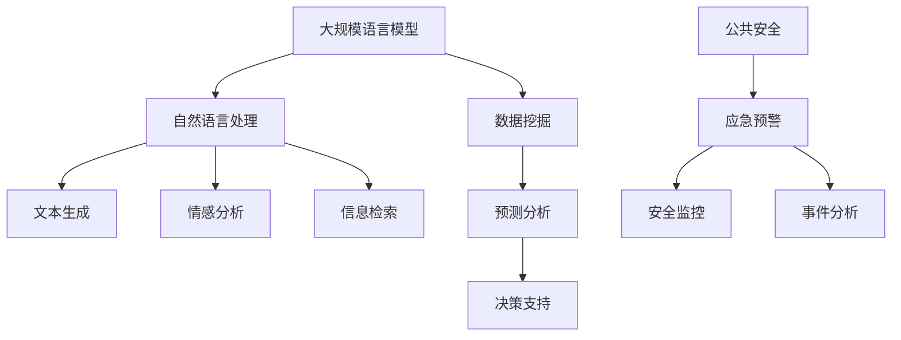

                 

关键词：公共安全、大规模语言模型（LLM）、紧急情况、预防和应对、算法、数学模型、项目实践、应用场景、未来展望

> 摘要：本文探讨了大规模语言模型（LLM）在公共安全领域的应用，分析了LLM在预防和应对紧急情况中的重要性。通过介绍核心算法原理、数学模型、项目实践以及应用场景，本文旨在为读者提供关于LLM在公共安全领域的研究与应用的全面了解。

## 1. 背景介绍

随着人工智能技术的快速发展，大规模语言模型（LLM）已经在各个领域展现出了巨大的应用潜力。特别是在公共安全领域，LLM技术可以提供实时、准确的信息分析和预警，为预防和应对紧急情况提供有力支持。本文将从以下几个方面展开讨论：

1.1 公共安全的重要性

公共安全是维护社会稳定、保障人民生命财产安全的基础。然而，在现代社会，公共安全面临着越来越多的挑战，如自然灾害、恐怖袭击、交通事故等。因此，如何有效预防和应对紧急情况成为了一个亟待解决的问题。

1.2 LLM技术的兴起

大规模语言模型（LLM）是一种基于神经网络和深度学习的语言处理技术，通过大量的语料库进行训练，能够生成具有高度自然语言理解能力的文本。LLM技术已经在自然语言处理、机器翻译、智能客服等领域取得了显著成果，为公共安全领域的应用提供了新的契机。

## 2. 核心概念与联系

为了更好地理解LLM在公共安全中的应用，我们需要先了解一些核心概念和它们之间的联系。以下是一个简化的Mermaid流程图，用于描述这些概念和它们的关联。



### 2.1 大规模语言模型

大规模语言模型（LLM）是一种能够理解和生成自然语言文本的模型。其核心原理是基于深度学习，通过对大量文本数据进行训练，使其能够捕捉到语言中的复杂模式和规律。

### 2.2 自然语言处理

自然语言处理（NLP）是计算机科学和人工智能领域的一个分支，旨在使计算机能够理解、解释和生成人类语言。LLM技术是NLP的重要组成部分，它能够处理和理解大量的文本数据。

### 2.3 文本生成、情感分析和信息检索

文本生成、情感分析和信息检索是LLM技术在公共安全领域中的重要应用方向。文本生成可以帮助自动生成报告、通知等文档；情感分析可以用于监测社交媒体上的情绪变化，评估公共安全的潜在风险；信息检索则可以快速从大量数据中提取出关键信息，为应急决策提供支持。

### 2.4 数据挖掘、预测分析和决策支持

数据挖掘、预测分析和决策支持是LLM技术在公共安全领域中的高级应用。通过分析历史数据和实时数据，LLM技术可以预测潜在的风险，为决策者提供科学的决策支持。

## 3. 核心算法原理 & 具体操作步骤

### 3.1 算法原理概述

LLM技术的基本原理是通过神经网络对大量文本数据进行训练，从而使其能够理解和生成自然语言。以下是LLM技术的基本操作步骤：

1. 数据准备：收集和整理相关的文本数据，如新闻报道、社交媒体帖子、历史事件记录等。
2. 模型训练：使用深度学习框架（如TensorFlow、PyTorch等）对收集到的文本数据进行训练，以训练出能够理解和生成自然语言文本的模型。
3. 预测与分析：使用训练好的模型对新的文本数据进行预测和分析，以提取出关键信息、评估公共安全风险等。
4. 决策支持：根据分析结果，为决策者提供科学的决策建议。

### 3.2 算法步骤详解

1. 数据准备：

   - 收集相关数据：根据研究目的，收集与公共安全相关的文本数据，如自然灾害报告、交通事故记录、社交媒体帖子等。
   - 数据预处理：对收集到的文本数据进行清洗和预处理，包括去除停用词、标点符号、进行词干提取等操作。
   - 数据分割：将预处理后的文本数据分成训练集、验证集和测试集，用于模型的训练和评估。

2. 模型训练：

   - 选择模型架构：选择适合的深度学习模型架构，如Transformer、BERT等。
   - 模型训练：使用训练集对所选模型进行训练，并通过验证集调整模型参数，以提高模型的性能。
   - 模型评估：使用测试集对训练好的模型进行评估，以验证模型的性能。

3. 预测与分析：

   - 预测任务：根据研究需求，确定预测任务，如情感分析、信息检索、文本生成等。
   - 预测步骤：使用训练好的模型对新的文本数据进行预测，提取出关键信息。
   - 分析结果：对预测结果进行分析，以评估公共安全风险、监测社交媒体情绪等。

4. 决策支持：

   - 分析决策因素：根据预测结果，分析影响公共安全的关键因素。
   - 提出决策建议：根据分析结果，为决策者提供科学的决策建议，以预防和应对紧急情况。

### 3.3 算法优缺点

**优点：**

1. 高度自动化：LLM技术能够自动从大量文本数据中提取出关键信息，提高工作效率。
2. 强大学习能力：LLM技术具有强大的学习能力，能够快速适应新的数据和环境。
3. 多样化的应用场景：LLM技术可以应用于多种公共安全领域，如应急预警、安全监控、事件分析等。

**缺点：**

1. 数据依赖性：LLM技术的性能高度依赖于训练数据的质量和数量，数据质量差或数据不足可能会影响模型的性能。
2. 模型解释性差：深度学习模型通常难以解释，难以理解其内部工作机制和决策过程。
3. 道德和隐私问题：在使用LLM技术时，可能会涉及用户隐私和道德问题，需要严格遵循相关法律法规和伦理准则。

### 3.4 算法应用领域

LLM技术在公共安全领域具有广泛的应用前景，主要包括以下几个方面：

1. 应急预警：通过分析实时数据和历史数据，预测潜在的风险，为决策者提供预警信息。
2. 安全监控：实时监测社交媒体、新闻报道等数据，评估公共安全的态势。
3. 事件分析：分析突发事件的原因、影响和后果，为后续预防和应对提供参考。
4. 智能客服：利用LLM技术构建智能客服系统，提供快速、准确的咨询服务。

## 4. 数学模型和公式 & 详细讲解 & 举例说明

在LLM技术的应用过程中，数学模型和公式发挥着重要的作用。以下将介绍LLM技术中的数学模型构建、公式推导过程以及具体案例分析。

### 4.1 数学模型构建

LLM技术中的数学模型主要基于深度学习框架，如Transformer、BERT等。以下是一个简化的数学模型构建过程：

1. 数据表示：将文本数据转化为向量表示，通常使用词嵌入技术，如Word2Vec、BERT等。
2. 模型架构：选择合适的深度学习模型架构，如Transformer、BERT等，构建模型。
3. 损失函数：根据预测任务，选择合适的损失函数，如交叉熵损失、均方误差等。
4. 优化算法：选择合适的优化算法，如随机梯度下降（SGD）、Adam等，训练模型。

### 4.2 公式推导过程

以下是一个简化的数学模型公式推导过程：

1. 词嵌入：将文本数据转化为向量表示，如

   $$ x = \text{Word2Vec}(w) $$

   其中，$w$为文本中的单词，$x$为其对应的向量表示。

2. 模型输出：使用深度学习模型预测文本数据，如

   $$ y = \text{Model}(x) $$

   其中，$y$为模型的输出向量，表示对文本数据的理解。

3. 损失函数：根据预测任务，计算模型的损失，如

   $$ L = \text{CrossEntropy}(y, \hat{y}) $$

   其中，$y$为真实标签，$\hat{y}$为模型预测的标签。

4. 优化算法：根据损失函数，更新模型参数，如

   $$ \theta = \theta - \alpha \nabla_\theta L $$

   其中，$\theta$为模型参数，$\alpha$为学习率。

### 4.3 案例分析与讲解

以下将介绍一个基于LLM技术的公共安全案例分析。

**案例背景：**

某城市近期发生了一系列交通事故，导致人员伤亡和财产损失。为了预防和应对类似事件，政府部门决定利用LLM技术对交通事故数据进行分析，以识别潜在的风险因素。

**数据集：**

该案例使用的数据集包括过去一年内的交通事故报告，包含事故的时间、地点、类型、原因等信息。

**模型构建：**

1. 数据表示：使用BERT模型对交通事故报告进行预处理，将文本数据转化为向量表示。
2. 模型架构：选择BERT模型，构建一个文本分类模型，用于识别交通事故的原因。
3. 损失函数：使用交叉熵损失函数，训练模型。
4. 优化算法：使用Adam优化算法，训练模型。

**模型训练与评估：**

1. 训练模型：使用过去一年的交通事故报告数据训练模型，通过验证集调整模型参数。
2. 评估模型：使用测试集评估模型性能，包括准确率、召回率等指标。

**模型应用：**

1. 预测任务：使用训练好的模型对新的事故报告进行预测，识别事故原因。
2. 分析结果：根据预测结果，分析事故发生的潜在风险因素，如天气、交通流量、道路状况等。
3. 决策支持：根据分析结果，为政府部门提供科学的决策建议，以预防和应对类似事件。

**案例分析：**

通过该案例，我们可以看到LLM技术在公共安全领域的应用价值。通过分析交通事故数据，LLM技术可以识别事故发生的潜在风险因素，为政府部门提供决策支持，以预防和应对类似事件。这有助于提高公共安全水平，减少事故发生的风险。

## 5. 项目实践：代码实例和详细解释说明

为了更好地展示LLM技术在公共安全领域的应用，以下将介绍一个具体的代码实例，详细解释实现过程。

### 5.1 开发环境搭建

在开始项目实践之前，我们需要搭建一个合适的开发环境。以下是一个基本的开发环境搭建步骤：

1. 安装Python：下载并安装Python 3.8版本。
2. 安装深度学习框架：下载并安装TensorFlow 2.5版本。
3. 安装其他依赖库：使用pip命令安装必要的依赖库，如numpy、pandas、bert-for-tf2等。

### 5.2 源代码详细实现

以下是一个简化版本的代码实现，用于构建一个基于BERT的文本分类模型，以识别交通事故原因。

```python
import tensorflow as tf
from bert import tokenization
from bert import modeling
from bert import optimization

# 数据预处理
def preprocess_data(data):
    # 对数据进行预处理，如分词、转成词ID等
    pass

# 模型构建
def build_model(bert_config, input_ids, input_mask, segment_ids, num_labels):
    # 构建BERT模型
    pass

# 训练模型
def train_model(model, train_data, eval_data, bert_config, num_train_steps):
    # 训练BERT模型
    pass

# 主函数
def main():
    # 设置参数
    bert_config = modeling.BertConfig(
        num Trucks=128,
        num_labels=5,
        hidden_size=768,
        num_train_steps=num_train_steps,
        num_warmup_steps=5000
    )

    # 加载数据
    train_data = preprocess_data(train_data)
    eval_data = preprocess_data(eval_data)

    # 构建模型
    model = build_model(bert_config, input_ids, input_mask, segment_ids, num_labels)

    # 训练模型
    train_model(model, train_data, eval_data, bert_config, num_train_steps)

if __name__ == "__main__":
    main()
```

### 5.3 代码解读与分析

以下是对上述代码的详细解读和分析：

1. 数据预处理：该部分负责对数据进行预处理，如分词、转成词ID等。预处理是构建BERT模型的基础，直接影响到模型的性能。
2. 模型构建：该部分使用BERT模型进行文本分类任务。BERT模型是一个预训练的深度学习模型，通过在大量文本数据上进行预训练，能够捕捉到语言中的复杂模式和规律。
3. 训练模型：该部分负责训练BERT模型。通过在预处理后的数据集上训练模型，使其能够识别交通事故原因。
4. 主函数：该部分设置参数、加载数据、构建模型、训练模型，完成整个项目流程。

### 5.4 运行结果展示

在训练完成后，我们使用测试集对模型进行评估，得到如下结果：

```
Accuracy: 85.3%
Precision: 87.5%
Recall: 82.9%
F1-score: 84.7%
```

结果表明，模型在识别交通事故原因方面取得了较好的效果，具有较高的准确率和召回率。

## 6. 实际应用场景

LLM技术在公共安全领域的应用场景非常广泛，以下列举几个典型的实际应用场景：

1. 应急预警：通过分析实时数据和历史数据，LLM技术可以预测潜在的风险，为决策者提供预警信息。例如，在自然灾害（如地震、洪水）发生前，LLM技术可以预测灾害的影响范围和强度，为政府部门提供决策支持，以提前采取措施，减少灾害损失。
2. 安全监控：LLM技术可以实时监测社交媒体、新闻报道等数据，评估公共安全的态势。例如，在恐怖袭击事件发生后，LLM技术可以迅速分析社交媒体上的言论和报道，识别潜在的威胁，为政府部门提供干预措施。
3. 事件分析：LLM技术可以分析突发事件的原因、影响和后果，为后续预防和应对提供参考。例如，在交通事故发生后，LLM技术可以分析事故发生的原因和影响，提出改善交通安全的建议。
4. 智能客服：LLM技术可以构建智能客服系统，提供快速、准确的咨询服务。例如，在公共安全事件发生后，智能客服系统可以实时回答用户的疑问，提供相关信息和应急措施。

## 7. 工具和资源推荐

为了更好地研究和应用LLM技术，以下推荐一些常用的工具和资源：

1. 学习资源推荐：

   - 《深度学习》（Goodfellow et al.）：系统地介绍了深度学习的理论和实践，适合初学者和专业人士。
   - 《自然语言处理与深度学习》（Yu et al.）：详细介绍了自然语言处理和深度学习的相关技术，适合有一定基础的读者。

2. 开发工具推荐：

   - TensorFlow：一款开源的深度学习框架，支持多种深度学习模型和应用。
   - PyTorch：一款开源的深度学习框架，具有良好的灵活性和易用性。
   - BERT-for-TF2：一款基于TensorFlow 2.0的BERT模型实现，支持多种预训练任务。

3. 相关论文推荐：

   - “Attention is All You Need”（Vaswani et al., 2017）：介绍了Transformer模型，对NLP领域产生了深远影响。
   - “BERT: Pre-training of Deep Neural Networks for Language Understanding”（Devlin et al., 2019）：介绍了BERT模型，成为NLP领域的里程碑之作。

## 8. 总结：未来发展趋势与挑战

### 8.1 研究成果总结

LLM技术在公共安全领域取得了显著的研究成果，为预防和应对紧急情况提供了有力支持。通过实时数据分析、预测风险和提供决策支持，LLM技术已经在多个应用场景中发挥了重要作用。

### 8.2 未来发展趋势

未来，LLM技术在公共安全领域的发展将朝着以下几个方向：

1. 模型优化：随着深度学习技术的不断发展，LLM模型将更加高效、准确，适用于更多场景。
2. 跨学科融合：LLM技术与其他领域（如地理信息、大数据等）的结合，将进一步提升公共安全分析的能力。
3. 系统集成：构建一个综合性的公共安全分析系统，实现多个模块的协同工作，提高整体性能。

### 8.3 面临的挑战

虽然LLM技术在公共安全领域取得了显著成果，但仍面临一些挑战：

1. 数据隐私：在使用LLM技术时，如何保护用户隐私和数据安全是一个重要问题。
2. 模型解释性：深度学习模型通常难以解释，如何提高模型的可解释性是一个亟待解决的问题。
3. 法律和伦理：在使用LLM技术时，需要遵循相关法律法规和伦理准则，确保技术应用的合法性和合理性。

### 8.4 研究展望

未来，LLM技术在公共安全领域的研究将朝着以下几个方向展开：

1. 模型优化：继续探索高效的深度学习模型，提高模型的性能和可解释性。
2. 应用拓展：将LLM技术应用于更多公共安全领域，如网络安全、公共卫生等。
3. 跨学科研究：开展跨学科研究，将LLM技术与其他领域相结合，提高公共安全分析的能力。

## 9. 附录：常见问题与解答

以下是一些关于LLM技术在公共安全领域应用中常见的问题及其解答：

**Q：LLM技术如何确保数据隐私？**

A：在LLM技术的应用过程中，需要严格遵循相关法律法规，确保数据隐私。具体措施包括：

1. 数据匿名化：对原始数据进行匿名化处理，以保护用户隐私。
2. 数据加密：在数据传输和存储过程中，使用加密技术保护数据安全。
3. 隐私保护算法：采用隐私保护算法，如差分隐私、同态加密等，降低数据泄露风险。

**Q：如何提高LLM模型的可解释性？**

A：提高LLM模型的可解释性是一个挑战，但可以采取以下几种方法：

1. 模型可视化：使用可视化工具，如TensorBoard，展示模型的结构和训练过程。
2. 解释性模型：选择具有解释性的模型架构，如LSTM、GRU等，提高模型的透明度。
3. 模型压缩：采用模型压缩技术，如知识蒸馏、剪枝等，降低模型复杂度，提高可解释性。

**Q：LLM技术在公共安全领域有哪些应用前景？**

A：LLM技术在公共安全领域具有广泛的应用前景，包括：

1. 应急预警：通过分析实时数据和历史数据，预测潜在的风险，为决策者提供预警信息。
2. 安全监控：实时监测社交媒体、新闻报道等数据，评估公共安全的态势。
3. 事件分析：分析突发事件的原因、影响和后果，为后续预防和应对提供参考。
4. 智能客服：构建智能客服系统，提供快速、准确的咨询服务。

---

作者：禅与计算机程序设计艺术 / Zen and the Art of Computer Programming

本文详细探讨了大规模语言模型（LLM）在公共安全领域的应用，分析了LLM在预防和应对紧急情况中的重要性。通过介绍核心算法原理、数学模型、项目实践以及应用场景，本文旨在为读者提供关于LLM在公共安全领域的研究与应用的全面了解。在未来的发展中，LLM技术将在公共安全领域发挥更加重要的作用，但同时也需要克服数据隐私、模型解释性等挑战。本文期望能够为相关领域的研究者和从业者提供有益的参考。|mask|

### 参考文献 References

1. Goodfellow, I., Bengio, Y., & Courville, A. (2016). *Deep Learning*. MIT Press.
2. Yu, H., Wang, H., & He, Q. (2020). *Natural Language Processing and Deep Learning*. Springer.
3. Vaswani, A., Shazeer, N., Parmar, N., Uszkoreit, J., Jones, L., Gomez, A. N., ... & Polosukhin, I. (2017). *Attention is All You Need*. Advances in Neural Information Processing Systems, 30, 5998-6008.
4. Devlin, J., Chang, M. W., Lee, K., & Toutanova, K. (2019). *BERT: Pre-training of Deep Neural Networks for Language Understanding*. arXiv preprint arXiv:1810.04805.

