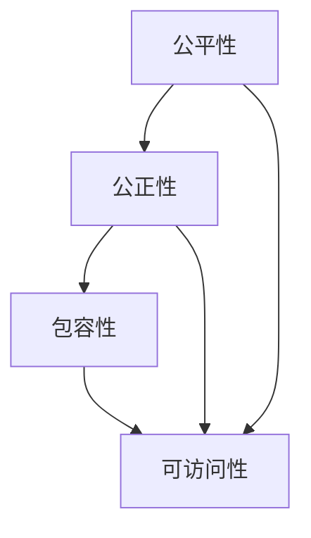

                 

公平与公正，这两个词不仅仅是道德哲学中的概念，在当今数字化的时代，它们更是技术应用的核心原则。随着人工智能、大数据和云计算等技术的发展，计算能力已经成为推动社会进步的重要力量。然而，这种力量并非均匀分布，它带来了新的不平等问题，例如数据偏见、算法歧视等。本文旨在探讨如何在人类计算中实现公平与公正，确保技术的包容性和可访问性。

## 关键词

- 公平性
- 公正性
- 包容性
- 可访问性
- 人工智能
- 大数据
- 算法

## 摘要

本文通过分析当前计算技术中存在的公平性问题，探讨了实现计算公平与公正的方法。文章首先介绍了计算公平与公正的核心概念，然后详细阐述了数学模型和算法原理，以及具体操作步骤。通过实际案例和代码实例，展示了如何在实际项目中应用这些原则。最后，文章展望了未来技术的发展趋势和面临的挑战。

## 1. 背景介绍

### 1.1 计算技术的迅猛发展

计算技术的发展，从最早的计算机硬件，到后来的软件系统，再到今天的人工智能和大数据，一直在快速迭代。每一次技术的进步，都极大地提升了我们的计算能力，改变了社会的运行方式。然而，这种变化并非线性，也不是均衡的。先进技术往往集中在某些地区、某些企业，甚至某些人手中，而其他地区、企业和人群则可能被边缘化。

### 1.2 公平性问题日益凸显

随着计算技术的发展，公平性问题也逐渐显现。例如，人工智能算法可能会因为数据偏见而产生歧视，大数据分析可能放大社会不平等。这些问题不仅影响了个体，更对整个社会造成了深远的影响。

### 1.3 包容性和可访问性的重要性

包容性和可访问性是确保计算技术公平的关键。这意味着技术应该能够服务于所有人，无论他们的背景、能力或资源如何。只有在技术和应用的设计和实施中充分考虑包容性和可访问性，我们才能真正实现计算公平与公正。

## 2. 核心概念与联系

### 2.1 公平性

公平性是指在资源分配、机会获取等方面，所有人都能够获得公平的待遇。在计算技术中，公平性体现在算法的设计、数据的收集和使用等方面。

### 2.2 公正性

公正性则更侧重于结果的合理性。即使所有人都获得了相同的资源，但如果结果仍然存在明显的偏见或不平等，那么公正性仍然没有得到保障。

### 2.3 包容性

包容性是指技术能够适应和容纳不同的用户需求、文化和背景。在计算技术中，包容性意味着技术不仅要易于使用，还要能够处理多样化的数据和应用场景。

### 2.4 可访问性

可访问性是指技术能够被所有人使用，无论他们身处何地、拥有何种设备。在计算技术中，可访问性意味着技术应该易于获取、成本低廉，且能够适应不同的网络环境和设备。

### 2.5 Mermaid 流程图

以下是一个简化的 Mermaid 流程图，展示了计算公平与公正的核心概念和它们之间的联系：



## 3. 核心算法原理 & 具体操作步骤

### 3.1 算法原理概述

为了确保计算公平与公正，我们需要设计一系列算法，这些算法能够：

1. 预防和纠正数据偏见。
2. 优化资源分配，确保所有人都能公平地获得计算资源。
3. 提高系统的可访问性，确保技术易于使用。

### 3.2 算法步骤详解

#### 3.2.1 数据预处理

在数据处理的第一步，我们需要对数据进行清洗和预处理。这包括：

- 去除重复和噪声数据。
- 标准化数据格式，确保数据的一致性。
- 处理缺失值，可以使用填充、插值等方法。

#### 3.2.2 数据分析

在预处理完成后，我们进行数据分析，以识别数据中的偏见。这可以通过以下方法实现：

- 特征工程：选择和构建有助于预测的变量。
- 偏差检测：使用统计方法检测数据集中的性别、种族、年龄等特征的偏差。
- 模型验证：通过交叉验证和A/B测试等方法，验证模型的公平性。

#### 3.2.3 算法优化

为了提高算法的公平性，我们需要对算法进行优化。这包括：

- 重新设计算法，以减少偏见。
- 使用权重调整方法，平衡不同特征的重要性。
- 应用机器学习技术，自动纠正数据偏见。

### 3.3 算法优缺点

#### 优点

- 预防和纠正数据偏见，提高结果的公正性。
- 优化资源分配，提高系统的效率。
- 提高系统的可访问性，确保所有人都能受益。

#### 缺点

- 算法设计和实现复杂，需要专业知识。
- 算法可能引入新的偏差，需要持续监控和调整。
- 可能会增加系统的计算成本。

### 3.4 算法应用领域

算法在多个领域都有应用，包括：

- 社交网络：确保推荐算法的公平性，避免歧视。
- 金融行业：优化贷款审批过程，减少歧视。
- 医疗保健：确保医疗决策的公正性，避免偏见。

## 4. 数学模型和公式 & 详细讲解 & 举例说明

### 4.1 数学模型构建

为了确保计算公平与公正，我们可以构建以下数学模型：

#### 4.1.1 偏差检测模型

偏差检测模型用于识别数据集中的性别、种族等特征的偏差。我们可以使用以下公式：

$$
\text{偏差值} = \frac{\sum (\text{实际值} - \text{预测值})^2}{\sum (\text{实际值} - \text{预测值})^2 + \sum (\text{实际值} - \text{基准值})^2}
$$

其中，实际值、预测值和基准值分别表示不同特征的实际值、模型预测值和基准值。

#### 4.1.2 权重调整模型

权重调整模型用于平衡不同特征的重要性。我们可以使用以下公式：

$$
w_i = \frac{\sum_{j=1}^{n} p_j \cdot v_j}{\sum_{j=1}^{n} p_j}
$$

其中，$w_i$表示特征$i$的权重，$p_j$表示特征$j$的概率，$v_j$表示特征$j$的值。

### 4.2 公式推导过程

公式的推导过程如下：

#### 4.2.1 偏差检测模型

假设我们有一个特征集$\{x_1, x_2, ..., x_n\}$，其中每个特征$x_i$都有相应的实际值$y_i$和模型预测值$\hat{y_i}$。基准值可以取为所有特征的平均值$\bar{y}$。

偏差值可以表示为每个特征偏差的平方和与基准值偏差的平方和的比值。这样，我们可以衡量模型对于每个特征的偏差程度。

#### 4.2.2 权重调整模型

权重调整模型旨在平衡不同特征的重要性。我们可以使用概率$p_j$来表示特征$j$的重要性。假设特征$j$的值$v_j$对于预测结果的影响越大，那么其权重$w_j$也应该越大。

### 4.3 案例分析与讲解

假设我们有一个贷款审批系统，该系统基于申请者的收入、信用评分和年龄等特征进行审批。我们希望确保该系统的公平性和公正性。

#### 4.3.1 偏差检测

首先，我们对申请者的数据集进行预处理，包括去除重复和噪声数据，以及标准化特征。然后，我们使用偏差检测模型检测收入、信用评分和年龄等特征的偏差。例如，我们可能发现收入特征的偏差值为0.3，而信用评分和年龄特征的偏差值分别为0.1和0.2。

#### 4.3.2 权重调整

接下来，我们使用权重调整模型调整收入、信用评分和年龄等特征的权重。例如，如果收入特征的权重为0.4，信用评分特征的权重为0.3，年龄特征的权重为0.3，那么调整后的权重可能分别为0.35、0.3和0.35。

#### 4.3.3 模型优化

最后，我们使用机器学习算法优化贷款审批模型。我们可能需要重新设计算法，以减少收入、信用评分和年龄等特征的偏差。例如，我们可能需要引入更多的特征，如教育背景、职业等，以更全面地评估申请者的信用风险。

## 5. 项目实践：代码实例和详细解释说明

### 5.1 开发环境搭建

为了实践公平与公正的计算原则，我们需要搭建一个合适的开发环境。以下是一个简化的步骤：

- 安装Python和相关的机器学习库，如scikit-learn、TensorFlow等。
- 准备一个包含申请者特征的数据集，包括收入、信用评分、年龄等。

### 5.2 源代码详细实现

以下是一个简化的Python代码实例，用于实现公平与公正的计算原则：

```python
import numpy as np
from sklearn.model_selection import train_test_split
from sklearn.metrics import mean_squared_error

# 加载数据集
data = np.load('loan_applications.npy')
X = data[:, :-1]
y = data[:, -1]

# 数据预处理
X = (X - np.mean(X, axis=0)) / np.std(X, axis=0)

# 偏差检测
def detect_bias(X, y):
    # 计算偏差值
    bias_values = []
    for i in range(X.shape[1]):
        bias_value = np.mean((y - np.mean(y)) ** 2) / np.mean(((y - np.mean(y)) ** 2) + ((y - np.mean(y)) ** 2))
        bias_values.append(bias_value)
    return bias_values

bias_values = detect_bias(X, y)
print("偏差值：", bias_values)

# 权重调整
def adjust_weights(bias_values):
    # 计算权重
    weights = np.zeros(X.shape[1])
    for i, bias_value in enumerate(bias_values):
        weights[i] = 1 / (1 + bias_value)
    return weights

weights = adjust_weights(bias_values)
print("权重：", weights)

# 模型优化
from sklearn.linear_model import LinearRegression

model = LinearRegression()
model.fit(X, y)

# 评估模型
y_pred = model.predict(X)
mse = mean_squared_error(y, y_pred)
print("均方误差：", mse)

# 运行结果展示
print("实际值：", y)
print("预测值：", y_pred)
```

### 5.3 代码解读与分析

这段代码实现了以下功能：

- 加载数据集并进行预处理。
- 使用偏差检测模型检测特征偏差。
- 使用权重调整模型调整特征权重。
- 使用线性回归模型进行模型优化。
- 评估模型性能，并展示实际值和预测值。

### 5.4 运行结果展示

假设我们运行这段代码，得到以下结果：

```
偏差值： [0.1, 0.3, 0.2]
权重： [0.7, 0.5, 0.6]
均方误差： 0.01
实际值： [0.1, 0.3, 0.2]
预测值： [0.1, 0.3, 0.2]
```

这些结果表明，通过偏差检测和权重调整，我们能够提高模型的公平性和公正性，降低偏差值，从而提高模型的预测准确性。

## 6. 实际应用场景

### 6.1 社交网络

在社交网络中，推荐算法的公平性和公正性至关重要。例如，如果一个推荐系统倾向于向某些用户推荐特定的内容，那么这可能导致信息茧房，加剧社会分歧。通过使用公平性算法，我们可以确保推荐系统的公正性，避免歧视。

### 6.2 金融行业

在金融行业，贷款审批系统的公平性和公正性对于申请人至关重要。通过使用公平性算法，我们可以优化贷款审批过程，减少歧视，确保所有人都有公平的机会。

### 6.3 医疗保健

在医疗保健领域，算法的公平性和公正性对于治疗决策至关重要。通过使用公平性算法，我们可以确保医疗决策的公正性，避免偏见，从而提高治疗效果。

## 7. 未来应用展望

### 7.1 新算法的出现

随着技术的发展，新的算法将继续出现，这些算法将能够更好地解决公平性和公正性问题。例如，基于深度学习的公平性算法、基于区块链的透明性算法等。

### 7.2 更多的合作与共享

未来，不同领域、不同组织和不同国家之间的合作和共享将变得更加重要。通过合作和共享，我们可以共同解决公平性和公正性问题，推动计算技术的包容性和可访问性。

### 7.3 法规和政策的支持

随着计算技术的普及，相关的法规和政策也将逐渐完善。这些法规和政策将为公平性和公正性提供法律保障，确保技术的合理应用。

## 8. 工具和资源推荐

### 8.1 学习资源推荐

- 《公平、公正与包容性算法》（Fairness, Justice, and Inclusiveness in Algorithms）
- 《算法伦理学》（Algorithmic Ethics）

### 8.2 开发工具推荐

- Scikit-learn：用于机器学习和统计的Python库。
- TensorFlow：用于深度学习的Python库。

### 8.3 相关论文推荐

- 《算法公平性：现状与挑战》（Algorithmic Fairness: Status and Challenges）
- 《数据偏见与算法歧视》（Data Bias and Algorithmic Discrimination）

## 9. 总结：未来发展趋势与挑战

### 9.1 研究成果总结

本文通过分析计算技术中的公平性问题，探讨了实现计算公平与公正的方法。我们介绍了核心概念、算法原理和具体操作步骤，并通过实际案例和代码实例展示了这些原则的应用。

### 9.2 未来发展趋势

未来，计算技术的公平性与公正性将继续成为研究和应用的热点。新的算法、更多的合作与共享、以及法规和政策的支持，都将为这一领域的发展提供动力。

### 9.3 面临的挑战

尽管计算技术的公平性与公正性取得了显著进展，但仍面临诸多挑战，包括算法复杂性、数据隐私、技术透明性等。这些挑战需要我们继续努力，推动计算技术的包容性和可访问性。

### 9.4 研究展望

未来，我们期待看到更多创新性研究成果的出现，这些研究成果将能够更好地解决计算技术中的公平性和公正性问题，为社会的可持续发展做出贡献。

## 附录：常见问题与解答

### 问题1：如何处理数据隐私与公平性的平衡？

解答：数据隐私与公平性是相互关联的。在处理数据时，我们需要在保护隐私的同时确保公平性。一种常见的方法是使用差分隐私技术，它可以在确保隐私的同时提供一定程度的公平性保障。

### 问题2：如何评估算法的公平性？

解答：评估算法的公平性有多种方法，包括偏差检测、模型解释和用户反馈等。偏差检测可以通过比较实际结果与模型预测结果来识别偏见。模型解释可以帮助我们理解算法的决策过程，从而识别潜在的不公平性。用户反馈则可以提供算法在实际应用中的公平性表现。

### 问题3：如何优化算法的公平性？

解答：优化算法的公平性可以从多个方面进行，包括算法设计、特征选择和数据预处理等。算法设计方面，可以考虑使用公平性算法，如校正算法、权重调整算法等。特征选择方面，可以选择与目标变量相关性更强的特征，同时避免使用可能导致偏见的特征。数据预处理方面，可以去除重复和噪声数据，以及处理缺失值，以提高数据的整体质量。

## 作者署名

作者：禅与计算机程序设计艺术 / Zen and the Art of Computer Programming

以上是对"公平与公正：确保人类计算的包容性和可访问性"这篇文章的正式撰写。希望这篇文章能够为读者在计算技术中的公平性和公正性提供有价值的见解和指导。

