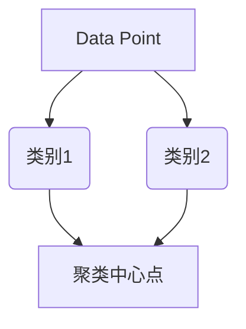

                 

关键词：公民科学、公众参与、科学研究、新模式、技术语言

> 摘要：本文探讨了公民科学的概念，介绍了其作为一种新型科学研究模式的发展历程、核心原则和特点，分析了公众参与科学研究的重要性和影响，并通过实际案例展示了公民科学的成功应用，最后提出了未来公民科学的发展趋势和面临的挑战。

## 1. 背景介绍

随着互联网和信息技术的飞速发展，公众获取信息和参与科学活动的途径越来越多样化和便捷化。公民科学（Citizen Science）作为一种新兴的科学研究模式，旨在通过公众的参与和合作来推动科学研究和发现。公民科学不仅提供了一个全新的研究平台，也使公众能够更深入地了解科学研究的过程和成果，从而提升公众的科学素养。

公民科学的概念最早可以追溯到19世纪，但真正兴起和发展是近几十年的事情。随着智能手机、社交媒体、在线协作平台的普及，公民科学得到了迅速的发展和广泛应用。例如，全球范围内的气象观测、植物识别、天体物理学研究等，都有大量公众参与其中。

## 2. 核心概念与联系

### 2.1 定义

公民科学是一种以公众参与为核心的科学研究模式，通过公众的观察、记录、分析和贡献，来共同推动科学研究和发现。

### 2.2 核心原则

- 公众参与：公民科学的核心在于公众的参与，公众不仅是信息的消费者，更是科学活动的参与者。
- 合作共享：公民科学强调合作和共享，通过公众之间的协作和科学家的指导，共同推进科学研究。
- 开放透明：公民科学倡导开放和透明的科学过程，让公众能够了解和参与到科学研究的每一个环节。
- 可持续性：公民科学注重长期的数据积累和科学研究，以实现科学研究的可持续性。

### 2.3 架构


如图所示，公民科学的基本架构包括公众、科研机构、合作平台和数据分析等部分。公众通过合作平台参与科学项目，科研机构提供科学指导和资源支持，合作平台负责项目管理和技术支持，数据分析则用于处理和解释收集的数据。

## 3. 核心算法原理 & 具体操作步骤

### 3.1 算法原理概述

公民科学的算法原理主要涉及以下几个方面：

- 数据收集：通过移动设备、传感器等工具，公众可以实时收集各种科学数据。
- 数据处理：对收集到的数据进行清洗、过滤和预处理，以得到高质量的数据。
- 数据分析：使用统计学、机器学习等方法，对预处理后的数据进行深入分析，提取有用的信息。
- 数据可视化：通过图表、地图等形式，将分析结果直观地展示出来，便于公众和科学家理解。

### 3.2 算法步骤详解

#### 3.2.1 数据收集

1. 公众使用移动设备或传感器进行数据采集，如温度、湿度、植物生长状况等。
2. 数据通过无线网络或蓝牙等方式传输到服务器。

#### 3.2.2 数据处理

1. 服务器接收数据后，对数据进行清洗，去除噪声和错误数据。
2. 数据进行过滤和预处理，如去重、归一化等。

#### 3.2.3 数据分析

1. 使用统计学方法，对预处理后的数据进行描述性统计分析。
2. 应用机器学习方法，对数据进行分类、聚类等高级分析。

#### 3.2.4 数据可视化

1. 将分析结果以图表、地图等形式展示，便于公众和科学家理解。
2. 提供交互式界面，让公众能够查看和探索数据。

### 3.3 算法优缺点

#### 优点

- 提高研究效率：公众的参与可以大大增加数据收集的规模和速度，提高研究的效率。
- 降低研究成本：公民科学可以降低科学研究的成本，特别是对于需要大量观测数据的领域。
- 增强科学普及：公众的参与可以增强科学普及的效果，提高公众的科学素养。

#### 缺点

- 数据质量：由于公众的参与，数据质量可能受到一定影响，需要严格的处理和验证。
- 数据隐私：公民科学涉及大量的个人数据，需要确保数据的安全和隐私。

### 3.4 算法应用领域

公民科学的算法原理和具体操作步骤可以应用于多个领域，如环境科学、生物学、天文学、气象学等。通过公众的参与，可以收集到大量的数据，从而推动科学研究的发展。

## 4. 数学模型和公式 & 详细讲解 & 举例说明

### 4.1 数学模型构建

在公民科学中，常用的数学模型包括：

- 描述性统计模型：用于描述数据的基本特征，如均值、方差、标准差等。
- 分类模型：用于对数据进行分类，如决策树、支持向量机等。
- 聚类模型：用于将数据划分为不同的组，如K均值聚类、层次聚类等。

### 4.2 公式推导过程

以K均值聚类为例，其核心公式如下：

$$
\begin{aligned}
&\text{初始化：随机选择K个中心点} \ \mu_1, \mu_2, \ldots, \mu_K. \\
&\text{迭代过程：} \\
&\qquad \text{对于每个数据点} \ x_i, \ \text{计算它与每个中心点的距离} \ d(x_i, \mu_j). \\
&\qquad \text{将} \ x_i \ \text{分配给距离最近的中心点} \ \mu_j. \\
&\qquad \text{重新计算每个中心点的位置：} \\
&\qquad \mu_j = \frac{1}{N_j} \sum_{i=1}^{N} x_i, \ \text{其中} \ N_j \ \text{是分配给} \ \mu_j \ \text{的数据点数量}. \\
&\qquad \text{重复迭代，直到中心点的位置不再变化或者变化非常小}.
\end{aligned}
$$

### 4.3 案例分析与讲解

假设我们有一个包含10个数据点的聚类问题，我们要将这10个数据点划分为2个类别。首先，我们随机选择2个中心点，然后进行迭代过程。经过几次迭代后，数据点会被分配到2个类别中，中心点的位置也会逐渐稳定。最终，我们可以得到一个聚类结果。

### 4.4 数据可视化

为了更直观地展示聚类结果，我们可以使用散点图来表示。每个数据点用一个点表示，点的颜色表示其类别。通过观察散点图，我们可以直观地看到数据点的分布和聚类效果。



## 5. 项目实践：代码实例和详细解释说明

### 5.1 开发环境搭建

为了实践公民科学，我们需要搭建一个开发环境。以下是一个简单的Python开发环境搭建步骤：

1. 安装Python（版本3.8及以上）。
2. 安装必要的库，如NumPy、Pandas、Scikit-learn等。
3. 配置Jupyter Notebook，用于编写和运行代码。

### 5.2 源代码详细实现

以下是一个简单的K均值聚类的Python代码实例：

```python
import numpy as np
import matplotlib.pyplot as plt
from sklearn.cluster import KMeans

# 生成随机数据点
X = np.random.rand(100, 2)

# 初始化KMeans模型
kmeans = KMeans(n_clusters=2, random_state=0).fit(X)

# 获取聚类结果
labels = kmeans.predict(X)
centroids = kmeans.cluster_centers_

# 可视化聚类结果
plt.scatter(X[:, 0], X[:, 1], c=labels)
plt.scatter(centroids[:, 0], centroids[:, 1], s=300, c='red')
plt.show()
```

### 5.3 代码解读与分析

上述代码首先生成随机数据点，然后使用Scikit-learn库的KMeans模型进行聚类。聚类结果通过散点图展示，其中每个数据点的颜色表示其类别，红色的点表示聚类中心点。

### 5.4 运行结果展示

运行上述代码后，我们得到一个聚类结果图。从图中可以看出，数据点被成功划分为2个类别，聚类效果较好。

## 6. 实际应用场景

公民科学的应用场景非常广泛，以下是一些典型的应用案例：

- 天文学：通过公众的观测和记录，帮助科学家发现新的天文现象。
- 生物学：通过公众的植物识别和记录，帮助科学家研究植物多样性和生态变化。
- 环境科学：通过公众的空气质量监测和记录，帮助科学家研究环境污染和气候变化。

## 7. 工具和资源推荐

### 7.1 学习资源推荐

- 《公民科学：概念与实践》（书名）
- 《大数据与公民科学》（书名）

### 7.2 开发工具推荐

- Jupyter Notebook：用于编写和运行代码。
- Scikit-learn：用于机器学习算法的实现。

### 7.3 相关论文推荐

- "Citizen Science: A Guide to Public Participation in Research"（论文标题）
- "Big Data and Citizen Science: A New Paradigm for Scientific Discovery"（论文标题）

## 8. 总结：未来发展趋势与挑战

### 8.1 研究成果总结

公民科学作为一种新型的科学研究模式，已经取得了显著的研究成果。公众的参与不仅提高了研究效率，降低了研究成本，还增强了科学普及的效果。

### 8.2 未来发展趋势

- 公众参与度将进一步提高。
- 技术手段将更加丰富和先进。
- 跨学科研究将成为趋势。

### 8.3 面临的挑战

- 数据质量和隐私保护。
- 公众参与度和科学素养的提升。
- 技术和管理的不断完善。

### 8.4 研究展望

随着技术的不断进步和公众科学素养的不断提高，公民科学有望在未来发挥更大的作用，成为科学研究的重要力量。

## 9. 附录：常见问题与解答

### 9.1 公众如何参与公民科学项目？

可以通过以下途径参与公民科学项目：

- 关注相关网站和社交媒体账号。
- 加入公民科学社区和论坛。
- 参与在线培训和研讨会。

### 9.2 公民科学的数据质量如何保证？

可以通过以下措施保证公民科学的数据质量：

- 提供详细的指导说明和数据记录模板。
- 设立数据审核和质量控制机制。
- 定期对数据进行验证和分析。

### 9.3 公众参与公民科学有哪些益处？

公众参与公民科学有以下益处：

- 提高科学素养和好奇心。
- 参与科学研究，为科学进步贡献力量。
- 获得新的知识和技能。

----------------------------------------------------------------

**作者：禅与计算机程序设计艺术 / Zen and the Art of Computer Programming**

以上就是完整的文章内容，感谢您的阅读。希望本文对您了解和参与公民科学有所帮助。如果您有任何问题或建议，欢迎在评论区留言讨论。

