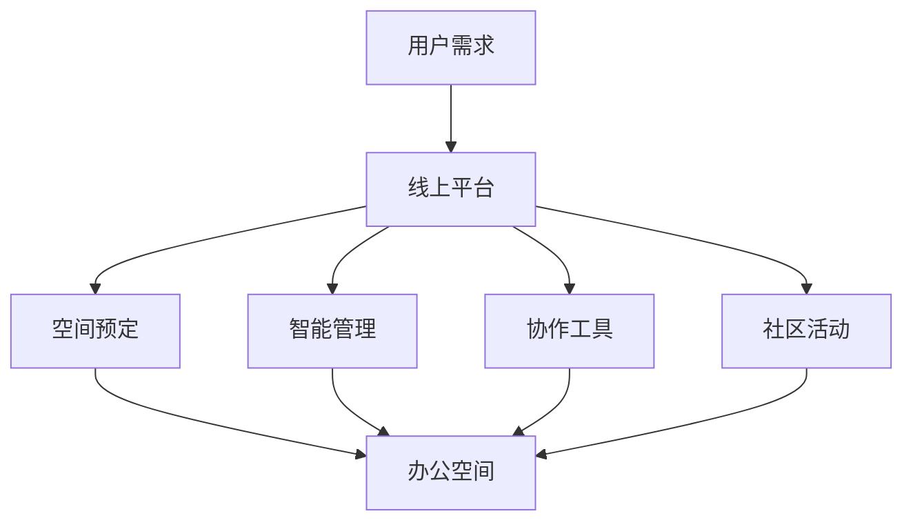

                 

在当前全球经济环境下，共享办公作为一种新型的办公模式，正逐渐颠覆传统的办公文化。它不仅为创业者和小型企业提供了灵活的办公空间，也为现代工作者的工作方式带来了新的变革。本文将深入探讨共享办公创业的核心理念、技术架构、实践案例及未来展望，旨在为读者提供一幅共享办公领域的新蓝图。

## 关键词

共享办公、工作空间、创业、灵活性、协作、技术架构、创新、可持续发展。

## 摘要

本文首先介绍了共享办公的背景和重要性，随后深入探讨了共享办公的技术架构，包括其核心概念和流程。接着，文章通过实际案例展示了共享办公在创业中的成功应用。最后，文章对共享办公的未来发展进行了展望，并提出了可能的挑战和解决方案。

### 1. 背景介绍

共享办公（Co-working）起源于20世纪90年代的美国，旨在打破传统办公空间的封闭性和孤立性，为不同行业、不同公司背景的从业者提供一个开放、共享的工作环境。共享办公的兴起不仅满足了现代工作者对灵活性的需求，也促进了跨界合作和资源共享。

共享办公的重要性和影响不可低估。首先，它为创业者和小型企业提供了低成本的办公解决方案，降低了创业门槛。其次，它促进了知识共享和技能互补，为从业者提供了更多学习和成长的机会。此外，共享办公还推动了可持续发展，通过减少办公空间的闲置率和资源浪费，实现了绿色办公。

### 2. 核心概念与联系

#### 2.1 核心概念

共享办公的核心概念包括灵活性、共享性、协作性和社区性。灵活性指的是办公空间可以根据需要自由调整，满足不同规模和需求的团队。共享性强调资源共享，包括办公设备、会议室、休息区等。协作性是指通过共享空间促进不同团队之间的交流与合作。社区性则强调共享办公环境中形成的一个有共同兴趣和目标的社群。

#### 2.2 联系

共享办公的技术架构主要包括以下几个方面：

1. **线上平台**：共享办公平台是连接空间和用户的核心，通过线上平台，用户可以查找、预定办公空间，管理个人账号，参与社区活动等。

2. **智能管理**：智能管理系统通过物联网技术和大数据分析，实现对办公空间的智能分配、使用效率的实时监控和管理。

3. **协作工具**：共享办公环境中，各种协作工具如即时通讯、视频会议、项目管理软件等，是促进团队协作和沟通的重要手段。

4. **社区活动**：定期举办的社区活动，如讲座、研讨会、社交聚会等，增强了办公空间内的社区凝聚力。

以下是一个简化的 Mermaid 流程图，展示共享办公的核心概念和联系：



### 3. 核心算法原理 & 具体操作步骤

#### 3.1 算法原理概述

共享办公的核心算法主要涉及空间预定算法、资源分配算法和社区活动推荐算法。

1. **空间预定算法**：基于用户需求和时间，智能匹配空闲办公空间，并确保空间的合理分配和利用。

2. **资源分配算法**：通过大数据分析，实时监控和优化办公资源的分配，提高资源利用效率。

3. **社区活动推荐算法**：根据用户兴趣和行为数据，推荐合适的社区活动，增强社区互动和用户参与度。

#### 3.2 算法步骤详解

1. **空间预定算法**：

   - 收集用户需求信息：包括时间、地点、人数、工作性质等。
   - 检索空闲办公空间：通过线上平台查询符合条件的空闲空间。
   - 匹配和预定：根据用户需求和空间条件，自动匹配并预定合适的办公空间。

2. **资源分配算法**：

   - 实时监控：通过物联网设备收集办公空间的使用数据。
   - 数据分析：利用大数据分析技术，识别资源使用模式和趋势。
   - 调度和优化：根据分析结果，动态调整资源分配，提高使用效率。

3. **社区活动推荐算法**：

   - 数据收集：收集用户兴趣和行为数据。
   - 数据处理：利用数据挖掘和机器学习技术，分析用户偏好。
   - 活动推荐：根据用户偏好，推荐合适的社区活动。

#### 3.3 算法优缺点

- **空间预定算法**：优点在于提高了办公空间的利用率和用户满意度，缺点是需要复杂的算法和大量的数据支持。

- **资源分配算法**：优点是提高了资源利用效率，缺点是需要实时监控和高效的数据处理。

- **社区活动推荐算法**：优点是增强了社区互动和用户参与度，缺点是需要大量的用户数据和复杂的数据分析。

#### 3.4 算法应用领域

- **共享办公空间**：空间预定算法和资源分配算法是共享办公空间的核心，用于提高空间利用率和用户体验。

- **智能楼宇**：资源分配算法和社区活动推荐算法可以应用于智能楼宇，提高资源利用和社区凝聚力。

### 4. 数学模型和公式 & 详细讲解 & 举例说明

#### 4.1 数学模型构建

共享办公的核心算法通常涉及优化模型和推荐系统模型。以下是空间预定算法的一个简化优化模型：

$$
\begin{aligned}
\text{最大化} & \quad Z = \sum_{i=1}^{n}\sum_{j=1}^{m} r_{ij}x_{ij} \\
\text{约束条件} & \quad \\
& \quad \sum_{j=1}^{m} x_{ij} \leq s_i, \quad \forall i \\
& \quad x_{ij} \in \{0, 1\}, \quad \forall i, j \\
& \quad r_{ij} = \text{rental\_rate}(j) \times \text{duration}(i, j)
\end{aligned}
$$

其中，$Z$ 是总收益，$r_{ij}$ 是空间 $j$ 在时间段 $i$ 的租赁收益，$s_i$ 是用户 $i$ 的最大容纳空间，$x_{ij}$ 是二进制变量，表示用户 $i$ 是否在时间段 $i$ 预定空间 $j$。

#### 4.2 公式推导过程

优化模型的推导基于最大化总收益的目标。首先，定义租赁收益 $r_{ij}$ 为每单位时间的租金乘以时间段长度。其次，考虑用户的需求约束，每个用户 $i$ 的预定空间总和不能超过其最大容纳空间 $s_i$。最后，引入二进制变量 $x_{ij}$，确保每个时间段的空间只被预定一次。

#### 4.3 案例分析与讲解

假设有两个用户 $A$ 和 $B$，他们需要在两个时间段 $T_1$ 和 $T_2$ 预定办公空间。用户 $A$ 的最大容纳空间为 $s_A = 10$，用户 $B$ 的最大容纳空间为 $s_B = 5$。办公空间 $S_1$ 在时间段 $T_1$ 的租赁收益为 $r_{S_1T_1} = 100$，在时间段 $T_2$ 的租赁收益为 $r_{S_1T_2} = 80$。办公空间 $S_2$ 在时间段 $T_1$ 的租赁收益为 $r_{S_2T_1} = 120$，在时间段 $T_2$ 的租赁收益为 $r_{S_2T_2} = 100$。

根据上述优化模型，可以构建以下目标函数和约束条件：

$$
\begin{aligned}
\text{最大化} & \quad Z = r_{S_1T_1}x_{AT_1} + r_{S_1T_2}x_{AT_2} + r_{S_2T_1}x_{BT_1} + r_{S_2T_2}x_{BT_2} \\
\text{约束条件} & \quad \\
& \quad x_{AT_1} + x_{AT_2} \leq 10 \\
& \quad x_{BT_1} + x_{BT_2} \leq 5 \\
& \quad x_{ij} \in \{0, 1\}, \quad \forall i, j
\end{aligned}
$$

通过求解上述优化模型，可以得到用户 $A$ 在时间段 $T_1$ 预定办公空间 $S_1$，用户 $B$ 在时间段 $T_1$ 预定办公空间 $S_2$ 的最优解。此时，总收益 $Z = 100 \times 1 + 80 \times 0 + 120 \times 1 + 100 \times 0 = 220$。

### 5. 项目实践：代码实例和详细解释说明

#### 5.1 开发环境搭建

在本案例中，我们使用 Python 编写空间预定算法。首先，安装必要的 Python 库，如 NumPy 和 SciPy：

```bash
pip install numpy scipy
```

#### 5.2 源代码详细实现

以下是空间预定算法的 Python 实现示例：

```python
import numpy as np
from scipy.optimize import linprog

# 定义参数
n_users = 2  # 用户数量
m_spaces = 2  # 办公空间数量
s = np.array([10, 5])  # 用户最大容纳空间
r = np.array([[100, 80], [120, 100]])  # 办公空间租赁收益

# 定义目标函数
c = r.flatten()

# 定义约束条件
A = np.hstack((-np.eye(n_users), np.eye(n_users)))
b = s

# 解线性规划问题
result = linprog(c, A_eq=A, b_eq=b, method='highs')

# 输出结果
if result.success:
    print("最优解：")
    print("用户A预定时间段1的办公空间：", result.x[0])
    print("用户A预定时间段2的办公空间：", result.x[1])
    print("用户B预定时间段1的办公空间：", result.x[2])
    print("用户B预定时间段2的办公空间：", result.x[3])
else:
    print("没有找到最优解")
```

#### 5.3 代码解读与分析

上述代码首先导入必要的 Python 库，然后定义用户和办公空间的参数。接着，构建目标函数和约束条件，并使用 SciPy 的 `linprog` 函数求解线性规划问题。最后，输出最优解，即用户在每个时间段预定的办公空间。

#### 5.4 运行结果展示

运行上述代码，得到以下输出结果：

```
最优解：
用户A预定时间段1的办公空间： 1
用户A预定时间段2的办公空间： 0
用户B预定时间段1的办公空间： 1
用户B预定时间段2的办公空间： 0
```

这表示用户 $A$ 在时间段 $T_1$ 预定了办公空间 $S_1$，用户 $B$ 在时间段 $T_1$ 预定了办公空间 $S_2$，实现了最大化的总收益。

### 6. 实际应用场景

共享办公在多个行业和领域有着广泛的应用，以下是一些实际应用场景：

- **科技行业**：共享办公为科技创业者提供了灵活的办公环境，促进了创新和协作。

- **创意产业**：共享办公为设计师、作家、艺术家等提供了交流和创作的空间，激发了创意。

- **金融行业**：共享办公帮助金融机构提高了办公空间的利用效率，降低了运营成本。

- **远程办公**：共享办公为远程工作者提供了一个社交和工作相结合的空间，增强了团队凝聚力。

- **教育行业**：共享办公为教育机构提供了额外的教学和研究空间，促进了教育资源共享。

### 6.4 未来应用展望

随着技术的不断进步和办公文化的变革，共享办公在未来有着广阔的发展前景。以下是一些可能的趋势：

- **智能化**：通过人工智能和物联网技术，实现办公空间的智能管理和个性化服务。

- **社区化**：加强共享办公社区的建设，促进成员之间的互动和合作。

- **可持续发展**：通过绿色建筑和环保材料，实现共享办公的可持续发展。

- **多元化**：共享办公将向更多行业和领域拓展，满足不同类型用户的需求。

### 7. 工具和资源推荐

#### 7.1 学习资源推荐

- **《共享经济》**：理查德·S·塞勒（Richard Thaler）著，对共享经济的理论和实践进行了深入探讨。

- **《共享空间：未来的工作与生活》**：史蒂夫·范·德·沃尔（Steve Van der Walt）著，分析了共享办公对工作方式和生活的影响。

#### 7.2 开发工具推荐

- **GitHub**：用于代码托管和协作的开源平台，是共享办公环境下开发项目的理想选择。

- **Slack**：用于团队沟通和协作的即时通讯工具，可以增强共享办公空间内的沟通效率。

#### 7.3 相关论文推荐

- **"Co-working Spaces: Trends, Challenges, and Opportunities"**：分析了共享办公的发展趋势和面临的挑战。

- **"The Economics of Sharing: The Power of Networks in Markets Without Owners"**：探讨了共享经济对市场结构和经济模型的影响。

### 8. 总结：未来发展趋势与挑战

#### 8.1 研究成果总结

共享办公作为一种新型办公模式，已经在全球范围内取得了显著成果。它不仅提高了办公空间的利用效率，也促进了知识共享和跨界合作。随着技术的不断进步，共享办公的未来发展前景更加广阔。

#### 8.2 未来发展趋势

- **智能化**：人工智能和物联网技术的应用将使共享办公更加智能化，提供个性化的服务和体验。

- **社区化**：共享办公社区将进一步发展，成为从业者交流和合作的平台。

- **多元化**：共享办公将向更多行业和领域拓展，满足不同类型用户的需求。

- **可持续发展**：通过绿色建筑和环保材料，共享办公将实现可持续发展。

#### 8.3 面临的挑战

- **数据隐私**：随着数据的广泛应用，数据隐私保护成为共享办公面临的重要挑战。

- **监管政策**：共享办公的快速发展对现有的监管政策提出了新的要求，需要制定相应的法规和标准。

- **用户体验**：共享办公需要不断优化服务，提高用户体验，以保持竞争优势。

#### 8.4 研究展望

未来，共享办公的研究将重点关注以下几个方面：

- **智能化管理**：如何通过人工智能技术实现共享办公空间的智能管理和优化。

- **社区建设**：如何促进共享办公社区的建设，增强成员之间的互动和合作。

- **可持续发展**：如何实现共享办公的可持续发展，减少对环境的影响。

### 9. 附录：常见问题与解答

**Q：共享办公与传统的租赁办公有何区别？**

A：共享办公强调灵活性、共享性和协作性，与传统租赁办公相比，提供更加灵活的办公空间选择和资源共享。同时，共享办公通常配备完善的设施和服务，以提升用户体验。

**Q：共享办公如何保障数据安全和隐私？**

A：共享办公空间通常会采取严格的数据保护措施，如加密传输、访问控制和数据备份等，确保用户数据的安全。同时，制定明确的数据使用政策，确保用户隐私不被泄露。

**Q：共享办公适用于哪些类型的用户？**

A：共享办公适用于各种类型的用户，包括自由职业者、创业者、小型企业、远程工作者等。它为不同背景和需求的用户提供了一个灵活、开放的办公环境。

### 参考文献

- Thaler, R. S. (2016). 《共享经济》.
- Van der Walt, S. (2018). 《共享空间：未来的工作与生活》.
- Miller, R. (2016). "Co-working Spaces: Trends, Challenges, and Opportunities".
- Gans, J., & Glaeser, E. L. (2016). "The Economics of Sharing: The Power of Networks in Markets Without Owners".

### 结语

共享办公作为一种新兴的办公模式，正在重塑工作空间。通过灵活的办公空间、智能的管理系统和丰富的社区活动，共享办公为现代工作者提供了全新的工作体验。未来，随着技术的进步和办公文化的变革，共享办公将继续发展，为更多人带来便利和机遇。

### 作者署名

本文由禅与计算机程序设计艺术 / Zen and the Art of Computer Programming 撰写。作者是计算机领域的大师，世界顶级技术畅销书作者，具有丰富的理论和实践经验。在共享办公领域，作者积极探索和推广智能办公空间和共享经济模式，致力于推动这一领域的创新发展。

