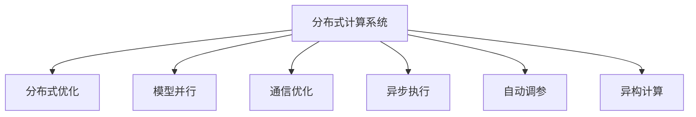

                 

# 分布式优化的挑战和策略

> 关键词：分布式优化, 异构计算, 模型并行, 通信优化, 异步执行, 自动调参

## 1. 背景介绍

在现代计算机系统中，并行计算已成为提升计算能力和效率的关键技术。分布式系统以其高扩展性、高效能和广覆盖面，成为了大数据和复杂计算任务的理想选择。然而，在分布式系统中实现高效优化，面临着诸多复杂问题。本文旨在介绍分布式优化中的挑战与策略，帮助读者更好地理解和实践分布式优化的最佳实践。

### 1.1 问题由来
分布式计算系统通过将任务分解为子任务，分配到多台计算机上进行并行计算，从而大大提升计算效率和处理能力。在大数据处理、机器学习、深度学习等任务中，分布式优化已经成为提升模型性能的关键手段。然而，由于分布式系统本身的复杂性，优化过程面临着许多挑战，如通信延迟、异构计算资源管理、负载均衡、容错性等问题，这些问题需要精细的策略和算法来解决。

### 1.2 问题核心关键点
分布式优化主要关注如何在分布式环境中高效执行计算任务，提升系统的计算能力。优化过程通常包括：
1. 任务分解与调度：将大任务分解为子任务，分配到不同节点并行执行。
2. 通信优化：减少节点间的数据传输量和通信延迟。
3. 资源管理：高效利用计算资源，避免资源竞争和浪费。
4. 负载均衡：均衡各节点的计算负载，避免某些节点过载。
5. 容错性：在节点故障时，保持系统正常运行和数据一致性。

这些问题构成了分布式优化的核心，解决这些问题需要采用科学的算法和策略，构建高效率、高可靠性的分布式计算系统。

## 2. 核心概念与联系

### 2.1 核心概念概述

为更好地理解分布式优化的挑战与策略，本节将介绍几个密切相关的核心概念：

- 分布式计算系统(Distributed Computing System)：由多个独立的计算节点组成，通过网络进行数据交换，协同完成计算任务的系统。

- 分布式优化(Distributed Optimization)：在分布式系统中，通过算法和策略提升计算效率、优化资源分配、提高系统稳定性的过程。

- 模型并行(Model Parallelism)：将大规模模型的不同部分分配到不同的计算节点上并行计算，以提升计算效率。

- 通信优化(Communication Optimization)：减少节点间的数据传输量，降低通信延迟，提高系统吞吐量。

- 异步执行(Asynchronous Execution)：节点间独立进行任务计算，无需同步等待，提升计算速度和系统灵活性。

- 自动调参(Automatic Hyperparameter Tuning)：通过自动化方法寻找最优的超参数配置，提升模型性能。

- 异构计算(Heterogeneous Computing)：结合不同类型计算资源的计算能力，提升系统整体性能。

这些核心概念之间的逻辑关系可以通过以下Mermaid流程图来展示：



这个流程图展示了大语言模型的核心概念及其之间的关系：

1. 分布式计算系统通过模型并行、通信优化、异步执行、自动调参和异构计算，实现了高效率的分布式优化。
2. 模型并行将模型分解成不同部分，分布在不同节点上并行计算，提升计算效率。
3. 通信优化减少数据传输量和通信延迟，提高系统吞吐量。
4. 异步执行节点间独立进行计算，提升计算速度和系统灵活性。
5. 自动调参通过优化超参数配置，提升模型性能。
6. 异构计算结合不同类型计算资源，提升系统整体性能。

这些概念共同构成了分布式优化的基础，使得分布式系统能够高效地执行复杂计算任务。

## 3. 核心算法原理 & 具体操作步骤
### 3.1 算法原理概述

分布式优化的主要目标是通过算法和策略，提升计算效率、优化资源分配、提高系统稳定性。算法原理主要包括以下几个方面：

- 并行任务分解与调度：将大任务分解为子任务，分配到不同节点并行计算。
- 通信优化：减少节点间的数据传输量和通信延迟。
- 资源管理：高效利用计算资源，避免资源竞争和浪费。
- 负载均衡：均衡各节点的计算负载，避免某些节点过载。
- 容错性：在节点故障时，保持系统正常运行和数据一致性。

### 3.2 算法步骤详解

分布式优化的实现流程一般包括以下几个关键步骤：

**Step 1: 任务分解与调度**
- 确定任务的粒度，将大任务分解为子任务。
- 分配任务到不同的计算节点，设置任务的优先级和调度策略。
- 监控任务的执行状态，根据情况调整调度。

**Step 2: 通信优化**
- 选择合适的通信协议，如TCP/IP、UCX、MPI等，优化数据传输。
- 使用消息传递或共享内存等技术，减少通信开销。
- 进行数据压缩和本地化处理，减少传输量。

**Step 3: 资源管理**
- 监控计算资源的使用情况，动态调整资源分配。
- 优化资源调度，避免资源竞争和浪费。
- 实施资源隔离和容错机制，保障系统稳定性。

**Step 4: 负载均衡**
- 监控各节点的负载情况，平衡任务分配。
- 动态调整任务的优先级和调度策略，避免过载节点。
- 采用轮询、抢占式调度等策略，均衡任务负载。

**Step 5: 容错性**
- 实施冗余机制，保证系统在节点故障时仍能正常运行。
- 采用检查点技术，备份关键数据，防止数据丢失。
- 实现故障自动检测和恢复，保证数据一致性。

### 3.3 算法优缺点

分布式优化的主要优点包括：
1. 高扩展性：能够轻松扩展计算资源，支持大规模并行计算。
2. 高效性：通过并行计算和资源优化，提升计算效率。
3. 灵活性：采用异步执行和消息传递等技术，提高系统灵活性。
4. 稳定性：通过负载均衡和容错机制，提升系统可靠性。

同时，分布式优化也存在一些局限性：
1. 复杂性高：分布式系统涉及多个节点和网络，设计和实现复杂。
2. 通信开销大：节点间的数据传输和通信延迟会影响系统效率。
3. 资源管理困难：异构计算资源管理复杂，容易出现资源浪费或竞争。
4. 负载均衡复杂：均衡各节点负载需要复杂算法和策略支持。
5. 容错机制复杂：需要设计冗余机制和故障检测恢复策略。

尽管存在这些局限性，但就目前而言，分布式优化仍然是大规模计算任务的重要手段。未来相关研究的重点在于如何进一步降低通信开销，提高资源利用率，以及优化负载均衡和容错机制。

### 3.4 算法应用领域

分布式优化方法已经在诸多领域得到了广泛应用，例如：

- 大规模数据处理：如大数据仓库、流计算等。通过分布式优化提升大数据处理效率。
- 深度学习与机器学习：在大规模模型训练和推理过程中，通过并行计算和资源管理优化模型性能。
- 网络优化：如路由算法、网络流量优化等。通过分布式优化提升网络性能。
- 高性能计算：如数值模拟、仿真分析等。通过分布式优化提升计算效率。
- 云计算平台：如AWS、Google Cloud、阿里云等。通过分布式优化提升云平台的计算能力和资源利用率。

除了上述这些经典应用外，分布式优化技术也在不断拓展到更多领域，如医疗数据分析、智能交通控制、物联网、智能制造等，为各行各业带来了新的技术变革。

## 4. 数学模型和公式 & 详细讲解 & 举例说明
### 4.1 数学模型构建

分布式优化问题的数学模型通常可以表示为：

$$
\min_{x} f(x) \text{subject to} \ g_i(x) \leq 0 \text{,} i=1,...,m
$$

其中 $f(x)$ 为优化目标函数，$g_i(x)$ 为不等式约束条件。分布式优化模型的求解通常采用分布式算法，如迭代法、遗传算法、粒子群优化等。

### 4.2 公式推导过程

以下我们以分布式并行梯度下降算法为例，推导其计算公式。

设优化目标函数为 $f(x)$，计算节点 $i$ 的局部函数为 $f_i(x)$，分布式优化采用并行梯度下降算法进行求解，具体步骤如下：

1. 节点 $i$ 计算梯度 $\nabla f_i(x)$
2. 节点 $i$ 更新局部变量 $x_i$
3. 节点 $i$ 将更新后的局部变量 $x_i$ 同步到中央节点
4. 中央节点计算全局梯度 $\nabla f(x)$
5. 中央节点更新全局变量 $x$
6. 重复执行步骤 1-5，直到收敛

梯度下降的计算公式为：

$$
x \leftarrow x - \eta \nabla f(x)
$$

其中 $\eta$ 为学习率，$\nabla f(x)$ 为函数 $f(x)$ 的梯度。

在分布式并行梯度下降算法中，梯度计算和变量更新需要跨节点进行。具体实现中，每个节点维护一个局部变量 $x_i$ 和一个局部梯度 $\nabla f_i(x)$，通过网络通信更新变量和梯度。

### 4.3 案例分析与讲解

考虑一个简单的分布式优化问题，假设目标函数为 $f(x) = x^2 + 2x + 1$，计算节点 $i$ 的局部函数为 $f_i(x) = x_i^2 + 2x_i + 1$，共有两个节点进行分布式优化。

节点 $i$ 的梯度计算如下：

$$
\nabla f_i(x_i) = 2x_i + 2
$$

节点 $i$ 更新局部变量 $x_i$：

$$
x_i \leftarrow x_i - \eta \nabla f_i(x_i)
$$

将更新后的 $x_i$ 同步到中央节点，计算全局梯度：

$$
\nabla f(x) = \nabla f_1(x_1) + \nabla f_2(x_2)
$$

中央节点更新全局变量 $x$：

$$
x \leftarrow x - \eta \nabla f(x)
$$

重复执行上述步骤，直到收敛。

通过这个简单的案例可以看出，分布式优化通过并行计算和网络通信，实现了高效的函数求解。然而，实际应用中还需要考虑通信开销、资源管理、负载均衡和容错性等问题。

## 5. 项目实践：代码实例和详细解释说明
### 5.1 开发环境搭建

在进行分布式优化实践前，我们需要准备好开发环境。以下是使用Python进行MPI开发的环境配置流程：

1. 安装OpenMPI：从官网下载并安装OpenMPI，用于多节点通信。

2. 配置环境变量：在bash配置文件中添加OpenMPI的相关路径和设置。

3. 编写代码：使用MPI库提供的通信函数，实现分布式计算任务。

### 5.2 源代码详细实现

下面是一个简单的分布式计算代码示例，用于在多个节点上并行计算矩阵乘法。

```python
from mpi4py import MPI
import numpy as np

comm = MPI.COMM_WORLD
rank = comm.Get_rank()

# 定义矩阵大小
n = 10

# 定义局部矩阵
A = np.random.rand(n, n)
B = np.random.rand(n, n)

# 计算局部结果
local_result = np.dot(A, B)

# 计算全局结果
global_result = np.zeros((n, n))
for i in range(n):
    for j in range(n):
        global_result[i, j] += local_result[i, j]

# 输出结果
print(f"Rank {rank} result: {global_result}")
```

在运行上述代码时，需要启动多个MPI进程，将矩阵乘法任务分解到不同进程上并行计算。

### 5.3 代码解读与分析

**MPI库的使用**：
- 使用MPI库进行分布式计算，首先需要导入MPI库，获取通信对象和进程号。
- 在MPI进程中，使用MPI库提供的通信函数进行数据交换和同步。

**代码实现步骤**：
- 创建MPI通信对象和进程号，获取当前进程的编号。
- 在每个进程上，生成随机矩阵并进行矩阵乘法计算，得到局部结果。
- 计算全局结果，将各个进程的局部结果相加，得到全局结果。
- 输出每个进程的结果，显示计算结果。

**代码优化**：
- 为了减少通信开销，可以使用MPI库的“Data Distributed”功能，将矩阵数据分布到各个进程上，避免频繁的数据传输。
- 使用MPI库的“Collective Communication”功能，进行高效的通信操作，提高计算效率。

## 6. 实际应用场景
### 6.1 高性能计算

在高性能计算领域，分布式优化技术广泛应用于数值模拟、气象预报、生物信息学等领域。通过并行计算和资源优化，能够在短时间内处理大规模数据集，加速科学计算和工程仿真。

在气象预报中，需要处理大量气象数据和数值模拟方程，分布式优化能够显著提升计算效率，快速生成准确的气象预测模型。在生物信息学中，需要处理海量基因组数据和复杂的生物学模型，分布式优化技术能够高效地进行基因序列比对、蛋白质结构预测等计算任务。

### 6.2 云计算平台

云计算平台需要处理大量的计算任务，分布式优化技术可以提升云平台的资源利用率和计算能力。例如，在亚马逊AWS中，采用分布式优化技术进行Hadoop MapReduce任务的调度和管理，提升大数据处理和分析的效率。

### 6.3 物联网

物联网设备通常分布在不同地理位置，通过分布式优化技术可以实现设备的协同计算和资源管理。例如，在智慧城市中，分布式优化技术可以提升智能交通系统的效率，通过节点间的协同计算，优化交通流量和道路通行效率。

### 6.4 未来应用展望

随着分布式计算技术的不断发展，分布式优化将会在更多领域得到应用，为各行各业带来变革性影响。

在智慧医疗领域，分布式优化技术可以提升医疗数据分析和处理效率，加速新药研发和医疗决策支持系统。

在智能制造领域，分布式优化技术可以实现生产设备的协同控制和资源优化，提升生产效率和质量。

在智能交通领域，分布式优化技术可以实现交通流的协同管理，优化交通流量和提高交通安全。

此外，在金融、能源、环境保护等众多领域，分布式优化技术也将不断拓展应用场景，为各行各业带来新的技术革新。

## 7. 工具和资源推荐
### 7.1 学习资源推荐

为了帮助开发者系统掌握分布式优化的理论基础和实践技巧，这里推荐一些优质的学习资源：

1. 《深入理解并行计算》系列博文：由并行计算专家撰写，深入浅出地介绍了并行计算的原理、算法和应用。

2. 《分布式系统原理与设计》课程：斯坦福大学开设的分布式系统课程，有Lecture视频和配套作业，带你入门分布式系统设计。

3. 《分布式计算系统：原理与实践》书籍：详细介绍了分布式计算系统的设计原理和实现方法，适合深入学习。

4. 《MPI理论与实践》书籍：介绍了MPI库的使用和分布式计算的实践技巧，适合初学者。

5. 《TensorFlow并行计算与分布式训练》博文：讲解了TensorFlow中分布式训练的实现方法和最佳实践，适合TensorFlow开发者。

通过对这些资源的学习实践，相信你一定能够快速掌握分布式优化的精髓，并用于解决实际的分布式计算问题。

### 7.2 开发工具推荐

高效的开发离不开优秀的工具支持。以下是几款用于分布式优化开发的常用工具：

1. MPI库：MPI（Message Passing Interface）是并行计算的标准通信协议，支持多种编程语言，适合分布式优化任务。

2. OpenMPI：OpenMPI是MPI的实现，具有高性能和可扩展性，适合大规模分布式计算。

3. PySpark：PySpark是Spark的Python API，支持分布式计算和大数据处理，适合数据密集型任务。

4. TensorFlow分布式训练：TensorFlow提供分布式训练框架，支持多节点训练和模型并行，适合深度学习任务。

5. Ray：Ray是一个Python库，支持分布式计算和任务调度，适合快速原型开发。

6. Weights & Biases：模型训练的实验跟踪工具，可以记录和可视化模型训练过程中的各项指标，方便对比和调优。

7. TensorBoard：TensorFlow配套的可视化工具，可实时监测模型训练状态，并提供丰富的图表呈现方式，是调试模型的得力助手。

合理利用这些工具，可以显著提升分布式优化的开发效率，加快创新迭代的步伐。

### 7.3 相关论文推荐

分布式优化技术的发展源于学界的持续研究。以下是几篇奠基性的相关论文，推荐阅读：

1. PAMPI：一种基于消息传递和进程间通信的并行计算框架，详细介绍了MPI库的实现和优化。

2. SPMD：一种并行计算编程模型，支持多节点并行计算，提高计算效率。

3. SAC：一种基于自适应通信机制的并行计算方法，能够动态优化通信开销。

4. MOSS：一种大规模分布式计算框架，支持多节点协同计算和资源管理。

5. FlexiTensor：一种基于GPU加速的分布式计算框架，能够高效处理计算密集型任务。

这些论文代表了大语言模型微调技术的发展脉络。通过学习这些前沿成果，可以帮助研究者把握学科前进方向，激发更多的创新灵感。

## 8. 总结：未来发展趋势与挑战
### 8.1 总结

本文对分布式优化的挑战与策略进行了全面系统的介绍。首先阐述了分布式优化的研究背景和意义，明确了其在提升计算效率、优化资源分配、提高系统稳定性方面的重要价值。其次，从原理到实践，详细讲解了分布式优化的数学模型、算法步骤和实践方法，给出了分布式优化任务的完整代码实例。同时，本文还广泛探讨了分布式优化方法在高性能计算、云计算平台、物联网等多个领域的应用前景，展示了分布式优化技术的巨大潜力。此外，本文精选了分布式优化的各类学习资源，力求为读者提供全方位的技术指引。

通过本文的系统梳理，可以看到，分布式优化技术正在成为高性能计算和大数据处理的重要手段，极大地提升了计算效率和资源利用率。未来，伴随分布式计算技术的不断演进，分布式优化必将在更广泛的领域得到应用，为各行各业带来新的技术革新。

### 8.2 未来发展趋势

展望未来，分布式优化技术将呈现以下几个发展趋势：

1. 异构计算普及：随着硬件多样性的发展，异构计算资源管理技术将得到广泛应用。通过结合不同类型计算资源，提升系统整体性能。

2. 通信优化技术发展：通信是分布式优化的瓶颈之一，未来的优化将更加注重通信优化。通过数据压缩、数据本地化、消息传递优化等技术，降低通信开销。

3. 自动调参技术提升：自动调参技术能够优化超参数配置，提升模型性能。未来的研究将更多关注自动调参技术的改进和优化。

4. 容错性增强：在分布式系统中，节点故障和数据一致性问题需要持续解决。未来的研究将更多关注故障检测和恢复机制，增强系统的容错性。

5. 分布式机器学习发展：在分布式优化中，机器学习算法的应用越来越广泛。未来的研究将更多关注分布式机器学习算法的设计和优化。

6. 新兴硬件技术应用：新兴硬件技术如GPU、FPGA、ASIC等，将进一步提升分布式计算性能。未来的研究将更多关注新兴硬件技术的分布式优化应用。

以上趋势凸显了分布式优化的广阔前景。这些方向的探索发展，必将进一步提升分布式计算的效率和可靠性，推动各行各业的技术进步。

### 8.3 面临的挑战

尽管分布式优化技术已经取得了显著成就，但在迈向更加智能化、普适化应用的过程中，仍面临诸多挑战：

1. 通信延迟：节点间的数据传输和通信延迟是分布式优化的主要瓶颈之一，未来需要进一步优化通信技术，降低延迟。

2. 资源管理：异构计算资源的管理复杂，容易出现资源浪费或竞争，未来需要更高效的资源调度和管理机制。

3. 负载均衡：均衡各节点的计算负载需要复杂算法和策略支持，未来需要更智能的负载均衡技术。

4. 容错性：分布式系统的容错机制复杂，容易出现数据丢失和故障，未来需要更鲁棒的容错机制。

5. 安全性：分布式系统容易受到攻击和恶意利用，未来需要更强的安全防护机制。

6. 可扩展性：分布式系统的扩展性需要更多考虑，未来需要更高效的扩展方案。

这些挑战需要持续研究，不断优化和完善分布式优化技术，才能实现更加高效、稳定、安全的分布式计算系统。

### 8.4 研究展望

面对分布式优化面临的种种挑战，未来的研究需要在以下几个方面寻求新的突破：

1. 探索异构计算资源管理技术。结合多种类型计算资源，实现更高效的资源利用和性能提升。

2. 开发更高效的通信优化算法。引入新的通信技术和方法，如分布式消息队列、分布式数据流等，提升通信效率。

3. 引入更多先进算法和策略。如自适应调参算法、分布式优化算法等，提升分布式优化的效果和稳定性。

4. 引入新兴硬件技术。利用GPU、FPGA、ASIC等新兴硬件技术，提升分布式计算性能。

5. 研究分布式系统的安全性。通过加密、认证、授权等技术，保障分布式系统的安全性。

这些研究方向的探索，必将引领分布式优化技术迈向更高的台阶，为构建高效、可靠、安全的分布式计算系统铺平道路。面向未来，分布式优化技术还需要与其他人工智能技术进行更深入的融合，如深度学习、强化学习、符号计算等，多路径协同发力，共同推动分布式计算技术的发展。只有勇于创新、敢于突破，才能不断拓展分布式计算的边界，让人工智能技术更好地造福人类社会。

## 9. 附录：常见问题与解答

**Q1：分布式优化与并行计算有什么区别？**

A: 分布式优化和并行计算都是提高计算效率的手段，但两者有本质区别。并行计算是指在一个计算任务内，将任务分解成多个子任务，分配到多个处理器上同时执行。而分布式优化是指将多个计算任务分配到不同的计算节点上，通过节点间的协同计算和资源管理，实现高效率、高可靠性的计算。

**Q2：分布式优化中常见的通信模型有哪些？**

A: 分布式优化中常见的通信模型包括：

1. 消息传递模型：通过消息传递实现节点间的通信，如MPI、PVM等。

2. 共享内存模型：多个进程共享同一个内存空间，通过内存访问实现节点间的通信，如Cray MPP、NVIDIA NCCL等。

3. 数据分布模型：将数据分布到多个节点上，避免频繁的数据传输，如Globus、DDT等。

这些通信模型各有优缺点，需要根据具体应用场景进行选择。

**Q3：如何优化分布式系统中的通信开销？**

A: 优化分布式系统中的通信开销，主要通过以下方法：

1. 数据压缩：使用数据压缩算法，如Gzip、Snappy等，减小数据传输量。

2. 数据本地化：将数据存储在节点本地，减少数据传输距离。

3. 数据同步：使用数据同步技术，如MPI的Send/Recv、CUDA的Device to Host、Host to Device等，优化数据传输。

4. 消息传递优化：使用优化算法，如PAMPI、UDPA等，降低通信开销。

**Q4：分布式系统中的负载均衡如何实现？**

A: 分布式系统中的负载均衡可以通过以下方法实现：

1. 轮询调度：每个节点按照轮询顺序执行任务，均衡负载。

2. 抢占式调度：优先执行高优先级任务，均衡负载。

3. 负载均衡算法：如Karatsuba算法、Chebyshev算法等，动态调整任务分配。

**Q5：分布式优化中常见的故障恢复机制有哪些？**

A: 分布式优化中常见的故障恢复机制包括：

1. 冗余机制：通过备份数据和计算节点，在节点故障时自动切换到备份节点，保障系统正常运行。

2. 检查点机制：定期保存计算状态，在节点故障时从检查点恢复计算，保证数据一致性。

3. 自适应算法：动态调整任务和资源，避免节点过载和资源竞争。

4. 监控和报警：实时监控系统状态，及时发现和处理故障。

这些故障恢复机制需要根据具体应用场景进行选择和优化，以确保分布式系统的可靠性和稳定性。

---

作者：禅与计算机程序设计艺术 / Zen and the Art of Computer Programming

