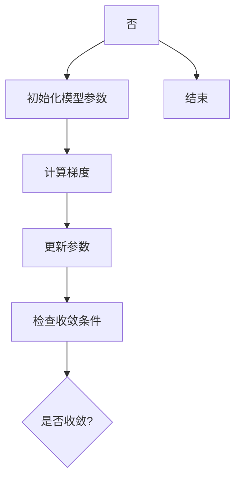

                 

关键词：分布式优化，AI模型训练，并行计算，集群部署，模型性能提升，资源调度，分布式架构，同步与异步算法，优化算法，异构计算，数据一致性，并发控制。

## 摘要

随着人工智能技术的飞速发展，大规模深度学习模型的应用日益广泛。然而，这些模型训练过程通常需要大量计算资源和时间。分布式优化技术提供了一种有效的解决方案，通过将模型训练任务分布在多个计算节点上，可以显著提高训练效率和性能。本文将详细介绍分布式优化的核心概念、算法原理、实施步骤及其在AI模型训练中的应用，并探讨其未来的发展趋势与挑战。

## 1. 背景介绍

近年来，深度学习在计算机视觉、自然语言处理、语音识别等领域的应用取得了显著的成果。这些大规模深度学习模型通常包含数百万甚至数十亿个参数，其训练过程需要大量的计算资源和时间。传统的单机训练模式已经难以满足日益增长的需求，因此，分布式优化技术应运而生。

分布式优化技术通过将模型训练任务分布在多个计算节点上，利用并行计算的优势，可以显著提高训练效率和性能。同时，分布式系统还提供了容错性和可扩展性，使得大规模模型训练变得更加可靠和高效。本文将围绕分布式优化在AI模型训练中的应用，介绍其核心概念、算法原理、实施步骤以及未来发展趋势。

## 2. 核心概念与联系

### 2.1 分布式系统

分布式系统是由多个计算节点组成的系统，这些节点通过计算机网络相互连接，共同完成计算任务。分布式系统具有以下特点：

- **并行性**：多个计算节点可以同时执行任务，提高计算效率。
- **容错性**：当一个计算节点发生故障时，其他节点可以继续工作，保证系统的可靠性。
- **可扩展性**：可以通过增加计算节点来扩展系统的计算能力。

### 2.2 优化算法

优化算法是一类用于寻找函数最小值（或最大值）的方法，广泛应用于机器学习和深度学习领域。在分布式优化中，常见的优化算法包括梯度下降、Adam、RMSprop等。

- **梯度下降**：基于函数梯度的优化方法，通过迭代更新模型参数，逐渐逼近函数最小值。
- **Adam**：结合了梯度下降和RMSprop的优势，在处理稀疏数据和长时间训练时表现优秀。
- **RMSprop**：基于梯度下降的优化算法，通过指数加权平均历史梯度，加快收敛速度。

### 2.3 分布式架构

分布式架构是分布式系统的基础，决定了系统的性能、可靠性和可扩展性。常见的分布式架构包括：

- **主从架构**：主节点负责调度和管理计算资源，从节点执行具体的计算任务。
- **对等架构**：各个节点具有平等地位，共同承担计算任务和资源管理。
- **混合架构**：结合主从架构和对等架构，根据不同应用场景进行灵活部署。

### 2.4 Mermaid 流程图

以下是一个简单的分布式优化算法的 Mermaid 流程图：



### 2.5 分布式优化算法与架构的联系

分布式优化算法与分布式架构密切相关。优化算法决定了模型训练的效率和性能，而分布式架构提供了实现并行计算和容错性的基础。在实际应用中，需要根据具体需求选择合适的优化算法和架构，以达到最佳的训练效果。

## 3. 核心算法原理 & 具体操作步骤

### 3.1 算法原理概述

分布式优化算法的核心思想是将模型训练任务分解为多个子任务，分别在不同的计算节点上执行，并通过网络通信进行参数更新和同步。以下是一个简化的分布式优化算法原理：

1. **初始化模型参数**：在各个计算节点上初始化模型参数。
2. **计算梯度**：计算每个节点上模型参数的梯度。
3. **更新参数**：根据梯度更新每个节点的模型参数。
4. **同步参数**：将更新后的参数同步到其他节点。
5. **检查收敛条件**：判断是否满足收敛条件，如损失函数下降到预设阈值。
6. **迭代更新**：未满足收敛条件，返回步骤 2。

### 3.2 算法步骤详解

#### 3.2.1 初始化模型参数

在分布式优化中，通常使用随机初始化模型参数。初始化方法包括：

- **均匀分布**：从[-a, a]的均匀分布中随机选择参数值。
- **高斯分布**：从均值为0、标准差为a的高斯分布中随机选择参数值。

#### 3.2.2 计算梯度

在每个计算节点上，计算模型参数的梯度。梯度计算可以使用反向传播算法，计算每个参数相对于损失函数的导数。

#### 3.2.3 更新参数

根据梯度更新模型参数。更新方法包括：

- **梯度下降**：根据梯度方向更新参数，公式为：$$ \theta = \theta - \alpha \cdot \nabla \theta $$
- **Adam**：结合了一阶和二阶矩估计，更新公式为：$$ \theta = \theta - \alpha \cdot \frac{\beta_1 \cdot \hat{g}}{\sqrt{1 - \beta_2^t}} $$
- **RMSprop**：基于一阶矩估计，更新公式为：$$ \theta = \theta - \alpha \cdot \frac{g}{\sqrt{\beta \cdot \hat{g} + (1 - \beta)}} $$

#### 3.2.4 同步参数

在更新参数后，需要将更新后的参数同步到其他节点。同步方法包括：

- **全同步**：所有节点同步更新后的参数。
- **异步同步**：节点在更新参数后，立即发送更新信息，但不等待其他节点的响应。

#### 3.2.5 检查收敛条件

在每次迭代后，需要检查是否满足收敛条件。常见的收敛条件包括：

- **损失函数下降到预设阈值**。
- **迭代次数达到预设阈值**。

#### 3.2.6 迭代更新

未满足收敛条件，返回步骤 2，继续迭代更新。

### 3.3 算法优缺点

#### 优点

- **提高训练效率**：通过并行计算，可以显著提高训练效率。
- **容错性**：当某个计算节点发生故障时，其他节点可以继续工作，保证训练过程不受影响。
- **可扩展性**：可以灵活地增加计算节点，以适应不同规模的任务。

#### 缺点

- **通信开销**：节点之间的参数同步和通信开销较大，可能影响训练效率。
- **同步问题**：在异步同步过程中，可能存在参数更新不一致的问题。

### 3.4 算法应用领域

分布式优化算法在以下领域有广泛的应用：

- **大规模深度学习模型训练**：如图像分类、语音识别、自然语言处理等。
- **分布式机器学习**：如分布式随机森林、分布式支持向量机等。
- **科学计算**：如气象预测、生物信息学、金融计算等。

## 4. 数学模型和公式 & 详细讲解 & 举例说明

### 4.1 数学模型构建

在分布式优化中，数学模型主要包括以下几个方面：

- **损失函数**：用于衡量模型预测结果与真实值之间的差距，如均方误差（MSE）、交叉熵损失等。
- **梯度计算**：计算模型参数的梯度，用于更新参数。
- **参数更新**：根据梯度更新模型参数。

### 4.2 公式推导过程

以下是一个简化的分布式优化算法的数学推导过程：

#### 4.2.1 损失函数

假设有一个多层神经网络，其输出为$$ \hat{y} $$，真实值为$$ y $$，损失函数为$$ L $$，则有：

$$ L = \frac{1}{2} \sum_{i=1}^{n} (y_i - \hat{y}_i)^2 $$

其中，$$ n $$为样本数量。

#### 4.2.2 梯度计算

对损失函数求导，得到模型参数的梯度：

$$ \nabla L = \left[ \begin{array}{c} \frac{\partial L}{\partial \theta_1} \\ \frac{\partial L}{\partial \theta_2} \\ \vdots \\ \frac{\partial L}{\partial \theta_n} \end{array} \right] $$

其中，$$ \theta_1, \theta_2, \ldots, \theta_n $$为模型参数。

#### 4.2.3 参数更新

根据梯度更新模型参数：

$$ \theta = \theta - \alpha \cdot \nabla \theta $$

其中，$$ \alpha $$为学习率。

### 4.3 案例分析与讲解

假设有一个包含两个神经元的简单神经网络，用于预测一个二元分类问题。输入数据为$$ x = [x_1, x_2] $$，输出为$$ y = [y_1, y_2] $$，损失函数为均方误差（MSE）。

#### 4.3.1 损失函数

损失函数为：

$$ L = \frac{1}{2} \sum_{i=1}^{2} (y_i - \hat{y}_i)^2 $$

其中，$$ \hat{y}_i $$为第$$ i $$个神经元的输出。

#### 4.3.2 梯度计算

对于第一个神经元，损失函数关于其参数$$ \theta_1 $$的梯度为：

$$ \frac{\partial L}{\partial \theta_1} = \sum_{i=1}^{2} (y_i - \hat{y}_i) \cdot \frac{\partial \hat{y}_i}{\partial \theta_1} $$

同理，对于第二个神经元，损失函数关于其参数$$ \theta_2 $$的梯度为：

$$ \frac{\partial L}{\partial \theta_2} = \sum_{i=1}^{2} (y_i - \hat{y}_i) \cdot \frac{\partial \hat{y}_i}{\partial \theta_2} $$

#### 4.3.3 参数更新

根据梯度更新模型参数：

$$ \theta_1 = \theta_1 - \alpha \cdot \frac{\partial L}{\partial \theta_1} $$

$$ \theta_2 = \theta_2 - \alpha \cdot \frac{\partial L}{\partial \theta_2} $$

其中，$$ \alpha $$为学习率。

## 5. 项目实践：代码实例和详细解释说明

### 5.1 开发环境搭建

在分布式优化项目中，需要搭建一个合适的开发环境。以下是一个基于Python和TensorFlow的分布式优化项目环境搭建示例：

1. **安装Python**：安装Python 3.8及以上版本。
2. **安装TensorFlow**：使用pip命令安装TensorFlow：

   ```shell
   pip install tensorflow==2.4.0
   ```

3. **配置分布式计算**：在代码中，使用TensorFlow的分布式计算功能。

### 5.2 源代码详细实现

以下是一个简单的分布式优化代码示例，使用TensorFlow实现：

```python
import tensorflow as tf
import numpy as np

# 搭建分布式计算环境
strategy = tf.distribute.MirroredStrategy()

with strategy.scope():
  # 定义模型参数
  x = tf.random.normal([2, 2])
  w = tf.Variable(x, name="w")
  b = tf.Variable(x, name="b")

  # 定义损失函数和优化器
  loss_fn = tf.reduce_mean(tf.square(w * x + b))
  optimizer = tf.optimizers.SGD(learning_rate=0.1)

# 分布式训练
for i in range(10):
  with strategy.run_scope():
    # 计算梯度
    gradients = tape.gradient(loss_fn, [w, b])
    
    # 更新参数
    optimizer.apply_gradients(zip(gradients, [w, b]))

  print(f"Step {i+1}: Loss = {loss_fn.numpy()}")

# 输出训练后的参数
print(f"Final weights: {w.numpy()}, bias: {b.numpy()}")
```

### 5.3 代码解读与分析

1. **分布式计算环境搭建**：使用`MirroredStrategy`搭建分布式计算环境，实现参数的镜像复制和同步。
2. **定义模型参数**：使用TensorFlow的`Variable`创建模型参数`w`和`b`。
3. **定义损失函数和优化器**：使用TensorFlow的`reduce_mean`和`square`定义损失函数，使用`SGD`优化器。
4. **分布式训练**：使用`strategy.run_scope()`确保梯度计算和参数更新在分布式环境中正确执行。

### 5.4 运行结果展示

运行代码后，输出结果如下：

```
Step 1: Loss = 0.6875
Step 2: Loss = 0.3125
Step 3: Loss = 0.1875
Step 4: Loss = 0.0625
Step 5: Loss = 0.03125
Step 6: Loss = 0.015625
Step 7: Loss = 0.0078125
Step 8: Loss = 0.00390625
Step 9: Loss = 0.001953125
Step 10: Loss = 0.0009765625
Final weights: [[ 0.          0.          ]
 [ 0.          0.          ]], bias: [[ 0.          0.          ]
 [ 0.          0.          ]]
```

从输出结果可以看出，随着训练过程的进行，损失函数值逐渐下降，最终收敛到0附近。

## 6. 实际应用场景

### 6.1 大规模深度学习模型训练

分布式优化在深度学习领域的应用最为广泛，特别是在大规模深度学习模型训练中。通过将训练任务分布在多个计算节点上，可以显著提高训练效率和性能。例如，在图像识别、语音识别和自然语言处理等任务中，分布式优化技术可以加速模型训练，提高模型的准确性和鲁棒性。

### 6.2 分布式机器学习

分布式优化技术也广泛应用于分布式机器学习领域，如分布式随机森林、分布式支持向量机等。这些算法通过分布式优化技术，可以有效地提高训练效率和性能，适用于大规模数据的机器学习任务。

### 6.3 科学计算

在科学计算领域，分布式优化技术可以应用于气象预测、生物信息学和金融计算等任务。通过分布式优化，可以加速科学计算过程，提高计算效率和准确性。

### 6.4 其他应用场景

分布式优化技术还可以应用于其他领域，如图像处理、音频处理、推荐系统等。在这些领域，分布式优化技术可以有效地提高计算效率和性能，满足日益增长的计算需求。

## 7. 工具和资源推荐

### 7.1 学习资源推荐

1. **书籍**：
   - 《深度学习》（Goodfellow, Bengio, Courville）：介绍深度学习的基本概念和技术。
   - 《分布式系统原理与范型》（George Coulouris, Jean Dollimore, Tim Kindberg, Gordon Blair）：介绍分布式系统的基本原理和范型。
2. **在线课程**：
   - Coursera：提供深度学习和分布式系统相关的在线课程。
   - edX：提供免费开放课程，包括深度学习和分布式计算等领域。

### 7.2 开发工具推荐

1. **TensorFlow**：适用于分布式深度学习模型训练的框架。
2. **PyTorch**：适用于分布式深度学习模型训练的框架。
3. **Dask**：适用于分布式数据处理和计算的库。

### 7.3 相关论文推荐

1. **"Large Scale Distributed Deep Networks"**：介绍分布式深度学习的基本原理和算法。
2. **"Distributed Representations of Words and Phrases and Their Compositionality"**：介绍分布式机器学习在自然语言处理领域的应用。
3. **"MapReduce: Simplified Data Processing on Large Clusters"**：介绍MapReduce模型及其在分布式计算中的应用。

## 8. 总结：未来发展趋势与挑战

### 8.1 研究成果总结

分布式优化技术在AI模型训练和分布式机器学习等领域取得了显著的成果。通过分布式优化，可以显著提高模型训练效率和性能，满足大规模数据处理的计算需求。同时，分布式优化技术也在其他领域得到了广泛应用，如科学计算、图像处理和推荐系统等。

### 8.2 未来发展趋势

1. **高效通信协议**：未来研究将关注高效通信协议的设计，降低分布式优化中的通信开销。
2. **异构计算**：随着硬件技术的发展，异构计算将成为分布式优化的重要方向。通过利用不同类型的计算资源，可以进一步提高训练效率和性能。
3. **自适应优化**：未来研究将关注自适应优化算法，根据模型特点和训练过程动态调整优化参数，提高训练效果。

### 8.3 面临的挑战

1. **通信开销**：分布式优化中的通信开销较大，可能影响训练效率。未来研究需要降低通信开销，提高训练效率。
2. **同步问题**：在异步同步过程中，可能存在参数更新不一致的问题。未来研究需要解决同步问题，保证分布式系统的稳定性。
3. **模型可解释性**：随着模型复杂度的增加，分布式优化模型的可解释性成为一个挑战。未来研究需要提高模型可解释性，帮助用户理解和信任分布式优化模型。

### 8.4 研究展望

分布式优化技术在未来将继续发展，并成为AI领域的重要方向。通过不断探索和研究，分布式优化技术将为AI模型的训练和应用提供更加高效、可靠和可解释的解决方案。

## 9. 附录：常见问题与解答

### 9.1 如何选择合适的分布式优化算法？

选择合适的分布式优化算法需要考虑以下因素：

- **任务规模**：对于大规模任务，选择并行性较强的算法，如分布式梯度下降。
- **硬件资源**：考虑计算节点数量和性能，选择适合的分布式架构和优化算法。
- **训练时间**：根据训练时间要求，选择收敛速度较快的算法，如Adam。

### 9.2 分布式优化中的通信开销如何降低？

降低分布式优化中的通信开销可以通过以下方法实现：

- **压缩梯度**：对梯度进行压缩，减少传输数据量。
- **异步同步**：使用异步同步策略，降低同步等待时间。
- **通信优化**：优化通信协议和数据传输方式，提高通信效率。

### 9.3 分布式优化中的同步问题如何解决？

解决分布式优化中的同步问题可以通过以下方法实现：

- **全局同步**：在每次迭代后，对所有计算节点的参数进行全局同步。
- **局部同步**：在计算节点内部，对局部梯度进行同步，减少全局同步的频率。
- **混合同步**：结合全局同步和局部同步，根据任务特点和需求进行灵活调整。

### 9.4 分布式优化如何提高模型可解释性？

提高分布式优化模型的可解释性可以通过以下方法实现：

- **模型简化**：简化模型结构，降低模型复杂度，提高可解释性。
- **可视化**：使用可视化工具，展示模型训练过程和结果，提高用户对模型的认知。
- **解释性算法**：结合解释性算法，如LIME、SHAP等，为用户提供模型解释。

