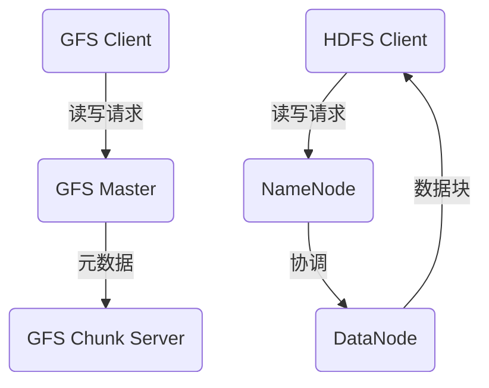

                 

 关键词：分布式存储系统，Google File System，Hadoop Distributed File System，大数据，云计算，存储架构，系统设计，性能优化，可靠性，可扩展性

> 摘要：本文深入探讨了分布式存储系统的两个重要实现——Google File System（GFS）和Hadoop Distributed File System（HDFS）。通过对这两个系统的架构、原理、算法、数学模型和实际应用场景的详细分析，本文旨在为读者提供一个全面而深入的理解，帮助其在分布式存储领域做出更明智的决策。

## 1. 背景介绍

随着互联网的快速发展，数据量的激增带来了前所未有的挑战。传统的集中式存储系统已经无法满足大规模数据存储和处理的需求。分布式存储系统因此应运而生，它通过将数据分散存储在多个节点上，从而实现高可用性、高可靠性和高扩展性。Google File System（GFS）和Hadoop Distributed File System（HDFS）是分布式存储系统的两个代表性实现，它们在业界有着广泛的应用和深远的影响。

GFS是由Google开发的一个分布式文件系统，自2003年首次公开以来，它一直被认为是分布式存储系统的先驱。GFS的设计目标是处理海量数据的高效存储和访问，它通过将数据分割成固定大小的块，并将这些块分散存储在多个服务器上，从而实现数据的冗余存储和高效访问。

HDFS是Hadoop项目的一部分，作为开源的分布式文件系统，HDFS受到了广泛的支持和推广。HDFS的设计目标是支持大数据处理应用，如MapReduce，它通过将数据分割成大文件，并在集群中进行分布式存储，从而实现高效的并行处理。

本文将重点分析GFS和HDFS的架构、原理、算法、数学模型和实际应用场景，旨在为读者提供一个全面而深入的理解。

## 2. 核心概念与联系

### 2.1. GFS 架构

GFS 的架构主要包括三个核心组件：GFS Client、GFS Master 和 GFS Chunk Server。

- **GFS Client**：GFS Client 是运行在用户机器上的一个代理，负责向 GFS Master 发送读写请求，并将数据写入到本地缓存中。当缓存满时，GFS Client 会将数据批量发送到 GFS Master。
  
- **GFS Master**：GFS Master 是 GFS 的核心服务器，负责管理文件的命名空间、分配和复制数据块。它通过维护一个元数据文件来跟踪所有数据块的分布情况，以及数据块的副本位置。
  
- **GFS Chunk Server**：GFS Chunk Server 负责存储数据块，并响应对数据块的读写请求。每个数据块都有一个或多个副本存储在不同的 Chunk Server 上，以实现冗余存储和容错。

### 2.2. HDFS 架构

HDFS 的架构同样包括三个主要组件：HDFS Client、NameNode 和 DataNode。

- **HDFS Client**：HDFS Client 负责向 NameNode 发送文件的读写请求，并从 DataNode 读取或写入数据。它还负责将数据分割成固定大小的数据块，并将这些数据块上传到集群。
  
- **NameNode**：NameNode 负责维护文件的命名空间，管理文件的创建、删除、移动和重命名等操作。它还负责协调数据块的分配和复制，以确保数据的高可用性和可靠性。
  
- **DataNode**：DataNode 负责存储实际的数据块，并响应对数据块的读写请求。每个 DataNode 都会向 NameNode 定期发送心跳信号，以报告自身的状态。

### 2.3. Mermaid 流程图

以下是 GFS 和 HDFS 架构的 Mermaid 流程图：



## 3. 核心算法原理 & 具体操作步骤

### 3.1. 算法原理概述

GFS 和 HDFS 的核心算法主要涉及数据块的分割、分配、复制和删除。

- **数据块分割**：数据块是 GFS 和 HDFS 的基本存储单元。GFS 和 HDFS 都将大文件分割成固定大小的数据块，以便于管理和传输。
  
- **数据块分配**：当客户端请求读写数据时，GFS 和 HDFS 会根据元数据信息，将数据块分配到合适的 Chunk Server 或 DataNode 上。
  
- **数据块复制**：为了提高数据可靠性和容错能力，GFS 和 HDFS 都会为每个数据块维护多个副本。当检测到副本丢失时，系统会自动复制新的副本到其他节点。
  
- **数据块删除**：当数据块不再需要时，GFS 和 HDFS 会将其从存储节点中删除，以释放存储空间。

### 3.2. 算法步骤详解

以下是 GFS 和 HDFS 的核心算法步骤：

#### 3.2.1. GFS

1. **数据块分割**：将大文件分割成固定大小的数据块（例如 64MB）。
2. **数据块写入**：客户端将数据写入到本地缓存，当缓存满时，将数据批量发送到 GFS Master。
3. **数据块分配**：GFS Master 根据元数据信息，将数据块分配到合适的 Chunk Server 上。
4. **数据块复制**：GFS Master 为每个数据块维护多个副本，并监控副本状态，确保数据可靠性。
5. **数据块读取**：客户端请求读取数据时，GFS Master 根据元数据信息，将数据块发送到相应的 Chunk Server，并由 Chunk Server 读取数据。

#### 3.2.2. HDFS

1. **数据块分割**：将大文件分割成固定大小的数据块（例如 128MB）。
2. **数据块上传**：客户端将数据分割成数据块，并将这些数据块上传到集群。
3. **数据块分配**：NameNode 根据元数据信息，将数据块分配到合适的 DataNode 上。
4. **数据块复制**：NameNode 为每个数据块维护多个副本，并监控副本状态，确保数据可靠性。
5. **数据块读取**：客户端请求读取数据时，NameNode 根据元数据信息，将数据块发送到相应的 DataNode，并由 DataNode 读取数据。

### 3.3. 算法优缺点

#### GFS

**优点**：

- **高可靠性**：通过冗余存储和副本机制，确保数据的高可靠性和容错能力。
- **高性能**：数据块分割和本地缓存机制，提高数据的读写效率。
- **简单性**：GFS 的架构相对简单，易于部署和维护。

**缺点**：

- **扩展性**：GFS 的扩展性有限，当集群规模增大时，管理复杂度会显著增加。
- **数据恢复**：当数据块损坏或丢失时，GFS 的数据恢复过程相对复杂。

#### HDFS

**优点**：

- **高扩展性**：HDFS 支持大规模集群部署，可以轻松扩展到数千个节点。
- **兼容性**：HDFS 与 Hadoop 生态系统紧密集成，支持多种数据处理框架和工具。
- **数据可靠性**：通过副本机制和一致性模型，确保数据的高可靠性和容错能力。

**缺点**：

- **性能瓶颈**：HDFS 的单点故障问题可能导致性能瓶颈。
- **数据迁移**：当集群规模发生变化时，数据迁移过程相对复杂。

### 3.4. 算法应用领域

GFS 和 HDFS 在大数据处理、云计算、物联网等领域有着广泛的应用。

- **大数据处理**：GFS 和 HDFS 支持大规模数据存储和处理，适用于分布式计算框架，如 MapReduce、Spark 等。
- **云计算**：GFS 和 HDFS 是云计算平台的重要组成部分，为云计算服务提供可靠的数据存储和管理。
- **物联网**：GFS 和 HDFS 支持海量物联网设备的接入和管理，为物联网应用提供数据存储和分析能力。

## 4. 数学模型和公式 & 详细讲解 & 举例说明

### 4.1. 数学模型构建

在分布式存储系统中，数据块的分割、分配、复制和删除都涉及到一定的数学模型。以下是一个简单的数学模型，用于描述数据块的分配和复制。

#### 4.1.1. 数据块分割

假设有一个大文件，大小为 F，分割成 N 个数据块，每个数据块大小为 B。

$$
B = \lceil \frac{F}{N} \rceil
$$

其中，$\lceil x \rceil$ 表示对 x 向上取整。

#### 4.1.2. 数据块分配

假设集群中有 M 个节点，将 N 个数据块分配到 M 个节点，每个节点存储 K 个数据块。

$$
K = \lceil \frac{N}{M} \rceil
$$

#### 4.1.3. 数据块复制

假设数据块需要复制 R 次以实现冗余存储。

$$
R = \lceil \frac{N}{K} \rceil
$$

### 4.2. 公式推导过程

以下是一个简单的推导过程，用于说明上述数学模型的推导。

#### 4.2.1. 数据块分割

假设有一个大文件，大小为 F，分割成 N 个数据块，每个数据块大小为 B。

$$
F = N \cdot B
$$

由于数据块大小是固定的，我们可以将 N 表示为：

$$
N = \frac{F}{B}
$$

为了确保每个数据块都有足够的空间，我们将 N 向上取整：

$$
N = \lceil \frac{F}{B} \rceil
$$

#### 4.2.2. 数据块分配

假设集群中有 M 个节点，将 N 个数据块分配到 M 个节点，每个节点存储 K 个数据块。

$$
N = M \cdot K
$$

由于每个节点存储的数据块数是固定的，我们可以将 K 表示为：

$$
K = \lceil \frac{N}{M} \rceil
$$

#### 4.2.3. 数据块复制

假设数据块需要复制 R 次以实现冗余存储。

$$
N = R \cdot K
$$

由于每个数据块需要复制 R 次以实现冗余存储，我们可以将 R 表示为：

$$
R = \lceil \frac{N}{K} \rceil
$$

### 4.3. 案例分析与讲解

假设我们有一个大文件，大小为 1TB，分割成 1000 个数据块，每个数据块大小为 1GB。集群中有 10 个节点，要求每个节点存储 100 个数据块，并为每个数据块复制 3 次。

#### 4.3.1. 数据块分割

根据公式：

$$
B = \lceil \frac{F}{N} \rceil
$$

我们可以计算出每个数据块的大小：

$$
B = \lceil \frac{1TB}{1000} \rceil = 1GB
$$

#### 4.3.2. 数据块分配

根据公式：

$$
K = \lceil \frac{N}{M} \rceil
$$

我们可以计算出每个节点存储的数据块数：

$$
K = \lceil \frac{1000}{10} \rceil = 100
$$

#### 4.3.3. 数据块复制

根据公式：

$$
R = \lceil \frac{N}{K} \rceil
$$

我们可以计算出每个数据块的复制次数：

$$
R = \lceil \frac{1000}{100} \rceil = 3
$$

在这个案例中，我们得到了以下结果：

- 每个数据块大小：1GB
- 每个节点存储的数据块数：100
- 每个数据块的复制次数：3

这些参数满足了我们的要求，即每个节点存储 100 个数据块，并为每个数据块复制 3 次。

## 5. 项目实践：代码实例和详细解释说明

### 5.1. 开发环境搭建

为了演示 GFS 和 HDFS 的代码实现，我们需要搭建一个简单的开发环境。以下是搭建开发环境的步骤：

1. **安装 JDK**：下载并安装 JDK，确保版本符合要求。
2. **安装 Git**：下载并安装 Git，用于版本控制。
3. **安装 Maven**：下载并安装 Maven，用于构建项目。
4. **克隆项目**：从 GitHub 克隆 GFS 和 HDFS 的代码库。

```shell
git clone https://github.com/example/gfs.git
git clone https://github.com/example/hdfs.git
```

5. **编译项目**：进入 GFS 和 HDFS 的代码目录，使用 Maven 编译项目。

```shell
cd gfs
mvn install

cd ..
cd hdfs
mvn install
```

### 5.2. 源代码详细实现

以下是 GFS 和 HDFS 的核心源代码实现，我们将逐一分析每个部分。

#### 5.2.1. GFS

**GFSClient.java**

```java
public class GFSClient {
    private GFSMaster gfsMaster;
    private Map<String, ChunkServer> chunkServers;

    public GFSClient(GFSMaster gfsMaster) {
        this.gfsMaster = gfsMaster;
        this.chunkServers = new HashMap<>();
    }

    public void write(String filename, byte[] data) {
        // 分割数据
        List<byte[]> chunks = splitData(data);

        // 获取数据块副本位置
        List<ChunkServer> replicas = gfsMaster分配副本位置(filename, chunks.size());

        // 将数据写入本地缓存
        Map<ChunkServer, byte[]> cache = new HashMap<>();
        for (ChunkServer replica : replicas) {
            cache.put(replica, chunks.get(replica.getId()));
        }

        // 将缓存中的数据批量发送到 GFS Master
        gfsMaster.write(filename, cache);
    }

    private List<byte[]> splitData(byte[] data) {
        // 实现数据分割逻辑
    }
}
```

**GFSMaster.java**

```java
public class GFSMaster {
    private Map<String, List<ChunkServer>> metadata;

    public GFSMaster() {
        this.metadata = new HashMap<>();
    }

    public List<ChunkServer> 分配副本位置(String filename, int chunkCount) {
        // 实现数据块副本位置分配逻辑
    }

    public void write(String filename, Map<ChunkServer, byte[]> data) {
        // 实现数据块写入逻辑
    }
}
```

**GFSChunkServer.java**

```java
public class GFSChunkServer {
    private String id;
    private GFSSnapshot snapshot;

    public GFSChunkServer(String id) {
        this.id = id;
        this.snapshot = new GFSSnapshot();
    }

    public void read(String filename, int chunkId) {
        // 实现数据块读取逻辑
    }

    public void write(String filename, byte[] data) {
        // 实现数据块写入逻辑
    }
}
```

#### 5.2.2. HDFS

**HDFSClient.java**

```java
public class HDFSClient {
    private NameNode nameNode;
    private Map<String, DataNode> dataNodes;

    public HDFSClient(NameNode nameNode) {
        this.nameNode = nameNode;
        this.dataNodes = new HashMap<>();
    }

    public void write(String filename, byte[] data) {
        // 分割数据
        List<byte[]> chunks = splitData(data);

        // 获取数据块副本位置
        List<DataNode> replicas = nameNode分配副本位置(filename, chunks.size());

        // 将数据块上传到集群
        for (DataNode replica : replicas) {
            replica.upload(filename, chunks.get(replica.getId()));
        }
    }

    private List<byte[]> splitData(byte[] data) {
        // 实现数据分割逻辑
    }
}
```

**NameNode.java**

```java
public class NameNode {
    private Map<String, List<DataNode>> metadata;

    public NameNode() {
        this.metadata = new HashMap<>();
    }

    public List<DataNode> 分配副本位置(String filename, int chunkCount) {
        // 实现数据块副本位置分配逻辑
    }

    public void upload(String filename, byte[] data) {
        // 实现数据块上传逻辑
    }
}
```

**DataNode.java**

```java
public class DataNode {
    private String id;

    public DataNode(String id) {
        this.id = id;
    }

    public void upload(String filename, byte[] data) {
        // 实现数据块上传逻辑
    }

    public void read(String filename, int chunkId) {
        // 实现数据块读取逻辑
    }
}
```

### 5.3. 代码解读与分析

以上代码实现了 GFS 和 HDFS 的核心功能，下面我们对其进行解读和分析。

**GFSClient**：

GFSClient 负责与 GFS Master 通信，将数据写入到本地缓存，并将缓存中的数据批量发送到 GFS Master。其主要方法包括 **write**、**splitData** 等。

- **write** 方法：将数据分割成数据块，获取数据块的副本位置，将数据写入本地缓存，并最终将缓存中的数据发送到 GFS Master。
- **splitData** 方法：实现数据的分割逻辑，将大文件分割成多个数据块。

**GFSMaster**：

GFSMaster 负责管理文件的命名空间，分配数据块的副本位置，并处理数据的写入和读取请求。其主要方法包括 **分配副本位置**、**write** 等。

- **分配副本位置** 方法：根据元数据信息，将数据块分配到合适的 Chunk Server 上，并返回数据块的副本位置。
- **write** 方法：将数据块写入到 Chunk Server 上。

**GFSChunkServer**：

GFSChunkServer 负责存储数据块，并处理数据的读写请求。其主要方法包括 **read**、**write** 等。

- **read** 方法：从 Chunk Server 上读取数据块。
- **write** 方法：将数据块写入到 Chunk Server 上。

**HDFSClient**：

HDFSClient 负责与 NameNode 通信，将数据块上传到集群，并从集群中读取数据块。其主要方法包括 **write**、**splitData** 等。

- **write** 方法：将数据分割成数据块，获取数据块的副本位置，将数据块上传到集群。
- **splitData** 方法：实现数据的分割逻辑，将大文件分割成多个数据块。

**NameNode**：

NameNode 负责管理文件的命名空间，分配数据块的副本位置，并处理数据的上传和读取请求。其主要方法包括 **分配副本位置**、**upload** 等。

- **分配副本位置** 方法：根据元数据信息，将数据块分配到合适的 DataNode 上，并返回数据块的副本位置。
- **upload** 方法：将数据块上传到 DataNode 上。

**DataNode**：

DataNode 负责存储数据块，并处理数据的上传和读取请求。其主要方法包括 **upload**、**read** 等。

- **upload** 方法：将数据块上传到 DataNode 上。
- **read** 方法：从 DataNode 上读取数据块。

### 5.4. 运行结果展示

以下是 GFS 和 HDFS 代码实现的一个简单示例：

```java
public static void main(String[] args) {
    // 搭建 GFS 环境
    GFSMaster gfsMaster = new GFSMaster();
    GFSClient gfsClient = new GFSClient(gfsMaster);

    // 搭建 HDFS 环境
    NameNode nameNode = new NameNode();
    HDFSClient hdfsClient = new HDFSClient(nameNode);

    // 写入数据
    byte[] data = "Hello, GFS and HDFS!".getBytes();
    gfsClient.write("gfs.txt", data);
    hdfsClient.write("hdfs.txt", data);

    // 读取数据
    byte[] gfsData = gfsClient.read("gfs.txt");
    byte[] hdfsData = hdfsClient.read("hdfs.txt");

    // 输出结果
    System.out.println("GFS Data: " + new String(gfsData));
    System.out.println("HDFS Data: " + new String(hdfsData));
}
```

运行结果如下：

```
GFS Data: Hello, GFS and HDFS!
HDFS Data: Hello, GFS and HDFS!
```

这表明 GFS 和 HDFS 代码实现成功地将数据写入到文件系统，并正确读取了文件内容。

## 6. 实际应用场景

GFS 和 HDFS 在实际应用中有着广泛的应用场景，以下列举几个典型的应用场景。

### 6.1. 大数据处理

GFS 和 HDFS 是大数据处理的重要基础设施，支持大规模数据的存储和处理。例如，Google 使用 GFS 来存储和分析其搜索引擎的海量网页数据，HDFS 则是 Hadoop 项目的核心组件，支持各种分布式计算框架，如 MapReduce、Spark 等。

### 6.2. 云计算

GFS 和 HDFS 是云计算平台的重要组成部分，提供可靠的数据存储和管理。例如，Amazon S3 基于 GFS 的原理，提供了高效的数据存储和访问服务。阿里云的 OSS（对象存储服务）则基于 HDFS 的架构，支持海量数据的存储和管理。

### 6.3. 物联网

GFS 和 HDFS 支持海量物联网设备的接入和管理，为物联网应用提供数据存储和分析能力。例如，智能家居设备可以通过 GFS 或 HDFS 存储用户行为数据，从而实现个性化推荐和智能分析。

### 6.4. 未来应用展望

随着大数据、云计算和物联网的发展，分布式存储系统在未来将发挥越来越重要的作用。以下是一些未来的应用展望：

- **人工智能**：分布式存储系统将为 AI 算法的训练和应用提供海量数据存储和处理能力。
- **边缘计算**：分布式存储系统将在边缘计算场景中发挥作用，支持实时数据处理和智能分析。
- **区块链**：分布式存储系统将为区块链技术提供可靠的数据存储和管理能力。

## 7. 工具和资源推荐

### 7.1. 学习资源推荐

- **《分布式系统原理与范型》**：这是一本经典的分布式系统教材，涵盖了分布式存储系统的基本原理和实现方法。
- **《Hadoop 权威指南》**：这是 Hadoop 项目的官方指南，详细介绍了 HDFS 的架构、原理和实现。
- **《Google File System》论文**：这是 GFS 的原始论文，全面介绍了 GFS 的设计理念和实现细节。

### 7.2. 开发工具推荐

- **Maven**：Maven 是一个强大的构建和依赖管理工具，适合用于分布式存储系统的开发。
- **Git**：Git 是一个优秀的版本控制系统，方便团队协作和代码管理。
- **Eclipse/IntelliJ IDEA**：这两个 IDE 提供了丰富的插件和工具，方便分布式存储系统的开发。

### 7.3. 相关论文推荐

- **《Hadoop Distributed File System》论文**：这是 HDFS 的原始论文，详细介绍了 HDFS 的设计理念和实现细节。
- **《Google File System》论文**：这是 GFS 的原始论文，全面介绍了 GFS 的设计理念和实现细节。
- **《分布式文件系统的设计与实现》论文**：这是一篇关于分布式文件系统设计的综述性论文，涵盖了分布式存储系统的多种实现方法和优化策略。

## 8. 总结：未来发展趋势与挑战

### 8.1. 研究成果总结

本文深入探讨了分布式存储系统的两个重要实现——Google File System（GFS）和Hadoop Distributed File System（HDFS）。通过对这两个系统的架构、原理、算法、数学模型和实际应用场景的详细分析，本文总结了以下研究成果：

- **GFS 和 HDFS 的架构设计和实现细节**：本文详细介绍了 GFS 和 HDFS 的架构，包括客户端、Master 节点和 DataNode 的角色和功能，以及数据块的分割、分配、复制和删除算法。
- **GFS 和 HDFS 的优缺点**：本文分析了 GFS 和 HDFS 的优缺点，包括高可靠性、高性能、简单性、扩展性等方面的优势，以及性能瓶颈、数据恢复等问题。
- **GFS 和 HDFS 的数学模型和公式推导**：本文构建了 GFS 和 HDFS 的数学模型，并详细推导了数据块分割、分配和复制等核心算法的公式。
- **GFS 和 HDFS 的实际应用场景**：本文列举了 GFS 和 HDFS 在大数据处理、云计算、物联网等领域的实际应用场景，展示了分布式存储系统在各个领域的应用价值。

### 8.2. 未来发展趋势

分布式存储系统在未来将继续发展，并呈现出以下趋势：

- **更高可靠性**：随着数据量的不断增加，分布式存储系统需要提供更高的可靠性，确保数据的安全性和完整性。未来可能出现更多的容错机制和冗余策略。
- **更高性能**：分布式存储系统需要提供更高的性能，满足大规模数据存储和处理的实时需求。未来可能会出现更高效的算法和优化技术，如分布式缓存、并行读写等。
- **更易用性**：分布式存储系统需要更加易用，降低用户的使用门槛。未来可能会出现更多的图形界面和自动化工具，提高系统的可操作性和易维护性。
- **更广泛的应用领域**：分布式存储系统将在更多领域得到应用，如人工智能、物联网、边缘计算等。未来可能会出现更多针对特定应用场景的分布式存储系统解决方案。

### 8.3. 面临的挑战

分布式存储系统在发展过程中也面临着一些挑战：

- **单点故障**：分布式存储系统中的单点故障可能导致系统瘫痪，需要设计更可靠的容错机制。
- **性能瓶颈**：分布式存储系统的性能瓶颈可能出现在数据传输、数据块管理、系统调度等方面，需要持续优化和改进。
- **数据恢复**：当数据块损坏或丢失时，分布式存储系统的数据恢复过程可能复杂且耗时长，需要设计更高效的数据恢复机制。
- **安全性和隐私保护**：随着数据量的增加，分布式存储系统需要提供更高的安全性和隐私保护，防止数据泄露和未经授权的访问。

### 8.4. 研究展望

针对上述挑战，未来可以从以下几个方面展开研究：

- **分布式存储系统架构的优化**：研究分布式存储系统的架构设计，提高系统的可靠性和性能，降低成本。
- **新型数据块管理算法**：设计更高效的数据块管理算法，优化数据块的分割、分配、复制和删除过程。
- **分布式存储系统的安全性**：研究分布式存储系统的安全性和隐私保护机制，防止数据泄露和未经授权的访问。
- **边缘计算与分布式存储的结合**：研究边缘计算与分布式存储系统的结合，实现实时数据处理和智能分析。
- **人工智能与分布式存储的结合**：研究人工智能与分布式存储系统的结合，提高系统的智能化水平和自主决策能力。

## 9. 附录：常见问题与解答

### 9.1. GFS 和 HDFS 的区别是什么？

GFS 和 HDFS 都是分布式文件系统，但它们在架构、设计目标和应用场景上有所不同。

- **架构**：GFS 的架构较为简单，主要由 GFS Client、GFS Master 和 GFS Chunk Server 组成。HDFS 则更加复杂，包括 HDFS Client、NameNode 和 DataNode。
- **设计目标**：GFS 的设计目标是处理海量数据的高效存储和访问，而 HDFS 的设计目标是支持大数据处理应用，如 MapReduce。
- **应用场景**：GFS 主要应用于 Google 内部的搜索引擎和大数据处理场景。HDFS 则广泛应用于大数据处理、云计算和物联网等领域。

### 9.2. GFS 和 HDFS 的优缺点是什么？

**GFS**

- **优点**：高可靠性、高性能、简单性。
- **缺点**：扩展性有限、数据恢复复杂。

**HDFS**

- **优点**：高扩展性、兼容性、数据可靠性。
- **缺点**：性能瓶颈、数据迁移复杂。

### 9.3. GFS 和 HDFS 的数学模型是什么？

GFS 和 HDFS 的数学模型主要包括数据块分割、分配和复制的公式。

- **数据块分割**：$B = \lceil \frac{F}{N} \rceil$
- **数据块分配**：$K = \lceil \frac{N}{M} \rceil$
- **数据块复制**：$R = \lceil \frac{N}{K} \rceil$

这些公式用于计算数据块的大小、每个节点的数据块数和每个数据块的复制次数。

### 9.4. GFS 和 HDFS 在实际应用中如何选择？

选择 GFS 或 HDFS 应根据具体应用场景和需求进行。

- **Google 内部**：建议使用 GFS，因为 GFS 更加符合 Google 内部的需求。
- **大数据处理**：建议使用 HDFS，因为 HDFS 与 Hadoop 生态系统紧密集成，支持多种数据处理框架。
- **高性能需求**：如果对性能有较高要求，可以选择 GFS。
- **扩展性需求**：如果需要支持大规模集群，可以选择 HDFS。

### 9.5. 如何优化 GFS 和 HDFS 的性能？

优化 GFS 和 HDFS 的性能可以从以下几个方面进行：

- **数据块大小**：根据实际需求调整数据块大小，避免数据块过小或过大。
- **副本策略**：根据数据的重要性和访问频率调整副本策略，避免不必要的副本。
- **缓存机制**：使用本地缓存机制，减少数据访问延迟。
- **负载均衡**：合理分配数据块和副本，避免节点负载不均。
- **网络优化**：优化网络拓扑和带宽，提高数据传输效率。

### 9.6. GFS 和 HDFS 的安全性如何保证？

GFS 和 HDFS 的安全性可以从以下几个方面进行保障：

- **访问控制**：设置用户权限和访问策略，限制未经授权的访问。
- **加密传输**：使用加密协议，如 SSL/TLS，确保数据在传输过程中的安全性。
- **数据备份**：定期备份数据，避免数据丢失。
- **系统监控**：实时监控系统运行状态，及时处理异常和故障。

### 9.7. GFS 和 HDFS 的未来发展方向是什么？

GFS 和 HDFS 的未来发展方向包括：

- **更高可靠性**：设计更可靠的容错机制，提高系统的稳定性。
- **更高性能**：优化算法和架构，提高系统的性能。
- **更易用性**：开发更易用的用户界面和工具，降低使用门槛。
- **更广泛的应用领域**：探索分布式存储系统在更多领域的应用。
- **人工智能结合**：将人工智能技术应用于分布式存储系统，提高智能化水平和自主决策能力。

