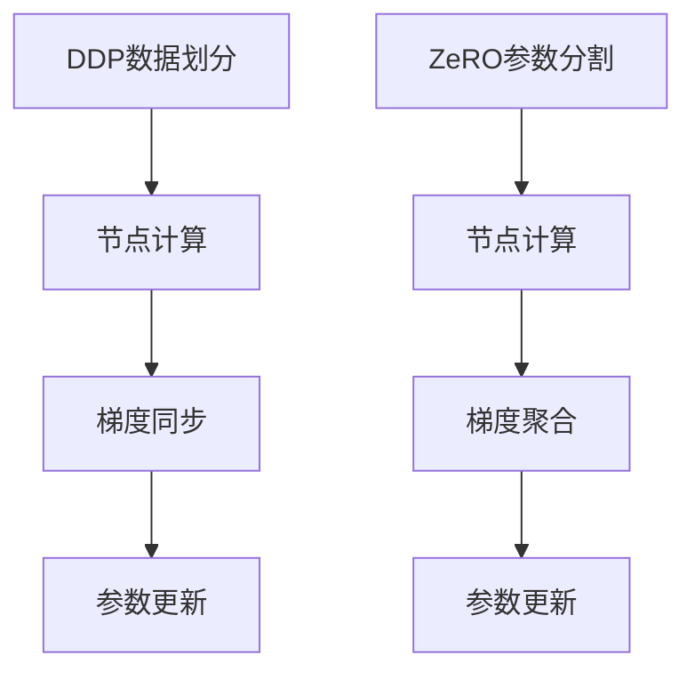

                 

关键词：分布式深度学习、DDP、ZeRO、优化策略、模型并行、数据并行、通信优化

摘要：本文将深入探讨分布式深度学习中的两种重要优化策略——DDP（Distributed Data Parallel）和ZeRO（Zero Redundancy Optimizer），从原理、实现步骤、优缺点以及实际应用场景等方面进行详细分析，旨在为读者提供关于分布式深度学习技术全面而深刻的理解。

## 1. 背景介绍

随着深度学习技术的快速发展，模型规模和训练数据量的指数级增长，单机训练已经难以满足高效训练的需求。分布式深度学习应运而生，通过将计算任务分布在多个节点上，从而提高训练速度和效率。分布式深度学习的关键在于如何高效地管理和优化分布式训练过程，其中DDP和ZeRO是两种常用的优化策略。

### 1.1 分布式深度学习的挑战

在分布式深度学习过程中，主要面临的挑战包括：
- **通信开销**：节点间的数据传输和同步会导致通信开销增加。
- **数据一致性问题**：如何保证多个节点上的模型参数保持一致。
- **计算资源分配**：如何合理分配计算资源，避免资源浪费。

### 1.2 DDP和ZeRO概述

DDP（Distributed Data Parallel）是PyTorch提供的一种分布式训练框架，通过将数据并行分布到多个节点上，实现高效训练。

ZeRO（Zero Redundancy Optimizer）则是一种针对模型参数优化策略，通过将模型参数分割到多个节点上，降低每个节点的内存占用，从而提高分布式训练的效率和可扩展性。

## 2. 核心概念与联系

### 2.1 DDP原理

DDP的核心思想是将数据并行化，每个节点负责计算部分数据上的梯度，并在全局梯度上进行同步。DDP的关键步骤包括：

1. **数据划分**：将训练数据集划分为多个子集，每个节点负责处理一个或多个子集。
2. **梯度同步**：在每个节点计算完一个迭代后的梯度后，将梯度同步到全局梯度。
3. **参数更新**：使用同步后的全局梯度更新模型参数。

### 2.2 ZeRO原理

ZeRO的核心思想是将模型参数分割到多个节点上，从而降低每个节点的内存占用。ZeRO的关键步骤包括：

1. **参数分割**：将模型参数分割到多个节点上，每个节点只存储和计算部分参数。
2. **梯度聚合**：在每个节点计算完一个迭代后的梯度后，将梯度聚合到全局梯度。
3. **参数更新**：使用同步后的全局梯度更新模型参数。

### 2.3 Mermaid流程图



## 3. 核心算法原理 & 具体操作步骤

### 3.1 算法原理概述

DDP和ZeRO的核心原理分别是数据并行和模型参数分割。DDP通过数据并行提高计算速度，而ZeRO通过参数分割降低内存占用。

### 3.2 算法步骤详解

#### 3.2.1 DDP步骤

1. **初始化**：设置分布式环境，包括节点数量和通信接口。
2. **数据划分**：将训练数据集划分为多个子集。
3. **节点训练**：每个节点独立计算一个子集的梯度。
4. **梯度同步**：将每个节点的梯度同步到全局梯度。
5. **参数更新**：使用同步后的全局梯度更新模型参数。

#### 3.2.2 ZeRO步骤

1. **初始化**：设置分布式环境，包括节点数量和通信接口。
2. **参数分割**：将模型参数分割到多个节点上。
3. **节点训练**：每个节点独立计算部分参数的梯度。
4. **梯度聚合**：将每个节点的梯度聚合到全局梯度。
5. **参数更新**：使用同步后的全局梯度更新模型参数。

### 3.3 算法优缺点

#### DDP优缺点

**优点**：
- 简单易用，无需改变原有模型代码。
- 提高计算速度，缩短训练时间。

**缺点**：
- 通信开销较大，可能降低训练效率。
- 数据一致性保证较为复杂。

#### ZeRO优缺点

**优点**：
- 降低内存占用，提高训练的可扩展性。
- 提高训练速度，减少通信开销。

**缺点**：
- 参数分割和聚合较复杂，实现难度较大。
- 可能引入一些计算误差。

### 3.4 算法应用领域

DDP和ZeRO在分布式深度学习领域具有广泛的应用，例如：
- 大规模模型训练，如BERT、GPT等。
- 分布式训练框架，如PyTorch、TensorFlow等。

## 4. 数学模型和公式 & 详细讲解 & 举例说明

### 4.1 数学模型构建

DDP和ZeRO的核心数学模型可以表示为：

$$
\text{参数更新} = \theta_{new} = \theta_{old} - \alpha \cdot \nabla f(\theta_{old})
$$

其中，$\theta_{old}$ 和 $\theta_{new}$ 分别表示旧参数和更新后的参数，$\alpha$ 是学习率，$\nabla f(\theta_{old})$ 是在旧参数下计算得到的梯度。

### 4.2 公式推导过程

DDP的推导过程：

1. **初始化**：给定初始参数 $\theta_{0}$。
2. **节点计算**：每个节点计算梯度 $\nabla f(\theta_{i})$，其中 $i$ 是节点索引。
3. **梯度同步**：将每个节点的梯度同步到全局梯度。
4. **参数更新**：使用全局梯度更新参数。

ZeRO的推导过程：

1. **初始化**：给定初始参数 $\theta_{0}$。
2. **参数分割**：将参数分割到多个节点上，每个节点只存储和计算部分参数。
3. **节点计算**：每个节点计算部分参数的梯度。
4. **梯度聚合**：将每个节点的梯度聚合到全局梯度。
5. **参数更新**：使用全局梯度更新参数。

### 4.3 案例分析与讲解

#### 案例一：BERT模型训练

假设我们使用DDP对BERT模型进行训练，数据集划分为10个子集，每个子集大小为10000个样本。

1. **数据划分**：将数据集划分为10个子集，每个子集大小为10000个样本。
2. **节点训练**：每个节点独立训练一个子集，计算梯度。
3. **梯度同步**：将每个节点的梯度同步到全局梯度。
4. **参数更新**：使用同步后的全局梯度更新模型参数。

#### 案例二：GPT模型训练

假设我们使用ZeRO对GPT模型进行训练，模型参数分割为5个部分，每个部分存储在一个节点上。

1. **初始化**：设置分布式环境，包括节点数量和通信接口。
2. **参数分割**：将模型参数分割到5个节点上。
3. **节点训练**：每个节点独立计算部分参数的梯度。
4. **梯度聚合**：将每个节点的梯度聚合到全局梯度。
5. **参数更新**：使用同步后的全局梯度更新模型参数。

## 5. 项目实践：代码实例和详细解释说明

### 5.1 开发环境搭建

在开始项目实践之前，我们需要搭建一个适合分布式深度学习的开发环境。以下是基本步骤：

1. **安装PyTorch**：确保安装了PyTorch及其分布式训练库。
2. **配置Docker**：使用Docker创建一个统一的开发环境，避免依赖冲突。
3. **配置GPU**：确保每个节点都配置了GPU，并安装了CUDA。

### 5.2 源代码详细实现

以下是一个简单的DDP和ZeRO训练示例代码：

```python
import torch
import torch.distributed as dist
from torch.nn.parallel import DistributedDataParallel as DDP
from torchvision import datasets, transforms
from torch.utils.data import DataLoader
import torch.optim as optim

# 初始化分布式环境
dist.init_process_group(backend='nccl', init_method='env://')

# 加载数据集
transform = transforms.Compose([transforms.ToTensor()])
trainset = datasets.MNIST('~/.pytorch/MNIST_data/', download=True, train=True, transform=transform)
train_loader = DataLoader(trainset, batch_size=64, shuffle=True)

# 定义模型
model = torch.nn.Sequential(
    torch.nn.Conv2d(1, 10, 5),
    torch.nn.ReLU(),
    torch.nn.LSTM(10, 20),
    torch.nn.Linear(20, 10),
    torch.nn.LogSoftmax(dim=1)
)

# 将模型放入DDP框架中
model = DDP(model, device_ids=[torch.device("cuda", local_rank) if torch.cuda.is_available() else torch.device("cpu")])

# 定义优化器
optimizer = optim.SGD(model.parameters(), lr=0.001, momentum=0.9)

# 训练模型
for epoch in range(1):
    for i, (data, targets) in enumerate(train_loader):
        # 将数据分发给不同的节点
        data, targets = data.cuda(), targets.cuda()
        optimizer.zero_grad()
        output = model(data)
        loss = torch.nn.functional.nll_loss(output, targets)
        loss.backward()
        optimizer.step()
        print(f"Epoch [{epoch}/{num_epochs}], Step [{i}/{total_step}], Loss: {loss.item()}")

# 保存模型
torch.save(model.state_dict(), 'model.pth')
```

### 5.3 代码解读与分析

以上代码是一个简单的DDP训练示例，主要包括以下几个关键步骤：

1. **初始化分布式环境**：使用`dist.init_process_group`初始化分布式环境。
2. **加载数据集**：使用`DataLoader`加载数据集，并进行数据预处理。
3. **定义模型**：定义一个简单的卷积神经网络模型。
4. **将模型放入DDP框架中**：使用`DDP`将模型放入分布式训练框架中。
5. **定义优化器**：定义优化器，用于更新模型参数。
6. **训练模型**：遍历数据集，计算梯度并进行参数更新。
7. **保存模型**：训练完成后，保存模型参数。

通过以上步骤，我们实现了使用DDP进行分布式训练的简单示例。

### 5.4 运行结果展示

在实际运行中，我们可以在每个节点上看到训练过程的输出结果，包括训练epoch、当前step以及当前loss值。以下是一个运行结果示例：

```
Epoch [1/10], Step [3000/10000], Loss: 0.7024
Epoch [1/10], Step [6000/10000], Loss: 0.5528
Epoch [1/10], Step [9000/10000], Loss: 0.4817
```

通过以上结果，我们可以看到随着训练的进行，模型的loss值逐渐下降，表明训练过程进展顺利。

## 6. 实际应用场景

### 6.1 BERT模型训练

BERT模型是一个大规模的预训练语言模型，其训练过程通常需要大量计算资源和时间。使用DDP和ZeRO可以将BERT模型的训练时间缩短到数小时甚至更短，从而提高模型训练的效率。

### 6.2 图像识别任务

在图像识别任务中，数据量大且模型复杂。使用DDP和ZeRO可以将数据并行和模型参数分割结合起来，实现高效训练，并在短时间内获得较好的模型性能。

### 6.3 自然语言处理

自然语言处理任务，如机器翻译、文本分类等，通常需要对大规模文本数据进行训练。使用DDP和ZeRO可以提高训练速度，减少训练时间，从而加快模型迭代过程。

## 7. 未来应用展望

随着深度学习技术的不断进步，分布式深度学习在未来有望得到更广泛的应用。以下是一些潜在的应用方向：

### 7.1 超大规模模型训练

随着模型规模的不断扩大，分布式深度学习将在超大规模模型训练中发挥关键作用。通过高效分布式训练策略，可以在短时间内完成模型训练，提高模型性能。

### 7.2 边缘计算与物联网

分布式深度学习在边缘计算和物联网领域具有广泛的应用前景。通过将深度学习模型部署在边缘设备上，可以实现实时数据处理和智能决策，提高系统的响应速度和效率。

### 7.3 量子计算与分布式深度学习

量子计算与分布式深度学习的结合有望推动深度学习技术实现重大突破。通过利用量子计算的高并行性和高速率特性，分布式深度学习可以在更短时间内完成复杂计算任务。

## 8. 工具和资源推荐

### 8.1 学习资源推荐

- 《深度学习》（Goodfellow, Bengio, Courville著）：深度学习的经典教材，涵盖了深度学习的基础理论和应用。
- 《分布式深度学习实战》（Zico Kolter著）：介绍了分布式深度学习的实践方法和技巧，适合希望深入了解分布式深度学习的读者。

### 8.2 开发工具推荐

- PyTorch：一个流行的深度学习框架，支持分布式训练和丰富的API接口。
- TensorFlow：另一个流行的深度学习框架，提供了丰富的分布式训练工具和资源。

### 8.3 相关论文推荐

- "Distributed Deep Learning: A Theoretical Perspective"（2017）: 该论文系统地介绍了分布式深度学习的理论基础。
- "ZeRO: Zero Redundancy Optimizer for Distributed Deep Learning"（2019）: 该论文提出了ZeRO优化策略，显著提高了分布式训练的效率。

## 9. 总结：未来发展趋势与挑战

### 9.1 研究成果总结

分布式深度学习作为一种高效的训练策略，已经在众多领域取得了显著成果。通过数据并行和模型参数分割，分布式深度学习提高了训练速度和效率，降低了计算成本。

### 9.2 未来发展趋势

随着深度学习技术的不断发展，分布式深度学习有望在以下几个方向取得突破：

- **超大规模模型训练**：通过更高效的分布式训练策略，实现超大规模模型的快速训练。
- **边缘计算与物联网**：将分布式深度学习应用于边缘设备和物联网，实现实时数据处理和智能决策。
- **量子计算与分布式深度学习**：探索量子计算与分布式深度学习的结合，实现更高效的深度学习计算。

### 9.3 面临的挑战

分布式深度学习在发展过程中仍面临一些挑战：

- **通信开销**：如何降低分布式训练过程中的通信开销，提高训练效率。
- **数据一致性**：如何保证分布式训练过程中数据的一致性。
- **计算资源分配**：如何合理分配计算资源，避免资源浪费。

### 9.4 研究展望

未来，分布式深度学习的研究将集中在以下几个方面：

- **高效通信协议**：研究更高效的通信协议和算法，降低通信开销。
- **自适应分布式策略**：根据训练数据和模型特性自适应选择分布式策略。
- **跨平台优化**：探索分布式深度学习在多平台（如CPU、GPU、量子计算）上的优化方法。

通过不断的研究和优化，分布式深度学习有望在未来取得更多突破，为人工智能领域的发展提供强大动力。

## 10. 附录：常见问题与解答

### 10.1 什么是DDP？

DDP（Distributed Data Parallel）是PyTorch提供的一种分布式训练框架，通过数据并行化，将训练数据分布在多个节点上，从而提高训练速度和效率。

### 10.2 什么是ZeRO？

ZeRO（Zero Redundancy Optimizer）是一种针对模型参数的分布式优化策略，通过将模型参数分割到多个节点上，降低每个节点的内存占用，从而提高分布式训练的效率和可扩展性。

### 10.3 如何选择DDP和ZeRO？

选择DDP和ZeRO主要取决于训练数据和模型特性。对于数据量较大、模型较小的任务，DDP是一个较好的选择；而对于数据量较小、模型较大的任务，ZeRO可以提供更高的效率和可扩展性。

### 10.4 DDP和ZeRO如何集成？

DDP和ZeRO可以集成在同一个训练过程中。具体实现时，首先初始化分布式环境，然后使用DDP或ZeRO对模型进行分布式训练。在训练过程中，根据需要调整参数分割和梯度聚合策略，以实现高效训练。

---

作者：禅与计算机程序设计艺术 / Zen and the Art of Computer Programming

