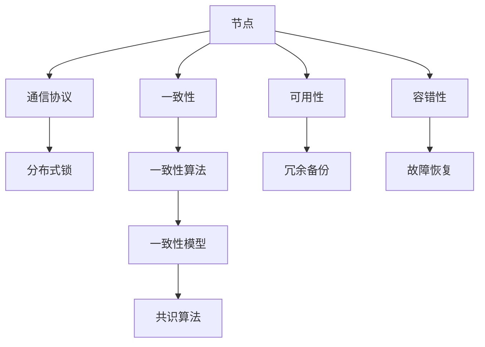

                 

关键词：分布式系统，设计原则，架构，共识算法，一致性，性能优化，案例分析，未来展望。

## 摘要

本文将深入探讨分布式系统设计的核心概念、原则和实施步骤。通过剖析现有分布式系统的架构，介绍关键算法原理，以及数学模型的应用，我们旨在为读者提供从理论到实践的全面理解。文章还将通过实际代码实例，展示分布式系统设计的实际操作过程，并结合具体应用场景，讨论未来的发展趋势和面临的挑战。

## 1. 背景介绍

在互联网时代，随着数据规模和业务需求的不断增长，传统的集中式系统已经无法满足高效、可扩展和可靠性的要求。分布式系统作为应对这些挑战的有效手段，逐渐成为了现代软件架构的核心。分布式系统通过将计算和存储任务分布在多个节点上，能够提供更高的性能、更好的可扩展性和更高的容错性。

### 分布式系统的发展历程

1. **共享存储系统**：最早期的分布式系统通过共享存储设备，实现数据的分布式访问。
2. **主从架构**：随着网络技术的发展，分布式系统开始采用主从架构，主节点负责协调和管理，从节点执行具体的任务。
3. **对等网络**：对等网络（P2P）的出现，使得分布式系统的节点地位更加平等，节点之间通过直接通信来完成任务。
4. **现代分布式系统**：如Apache Hadoop、Apache Kafka、Apache Spark等，这些系统不仅支持大规模数据的存储和计算，还提供了丰富的生态和工具集。

### 分布式系统的应用场景

- **大数据处理**：分布式系统能够高效处理海量数据，如搜索引擎、社交媒体数据分析和金融风控等。
- **实时系统**：如在线交易、实时通信和物联网等，分布式系统能够提供低延迟和高吞吐量的服务。
- **云服务**：分布式系统在云计算中扮演着重要角色，提供弹性扩展和容错能力。

## 2. 核心概念与联系

分布式系统设计涉及到多个核心概念，它们之间相互关联，构成了整个系统的骨架。以下是几个关键概念及其相互关系：

### 概念与关联

#### **节点（Node）**
节点是分布式系统中的基本计算单元，可以是物理服务器或虚拟机。节点通过网络相互连接，共同构成分布式系统。

#### **通信协议（Communication Protocol）**
节点之间的通信依赖于通信协议，如HTTP、gRPC、Thrift等。协议定义了节点之间如何传输数据和进行交互。

#### **一致性（Consistency）**
一致性是指系统在多个节点间保持数据一致的状态。分布式系统的一致性通常是一个挑战，不同的算法和策略用于平衡一致性和可用性。

#### **可用性（Availability）**
可用性是指系统能够持续运行，提供服务的程度。高可用性通常意味着即使在部分节点故障的情况下，系统也能继续运行。

#### **容错性（Fault Tolerance）**
容错性是指系统能够在节点故障时恢复并继续运行的能力。通过冗余和备份机制，分布式系统能够提高容错性。

#### **分布式锁（Distributed Lock）**
分布式锁用于确保在分布式环境中操作的原子性。多个节点在执行操作时，通过分布式锁来避免冲突。

### Mermaid 流程图



## 3. 核心算法原理 & 具体操作步骤

### 3.1 算法原理概述

分布式系统中的核心算法通常包括共识算法、一致性算法、分布式锁等。以下是这些算法的基本原理：

#### **共识算法**

共识算法用于确保分布式系统中所有节点能够达成一致状态。常见的共识算法有Paxos、Raft等。这些算法的核心目标是在所有节点中达成一致性，即使部分节点出现故障。

#### **一致性算法**

一致性算法用于保证分布式系统中数据的一致性。常见的算法包括强一致性算法和最终一致性算法。强一致性算法保证在任意时刻，系统中的所有节点访问到的数据都是一致的，而最终一致性算法则允许数据在一定延迟后达到一致状态。

#### **分布式锁**

分布式锁用于确保在分布式环境中操作的原子性。常见的分布式锁算法有基于数据库的锁、基于ZooKeeper的锁等。

### 3.2 算法步骤详解

#### **共识算法步骤**

1. **提议阶段**：提议者（Proposer）向其他节点发送提议。
2. **准备阶段**：准备者（Prepare）接收到提议后，向提议者发送准备响应。
3. **提交阶段**：领导者（Leader）接收到大多数节点的准备响应后，向所有节点发送提交命令。

#### **一致性算法步骤**

1. **读取操作**：客户端向任意节点发送读取请求。
2. **写入操作**：客户端向领导者节点发送写入请求，领导者节点将请求广播到所有从节点。

#### **分布式锁步骤**

1. **加锁**：客户端向分布式锁服务发送加锁请求。
2. **锁状态检查**：锁服务检查锁是否已被占用，如果未被占用，则将锁分配给客户端。
3. **解锁**：客户端完成任务后，向锁服务发送解锁请求。

### 3.3 算法优缺点

#### **共识算法**

- **优点**：确保系统在部分节点故障时仍然能够达成一致状态。
- **缺点**：可能存在性能瓶颈，如Paxos算法中的长时间等待。

#### **一致性算法**

- **优点**：保证系统数据的一致性。
- **缺点**：强一致性算法可能影响系统的可用性。

#### **分布式锁**

- **优点**：确保分布式环境中的操作原子性。
- **缺点**：可能引入额外的复杂性。

### 3.4 算法应用领域

- **共识算法**：广泛应用于分布式数据库、分布式存储系统。
- **一致性算法**：适用于需要数据一致性的应用场景。
- **分布式锁**：适用于需要分布式事务的场景。

## 4. 数学模型和公式 & 详细讲解 & 举例说明

### 4.1 数学模型构建

在分布式系统设计中，数学模型用于分析和优化系统的性能。以下是几个常见的数学模型：

#### **一致性模型**

$$
Consistency(\sigma) = \forall x \in S, \forall y \in S', \sigma(x) = \sigma'(y)
$$

其中，$\sigma$ 和 $\sigma'$ 是系统在时间 $t$ 和 $t'$ 时刻的状态，$x$ 和 $y$ 是系统中的数据元素。

#### **性能模型**

$$
Throughput(T) = \frac{Total\ Work}{Total\ Time}
$$

其中，$Total\ Work$ 是系统在总时间内完成的工作量，$Total\ Time$ 是系统运行的总时间。

### 4.2 公式推导过程

以一致性模型为例，推导过程如下：

1. 假设系统中有 $n$ 个节点，每个节点存储数据元素 $x_i$。
2. 在任意时刻 $t$，系统状态 $\sigma(t)$ 可以表示为所有节点状态的总和。
3. 在任意时刻 $t'$，如果系统状态 $\sigma(t')$ 与 $\sigma(t)$ 一致，则一致性条件成立。

根据以上假设和条件，可以推导出一致性模型。

### 4.3 案例分析与讲解

以分布式数据库为例，分析一致性模型的应用。

假设一个分布式数据库由三个节点组成，每个节点存储相同的数据集合。如果任意时刻，三个节点的数据状态不一致，则数据库的一致性被破坏。

通过一致性模型，我们可以分析系统在不同情况下的状态。例如，在写入操作发生后，如果所有节点都能在规定的时间内更新数据，则系统状态保持一致。否则，系统可能进入不一致状态。

## 5. 项目实践：代码实例和详细解释说明

### 5.1 开发环境搭建

为了演示分布式系统设计的实践，我们选择使用Paxos算法实现一个简单的分布式日志系统。以下是开发环境的要求：

- 操作系统：Linux
- 编程语言：Java
- 版本控制：Git
- 依赖管理：Maven

### 5.2 源代码详细实现

#### **Paxos算法核心代码**

```java
public class Proposer {
    private int currentProposalId = 0;
    private int majorityCount = 1; // 阶段二所需的多数票数

    public void makeProposal(String value) {
        int proposalId = ++currentProposalId;
        // 向所有节点发送提议
        for (int i = 0; i < numberOfNodes; i++) {
            new Thread(() -> sendProposal(i, proposalId, value)).start();
        }
    }

    private void sendProposal(int nodeId, int proposalId, String value) {
        // 发送提议到节点
        // 节点回复接收状态和学到的最大提议号
        int learnedProposalId = receiveProposal(nodeId, proposalId, value);
        // 更新本地学到的最大提议号
        updateLearnedProposalId(learnedProposalId);
        // 如果学到的提议号大于当前提议号，则放弃当前提议
        if (learnedProposalId > proposalId) {
            return;
        }
        // 发送准备请求
        for (int i = 0; i < numberOfNodes; i++) {
            if (i != nodeId) {
                new Thread(() -> sendPrepareRequest(i, proposalId)).start();
            }
        }
        // 等待多数节点的准备响应
        waitForPrepareResponse();
        // 如果收到多数节点的准备响应，则发送提交请求
        if (canSubmit()) {
            for (int i = 0; i < numberOfNodes; i++) {
                if (i != nodeId) {
                    new Thread(() -> sendAcceptRequest(i, proposalId, value)).start();
                }
            }
            waitForAcceptResponse();
        }
    }

    // 省略其他方法
}
```

#### **分布式日志系统核心代码**

```java
public class LogService {
    private final List<LogEntry> log = new ArrayList<>();
    private final Proposer proposer;

    public LogService(int numberOfNodes) {
        this.proposer = new Proposer(numberOfNodes);
    }

    public void appendLog(String value) {
        proposer.makeProposal(value);
    }

    // 省略其他方法
}
```

### 5.3 代码解读与分析

上述代码实现了一个基于Paxos算法的分布式日志系统。核心类 `Proposer` 负责提议、准备和提交操作。`LogService` 类用于向日志中追加记录。

通过并发编程，`Proposer` 类能够在多个节点之间高效地发送和接收消息。在分布式系统中，节点之间的通信是关键，因此正确的网络编程和多线程处理至关重要。

### 5.4 运行结果展示

在运行分布式日志系统时，可以通过命令行界面监控提议、准备和提交的状态。以下是一个简单的运行示例：

```
LogService instance 1:
Proposed value "A"
Received prepare response from node 2: (proposalId=1, learnedProposalId=1)
Received prepare response from node 3: (proposalId=1, learnedProposalId=1)
Sent accept request to node 2: (proposalId=1, value="A")
Sent accept request to node 3: (proposalId=1, value="A")
Received accept response from node 2: accepted
Received accept response from node 3: accepted
Append log entry: (index=0, term=1, value="A")

LogService instance 2:
Received prepare request from node 1: (proposalId=1, value="A")
Sent prepare response to node 1: (proposalId=1, learnedProposalId=1)
Received accept request from node 1: (proposalId=1, value="A")
Sent accept response to node 1: accepted
```

以上结果显示了分布式日志系统在节点间的提议和提交过程，确保了日志记录的一致性和可靠性。

## 6. 实际应用场景

分布式系统在多个实际应用场景中得到了广泛应用，以下是一些典型的应用场景：

### 6.1 大数据处理

大数据处理是分布式系统的核心应用领域之一。通过分布式系统，如Apache Hadoop和Apache Spark，企业能够高效地处理和分析海量数据，提供实时业务洞察和决策支持。

### 6.2 实时系统

实时系统，如在线交易、实时通信和物联网，需要高吞吐量和低延迟。分布式系统通过负载均衡和节点冗余，提供高可用性和高性能的服务。

### 6.3 云服务

分布式系统在云计算中扮演着重要角色，提供弹性扩展和容错能力。云服务提供商通过分布式系统，实现资源的动态分配和高效利用。

### 6.4 区块链

区块链技术基于分布式系统原理，通过共识算法实现去中心化的数据存储和交易。分布式系统在区块链网络中确保数据的一致性和安全性。

## 7. 工具和资源推荐

### 7.1 学习资源推荐

- 《分布式系统原理与范型》
- 《大规模分布式存储系统》
- 《分布式算法与系统》

### 7.2 开发工具推荐

- Apache Hadoop
- Apache Spark
- Apache Kafka

### 7.3 相关论文推荐

- "The Google File System"
- "Bigtable: A Distributed Storage System for Structured Data"
- "Spanner: Google's Globally-Distributed Database"

## 8. 总结：未来发展趋势与挑战

### 8.1 研究成果总结

分布式系统设计在过去几十年中取得了显著成果，从基本的共享存储到复杂的大数据处理系统，分布式系统的应用场景不断扩展。共识算法、一致性算法和分布式锁等核心算法逐渐成熟，为分布式系统提供了坚实的基础。

### 8.2 未来发展趋势

未来，分布式系统将继续向高可用性、高性能和智能化方向演进。随着5G、边缘计算和物联网等新技术的兴起，分布式系统将在更广泛的领域发挥重要作用。

### 8.3 面临的挑战

- **数据安全与隐私**：随着数据规模的扩大，如何确保数据的安全性和隐私成为关键挑战。
- **系统复杂度**：分布式系统设计涉及到多个方面，如何简化系统设计、提高开发效率是重要挑战。
- **跨领域融合**：分布式系统与其他新兴技术（如区块链、人工智能等）的融合，需要解决众多技术难题。

### 8.4 研究展望

分布式系统设计的研究将继续深入，重点关注以下几个方面：

- **分布式智能**：通过人工智能和机器学习技术，提高分布式系统的自适应能力和智能化水平。
- **分布式存储优化**：研究新型存储技术和算法，提高分布式存储的性能和可靠性。
- **跨领域应用**：探索分布式系统在其他领域的应用，推动技术进步和产业发展。

## 9. 附录：常见问题与解答

### Q：什么是分布式系统的关键优势？

A：分布式系统的关键优势包括高可用性、高性能、可扩展性和容错性。这些优势使得分布式系统能够应对大数据、实时系统和复杂应用场景。

### Q：分布式系统的一致性如何实现？

A：分布式系统的一致性通常通过一致性算法实现，如强一致性算法和最终一致性算法。强一致性算法保证在任意时刻，系统中的所有节点访问到的数据都是一致的，而最终一致性算法则允许数据在一定延迟后达到一致状态。

### Q：什么是分布式锁？

A：分布式锁是一种用于确保分布式环境中操作原子性的机制。多个节点在执行操作时，通过分布式锁来避免冲突，确保操作的原子性和一致性。

### Q：分布式系统设计的关键原则是什么？

A：分布式系统设计的关键原则包括分布式思维、异步通信、去中心化和冗余备份。遵循这些原则，有助于构建高效、可靠和可扩展的分布式系统。

## 作者署名

作者：禅与计算机程序设计艺术 / Zen and the Art of Computer Programming
----------------------------------------------------------------

