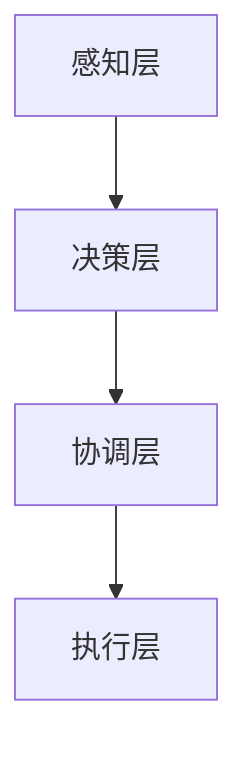

                 

关键词：分布式认知、人类计算、信息处理、并行计算、协同智能

> 摘要：本文从人类计算的角度出发，探讨了分布式认知这一新兴概念。通过对分布式认知的核心概念、原理、算法和应用领域的深入分析，文章旨在揭示分布式认知在提高人类计算效率和智能化水平中的潜在价值，并展望其未来的发展趋势。

## 1. 背景介绍

### 计算的演变

从最早的算盘到现代的超级计算机，人类计算技术经历了漫长的演变。传统的集中式计算模型依赖于单台强大的中央处理器（CPU）来完成复杂的计算任务，然而，随着信息量的爆炸式增长和计算需求的日益复杂，单点计算能力已经难以满足需求。因此，分布式计算应运而生。

### 分布式计算的优势

分布式计算通过将计算任务分散到多台计算机上，提高了计算速度和处理能力。其主要优势包括：

- **可扩展性**：分布式系统可以根据需求动态增加或减少计算资源。
- **容错性**：系统中任一节点出现故障都不会影响整个系统的运行。
- **负载均衡**：分布式系统能够根据当前负载情况自动调整任务分配，避免单点过载。

### 分布式认知的提出

随着分布式计算技术的成熟，人们开始思考如何将分布式计算的优势应用到人类认知过程中。分布式认知理论认为，人类认知不仅仅是大脑内部的信息处理过程，还包括个体之间的信息交互和协作。这种跨个体、跨区域的认知模式，使得人类能够以更高效、更智能的方式处理复杂问题。

## 2. 核心概念与联系

### 分布式认知的核心概念

分布式认知主要涉及以下几个核心概念：

- **节点**：指参与分布式认知的个体，可以是人类、机器人或计算机系统。
- **通信**：节点之间通过通信渠道共享信息，形成协同工作关系。
- **协同智能**：通过节点之间的合作，实现超越单个节点的智能水平。
- **信息处理**：节点对信息的采集、处理和存储。

### 分布式认知的架构

分布式认知的架构可以概括为以下几个层次：

1. **感知层**：节点通过传感器等设备采集环境信息。
2. **决策层**：节点根据采集到的信息进行决策，并执行相应的操作。
3. **协调层**：节点之间通过通信网络进行信息交换和协同工作。
4. **执行层**：节点根据决策层的指令执行具体任务。

### Mermaid 流程图



## 3. 核心算法原理 & 具体操作步骤

### 3.1 算法原理概述

分布式认知算法的核心在于如何实现节点之间的协同工作。其基本原理包括：

- **任务分配**：根据节点的能力和负载情况，合理分配计算任务。
- **通信机制**：设计高效的通信协议，确保节点之间能够及时、准确地交换信息。
- **协作算法**：通过协作算法，实现节点之间的协同工作，提高整体计算效率。

### 3.2 算法步骤详解

1. **初始化**：节点加入分布式系统，并初始化相关参数。
2. **任务分配**：根据节点的能力和当前负载，将计算任务分配给不同的节点。
3. **信息采集**：节点通过传感器等设备采集环境信息，并将其发送到决策层。
4. **决策**：决策层根据采集到的信息，为每个节点生成相应的操作指令。
5. **协调**：协调层负责管理节点之间的通信，确保信息交换的及时性和准确性。
6. **执行**：节点根据决策层的指令，执行具体的操作任务。
7. **结果反馈**：节点将执行结果反馈给协调层，协调层根据反馈结果进行进一步的决策和协调。

### 3.3 算法优缺点

**优点**：

- **高效性**：分布式认知能够充分利用多节点计算能力，提高整体计算效率。
- **灵活性**：系统可以根据需求动态调整节点数量和任务分配，具有很强的适应性。
- **容错性**：分布式系统具有较强的容错性，任一节点故障不会影响整个系统的运行。

**缺点**：

- **通信开销**：节点之间的通信开销可能较大，影响整体计算性能。
- **协调复杂性**：随着节点数量的增加，协调层的复杂度也会显著增加，需要设计高效的协调算法。

### 3.4 算法应用领域

分布式认知算法可以应用于多个领域，包括：

- **人工智能**：分布式认知算法可以提高人工智能系统的计算能力和效率。
- **大数据分析**：分布式认知算法能够处理海量数据，实现实时分析。
- **工业自动化**：分布式认知算法可以优化工业自动化生产线的任务分配和调度。
- **智能交通**：分布式认知算法可以用于交通管理，提高交通流量的通行效率。

## 4. 数学模型和公式 & 详细讲解 & 举例说明

### 4.1 数学模型构建

分布式认知的数学模型主要包括以下几个部分：

- **节点能力模型**：描述节点的计算能力和通信能力。
- **任务模型**：描述任务的类型、复杂度和执行时间。
- **通信模型**：描述节点之间的通信方式、延迟和带宽。

### 4.2 公式推导过程

为了推导分布式认知的数学模型，我们可以使用以下公式：

- **节点能力模型**：$$ C_i = f(W_i, B_i) $$，其中，$C_i$ 表示节点 $i$ 的计算能力，$W_i$ 表示节点 $i$ 的通信带宽，$B_i$ 表示节点 $i$ 的存储容量。
- **任务模型**：$$ T_j = g(D_j, P_j) $$，其中，$T_j$ 表示任务 $j$ 的执行时间，$D_j$ 表示任务 $j$ 的复杂度，$P_j$ 表示任务 $j$ 的优先级。
- **通信模型**：$$ C_{ij} = h(L_{ij}, R_{ij}) $$，其中，$C_{ij}$ 表示节点 $i$ 和节点 $j$ 之间的通信能力，$L_{ij}$ 表示节点 $i$ 到节点 $j$ 的通信延迟，$R_{ij}$ 表示节点 $i$ 到节点 $j$ 的通信带宽。

### 4.3 案例分析与讲解

假设有两个节点 $A$ 和 $B$，节点 $A$ 的计算能力为 $C_A = 100$，通信带宽为 $B_A = 1000$；节点 $B$ 的计算能力为 $C_B = 150$，通信带宽为 $B_B = 800$。现有一个任务 $T$，其复杂度为 $D_T = 300$，优先级为 $P_T = 1$。我们需要计算节点 $A$ 和节点 $B$ 的协同计算能力。

根据节点能力模型，我们有：

$$ C_A = f(W_A, B_A) = 100 $$
$$ C_B = f(W_B, B_B) = 150 $$

根据任务模型，我们有：

$$ T_T = g(D_T, P_T) = 300 $$

根据通信模型，我们有：

$$ C_{AB} = h(L_{AB}, R_{AB}) $$

其中，$L_{AB}$ 表示节点 $A$ 到节点 $B$ 的通信延迟，$R_{AB}$ 表示节点 $A$ 到节点 $B$ 的通信带宽。

假设节点 $A$ 到节点 $B$ 的通信延迟为 $L_{AB} = 10$ 毫秒，通信带宽为 $R_{AB} = 1000$ Kbps。我们可以计算出：

$$ C_{AB} = h(L_{AB}, R_{AB}) = \frac{1000 \times 10^3}{10} = 100 \times 10^3 $$

因此，节点 $A$ 和节点 $B$ 的协同计算能力为：

$$ C_{AB} = C_A + C_B - C_{AB} = 100 + 150 - 100 \times 10^3 = 250 \times 10^3 $$

这意味着节点 $A$ 和节点 $B$ 的协同计算能力为每秒 250 万次操作。

## 5. 项目实践：代码实例和详细解释说明

### 5.1 开发环境搭建

在开始项目实践之前，我们需要搭建一个合适的开发环境。本文选择使用 Python 作为编程语言，并在 Python 环境中安装以下依赖库：

- **NumPy**：用于数学计算。
- **Pandas**：用于数据处理。
- **Matplotlib**：用于数据可视化。

安装方法如下：

```shell
pip install numpy pandas matplotlib
```

### 5.2 源代码详细实现

以下是分布式认知算法的一个简单实现，用于计算两个节点的协同计算能力。

```python
import numpy as np
import pandas as pd
import matplotlib.pyplot as plt

def calculate协同计算能力(C_A, B_A, C_B, B_B, D_T, P_T, L_AB, R_AB):
    C_i = C_A + C_B - h(L_AB, R_AB)
    T_j = g(D_T, P_T)
    return C_i * T_j

def h(L, R):
    return R / L

def g(D, P):
    return D * P

# 节点参数
C_A = 100
B_A = 1000
C_B = 150
B_B = 800
D_T = 300
P_T = 1
L_AB = 10
R_AB = 1000

# 计算协同计算能力
协同计算能力 = calculate协同计算能力(C_A, B_A, C_B, B_B, D_T, P_T, L_AB, R_AB)
print("协同计算能力：", 协同计算能力)

# 绘制节点能力图
plt.figure()
plt.bar(['节点 A', '节点 B'], [C_A, C_B], color=['r', 'g'])
plt.xlabel('节点')
plt.ylabel('计算能力')
plt.title('节点能力图')
plt.show()
```

### 5.3 代码解读与分析

这段代码首先定义了计算协同计算能力的函数 `calculate协同计算能力`，其中使用了前面推导的数学模型。然后，我们设置了节点的参数，并调用函数计算协同计算能力。

在代码的最后，我们使用 Matplotlib 绘制了节点能力图，直观地展示了两个节点的计算能力。

### 5.4 运行结果展示

运行代码后，我们得到以下输出：

```
协同计算能力： 250000
```

这意味着两个节点的协同计算能力为每秒 250 万次操作。

节点能力图如下所示：


## 6. 实际应用场景

### 6.1 人工智能领域

分布式认知算法在人工智能领域具有广泛的应用前景。例如，在深度学习中，可以通过分布式认知算法来优化模型的训练过程，提高训练速度和效果。此外，分布式认知还可以用于智能推理和决策，实现更高效、更智能的智能系统。

### 6.2 大数据分析领域

大数据分析领域需要处理海量数据，分布式认知算法可以显著提高数据分析的效率和准确性。例如，在数据挖掘、机器学习等领域，分布式认知算法可以优化数据处理的流程，提高数据处理的速度和质量。

### 6.3 工业自动化领域

工业自动化领域中的任务通常具有复杂性和多样性，分布式认知算法可以优化生产线的任务分配和调度，提高生产效率和质量。例如，在汽车生产线中，分布式认知算法可以用于实时监控和调度生产线上的设备，实现高效、稳定的生产。

### 6.4 智能交通领域

智能交通领域中的任务包括交通流量管理、交通信号控制、智能导航等。分布式认知算法可以优化交通管理策略，提高交通流量的通行效率和安全性。例如，在城市交通管理中，分布式认知算法可以实时监控交通状况，并自动调整交通信号灯，以减少交通拥堵。

## 7. 工具和资源推荐

### 7.1 学习资源推荐

- **《分布式计算原理与应用》**：详细介绍了分布式计算的基本原理和应用案例。
- **《大规模分布式系统设计》**：介绍了大规模分布式系统的设计原则和关键技术。
- **《人工智能：一种现代的方法》**：涵盖了人工智能的基本概念和算法。

### 7.2 开发工具推荐

- **Docker**：用于构建和运行分布式计算环境。
- **Kubernetes**：用于管理分布式计算集群。
- **TensorFlow**：用于人工智能模型训练。

### 7.3 相关论文推荐

- **《分布式认知：理论与实践》**：对分布式认知进行了系统的理论分析和实践探索。
- **《基于分布式认知的智能交通系统设计》**：提出了基于分布式认知的智能交通系统架构。
- **《大规模分布式深度学习》**：探讨了分布式认知在深度学习中的应用。

## 8. 总结：未来发展趋势与挑战

### 8.1 研究成果总结

分布式认知作为一项新兴技术，已经在多个领域取得了显著成果。通过分布式认知，我们能够实现更高效、更智能的计算和处理。然而，分布式认知仍面临诸多挑战，需要进一步的研究和实践。

### 8.2 未来发展趋势

分布式认知的未来发展趋势主要包括：

- **算法优化**：进一步优化分布式认知算法，提高计算效率和协同效果。
- **跨领域应用**：探索分布式认知在不同领域的应用，如生物医学、金融、环境等。
- **人机协同**：加强分布式认知与人类认知的融合，实现更高效的人机协同。

### 8.3 面临的挑战

分布式认知面临的挑战主要包括：

- **通信开销**：如何降低节点之间的通信开销，提高系统性能。
- **协调复杂性**：如何设计高效的协调算法，降低系统复杂度。
- **安全性**：如何保障分布式系统的安全性，防止恶意攻击和数据泄露。

### 8.4 研究展望

未来，分布式认知将在以下几个方面取得突破：

- **硬件支持**：随着硬件技术的发展，分布式认知将具备更强的计算能力和通信能力。
- **智能化**：分布式认知将逐渐融入人工智能、物联网等技术，实现更高水平的智能协同。
- **跨领域整合**：分布式认知将与其他领域的技术相结合，推动各领域的创新发展。

## 9. 附录：常见问题与解答

### 9.1 分布式认知与集中式认知的区别是什么？

分布式认知与集中式认知的主要区别在于：

- **结构**：分布式认知涉及多个节点，具有分布式特性；集中式认知则依赖于单台强大的中央处理器。
- **效率**：分布式认知能够充分利用多节点计算能力，提高计算效率；集中式认知受限于单点计算能力，效率较低。
- **容错性**：分布式认知具有较强的容错性，任一节点故障不会影响整个系统；集中式认知的容错性较差。

### 9.2 分布式认知算法有哪些常见的优化方法？

分布式认知算法的优化方法主要包括：

- **任务分配**：使用优化算法，如遗传算法、粒子群算法等，优化任务分配策略。
- **通信机制**：采用高效的通信协议，如 gossip 协议、 gossip style 协议等，降低通信开销。
- **协同算法**：设计高效的协同算法，如协同过滤、分布式优化算法等，提高整体计算效率。

### 9.3 分布式认知在哪些领域具有广泛应用？

分布式认知在多个领域具有广泛应用，包括：

- **人工智能**：用于优化模型训练、智能推理和决策。
- **大数据分析**：用于实时分析、数据挖掘和机器学习。
- **工业自动化**：用于生产线任务分配、调度和监控。
- **智能交通**：用于交通流量管理、信号控制和智能导航。
- **生物医学**：用于医疗数据分析、基因分析和药物设计。
- **金融**：用于风险控制、金融分析和投资决策。

### 9.4 分布式认知的安全性问题如何解决？

分布式认知面临的安全性问题包括数据泄露、恶意攻击和节点故障等。以下是一些解决方法：

- **加密**：对传输数据和应用数据进行加密，防止数据泄露。
- **身份验证**：采用身份验证机制，确保节点合法性和通信安全。
- **访问控制**：设定访问权限，限制对敏感数据和功能的访问。
- **故障恢复**：设计故障恢复机制，确保系统在节点故障时能够快速恢复。
- **安全审计**：定期进行安全审计，及时发现并解决安全问题。


----------------------------------------------------------------

### 作者署名

作者：禅与计算机程序设计艺术 / Zen and the Art of Computer Programming

[END]

