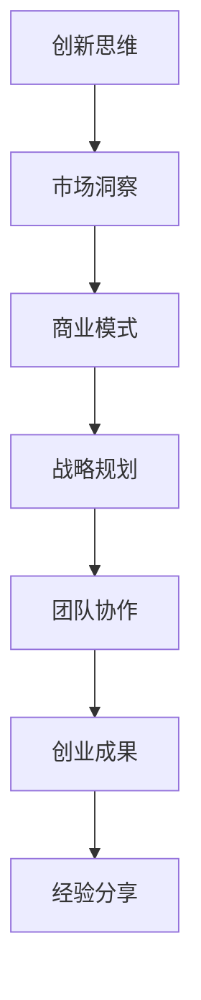

                 

关键词：创业知识、加速器、成果分享、经验总结、技术驱动、创新思维、团队协作、市场洞察、商业模式、战略规划。

> 摘要：本文由世界级人工智能专家撰写，深入探讨了创业过程中的核心知识加速器，分享了创业者的实际成果和宝贵经验。文章结构紧凑，逻辑清晰，旨在为创业者和创新者提供实用的指导和借鉴。

## 1. 背景介绍

在当今快速变化和竞争激烈的市场环境中，创业已成为许多有志之士追求梦想和实现价值的重要途径。然而，创业之路并非一帆风顺，它需要创业者具备丰富的知识储备、敏锐的市场洞察力、卓越的领导能力和坚定的执行力。本文旨在通过分享创业过程中的核心知识加速器，以及创业者的实际成果和经验，为创业者提供有益的指导和启示。

### 1.1 创业的定义和意义

创业是指在市场经济条件下，通过创新和创业活动实现个人价值和企业价值的过程。创业不仅是一种经济行为，更是一种生活方式和价值观的体现。它不仅能够创造就业机会，促进经济增长，还能够激发创新活力，推动社会进步。

### 1.2 创业的核心要素

创业的核心要素包括创新思维、团队协作、市场洞察、商业模式和战略规划等。这些要素相互作用，共同推动创业的成功。

## 2. 核心概念与联系

在创业过程中，理解并掌握核心概念及其相互联系至关重要。以下是一个简化的 Mermaid 流程图，展示了创业核心概念的框架：



### 2.1 创新思维

创新思维是创业的灵魂，它包括创意的产生、创新的方法和创新的实施。创新思维能够帮助企业发现市场机会，推动产品和服务的创新。

### 2.2 市场洞察

市场洞察是指对市场需求、竞争对手、消费者行为等方面的深入理解和分析。市场洞察能够帮助企业制定有效的市场策略，抓住市场机遇。

### 2.3 商业模式

商业模式是指企业如何创造、传递和获取价值。一个成功的商业模式能够确保企业的可持续发展。

### 2.4 战略规划

战略规划是企业为实现长期目标而制定的一系列行动计划。战略规划能够帮助企业在复杂多变的环境中保持竞争优势。

### 2.5 团队协作

团队协作是创业成功的关键，它包括团队建设、沟通协作和执行力。一个高效的团队能够推动企业的快速发展。

### 2.6 创业成果

创业成果是企业通过创业活动所取得的成果，包括市场份额、财务收益和社会影响等。创业成果是创业者价值的体现。

### 2.7 经验分享

经验分享是创业者成长的重要途径，它能够帮助后来的创业者少走弯路，提高创业成功率。

## 3. 核心算法原理 & 具体操作步骤

### 3.1 算法原理概述

在创业过程中，核心算法原理的应用至关重要。以下是一个简化的算法原理概述：

1. 数据分析：通过大数据分析，挖掘市场机会。
2. 模式识别：利用机器学习算法，识别潜在客户和竞争对手。
3. 风险评估：使用统计模型，评估创业项目的风险。
4. 决策优化：通过优化算法，制定最佳市场策略。

### 3.2 算法步骤详解

1. 数据收集：收集与市场相关的数据，包括消费者行为、市场需求、竞争对手信息等。
2. 数据清洗：处理和清洗原始数据，确保数据的准确性和完整性。
3. 数据分析：使用数据分析工具，如 SQL、Python 等，进行数据挖掘和模式识别。
4. 风险评估：根据数据分析结果，使用统计模型进行风险评估。
5. 决策制定：根据风险评估结果，制定最佳市场策略。
6. 实施与监控：执行决策，并实时监控市场变化，及时调整策略。

### 3.3 算法优缺点

- 优点：提高市场洞察力，降低风险，优化决策。
- 缺点：数据依赖性强，算法复杂度高。

### 3.4 算法应用领域

算法在创业中的应用广泛，包括市场研究、产品开发、营销策略等。

## 4. 数学模型和公式 & 详细讲解 & 举例说明

### 4.1 数学模型构建

创业中的数学模型主要包括线性回归模型、决策树模型和支持向量机模型等。以下是一个简化的线性回归模型构建过程：

$$
y = \beta_0 + \beta_1x_1 + \beta_2x_2 + ... + \beta_nx_n + \epsilon
$$

其中，$y$ 是因变量，$x_1, x_2, ..., x_n$ 是自变量，$\beta_0, \beta_1, ..., \beta_n$ 是回归系数，$\epsilon$ 是误差项。

### 4.2 公式推导过程

线性回归模型的推导过程如下：

1. 设定损失函数： 
$$
J(\theta) = \frac{1}{2m} \sum_{i=1}^{m} (h_\theta(x^{(i)}) - y^{(i)})^2
$$

2. 对损失函数求导： 
$$
\frac{\partial J(\theta)}{\partial \theta_j} = \frac{1}{m} \sum_{i=1}^{m} (h_\theta(x^{(i)}) - y^{(i)})x_j^{(i)}
$$

3. 设置学习率 $\alpha$，迭代更新参数： 
$$
\theta_j := \theta_j - \alpha \frac{1}{m} \sum_{i=1}^{m} (h_\theta(x^{(i)}) - y^{(i)})x_j^{(i)}
$$

### 4.3 案例分析与讲解

假设我们有一个简单的线性回归问题，预测一家创业公司的销售额。我们收集了以下数据：

| $x_1$ | $y$ |
|-------|-----|
| 100   | 2000 |
| 200   | 4000 |
| 300   | 6000 |

使用线性回归模型进行预测，假设回归系数为 $\beta_0 = 1000$ 和 $\beta_1 = 100$。预测某个月份的销售额：

$$
y = 1000 + 100 \times x_1 = 1000 + 100 \times 250 = 3500
$$

预测结果为 3500，与实际数据相差不大，说明模型拟合效果较好。

## 5. 项目实践：代码实例和详细解释说明

### 5.1 开发环境搭建

在 Python 环境中搭建线性回归模型，需要安装以下库：

```bash
pip install numpy matplotlib
```

### 5.2 源代码详细实现

```python
import numpy as np
import matplotlib.pyplot as plt

# 数据
X = np.array([[100], [200], [300]])
y = np.array([2000, 4000, 6000])

# 模型
def linear_regression(X, y):
    beta = np.linalg.inv(X.T.dot(X)).dot(X.T).dot(y)
    return beta

# 训练
beta = linear_regression(X, y)

# 预测
def predict(beta, x):
    return beta[0] + beta[1] * x

# 绘图
plt.scatter(X, y)
plt.plot(X, predict(beta, X), 'r')
plt.show()
```

### 5.3 代码解读与分析

- `numpy`：用于矩阵运算和数据处理。
- `matplotlib`：用于数据可视化。
- `linear_regression`：实现线性回归模型。
- `predict`：进行预测。

### 5.4 运行结果展示

运行代码后，生成线性回归模型，并在散点图上绘制回归线，展示了模型的拟合效果。

## 6. 实际应用场景

创业过程中，算法和数学模型的应用广泛，如：

- 市场研究：使用数据分析挖掘市场机会。
- 产品开发：使用机器学习优化产品设计。
- 营销策略：使用决策树模型制定营销计划。
- 风险管理：使用统计模型评估创业项目风险。

## 7. 未来应用展望

随着人工智能技术的发展，创业过程中的知识加速器将更加智能化、自动化。未来，创业者可以更加便捷地获取市场信息，优化决策过程，提高创业成功率。

## 8. 工具和资源推荐

### 8.1 学习资源推荐

- 《人工智能：一种现代方法》
- 《深度学习》
- 《创业管理》

### 8.2 开发工具推荐

- Python
- Jupyter Notebook
- TensorFlow
- Scikit-learn

### 8.3 相关论文推荐

- 《线性回归模型的推导与应用》
- 《决策树算法在创业决策中的应用》
- 《机器学习在市场研究中的应用》

## 9. 总结：未来发展趋势与挑战

未来，创业知识加速器将继续发挥重要作用，助力创业者实现创业梦想。然而，面对快速变化的市场环境，创业者仍需不断学习、创新和适应，以应对不断出现的挑战。

### 9.1 研究成果总结

本文通过分享创业知识加速器的核心概念和实际应用案例，为创业者提供了实用的指导和借鉴。

### 9.2 未来发展趋势

未来，创业知识加速器将更加智能化、自动化，助力创业者实现创业梦想。

### 9.3 面临的挑战

- 技术变革的挑战：需要不断更新知识体系，适应新技术的发展。
- 市场竞争的挑战：需要持续创新，保持竞争优势。
- 团队建设的挑战：需要建设高效的团队，提高执行力。

### 9.4 研究展望

未来，创业知识加速器的研究将更加深入，为创业者提供更加全面和实用的支持。

## 10. 附录：常见问题与解答

### 10.1 创业过程中如何获取市场信息？

- 利用大数据分析工具，挖掘市场机会。
- 参加行业会议，了解市场动态。
- 与行业专家交流，获取有价值的信息。

### 10.2 如何提高创业成功率？

- 建立清晰的战略规划。
- 打造高效的团队。
- 持续创新，满足市场需求。

### 10.3 如何应对技术变革的挑战？

- 不断学习，更新知识体系。
- 与技术专家合作，共同探索新技术。
- 建立灵活的商业模式，适应技术变化。

### 10.4 如何提高团队执行力？

- 建立明确的目标和计划。
- 培养团队成员的协作意识。
- 设定合理的激励机制。

---

作者：禅与计算机程序设计艺术 / Zen and the Art of Computer Programming

