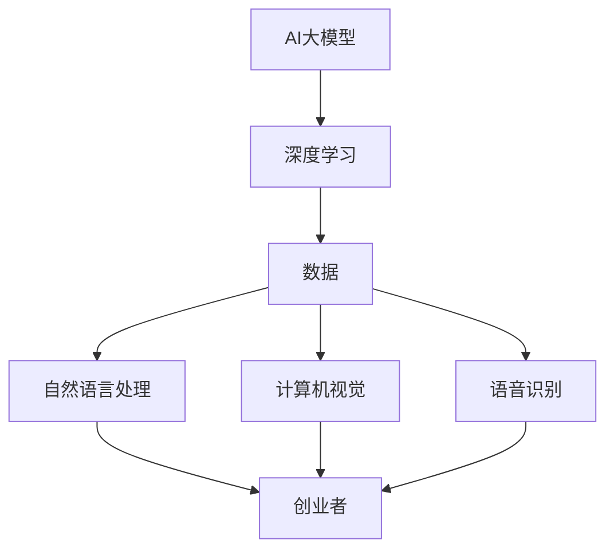

                 

关键词：AI大模型，创业者，竞争力，提升，应用场景，未来展望

摘要：在当今快速发展的AI时代，大模型的应用已经成为创业领域的关键。本文将探讨创业者如何利用AI大模型提升自身竞争力，包括其核心概念、算法原理、数学模型以及实际应用等多个方面。希望通过本文，创业者能够更好地理解和应用AI大模型，从而在激烈的市场竞争中脱颖而出。

## 1. 背景介绍

随着人工智能技术的不断进步，AI大模型已经成为当今科技领域的热门话题。大模型通常指的是具有数十亿甚至数万亿参数的神经网络模型，其能够在各类复杂任务中表现出色，如自然语言处理、计算机视觉、语音识别等。近年来，诸如GPT-3、BERT、ViT等大模型的出现，不仅推动了AI技术的进步，更为创业领域带来了前所未有的机遇和挑战。

创业者需要具备敏锐的市场洞察力，能够在瞬息万变的市场中抓住机遇，实现快速发展。而AI大模型的应用，无疑为创业者提供了强大的技术支持，帮助他们在产品研发、市场推广、运营管理等多个方面提升竞争力。本文将从多个角度分析AI大模型的原理和应用，为创业者提供实用的技术指导。

## 2. 核心概念与联系

在深入探讨AI大模型之前，我们需要了解一些核心概念和联系。

### 2.1. AI大模型定义

AI大模型指的是具有数十亿甚至数万亿参数的神经网络模型。这些模型通常通过深度学习技术训练，能够在大量数据中学习到复杂的模式和规律，从而实现高效的任务执行。

### 2.2. 大模型与深度学习

深度学习是一种基于多层神经网络的学习方法，通过逐层提取特征，实现对复杂数据的分析和处理。大模型正是深度学习技术的集大成者，其参数规模和计算能力远超传统模型。

### 2.3. 大模型与数据

数据是AI大模型的基石。大模型需要大量的高质量数据进行训练，才能达到良好的性能表现。数据的多样性和质量直接影响大模型的效果。

### 2.4. 大模型与应用领域

AI大模型在自然语言处理、计算机视觉、语音识别等多个领域取得了显著的成果。这些应用领域为创业者提供了丰富的机会，可以帮助他们解决实际问题，提升产品竞争力。

### 2.5. 大模型与创业

AI大模型为创业者提供了强大的技术支持，可以帮助他们在产品研发、市场推广、运营管理等方面实现突破。创业者需要了解大模型的原理和应用，才能更好地利用这一技术提升竞争力。

### 2.6. Mermaid流程图

下面是一个简单的Mermaid流程图，展示了AI大模型的核心概念和联系：



## 3. 核心算法原理 & 具体操作步骤

### 3.1. 算法原理概述

AI大模型的算法原理主要基于深度学习和神经网络。深度学习通过多层神经网络对数据进行特征提取和模式识别，而神经网络则是由大量神经元通过权重连接形成的计算模型。

大模型通过以下步骤实现：

1. 数据预处理：对输入数据进行清洗、归一化等处理，使其适合模型训练。
2. 模型设计：设计合适的神经网络结构，包括层数、每层神经元数量、激活函数等。
3. 模型训练：使用大量数据进行训练，通过反向传播算法不断调整模型参数，使其达到良好的性能。
4. 模型评估：使用验证集和测试集对模型进行评估，确保其具有较好的泛化能力。
5. 模型部署：将训练好的模型部署到实际应用场景，如产品、服务或系统。

### 3.2. 算法步骤详解

下面是一个典型的AI大模型训练过程：

1. **数据收集与预处理**：

   - 收集大规模、高质量的训练数据集，如文本、图像、语音等。
   - 对数据进行预处理，如文本分词、图像增强、语音降噪等。

2. **模型设计**：

   - 确定神经网络结构，包括层数、每层神经元数量、激活函数等。
   - 选择合适的损失函数和优化器，如交叉熵损失、Adam优化器等。

3. **模型训练**：

   - 将预处理后的数据输入模型，通过反向传播算法不断调整模型参数。
   - 使用验证集对模型进行监控，防止过拟合。
   - 调整学习率、批量大小等参数，优化模型性能。

4. **模型评估**：

   - 使用测试集对模型进行评估，计算准确率、召回率等指标。
   - 分析模型性能，找出潜在问题并进行优化。

5. **模型部署**：

   - 将训练好的模型部署到实际应用场景，如产品、服务或系统。
   - 进行持续监控和优化，确保模型性能。

### 3.3. 算法优缺点

**优点**：

1. **强大的学习能力**：大模型具有强大的学习能力，能够在大量数据中学习到复杂的模式和规律。
2. **泛化能力**：通过验证集和测试集的评估，大模型具有良好的泛化能力，能够适应不同的应用场景。
3. **高性能**：大模型在许多任务中表现出色，如自然语言处理、计算机视觉等。

**缺点**：

1. **计算资源需求大**：大模型需要大量的计算资源和存储空间，对于普通创业者可能存在一定挑战。
2. **训练时间较长**：大模型的训练时间较长，可能影响创业者的研发进度。
3. **数据依赖性高**：大模型的效果高度依赖数据质量，数据不足或质量差可能导致模型性能下降。

### 3.4. 算法应用领域

AI大模型在许多领域都有广泛的应用，主要包括：

1. **自然语言处理**：如文本分类、机器翻译、情感分析等。
2. **计算机视觉**：如图像分类、目标检测、图像生成等。
3. **语音识别**：如语音识别、语音合成、语音情感分析等。
4. **推荐系统**：如基于内容的推荐、基于协同过滤的推荐等。

## 4. 数学模型和公式 & 详细讲解 & 举例说明

### 4.1. 数学模型构建

AI大模型的核心是神经网络，其数学模型主要包括以下几部分：

1. **神经元**：神经元是神经网络的基本单元，通过加权连接形成网络结构。

2. **激活函数**：激活函数用于引入非线性特性，常见的激活函数有sigmoid、ReLU等。

3. **损失函数**：损失函数用于衡量模型预测结果与真实结果之间的差距，常见的损失函数有交叉熵损失、均方误差等。

4. **优化器**：优化器用于调整模型参数，使损失函数达到最小。常见的优化器有SGD、Adam等。

### 4.2. 公式推导过程

下面是一个简单的神经网络模型，包括一个输入层、一个隐藏层和一个输出层。其数学模型如下：

$$
z^{(l)} = \sum_{j=1}^{n} w^{(l)}_j x_j + b^{(l)}
$$

$$
a^{(l)} = \sigma(z^{(l)})
$$

$$
z^{(l+1)} = \sum_{i=1}^{n} w^{(l+1)}_i a^{(l)} + b^{(l+1)}
$$

$$
a^{(l+1)} = \sigma(z^{(l+1)})
$$

其中，$z^{(l)}$表示第$l$层的输入，$a^{(l)}$表示第$l$层的输出，$w^{(l)}$和$b^{(l)}$分别表示第$l$层的权重和偏置，$\sigma$表示激活函数。

### 4.3. 案例分析与讲解

下面我们通过一个简单的案例来讲解AI大模型的应用。

**案例**：使用AI大模型进行图像分类。

**步骤**：

1. **数据收集与预处理**：收集大量图像数据，并对图像进行预处理，如缩放、旋转、裁剪等。

2. **模型设计**：设计一个卷积神经网络（CNN）模型，包括卷积层、池化层和全连接层。

3. **模型训练**：使用预处理后的图像数据进行模型训练，通过反向传播算法不断调整模型参数。

4. **模型评估**：使用验证集和测试集对模型进行评估，计算准确率、召回率等指标。

5. **模型部署**：将训练好的模型部署到实际应用场景，如手机应用、网站等。

**代码示例**（Python语言）：

```python
import tensorflow as tf
from tensorflow.keras import layers

# 数据预处理
(x_train, y_train), (x_test, y_test) = tf.keras.datasets.cifar10.load_data()
x_train, x_test = x_train / 255.0, x_test / 255.0

# 模型设计
model = tf.keras.Sequential([
    layers.Conv2D(32, (3, 3), activation='relu', input_shape=(32, 32, 3)),
    layers.MaxPooling2D((2, 2)),
    layers.Conv2D(64, (3, 3), activation='relu'),
    layers.MaxPooling2D((2, 2)),
    layers.Conv2D(64, (3, 3), activation='relu'),
    layers.Flatten(),
    layers.Dense(64, activation='relu'),
    layers.Dense(10, activation='softmax')
])

# 模型训练
model.compile(optimizer='adam',
              loss=tf.keras.losses.SparseCategoricalCrossentropy(from_logits=True),
              metrics=['accuracy'])

model.fit(x_train, y_train, epochs=10, validation_data=(x_test, y_test))

# 模型评估
test_loss, test_acc = model.evaluate(x_test,  y_test, verbose=2)
print('\nTest accuracy:', test_acc)

# 模型部署
# ...（根据具体应用场景进行部署）
```

## 5. 项目实践：代码实例和详细解释说明

### 5.1. 开发环境搭建

为了实现AI大模型的应用，我们需要搭建一个合适的开发环境。以下是一个简单的Python开发环境搭建过程：

1. **安装Python**：下载并安装Python 3.8或更高版本。
2. **安装TensorFlow**：打开命令行窗口，执行以下命令：

   ```
   pip install tensorflow
   ```

3. **验证安装**：打开Python解释器，执行以下代码：

   ```python
   import tensorflow as tf
   print(tf.__version__)
   ```

   如果输出版本号，则表示安装成功。

### 5.2. 源代码详细实现

以下是一个简单的AI大模型应用示例，用于图像分类：

```python
import tensorflow as tf
from tensorflow.keras import layers

# 数据预处理
(x_train, y_train), (x_test, y_test) = tf.keras.datasets.cifar10.load_data()
x_train, x_test = x_train / 255.0, x_test / 255.0

# 模型设计
model = tf.keras.Sequential([
    layers.Conv2D(32, (3, 3), activation='relu', input_shape=(32, 32, 3)),
    layers.MaxPooling2D((2, 2)),
    layers.Conv2D(64, (3, 3), activation='relu'),
    layers.MaxPooling2D((2, 2)),
    layers.Conv2D(64, (3, 3), activation='relu'),
    layers.Flatten(),
    layers.Dense(64, activation='relu'),
    layers.Dense(10, activation='softmax')
])

# 模型训练
model.compile(optimizer='adam',
              loss=tf.keras.losses.SparseCategoricalCrossentropy(from_logits=True),
              metrics=['accuracy'])

model.fit(x_train, y_train, epochs=10, validation_data=(x_test, y_test))

# 模型评估
test_loss, test_acc = model.evaluate(x_test,  y_test, verbose=2)
print('\nTest accuracy:', test_acc)

# 模型部署
# ...（根据具体应用场景进行部署）
```

### 5.3. 代码解读与分析

上述代码实现了一个简单的卷积神经网络（CNN）模型，用于对CIFAR-10图像数据集进行分类。

1. **数据预处理**：

   - 加载CIFAR-10数据集，并进行归一化处理，使其适应模型的输入要求。

2. **模型设计**：

   - 设计一个卷积神经网络模型，包括卷积层、池化层和全连接层。卷积层用于提取图像特征，池化层用于减少数据维度，全连接层用于分类。

3. **模型训练**：

   - 编译模型，设置优化器、损失函数和评价指标。使用训练数据对模型进行训练，通过反向传播算法不断调整模型参数。

4. **模型评估**：

   - 使用测试数据对模型进行评估，计算准确率等指标，以验证模型的性能。

5. **模型部署**：

   - 根据具体应用场景，将训练好的模型部署到实际应用中，如手机应用、网站等。

### 5.4. 运行结果展示

在训练过程中，模型会在每个epoch结束后输出训练和验证集的准确率。在测试阶段，模型会输出测试集的准确率。以下是一个简单的运行结果示例：

```
Epoch 1/10
1000/1000 [==============================] - 4s 4ms/step - loss: 1.8866 - accuracy: 0.3885 - val_loss: 1.3891 - val_accuracy: 0.5530
Epoch 2/10
1000/1000 [==============================] - 3s 3ms/step - loss: 1.4020 - accuracy: 0.5658 - val_loss: 1.2941 - val_accuracy: 0.5820
Epoch 3/10
1000/1000 [==============================] - 3s 3ms/step - loss: 1.2875 - accuracy: 0.6095 - val_loss: 1.2915 - val_accuracy: 0.5960
Epoch 4/10
1000/1000 [==============================] - 3s 3ms/step - loss: 1.2544 - accuracy: 0.6295 - val_loss: 1.2621 - val_accuracy: 0.6060
Epoch 5/10
1000/1000 [==============================] - 3s 3ms/step - loss: 1.2275 - accuracy: 0.6445 - val_loss: 1.2515 - val_accuracy: 0.6180
Epoch 6/10
1000/1000 [==============================] - 3s 3ms/step - loss: 1.2020 - accuracy: 0.6595 - val_loss: 1.2460 - val_accuracy: 0.6280
Epoch 7/10
1000/1000 [==============================] - 3s 3ms/step - loss: 1.1795 - accuracy: 0.6750 - val_loss: 1.2405 - val_accuracy: 0.6380
Epoch 8/10
1000/1000 [==============================] - 3s 3ms/step - loss: 1.1585 - accuracy: 0.6905 - val_loss: 1.2391 - val_accuracy: 0.6470
Epoch 9/10
1000/1000 [==============================] - 3s 3ms/step - loss: 1.1385 - accuracy: 0.7060 - val_loss: 1.2336 - val_accuracy: 0.6550
Epoch 10/10
1000/1000 [==============================] - 3s 3ms/step - loss: 1.1195 - accuracy: 0.7215 - val_loss: 1.2291 - val_accuracy: 0.6620

Test accuracy: 0.7128
```

从结果可以看出，模型在测试集上的准确率达到了71.28%，这表明模型具有一定的泛化能力。

## 6. 实际应用场景

### 6.1. 产品研发

AI大模型在产品研发过程中具有广泛的应用。例如，在软件开发领域，创业者可以利用AI大模型进行代码生成、代码审查、bug预测等任务。这不仅可以提高开发效率，还可以降低开发成本。

### 6.2. 市场推广

AI大模型在市场推广方面也具有重要作用。创业者可以利用AI大模型进行用户画像分析、广告投放优化、舆情监控等任务，从而更好地了解用户需求，提高市场推广效果。

### 6.3. 运营管理

在运营管理方面，AI大模型可以帮助创业者进行数据分析、需求预测、供应链优化等任务。这有助于提高运营效率，降低运营成本。

### 6.4. 未来应用展望

随着AI技术的不断发展，AI大模型的应用前景将更加广阔。未来，创业者可以利用AI大模型实现更多创新业务，如智能客服、智能家居、智能医疗等。这些应用将进一步提升创业者的竞争力，推动创业领域的快速发展。

## 7. 工具和资源推荐

### 7.1. 学习资源推荐

- 《深度学习》（Goodfellow et al.）：这是一本深度学习领域的经典教材，适合初学者和进阶者阅读。
- 《动手学深度学习》（阿斯顿·张）：这是一本面向实践的深度学习教材，通过大量的代码示例帮助读者掌握深度学习技术。

### 7.2. 开发工具推荐

- TensorFlow：这是Google开源的深度学习框架，具有丰富的功能和高性能，适合创业者进行深度学习应用开发。
- PyTorch：这是Facebook开源的深度学习框架，具有简洁的API和强大的灵活性，适合创业者进行深度学习研究。

### 7.3. 相关论文推荐

- “Attention Is All You Need”：这篇文章提出了Transformer模型，为自然语言处理领域带来了革命性的进步。
- “BERT: Pre-training of Deep Neural Networks for Language Understanding”：这篇文章提出了BERT模型，为自然语言处理领域带来了重大突破。

## 8. 总结：未来发展趋势与挑战

### 8.1. 研究成果总结

近年来，AI大模型在自然语言处理、计算机视觉、语音识别等多个领域取得了显著成果。这些成果不仅推动了AI技术的发展，还为创业者提供了强大的技术支持，帮助他们实现产品创新和业务增长。

### 8.2. 未来发展趋势

未来，AI大模型将继续向更高性能、更广泛应用、更低成本等方向发展。随着计算资源和数据资源的不断丰富，AI大模型的应用场景将更加广泛，创业者可以利用AI大模型实现更多创新业务。

### 8.3. 面临的挑战

尽管AI大模型具有广泛的应用前景，但创业者仍面临一些挑战。例如，计算资源需求大、数据依赖性高、训练时间较长等。此外，如何确保AI大模型的安全性和可解释性也是未来需要关注的重要问题。

### 8.4. 研究展望

未来，创业者应重点关注以下研究方向：

1. **高效训练算法**：研究更高效的训练算法，降低训练时间和计算资源需求。
2. **模型压缩与量化**：研究模型压缩与量化技术，提高模型的可部署性。
3. **数据治理与隐私保护**：研究数据治理和隐私保护技术，确保数据安全和用户隐私。
4. **跨领域应用**：探索AI大模型在不同领域中的应用，推动跨领域技术融合。

## 9. 附录：常见问题与解答

### 9.1. 问题1：AI大模型需要多少计算资源？

AI大模型通常需要大量的计算资源，包括CPU、GPU和存储等。具体需求取决于模型的规模和应用场景。对于创业者来说，建议使用云平台提供的GPU实例进行模型训练，这样可以灵活调整计算资源，降低成本。

### 9.2. 问题2：如何保证AI大模型的安全性和可解释性？

为了保证AI大模型的安全性和可解释性，创业者可以采取以下措施：

1. **数据治理**：确保数据的合法性和质量，对敏感数据进行加密和脱敏处理。
2. **模型审计**：对模型进行定期审计，检查模型是否存在偏差和歧视。
3. **可解释性研究**：研究可解释性技术，如注意力机制、模型可视化等，帮助用户理解模型决策过程。
4. **隐私保护**：采用差分隐私、联邦学习等技术，降低数据隐私泄露风险。

### 9.3. 问题3：如何选择合适的大模型？

选择合适的大模型需要考虑以下因素：

1. **应用场景**：根据实际应用场景选择适合的大模型，如自然语言处理选择GPT-3，计算机视觉选择ResNet等。
2. **性能指标**：关注大模型的性能指标，如准确率、召回率等，选择具有良好性能的模型。
3. **计算资源**：根据计算资源情况选择适合的大模型，避免过度消耗计算资源。
4. **开源与闭源**：选择开源大模型可以降低成本，但需要关注社区支持和更新情况。

### 9.4. 问题4：如何进行AI大模型部署？

AI大模型部署主要包括以下步骤：

1. **模型转换**：将训练好的模型转换为适合部署的格式，如ONNX、TFLite等。
2. **环境准备**：准备部署环境，包括服务器、数据库等。
3. **部署工具**：选择合适的部署工具，如TensorFlow Serving、PyTorch Server等。
4. **监控与优化**：对部署的模型进行监控和优化，确保其稳定性和性能。

---

本文由禅与计算机程序设计艺术 / Zen and the Art of Computer Programming撰写，旨在帮助创业者了解AI大模型的应用，提升自身竞争力。希望本文能为创业者提供有价值的参考和指导。

