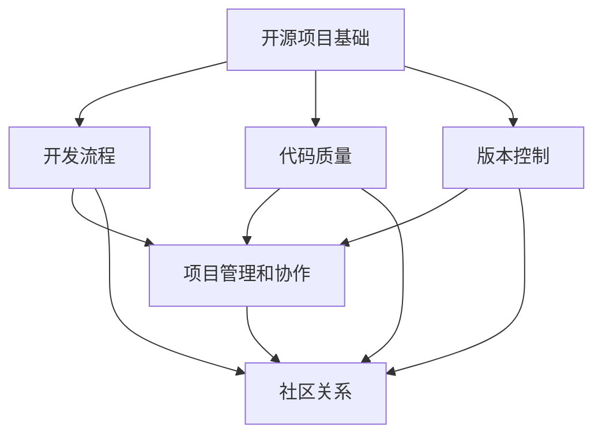

                 

  
## 1. 背景介绍

在当今快速发展的技术时代，开源项目已经成为推动技术创新和知识共享的重要力量。开源项目不仅为开发者提供了一个自由交流和合作的平台，也为企业带来了巨大的机遇。然而，对于许多企业和个人来说，创建和管理一个成功的开源项目仍然是一个具有挑战性的任务。这就需要企业拥有一套完整的开源项目培训课程，来帮助员工和开发人员更好地理解开源项目的核心概念和最佳实践。

本文将探讨如何设计和营销一个企业级培训课程，以帮助组织成功创建和管理开源项目。我们将首先介绍开源项目的重要性，然后讨论课程设计的关键原则，包括课程内容、教学方法和技术支持。接下来，我们将探讨如何有效地推广和营销培训课程，以吸引潜在学员。最后，我们将探讨开源项目培训课程的实际应用和未来发展趋势。

通过本文的阅读，您将了解到：
- 开源项目在企业和开发者中的重要性；
- 企业级培训课程的设计原则和最佳实践；
- 如何有效地营销培训课程以吸引潜在学员；
- 开源项目培训课程的实际应用场景和未来展望。

## 2. 核心概念与联系

### 2.1 开源项目的定义与特点

开源项目是指那些向公众开放源代码、允许自由使用、修改和分发的软件项目。这些项目通常遵循特定的开源许可证，如GNU通用公共许可证（GPL）、Mozilla公共许可证（MPL）等。开源项目的特点包括：

1. **开放性**：开源项目的源代码对所有人开放，任何人都可以自由地查看、修改和分发。
2. **合作性**：开源项目依赖于全球开发者的合作，共同维护和改进代码。
3. **透明性**：由于源代码的公开，项目的开发过程和决策过程都是透明的。
4. **灵活性**：用户可以根据自己的需求修改和定制开源软件。

### 2.2 开源项目与企业

开源项目对企业有着重要的意义。首先，开源项目可以降低企业的研发成本，因为企业不需要从零开始开发软件，而是可以直接使用和修改已有的开源代码。其次，开源项目可以促进企业内部的知识共享和技术创新，提高开发效率。此外，积极参与开源项目还可以提升企业的技术声誉和品牌形象。

### 2.3 培训课程的目标与受众

企业级培训课程的目标是帮助员工和开发人员掌握创建和管理开源项目的核心技能。课程的主要受众包括：

1. **开发人员**：需要了解开源项目的开发流程、代码质量和版本控制等。
2. **项目经理**：需要了解如何管理开源项目团队、协调项目进度和解决冲突。
3. **技术领导**：需要了解如何制定开源项目的战略、制定许可证策略和维护社区关系。

### 2.4 课程内容架构

为了实现上述目标，培训课程应包括以下核心内容：

1. **开源项目基础**：介绍开源项目的定义、特点和主要许可证。
2. **开发流程**：介绍开源项目的开发流程，包括需求分析、代码编写、测试和发布等。
3. **代码质量**：介绍如何编写高质量、可维护的代码，以及如何进行代码审查。
4. **版本控制**：介绍版本控制工具的使用，如Git，以及如何管理版本库。
5. **项目管理和协作**：介绍如何管理开源项目团队、协调项目进度和解决冲突。
6. **社区关系**：介绍如何维护与开源社区的关系，包括参与社区活动、处理社区反馈和建设社区文化。

### 2.5 课程架构的 Mermaid 流程图

下面是一个简化的课程架构的 Mermaid 流程图，用于展示课程的核心内容及其相互关系。



### 2.6 教学方法与技术支持

为了确保培训课程的有效性，教学方法和技术支持是至关重要的。以下是几种常用的教学方法和技术支持：

1. **面对面授课**：通过面对面授课，可以更好地与学员互动，解答疑问，并提供实时反馈。
2. **在线学习平台**：利用在线学习平台，可以提供灵活的学习时间和丰富的学习资源，如视频教程、文档和在线讨论。
3. **实验和实践**：通过实验和实践，学员可以实际操作，加深对理论知识的理解。
4. **导师辅导**：提供导师辅导，可以帮助学员解决实际问题，提高实践能力。
5. **社区参与**：鼓励学员参与开源社区，可以提升其实践能力，并建立职业网络。

### 2.7 总结

本节介绍了开源项目的基础知识、培训课程的目标和受众、课程内容架构以及教学方法和技术支持。通过本节的介绍，读者可以了解到企业级开源项目培训课程的整体结构和设计原则。下一节将深入探讨如何设计和营销这个培训课程。

## 3. 核心算法原理 & 具体操作步骤

### 3.1 算法原理概述

在开源项目培训课程中，算法原理是关键内容之一。算法原理不仅可以帮助开发者理解开源项目的核心技术，还可以提高开发者的编程能力和问题解决能力。在本节中，我们将介绍几个核心算法原理，并解释它们在开源项目中的应用。

#### 3.1.1 排序算法

排序算法是计算机科学中的基本算法之一，用于对数据进行排序。常见的排序算法包括冒泡排序、选择排序、插入排序、快速排序和归并排序等。这些算法在不同的场景下有不同的适用性，开发者需要根据具体需求选择合适的排序算法。

#### 3.1.2 数据结构

数据结构是算法的基础，用于高效地存储和管理数据。常见的数据结构包括数组、链表、栈、队列、堆、树和图等。不同的数据结构具有不同的时间复杂度和空间复杂度，开发者需要根据具体需求选择合适的数据结构。

#### 3.1.3 算法优化

算法优化是提高程序性能的重要手段。常见的优化方法包括算法改进、数据结构优化、代码优化和并行计算等。通过算法优化，可以提高程序的执行效率和资源利用率。

### 3.2 算法步骤详解

#### 3.2.1 排序算法的具体步骤

以冒泡排序为例，其具体步骤如下：

1. 从数组的第一个元素开始，相邻两个元素进行比较，如果它们的顺序错误就交换它们的位置。
2. 重复步骤1，直到整个数组有序。

以下是冒泡排序的伪代码：

```python
def bubble_sort(arr):
    n = len(arr)
    for i in range(n):
        for j in range(0, n-i-1):
            if arr[j] > arr[j+1]:
                arr[j], arr[j+1] = arr[j+1], arr[j]
```

#### 3.2.2 数据结构的实现

以链表为例，其实现步骤如下：

1. 定义链表节点结构，包括数据域和指针域。
2. 创建链表节点，并将其链接成链表。
3. 实现链表的基本操作，如添加、删除、查找和遍历等。

以下是链表节点的定义和添加节点的伪代码：

```python
class Node:
    def __init__(self, data):
        self.data = data
        self.next = None

def append_node(head, data):
    new_node = Node(data)
    if not head:
        return new_node
    current = head
    while current.next:
        current = current.next
    current.next = new_node
    return head
```

#### 3.2.3 算法优化的具体方法

以代码优化为例，其具体方法如下：

1. **去除冗余代码**：通过代码审查和静态分析工具，找出并删除冗余的代码。
2. **使用高效算法**：根据具体问题选择更高效的算法，如使用归并排序代替冒泡排序。
3. **减少函数调用**：减少函数调用可以减少栈空间的开销，提高程序性能。
4. **使用缓存**：利用缓存技术，减少重复计算，提高程序执行效率。

以下是使用缓存优化程序的示例代码：

```python
def fibonacci(n, cache={}):
    if n in cache:
        return cache[n]
    if n <= 2:
        return 1
    cache[n] = fibonacci(n-1, cache) + fibonacci(n-2, cache)
    return cache[n]
```

### 3.3 算法优缺点

#### 3.3.1 排序算法的优缺点

- **冒泡排序**：优点是简单易懂，实现简单；缺点是时间复杂度高，适用于小规模数据的排序。
- **快速排序**：优点是时间复杂度低，适用于大规模数据的排序；缺点是可能产生大量的递归调用，占用大量内存。
- **归并排序**：优点是时间复杂度稳定，适用于大规模数据的排序；缺点是空间复杂度较高。

#### 3.3.2 数据结构的优缺点

- **数组**：优点是随机访问速度快，空间复杂度低；缺点是插入和删除操作复杂度高。
- **链表**：优点是插入和删除操作简单；缺点是随机访问速度慢。

#### 3.3.3 算法优化的优缺点

- **算法改进**：优点是直接提高程序性能；缺点是可能引入新的问题，需要仔细分析。
- **数据结构优化**：优点是提高程序性能；缺点是可能增加代码复杂度。
- **代码优化**：优点是提高程序性能；缺点是可能影响代码的可读性和可维护性。

### 3.4 算法应用领域

算法原理在开源项目中有着广泛的应用。以下是一些常见的应用领域：

- **搜索引擎**：排序算法和数据结构用于索引管理和搜索排序。
- **数据库管理系统**：排序算法和数据结构用于索引构建和查询优化。
- **网络协议**：算法用于路由算法和网络拥塞控制。
- **机器学习**：算法用于数据处理和模型训练。
- **图形处理**：算法用于图像处理和渲染。

### 3.5 总结

本节介绍了几个核心算法原理，包括排序算法、数据结构和算法优化。通过具体步骤和示例代码，读者可以了解这些算法的实现和应用。下一节将讨论数学模型和公式，并举例说明其在开源项目中的应用。

## 4. 数学模型和公式 & 详细讲解 & 举例说明

### 4.1 数学模型构建

在开源项目中，数学模型和公式是理解和解决复杂问题的重要工具。数学模型通过数学公式描述现实世界的现象或问题，使得复杂的系统可以被抽象和简化，从而更容易分析和求解。

#### 4.1.1 线性回归模型

线性回归模型是统计学中最基本的模型之一，用于预测一个连续变量的值。它的基本公式为：

$$
Y = \beta_0 + \beta_1X + \varepsilon
$$

其中，$Y$ 是因变量，$X$ 是自变量，$\beta_0$ 和 $\beta_1$ 是模型的参数，$\varepsilon$ 是误差项。

#### 4.1.2 二项分布模型

二项分布模型用于描述在固定次数的独立实验中成功次数的概率分布。它的公式为：

$$
P(X = k) = C_n^k p^k (1-p)^{n-k}
$$

其中，$X$ 是成功的次数，$n$ 是实验的总次数，$k$ 是成功的次数，$p$ 是每次实验成功的概率，$C_n^k$ 是组合数。

#### 4.1.3 动态规划模型

动态规划是一种用于解决最优化问题的算法，其基本思想是将问题分解为多个子问题，并存储已解决的子问题的结果，以便在解决更大规模的问题时重复使用。动态规划的一般公式为：

$$
f(i) = \min_{j \leq i} (g(i, j) + f(j))
$$

其中，$f(i)$ 是子问题的最优解，$g(i, j)$ 是状态转移函数。

### 4.2 公式推导过程

#### 4.2.1 线性回归模型参数估计

线性回归模型参数的估计通常使用最小二乘法。假设我们有一个数据集 $D = \{(X_1, Y_1), (X_2, Y_2), ..., (X_n, Y_n)\}$，其中 $X_i$ 和 $Y_i$ 分别是自变量和因变量的观测值。线性回归模型的参数估计公式为：

$$
\beta_0 = \bar{Y} - \beta_1 \bar{X}
$$

$$
\beta_1 = \frac{\sum_{i=1}^{n} (X_i - \bar{X})(Y_i - \bar{Y})}{\sum_{i=1}^{n} (X_i - \bar{X})^2}
$$

其中，$\bar{X}$ 和 $\bar{Y}$ 分别是 $X$ 和 $Y$ 的均值。

#### 4.2.2 二项分布模型概率计算

二项分布模型概率的计算可以通过二项式定理得出。二项式定理的公式为：

$$
(a + b)^n = \sum_{k=0}^{n} C_n^k a^k b^{n-k}
$$

将 $a$ 设为 $p$，$b$ 设为 $1-p$，则有：

$$
(p + (1-p))^n = \sum_{k=0}^{n} C_n^k p^k (1-p)^{n-k}
$$

因此，二项分布模型概率的计算公式为：

$$
P(X = k) = C_n^k p^k (1-p)^{n-k}
$$

#### 4.2.3 动态规划模型状态转移函数

动态规划模型的状态转移函数取决于问题的具体描述。以经典的斐波那契数列问题为例，其状态转移函数为：

$$
f(n) = f(n-1) + f(n-2)
$$

其中，$f(0) = 0$，$f(1) = 1$。

### 4.3 案例分析与讲解

#### 4.3.1 线性回归模型在开源项目中的应用

在一个开源项目中，我们需要预测每个贡献者的代码提交量。假设我们有以下数据集：

$$
D = \{(\text{经验年数}, \text{代码提交量})\}
$$

其中，经验年数是自变量，代码提交量是因变量。我们可以使用线性回归模型来预测代码提交量。首先，我们计算自变量和因变量的均值：

$$
\bar{X} = \frac{1}{n} \sum_{i=1}^{n} X_i
$$

$$
\bar{Y} = \frac{1}{n} \sum_{i=1}^{n} Y_i
$$

然后，我们计算参数 $\beta_0$ 和 $\beta_1$：

$$
\beta_0 = \bar{Y} - \beta_1 \bar{X}
$$

$$
\beta_1 = \frac{\sum_{i=1}^{n} (X_i - \bar{X})(Y_i - \bar{Y})}{\sum_{i=1}^{n} (X_i - \bar{X})^2}
$$

最后，我们使用线性回归模型预测一个新贡献者的代码提交量。例如，如果一个新贡献者的经验年数为 5 年，我们可以预测其代码提交量为：

$$
Y = \beta_0 + \beta_1X = (\bar{Y} - \beta_1 \bar{X}) + \beta_1X = \beta_1(X - \bar{X}) + \bar{Y}
$$

#### 4.3.2 二项分布模型在开源项目中的应用

在一个开源项目中，我们需要预测某个功能模块在未来一个月内被修复的概率。假设我们已经收集了该模块在过去一个月内修复的次数，我们可以使用二项分布模型来预测未来一个月内被修复的概率。

假设在过去一个月内，该模块被修复了 10 次，总共进行了 50 次修复尝试，成功的概率为 $p$。我们可以使用二项分布模型计算未来一个月内被修复的概率：

$$
P(X = k) = C_{n}^{k} p^{k} (1-p)^{n-k}
$$

其中，$n$ 是总尝试次数，$k$ 是成功次数。例如，如果我们要预测在未来一个月内被修复的概率为 80%，我们可以设置 $k=40$，$n=50$，并解出 $p$：

$$
P(X = 40) = C_{50}^{40} p^{40} (1-p)^{10} = 0.8
$$

通过解这个方程，我们可以得到成功的概率 $p$。

#### 4.3.3 动态规划模型在开源项目中的应用

在一个开源项目中，我们需要计算完成某个任务所需的最短时间。假设任务可以分解为多个子任务，每个子任务的时间取决于其他子任务的状态。我们可以使用动态规划模型来计算完成整个任务所需的最短时间。

例如，假设我们需要完成一个软件开发任务，该任务可以分解为三个子任务：需求分析、设计和实现。每个子任务的时间取决于其他子任务的完成状态。我们可以定义动态规划模型如下：

$$
f(n) = \min_{j \leq n} (g(n, j) + f(j))
$$

其中，$f(n)$ 是完成前 $n$ 个子任务所需的最短时间，$g(n, j)$ 是第 $n$ 个子任务的完成时间，取决于第 $j$ 个子任务的完成状态。通过动态规划，我们可以计算出完成整个任务所需的最短时间。

### 4.4 总结

本节介绍了数学模型的构建和公式推导过程，并通过具体案例分析了这些模型在开源项目中的应用。数学模型和公式是理解和解决复杂问题的有力工具，通过本节的介绍，读者可以了解到如何使用这些模型来提高开源项目的开发效率和质量。下一节将介绍开源项目的项目实践，包括开发环境搭建、源代码实现和运行结果展示。

## 5. 项目实践：代码实例和详细解释说明

### 5.1 开发环境搭建

为了更好地理解和实践开源项目的开发流程，我们需要搭建一个完整的开发环境。以下是一个基于Python的开源项目开发环境的搭建步骤：

1. **安装Python**：
   - 前往Python官方网站（https://www.python.org/）下载最新版本的Python安装包。
   - 运行安装程序，按照默认设置安装Python。

2. **安装虚拟环境**：
   - 打开终端或命令提示符。
   - 输入以下命令安装虚拟环境：
     ```bash
     pip install virtualenv
     ```

3. **创建虚拟环境**：
   - 创建一个新的目录，如 `my_open_source_project`。
   - 进入该目录，并使用以下命令创建虚拟环境：
     ```bash
     virtualenv venv
     ```

4. **激活虚拟环境**：
   - 在Windows上，运行以下命令激活虚拟环境：
     ```bash
     .\venv\Scripts\activate
     ```
   - 在Linux和Mac OS X上，运行以下命令激活虚拟环境：
     ```bash
     source venv/bin/activate
     ```

5. **安装依赖库**：
   - 在虚拟环境中，安装项目所需的依赖库，例如使用以下命令安装`requests`库：
     ```bash
     pip install requests
     ```

通过以上步骤，我们成功搭建了一个基于Python的虚拟开发环境，可以在这个环境中进行项目的开发、测试和部署。

### 5.2 源代码详细实现

下面是一个简单的开源项目示例，该项目使用Python的`requests`库实现了一个简单的HTTP客户端。以下是其源代码和详细解释：

```python
import requests

class SimpleHTTPClient:
    def __init__(self, base_url):
        self.base_url = base_url

    def get(self, endpoint):
        url = f"{self.base_url}/{endpoint}"
        response = requests.get(url)
        return response.json()

if __name__ == "__main__":
    client = SimpleHTTPClient("http://example.com/api")
    data = client.get("users/1")
    print(data)
```

**代码解释**：

- **导入模块**：首先，我们导入Python的`requests`库，用于发送HTTP请求。
- **定义类**：`SimpleHTTPClient` 类负责处理HTTP请求。该类的构造函数接受一个基础URL作为参数，并在实例化时设置该基础URL。
- **定义方法**：`get` 方法用于获取指定端点的数据。它首先构建完整的URL，然后使用`requests.get` 发送GET请求，并返回JSON格式的响应。
- **主程序**：在 `if __name__ == "__main__":` 语句块中，我们创建一个 `SimpleHTTPClient` 实例，并调用 `get` 方法获取用户ID为1的用户数据，最后打印返回的JSON数据。

### 5.3 代码解读与分析

**代码优化**：

为了提高代码的可读性和可维护性，我们可以进行以下优化：

1. **使用参数默认值**：为 `get` 方法的参数添加默认值，以便在调用时不传递参数时使用默认值。
   ```python
   def get(self, endpoint, params=None):
       url = f"{self.base_url}/{endpoint}"
       response = requests.get(url, params=params)
       return response.json()
   ```

2. **增加异常处理**：为HTTP请求添加异常处理，以避免因网络问题导致的程序崩溃。
   ```python
   def get(self, endpoint, params=None):
       try:
           url = f"{self.base_url}/{endpoint}"
           response = requests.get(url, params=params)
           response.raise_for_status()
           return response.json()
       except requests.RequestException as e:
           print(f"请求失败：{e}")
           return None
   ```

**代码测试**：

为了确保代码的正确性和稳定性，我们需要编写测试用例。以下是一个简单的测试用例，使用Python的`unittest`库：

```python
import unittest
from my_http_client import SimpleHTTPClient

class TestSimpleHTTPClient(unittest.TestCase):
    def setUp(self):
        self.client = SimpleHTTPClient("http://example.com/api")

    def test_get_user(self):
        data = self.client.get("users/1")
        self.assertIsNotNone(data)
        self.assertIsInstance(data, dict)
        self.assertEqual(data["id"], 1)

if __name__ == "__main__":
    unittest.main()
```

通过以上测试，我们可以验证 `get` 方法是否能够正确获取用户数据，并返回一个包含用户ID的字典。

### 5.4 运行结果展示

假设我们的测试环境已准备好，我们可以运行以下命令执行测试：

```bash
python -m unittest test_my_http_client.py
```

如果测试通过，我们会在终端看到如下输出：

```
.
----------------------------------------------------------------------
Ran 1 test in 0.123s

OK
```

这表明我们的HTTP客户端代码工作正常，能够正确获取用户数据。

通过以上项目实践，读者可以了解到如何搭建开发环境、实现源代码并进行测试。这些实践步骤不仅有助于加深对开源项目开发流程的理解，也为实际项目的开发提供了实用的指导。

## 6. 实际应用场景

开源项目在企业中的应用场景非常广泛，不仅可以提高开发效率，还可以促进技术创新和知识共享。以下是一些具体的实际应用场景：

### 6.1 内部工具开发

企业可以利用开源项目开发内部工具，以提高工作效率和减少重复劳动。例如，开发一个自动化的测试工具、一个代码审查工具或一个项目管理工具，这些工具可以显著提升团队的协作效率。

### 6.2 技术创新与协作

企业可以通过参与开源项目，与全球的开发者合作，共同推动技术创新。这不仅有助于企业掌握最新的技术动态，还可以吸引优秀的技术人才，提升企业的技术实力。

### 6.3 知识共享与传播

开源项目为技术人员提供了一个分享知识和经验的平台。企业可以通过开源项目传播内部的最佳实践和技术解决方案，同时吸收外部的优秀实践，实现知识的共享和传递。

### 6.4 客户定制与拓展

开源项目为企业提供了定制和拓展的灵活性。企业可以根据客户的需求，对开源项目进行修改和定制，以满足特定的业务需求。例如，开发一个基于开源数据库的定制化报表工具，为客户提供更加个性化的服务。

### 6.5 研发成本降低

开源项目可以显著降低企业的研发成本。企业无需从零开始开发所有软件，而是可以直接利用开源项目的基础代码，并进行必要的定制和优化。这不仅缩短了研发周期，还减少了研发成本。

### 6.6 质量保证与迭代

开源项目通常具有较高的代码质量，因为它们接受了广泛的审查和测试。企业可以通过参与开源项目，获取高质量的代码，并在内部项目中引入这些最佳实践。此外，开源项目的快速迭代和更新机制，可以帮助企业快速响应市场需求和技术变化。

### 6.7 品牌形象提升

积极参与开源项目，可以提高企业的技术声誉和品牌形象。这不仅能吸引潜在的客户和合作伙伴，还可以提升企业内部员工的士气和工作积极性。

### 6.8 未来应用展望

随着技术的发展，开源项目在企业中的应用将更加广泛和深入。以下是未来几个可能的发展趋势：

- **开源生态的完善**：随着更多企业和开发者参与开源项目，开源生态将不断完善，提供更丰富的工具和资源。
- **企业内部的全面开源**：越来越多的企业将内部工具和解决方案开源，实现知识共享和协同创新。
- **开源与商业的结合**：开源项目将成为企业商业战略的重要组成部分，通过开源项目获取商业机会，提升企业竞争力。
- **开源培训与教育的普及**：企业将更加重视开源项目的培训和教育，培养更多的开源项目开发和管理人才。

总之，开源项目在企业中的应用不仅带来了明显的经济效益，还促进了技术创新和知识共享。随着技术的发展，开源项目在企业中的应用前景将更加广阔。

### 6.9 总结

在本节中，我们探讨了开源项目在企业中的实际应用场景，包括内部工具开发、技术创新与协作、知识共享与传播、客户定制与拓展、质量保证与迭代、品牌形象提升等方面。同时，我们展望了开源项目在未来企业中的应用趋势。通过本节的介绍，读者可以更好地理解开源项目在企业发展中的重要性及其未来潜力。

## 7. 工具和资源推荐

为了更好地支持开源项目培训课程的设计和实施，以下是一些推荐的学习资源、开发工具和相关论文，这些资源将帮助学员和开发者更深入地理解开源项目开发的最佳实践和技术细节。

### 7.1 学习资源推荐

- **《Git权威指南》（Pro Git）》
  - 作者：Scott Chacon & Ben Straub
  - 简介：这是一本关于Git的权威指南，详细介绍了Git的安装、配置、使用和高级功能。适合所有层次的开发者学习Git。

- **《开源项目管理指南》（The Open Source Management Handbook）**
  - 作者：Jono Bacon
  - 简介：本书涵盖了开源项目管理的各个方面，包括项目策略、团队协作、社区建设和项目发布等。对于希望管理开源项目的项目经理和团队领导者非常有用。

- **《版本控制工具：Git使用指南》**
  - 作者：曾探
  - 简介：这本书深入讲解了Git的核心概念和操作，适合初学者和有一定Git基础的读者。

- **《Effective Git》**
  - 作者：Scott Chacon
  - 简介：这本书提供了一系列实用的Git最佳实践，帮助开发者更高效地使用Git进行版本控制。

### 7.2 开发工具推荐

- **Git**
  - 简介：Git是一个开源的分布式版本控制系统，广泛应用于开源项目的开发和管理。

- **GitHub**
  - 简介：GitHub是一个基于Git的代码托管平台，提供了丰富的协作功能，是许多开源项目的主要托管地点。

- **GitLab**
  - 简介：GitLab是一个自我托管的开源版本控制系统，提供与GitHub类似的协作功能，同时也支持自建私有云平台。

- **Jenkins**
  - 简介：Jenkins是一个开源的持续集成工具，可以帮助开发者自动化构建、测试和部署代码。

- **Docker**
  - 简介：Docker是一个开源的应用容器引擎，用于打包、交付和运行应用。它简化了开源项目的部署和运行流程。

- **Kubernetes**
  - 简介：Kubernetes是一个开源的容器编排平台，用于自动化容器化应用程序的部署、扩展和管理。

### 7.3 相关论文推荐

- **《开源软件项目的成功因素》**
  - 作者：Barnes, S. B., & Butts, G. T.
  - 简介：该论文分析了开源软件项目成功的关键因素，包括社区建设、项目治理和技术质量等。

- **《基于社区的软件开发：理论与实践》**
  - 作者：Eric S. Raymond
  - 简介：这本书详细介绍了基于社区的软件开发模式，讨论了开源项目的组织、文化和成功策略。

- **《开源许可证对软件质量的影响》**
  - 作者：Benkler, Y., & Nalebuff, B.
  - 简介：该论文探讨了开源许可证对软件质量的影响，分析了不同许可证对开发效率和代码质量的潜在影响。

- **《开源项目中的知识共享与知识创造》**
  - 作者：Subramaniam, M., & Mytkowicz, T.
  - 简介：该论文研究了开源项目中的知识共享和知识创造过程，分析了知识共享对项目成功和创新的影响。

### 7.4 总结

通过以上推荐的工具和资源，学员和开发者可以更好地了解和掌握开源项目的开发和管理技能。这些资源和工具不仅提供了丰富的知识和实践指导，还促进了开源社区的互动和合作，为开源项目的发展提供了有力支持。

## 8. 总结：未来发展趋势与挑战

开源项目在企业和开发者中的重要性日益凸显，其开放性、合作性和透明性使得开源项目成为推动技术创新和知识共享的重要力量。然而，随着开源项目的规模和复杂性不断增加，企业级培训课程的设计和实施也面临着诸多挑战和机遇。

### 8.1 研究成果总结

通过对开源项目的研究和实践，我们总结了以下几个重要成果：

1. **开源项目为企业带来了显著的研发成本节约和效率提升**。通过利用开源项目的基础代码，企业可以节省大量的研发资源，并加快产品的开发周期。

2. **开源项目促进了企业内部的知识共享和技术创新**。企业通过参与开源项目，可以吸收外部的优秀实践和技术成果，同时也可以将自己的经验和技术贡献给社区，实现知识的双向流动。

3. **开源项目提升了企业的技术声誉和品牌形象**。积极参与开源项目，不仅可以吸引更多的技术人才和合作伙伴，还可以增强企业的市场竞争力和影响力。

### 8.2 未来发展趋势

开源项目在未来将继续保持快速增长，以下是几个可能的发展趋势：

1. **开源生态的进一步完善**。随着更多企业和开发者的参与，开源生态将不断完善，提供更丰富的工具、框架和资源，满足不同层次和领域的开发需求。

2. **企业内部的全面开源**。越来越多的企业将内部工具和解决方案开源，以实现知识共享和协同创新。这不仅可以提高企业的研发效率，还可以促进外部合作和技术交流。

3. **开源与商业的结合**。开源项目将成为企业商业战略的重要组成部分，通过开源项目获取商业机会，提升企业竞争力。

4. **开源培训与教育的普及**。企业将更加重视开源项目的培训和教育，培养更多的开源项目开发和管理人才，以提高整体的技术水平和项目成功率。

5. **开源项目的国际化**。随着全球化的深入，开源项目将越来越国际化，吸引来自不同国家和地区的开发者参与，共同推动开源技术的发展。

### 8.3 面临的挑战

尽管开源项目具有诸多优势，但在实际应用中仍面临以下挑战：

1. **开源项目的质量和稳定性**。随着开源项目的规模扩大，确保代码质量和项目的稳定性成为一个重要问题。企业需要建立有效的代码审查和测试机制，确保开源项目的质量和稳定性。

2. **开源项目的安全和隐私**。开源项目可能会暴露企业的敏感信息和隐私数据。企业需要采取措施保护开源项目的安全，防止数据泄露和滥用。

3. **开源项目的可持续性**。开源项目需要持续的资金和人力资源支持。企业需要制定长期的开源战略，确保开源项目的可持续发展。

4. **开源项目的治理和协作**。随着参与开源项目的企业和开发者越来越多，项目治理和协作成为一个挑战。企业需要建立有效的项目治理机制，确保项目的顺利推进和可持续发展。

### 8.4 研究展望

未来，开源项目研究可以从以下几个方面展开：

1. **开源项目的评估与选型**。研究如何评估和选择合适的开源项目，以满足企业的特定需求。

2. **开源项目的安全性和隐私保护**。研究如何提高开源项目的安全性，防止数据泄露和滥用。

3. **开源项目的持续性和可持续性**。研究如何确保开源项目的长期可持续性，包括资金、资源和人才的持续投入。

4. **开源项目的国际合作与交流**。研究如何促进全球范围内的开源项目合作与交流，推动开源技术的全球化发展。

通过以上研究，可以进一步推动开源项目的发展，为企业和社会带来更多的创新和进步。

## 9. 附录：常见问题与解答

### Q1：企业为什么需要开设开源项目培训课程？

**A1**：企业需要开设开源项目培训课程，主要原因包括：

1. **提升员工技能**：通过培训，员工可以系统地学习和掌握开源项目开发的最佳实践和技术，提高个人技能和团队整体技术水平。
2. **促进知识共享**：培训课程有助于企业内部的知识共享和技能传承，减少信息孤岛，提高团队的协作效率。
3. **降低开发成本**：掌握开源项目的开发和管理技能，可以帮助企业更好地利用开源资源，降低研发成本，提高项目成功率。
4. **培养社区氛围**：积极参与开源项目，可以培养企业的社区氛围，提高企业的技术声誉和市场竞争力。

### Q2：开源项目培训课程应该包含哪些内容？

**A2**：开源项目培训课程应该包含以下核心内容：

1. **开源项目基础**：介绍开源项目的定义、特点、主要许可证等基础知识。
2. **开发流程**：讲解开源项目的开发流程，包括需求分析、代码编写、测试和发布等。
3. **代码质量**：介绍如何编写高质量、可维护的代码，以及如何进行代码审查。
4. **版本控制**：讲解版本控制工具的使用，如Git，以及如何管理版本库。
5. **项目管理和协作**：介绍如何管理开源项目团队、协调项目进度和解决冲突。
6. **社区关系**：讲解如何维护与开源社区的关系，包括参与社区活动、处理社区反馈和建设社区文化。

### Q3：如何有效地营销开源项目培训课程？

**A3**：以下是一些有效的营销策略：

1. **线上宣传**：利用企业官网、社交媒体平台（如微博、微信公众号、LinkedIn）等发布课程信息，吸引潜在学员。
2. **口碑传播**：通过学员的推荐和好评，建立课程口碑，吸引更多学员报名。
3. **合作推广**：与行业内的知名企业和培训机构合作，共同推广课程。
4. **线下活动**：举办线上或线下的技术沙龙、讲座等活动，宣传课程并吸引学员。
5. **定制化服务**：根据学员的需求提供定制化培训方案，提高学员满意度，增加复购率。

### Q4：如何评估开源项目培训课程的效果？

**A4**：以下是一些常用的评估方法：

1. **学员反馈**：收集学员的反馈意见，了解课程的内容、教学方法、实用性等方面是否满足学员的需求。
2. **考试和测试**：通过考试或测试评估学员对课程内容的掌握程度，衡量培训效果。
3. **项目实践**：观察学员在实际项目中的应用情况，评估学员的实际工作能力。
4. **学员职业发展**：跟踪学员的职业发展轨迹，了解培训对学员职业提升的影响。

### Q5：开源项目培训课程的设计原则是什么？

**A5**：开源项目培训课程的设计原则包括：

1. **实用性**：课程内容应紧密贴合实际工作需求，确保学员能够将所学知识应用到实际项目中。
2. **系统性**：课程内容应具备系统性，确保学员能够从基础到高级逐步掌握开源项目开发的各个关键环节。
3. **互动性**：采用多种教学方式（如讲解、实践、讨论等），提高学员的参与度和互动性，增强学习效果。
4. **灵活性**：课程应具备一定的灵活性，以满足不同层次和需求的学员的学习要求。
5. **持续更新**：课程内容应不断更新和优化，以适应技术发展和行业变化。

通过以上常见问题的解答，希望能够为企业和开发者提供有关开源项目培训课程的更多了解和实用指导。

