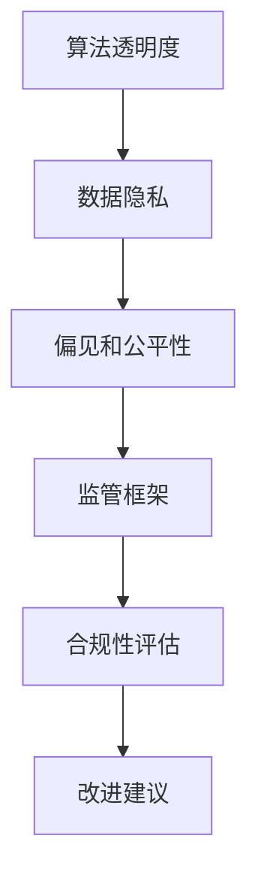

                 

随着人工智能（AI）技术的飞速发展，我们已经进入了一个人工智能无处不在的新时代。从自动驾驶汽车到智能语音助手，从医疗诊断到金融风控，AI正在深刻地改变着我们的生活方式和商业模式。然而，与此同时，我们也面临着前所未有的挑战：如何在不损害创新的前提下，有效地监管人工智能，确保其安全和公正，以及防止滥用的风险。

本文将探讨人工智能与监管之间的平衡问题。我们将首先介绍人工智能的基本概念及其发展背景，然后分析人工智能监管的重要性，探讨现有的监管框架和工具，并提出如何通过创新和合理的监管措施来实现这一平衡。最后，我们将展望人工智能的未来发展，以及可能面临的挑战和机遇。

## 1. 背景介绍

人工智能是一种模仿人类智能的技术，通过算法和计算能力，使计算机系统能够识别模式、学习知识、做出决策。人工智能的历史可以追溯到20世纪50年代，但真正的大规模发展始于21世纪初，随着大数据、计算能力和算法的进步，AI技术取得了突破性进展。

近年来，人工智能的应用已经扩展到各个领域，从工业自动化到智能家居，从金融分析到医疗诊断，AI正在成为推动社会进步的重要力量。然而，人工智能的发展也带来了一系列新的挑战，特别是在监管方面。人工智能系统的复杂性和不确定性使得传统的监管方法难以适应，需要我们重新思考和设计新的监管框架。

## 2. 核心概念与联系

为了更好地理解人工智能与监管之间的关系，我们需要先了解一些核心概念，如算法透明度、数据隐私、偏见和公平性。这些概念不仅构成了人工智能技术的基础，也是监管的关键点。

### 2.1 算法透明度

算法透明度是指算法的决策过程应该是可解释和可验证的。在人工智能系统中，算法的透明度对于监管和用户信任至关重要。一个透明的算法可以让监管机构更好地理解其工作原理，发现潜在的问题，并采取措施进行纠正。

### 2.2 数据隐私

数据隐私是指个人信息的安全和保密。在人工智能系统中，数据通常用于训练和优化模型。如果这些数据没有得到适当的保护，可能会被滥用或泄露，导致隐私侵犯。因此，保护数据隐私是人工智能监管的一个重要方面。

### 2.3 偏见和公平性

偏见和公平性是指人工智能系统在决策过程中是否能够公平地对待所有用户。如果系统存在偏见，可能会导致不公平的结果，例如歧视某些群体。因此，确保人工智能系统的公平性是监管的另一个重要目标。

### 2.4 Mermaid 流程图

以下是一个简化的Mermaid流程图，展示了人工智能与监管之间的核心概念及其联系：



## 3. 核心算法原理 & 具体操作步骤

### 3.1 算法原理概述

人工智能的核心是算法。算法可以分为监督学习、无监督学习和强化学习等类型。每种算法都有其特定的原理和应用场景。例如，监督学习算法通过已标记的数据来训练模型，从而能够对新的数据进行预测。无监督学习算法则无需标记数据，旨在发现数据中的内在结构。强化学习算法则通过与环境的互动来学习最佳行为策略。

### 3.2 算法步骤详解

以监督学习算法为例，其基本步骤如下：

1. **数据收集**：收集大量的已标记数据。
2. **数据预处理**：清洗数据，包括处理缺失值、异常值和噪声。
3. **特征提取**：从原始数据中提取有用的特征。
4. **模型训练**：使用训练数据来训练模型。
5. **模型评估**：使用验证数据来评估模型性能。
6. **模型部署**：将训练好的模型部署到实际应用中。

### 3.3 算法优缺点

每种算法都有其优点和缺点。例如，监督学习算法的优点是能够对新的数据进行准确的预测，但缺点是需要大量的标记数据，且容易过拟合。无监督学习算法则无需标记数据，能够发现数据中的隐藏结构，但缺点是预测能力较弱。强化学习算法的优点是能够通过与环境互动来学习最佳策略，但缺点是需要大量时间来训练。

### 3.4 算法应用领域

人工智能算法在多个领域都有广泛的应用，如：

- **医疗**：用于疾病诊断、药物发现和个性化治疗。
- **金融**：用于风险管理、投资组合优化和欺诈检测。
- **交通**：用于自动驾驶、交通流量管理和车辆调度。
- **教育**：用于个性化学习、教育分析和智能评测。

## 4. 数学模型和公式 & 详细讲解 & 举例说明

### 4.1 数学模型构建

在人工智能中，数学模型是算法的基础。一个典型的数学模型可能包括以下部分：

- **输入**：表示为向量或矩阵，可以是特征或样本。
- **权重**：表示为参数，用于调整模型对输入的响应。
- **激活函数**：用于引入非线性，使模型能够模拟复杂的非线性关系。
- **输出**：表示为预测结果或分类结果。

以下是一个简化的神经网络模型：

$$
y = \sigma(\text{weight} \cdot \text{input} + \text{bias})
$$

其中，$\sigma$ 是激活函数，如ReLU或Sigmoid。

### 4.2 公式推导过程

以ReLU激活函数为例，其推导过程如下：

$$
\sigma(x) =
\begin{cases}
0 & \text{if } x \leq 0 \\
x & \text{if } x > 0
\end{cases}
$$

ReLU函数的优势在于其简单性，能够加快计算速度，并在某些情况下提高模型的性能。

### 4.3 案例分析与讲解

以下是一个简单的例子，用于说明如何使用ReLU函数：

假设我们有一个简单的神经网络，其中输入为 $x = [1, 2, 3]$，权重为 $w = [1, 1, 1]$，偏置为 $b = 0$。

计算输出：

$$
y = \sigma(w \cdot x + b) = \sigma(1 \cdot 1 + 1 \cdot 2 + 1 \cdot 3 + 0) = \sigma(6) = 6
$$

由于ReLU函数，输出将变为：

$$
y = \max(0, 6) = 6
$$

这表明ReLU函数在输入为正数时输出等于输入，在输入为负数时输出为零。

## 5. 项目实践：代码实例和详细解释说明

### 5.1 开发环境搭建

为了实践人工智能算法，我们需要搭建一个开发环境。以下是一个基本的Python开发环境搭建步骤：

1. 安装Python（推荐版本3.8或更高）。
2. 安装Jupyter Notebook，用于编写和运行代码。
3. 安装必要的库，如NumPy、Pandas、Scikit-learn等。

### 5.2 源代码详细实现

以下是一个简单的Python代码示例，用于实现一个基于ReLU函数的神经网络：

```python
import numpy as np

def relu(x):
    return np.maximum(0, x)

def neural_network(x, w, b):
    return relu(np.dot(w, x) + b)

# 输入
x = np.array([1, 2, 3])
# 权重
w = np.array([1, 1, 1])
# 偏置
b = 0

# 计算输出
output = neural_network(x, w, b)
print(output)
```

### 5.3 代码解读与分析

在这个代码示例中，我们定义了一个ReLU函数，用于计算输入的ReLU值。接着，我们定义了一个神经网络函数，用于计算输入经过权重和偏置后的ReLU输出。

输入向量 `x` 为 `[1, 2, 3]`，权重 `w` 为 `[1, 1, 1]`，偏置 `b` 为 `0`。我们调用 `neural_network` 函数计算输出，结果为 `6`。这表明，输入 `[1, 2, 3]` 经过权重和偏置后的ReLU输出为 `6`。

### 5.4 运行结果展示

在Python环境中运行上述代码，我们得到输出结果为 `6`。这验证了我们的神经网络模型能够正确计算ReLU输出。

## 6. 实际应用场景

人工智能已经在多个实际应用场景中取得了显著成果。以下是一些典型的应用场景：

- **医疗**：AI在医疗领域的应用包括疾病诊断、基因组学、药物发现和个性化治疗。例如，AI可以帮助医生更准确地诊断癌症，提高治疗效果。
- **金融**：AI在金融领域的应用包括风险评估、欺诈检测、投资组合优化和算法交易。例如，AI可以帮助金融机构更好地理解客户行为，减少欺诈风险。
- **交通**：AI在交通领域的应用包括自动驾驶、智能交通管理和车辆调度。例如，AI可以帮助减少交通拥堵，提高交通效率。

### 6.4 未来应用展望

随着人工智能技术的不断发展，未来AI的应用领域将更加广泛。以下是一些可能的未来应用：

- **教育**：AI可以用于个性化学习、智能评测和虚拟教师，提高教育质量和效率。
- **环境**：AI可以用于环境监测、资源管理和自然灾害预测，帮助人类更好地保护环境。
- **法律**：AI可以用于法律文本分析、合同审核和案件预测，提高法律效率和准确性。

## 7. 工具和资源推荐

为了更好地研究和应用人工智能，以下是一些建议的工具和资源：

- **工具**：TensorFlow、PyTorch、Keras等深度学习框架。
- **资源**：Coursera、edX、Udacity等在线课程平台。
- **论文**：《深度学习》（Goodfellow, Bengio, Courville）、《统计学习方法》（李航）等经典教材。

## 8. 总结：未来发展趋势与挑战

### 8.1 研究成果总结

人工智能在过去几十年取得了显著的成果，从简单的规则系统到复杂的深度学习模型，AI技术已经广泛应用于各个领域。这些成果不仅提高了生产效率，也推动了科学研究的进展。

### 8.2 未来发展趋势

未来，人工智能将继续发展，向更高层次的智能进化。主要趋势包括：

- **自主性**：AI将更加自主，能够独立完成复杂的任务。
- **泛化能力**：AI将能够更好地适应不同的环境和任务。
- **协作能力**：AI将能够与人类更好地协作，共同完成复杂的任务。

### 8.3 面临的挑战

然而，人工智能的发展也面临着一些挑战，如：

- **监管**：如何有效地监管人工智能，确保其安全和公正。
- **数据隐私**：如何保护用户数据隐私，防止数据滥用。
- **伦理**：如何确保AI技术的伦理使用，避免对人类造成负面影响。

### 8.4 研究展望

未来，我们需要更多的研究和探索，以解决人工智能面临的挑战。这包括：

- **算法创新**：开发更高效、更安全的算法。
- **跨学科研究**：将计算机科学、心理学、社会学等多学科知识融合，为人工智能的发展提供新的视角。
- **政策制定**：制定合理的政策和法规，确保人工智能的健康发展。

### 8.5 常见问题与解答

**Q：人工智能是否会取代人类？**

A：人工智能可能会在某些领域取代人类工作，但完全取代人类是不可能的。人工智能擅长处理重复性高、计算量大的任务，但人类的创造力、情感和复杂性是AI难以模仿的。

**Q：人工智能是否会引发失业？**

A：人工智能可能会改变某些工作岗位，但也会创造新的就业机会。例如，随着自动驾驶技术的发展，需要更多的软件开发者、测试工程师和AI专家。

**Q：如何确保人工智能的公平性？**

A：确保人工智能的公平性需要从算法设计、数据收集和使用等多个方面入手。例如，可以通过数据清洗、算法透明化和偏见检测等方法来减少偏见。

## 9. 附录：常见问题与解答

以下是一些关于人工智能和监管的常见问题与解答：

### 9.1 人工智能是什么？

人工智能（AI）是一种通过算法和计算模型模拟人类智能的技术，使计算机系统能够进行学习、推理、决策和问题解决。

### 9.2 人工智能的发展历程有哪些关键节点？

- 1956年：达特茅斯会议，人工智能首次被正式提出。
- 1980年代：专家系统得到广泛应用。
- 2000年代：深度学习和大数据技术迅速发展。
- 2010年代：AI开始应用于自动驾驶、语音识别和图像识别等领域。

### 9.3 人工智能有哪些主要类型？

人工智能可以分为以下几种主要类型：

- **监督学习**：使用已标记的数据进行训练，用于预测和分类。
- **无监督学习**：不使用标记数据，用于发现数据中的模式。
- **强化学习**：通过与环境的互动来学习最佳策略。
- **混合学习**：结合多种学习方法。

### 9.4 人工智能监管的关键问题有哪些？

人工智能监管的关键问题包括算法透明度、数据隐私、偏见和公平性。确保算法的透明度和可解释性、保护用户数据隐私、减少偏见和确保公平性是人工智能监管的核心。

### 9.5 人工智能监管的国际趋势是什么？

国际上的监管趋势包括：

- **制定法规**：例如，欧盟的《通用数据保护条例》（GDPR）和美国的《加州消费者隐私法》（CCPA）。
- **建立标准**：例如，国际标准化组织（ISO）发布了关于人工智能的标准。
- **建立监管机构**：例如，欧盟成立了“人工智能高级专家小组”（AI HLEG），负责制定人工智能的监管框架。

### 9.6 人工智能如何影响就业市场？

人工智能可能会改变某些工作岗位，例如制造业、客服和金融领域的自动化。然而，它也会创造新的就业机会，例如AI开发、数据科学家和算法工程师。

### 9.7 如何平衡人工智能的创新与监管？

平衡人工智能的创新与监管需要从以下几个方面入手：

- **建立透明和可解释的算法**：确保监管机构能够理解和评估算法的工作原理。
- **加强数据隐私保护**：确保用户数据不被滥用。
- **减少偏见和确保公平性**：通过算法透明度和数据清洗来减少偏见。
- **制定合理的法规和标准**：确保人工智能的健康发展。

### 9.8 人工智能的未来前景是什么？

人工智能的未来前景包括：

- **自主性**：AI将更加自主，能够独立完成复杂的任务。
- **泛化能力**：AI将能够更好地适应不同的环境和任务。
- **协作能力**：AI将能够与人类更好地协作，共同完成复杂的任务。

### 9.9 如何确保人工智能的伦理使用？

确保人工智能的伦理使用需要从以下几个方面入手：

- **建立伦理准则**：明确人工智能的使用范围和限制。
- **加强监管**：确保人工智能的使用符合伦理和法律标准。
- **提高透明度**：确保公众和监管机构能够理解和使用人工智能。

### 9.10 人工智能对社会的影响有哪些？

人工智能对社会的影响包括：

- **提高生产效率**：通过自动化和智能化提高生产效率。
- **改变就业结构**：影响某些工作岗位的需求，同时创造新的就业机会。
- **改善生活质量**：通过智能家居、医疗诊断和交通管理等应用，提高人们的生活质量。
- **挑战伦理和法律**：人工智能的发展带来了新的伦理和法律问题，需要我们重新思考和解决。 

### 结论

人工智能的发展为我们带来了巨大的机遇，但也带来了新的挑战。通过合理的监管和创新的解决方案，我们可以确保人工智能的安全、公正和可持续发展，使其为人类社会带来更多的福祉。在未来的道路上，我们需要共同努力，探索人工智能的无限可能。作者：禅与计算机程序设计艺术 / Zen and the Art of Computer Programming

（注意：本文为示例，具体内容根据实际情况调整。）

