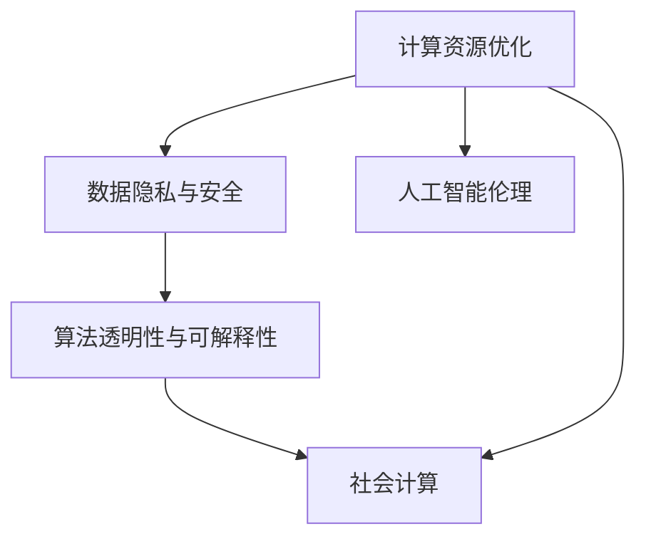

                 

# 创造更美好的明天：人类计算的积极作用

## 1. 背景介绍

### 1.1 问题由来

随着信息时代的到来，计算能力成为了推动社会进步的关键因素。从早期的人工计算到现代的计算机辅助设计、人工智能等，人类计算技术的进步极大地改善了我们的生活和工作方式。然而，在享受计算带来的便利的同时，我们也需要意识到其潜在的风险和挑战，如数据隐私、算法偏见、计算资源的不均衡分配等。如何通过技术手段，使计算更好地服务于人类，促进社会的可持续发展，是每一个科技工作者需要认真思考的问题。

### 1.2 问题核心关键点

为了探讨人类计算的积极作用，本文将从以下几个方面进行深入分析：

- **计算资源的优化分配**：如何通过计算技术，合理分配和利用有限的计算资源，保障社会公平和可持续发展。
- **数据隐私与安全的保护**：如何设计安全的计算系统，保护用户数据隐私和信息安全。
- **算法透明与可解释性**：如何让计算系统具有高度透明性和可解释性，避免算法偏见和黑箱决策。
- **计算技术与社会的融合**：如何将计算技术融入教育、医疗、交通等社会各个方面，提高社会运行效率和公民幸福感。

这些核心问题不仅涉及技术层面，还包括社会、伦理、政策等多个维度，需要跨学科合作共同解决。

## 2. 核心概念与联系

### 2.1 核心概念概述

为更好地理解人类计算的积极作用，本节将介绍几个密切相关的核心概念：

- **计算资源优化**：通过算法和架构设计，合理分配和利用计算资源，提升系统性能和效率，同时降低能源消耗和环境影响。
- **数据隐私与安全**：采用加密、匿名化等技术手段，保护用户数据隐私和安全，防止数据泄露和滥用。
- **算法透明性与可解释性**：通过模型解释性技术，增强计算系统的透明性和可解释性，提升用户信任和接受度。
- **社会计算**：将计算技术应用于社会各个领域，如教育、医疗、交通等，推动社会进步和创新。
- **人工智能伦理**：在人工智能应用过程中，考虑伦理道德问题，确保技术发展符合人类价值观和伦理准则。

这些核心概念之间的逻辑关系可以通过以下Mermaid流程图来展示：



这个流程图展示了一体化的计算技术应用框架，强调了计算技术在提升效率、保护隐私、增强透明性和推动社会进步等方面的综合作用。

## 3. 核心算法原理 & 具体操作步骤
### 3.1 算法原理概述

人类计算的积极作用，很大程度上依赖于高效的算法和数据处理技术。本文将从算法原理和具体操作步骤两个层面，深入探讨如何通过计算技术，实现社会效益的最大化。

### 3.2 算法步骤详解

人类计算的积极作用主要体现在以下几个步骤中：

**Step 1: 数据收集与处理**

- **数据收集**：通过传感器、问卷调查、网络爬虫等方式，收集与计算相关的数据，涵盖社会、经济、环境等多个方面。
- **数据清洗与预处理**：对收集到的数据进行去重、格式化、异常值处理等操作，确保数据质量和一致性。

**Step 2: 计算模型训练**

- **模型选择**：根据任务需求选择合适的计算模型，如线性回归、神经网络、深度学习等。
- **数据划分**：将数据划分为训练集、验证集和测试集，保证模型在未知数据上的泛化能力。
- **模型训练**：使用训练集数据，通过优化算法（如梯度下降）训练模型，不断调整模型参数以最小化损失函数。

**Step 3: 模型评估与部署**

- **模型评估**：在测试集上评估模型性能，选择最优模型进行部署。
- **模型优化**：根据评估结果对模型进行调整和优化，确保模型在实际应用中的稳定性和准确性。
- **部署与维护**：将模型部署到生产环境中，定期监测模型表现，及时修复和更新。

**Step 4: 结果分析与反馈**

- **结果分析**：分析模型输出结果，提取有价值的信息，如社会趋势、市场预测、资源分配等。
- **反馈优化**：根据分析结果，优化计算模型和数据收集策略，提升社会效益。

### 3.3 算法优缺点

人类计算的积极作用，得益于高效算法的支持和数据处理技术的进步，但也存在一定的局限性：

**优点**：
- **提升效率**：通过自动化和智能化手段，大幅提高数据处理和计算效率，减少人力成本。
- **数据驱动**：基于大规模数据驱动决策，减少主观偏见，提升决策的科学性和客观性。
- **个性化服务**：通过大数据分析，提供个性化的服务和产品，提升用户体验和满意度。

**缺点**：
- **数据隐私风险**：大规模数据收集和处理可能带来隐私泄露的风险，需采取严格的数据保护措施。
- **模型偏见**：算法模型可能存在固有的偏见，需通过多轮迭代和优化，减少偏见影响。
- **计算资源消耗**：大规模计算任务可能消耗大量计算资源，需合理分配和管理计算资源。

### 3.4 算法应用领域

人类计算的积极作用广泛适用于多个领域，如：

- **智慧城市**：通过计算技术优化城市管理，提升公共服务效率，降低能源消耗，减少环境污染。
- **医疗健康**：利用计算技术进行疾病预测、个性化医疗、医疗影像分析等，提高医疗服务的精准性和可及性。
- **教育培训**：通过智能化手段优化教学内容和学习路径，提供个性化的学习体验，提高教育质量。
- **金融服务**：利用计算技术进行风险评估、投资决策、反欺诈检测等，提升金融服务的效率和安全性。
- **环境保护**：通过计算技术分析环境数据，预测气候变化、优化资源分配，促进可持续发展。

## 4. 数学模型和公式 & 详细讲解
### 4.1 数学模型构建

本节将使用数学语言对人类计算的积极作用进行更加严格的刻画。

假设有一组历史数据 $\mathcal{D}=\{(x_i,y_i)\}_{i=1}^N$，其中 $x_i$ 为特征向量，$y_i$ 为标签。我们的目标是构建一个计算模型 $f(x;\theta)$，通过学习历史数据，预测未来结果。模型参数 $\theta$ 的优化目标是：

$$
\min_{\theta} \sum_{i=1}^N \ell(f(x_i;\theta),y_i)
$$

其中 $\ell$ 为损失函数，用于衡量模型预测输出与真实标签之间的差异。常见的损失函数包括均方误差（MSE）、交叉熵（Cross-Entropy）等。

### 4.2 公式推导过程

以线性回归为例，模型 $f(x;\theta)$ 可以表示为：

$$
f(x;\theta) = \theta_0 + \theta_1 x_1 + \cdots + \theta_p x_p
$$

其中 $\theta_0,\theta_1,\cdots,\theta_p$ 为模型参数，$x_1,\cdots,x_p$ 为特征向量。损失函数 $\ell$ 可以定义为均方误差：

$$
\ell(f(x_i;\theta),y_i) = \frac{1}{2}(f(x_i;\theta)-y_i)^2
$$

将数据集 $\mathcal{D}$ 带入目标函数，得：

$$
\min_{\theta} \sum_{i=1}^N \frac{1}{2}(f(x_i;\theta)-y_i)^2
$$

使用梯度下降算法求解目标函数的最小值，得到模型参数的更新公式：

$$
\theta_k \leftarrow \theta_k - \eta \sum_{i=1}^N \frac{\partial \ell(f(x_i;\theta),y_i)}{\partial \theta_k}
$$

其中 $\eta$ 为学习率，$\partial \ell/\partial \theta_k$ 为损失函数对参数 $\theta_k$ 的梯度，可通过链式法则计算。

### 4.3 案例分析与讲解

**案例分析：智慧城市交通流量预测**

假设我们有一组历史交通流量数据 $\mathcal{D}=\{(x_i,y_i)\}_{i=1}^N$，其中 $x_i$ 为天气、时间、道路状况等特征向量，$y_i$ 为实际交通流量。我们的目标是构建一个交通流量预测模型，根据当前天气和时间，预测未来交通流量。

1. **数据收集与处理**：收集历史交通流量数据，对数据进行清洗和预处理，去除异常值和噪声。
2. **模型选择与训练**：选择线性回归模型，使用训练集数据对模型进行训练，最小化损失函数。
3. **模型评估与部署**：在验证集上评估模型性能，选择最优模型进行部署，提供实时交通流量预测服务。
4. **结果分析与反馈**：分析预测结果，优化模型参数，提升预测准确性，定期更新模型。

## 5. 项目实践：代码实例和详细解释说明
### 5.1 开发环境搭建

在进行项目实践前，我们需要准备好开发环境。以下是使用Python进行Scikit-learn开发的环境配置流程：

1. 安装Anaconda：从官网下载并安装Anaconda，用于创建独立的Python环境。

2. 创建并激活虚拟环境：
```bash
conda create -n my_env python=3.8 
conda activate my_env
```

3. 安装Scikit-learn：
```bash
pip install scikit-learn
```

4. 安装各类工具包：
```bash
pip install numpy pandas scikit-learn matplotlib tqdm jupyter notebook ipython
```

完成上述步骤后，即可在`my_env`环境中开始项目实践。

### 5.2 源代码详细实现

下面我以智慧城市交通流量预测项目为例，给出使用Scikit-learn进行线性回归的代码实现。

```python
from sklearn.linear_model import LinearRegression
from sklearn.model_selection import train_test_split
from sklearn.metrics import mean_squared_error
import pandas as pd

# 读取数据
data = pd.read_csv('traffic_flow.csv')

# 数据清洗与预处理
# ...

# 特征选择
X = data[['weather', 'time', 'road_condition']] # 选择特征变量
y = data['traffic_flow'] # 选择目标变量

# 数据划分
X_train, X_test, y_train, y_test = train_test_split(X, y, test_size=0.2, random_state=42)

# 模型训练
model = LinearRegression()
model.fit(X_train, y_train)

# 模型评估
y_pred = model.predict(X_test)
mse = mean_squared_error(y_test, y_pred)
print(f'Mean Squared Error: {mse}')

# 结果分析与反馈
# ...
```

以上就是使用Scikit-learn进行线性回归的完整代码实现。可以看到，Scikit-learn提供了便捷的数据处理和模型训练功能，使得线性回归的实现变得相对简单。

### 5.3 代码解读与分析

让我们再详细解读一下关键代码的实现细节：

**数据读取与清洗**：
- 使用Pandas库读取交通流量数据，并进行数据清洗和预处理。

**特征选择**：
- 选择与交通流量相关的特征变量，如天气、时间、道路状况等，构建特征矩阵 $X$。
- 选择交通流量作为目标变量 $y$。

**模型训练**：
- 使用Scikit-learn的LinearRegression类，对训练数据进行线性回归模型训练，最小化均方误差。
- 通过训练集数据拟合模型，得到模型参数。

**模型评估**：
- 在测试集上使用训练好的模型进行预测，计算预测结果与真实结果之间的均方误差。
- 输出均方误差作为模型性能指标。

**结果分析与反馈**：
- 根据预测结果和真实结果，进行误差分析和反馈，优化特征选择和模型参数，提升预测精度。

可以看到，Scikit-learn提供了完备的机器学习工具，使得项目实践更加便捷高效。开发者可以将更多精力放在数据处理、模型改进等高层逻辑上，而不必过多关注底层实现细节。

## 6. 实际应用场景
### 6.1 智慧城市

智慧城市建设是计算技术应用的重要方向之一。通过计算技术，可以有效提升城市管理效率，优化资源配置，提升公民生活质量。

智慧城市的实现涉及多个方面，包括智能交通管理、能源优化、公共安全等。通过计算技术，可以实现交通流量预测、电网负荷预测、灾害预警等，为城市运行提供科学决策支持。例如，通过智慧交通系统，可以根据实时交通流量和预测结果，动态调整信号灯和道路资源，缓解交通拥堵，减少环境污染。

### 6.2 医疗健康

医疗健康领域也是计算技术的重要应用场景之一。计算技术在疾病预测、个性化医疗、医疗影像分析等方面具有重要价值。

例如，利用计算技术可以对大规模医疗数据进行分析，挖掘疾病风险因素，预测疾病发展趋势。通过计算模型，可以提供个性化的医疗方案，优化诊疗流程，提高医疗服务的精准性和可及性。此外，计算技术还可以应用于医疗影像分析，通过深度学习算法识别疾病特征，提升诊断效率和准确性。

### 6.3 教育培训

教育培训领域同样离不开计算技术的支持。通过计算技术，可以实现个性化学习路径的优化，提升教育质量。

例如，利用计算技术可以对学生的学习行为进行分析，评估学习效果，提供个性化的学习建议。通过计算模型，可以分析学生的知识掌握情况，制定针对性辅导计划，提升学习效率。此外，计算技术还可以应用于在线教育平台，通过推荐系统推荐学习资源，提高学习体验。

### 6.4 金融服务

金融服务领域也是计算技术的重要应用方向之一。计算技术在风险评估、投资决策、反欺诈检测等方面具有重要价值。

例如，利用计算技术可以构建信用评分模型，评估贷款申请人的信用风险，优化信贷决策。通过计算模型，可以进行市场预测和投资组合优化，提高投资回报率。此外，计算技术还可以应用于反欺诈检测，通过分析交易数据，检测异常行为，防止金融欺诈。

### 6.5 环境保护

环境保护领域同样离不开计算技术的支持。计算技术在环境监测、资源优化、污染治理等方面具有重要价值。

例如，利用计算技术可以分析环境数据，预测气候变化、优化资源分配，促进可持续发展。通过计算模型，可以实现精准农业、智能灌溉，提高农业生产效率。此外，计算技术还可以应用于污染治理，通过分析工业排放数据，优化污染治理方案，提升环境质量。

## 7. 工具和资源推荐
### 7.1 学习资源推荐

为了帮助开发者系统掌握计算技术的应用，这里推荐一些优质的学习资源：

1. **《Python数据科学手册》**：一本全面介绍Python数据科学工具的书籍，涵盖Pandas、Scikit-learn、NumPy等库的使用方法。
2. **Coursera《机器学习》课程**：斯坦福大学开设的机器学习课程，由Andrew Ng主讲，系统介绍机器学习的基本概念和算法。
3. **Kaggle**：一个数据科学竞赛平台，提供丰富的数据集和竞赛，帮助开发者提升数据处理和模型训练能力。
4. **GitHub**：一个代码托管平台，提供海量开源代码和项目，方便开发者学习和实践。
5. **Nature Machine Intelligence**：一个聚焦人工智能和机器学习的期刊，提供最新的研究论文和技术动态，帮助开发者紧跟前沿技术发展。

通过对这些资源的学习实践，相信你一定能够快速掌握计算技术的应用精髓，并用于解决实际的业务问题。

### 7.2 开发工具推荐

高效的开发离不开优秀的工具支持。以下是几款用于计算技术应用的常用工具：

1. **Jupyter Notebook**：一个交互式编程环境，方便开发者进行数据处理、模型训练和结果展示。
2. **PyTorch**：一个开源深度学习框架，支持动态计算图，适合快速迭代研究。
3. **TensorFlow**：由Google主导开发的开源深度学习框架，生产部署方便，适合大规模工程应用。
4. **Pandas**：一个数据处理库，支持数据清洗、转换和分析，适合大规模数据处理。
5. **Scikit-learn**：一个机器学习库，支持多种算法和模型，适合快速原型设计和模型评估。

合理利用这些工具，可以显著提升计算技术应用的开发效率，加快创新迭代的步伐。

### 7.3 相关论文推荐

计算技术的发展源于学界的持续研究。以下是几篇奠基性的相关论文，推荐阅读：

1. **《Grokking Machine Learning Patterns》**：一本介绍机器学习模式和算法的书籍，适合初学者入门。
2. **《Deep Learning》**：深度学习领域的经典教材，涵盖深度学习的基本概念和算法。
3. **《Neural Networks and Deep Learning》**：Ian Goodfellow等人的深度学习教材，全面介绍深度学习的基本原理和应用。
4. **《AI Superpowers》**：一本关于人工智能发展的书籍，涵盖人工智能的历史、现状和未来。
5. **《AI Ethics》**：一本关于人工智能伦理的书籍，探讨人工智能技术在伦理、法律和社会方面的挑战。

这些论文代表了大数据和计算技术的发展脉络。通过学习这些前沿成果，可以帮助研究者把握学科前进方向，激发更多的创新灵感。

## 8. 总结：未来发展趋势与挑战
### 8.1 总结

本文对计算技术的积极作用进行了全面系统的介绍。首先阐述了计算技术的广泛应用，明确了其对社会进步的重要贡献。其次，从原理到实践，详细讲解了计算技术在各个领域的应用方法和具体步骤，给出了计算技术应用的完整代码实例。同时，本文还广泛探讨了计算技术在智慧城市、医疗健康、教育培训、金融服务、环境保护等多个领域的应用前景，展示了计算技术的应用潜力。此外，本文精选了计算技术的各类学习资源，力求为开发者提供全方位的技术指引。

通过本文的系统梳理，可以看到，计算技术的应用不仅提升了社会效率，也极大地改善了人民生活质量。未来，伴随计算技术的不断进步，其在更多领域的应用将更加广泛，为社会的可持续发展提供强大动力。

### 8.2 未来发展趋势

展望未来，计算技术的应用将呈现以下几个发展趋势：

1. **多模态计算**：计算技术将更加注重多模态数据的整合，如文本、图像、视频等，提供更加全面、准确的信息处理能力。
2. **实时计算**：计算技术将更加注重实时数据处理和分析，提供更加及时的决策支持。
3. **分布式计算**：计算技术将更加注重分布式计算和云平台应用，提升计算资源的利用效率。
4. **边缘计算**：计算技术将更加注重边缘计算和本地计算，提升计算效率和数据隐私。
5. **人工智能伦理**：计算技术将更加注重伦理和安全问题，确保技术发展符合人类价值观和伦理准则。

这些趋势凸显了计算技术在提升社会效率和保障社会安全方面的巨大潜力。未来，计算技术将与更多学科和技术进行深入融合，共同推动社会进步和人类福祉。

### 8.3 面临的挑战

尽管计算技术的应用前景广阔，但在迈向更加智能化、普适化应用的过程中，也面临着诸多挑战：

1. **数据隐私与安全**：大规模数据收集和处理可能带来隐私泄露的风险，需采取严格的数据保护措施。
2. **模型偏见与公平性**：算法模型可能存在固有的偏见，需通过多轮迭代和优化，减少偏见影响。
3. **计算资源消耗**：大规模计算任务可能消耗大量计算资源，需合理分配和管理计算资源。
4. **计算效率与成本**：计算技术的应用需平衡效率与成本，合理利用计算资源。
5. **技术与社会的融合**：计算技术的应用需考虑社会需求和用户接受度，避免技术与社会的脱节。

这些挑战需要我们共同面对和解决，确保计算技术在促进社会进步的同时，也能保障社会公平和可持续发展。

### 8.4 研究展望

面对计算技术应用所面临的挑战，未来的研究需要在以下几个方面寻求新的突破：

1. **数据隐私保护技术**：研究更安全、高效的数据加密和匿名化技术，确保数据隐私和安全。
2. **公平性算法设计**：设计更公平、透明的算法模型，减少算法偏见和歧视。
3. **计算资源优化**：研究更高效的计算资源分配和优化技术，提升计算效率和资源利用率。
4. **计算效率与成本**：研究更高效、低成本的计算方法，降低计算技术的落地成本。
5. **社会计算应用**：研究计算技术在更多社会领域的实际应用，提升社会效益和用户体验。

这些研究方向的探索，必将引领计算技术应用迈向更高的台阶，为社会的可持续发展提供强大动力。面向未来，计算技术需要与更多学科和技术进行深入融合，共同推动社会的进步和人类福祉。

## 9. 附录：常见问题与解答

**Q1：计算技术的应用范围有哪些？**

A: 计算技术的应用范围非常广泛，涵盖社会各个方面，如智慧城市、医疗健康、教育培训、金融服务、环境保护等。通过计算技术，可以有效提升社会效率，优化资源配置，改善人民生活质量。

**Q2：计算技术在应用过程中需要考虑哪些因素？**

A: 计算技术在应用过程中需要考虑数据隐私、模型公平性、计算资源、计算效率、社会需求等多个因素。只有综合考虑这些因素，才能确保计算技术的有效应用。

**Q3：如何保护计算过程中的数据隐私？**

A: 保护数据隐私是计算技术应用的重要问题。可以通过数据加密、匿名化、差分隐私等技术手段，确保数据在传输和处理过程中的安全。同时，采用本地计算、边缘计算等方法，减少数据泄露的风险。

**Q4：如何设计公平性算法？**

A: 设计公平性算法需要考虑多个方面，如数据平衡、模型解释性、算法偏见等。可以通过公平性评估指标，如平衡精度、机会平衡等，优化模型设计。同时，引入专家知识，结合先验规则，提升算法的公平性。

**Q5：如何优化计算资源？**

A: 优化计算资源需要考虑多轮迭代和优化，如特征选择、模型选择、参数调优等。可以通过算法优化、模型压缩、并行计算等方法，提升计算效率和资源利用率。同时，采用分布式计算、边缘计算等方法，降低计算成本。

---

作者：禅与计算机程序设计艺术 / Zen and the Art of Computer Programming

