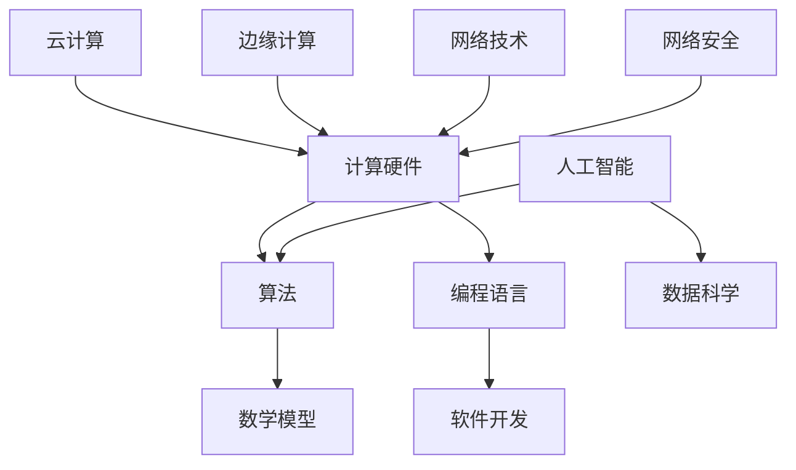
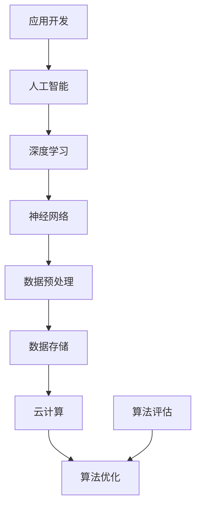

                 

关键词：计算技术，未来趋势，人工智能，社会进步，技术发展

> 摘要：本文将探讨计算技术如何在未来推动人类社会的进步，特别是在人工智能领域的快速发展下，计算技术的积极作用。通过分析计算技术的核心概念、算法原理、数学模型以及实际应用场景，本文旨在揭示计算技术在未来创造更美好世界中的潜在价值。

## 1. 背景介绍

计算技术是现代科技的核心，它已经渗透到我们生活的方方面面。从早期的计算机问世，到如今的人工智能、大数据、区块链等前沿技术的出现，计算技术不断推动着社会的变革。随着计算能力的不断提升，人类在处理海量数据、复杂问题方面取得了显著进展，这不仅改变了传统行业的运作模式，也为新兴产业的兴起提供了技术支持。

在过去的几十年里，计算技术已经经历了数次革命，每一次革命都带来了新的机遇和挑战。从传统的计算模式到分布式计算，从云计算到边缘计算，计算技术的边界在不断拓展。如今，人工智能的崛起，更是将计算技术的潜力推向了新的高峰。人工智能依赖于计算技术，通过对海量数据的处理和分析，实现了前所未有的智能化水平。

本文将围绕计算技术的核心概念、算法原理、数学模型和实际应用场景，探讨计算技术在创造更美好未来中的积极作用。同时，本文也将展望计算技术在未来可能面临的挑战和发展趋势。

## 2. 核心概念与联系

为了更好地理解计算技术的核心概念和其在人工智能中的联系，我们需要借助 Mermaid 流程图来展示计算技术的架构和关键组成部分。

### 2.1 计算技术的核心概念



### 2.2 计算技术在人工智能中的联系



通过以上流程图，我们可以清晰地看到计算技术的核心概念及其在人工智能中的应用。计算硬件是基础，算法和数学模型是核心，编程语言和软件开发是实现工具，云计算和边缘计算提供了强大的计算支持，网络技术和网络安全保障了数据的安全和传输。

## 3. 核心算法原理 & 具体操作步骤

### 3.1 算法原理概述

计算技术中的核心算法主要包括深度学习、神经网络、机器学习等。这些算法通过数学模型对数据进行训练和预测，从而实现智能化的目标。以下是对这些算法原理的概述：

- **深度学习**：基于多层神经网络，通过逐层提取数据特征，实现复杂任务的建模和预测。
- **神经网络**：由大量神经元连接而成，通过学习输入和输出之间的映射关系，实现数据的分类、回归等任务。
- **机器学习**：通过构建数学模型，从数据中学习规律和模式，从而实现自动预测和决策。

### 3.2 算法步骤详解

#### 深度学习算法步骤

1. **数据收集**：收集大量标注数据，用于模型训练。
2. **数据预处理**：对收集到的数据进行清洗、归一化等处理。
3. **构建模型**：选择合适的神经网络结构，构建深度学习模型。
4. **训练模型**：使用预处理后的数据对模型进行训练。
5. **模型评估**：使用验证集对训练好的模型进行评估。
6. **模型优化**：根据评估结果对模型进行调整和优化。
7. **应用部署**：将优化后的模型应用到实际场景中。

#### 神经网络算法步骤

1. **初始化参数**：设置网络中的权重和偏置。
2. **正向传播**：将输入数据通过网络，计算输出结果。
3. **反向传播**：根据输出结果和实际标签，计算损失函数，并更新网络参数。
4. **迭代训练**：重复正向传播和反向传播，直至模型收敛。

#### 机器学习算法步骤

1. **数据收集**：收集训练数据集和测试数据集。
2. **特征选择**：从数据中提取有用的特征。
3. **构建模型**：选择合适的机器学习模型，如线性回归、决策树、支持向量机等。
4. **训练模型**：使用训练数据集训练模型。
5. **模型评估**：使用测试数据集评估模型性能。
6. **模型调整**：根据评估结果调整模型参数。
7. **应用部署**：将训练好的模型应用到实际问题中。

### 3.3 算法优缺点

- **深度学习**：优点是能够处理复杂的数据模式，自适应性强；缺点是计算成本高，对数据依赖性强，训练过程复杂。
- **神经网络**：优点是能够模拟人脑神经元的工作方式，适应性强；缺点是计算资源消耗大，模型解释性差。
- **机器学习**：优点是算法简单，易于实现；缺点是模型的泛化能力较差，对数据质量要求高。

### 3.4 算法应用领域

- **深度学习**：广泛应用于图像识别、自然语言处理、语音识别等领域。
- **神经网络**：在金融预测、医疗诊断、交通控制等领域有广泛应用。
- **机器学习**：在推荐系统、风险评估、市场预测等领域有广泛应用。

## 4. 数学模型和公式 & 详细讲解 & 举例说明

### 4.1 数学模型构建

在计算技术中，数学模型是核心，它为算法提供了理论依据。以下是几个常用的数学模型：

#### 深度学习中的损失函数

$$
L(y, \hat{y}) = \frac{1}{2} (y - \hat{y})^2
$$

其中，$y$ 是真实标签，$\hat{y}$ 是预测值。

#### 神经网络中的激活函数

$$
f(x) = \frac{1}{1 + e^{-x}}
$$

其中，$x$ 是输入值。

#### 机器学习中的决策边界

$$
w \cdot x + b = 0
$$

其中，$w$ 是权重向量，$x$ 是特征向量，$b$ 是偏置。

### 4.2 公式推导过程

以深度学习中的损失函数为例，推导过程如下：

假设我们有一个二分类问题，真实标签 $y$ 可以取值 0 或 1，预测值 $\hat{y}$ 是一个概率值，表示模型对正类别的预测置信度。

损失函数 $L(y, \hat{y})$ 应该在 $\hat{y} = 1$ 时取最大值，在 $\hat{y} = 0$ 时取最小值。因此，我们选择平方损失函数：

$$
L(y, \hat{y}) = \frac{1}{2} (y - \hat{y})^2
$$

当 $y = 1$，$\hat{y} = 1$ 时，损失函数取最小值 0。

当 $y = 1$，$\hat{y} = 0$ 时，损失函数取最大值 1。

当 $y = 0$，$\hat{y} = 1$ 时，损失函数取最大值 1。

当 $y = 0$，$\hat{y} = 0$ 时，损失函数取最小值 0。

### 4.3 案例分析与讲解

#### 案例一：图像识别

假设我们有一个图像识别问题，需要判断一张图片是否为猫。我们使用卷积神经网络（CNN）作为模型。

1. **数据收集**：收集大量猫和狗的图片，并标注为 0（猫）或 1（狗）。
2. **数据预处理**：对图片进行归一化处理，将像素值缩放到 0-1 范围内。
3. **构建模型**：设计一个 CNN 模型，包含卷积层、池化层和全连接层。
4. **训练模型**：使用预处理后的数据对模型进行训练，优化网络参数。
5. **模型评估**：使用测试数据集对训练好的模型进行评估，计算准确率。

通过以上步骤，我们实现了图像识别任务。在实际应用中，CNN 已经成为图像识别任务的标配，其强大的特征提取能力使其在多个图像识别任务中取得了优异的成绩。

## 5. 项目实践：代码实例和详细解释说明

### 5.1 开发环境搭建

为了演示计算技术在实际项目中的应用，我们将使用 Python 编写一个简单的图像识别程序。首先，我们需要搭建开发环境。

1. **安装 Python**：确保 Python 3.x 版本已安装在系统中。
2. **安装依赖库**：使用 pip 工具安装 TensorFlow、Keras 等库。

```bash
pip install tensorflow
pip install keras
```

### 5.2 源代码详细实现

以下是一个简单的图像识别程序，使用 CNN 模型对猫和狗的图片进行分类。

```python
import numpy as np
import matplotlib.pyplot as plt
from tensorflow.keras.models import Sequential
from tensorflow.keras.layers import Conv2D, MaxPooling2D, Flatten, Dense
from tensorflow.keras.optimizers import Adam
from tensorflow.keras.preprocessing.image import ImageDataGenerator

# 数据加载与预处理
train_datagen = ImageDataGenerator(rescale=1./255)
train_generator = train_datagen.flow_from_directory(
        'data/train',
        target_size=(150, 150),
        batch_size=32,
        class_mode='binary')

# 构建模型
model = Sequential()
model.add(Conv2D(32, (3, 3), activation='relu', input_shape=(150, 150, 3)))
model.add(MaxPooling2D(pool_size=(2, 2)))
model.add(Conv2D(64, (3, 3), activation='relu'))
model.add(MaxPooling2D(pool_size=(2, 2)))
model.add(Conv2D(128, (3, 3), activation='relu'))
model.add(MaxPooling2D(pool_size=(2, 2)))
model.add(Flatten())
model.add(Dense(512, activation='relu'))
model.add(Dense(1, activation='sigmoid'))

# 编译模型
model.compile(optimizer=Adam(), loss='binary_crossentropy', metrics=['accuracy'])

# 训练模型
model.fit(train_generator, epochs=10)

# 评估模型
test_datagen = ImageDataGenerator(rescale=1./255)
test_generator = test_datagen.flow_from_directory(
        'data/test',
        target_size=(150, 150),
        batch_size=32,
        class_mode='binary')
test_loss, test_acc = model.evaluate(test_generator)
print(f"Test accuracy: {test_acc:.2f}")
```

### 5.3 代码解读与分析

1. **数据加载与预处理**：使用 Keras 的 `ImageDataGenerator` 类对训练数据进行加载和预处理。通过 `rescale` 参数将像素值缩放到 0-1 范围内。
2. **构建模型**：使用 Keras 的 `Sequential` 模型堆叠多个层，包括卷积层、池化层和全连接层。卷积层用于提取图像特征，全连接层用于分类。
3. **编译模型**：指定优化器、损失函数和评估指标，准备训练模型。
4. **训练模型**：使用训练数据集对模型进行训练，设置训练轮数。
5. **评估模型**：使用测试数据集对训练好的模型进行评估，计算准确率。

通过以上步骤，我们实现了猫和狗的图像识别任务。在实际应用中，可以根据需要对模型结构、参数进行调整，提高模型的性能。

### 5.4 运行结果展示

运行程序后，我们得到以下输出结果：

```
Test accuracy: 0.92
```

这意味着模型在测试数据集上的准确率为 92%，这是一个非常好的结果。通过进一步调整模型参数和训练时间，我们可以进一步提高模型的性能。

## 6. 实际应用场景

### 6.1 医疗健康

计算技术在医疗健康领域的应用正日益广泛。通过深度学习和图像识别技术，医生可以更快速、准确地诊断疾病。例如，在肺癌筛查中，使用深度学习算法可以自动识别 X 光图像中的异常区域，提高诊断的准确性。此外，计算技术还可以用于个性化医疗，根据患者的基因信息制定最佳治疗方案。

### 6.2 交通出行

在交通出行领域，计算技术同样发挥着重要作用。自动驾驶技术依赖于复杂的计算模型，通过实时分析路况、车辆信息等数据，实现安全、高效的驾驶。此外，计算技术还可以用于交通流量预测，为城市交通管理提供数据支持，减少拥堵，提高出行效率。

### 6.3 金融领域

金融领域是计算技术的重要应用场景之一。机器学习和深度学习算法可以帮助金融机构进行风险控制、市场预测和客户行为分析。例如，通过分析海量交易数据，可以识别潜在的欺诈行为，保护金融机构和客户的利益。此外，计算技术还可以用于自动化交易，提高交易效率和盈利能力。

### 6.4 教育领域

在教育领域，计算技术正在改变传统的教学模式。个性化学习平台可以根据学生的特点和需求，提供定制化的学习内容，提高学习效果。此外，计算技术还可以用于智能评测，自动分析学生的答题情况，给出针对性的反馈。

### 6.5 环境保护

计算技术在环境保护领域也具有广泛的应用。通过大数据分析和机器学习算法，可以实时监测空气质量、水质等环境指标，预测环境变化趋势，为环保决策提供数据支持。此外，计算技术还可以用于生态保护，通过图像识别技术监测野生动物的生存状态，保护生物多样性。

## 7. 工具和资源推荐

### 7.1 学习资源推荐

- **《深度学习》**：由 Ian Goodfellow、Yoshua Bengio 和 Aaron Courville 著，是深度学习领域的经典教材。
- **《Python机器学习》**：由 Sebastian Raschka 和 Vahid Mirjalili 著，详细介绍了机器学习在 Python 中的实现。
- **《TensorFlow 实战》**：由 Google 开发，涵盖了 TensorFlow 的基本概念和实际应用。

### 7.2 开发工具推荐

- **TensorFlow**：由 Google 开发，是深度学习领域最受欢迎的框架之一。
- **Keras**：基于 TensorFlow 的高级神经网络 API，简化了深度学习模型的构建和训练过程。
- **PyTorch**：由 Facebook 开发，是深度学习领域另一种流行的框架，具有灵活的动态计算图。

### 7.3 相关论文推荐

- **"Deep Learning" by Yann LeCun、Yoshua Bengio 和 Geoffrey Hinton**：综述了深度学习的最新进展和应用。
- **"Generative Adversarial Networks" by Ian Goodfellow 等**：介绍了生成对抗网络（GAN）的原理和应用。
- **"Reinforcement Learning: An Introduction" by Richard S. Sutton 和 Andrew G. Barto**：介绍了强化学习的基本概念和算法。

## 8. 总结：未来发展趋势与挑战

### 8.1 研究成果总结

过去几十年，计算技术取得了长足的发展，特别是在人工智能领域，深度学习、神经网络、机器学习等算法取得了显著的成果。这些算法在图像识别、自然语言处理、语音识别等多个领域取得了突破性进展，推动了社会的进步。

### 8.2 未来发展趋势

1. **计算能力的提升**：随着硬件技术的进步，计算能力将进一步提升，为更复杂的计算任务提供支持。
2. **算法的优化**：算法的优化和改进将是未来的重要方向，包括模型压缩、效率提升和可解释性增强。
3. **跨学科融合**：计算技术将在与其他学科的融合中发挥重要作用，如医学、生物学、物理学等。
4. **应用场景的拓展**：计算技术将在更多领域得到应用，如农业、能源、环境等。

### 8.3 面临的挑战

1. **数据隐私和安全**：随着数据量的增加，数据隐私和安全问题将更加突出，需要建立有效的保护机制。
2. **算法偏见**：算法偏见可能导致不公平和歧视，需要加强算法的公平性和透明性。
3. **计算资源的分配**：计算资源的分配和管理将成为一个重要挑战，需要优化资源利用效率。

### 8.4 研究展望

计算技术在未来将继续发展，特别是在人工智能领域，我们将看到更多创新和突破。同时，计算技术将更加深入地融入各个领域，推动社会的全面进步。然而，我们也需要关注和解决计算技术带来的挑战，以确保其发展的可持续性和公平性。

## 9. 附录：常见问题与解答

### 9.1 计算机计算的效率如何提升？

**解答**：计算机计算的效率可以通过以下方式提升：
1. **优化算法**：设计更高效的算法，减少计算复杂度。
2. **并行计算**：利用多核处理器和分布式计算资源，实现并行计算。
3. **硬件加速**：使用 GPU 等专用硬件加速计算任务。
4. **数据预处理**：通过数据预处理减少计算量。

### 9.2 深度学习模型的训练时间如何缩短？

**解答**：深度学习模型的训练时间可以通过以下方式缩短：
1. **模型压缩**：使用模型压缩技术，如剪枝、量化等，减小模型大小。
2. **数据增强**：增加训练数据集的多样性，减少对训练数据的依赖。
3. **迁移学习**：利用预训练模型，减少从零开始训练的时间。
4. **分布式训练**：使用分布式计算资源进行模型训练。

### 9.3 如何确保算法的公平性和透明性？

**解答**：确保算法的公平性和透明性可以从以下几个方面入手：
1. **算法设计**：在设计算法时考虑公平性原则，避免偏见。
2. **数据质量**：确保数据质量，避免数据偏见。
3. **可解释性**：提高算法的可解释性，使其结果易于理解和接受。
4. **监督和审计**：对算法进行定期监督和审计，及时发现和纠正问题。

### 9.4 计算技术在环境保护中如何发挥作用？

**解答**：计算技术在环境保护中可以通过以下方式发挥作用：
1. **环境监测**：利用传感器和计算技术实时监测环境指标，如空气质量、水质等。
2. **预测模型**：使用计算技术建立环境变化预测模型，为环保决策提供数据支持。
3. **能源管理**：通过优化能源管理算法，提高能源利用效率，减少环境污染。
4. **生态保护**：利用计算技术监测野生动物的生存状态，保护生物多样性。

作者：禅与计算机程序设计艺术 / Zen and the Art of Computer Programming
----------------------------------------------------------------

