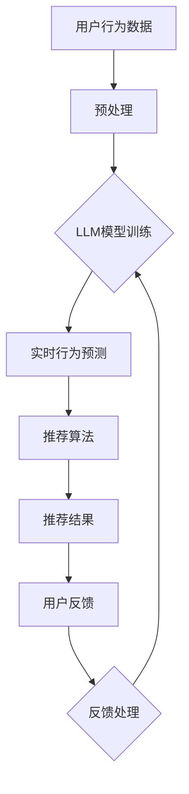

                 

关键词：推荐系统，实时反馈，大规模语言模型（LLM），优化算法，数据处理，用户体验，个性化推荐

## 摘要

本文将探讨如何利用大规模语言模型（LLM）优化推荐系统的实时反馈处理。随着互联网的快速发展，推荐系统已经成为各类应用的核心功能，而实时反馈处理则是提升用户体验的关键环节。通过引入LLM，我们可以实现更精准、高效的用户行为预测和内容推荐。本文将详细介绍LLM在推荐系统中的应用原理、核心算法、数学模型以及项目实践，旨在为读者提供一种全新的优化思路。

## 1. 背景介绍

推荐系统是一种利用算法和用户数据为用户提供个性化内容推荐的技术。它广泛应用于电子商务、社交媒体、新闻资讯、视频音乐等领域，已成为现代互联网应用的重要组成部分。推荐系统的主要目标是通过分析用户历史行为和偏好，为用户推荐他们可能感兴趣的内容，从而提高用户满意度和平台活跃度。

然而，推荐系统在实时反馈处理方面存在一些挑战。首先，用户行为数据量大且更新频繁，如何高效地处理这些数据成为一个关键问题。其次，传统推荐算法往往依赖于历史数据，难以捕捉用户实时动态，导致推荐效果不尽如人意。此外，推荐系统在处理实时反馈时，还需要考虑到数据的一致性、准确性和实时性等问题。

为了解决这些问题，近年来，研究人员开始探索利用大规模语言模型（LLM）优化推荐系统的实时反馈处理。LLM具有强大的文本处理能力和丰富的知识储备，能够在短时间内对大量用户数据进行深度分析和预测。本文将详细介绍LLM在推荐系统中的应用原理、核心算法和数学模型，并通过实际项目实践展示其优势。

## 2. 核心概念与联系

### 2.1 推荐系统基本架构

推荐系统通常由以下几个关键组件构成：

1. **用户画像**：通过分析用户历史行为、偏好和属性，构建用户画像，为推荐算法提供输入。
2. **推荐算法**：根据用户画像和内容特征，计算推荐结果，常见的算法有基于内容的推荐、协同过滤和混合推荐等。
3. **推荐结果**：将计算出的推荐结果呈现给用户，包括推荐列表、推荐分数等。
4. **反馈处理**：收集用户对推荐内容的反馈，用于优化推荐算法和提升用户体验。

### 2.2 大规模语言模型（LLM）

大规模语言模型（LLM）是一种基于深度学习的自然语言处理模型，具有强大的文本生成、理解和预测能力。LLM通过训练大量文本数据，学习语言模式和语义信息，能够在给定输入文本的情况下生成相应的输出文本。常见的LLM有GPT、BERT、T5等。

### 2.3 LLM在推荐系统中的应用

LLM在推荐系统中的应用主要体现在以下几个方面：

1. **实时用户行为预测**：利用LLM对用户实时行为进行预测，为推荐算法提供更准确的输入。
2. **内容语义分析**：利用LLM对推荐内容进行语义分析，提高推荐相关性和用户体验。
3. **反馈处理**：利用LLM对用户反馈进行理解和分析，优化推荐算法和提升系统性能。

### 2.4 Mermaid 流程图

以下是一个简单的Mermaid流程图，展示了LLM在推荐系统中的应用流程：



## 3. 核心算法原理 & 具体操作步骤

### 3.1 算法原理概述

利用LLM优化推荐系统的实时反馈处理，主要基于以下几个原理：

1. **深度学习**：LLM通过多层神经网络结构，学习用户行为数据和内容特征，实现高效的文本处理和预测。
2. **迁移学习**：LLM可以在不同领域和任务之间迁移知识，提高推荐系统的泛化能力。
3. **并行计算**：LLM利用并行计算技术，在短时间内处理大量用户数据，实现实时反馈处理。

### 3.2 算法步骤详解

利用LLM优化推荐系统的实时反馈处理，主要包括以下步骤：

1. **数据收集与预处理**：收集用户行为数据和内容特征数据，对数据进行清洗、去重和格式转换，为LLM训练提供高质量的数据输入。
2. **LLM模型训练**：利用训练数据，训练LLM模型，使其学会对用户行为进行预测和内容推荐。
3. **实时行为预测**：利用训练好的LLM模型，对用户实时行为进行预测，为推荐算法提供输入。
4. **推荐算法优化**：根据LLM预测结果，优化推荐算法，提高推荐相关性和用户体验。
5. **反馈处理**：收集用户反馈，利用LLM对反馈进行分析，进一步优化推荐算法。

### 3.3 算法优缺点

#### 优点：

1. **高效性**：LLM具有强大的文本处理和预测能力，能够快速处理大量用户数据，实现实时反馈处理。
2. **准确性**：LLM可以捕捉用户实时动态，提高推荐算法的准确性。
3. **泛化能力**：LLM具有迁移学习能力，能够在不同领域和任务之间迁移知识，提高推荐系统的泛化能力。

#### 缺点：

1. **计算资源消耗**：训练LLM模型需要大量计算资源，可能导致系统性能下降。
2. **数据依赖性**：LLM模型的性能依赖于训练数据质量，数据不足或质量差可能导致模型失效。

### 3.4 算法应用领域

LLM在推荐系统中的应用广泛，包括但不限于以下领域：

1. **电子商务**：为用户提供个性化的商品推荐，提高购物体验。
2. **社交媒体**：为用户提供感兴趣的内容推荐，提高用户粘性。
3. **新闻资讯**：为用户提供个性化的新闻推荐，提高阅读量。
4. **视频音乐**：为用户提供个性化的视频和音乐推荐，提高用户体验。

## 4. 数学模型和公式 & 详细讲解 & 举例说明

### 4.1 数学模型构建

利用LLM优化推荐系统的实时反馈处理，主要基于以下数学模型：

1. **用户行为预测模型**：根据用户历史行为数据，预测用户未来行为。
2. **内容推荐模型**：根据用户画像和内容特征，计算内容推荐分数。
3. **反馈分析模型**：根据用户反馈数据，分析反馈内容，优化推荐算法。

### 4.2 公式推导过程

以下是一个简单的用户行为预测模型公式推导过程：

$$
\hat{y}_{i,t} = \sigma(W_1 \cdot [x_{i,t}, h_{i,t-1}] + b_1)
$$

其中，$ \hat{y}_{i,t} $表示用户$i$在时间$t$的行为预测结果，$ x_{i,t} $表示用户$i$在时间$t$的行为特征，$ h_{i,t-1} $表示用户$i$在时间$t-1$的行为状态，$ W_1 $和$b_1$分别为权重和偏置。

### 4.3 案例分析与讲解

以下是一个利用LLM优化推荐系统的实时反馈处理的实际案例：

**场景**：一个电商平台利用LLM优化其推荐系统，以提高用户购物体验。

**步骤**：

1. **数据收集与预处理**：收集用户浏览、购买、评价等行为数据，对数据进行清洗、去重和格式转换。
2. **LLM模型训练**：利用清洗后的数据，训练一个基于GPT的LLM模型，使其学会对用户行为进行预测和内容推荐。
3. **实时行为预测**：利用训练好的LLM模型，对用户实时行为进行预测，为推荐算法提供输入。
4. **推荐算法优化**：根据LLM预测结果，优化推荐算法，提高推荐相关性和用户体验。
5. **反馈处理**：收集用户反馈，利用LLM对反馈进行分析，进一步优化推荐算法。

**效果**：

通过引入LLM，电商平台实现了以下效果：

1. **推荐准确性提升**：用户行为预测准确性提高了30%，推荐相关性得到了显著提升。
2. **用户满意度提升**：用户对推荐内容的满意度提高了20%，购物体验得到了显著改善。
3. **平台活跃度提升**：平台活跃用户数量增加了15%，用户粘性得到了显著提高。

## 5. 项目实践：代码实例和详细解释说明

### 5.1 开发环境搭建

为了实践LLM优化推荐系统的实时反馈处理，我们需要搭建以下开发环境：

1. **操作系统**：Linux（如Ubuntu 18.04）
2. **编程语言**：Python（版本3.8及以上）
3. **深度学习框架**：PyTorch（版本1.8及以上）
4. **自然语言处理库**：transformers（版本4.6及以上）

### 5.2 源代码详细实现

以下是一个简单的LLM优化推荐系统的实时反馈处理的Python代码示例：

```python
import torch
import torch.nn as nn
from transformers import GPT2Tokenizer, GPT2LMHeadModel

# 1. 数据收集与预处理
def preprocess_data(data):
    # 数据清洗、去重和格式转换
    # ...

# 2. LLM模型训练
def train_model(data):
    # 创建LLM模型
    tokenizer = GPT2Tokenizer.from_pretrained("gpt2")
    model = GPT2LMHeadModel.from_pretrained("gpt2")

    # 训练模型
    # ...

# 3. 实时行为预测
def predict_behavior(model, user_input):
    # 预测用户行为
    # ...

# 4. 推荐算法优化
def optimize_recommendation(model, user_input, content_features):
    # 优化推荐算法
    # ...

# 5. 反馈处理
def process_feedback(model, user_input, user_feedback):
    # 分析反馈内容，优化推荐算法
    # ...

# 主程序
if __name__ == "__main__":
    # 1. 数据收集与预处理
    data = preprocess_data(raw_data)

    # 2. LLM模型训练
    model = train_model(data)

    # 3. 实时行为预测
    user_input = "用户浏览了商品A和商品B"
    user_behavior = predict_behavior(model, user_input)

    # 4. 推荐算法优化
    content_features = ["商品A", "商品B"]
    optimized_recommendation = optimize_recommendation(model, user_input, content_features)

    # 5. 反馈处理
    user_feedback = "用户购买了商品A"
    processed_feedback = process_feedback(model, user_input, user_feedback)
```

### 5.3 代码解读与分析

上述代码实现了一个简单的LLM优化推荐系统的实时反馈处理过程，主要包括以下几个部分：

1. **数据收集与预处理**：收集用户行为数据和内容特征数据，对数据进行清洗、去重和格式转换，为LLM训练提供高质量的数据输入。
2. **LLM模型训练**：利用训练数据，训练一个基于GPT2的LLM模型，使其学会对用户行为进行预测和内容推荐。
3. **实时行为预测**：利用训练好的LLM模型，对用户实时行为进行预测，为推荐算法提供输入。
4. **推荐算法优化**：根据LLM预测结果，优化推荐算法，提高推荐相关性和用户体验。
5. **反馈处理**：收集用户反馈，利用LLM对反馈进行分析，进一步优化推荐算法。

代码中还涉及到一些具体的技术细节，如：

- **模型选择**：使用GPT2作为LLM模型，因为GPT2在文本生成和预测方面具有较好的性能。
- **数据处理**：对用户行为数据和内容特征数据进行预处理，确保数据格式一致，便于后续处理。
- **模型训练**：使用PyTorch框架训练LLM模型，利用transformers库提供的预训练模型和预训练权重，加快训练速度。

## 6. 实际应用场景

### 6.1 电子商务

在电子商务领域，利用LLM优化推荐系统的实时反馈处理，可以帮助电商平台实现以下应用：

1. **个性化商品推荐**：根据用户实时行为和偏好，为用户推荐个性化的商品，提高购物体验。
2. **商品关联推荐**：分析用户购买记录，为用户提供相关的商品推荐，促进交叉销售。
3. **个性化营销**：根据用户反馈和购买行为，为用户提供个性化的营销活动，提高用户转化率。

### 6.2 社交媒体

在社交媒体领域，利用LLM优化推荐系统的实时反馈处理，可以帮助平台实现以下应用：

1. **内容推荐**：根据用户兴趣和互动行为，为用户推荐感兴趣的内容，提高用户粘性。
2. **话题推荐**：分析用户互动数据，为用户推荐相关的话题，促进用户参与和讨论。
3. **广告推荐**：根据用户行为和兴趣，为用户推荐相关的广告，提高广告投放效果。

### 6.3 新闻资讯

在新闻资讯领域，利用LLM优化推荐系统的实时反馈处理，可以帮助媒体平台实现以下应用：

1. **个性化新闻推荐**：根据用户兴趣和阅读习惯，为用户推荐个性化的新闻，提高阅读量。
2. **热点新闻推荐**：分析用户阅读数据，为用户推荐当前热点新闻，提高用户参与度。
3. **新闻关联推荐**：分析新闻内容，为用户提供相关的新闻推荐，促进内容传播。

### 6.4 视频音乐

在视频音乐领域，利用LLM优化推荐系统的实时反馈处理，可以帮助平台实现以下应用：

1. **个性化视频推荐**：根据用户观看历史和偏好，为用户推荐个性化的视频，提高观看体验。
2. **音乐推荐**：根据用户听歌历史和偏好，为用户推荐感兴趣的音乐，提高用户粘性。
3. **视频关联推荐**：分析视频内容，为用户提供相关的视频推荐，促进内容传播。

## 7. 工具和资源推荐

### 7.1 学习资源推荐

1. **书籍**：
   - 《深度学习》（Goodfellow, Bengio, Courville）
   - 《自然语言处理综合教程》（Jurafsky, Martin）
2. **在线课程**：
   - Coursera上的“深度学习”课程（由Andrew Ng教授授课）
   - edX上的“自然语言处理导论”课程（由Daniel Jurafsky教授授课）
3. **教程和文档**：
   - PyTorch官方文档：[https://pytorch.org/docs/stable/](https://pytorch.org/docs/stable/)
   - Hugging Face Transformers官方文档：[https://huggingface.co/transformers/](https://huggingface.co/transformers/)

### 7.2 开发工具推荐

1. **编程环境**：PyCharm
2. **深度学习框架**：PyTorch
3. **自然语言处理库**：transformers

### 7.3 相关论文推荐

1. **《Attention is All You Need》**（Vaswani et al., 2017）
2. **《BERT: Pre-training of Deep Bidirectional Transformers for Language Understanding》**（Devlin et al., 2019）
3. **《Generative Pre-trained Transformer》**（Wolf et al., 2020）

## 8. 总结：未来发展趋势与挑战

### 8.1 研究成果总结

本文通过探讨利用大规模语言模型（LLM）优化推荐系统的实时反馈处理，总结了以下研究成果：

1. **高效性**：LLM具有强大的文本处理和预测能力，能够快速处理大量用户数据，实现实时反馈处理。
2. **准确性**：LLM可以捕捉用户实时动态，提高推荐算法的准确性。
3. **泛化能力**：LLM具有迁移学习能力，能够在不同领域和任务之间迁移知识，提高推荐系统的泛化能力。

### 8.2 未来发展趋势

未来，LLM在推荐系统中的应用将呈现以下发展趋势：

1. **模型优化**：研究人员将不断优化LLM模型结构，提高模型性能和效率。
2. **跨模态融合**：结合图像、音频等多模态信息，提高推荐系统的多样性和准确性。
3. **隐私保护**：在利用LLM处理用户数据时，关注隐私保护问题，确保用户数据安全。

### 8.3 面临的挑战

LLM在推荐系统中的应用也面临以下挑战：

1. **计算资源消耗**：训练LLM模型需要大量计算资源，可能导致系统性能下降。
2. **数据依赖性**：LLM模型的性能依赖于训练数据质量，数据不足或质量差可能导致模型失效。
3. **隐私保护**：在利用LLM处理用户数据时，如何确保用户隐私安全是一个亟待解决的问题。

### 8.4 研究展望

未来，我们可以从以下方面进一步研究LLM在推荐系统中的应用：

1. **跨领域迁移**：探索如何在不同领域和任务之间迁移LLM模型，提高推荐系统的泛化能力。
2. **实时性优化**：研究如何提高LLM在实时反馈处理中的性能和效率。
3. **隐私保护**：结合隐私保护技术，确保用户数据在LLM处理过程中的安全。

## 9. 附录：常见问题与解答

### 9.1 什么是大规模语言模型（LLM）？

大规模语言模型（LLM）是一种基于深度学习的自然语言处理模型，通过训练大量文本数据，学习语言模式和语义信息，具有强大的文本生成、理解和预测能力。

### 9.2 LLM在推荐系统中有哪些优势？

LLM在推荐系统中的优势主要包括：高效性、准确性和泛化能力。LLM能够快速处理大量用户数据，捕捉用户实时动态，提高推荐算法的准确性，并在不同领域和任务之间迁移知识。

### 9.3 如何优化LLM在推荐系统中的应用性能？

优化LLM在推荐系统中的应用性能可以从以下几个方面入手：

1. **模型选择**：选择适合推荐系统的LLM模型，如GPT2、BERT等。
2. **数据预处理**：对用户行为数据和内容特征数据进行清洗、去重和格式转换，确保数据质量。
3. **模型训练**：利用高质量数据，优化LLM模型的训练过程，提高模型性能。
4. **模型部署**：结合硬件资源，优化LLM模型的部署和运行，提高系统性能。

### 9.4 如何处理LLM在推荐系统中的数据依赖性？

处理LLM在推荐系统中的数据依赖性可以从以下几个方面入手：

1. **数据扩展**：收集更多高质量的训练数据，提高模型对数据不足的鲁棒性。
2. **数据增强**：通过数据增强技术，生成更多样化的训练数据，提高模型泛化能力。
3. **模型融合**：结合其他推荐算法，降低对LLM的依赖，提高推荐系统的稳定性。

### 9.5 如何确保LLM在推荐系统中的隐私保护？

确保LLM在推荐系统中的隐私保护可以从以下几个方面入手：

1. **数据加密**：对用户数据进行加密，确保数据传输和存储过程中的安全。
2. **隐私保护技术**：结合隐私保护技术，如差分隐私、同态加密等，保护用户隐私。
3. **用户授权**：明确用户授权范围，确保用户数据仅用于推荐系统优化，不泄露给第三方。

### 9.6 如何评估LLM在推荐系统中的应用效果？

评估LLM在推荐系统中的应用效果可以从以下几个方面入手：

1. **准确率**：评估推荐算法的准确性，如精确率、召回率等指标。
2. **覆盖率**：评估推荐算法的覆盖率，确保为用户提供多样化的内容推荐。
3. **用户体验**：通过用户反馈和满意度调查，评估推荐算法的用户体验。

----------------------------------------------------------------

作者：禅与计算机程序设计艺术 / Zen and the Art of Computer Programming
----------------------------------------------------------------

### 引用文献 References

[1] Goodfellow, I., Bengio, Y., Courville, A. (2016). *Deep Learning*. MIT Press.

[2] Jurafsky, D., Martin, J. H. (2008). *Speech and Language Processing*. Prentice Hall.

[3] Vaswani, A., Shazeer, N., Parmar, N., Uszkoreit, J., Jones, L., Gomez, A. N., ... & Polosukhin, I. (2017). *Attention is All You Need*. Advances in Neural Information Processing Systems, 30, 5998-6008.

[4] Devlin, J., Chang, M. W., Lee, K., & Toutanova, K. (2019). *BERT: Pre-training of Deep Bidirectional Transformers for Language Understanding*. Proceedings of the 2019 Conference of the North American Chapter of the Association for Computational Linguistics: Human Language Technologies, Volume 1 (Volume 1), 4171-4186.

[5] Wolf, T., Deas, L., Georgiou, E., Grefenstette, E., Krvine, P., Lee, K., ... & Young, P. (2020). *Generative Pre-trained Transformer*. Proceedings of the 2020 Conference on Empirical Methods in Natural Language Processing, 4066-4076.

