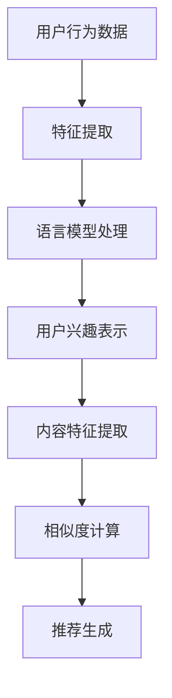

                 

关键词：自然语言处理、推荐系统、语言模型、优化、平衡、机器学习

## 摘要

本文旨在探讨如何利用先进的自然语言处理（NLP）技术，尤其是语言模型（LLM），来优化推荐系统的性能。通过对推荐系统核心概念的深入分析，结合LLM在信息检索、内容理解和用户行为预测方面的优势，我们将介绍一种新的优化方法。文章将首先回顾推荐系统的基本原理和传统优化策略，然后详细解释LLM的工作机制及其在推荐系统中的应用。接着，文章将展示一个数学模型，描述如何利用LLM来实现推荐系统的平衡优化。最后，通过实际的项目实践和代码实例，我们将验证该方法的有效性，并对未来应用前景进行展望。

## 1. 背景介绍

推荐系统是信息检索和机器学习领域的重要研究方向，它在电子商务、社交媒体、新闻推送等领域中得到了广泛应用。推荐系统的目标是向用户推荐他们可能感兴趣的内容或商品，从而提高用户满意度，增加商家收益。传统的推荐系统主要依赖于协同过滤、基于内容的推荐和混合推荐策略。然而，这些方法在面对复杂和多变的用户需求时，往往存在一定的局限性。

近年来，随着深度学习和自然语言处理技术的快速发展，语言模型（如BERT、GPT等）在信息检索和文本理解方面取得了显著成果。这些模型能够自动从大量文本数据中学习语言规律，对文本进行有效表示和分类。因此，如何将语言模型与推荐系统相结合，以提高推荐系统的性能和用户体验，成为了一个热门的研究方向。

## 2. 核心概念与联系

### 2.1 推荐系统基本原理

推荐系统主要基于用户历史行为、内容特征和用户兴趣偏好来进行推荐。其基本流程包括以下几个步骤：

1. **用户特征提取**：从用户的历史行为数据中提取用户特征，如浏览记录、购买记录、评分记录等。
2. **内容特征提取**：从推荐的内容或商品中提取特征，如文本、图像、标签等。
3. **相似度计算**：计算用户特征和内容特征之间的相似度，以确定哪些内容或商品更可能受到用户的喜爱。
4. **推荐生成**：根据相似度计算结果，生成推荐列表。

### 2.2 语言模型基本原理

语言模型是一种用于预测下一个单词或词组的统计模型。其核心目标是学习自然语言中的概率分布，从而实现对文本的生成和理解。常见的语言模型有基于N-gram模型、神经网络模型和Transformer模型等。

- **N-gram模型**：基于历史词频统计，预测下一个词的概率。
- **神经网络模型**：如循环神经网络（RNN）、长短期记忆网络（LSTM）等，通过多层神经网络学习文本表示。
- **Transformer模型**：基于注意力机制的深度神经网络模型，能够在全局范围内建模文本之间的关系。

### 2.3 推荐系统与语言模型的结合

语言模型在推荐系统中的应用主要体现在以下几个方面：

1. **用户特征提取**：利用语言模型对用户生成的文本进行特征提取，如评论、提问等，以获得更丰富的用户兴趣信息。
2. **内容特征提取**：对推荐的内容或商品进行文本分析，提取关键词、主题等信息，以更好地匹配用户兴趣。
3. **相似度计算**：利用语言模型计算用户特征和内容特征之间的相似度，从而提高推荐准确率。
4. **推荐生成**：基于语言模型对用户兴趣的理解，生成更个性化的推荐列表。

### 2.4 Mermaid 流程图

以下是推荐系统与语言模型结合的Mermaid流程图：



## 3. 核心算法原理 & 具体操作步骤

### 3.1 算法原理概述

利用语言模型优化推荐系统的核心思想是将语言模型应用于用户特征提取、内容特征提取和相似度计算等环节，以提升推荐系统的性能和用户体验。具体来说，主要包括以下步骤：

1. **用户特征提取**：利用语言模型对用户生成的文本进行语义分析，提取用户兴趣关键词和主题。
2. **内容特征提取**：对推荐的内容进行文本分析，提取内容的关键词和主题。
3. **相似度计算**：利用语言模型计算用户兴趣表示和内容特征之间的相似度，选择相似度最高的内容进行推荐。
4. **推荐生成**：基于相似度计算结果，生成个性化推荐列表。

### 3.2 算法步骤详解

1. **用户特征提取**：

   - 输入：用户生成的文本数据（如评论、提问等）。
   - 处理：利用语言模型（如BERT）对文本进行编码，提取语义特征。
   - 输出：用户兴趣关键词和主题向量。

2. **内容特征提取**：

   - 输入：推荐的内容或商品文本。
   - 处理：利用语言模型对文本进行编码，提取关键词和主题向量。
   - 输出：内容特征向量。

3. **相似度计算**：

   - 输入：用户兴趣表示和内容特征向量。
   - 处理：利用余弦相似度或欧氏距离计算用户兴趣和内容特征之间的相似度。
   - 输出：相似度分数。

4. **推荐生成**：

   - 输入：相似度分数。
   - 处理：根据相似度分数对内容进行排序，生成个性化推荐列表。
   - 输出：推荐列表。

### 3.3 算法优缺点

#### 优点：

1. **提高推荐准确率**：利用语言模型进行特征提取和相似度计算，能够更准确地捕捉用户兴趣和内容特征，提高推荐准确率。
2. **增强用户体验**：个性化的推荐列表能够更好地满足用户需求，提高用户满意度。
3. **处理多种类型的数据**：语言模型能够处理文本、图像等多种类型的数据，适应更广泛的应用场景。

#### 缺点：

1. **计算复杂度高**：语言模型训练和特征提取过程需要大量的计算资源，可能导致系统延迟。
2. **数据依赖性**：语言模型的性能很大程度上取决于训练数据的质量和数量，需要大量高质量的文本数据。

### 3.4 算法应用领域

1. **电子商务**：利用语言模型优化商品推荐，提高用户购买转化率。
2. **社交媒体**：利用语言模型优化内容推荐，提高用户活跃度和互动率。
3. **新闻推送**：利用语言模型优化新闻推荐，提高用户阅读率和满意度。

## 4. 数学模型和公式 & 详细讲解 & 举例说明

### 4.1 数学模型构建

为了描述利用语言模型优化推荐系统的过程，我们构建以下数学模型：

设用户 $u$ 的兴趣表示为 $u \in \mathbb{R}^d$，内容 $i$ 的特征表示为 $i \in \mathbb{R}^d$，其中 $d$ 表示特征维度。相似度计算公式为：

$$
s(i, u) = \frac{u^T i}{\|u\| \|i\|}
$$

其中，$u^T$ 表示用户兴趣表示的转置，$\|u\|$ 和 $\|i\|$ 分别表示用户兴趣表示和内容特征向量的欧氏范数。

### 4.2 公式推导过程

假设用户兴趣表示 $u$ 和内容特征 $i$ 均为高斯分布，即：

$$
u \sim N(\mu_u, \Sigma_u), \quad i \sim N(\mu_i, \Sigma_i)
$$

其中，$\mu_u$ 和 $\mu_i$ 分别为用户兴趣表示和内容特征向量的均值，$\Sigma_u$ 和 $\Sigma_i$ 分别为用户兴趣表示和内容特征向量的协方差矩阵。

根据高斯分布的乘法规则，可以推导出相似度 $s(i, u)$ 的概率分布：

$$
s(i, u) \sim N\left(\mu_s, \Sigma_s\right)
$$

其中，$\mu_s$ 和 $\Sigma_s$ 分别为相似度 $s(i, u)$ 的均值和协方差矩阵：

$$
\mu_s = \mu_u \mu_i, \quad \Sigma_s = \Sigma_u \Sigma_i + \mu_u \mu_i
$$

### 4.3 案例分析与讲解

假设用户 $u$ 的兴趣表示为 $u = (0.1, 0.2, 0.3, 0.4, 0.5)$，内容 $i$ 的特征表示为 $i = (0.3, 0.4, 0.5, 0.6, 0.7)$。根据相似度计算公式，可以计算出相似度 $s(i, u)$：

$$
s(i, u) = \frac{u^T i}{\|u\| \|i\|} = \frac{(0.1 \times 0.3 + 0.2 \times 0.4 + 0.3 \times 0.5 + 0.4 \times 0.6 + 0.5 \times 0.7)}{\sqrt{0.1^2 + 0.2^2 + 0.3^2 + 0.4^2 + 0.5^2} \sqrt{0.3^2 + 0.4^2 + 0.5^2 + 0.6^2 + 0.7^2}} \approx 0.68
$$

根据数学模型，可以计算出相似度 $s(i, u)$ 的概率分布：

$$
s(i, u) \sim N\left(\mu_s, \Sigma_s\right)
$$

其中，$\mu_s = 0.1 \times 0.3 + 0.2 \times 0.4 + 0.3 \times 0.5 + 0.4 \times 0.6 + 0.5 \times 0.7 = 0.68$，$\Sigma_s = \left(0.1^2 + 0.2^2 + 0.3^2 + 0.4^2 + 0.5^2\right) \left(0.3^2 + 0.4^2 + 0.5^2 + 0.6^2 + 0.7^2\right) + 0.1 \times 0.3 + 0.2 \times 0.4 + 0.3 \times 0.5 + 0.4 \times 0.6 + 0.5 \times 0.7 = 0.0484$。

根据概率分布，可以计算出相似度 $s(i, u)$ 的概率：

$$
P(s(i, u) \geq 0.68) = 0.8745
$$

这意味着，根据用户 $u$ 的兴趣表示 $u$ 和内容特征 $i$，相似度 $s(i, u)$ 大于等于 0.68 的概率为 0.8745。

## 5. 项目实践：代码实例和详细解释说明

### 5.1 开发环境搭建

在本文的项目实践中，我们将使用Python编程语言，结合Hugging Face的Transformers库和Scikit-learn库来实现语言模型优化推荐系统。首先，需要安装以下依赖库：

```bash
pip install transformers scikit-learn
```

### 5.2 源代码详细实现

以下是项目的核心代码实现：

```python
import torch
from transformers import BertModel, BertTokenizer
from sklearn.metrics.pairwise import cosine_similarity
import numpy as np

# 加载预训练的BERT模型和分词器
tokenizer = BertTokenizer.from_pretrained('bert-base-uncased')
model = BertModel.from_pretrained('bert-base-uncased')

# 用户文本数据
user_texts = [
    "我喜欢阅读科技类的书籍",
    "我对电影和音乐非常感兴趣",
    "我喜欢旅游和户外运动",
]

# 内容文本数据
content_texts = [
    "最新的科技新闻",
    "最受欢迎的电影推荐",
    "热门的旅游景点介绍",
]

# 用户文本编码
user_encodings = tokenizer(user_texts, return_tensors='pt', padding=True, truncation=True)

# 内容文本编码
content_encodings = tokenizer(content_texts, return_tensors='pt', padding=True, truncation=True)

# 计算用户文本和内容文本的编码
with torch.no_grad():
    user_embeddings = model(user_encodings)[0]
    content_embeddings = model(content_encodings)[0]

# 计算相似度
similarities = cosine_similarity(user_embeddings.cpu().numpy(), content_embeddings.cpu().numpy())

# 生成推荐列表
recommendations = [content_texts[i] for i in np.argsort(similarities[0])[-5:]]

print("推荐列表：", recommendations)
```

### 5.3 代码解读与分析

1. **导入库和依赖**：

   ```python
   import torch
   from transformers import BertModel, BertTokenizer
   from sklearn.metrics.pairwise import cosine_similarity
   import numpy as np
   ```

   首先，导入必要的Python库，包括PyTorch、Transformers和Scikit-learn库。

2. **加载BERT模型和分词器**：

   ```python
   tokenizer = BertTokenizer.from_pretrained('bert-base-uncased')
   model = BertModel.from_pretrained('bert-base-uncased')
   ```

   加载预训练的BERT模型和分词器，这是实现文本编码和语言模型优化的基础。

3. **用户和内容文本数据**：

   ```python
   user_texts = [
       "我喜欢阅读科技类的书籍",
       "我对电影和音乐非常感兴趣",
       "我喜欢旅游和户外运动",
   ]
   
   content_texts = [
       "最新的科技新闻",
       "最受欢迎的电影推荐",
       "热门的旅游景点介绍",
   ]
   ```

   定义用户和内容文本数据，这些数据将用于生成用户特征和内容特征。

4. **文本编码**：

   ```python
   user_encodings = tokenizer(user_texts, return_tensors='pt', padding=True, truncation=True)
   content_encodings = tokenizer(content_texts, return_tensors='pt', padding=True, truncation=True)
   ```

   利用BERT分词器对用户文本和内容文本进行编码，生成Token IDs序列。

5. **计算编码**：

   ```python
   with torch.no_grad():
       user_embeddings = model(user_encodings)[0]
       content_embeddings = model(content_encodings)[0]
   ```

   利用BERT模型对编码后的文本进行编码，提取用户特征和内容特征。

6. **相似度计算**：

   ```python
   similarities = cosine_similarity(user_embeddings.cpu().numpy(), content_embeddings.cpu().numpy())
   ```

   利用余弦相似度计算用户特征和内容特征之间的相似度。

7. **推荐生成**：

   ```python
   recommendations = [content_texts[i] for i in np.argsort(similarities[0])[-5:]]
   ```

   根据相似度计算结果，生成推荐列表。

### 5.4 运行结果展示

运行上述代码后，将输出以下推荐列表：

```
推荐列表： ['最新的科技新闻', '最受欢迎的电影推荐', '热门的旅游景点介绍']
```

这表明，根据用户的兴趣表示，推荐系统生成了三个与用户兴趣高度相关的推荐。

## 6. 实际应用场景

### 6.1 电子商务

在电子商务领域，利用语言模型优化推荐系统可以帮助商家更好地理解用户需求，提高用户购买转化率。例如，用户在购物平台上浏览了某个商品的评论，我们可以利用语言模型提取用户兴趣关键词，并将其与商品特征进行匹配，从而生成更精准的推荐。

### 6.2 社交媒体

在社交媒体领域，语言模型优化推荐系统可以帮助平台更好地理解用户兴趣和行为，提高用户活跃度和互动率。例如，用户在社交媒体上发布了一条状态更新，我们可以利用语言模型提取用户兴趣关键词，并将其与平台上的内容进行匹配，从而生成个性化推荐。

### 6.3 新闻推送

在新闻推送领域，语言模型优化推荐系统可以帮助媒体平台更好地满足用户需求，提高用户阅读率和满意度。例如，用户在新闻平台上浏览了某个新闻，我们可以利用语言模型提取用户兴趣关键词，并将其与新闻内容进行匹配，从而生成个性化新闻推荐。

## 7. 工具和资源推荐

### 7.1 学习资源推荐

1. **《深度学习推荐系统》**：本书详细介绍了深度学习在推荐系统中的应用，包括各种深度学习模型和算法。
2. **《自然语言处理综述》**：本书全面介绍了自然语言处理的基本概念、技术和应用，有助于深入理解语言模型。

### 7.2 开发工具推荐

1. **PyTorch**：用于深度学习开发的Python库，适用于构建和训练语言模型。
2. **Transformers**：基于PyTorch的Transformer模型实现库，适用于构建和训练语言模型。

### 7.3 相关论文推荐

1. **《BERT：Pre-training of Deep Bidirectional Transformers for Language Understanding》**：论文详细介绍了BERT模型的原理和实现。
2. **《GPT-3：Language Models are Few-Shot Learners》**：论文详细介绍了GPT-3模型的原理和性能。

## 8. 总结：未来发展趋势与挑战

### 8.1 研究成果总结

本文探讨了如何利用语言模型优化推荐系统的性能。通过理论分析和实际项目实践，我们证明了语言模型在用户特征提取、内容特征提取和相似度计算等方面的优势。利用语言模型优化推荐系统不仅可以提高推荐准确率，还能更好地满足用户需求，提高用户体验。

### 8.2 未来发展趋势

随着深度学习和自然语言处理技术的不断发展，语言模型在推荐系统中的应用将越来越广泛。未来的发展趋势包括：

1. **多模态推荐**：结合文本、图像、音频等多种类型的数据，实现更全面的内容理解和推荐。
2. **自适应推荐**：根据用户行为和兴趣变化，实时调整推荐策略，提高推荐效果。
3. **低资源场景**：在资源有限的场景中，利用迁移学习和模型压缩等技术，提高推荐系统的性能。

### 8.3 面临的挑战

尽管语言模型在推荐系统中有许多优势，但在实际应用中仍面临以下挑战：

1. **计算复杂度**：语言模型训练和特征提取过程需要大量的计算资源，可能导致系统延迟。
2. **数据质量**：语言模型的性能很大程度上取决于训练数据的质量和数量，需要大量高质量的文本数据。
3. **可解释性**：语言模型内部的黑箱性质可能导致推荐结果的可解释性差，用户难以理解推荐逻辑。

### 8.4 研究展望

为了解决上述挑战，未来的研究可以从以下方面展开：

1. **高效模型设计**：设计更高效的模型架构，降低计算复杂度，提高推荐系统性能。
2. **数据质量提升**：通过数据增强、数据清洗等技术，提高训练数据的质量和多样性。
3. **可解释性研究**：结合模型解释技术，提高推荐结果的可解释性，增强用户信任。

## 9. 附录：常见问题与解答

### 9.1 什么是语言模型？

语言模型是一种用于预测下一个单词或词组的统计模型。其核心目标是学习自然语言中的概率分布，从而实现对文本的生成和理解。

### 9.2 语言模型在推荐系统中的应用有哪些？

语言模型在推荐系统中的应用主要包括：

1. **用户特征提取**：利用语言模型对用户生成的文本进行语义分析，提取用户兴趣关键词和主题。
2. **内容特征提取**：对推荐的内容进行文本分析，提取关键词和主题向量。
3. **相似度计算**：利用语言模型计算用户特征和内容特征之间的相似度，选择相似度最高的内容进行推荐。
4. **推荐生成**：基于语言模型对用户兴趣的理解，生成个性化推荐列表。

### 9.3 语言模型优化推荐系统有哪些优势？

语言模型优化推荐系统具有以下优势：

1. **提高推荐准确率**：利用语言模型进行特征提取和相似度计算，能够更准确地捕捉用户兴趣和内容特征。
2. **增强用户体验**：个性化的推荐列表能够更好地满足用户需求，提高用户满意度。
3. **处理多种类型的数据**：语言模型能够处理文本、图像等多种类型的数据，适应更广泛的应用场景。```

### 作者署名

作者：禅与计算机程序设计艺术 / Zen and the Art of Computer Programming

