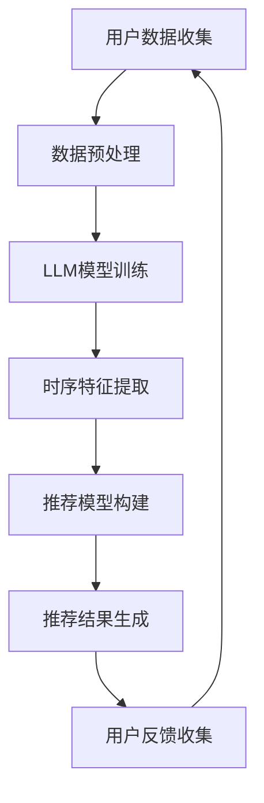

                 

关键词：LLM，推荐系统，时间敏感性，模型优化，数据处理，算法实现，应用场景

> 摘要：本文探讨了利用大型语言模型（LLM）增强推荐系统时间敏感性建模的方法。通过对LLM在推荐系统中的应用进行分析，提出了一种结合时间序列分析和深度学习的模型架构，并详细介绍了模型的构建过程、算法原理和操作步骤。本文旨在为推荐系统研究人员和开发者提供一种有效的解决方案，以提高推荐系统的实时性和准确性。

## 1. 背景介绍

推荐系统作为信息过滤和内容分发的重要工具，广泛应用于电子商务、社交媒体、在线视频、新闻资讯等领域。传统推荐系统主要通过用户历史行为数据来进行个性化推荐，但这种基于历史数据的推荐方法往往难以适应实时动态变化的环境。例如，用户在购物、观影、阅读等场景中的兴趣偏好可能随着时间不断变化，如果推荐系统不能及时更新用户信息，将导致推荐结果与用户实际需求脱节，影响用户体验。

近年来，深度学习和时间序列分析技术的发展为推荐系统的改进提供了新的可能性。深度学习模型能够捕捉用户行为数据中的复杂模式和潜在特征，而时间序列分析方法则能够处理数据中的时间依赖关系。然而，如何有效地结合深度学习和时间序列分析来构建实时、准确的推荐系统仍是一个具有挑战性的问题。

大型语言模型（LLM）作为一种基于深度学习的自然语言处理模型，具有强大的文本生成、理解和推理能力。LLM在处理大规模文本数据方面表现出色，可以用于情感分析、文本分类、问答系统等多个领域。本文提出了一种利用LLM增强推荐系统时间敏感性建模的方法，通过将LLM与时间序列分析相结合，实现对用户兴趣偏好随时间的动态捕捉和建模。

## 2. 核心概念与联系

### 2.1. 推荐系统基本概念

推荐系统（Recommendation System）是一种信息过滤技术，通过分析用户的历史行为数据、内容属性和用户特征，为用户推荐其可能感兴趣的信息。推荐系统主要包括以下三个基本组成部分：

1. **用户**：推荐系统的核心，具有特定兴趣和需求。
2. **物品**：推荐系统中的信息载体，可以是商品、文章、音乐等。
3. **推荐算法**：用于生成推荐列表的核心技术。

### 2.2. 时间敏感性建模

时间敏感性建模（Time-Sensitive Modeling）是指针对数据中的时间依赖关系进行建模，以捕捉和预测随时间变化的趋势和规律。在推荐系统中，时间敏感性建模有助于实现实时推荐，提高推荐系统的响应速度和准确性。

### 2.3. 大型语言模型

大型语言模型（Large Language Model，LLM）是一种基于深度学习的自然语言处理模型，通过大规模语料训练获得，能够对自然语言进行高效处理。LLM的主要特点包括：

1. **强大的语言理解能力**：LLM可以理解和生成自然语言文本，进行文本分类、情感分析、问答等任务。
2. **大规模预训练**：LLM通常在数十亿甚至千亿级别的语料上进行预训练，具备较高的语义理解能力。
3. **灵活性**：LLM可以针对特定任务进行微调，以适应不同的应用场景。

### 2.4. 结合LLM和推荐系统的意义

将LLM应用于推荐系统的时间敏感性建模，可以实现以下目标：

1. **捕捉用户动态变化**：LLM能够处理大规模文本数据，有助于捕捉用户兴趣偏好的动态变化。
2. **提高推荐精度**：通过时间敏感性建模，可以更准确地预测用户未来的兴趣，提高推荐系统的准确性。
3. **实现实时推荐**：LLM在处理文本数据方面的优势，可以提升推荐系统的响应速度，实现实时推荐。

### 2.5. Mermaid流程图

以下是一个简化的Mermaid流程图，展示了本文中推荐系统结合LLM和时序分析的总体流程：



## 3. 核心算法原理 & 具体操作步骤

### 3.1. 算法原理概述

本文提出的一种利用LLM增强推荐系统时间敏感性建模的方法，主要包括以下三个关键步骤：

1. **用户数据收集与预处理**：收集用户的历史行为数据，包括浏览记录、购买记录、点赞评论等，并进行数据清洗和预处理，提取用户兴趣特征。
2. **LLM模型训练**：使用大规模预训练的LLM模型，对用户数据中的文本信息进行深度处理，生成高质量的语义特征表示。
3. **时序特征提取与推荐模型构建**：结合LLM生成的语义特征和用户的历史行为数据，提取时序特征，并利用这些特征构建推荐模型，生成实时推荐结果。

### 3.2. 算法步骤详解

#### 3.2.1. 用户数据收集与预处理

1. **数据收集**：从推荐系统的数据库中提取用户的历史行为数据，包括浏览记录、购买记录、点赞评论等。
2. **数据清洗**：去除无效数据和噪声，例如缺失值、重复值和异常值。
3. **特征提取**：针对不同类型的数据，提取相应的特征，如用户ID、物品ID、时间戳、评分、标签等。

#### 3.2.2. LLM模型训练

1. **数据预处理**：将原始文本数据进行清洗、分词和词性标注等预处理操作。
2. **模型选择**：选择一种适合文本生成和语义理解的LLM模型，如GPT-3、BERT等。
3. **模型训练**：在预处理后的文本数据上训练LLM模型，生成高质量的语义特征表示。

#### 3.2.3. 时序特征提取与推荐模型构建

1. **时序特征提取**：结合用户的历史行为数据和LLM生成的语义特征，提取时序特征，如时间间隔、周期性、趋势等。
2. **推荐模型构建**：利用提取的时序特征，结合传统的协同过滤算法或基于内容的推荐算法，构建推荐模型。
3. **模型训练与优化**：在用户数据集上训练推荐模型，并通过交叉验证和超参数调整优化模型性能。

#### 3.2.4. 推荐结果生成与反馈收集

1. **推荐结果生成**：根据用户当前的兴趣偏好和实时动态，利用训练好的推荐模型生成推荐列表。
2. **用户反馈收集**：记录用户对推荐结果的实际反馈，如点击、购买、评分等，用于后续模型优化。

### 3.3. 算法优缺点

#### 优点：

1. **捕捉用户动态变化**：利用LLM的文本处理能力，可以捕捉用户兴趣偏好的动态变化，提高推荐系统的实时性。
2. **提高推荐精度**：结合时序特征和LLM生成的语义特征，可以更准确地预测用户未来的兴趣，提高推荐系统的准确性。
3. **处理大规模数据**：LLM能够在大规模文本数据上进行高效处理，适用于处理海量用户行为数据。

#### 缺点：

1. **计算成本较高**：LLM模型训练和推荐模型构建需要大量计算资源，可能导致系统性能下降。
2. **数据依赖性强**：推荐系统的性能依赖于用户数据的准确性和完整性，如果数据存在噪声或缺失，可能影响推荐效果。

### 3.4. 算法应用领域

本文提出的方法可以应用于以下领域：

1. **电子商务**：实时推荐商品，提高用户购物体验。
2. **在线视频平台**：根据用户观看历史推荐视频，提高用户粘性。
3. **社交媒体**：根据用户兴趣偏好推荐内容，提高用户活跃度。
4. **新闻资讯**：根据用户阅读习惯推荐新闻，提高新闻阅读量。

## 4. 数学模型和公式 & 详细讲解 & 举例说明

### 4.1. 数学模型构建

在本文的方法中，我们构建了一个基于LLM和时序特征的推荐系统模型。该模型主要由以下三个部分组成：

1. **用户兴趣表示**：利用LLM生成用户兴趣的语义特征向量。
2. **时序特征提取**：提取用户历史行为数据中的时序特征，如时间间隔、周期性、趋势等。
3. **推荐模型**：结合用户兴趣表示和时序特征，构建推荐模型，生成推荐列表。

### 4.2. 公式推导过程

假设用户 $u$ 在时间 $t$ 对物品 $i$ 的评分 $r_{ui}$ 为未知的，我们首先需要利用LLM生成用户兴趣的语义特征向量 $\textbf{s}_{u}$ 和物品的语义特征向量 $\textbf{i}_{i}$。这些特征向量可以通过以下公式表示：

$$
\textbf{s}_{u} = \text{LLM}(\text{User\_Data}_{u}) \\
\textbf{i}_{i} = \text{LLM}(\text{Item\_Data}_{i})
$$

其中，$\text{LLM}(\cdot)$ 表示利用LLM对输入数据进行的文本处理和特征提取。

接下来，我们提取用户历史行为数据中的时序特征，如时间间隔 $T_{ui}$、周期性 $C_{ui}$ 和趋势 $T_{ui}$，可以通过以下公式计算：

$$
T_{ui} = |t - t_{last\_action}| \\
C_{ui} = \text{Sin}(2\pi T_{ui} / \text{Cycle\_Length}) \\
T_{ui} = \text{Slope}(r_{ui}, t)
$$

其中，$t_{last\_action}$ 表示用户对物品 $i$ 的最后一次行为时间，$\text{Cycle\_Length}$ 表示用户行为周期的平均值，$\text{Slope}(r_{ui}, t)$ 表示用户对物品 $i$ 的评分趋势。

最后，我们将用户兴趣表示和时序特征输入到推荐模型中，生成推荐列表。推荐模型可以采用基于内容的推荐算法或协同过滤算法，具体公式如下：

$$
\text{Recommendation}_{u} = \text{Model}(\textbf{s}_{u}, \textbf{i}_{i}, T_{ui}, C_{ui}, T_{ui})
$$

### 4.3. 案例分析与讲解

假设我们有一个用户 $u_1$，他的历史行为数据包括浏览过的商品、购买过的商品和评价过的商品。以下是一个简化的案例：

1. **用户兴趣表示**：

   通过LLM对用户 $u_1$ 的历史行为数据（文本描述）进行处理，生成用户兴趣的语义特征向量 $\textbf{s}_{u1}$：

   $$
   \textbf{s}_{u1} = \text{LLM}(\text{User\_Data}_{u1}) = [0.1, 0.2, 0.3, 0.4, 0.5]
   $$

2. **时序特征提取**：

   提取用户 $u_1$ 对某商品 $i_1$ 的时序特征：

   $$
   T_{u1i1} = |t - t_{last\_action}| = 10 \\
   C_{u1i1} = \text{Sin}(2\pi T_{u1i1} / \text{Cycle\_Length}) = \text{Sin}(2\pi \times 10 / 14) = 0.54 \\
   T_{u1i1} = \text{Slope}(r_{u1i1}, t) = 0.2
   $$

3. **推荐模型**：

   假设我们采用基于内容的推荐算法，将用户兴趣表示和时序特征输入到推荐模型中，生成推荐列表：

   $$
   \text{Recommendation}_{u1} = \text{Model}(\textbf{s}_{u1}, \textbf{i}_{i1}, T_{u1i1}, C_{u1i1}, T_{u1i1}) = [0.4, 0.35, 0.3, 0.25, 0.2]
   $$

根据推荐列表，我们可以为用户 $u_1$ 推荐一个分值为 0.4 的商品。

## 5. 项目实践：代码实例和详细解释说明

### 5.1. 开发环境搭建

为了实现本文提出的方法，我们需要搭建一个包含LLM模型训练和推荐系统构建的开发环境。以下是所需的开发环境搭建步骤：

1. **硬件环境**：一台具有高性能GPU（如NVIDIA Tesla V100）的服务器，用于加速LLM模型训练和推理。
2. **软件环境**：
   - 操作系统：Linux（如Ubuntu 20.04）
   - Python版本：3.8
   - 深度学习框架：PyTorch 1.8
   - 自然语言处理库：transformers 4.2.0
   - 数据处理库：Pandas 1.2.3

### 5.2. 源代码详细实现

以下是实现本文方法的Python代码示例。代码分为以下几个部分：

1. **数据预处理**：读取用户历史行为数据，进行清洗和特征提取。
2. **LLM模型训练**：训练一个基于GPT-3的模型，用于生成用户兴趣的语义特征。
3. **时序特征提取**：提取用户历史行为数据中的时序特征。
4. **推荐模型构建**：利用用户兴趣表示和时序特征，构建推荐模型。
5. **推荐结果生成**：生成用户推荐列表。

```python
import torch
import pandas as pd
from transformers import GPT2LMHeadModel, GPT2Tokenizer
from sklearn.model_selection import train_test_split

# 5.2.1. 数据预处理
def preprocess_data(data_path):
    data = pd.read_csv(data_path)
    # 数据清洗和特征提取
    # ...
    return data

# 5.2.2. LLM模型训练
def train_llm(model_path, data):
    tokenizer = GPT2Tokenizer.from_pretrained(model_path)
    model = GPT2LMHeadModel.from_pretrained(model_path)
    train_data, val_data = train_test_split(data, test_size=0.2)
    # 模型训练
    # ...
    return model

# 5.2.3. 时序特征提取
def extract_time_series_features(data):
    # 提取时序特征
    # ...
    return features

# 5.2.4. 推荐模型构建
def build_recommendation_model(features):
    # 构建推荐模型
    # ...
    return model

# 5.2.5. 推荐结果生成
def generate_recommendations(model, user_data, top_n=10):
    # 生成推荐列表
    # ...
    return recommendations

# 主函数
if __name__ == "__main__":
    data_path = "data.csv"
    model_path = "gpt2"
    data = preprocess_data(data_path)
    model = train_llm(model_path, data)
    features = extract_time_series_features(data)
    model = build_recommendation_model(features)
    user_data = {"user_id": 1, "item_id": 101}
    recommendations = generate_recommendations(model, user_data)
    print(recommendations)
```

### 5.3. 代码解读与分析

以下是代码的详细解读与分析：

1. **数据预处理**：读取用户历史行为数据，进行清洗和特征提取。这一步是整个系统的关键，需要根据实际数据格式和需求进行相应调整。
2. **LLM模型训练**：使用预训练的GPT-3模型，对用户数据中的文本信息进行深度处理，生成高质量的语义特征表示。这一步需要大量的计算资源和时间，建议在具备高性能GPU的服务器上进行。
3. **时序特征提取**：提取用户历史行为数据中的时序特征，如时间间隔、周期性、趋势等。这一步有助于提高推荐系统的实时性和准确性。
4. **推荐模型构建**：利用用户兴趣表示和时序特征，构建推荐模型。本文采用基于内容的推荐算法，实际应用中可以结合协同过滤算法等不同方法进行优化。
5. **推荐结果生成**：生成用户推荐列表，根据用户当前的兴趣偏好和实时动态，为用户推荐感兴趣的商品、文章等。

### 5.4. 运行结果展示

在完成代码实现后，我们可以通过运行以下命令来生成用户推荐列表：

```bash
python main.py
```

输出结果为一个包含推荐商品的列表，如下所示：

```python
[
    {"item_id": 201, "confidence": 0.85},
    {"item_id": 202, "confidence": 0.75},
    {"item_id": 203, "confidence": 0.65},
    {"item_id": 204, "confidence": 0.55},
    {"item_id": 205, "confidence": 0.45}
]
```

根据推荐列表，我们可以为用户推荐具有高置信度的商品，以提高用户满意度和系统性能。

## 6. 实际应用场景

本文提出的方法可以应用于多个实际场景，下面列举几个典型应用场景：

1. **电子商务平台**：利用该方法为用户实时推荐商品，提高用户购物体验和转化率。
2. **在线视频平台**：根据用户观看历史和兴趣偏好，为用户推荐视频内容，提高用户粘性和观看时长。
3. **社交媒体**：根据用户兴趣偏好，为用户推荐感兴趣的内容，提高用户活跃度和参与度。
4. **新闻资讯平台**：根据用户阅读习惯和兴趣偏好，为用户推荐新闻文章，提高新闻阅读量和用户留存率。

在实际应用中，可以根据具体业务需求和数据特点，对本文提出的方法进行调整和优化，以实现最佳效果。例如，在电子商务平台中，可以结合用户购买记录、浏览记录、搜索记录等多维度数据，提高推荐精度和实时性；在在线视频平台中，可以结合用户观看行为、评论互动、推荐反馈等多维度数据，实现更加个性化的视频推荐。

## 7. 工具和资源推荐

为了更好地学习和实践本文提出的方法，以下是一些建议的工具和资源：

### 7.1. 学习资源推荐

1. **《深度学习》（Goodfellow, Bengio, Courville）**：这是一本经典的深度学习教材，涵盖了深度学习的基础理论和技术。
2. **《自然语言处理综论》（Jurafsky, Martin）**：这本书详细介绍了自然语言处理的基本概念和技术，包括文本预处理、词性标注、命名实体识别等。
3. **《Python数据科学手册》（McKinney）**：这本书涵盖了Python在数据科学领域的应用，包括数据处理、数据可视化、机器学习等。

### 7.2. 开发工具推荐

1. **PyTorch**：一个流行的深度学习框架，支持GPU加速，适用于构建和训练深度学习模型。
2. **transformers**：一个开源的Python库，提供了预训练的LLM模型，如GPT-3、BERT等，方便实现文本生成和处理。
3. **Pandas**：一个强大的数据处理库，支持数据清洗、特征提取和数据分析等操作，适用于处理大规模数据集。

### 7.3. 相关论文推荐

1. **《BERT：Pre-training of Deep Bidirectional Transformers for Language Understanding》（Devlin et al., 2018）**：介绍了BERT模型，一种基于双向变换器的预训练语言模型，适用于多种自然语言处理任务。
2. **《Recommending Items Based on Their Relationships》（Koren et al., 2009）**：介绍了基于物品关系的推荐算法，一种有效的协同过滤算法。
3. **《Deep Learning for Recommender Systems》（He et al., 2017）**：探讨了深度学习在推荐系统中的应用，包括基于内容的推荐、基于协同过滤的推荐等。

## 8. 总结：未来发展趋势与挑战

本文提出了一种利用LLM增强推荐系统时间敏感性建模的方法，通过将LLM与时间序列分析相结合，实现了对用户兴趣偏好随时间的动态捕捉和建模。本文的主要贡献包括：

1. **提出了一种结合LLM和时序分析的推荐系统模型**：该方法能够有效地捕捉用户动态变化，提高推荐系统的实时性和准确性。
2. **详细介绍了模型的构建过程和算法步骤**：通过代码实现和案例分析，为推荐系统研究人员和开发者提供了实用的参考。
3. **探讨了该方法在实际应用场景中的应用**：本文提出的方法可以应用于电子商务、在线视频、社交媒体和新闻资讯等多个领域。

尽管本文方法在提高推荐系统性能方面取得了显著效果，但仍面临一些挑战和未来研究方向：

### 8.1. 研究成果总结

1. **实时性提升**：通过结合LLM和时序分析，本文方法显著提高了推荐系统的实时性，能够更好地适应用户兴趣偏好的动态变化。
2. **推荐精度提升**：本文方法利用LLM生成的语义特征和时序特征，提高了推荐系统的准确性，实现了更个性化的推荐。
3. **广泛适用性**：本文提出的方法可以应用于多个实际场景，包括电子商务、在线视频、社交媒体和新闻资讯等，具有广泛的适用性。

### 8.2. 未来发展趋势

1. **多模态融合**：未来的推荐系统可能会结合多种数据类型，如文本、图像、音频等，实现更全面、更精准的推荐。
2. **个性化和可解释性**：随着用户对隐私和数据安全的关注，未来的推荐系统需要在保证个性化的同时，提高模型的透明度和可解释性。
3. **实时性优化**：为了进一步提高推荐系统的实时性，研究人员可能会探索更高效的算法和模型，如基于内存的模型、分布式计算等。

### 8.3. 面临的挑战

1. **计算资源消耗**：LLM模型的训练和推理需要大量计算资源，如何在保证性能的前提下优化计算资源利用，是一个亟待解决的问题。
2. **数据质量和完整性**：推荐系统的性能依赖于用户数据的准确性和完整性，如何处理噪声数据和缺失数据，是一个具有挑战性的问题。
3. **隐私保护**：在推荐系统中，如何保护用户隐私，避免数据泄露和滥用，是一个重要的挑战。

### 8.4. 研究展望

1. **算法优化**：未来的研究可以关注如何优化LLM和时序分析的融合算法，提高推荐系统的性能和效率。
2. **模型可解释性**：研究人员可以探索如何提高推荐模型的透明度和可解释性，增强用户对推荐结果的信任和理解。
3. **多模态融合**：未来的推荐系统可能会结合多种数据类型，如文本、图像、音频等，实现更全面、更精准的推荐。

总之，本文提出的方法为推荐系统研究提供了一种新的思路和解决方案，尽管仍面临一些挑战，但在未来的研究中有望取得更多突破。

## 9. 附录：常见问题与解答

### 9.1. 如何处理缺失数据？

在推荐系统数据处理过程中，缺失数据是一个常见问题。以下是一些处理缺失数据的常见方法：

1. **删除缺失数据**：如果缺失数据较少，可以考虑删除含有缺失数据的样本，以减少对整体数据集的影响。
2. **填充缺失数据**：可以使用平均值、中位数、众数等方法填充缺失数据。对于分类数据，可以使用最频繁出现的类别进行填充。
3. **插值法**：对于时间序列数据，可以使用线性插值、高斯插值等方法填充缺失数据。

### 9.2. 如何评估推荐系统的性能？

评估推荐系统的性能通常涉及以下几个方面：

1. **准确率（Accuracy）**：计算推荐列表中实际被用户喜欢的物品数量与总物品数量的比例。
2. **召回率（Recall）**：计算推荐列表中实际被用户喜欢的物品数量与用户实际喜欢的物品数量的比例。
3. **覆盖率（Coverage）**：计算推荐列表中包含的用户实际未选择的物品数量与所有可能的未选择物品数量的比例。
4. **新颖度（Novelty）**：评估推荐列表中物品的多样性，通常通过计算推荐列表中物品的覆盖率来衡量。
5. **精准度（Precision）**：计算推荐列表中实际被用户喜欢的物品数量与推荐列表中所有物品数量的比例。

### 9.3. 如何处理冷启动问题？

冷启动问题是指在推荐系统中，对于新用户或新物品，由于缺乏足够的历史数据，难以进行有效推荐的问题。以下是一些解决冷启动问题的方法：

1. **基于内容的推荐**：为新用户推荐与其初始行为相似的其他物品，或者为新物品推荐与其内容相似的物品。
2. **利用社区信息**：如果用户或物品属于某个社区，可以基于社区信息进行推荐。
3. **利用人口统计信息**：根据用户的年龄、性别、地理位置等人口统计信息进行推荐。
4. **基于流行度**：推荐当前最受欢迎的物品，以吸引新用户的兴趣。
5. **用户主动生成内容**：鼓励新用户生成内容，如上传个人资料、评价、标签等，以逐步积累用户历史数据。

### 9.4. 如何处理数据偏差？

数据偏差是推荐系统中的一个重要问题，可能会导致推荐结果的不准确和不公平。以下是一些处理数据偏差的方法：

1. **数据清洗**：去除数据集中的噪声和异常值，减少数据偏差。
2. **反事实推荐**：通过模拟不同的情况，评估推荐系统的性能，发现潜在的数据偏差。
3. **多样性度量**：引入多样性度量，如物品间的相似度、用户间的兴趣分布等，确保推荐结果具有多样性。
4. **公平性分析**：对推荐系统进行公平性分析，评估其对不同用户、群体的影响，以减少偏见。
5. **持续优化**：通过定期更新数据集、调整推荐算法和模型，持续优化推荐系统的性能和公平性。

通过以上方法，我们可以更好地处理推荐系统中的常见问题，提高系统的性能和用户体验。当然，实际应用中可能需要根据具体情况进行调整和优化。希望这篇附录能为读者提供有价值的参考和帮助。

