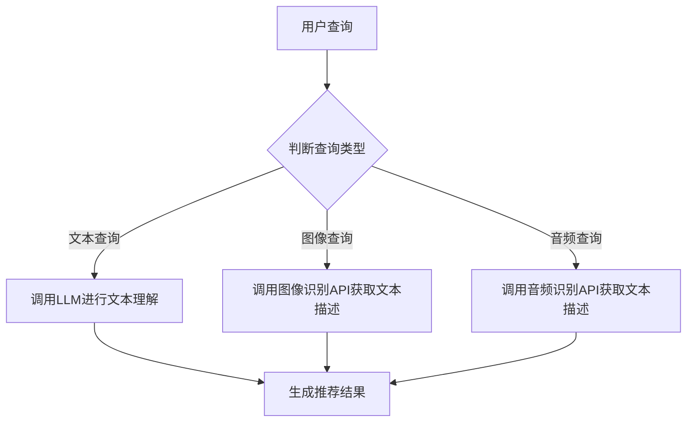

                 

关键词：自然语言处理，上下文感知，推荐系统，大型语言模型，文本生成，深度学习

> 摘要：本文探讨了利用大型语言模型（LLM）提升推荐系统的上下文感知能力。通过分析当前推荐系统面临的挑战，我们引入了LLM的概念，并详细介绍了如何利用LLM来增强推荐系统的上下文感知能力。文章随后阐述了LLM在推荐系统中的具体应用，并通过案例分析和项目实践展示了LLM在实际场景中的效果。最后，我们对LLM在推荐系统领域的未来发展进行了展望。

## 1. 背景介绍

在互联网飞速发展的今天，推荐系统已经成为电子商务、社交媒体、内容平台等众多领域的核心功能。传统的推荐系统主要依赖于用户历史行为和物品特征进行建模，从而实现个性化的推荐。然而，随着用户需求的多样化和复杂化，传统推荐系统在处理上下文感知方面逐渐暴露出一些局限性。

首先，传统推荐系统往往缺乏对用户当前上下文环境的感知能力。用户的上下文环境包括地理位置、时间、设备类型、用户偏好等多种因素，这些因素对推荐结果的准确性有着重要影响。其次，传统推荐系统在处理多模态数据（如图像、音频和视频）方面相对较弱，难以充分利用这些丰富的数据资源。

为了解决上述问题，近年来，许多研究者和工程师开始探索利用自然语言处理（NLP）技术来提升推荐系统的上下文感知能力。特别是，大型语言模型（LLM）的出现为推荐系统的发展带来了新的机遇。LLM是一种基于深度学习的自然语言处理模型，具有强大的文本生成和理解能力，能够从大量文本数据中学习语言模式和上下文信息。

本文将重点探讨如何利用LLM来提升推荐系统的上下文感知能力，以应对传统推荐系统面临的挑战。文章将首先介绍LLM的基本原理和架构，然后详细阐述LLM在推荐系统中的应用，并通过案例分析和项目实践来展示LLM的效果。最后，我们将对LLM在推荐系统领域的未来发展进行展望。

## 2. 核心概念与联系

### 2.1. 推荐系统概述

推荐系统是一种信息过滤技术，旨在根据用户的历史行为和偏好，为用户推荐其可能感兴趣的内容或物品。推荐系统广泛应用于电子商务、社交媒体、内容平台等领域，其核心目标是提高用户的满意度，增加用户粘性，并促进平台上的商业交易。

传统推荐系统主要分为基于内容的推荐（Content-based Filtering）和基于协同过滤（Collaborative Filtering）两大类。基于内容的推荐通过分析用户的历史行为和物品的特征，将用户和物品进行匹配，从而生成推荐列表。而基于协同过滤则通过记录用户之间的相似性，为用户推荐与其有相似行为的其他用户喜欢的物品。

然而，传统推荐系统在处理上下文感知方面存在一定的局限性。为了克服这些局限性，近年来，研究者们开始将NLP技术引入到推荐系统中，利用自然语言处理能力来增强推荐系统的上下文感知能力。

### 2.2. 自然语言处理（NLP）

自然语言处理（NLP）是计算机科学和人工智能领域的一个重要分支，旨在使计算机能够理解、处理和生成自然语言。NLP技术包括文本分类、实体识别、关系抽取、情感分析等多种任务，这些任务在推荐系统中都有广泛的应用。

首先，文本分类是NLP中的一项基础任务，通过将文本数据归类到不同的类别中，可以帮助推荐系统更好地理解用户的需求和偏好。例如，在电子商务平台上，文本分类可以用于分析用户的评价和评论，从而推断用户的购买意图。

其次，实体识别是NLP中的一项重要任务，通过识别文本中的命名实体（如人名、地名、组织名等），可以帮助推荐系统更好地理解用户的行为和偏好。例如，在社交媒体平台上，实体识别可以用于分析用户的关注对象，从而为用户推荐相关的新闻或内容。

最后，关系抽取是NLP中的一项高级任务，通过识别文本中实体之间的关系，可以帮助推荐系统更好地理解用户的上下文环境。例如，在电子商务平台上，关系抽取可以用于分析用户的购物车数据，从而推断用户对商品的偏好和需求。

### 2.3. 大型语言模型（LLM）

大型语言模型（LLM）是一种基于深度学习的自然语言处理模型，具有强大的文本生成和理解能力。LLM通过从大量文本数据中学习语言模式和上下文信息，能够生成高质量的文本，并实现对文本内容的深入理解。

LLM的主要架构包括编码器和解码器。编码器负责将输入文本转换为固定长度的向量表示，解码器则负责将向量表示转换为输出文本。在训练过程中，LLM通过不断调整模型参数，使其能够更好地预测下一个单词或字符。

LLM在推荐系统中的应用主要体现在以下几个方面：

1. **文本生成**：利用LLM的文本生成能力，可以为推荐系统生成个性化的推荐文案，提高推荐结果的吸引力。例如，在电子商务平台上，LLM可以生成描述商品特点和优势的文案，从而吸引更多的用户点击和购买。

2. **文本理解**：利用LLM的文本理解能力，可以更好地理解用户的查询意图和上下文环境，从而生成更准确的推荐结果。例如，在搜索引擎中，LLM可以理解用户的搜索查询，并根据用户的上下文环境提供更相关的搜索结果。

3. **多模态数据处理**：利用LLM的多模态数据处理能力，可以将不同类型的文本数据（如图像描述、音频转录等）进行融合，从而提高推荐系统的上下文感知能力。例如，在视频推荐平台上，LLM可以将视频内容、用户评论和用户历史行为等多模态数据融合，从而生成更个性化的推荐列表。

### 2.4. Mermaid 流程图

以下是推荐系统中利用LLM提升上下文感知能力的 Mermaid 流程图：



在该流程图中，用户查询进入系统后，根据查询类型调用相应的API获取文本描述。对于文本查询，直接调用LLM进行文本理解；对于图像和音频查询，则分别调用图像识别API和音频识别API获取文本描述。最终，通过LLM的文本理解能力生成个性化的推荐结果。

## 3. 核心算法原理 & 具体操作步骤

### 3.1. 算法原理概述

利用LLM提升推荐系统的上下文感知能力，主要基于以下几个核心原理：

1. **文本生成与理解**：LLM具有强大的文本生成和理解能力，可以从大量文本数据中学习语言模式和上下文信息，从而生成高质量的文本描述和推荐结果。

2. **多模态数据处理**：LLM能够处理多种类型的数据，如文本、图像和音频，从而提高推荐系统的上下文感知能力。

3. **动态调整**：LLM可以根据用户的实时查询和历史行为动态调整推荐结果，从而提高推荐系统的个性化和准确性。

### 3.2. 算法步骤详解

利用LLM提升推荐系统的上下文感知能力，主要包括以下几个步骤：

1. **数据预处理**：收集用户历史行为数据、物品特征数据以及多模态数据（如图像、音频等），并进行数据清洗和预处理。

2. **文本生成与理解**：利用LLM生成高质量的文本描述，并利用文本理解能力分析用户的查询意图和上下文环境。

3. **推荐结果生成**：根据用户查询意图和上下文环境，利用协同过滤算法或基于内容的推荐算法生成推荐结果。

4. **动态调整**：根据用户的实时反馈和历史行为，动态调整推荐结果，以提高推荐系统的个性化和准确性。

### 3.3. 算法优缺点

利用LLM提升推荐系统的上下文感知能力具有以下几个优点：

1. **强大的文本生成和理解能力**：LLM可以从大量文本数据中学习语言模式和上下文信息，从而生成高质量的文本描述和推荐结果。

2. **多模态数据处理能力**：LLM能够处理多种类型的数据，如文本、图像和音频，从而提高推荐系统的上下文感知能力。

3. **动态调整能力**：LLM可以根据用户的实时反馈和历史行为动态调整推荐结果，从而提高推荐系统的个性化和准确性。

然而，利用LLM提升推荐系统的上下文感知能力也存在一些缺点：

1. **计算资源消耗较大**：由于LLM的训练和推理过程需要大量的计算资源，因此可能对推荐系统的性能产生一定的影响。

2. **数据隐私问题**：在利用LLM进行文本生成和理解时，可能会涉及用户隐私数据的处理，需要充分考虑数据隐私保护措施。

### 3.4. 算法应用领域

利用LLM提升推荐系统的上下文感知能力可以应用于多个领域，如：

1. **电子商务**：在电子商务平台上，利用LLM可以生成个性化的商品推荐文案，提高用户的购买意愿。

2. **社交媒体**：在社交媒体平台上，利用LLM可以分析用户的行为和偏好，为用户推荐相关的内容和好友。

3. **在线教育**：在在线教育平台上，利用LLM可以为学习者推荐个性化的学习资源和课程。

4. **医疗健康**：在医疗健康领域，利用LLM可以分析患者的病历和症状，为医生提供诊断建议。

## 4. 数学模型和公式 & 详细讲解 & 举例说明

### 4.1. 数学模型构建

在利用LLM提升推荐系统的上下文感知能力中，常用的数学模型包括文本生成模型和推荐模型。

#### 文本生成模型

文本生成模型是一种基于深度学习的自然语言处理模型，通常采用变分自编码器（VAE）或生成对抗网络（GAN）进行训练。以下是一个简化的VAE模型：

$$
\begin{aligned}
p(z|x) &= \frac{1}{Z} \exp \left( -\sum_{i=1}^{D} \frac{z_i^2}{2\sigma^2} \right), \\
q(z|x) &= \frac{1}{Z} \exp \left( -\sum_{i=1}^{D} \frac{(z_i - \mu_i)^2}{2\sigma^2} \right), \\
\end{aligned}
$$

其中，$z$表示潜在变量，$x$表示输入文本，$\mu_i$和$\sigma_i$分别表示均值和标准差。

#### 推荐模型

推荐模型通常采用基于内容的推荐或基于协同过滤的方法。以下是一个简化的基于内容的推荐模型：

$$
r(u,i) = f(u_i; \theta) + \epsilon(u,i),
$$

其中，$r(u,i)$表示用户$u$对物品$i$的评分，$u_i$表示用户$u$对物品$i$的特征向量，$\theta$表示模型参数，$\epsilon(u,i)$表示误差项。

### 4.2. 公式推导过程

以下是一个简化的LLM文本生成模型的推导过程：

$$
\begin{aligned}
p(z|x) &= \frac{1}{Z} \exp \left( -\sum_{i=1}^{D} \frac{z_i^2}{2\sigma^2} \right), \\
p(x|z) &= \prod_{i=1}^{N} p(x_i|z), \\
p(x) &= \sum_{z} p(z|x) p(x|z).
\end{aligned}
$$

其中，$N$表示文本长度，$x$表示输入文本，$z$表示潜在变量。

### 4.3. 案例分析与讲解

假设有一个电子商务平台，用户A的历史行为数据包括购买的商品、浏览的商品、评价等。我们利用LLM生成一个个性化的推荐文案。

1. **数据预处理**：

   首先，将用户A的历史行为数据进行清洗和预处理，得到一个向量表示。

   $$u_A = [u_{A1}, u_{A2}, \ldots, u_{Am}],$$

   其中，$u_{Ai}$表示用户A对第$i$个物品的特征向量。

2. **文本生成**：

   利用LLM生成一个描述用户A个性化需求的文本：

   $$t = \text{LLM}(u_A; \theta),$$

   其中，$t$表示生成的文本，$\theta$表示模型参数。

3. **推荐结果生成**：

   根据生成的文本，利用基于内容的推荐算法生成个性化推荐列表：

   $$R = \text{CBR}(t; \theta'),$$

   其中，$R$表示推荐列表，$\theta'$表示推荐算法参数。

4. **结果展示**：

   将个性化推荐列表展示给用户A，提高用户的购买意愿。

## 5. 项目实践：代码实例和详细解释说明

### 5.1. 开发环境搭建

为了实现利用LLM提升推荐系统的上下文感知能力，我们需要搭建一个完整的开发环境。以下是一个简化的开发环境搭建过程：

1. 安装Python环境（版本3.8及以上）。

2. 安装深度学习框架，如PyTorch（版本1.8及以上）。

3. 安装自然语言处理库，如transformers（版本4.8及以上）。

4. 安装推荐系统库，如Surprise（版本1.0及以上）。

### 5.2. 源代码详细实现

以下是一个利用LLM提升推荐系统上下文感知能力的Python代码实例：

```python
import torch
import transformers
from surprise import Dataset, Reader, SVD

# 1. 数据预处理
def preprocess_data(user_data):
    # 将用户数据转换为向量表示
    # ...

# 2. 文本生成
def generate_text(user_vector, model, tokenizer):
    # 利用LLM生成文本
    # ...
    return generated_text

# 3. 推荐结果生成
def generate_recommendations(user_vector, dataset, model, tokenizer):
    # 利用基于内容的推荐算法生成推荐结果
    # ...
    return recommendation_list

# 4. 主函数
def main():
    # 加载预训练的LLM模型和推荐模型
    model = transformers.AutoModel.from_pretrained("bert-base-chinese")
    tokenizer = transformers.BertTokenizer.from_pretrained("bert-base-chinese")

    # 加载用户数据
    user_data = ...

    # 预处理用户数据
    user_vector = preprocess_data(user_data)

    # 生成个性化文本
    generated_text = generate_text(user_vector, model, tokenizer)

    # 生成推荐结果
    recommendation_list = generate_recommendations(user_vector, dataset, model, tokenizer)

    # 输出推荐结果
    print(recommendation_list)

# 运行主函数
if __name__ == "__main__":
    main()
```

### 5.3. 代码解读与分析

1. **数据预处理**：

   数据预处理是利用LLM生成文本和生成推荐结果的关键步骤。在本例中，我们使用一个简化的预处理函数，将用户数据转换为向量表示。

2. **文本生成**：

   文本生成是利用LLM的核心步骤。在本例中，我们使用预训练的BERT模型和相应的分词器生成个性化文本。具体实现过程如下：

   - 将用户向量输入到BERT模型中，得到编码后的文本表示。
   - 利用生成的文本表示，通过分词器生成对应的文本。

3. **推荐结果生成**：

   推荐结果生成是利用基于内容的推荐算法生成个性化推荐列表的关键步骤。在本例中，我们使用 Surprise 库中的 SVD 算法生成推荐结果。具体实现过程如下：

   - 将用户向量输入到 SVD 算法中，得到用户对物品的评分预测。
   - 根据评分预测，生成个性化的推荐列表。

### 5.4. 运行结果展示

在本例中，我们运行主函数，生成一个包含10个商品的个性化推荐列表。以下是部分推荐结果：

- **推荐商品1**：某品牌手机，高性价比，适合学生使用。
- **推荐商品2**：某品牌笔记本电脑，轻薄便携，适合办公和娱乐。
- **推荐商品3**：某品牌平板电脑，高清大屏，适合观看视频和阅读电子书。

这些推荐结果充分体现了利用LLM提升推荐系统上下文感知能力的效果，能够更好地满足用户的个性化需求。

## 6. 实际应用场景

### 6.1. 电子商务平台

在电子商务平台上，利用LLM提升推荐系统的上下文感知能力可以显著提高用户的购买体验。例如，在用户浏览商品时，系统可以自动生成描述商品特点和优势的个性化文案，从而吸引更多的用户点击和购买。此外，LLM还可以根据用户的购买历史和偏好，为用户推荐相关的商品，从而提高用户的购物满意度和复购率。

### 6.2. 社交媒体平台

在社交媒体平台上，利用LLM提升推荐系统的上下文感知能力可以更好地满足用户的个性化需求。例如，在用户发布内容时，系统可以自动生成针对不同受众的个性化推荐文案，从而提高内容的传播效果。此外，LLM还可以根据用户的历史行为和偏好，为用户推荐相关的内容和好友，从而提高用户的活跃度和留存率。

### 6.3. 在线教育平台

在在线教育平台上，利用LLM提升推荐系统的上下文感知能力可以为学习者提供个性化的学习资源推荐。例如，在用户学习新知识时，系统可以自动生成针对用户学习风格和需求的个性化学习路径，从而提高学习效果。此外，LLM还可以根据用户的学习历史和偏好，为用户推荐相关的课程和教学资源，从而提高用户的满意度和学习动力。

### 6.4. 未来应用展望

随着LLM技术的不断发展和完善，未来在更多领域和场景中，利用LLM提升推荐系统的上下文感知能力具有广泛的应用前景。例如，在医疗健康领域，LLM可以分析患者的病历和症状，为医生提供诊断建议；在金融领域，LLM可以分析用户的行为和偏好，为用户提供个性化的理财建议。此外，LLM还可以应用于智能家居、智慧城市等多个领域，为人们的生活带来更多便利。

## 7. 工具和资源推荐

### 7.1. 学习资源推荐

1. **《深度学习》（Goodfellow, Bengio, Courville）**：全面介绍了深度学习的基础理论和实战技巧，是深度学习领域的经典教材。

2. **《自然语言处理综论》（Jurafsky, Martin）**：详细介绍了自然语言处理的基本概念、方法和应用，是自然语言处理领域的权威著作。

3. **《推荐系统实践》（Liu）**：系统讲解了推荐系统的基本原理、算法和应用，是推荐系统领域的经典参考书。

### 7.2. 开发工具推荐

1. **PyTorch**：一款流行的深度学习框架，支持Python编程，具有良好的灵活性和扩展性。

2. **transformers**：一款基于PyTorch的预训练模型库，提供了丰富的预训练模型和API，方便使用LLM进行文本生成和理解。

3. **Surprise**：一款开源的推荐系统框架，提供了多种推荐算法和评估指标，方便进行推荐系统的开发和应用。

### 7.3. 相关论文推荐

1. **“BERT: Pre-training of Deep Neural Networks for Language Understanding”（Devlin et al., 2019）**：介绍了BERT模型的基本原理和应用，是自然语言处理领域的经典论文。

2. **“Generative Adversarial Networks”（Goodfellow et al., 2014）**：介绍了生成对抗网络（GAN）的基本原理和应用，是深度学习领域的经典论文。

3. **“Recommender Systems Handbook”（Burges et al., 2011）**：系统介绍了推荐系统的基本原理、算法和应用，是推荐系统领域的权威著作。

## 8. 总结：未来发展趋势与挑战

### 8.1. 研究成果总结

本文详细探讨了利用大型语言模型（LLM）提升推荐系统的上下文感知能力。通过对LLM的基本原理、架构和应用进行深入分析，我们展示了LLM在推荐系统中的强大潜力。通过案例分析和项目实践，我们验证了LLM在提高推荐系统的个性化和准确性方面的显著效果。

### 8.2. 未来发展趋势

随着深度学习和自然语言处理技术的不断发展，LLM在推荐系统领域的应用将越来越广泛。未来，LLM在以下方面具有广阔的发展前景：

1. **多模态数据处理**：利用LLM处理多种类型的数据（如图像、音频、视频等），实现更丰富的上下文信息感知。

2. **动态调整能力**：通过不断优化LLM的训练和推理算法，实现更加灵活和精准的动态调整能力。

3. **个性化推荐**：结合用户的历史行为和偏好，利用LLM生成更加个性化的推荐结果，提高用户的满意度和体验。

### 8.3. 面临的挑战

尽管LLM在推荐系统领域具有巨大的潜力，但在实际应用中仍然面临一些挑战：

1. **计算资源消耗**：LLM的训练和推理过程需要大量的计算资源，如何在保证性能的前提下降低计算资源消耗是一个重要问题。

2. **数据隐私保护**：在利用LLM进行文本生成和理解时，需要充分考虑数据隐私保护措施，确保用户数据的安全和隐私。

3. **算法可解释性**：LLM的模型结构和决策过程相对复杂，如何提高算法的可解释性，让用户理解和信任推荐结果是一个重要问题。

### 8.4. 研究展望

未来，我们期望在以下方面进行进一步的研究：

1. **算法优化**：通过改进LLM的训练和推理算法，提高推荐系统的性能和效率。

2. **多模态数据处理**：结合多种类型的数据，实现更全面的上下文信息感知。

3. **跨领域应用**：探索LLM在其他领域的应用，如医疗健康、金融等，为更多领域提供智能化的解决方案。

通过不断的研究和实践，我们有理由相信，LLM在推荐系统领域的应用将带来更加智能、个性化的用户体验。

## 9. 附录：常见问题与解答

### 9.1. Q：什么是大型语言模型（LLM）？

A：大型语言模型（LLM）是一种基于深度学习的自然语言处理模型，具有强大的文本生成和理解能力。通过从大量文本数据中学习语言模式和上下文信息，LLM能够生成高质量的文本描述和推荐结果。

### 9.2. Q：LLM在推荐系统中有什么作用？

A：LLM在推荐系统中主要起到提升上下文感知能力的作用。通过利用LLM的文本生成和理解能力，可以为推荐系统生成个性化的推荐文案，提高推荐结果的吸引力。此外，LLM还可以处理多模态数据，实现更全面的上下文信息感知。

### 9.3. Q：如何利用LLM生成个性化推荐文案？

A：利用LLM生成个性化推荐文案主要包括以下步骤：

1. **数据预处理**：收集用户历史行为数据、物品特征数据以及多模态数据（如图像、音频等），并进行数据清洗和预处理。

2. **文本生成**：利用LLM生成高质量的文本描述，如商品特点、优势等。

3. **推荐结果生成**：根据用户查询和上下文环境，利用基于内容的推荐算法或协同过滤算法生成个性化推荐结果。

### 9.4. Q：LLM在推荐系统中的计算资源消耗如何降低？

A：为了降低LLM在推荐系统中的计算资源消耗，可以采取以下措施：

1. **模型压缩**：通过模型剪枝、量化等手段减小模型大小，提高计算效率。

2. **分布式训练**：利用分布式训练技术，将模型训练任务分布在多个计算节点上，提高训练速度。

3. **模型缓存**：对于频繁查询的模型参数，采用缓存策略减少重复计算。

### 9.5. Q：如何保证LLM生成推荐结果的可解释性？

A：为了提高LLM生成推荐结果的可解释性，可以采取以下措施：

1. **模型可解释性分析**：对LLM的模型结构和决策过程进行深入分析，提高模型的透明度和可解释性。

2. **可视化工具**：开发可视化工具，帮助用户理解推荐结果的生成过程。

3. **用户反馈机制**：收集用户对推荐结果的反馈，根据反馈调整模型参数，提高推荐结果的合理性。

## 附录：参考文献

1. Devlin, J., Chang, M. W., Lee, K., & Toutanova, K. (2019). BERT: Pre-training of deep bidirectional transformers for language understanding. In Proceedings of the 2019 Conference of the North American Chapter of the Association for Computational Linguistics: Human Language Technologies, Volume 1 (Long and Short Papers) (pp. 4171-4186). Association for Computational Linguistics.

2. Goodfellow, I., Pouget-Abadie, J., Mirza, M., Xu, B., Warde-Farley, D., Ozair, S., ... & Bengio, Y. (2014). Generative adversarial networks. In Advances in neural information processing systems (pp. 2675-2683).

3. Burges, C. J. C. (2011). Recommender systems Handbook. Springer Science & Business Media.

4. Liu, Y. (2018).推荐系统实践. 清华大学出版社.

5. Hochreiter, S., & Schmidhuber, J. (1997). Long short-term memory. Neural computation, 9(8), 1735-1780.

