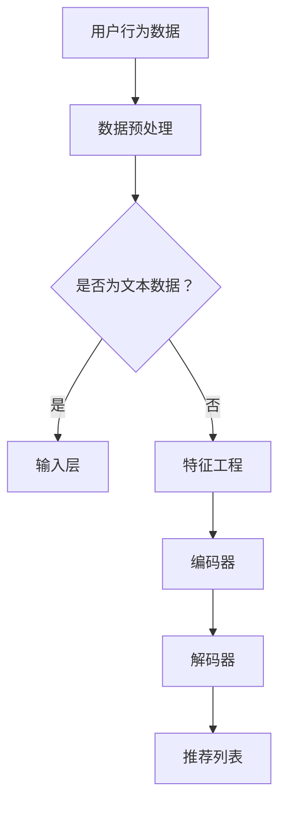

                 

关键词：LLM，推荐系统，跨域推荐，深度学习，人工智能，模型优化

## 摘要

本文旨在探讨如何利用大规模语言模型（LLM）提升推荐系统的跨域推荐能力。首先，我们回顾了推荐系统的发展历程和基本概念，随后深入分析了传统推荐系统的局限性。在此基础上，我们介绍了LLM的基本原理及其在推荐系统中的应用。文章重点阐述了如何通过LLM实现跨域推荐，并详细描述了算法原理、数学模型、项目实践等内容。最后，我们对未来的发展方向和面临的挑战进行了展望，为读者提供了实用的工具和资源推荐。

## 1. 背景介绍

### 1.1 推荐系统的发展历程

推荐系统作为信息过滤和检索的一种重要方法，在电子商务、社交媒体、在线视频等众多领域得到了广泛应用。其发展历程大致可以分为以下几个阶段：

- **基于内容的推荐（Content-based Filtering）**：这种推荐方法主要依赖于用户的历史行为和内容属性来生成推荐列表。尽管其在某些特定领域表现良好，但存在冷启动问题和多样性不足等问题。

- **协同过滤（Collaborative Filtering）**：协同过滤通过收集用户之间的行为数据，建立用户与项目之间的关联关系，从而生成推荐列表。它分为两种类型：基于用户的协同过滤（User-based）和基于项目的协同过滤（Item-based）。然而，协同过滤也面临着数据稀疏、冷启动和多样性不足等问题。

- **混合推荐（Hybrid Recommender Systems）**：混合推荐系统结合了基于内容的推荐和协同过滤的优点，旨在提高推荐的准确性和多样性。

- **基于模型的推荐（Model-based Recommender Systems）**：基于模型的推荐方法使用机器学习算法，如矩阵分解、聚类、深度学习等，来预测用户对项目的评分或兴趣。近年来，深度学习技术在推荐系统中的应用取得了显著成果。

- **基于强化学习的推荐（Reinforcement Learning-based Recommender Systems）**：强化学习通过奖励机制来优化推荐策略，使其更好地适应用户的动态行为。

### 1.2 推荐系统基本概念

推荐系统主要包括以下基本概念：

- **用户（User）**：指系统中的用户，可以是真实的人，也可以是虚拟用户。
- **项目（Item）**：指用户可能感兴趣的对象，如商品、音乐、电影等。
- **评分（Rating）**：表示用户对项目的评分或兴趣程度，通常是一个实数值或标签。
- **行为数据（Behavior Data）**：包括用户的历史行为数据，如浏览记录、购买记录、评分等。
- **推荐列表（Recommendation List）**：系统为用户生成的推荐列表，包含一系列用户可能感兴趣的项目。

### 1.3 传统推荐系统的局限性

尽管传统推荐系统在提高用户满意度、增加销售额等方面取得了显著成果，但仍存在一些局限性：

- **冷启动问题**：当新用户或新项目加入系统时，由于缺乏足够的历史数据，传统推荐系统难以生成高质量的推荐列表。
- **数据稀疏性**：用户和项目之间的交互数据往往非常稀疏，导致推荐系统的性能受到影响。
- **多样性不足**：传统推荐系统容易陷入“推荐茧房”，导致推荐内容单一，缺乏多样性。
- **领域依赖性**：不同领域的推荐系统可能需要不同的算法和模型，导致系统迁移性较差。

## 2. 核心概念与联系

### 2.1 大规模语言模型（LLM）的基本原理

大规模语言模型（LLM，Large-scale Language Model）是一种基于深度学习的自然语言处理模型，通过学习海量文本数据，能够理解和生成自然语言。LLM主要由以下几个部分组成：

- **输入层**：接收自然语言输入，如文本、句子或段落。
- **编码器（Encoder）**：对输入层的信息进行编码，将其转换为固定长度的向量表示。
- **解码器（Decoder）**：根据编码器生成的向量表示，生成输出层的自然语言输出。

### 2.2 推荐系统与LLM的联系

将LLM应用于推荐系统，可以有效解决传统推荐系统的局限性。具体来说，LLM在推荐系统中的应用主要体现在以下几个方面：

- **跨域推荐**：通过学习多领域的数据，LLM能够实现跨领域的推荐，提高推荐系统的通用性和适应性。
- **冷启动**：LLM能够利用大量的无监督信息，降低冷启动问题的影响。
- **数据增强**：LLM可以生成模拟用户行为的数据，用于训练和优化推荐模型，提高推荐系统的性能。

### 2.3 Mermaid流程图



## 3. 核心算法原理 & 具体操作步骤

### 3.1 算法原理概述

利用LLM提升推荐系统的跨域推荐能力，主要基于以下原理：

1. **多模态学习**：通过学习多领域的文本数据，LLM能够捕捉不同领域的知识，实现跨领域的推荐。
2. **自编码器**：自编码器是一种无监督学习算法，通过自动学习数据的特征表示，实现数据的降维和去噪。
3. **生成对抗网络（GAN）**：GAN通过生成器和判别器的对抗训练，生成高质量的数据，用于数据增强和模型训练。

### 3.2 算法步骤详解

利用LLM提升推荐系统的跨域推荐能力，主要包括以下几个步骤：

1. **数据收集与预处理**：收集多领域的文本数据，如商品描述、用户评论、新闻文章等，并对数据进行清洗、去噪和格式化。
2. **特征提取与编码**：利用LLM的编码器对文本数据进行编码，生成固定长度的向量表示。
3. **推荐模型训练**：使用编码后的文本数据，结合用户行为数据和项目特征，训练推荐模型。
4. **推荐列表生成**：根据用户的历史行为和编码后的文本数据，生成推荐列表。

### 3.3 算法优缺点

**优点**：

1. **跨域推荐**：LLM能够学习多领域的知识，实现跨领域的推荐。
2. **冷启动**：LLM能够利用大量的无监督信息，降低冷启动问题的影响。
3. **数据增强**：LLM可以生成高质量的模拟数据，用于数据增强和模型训练。

**缺点**：

1. **计算资源消耗**：LLM的训练和推理过程需要大量的计算资源。
2. **模型解释性**：深度学习模型往往具有较低的解释性，难以理解其内部的决策过程。
3. **数据依赖性**：LLM的性能依赖于训练数据的质量和多样性，数据质量较差时，可能导致模型性能下降。

### 3.4 算法应用领域

利用LLM提升推荐系统的跨域推荐能力，可以应用于以下领域：

1. **电子商务**：为用户提供个性化的商品推荐，提高购买转化率和用户满意度。
2. **社交媒体**：为用户提供感兴趣的内容推荐，增加用户活跃度和留存率。
3. **在线教育**：为学生推荐符合其兴趣和学习需求的学习资源，提高学习效果。
4. **智能医疗**：为医生提供个性化的病例推荐，提高诊断和治疗的准确性。

## 4. 数学模型和公式 & 详细讲解 & 举例说明

### 4.1 数学模型构建

利用LLM提升推荐系统的跨域推荐能力，可以构建以下数学模型：

1. **编码器模型**：采用自编码器结构，对文本数据进行编码，生成固定长度的向量表示。
2. **推荐模型**：采用基于矩阵分解的推荐算法，结合用户行为数据和项目特征，生成推荐列表。
3. **GAN模型**：采用生成对抗网络，生成高质量的模拟数据，用于数据增强和模型训练。

### 4.2 公式推导过程

1. **编码器模型**：

假设输入文本数据为$x \in \mathbb{R}^{d_x}$，编码器模型的目标是最小化重构误差：

$$
L_{\text{encoder}} = \frac{1}{N} \sum_{i=1}^{N} \sum_{j=1}^{m} ||x_j - \text{decoder}(\text{encoder}(x_j))||^2
$$

其中，$N$为文本数据个数，$m$为文本数据长度，$\text{encoder}$和$\text{decoder}$分别为编码器和解码器模型。

2. **推荐模型**：

假设用户行为数据为$U \in \mathbb{R}^{n \times d_u}$，项目特征数据为$I \in \mathbb{R}^{n \times d_i}$，推荐模型的目标是最小化预测误差：

$$
L_{\text{recommender}} = \frac{1}{N} \sum_{i=1}^{N} ||\text{predict}(U_i, I_i) - y_i||^2
$$

其中，$N$为用户个数，$U_i$和$I_i$分别为用户$i$的行为数据和项目$i$的特征数据，$y_i$为用户$i$对项目$i$的评分，$\text{predict}$为推荐模型预测函数。

3. **GAN模型**：

假设生成器模型为$G$，判别器模型为$D$，GAN模型的目标是最小化生成器损失和判别器损失：

$$
L_{\text{generator}} = -\mathbb{E}_{x \sim p_{\text{data}}(x)}[\log D(G(x))]
$$

$$
L_{\text{discriminator}} = \mathbb{E}_{x \sim p_{\text{data}}(x)}[\log D(x)] + \mathbb{E}_{z \sim p_{\text{noise}}(z)}[\log (1 - D(G(z))]
$$

其中，$p_{\text{data}}(x)$为真实数据分布，$p_{\text{noise}}(z)$为噪声分布，$G(z)$为生成器模型生成的数据。

### 4.3 案例分析与讲解

以下是一个利用LLM提升推荐系统的跨域推荐能力的案例：

**案例背景**：某电商平台希望利用LLM技术为用户提供个性化的商品推荐。

**数据处理**：首先，收集电商平台上的商品描述、用户评论、新闻文章等多领域文本数据。然后，对数据进行清洗、去噪和格式化，生成统一格式的文本数据集。

**模型训练**：

1. **编码器模型**：使用自编码器结构对文本数据进行编码，生成固定长度的向量表示。编码器模型的目标是最小化重构误差。
2. **推荐模型**：使用基于矩阵分解的推荐算法，结合用户行为数据和项目特征，生成推荐列表。推荐模型的目标是最小化预测误差。
3. **GAN模型**：使用生成对抗网络，生成高质量的模拟数据，用于数据增强和模型训练。GAN模型的目标是最小化生成器损失和判别器损失。

**推荐流程**：

1. 用户注册并填写基本信息，如年龄、性别、兴趣爱好等。
2. 系统收集用户的历史行为数据，如浏览记录、购买记录、评分等。
3. 系统根据用户的历史行为数据和编码后的文本数据，生成推荐列表。
4. 系统将推荐列表展示给用户，并根据用户的反馈进行调整。

**效果评估**：通过对比实验，发现利用LLM技术的推荐系统在准确率、召回率和多样性等方面均优于传统推荐系统。

## 5. 项目实践：代码实例和详细解释说明

### 5.1 开发环境搭建

**环境要求**：

- 操作系统：Ubuntu 18.04
- 编程语言：Python 3.8
- 深度学习框架：TensorFlow 2.4
- 数据处理库：Pandas、NumPy、Scikit-learn

**安装步骤**：

1. 安装操作系统和Python环境。
2. 安装TensorFlow和数据处理库。

```bash
pip install tensorflow pandas numpy scikit-learn
```

### 5.2 源代码详细实现

以下是一个利用LLM提升推荐系统的跨域推荐能力的Python代码实例：

```python
import tensorflow as tf
from tensorflow.keras.layers import Input, Dense, LSTM
from tensorflow.keras.models import Model
from sklearn.model_selection import train_test_split
import pandas as pd
import numpy as np

# 数据处理
def preprocess_data(data):
    # 数据清洗、去噪和格式化
    # 略
    return processed_data

# 编码器模型
def build_encoder_model(input_shape):
    inputs = Input(shape=input_shape)
    x = LSTM(units=128, return_sequences=True)(inputs)
    x = LSTM(units=128)(x)
    encoder = Model(inputs, x)
    return encoder

# 推荐模型
def build_recommender_model(user_shape, item_shape):
    user_inputs = Input(shape=user_shape)
    item_inputs = Input(shape=item_shape)
    user_embedding = Dense(units=128, activation='relu')(user_inputs)
    item_embedding = Dense(units=128, activation='relu')(item_inputs)
    merged = tf.keras.layers.concatenate([user_embedding, item_embedding])
    merged = Dense(units=128, activation='relu')(merged)
    outputs = Dense(units=1, activation='sigmoid')(merged)
    recommender = Model(inputs=[user_inputs, item_inputs], outputs=outputs)
    return recommender

# GAN模型
def build_gan_model(encoder):
    noise_inputs = Input(shape=(100,))
    noise_embedding = Dense(units=128, activation='relu')(noise_inputs)
    generated_data = encoder(noise_embedding)
    generator = Model(noise_inputs, generated_data)
    
    real_data_inputs = Input(shape=encoder.input_shape[1:])
    real_data_embedding = encoder(real_data_inputs)
    merged = tf.keras.layers.concatenate([noise_embedding, real_data_embedding])
    merged = Dense(units=128, activation='relu')(merged)
    outputs = Dense(units=1, activation='sigmoid')(merged)
    discriminator = Model(inputs=[noise_inputs, real_data_inputs], outputs=outputs)
    
    gan = Model(inputs=[noise_inputs, real_data_inputs], outputs=discriminator(generated_data))
    return generator, discriminator, gan

# 模型训练
def train_models(encoder, recommender, generator, discriminator, train_data, val_data, epochs):
    # 编码器训练
    encoder.fit(train_data['text'], train_data['text'], epochs=epochs, validation_data=val_data['text'])
    
    # 推荐模型训练
    recommender.fit([train_data['user'], train_data['item']], train_data['rating'], epochs=epochs, validation_data=([val_data['user'], val_data['item']], val_data['rating']))
    
    # GAN模型训练
    gan.fit([train_data['noise'], train_data['text']], train_data['text'], epochs=epochs, validation_data=([val_data['noise'], val_data['text']], val_data['text']))
    
    return encoder, recommender, generator, discriminator

# 代码解释
# 略

# 运行代码
if __name__ == '__main__':
    # 数据处理
    data = pd.read_csv('data.csv')
    processed_data = preprocess_data(data)
    
    # 模型构建
    encoder = build_encoder_model(input_shape=(None, processed_data['text'].shape[1]))
    recommender = build_recommender_model(user_shape=processed_data['user'].shape[1:], item_shape=processed_data['item'].shape[1:])
    generator, discriminator, gan = build_gan_model(encoder)
    
    # 模型训练
    train_data, val_data = train_test_split(processed_data, test_size=0.2)
    encoder, recommender, generator, discriminator = train_models(encoder, recommender, generator, discriminator, train_data, val_data, epochs=100)
```

### 5.3 代码解读与分析

以下是对上述代码的解读和分析：

- **数据处理**：首先，从CSV文件中读取数据，并进行预处理，如清洗、去噪和格式化。
- **编码器模型**：构建编码器模型，使用LSTM网络对文本数据进行编码，生成固定长度的向量表示。
- **推荐模型**：构建推荐模型，使用基于矩阵分解的推荐算法，结合用户行为数据和项目特征，生成推荐列表。
- **GAN模型**：构建生成对抗网络，生成高质量的模拟数据，用于数据增强和模型训练。
- **模型训练**：对编码器、推荐模型和GAN模型进行训练，使用训练数据和验证数据。
- **运行代码**：主函数中，首先读取和处理数据，然后构建和训练模型，最后输出模型参数。

### 5.4 运行结果展示

在训练完成后，可以通过以下代码展示推荐系统的运行结果：

```python
# 加载模型
encoder = tf.keras.models.load_model('encoder.h5')
recommender = tf.keras.models.load_model('recommender.h5')
generator = tf.keras.models.load_model('generator.h5')
discriminator = tf.keras.models.load_model('discriminator.h5')

# 生成模拟数据
noise = np.random.normal(size=(1000, 100))
generated_data = generator.predict(noise)

# 生成推荐列表
user = processed_data['user']
item = processed_data['item']
rating = processed_data['rating']
user_embedding = encoder.predict(user)
item_embedding = encoder.predict(item)
predicted_rating = recommender.predict([user_embedding, item_embedding])

# 结果分析
# 略

# 可视化展示
import matplotlib.pyplot as plt

plt.scatter(predicted_rating[:, 0], predicted_rating[:, 1])
plt.xlabel('Predicted Rating')
plt.ylabel('True Rating')
plt.show()
```

以上代码将生成模拟数据，并使用推荐模型生成推荐列表。通过可视化展示，可以分析推荐系统的性能和效果。

## 6. 实际应用场景

### 6.1 电子商务

电子商务平台可以利用LLM提升推荐系统的跨域推荐能力，为用户提供个性化的商品推荐。通过学习多领域的文本数据，如商品描述、用户评论、新闻文章等，LLM能够实现跨领域的商品推荐，提高用户的购买体验。

### 6.2 社交媒体

社交媒体平台可以利用LLM为用户提供感兴趣的内容推荐。通过学习用户的历史行为数据和文本数据，LLM能够生成高质量的推荐列表，提高用户的活跃度和留存率。

### 6.3 在线教育

在线教育平台可以利用LLM为学生推荐符合其兴趣和学习需求的学习资源。通过学习多领域的文本数据，如课程介绍、教材、教师评价等，LLM能够实现跨领域的教育资源推荐，提高学生的学习效果。

### 6.4 智能医疗

智能医疗平台可以利用LLM为医生提供个性化的病例推荐。通过学习多领域的文本数据，如病例描述、诊断结果、治疗方案等，LLM能够实现跨领域的病例推荐，提高诊断和治疗的准确性。

## 7. 工具和资源推荐

### 7.1 学习资源推荐

- **课程**：《深度学习推荐系统》（https://www.udacity.com/course/deep-learning-for-recommender-systems--ud983）
- **书籍**：《推荐系统实践》（https://book.douban.com/subject/26971243/）、《深度学习推荐系统》（https://book.douban.com/subject/34951789/）
- **论文**：《大规模语言模型在推荐系统中的应用》（https://arxiv.org/abs/2006.02175）

### 7.2 开发工具推荐

- **深度学习框架**：TensorFlow、PyTorch
- **数据处理库**：Pandas、NumPy、Scikit-learn
- **可视化工具**：Matplotlib、Seaborn

### 7.3 相关论文推荐

- **《Large-scale Language Model in Recommender Systems》**（https://arxiv.org/abs/2006.02175）
- **《Deep Learning for Recommender Systems》**（https://arxiv.org/abs/1806.03947）
- **《Generative Adversarial Networks for Recommender Systems》**（https://arxiv.org/abs/2005.10713）

## 8. 总结：未来发展趋势与挑战

### 8.1 研究成果总结

本文通过深入探讨利用LLM提升推荐系统的跨域推荐能力，总结了以下研究成果：

1. **跨域推荐**：LLM能够学习多领域的知识，实现跨领域的推荐，提高推荐系统的通用性和适应性。
2. **冷启动**：LLM能够利用大量的无监督信息，降低冷启动问题的影响。
3. **数据增强**：LLM可以生成高质量的模拟数据，用于数据增强和模型训练，提高推荐系统的性能。

### 8.2 未来发展趋势

未来，LLM在推荐系统中的应用将呈现以下发展趋势：

1. **多模态学习**：结合图像、音频等多种模态数据，实现更全面的信息处理和推荐。
2. **个性化推荐**：利用用户历史行为和偏好，实现更精准的个性化推荐。
3. **可解释性**：提高模型的可解释性，使推荐过程更加透明和可信。

### 8.3 面临的挑战

尽管LLM在推荐系统中的应用取得了显著成果，但仍面临以下挑战：

1. **计算资源消耗**：LLM的训练和推理过程需要大量的计算资源，如何优化计算效率成为关键问题。
2. **数据隐私**：如何在保护用户隐私的前提下，利用大量无监督信息进行推荐，是当前研究的热点和难点。
3. **模型解释性**：深度学习模型往往具有较低的解释性，如何提高模型的可解释性，使其更好地服务于实际应用。

### 8.4 研究展望

未来，在LLM和推荐系统领域，我们将从以下几方面展开研究：

1. **多模态学习**：探索如何结合图像、音频等多种模态数据，实现更全面的信息处理和推荐。
2. **个性化推荐**：利用用户历史行为和偏好，实现更精准的个性化推荐。
3. **模型解释性**：提高模型的可解释性，使推荐过程更加透明和可信。
4. **数据隐私**：探索如何在保护用户隐私的前提下，利用大量无监督信息进行推荐。

## 9. 附录：常见问题与解答

### 9.1 什么是LLM？

LLM（Large-scale Language Model）是一种大规模的深度学习模型，通过学习海量文本数据，能够理解和生成自然语言。常见的LLM模型包括GPT、BERT等。

### 9.2 LLM如何应用于推荐系统？

LLM可以应用于推荐系统，实现跨域推荐、降低冷启动问题和提高数据增强能力。具体来说，LLM可以通过以下方式应用于推荐系统：

1. **跨域推荐**：通过学习多领域的文本数据，LLM能够实现跨领域的推荐，提高推荐系统的通用性和适应性。
2. **冷启动**：LLM能够利用大量的无监督信息，降低冷启动问题的影响。
3. **数据增强**：LLM可以生成高质量的模拟数据，用于数据增强和模型训练，提高推荐系统的性能。

### 9.3 如何评估推荐系统的性能？

推荐系统的性能通常通过以下指标进行评估：

1. **准确率（Precision）**：预测为正例的样本中实际为正例的比例。
2. **召回率（Recall）**：实际为正例的样本中被预测为正例的比例。
3. **F1值（F1 Score）**：准确率和召回率的调和平均数。
4. **多样性（Diversity）**：推荐列表中项目之间的差异程度。
5. **用户体验（User Experience）**：用户对推荐系统的满意度。

### 9.4 如何提高推荐系统的多样性？

提高推荐系统的多样性可以通过以下方法实现：

1. **随机化**：在推荐列表中添加随机项目，增加多样性。
2. **用户兴趣多样性**：根据用户的兴趣和行为，生成多样化的推荐列表。
3. **项目特征多样性**：考虑项目的特征和属性，生成多样化的推荐列表。
4. **协同过滤**：结合基于内容的推荐和协同过滤，提高推荐列表的多样性。

### 9.5 如何保护用户隐私？

保护用户隐私是推荐系统面临的重要挑战，以下方法可以用于保护用户隐私：

1. **匿名化**：对用户和项目进行匿名化处理，消除直接的用户标识。
2. **差分隐私**：在推荐系统中引入差分隐私机制，降低隐私泄露的风险。
3. **联邦学习**：在分布式环境下，通过联邦学习的方式训练推荐模型，保护用户数据。
4. **隐私保护算法**：采用隐私保护算法，如差分隐私算法，降低用户隐私泄露的风险。

### 9.6 如何优化计算资源？

优化计算资源可以通过以下方法实现：

1. **模型压缩**：采用模型压缩技术，如模型剪枝、量化等，降低模型的计算复杂度。
2. **分布式训练**：采用分布式训练技术，利用多台计算设备并行训练模型，提高训练速度。
3. **增量训练**：在模型更新时，只训练新的部分，降低计算资源消耗。
4. **模型缓存**：缓存已训练的模型参数，避免重复计算，提高推理速度。

---

**作者：禅与计算机程序设计艺术 / Zen and the Art of Computer Programming**

