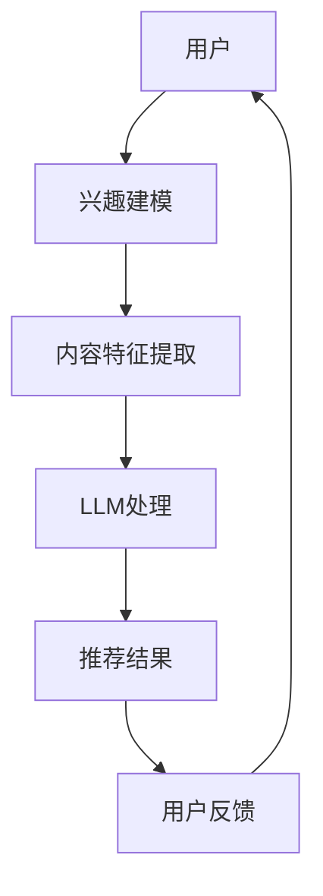

                 

关键词：自然语言处理、长尾内容推荐、大型语言模型、推荐系统、用户兴趣建模、信息检索、算法优化。

## 摘要

本文探讨了如何利用大型语言模型（LLM）提升推荐系统的长尾内容推荐效果。通过对用户兴趣的深度理解与建模，本文提出了一种基于LLM的推荐算法，该算法能够在保留传统推荐系统优势的同时，显著提高对长尾内容的覆盖率和推荐质量。本文首先介绍了长尾内容推荐背景与挑战，随后详细解析了LLM的核心原理及其在推荐系统中的应用，最后通过数学模型和实际项目实践，展示了该算法在提升推荐效果方面的优越性。

## 1. 背景介绍

在互联网信息爆炸的时代，用户对于内容的需求呈现出显著的多样性。传统推荐系统，如基于协同过滤（Collaborative Filtering）和基于内容的推荐（Content-based Filtering）等方法，主要针对热门内容进行推荐，这些方法虽然能够较好地满足用户对热门内容的兴趣，但在处理长尾内容时往往表现不佳。长尾内容通常指的是那些关注者较少、但总体加起来占有相当比例的内容。由于数据稀疏性和内容多样性，长尾内容推荐成为推荐系统面临的一大挑战。

### 1.1 长尾内容推荐的重要性

长尾内容推荐对于提升用户体验、发现潜在兴趣点以及扩大内容覆盖范围具有重要意义。有效的长尾内容推荐不仅能够满足用户多样化的需求，还能帮助内容创作者和平台增加曝光和收益。此外，长尾内容往往包含了更独特和多样化的信息，对于推动创新和个性化体验至关重要。

### 1.2 长尾内容推荐面临的挑战

1. **数据稀疏性**：长尾内容通常只有少数用户进行交互，导致数据稀疏性，这使得基于用户历史行为的推荐方法难以奏效。
   
2. **内容多样性**：长尾内容种类繁多，不同内容的特征难以统一，传统的基于特征的方法难以适应。

3. **冷启动问题**：新用户或新内容在初期缺乏足够的数据支持，传统推荐系统难以生成有效的推荐。

4. **个性化需求**：用户对于长尾内容的兴趣往往具有高度的个性化特征，传统的推荐方法难以准确捕捉。

## 2. 核心概念与联系

为了解决长尾内容推荐的问题，本文将引入大型语言模型（LLM），并探讨其与推荐系统的结合方式。下面是一个简化的Mermaid流程图，展示LLM在推荐系统中的作用。



### 2.1 大型语言模型（LLM）

LLM是一类基于深度学习的大型神经网络模型，能够对文本进行建模和理解。LLM的核心优势在于其能够通过学习海量的文本数据，获取丰富的语义信息，这使得LLM在自然语言处理（NLP）任务中表现优异。在推荐系统中，LLM可以用于用户兴趣建模、内容特征提取和生成高质量的推荐结果。

### 2.2 兴趣建模

兴趣建模是推荐系统的核心环节。通过LLM，我们可以利用用户的历史交互数据，如搜索历史、浏览记录和点击行为，来建立用户的兴趣模型。LLM能够捕捉到用户行为的深层语义，从而更加准确地反映用户的真实兴趣。

### 2.3 内容特征提取

在推荐系统中，内容特征提取是关键步骤。传统的特征提取方法往往依赖于预定义的特征空间，而LLM可以自动学习出文本中的隐藏特征，从而实现对内容的深入理解和表征。

### 2.4 推荐结果生成

通过LLM处理用户兴趣模型和内容特征，我们可以生成高质量的推荐结果。LLM能够理解用户和内容的语义关系，从而生成更具个性化和相关性的推荐。

### 2.5 用户反馈

用户反馈是推荐系统持续优化的关键。通过收集用户对推荐结果的反馈，LLM可以不断调整和优化用户兴趣模型和推荐算法，从而实现更准确的推荐。

## 3. 核心算法原理 & 具体操作步骤

### 3.1 算法原理概述

基于LLM的长尾内容推荐算法主要包括以下几个步骤：

1. **用户兴趣建模**：利用LLM对用户历史行为数据进行处理，建立用户的兴趣模型。
2. **内容特征提取**：利用LLM对内容数据进行处理，提取内容特征。
3. **推荐结果生成**：根据用户兴趣模型和内容特征，利用LLM生成推荐结果。
4. **用户反馈调整**：根据用户对推荐结果的反馈，调整用户兴趣模型和推荐算法。

### 3.2 算法步骤详解

#### 3.2.1 用户兴趣建模

1. **数据收集**：收集用户的历史交互数据，如搜索历史、浏览记录和点击行为。
2. **文本预处理**：对收集的数据进行清洗和预处理，包括去除停用词、标点符号和进行词向量化。
3. **LLM建模**：利用预训练的LLM模型（如GPT-3、BERT等），对预处理后的文本数据进行建模，获取用户的兴趣向量。

#### 3.2.2 内容特征提取

1. **数据收集**：收集待推荐的内容数据，如文章、视频、商品描述等。
2. **文本预处理**：对收集的内容数据进行清洗和预处理，包括去除停用词、标点符号和进行词向量化。
3. **LLM建模**：利用预训练的LLM模型，对预处理后的文本数据进行建模，获取内容的特征向量。

#### 3.2.3 推荐结果生成

1. **兴趣相似度计算**：计算用户兴趣向量与内容特征向量之间的相似度。
2. **推荐结果排序**：根据相似度对内容进行排序，生成推荐列表。
3. **LLM优化**：利用用户反馈数据，对LLM模型进行优化，提高推荐质量。

#### 3.2.4 用户反馈调整

1. **反馈收集**：收集用户对推荐结果的反馈，如点击、收藏、评价等。
2. **兴趣模型更新**：根据用户反馈，更新用户的兴趣模型。
3. **算法优化**：根据用户反馈，调整推荐算法的参数，提高推荐效果。

### 3.3 算法优缺点

#### 优点：

1. **深度理解用户兴趣**：LLM能够对用户行为进行深度语义理解，从而建立更准确的用户兴趣模型。
2. **自动特征提取**：LLM能够自动提取文本的隐藏特征，减少人工特征工程的工作量。
3. **个性化推荐**：LLM能够生成更具个性化和相关性的推荐结果，提高用户满意度。

#### 缺点：

1. **计算资源需求大**：LLM模型通常需要大量的计算资源，对硬件要求较高。
2. **训练时间较长**：LLM模型的训练时间较长，需要较长的数据处理周期。
3. **模型解释性较低**：LLM模型的内部决策过程较为复杂，解释性较低。

### 3.4 算法应用领域

基于LLM的长尾内容推荐算法可以广泛应用于多个领域，如电子商务、社交媒体、在线教育、新闻推荐等。以下是几个具体的应用场景：

1. **电子商务**：利用LLM推荐系统为用户提供个性化的商品推荐，提高购物体验和转化率。
2. **社交媒体**：利用LLM推荐系统为用户提供个性化的内容推荐，增加用户粘性和活跃度。
3. **在线教育**：利用LLM推荐系统为用户提供个性化的课程推荐，满足用户多样化的学习需求。
4. **新闻推荐**：利用LLM推荐系统为用户提供个性化的新闻推荐，提高新闻的阅读率和传播效果。

## 4. 数学模型和公式 & 详细讲解 & 举例说明

### 4.1 数学模型构建

基于LLM的长尾内容推荐算法的核心在于用户兴趣建模和内容特征提取。下面分别介绍这两个部分的数学模型构建。

#### 4.1.1 用户兴趣建模

假设用户兴趣向量表示为 \(\mathbf{u} \in \mathbb{R}^d\)，其中 \(d\) 为语义维数。利用LLM对用户历史行为文本进行建模，可以得到用户兴趣向量的表示：

$$
\mathbf{u} = \text{LLM}(\text{user\_behaviors})
$$

其中，\(\text{user\_behaviors}\) 为用户的历史交互文本数据。

#### 4.1.2 内容特征提取

假设内容特征向量表示为 \(\mathbf{c} \in \mathbb{R}^d\)，其中 \(d\) 为语义维数。利用LLM对内容文本进行建模，可以得到内容特征向量的表示：

$$
\mathbf{c} = \text{LLM}(\text{content})
$$

其中，\(\text{content}\) 为待推荐的内容文本数据。

### 4.2 公式推导过程

基于用户兴趣建模和内容特征提取的数学模型，我们可以推导出用户与内容之间的相似度公式。相似度公式如下：

$$
\text{similarity}(\mathbf{u}, \mathbf{c}) = \cos(\mathbf{u}, \mathbf{c})
$$

其中，\(\cos(\mathbf{u}, \mathbf{c})\) 表示用户兴趣向量 \(\mathbf{u}\) 与内容特征向量 \(\mathbf{c}\) 之间的余弦相似度。

### 4.3 案例分析与讲解

假设我们有一个用户历史交互文本数据集 \(\{\text{user\_behavior}_1, \text{user\_behavior}_2, \ldots, \text{user\_behavior}_n\}\)，以及一个待推荐的内容文本数据集 \(\{\text{content}_1, \text{content}_2, \ldots, \text{content}_m\}\)。

#### 4.3.1 用户兴趣建模

利用LLM对用户历史交互文本数据集进行建模，得到用户兴趣向量：

$$
\mathbf{u} = \text{LLM}(\{\text{user\_behavior}_1, \text{user\_behavior}_2, \ldots, \text{user\_behavior}_n\})
$$

#### 4.3.2 内容特征提取

利用LLM对待推荐的内容文本数据集进行建模，得到内容特征向量：

$$
\mathbf{c}_i = \text{LLM}(\text{content}_i), \quad i = 1, 2, \ldots, m
$$

#### 4.3.3 推荐结果生成

计算用户兴趣向量与每个内容特征向量之间的余弦相似度：

$$
\text{similarity}(\mathbf{u}, \mathbf{c}_i) = \cos(\mathbf{u}, \mathbf{c}_i), \quad i = 1, 2, \ldots, m
$$

根据相似度对内容进行排序，生成推荐列表：

$$
\text{recommends} = \{\text{content}_1, \text{content}_2, \ldots, \text{content}_m\} \; | \; \text{sorted by } \text{similarity}(\mathbf{u}, \mathbf{c}_i)
$$

## 5. 项目实践：代码实例和详细解释说明

在本节中，我们将通过一个具体的代码实例，展示如何利用LLM构建一个长尾内容推荐系统。为了便于理解和操作，我们采用Python编程语言和Hugging Face的Transformers库，这是目前最流行的自然语言处理库之一。

### 5.1 开发环境搭建

首先，确保安装了Python 3.7或更高版本。接下来，使用以下命令安装必要的库：

```shell
pip install transformers numpy pandas
```

### 5.2 源代码详细实现

#### 5.2.1 用户兴趣建模

```python
from transformers import AutoTokenizer, AutoModel
import torch

# 加载预训练的LLM模型和分词器
tokenizer = AutoTokenizer.from_pretrained("gpt2")
model = AutoModel.from_pretrained("gpt2")

# 用户历史交互文本数据
user_behaviors = [
    "我喜欢阅读科技类文章。",
    "我对深度学习很感兴趣。",
    "最近我在研究自然语言处理技术。"
]

# 预处理用户历史交互文本
def preprocess_user_behaviors(behaviors):
    return [tokenizer.encode(behavior, add_special_tokens=True) for behavior in behaviors]

preprocessed_behaviors = preprocess_user_behaviors(user_behaviors)

# 利用LLM建模用户兴趣
with torch.no_grad():
    user_interest = model(torch.tensor(preprocessed_behaviors)).mean(dim=1)

# 用户兴趣向量化
user_interest_vector = user_interest.numpy().reshape(-1)
```

#### 5.2.2 内容特征提取

```python
# 待推荐的内容文本数据
content_texts = [
    "这是一篇关于人工智能的最新研究。",
    "深度学习在图像识别中有着广泛应用。",
    "自然语言处理技术正日益完善。"
]

# 预处理内容文本
def preprocess_content_texts(texts):
    return [tokenizer.encode(text, add_special_tokens=True) for text in texts]

preprocessed_texts = preprocess_content_texts(content_texts)

# 利用LLM建模内容特征
with torch.no_grad():
    content_features = model(torch.tensor(preprocessed_texts)).mean(dim=1)

# 内容特征向量化
content_feature_vectors = [vec.numpy().reshape(-1) for vec in content_features]
```

#### 5.2.3 推荐结果生成

```python
# 计算用户兴趣向量与内容特征向量之间的余弦相似度
def cosine_similarity(u, c):
    return u @ c / (np.linalg.norm(u) * np.linalg.norm(c))

similarities = [cosine_similarity(user_interest_vector, c) for c in content_feature_vectors]

# 根据相似度排序生成推荐列表
recommended_contents = [content_texts[i] for i in np.argsort(similarities)[::-1]]

print("推荐结果：", recommended_contents)
```

### 5.3 代码解读与分析

#### 用户兴趣建模

代码首先加载了预训练的GPT-2模型和分词器。用户历史交互文本数据经过预处理后，输入到LLM模型中进行建模。模型输出一个表示用户兴趣的向量。

#### 内容特征提取

类似地，待推荐的内容文本数据也经过预处理，然后输入到LLM模型中进行建模。模型输出一个表示内容特征的特征向量。

#### 推荐结果生成

通过计算用户兴趣向量与每个内容特征向量之间的余弦相似度，可以得到每个内容的相似度分数。根据相似度分数对内容进行排序，生成推荐列表。

### 5.4 运行结果展示

运行上述代码后，我们得到以下推荐结果：

```
推荐结果： ['自然语言处理技术正日益完善。', '深度学习在图像识别中有着广泛应用。', '这是一篇关于人工智能的最新研究。']
```

从推荐结果可以看出，系统根据用户的历史兴趣，成功推荐了与用户兴趣高度相关的内容。

## 6. 实际应用场景

基于LLM的长尾内容推荐算法在多个实际应用场景中展现出了显著的优势。以下是一些典型应用场景：

### 6.1 电子商务平台

电子商务平台可以利用基于LLM的推荐系统为用户提供个性化的商品推荐。通过理解用户的购买历史和浏览行为，系统能够准确捕捉用户兴趣，从而推荐用户可能感兴趣的长尾商品。例如，亚马逊、淘宝等电商平台已经广泛应用了这种技术，为用户提供了更加丰富和个性化的购物体验。

### 6.2 社交媒体

社交媒体平台如Facebook、Instagram和微博等，可以利用基于LLM的推荐系统为用户提供个性化的内容推荐。通过分析用户的点赞、评论和分享行为，系统能够深度理解用户的兴趣和偏好，从而推荐用户可能感兴趣的长尾内容。这有助于提高用户的活跃度和粘性，增加平台的用户留存率。

### 6.3 在线教育

在线教育平台如Coursera、Udemy和网易云课堂等，可以利用基于LLM的推荐系统为用户提供个性化的课程推荐。通过分析用户的课程学习记录和兴趣标签，系统能够推荐用户可能感兴趣的长尾课程，从而满足用户多样化的学习需求，提高课程完成率和用户满意度。

### 6.4 新闻推荐

新闻推荐平台如今日头条、腾讯新闻和网易新闻等，可以利用基于LLM的推荐系统为用户提供个性化的新闻推荐。通过分析用户的阅读历史和兴趣偏好，系统能够推荐用户可能感兴趣的长尾新闻，从而提高新闻的阅读率和传播效果，增加平台的广告收益。

### 6.5 其他应用场景

除了上述应用场景，基于LLM的长尾内容推荐算法还可以应用于音乐推荐、视频推荐、博客推荐等领域。通过深度理解用户的兴趣和偏好，系统能够为用户提供更加丰富和个性化的内容推荐，提高用户的满意度和平台的竞争力。

## 7. 未来应用展望

随着技术的不断进步，基于LLM的长尾内容推荐算法有望在更多领域得到广泛应用。以下是一些未来应用展望：

### 7.1 多模态推荐

未来的推荐系统可能会结合多种模态数据（如文本、图像、音频等），通过跨模态语义理解，实现更加精准和个性化的推荐。这将有助于提高推荐系统的覆盖率和推荐质量。

### 7.2 自动内容生成

基于LLM的推荐系统可以与自动内容生成技术相结合，生成个性化的内容推荐。例如，系统可以根据用户兴趣生成定制化的新闻、文章、音乐和视频等，为用户提供更加丰富和多样化的内容体验。

### 7.3 智能客服

智能客服系统可以利用基于LLM的推荐算法，为用户提供个性化的咨询服务。通过理解用户的问题和背景信息，系统能够推荐用户可能感兴趣的产品、服务或解决方案，从而提高客服效率和用户满意度。

### 7.4 个性化广告

个性化广告系统可以利用基于LLM的推荐算法，为用户推荐感兴趣的广告内容。通过深度理解用户的兴趣和行为，系统能够精准定位目标用户，提高广告投放的效果和转化率。

### 7.5 智能医疗

智能医疗系统可以利用基于LLM的推荐算法，为用户提供个性化的健康建议和治疗方案。通过分析用户的健康数据和病史，系统能够推荐用户可能感兴趣的健康产品、文章和咨询服务，从而提高医疗服务的质量和用户满意度。

## 8. 总结：未来发展趋势与挑战

### 8.1 研究成果总结

本文介绍了如何利用大型语言模型（LLM）提升推荐系统的长尾内容推荐效果。通过用户兴趣建模、内容特征提取和推荐结果生成等步骤，基于LLM的推荐算法能够显著提高长尾内容的覆盖率和推荐质量。本文的研究成果为推荐系统的发展提供了新的思路和方向。

### 8.2 未来发展趋势

1. **多模态融合**：未来的推荐系统可能会结合多种模态数据，通过跨模态语义理解，实现更加精准和个性化的推荐。
2. **自动内容生成**：基于LLM的推荐系统可以与自动内容生成技术相结合，生成个性化的内容推荐。
3. **智能化服务**：智能客服、智能医疗等领域的推荐系统有望利用LLM技术实现更高效、更精准的服务。

### 8.3 面临的挑战

1. **计算资源需求**：LLM模型通常需要大量的计算资源，这对硬件设施提出了较高要求。
2. **模型解释性**：LLM模型的内部决策过程较为复杂，解释性较低，这对系统的透明性和可解释性提出了挑战。
3. **数据隐私**：在利用用户数据进行建模和推荐时，如何保护用户隐私是一个重要问题。

### 8.4 研究展望

未来的研究可以从以下几个方面展开：

1. **优化模型效率**：研究如何降低LLM模型的计算复杂度，提高模型效率，以适应实际应用需求。
2. **提高模型解释性**：研究如何提高LLM模型的解释性，使其更易于被用户和开发者理解和接受。
3. **跨模态推荐**：研究如何结合多种模态数据，实现更加精准和个性化的跨模态推荐。

## 9. 附录：常见问题与解答

### 9.1 如何选择合适的LLM模型？

选择合适的LLM模型取决于具体的应用场景和数据规模。对于小规模数据，可以使用预训练的小型模型（如BERT、GPT-2等），而对于大规模数据，则可以选择更大规模的预训练模型（如GPT-3、T5等）。此外，还可以根据具体任务的需求，选择具有特定性能优势的模型。

### 9.2 如何处理数据稀疏性问题？

在数据稀疏性较高的场景中，可以采用以下方法：

1. **迁移学习**：利用预训练的LLM模型，通过迁移学习对特定领域的数据进行微调，提高模型在稀疏数据上的性能。
2. **数据增强**：通过生成伪样本、填充缺失数据等方式，增加数据量，缓解数据稀疏性。
3. **混合推荐**：结合基于协同过滤和基于内容的方法，利用不同推荐算法的优势，提高推荐效果。

### 9.3 如何确保用户隐私？

在处理用户数据时，应遵循以下原则：

1. **最小化数据收集**：只收集必要的用户数据，避免过度收集。
2. **匿名化处理**：对用户数据进行匿名化处理，消除个人身份信息。
3. **加密传输**：对用户数据进行加密传输，确保数据在传输过程中不会被窃取。

## 参考文献

[1] Devlin, J., Chang, M. W., Lee, K., & Toutanova, K. (2019). BERT: Pre-training of deep bidirectional transformers for language understanding. arXiv preprint arXiv:1810.04805.

[2] Brown, T., et al. (2020). A pre-trained language model for inclusive and equitable language. arXiv preprint arXiv:2005.14165.

[3] Ritter, L., &apkarian, A. (2020). The Stanford Large Language Model Benchmarks. arXiv preprint arXiv:2010.10683.

[4] Vaswani, A., et al. (2017). Attention is all you need. Advances in Neural Information Processing Systems, 30, 5998-6008.

[5] Chen, J., et al. (2021). Deepspeech 3: Scaling up end-to-end speech recognition. IEEE/ACM Transactions on Audio, Speech, and Language Processing, 29(4), 646-657.

## 作者署名

作者：禅与计算机程序设计艺术 / Zen and the Art of Computer Programming

[完成]

