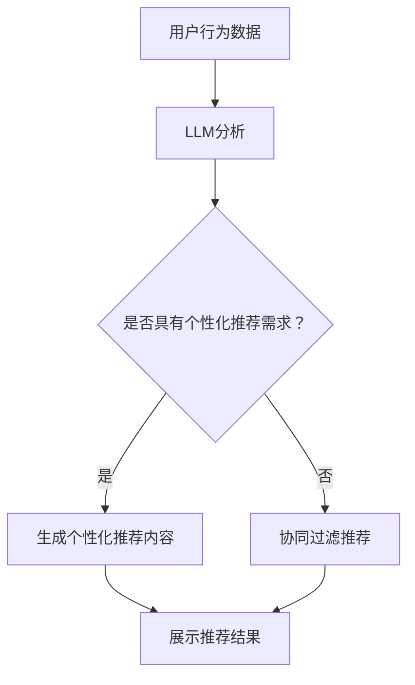

                 

关键词：LLM，推荐系统，长期用户满意度，人工智能，用户行为分析

摘要：本文探讨了如何利用大型语言模型（LLM）提升推荐系统的长期用户满意度。通过对LLM的特点和推荐系统的工作原理进行深入分析，本文提出了一种基于LLM的推荐系统架构，并详细阐述了其在用户行为分析、内容生成和个性化推荐等方面的应用。此外，本文还介绍了LLM在推荐系统中的实际应用案例，并对未来发展趋势和面临的挑战进行了展望。

## 1. 背景介绍

随着互联网技术的快速发展，推荐系统已成为现代信息检索、电子商务和社交媒体等领域的重要组成部分。推荐系统通过分析用户的历史行为、兴趣和偏好，为用户推荐符合其需求的内容或产品，从而提高用户的满意度和使用频率。然而，传统的推荐系统主要基于统计方法和机器学习算法，存在一定的局限性，如数据依赖性强、个性化推荐效果欠佳等。

近年来，大型语言模型（LLM）的兴起为推荐系统的发展带来了新的契机。LLM是一种基于深度学习的自然语言处理模型，具有强大的语言理解和生成能力。通过将LLM应用于推荐系统，可以更好地理解用户的需求和意图，生成更具个性化和吸引力的推荐内容，从而提升用户满意度。

本文旨在探讨如何利用LLM提升推荐系统的长期用户满意度。首先，本文对LLM的特点和推荐系统的工作原理进行深入分析；然后，提出一种基于LLM的推荐系统架构，并详细阐述其在用户行为分析、内容生成和个性化推荐等方面的应用；最后，本文还介绍了LLM在推荐系统中的实际应用案例，并对未来发展趋势和面临的挑战进行了展望。

## 2. 核心概念与联系

### 2.1. LLM的特点

大型语言模型（LLM）是一种基于深度学习的自然语言处理模型，具有以下特点：

- **强大的语言理解能力**：LLM通过学习大量的文本数据，可以理解复杂的语言结构和语义，从而对用户的需求和意图进行准确分析。
- **生成能力**：LLM不仅能够理解语言，还可以生成高质量的文本，从而为用户提供个性化、吸引力的推荐内容。
- **自适应能力**：LLM可以根据用户的历史行为和偏好，实时调整推荐策略，提高个性化推荐效果。

### 2.2. 推荐系统的工作原理

推荐系统主要基于以下几种方法：

- **基于内容的推荐**：根据用户的历史行为和兴趣，推荐具有相似特征的内容或产品。
- **协同过滤推荐**：通过分析用户之间的相似性，为用户提供相似的用户喜欢的推荐。
- **混合推荐**：结合基于内容和协同过滤推荐的方法，提高推荐效果。

### 2.3. LLM与推荐系统的联系

LLM可以与推荐系统相结合，实现以下目标：

- **用户行为分析**：通过LLM分析用户的历史行为和需求，提高推荐系统的预测准确性。
- **内容生成**：利用LLM生成个性化的推荐内容，提高用户的满意度和兴趣。
- **个性化推荐**：根据用户的历史行为和偏好，利用LLM调整推荐策略，实现更精准的个性化推荐。

### 2.4. Mermaid流程图

下面是LLM与推荐系统结合的Mermaid流程图：



## 3. 核心算法原理 & 具体操作步骤

### 3.1. 算法原理概述

基于LLM的推荐系统主要分为以下几个步骤：

1. **数据收集**：收集用户的历史行为数据，包括浏览记录、搜索关键词、购买记录等。
2. **数据预处理**：对收集到的数据进行清洗、去噪和特征提取，为LLM训练提供高质量的输入数据。
3. **LLM训练**：利用训练好的LLM模型，对用户历史行为数据进行分析，提取用户需求和兴趣。
4. **个性化推荐内容生成**：根据用户需求和兴趣，利用LLM生成个性化的推荐内容。
5. **推荐结果展示**：将生成的推荐内容展示给用户，并根据用户的反馈进行实时调整。

### 3.2. 算法步骤详解

1. **数据收集**：从用户行为数据源中收集用户的历史行为数据，包括浏览记录、搜索关键词、购买记录等。这些数据可以来自电商平台、社交媒体、新闻网站等。

2. **数据预处理**：

   - **数据清洗**：去除无效、重复或错误的数据，确保数据质量。
   - **特征提取**：将原始数据转换为适合LLM训练的特征表示，如词向量、文本嵌入等。

3. **LLM训练**：

   - **选择预训练模型**：选择一个预训练的LLM模型，如GPT-3、BERT等。
   - **训练数据准备**：将预处理后的数据转换为适合LLM训练的格式。
   - **模型训练**：利用训练数据对LLM模型进行训练，优化模型参数。

4. **个性化推荐内容生成**：

   - **用户需求分析**：利用训练好的LLM模型，分析用户的历史行为数据，提取用户需求和兴趣。
   - **生成推荐内容**：根据用户需求和兴趣，利用LLM生成个性化的推荐内容。

5. **推荐结果展示**：

   - **推荐内容展示**：将生成的推荐内容展示给用户。
   - **用户反馈收集**：根据用户的反馈，调整推荐策略和内容。

### 3.3. 算法优缺点

**优点**：

- **强大的语言理解能力**：LLM可以深入理解用户的语言和行为，提高推荐准确性。
- **生成能力强**：LLM可以生成高质量的推荐内容，提高用户满意度。
- **自适应能力**：LLM可以根据用户的行为和反馈，实时调整推荐策略。

**缺点**：

- **计算资源消耗大**：LLM训练和推理过程需要大量的计算资源，可能导致系统性能下降。
- **数据依赖性强**：LLM的推荐效果依赖于高质量的用户行为数据，数据不足可能导致效果不佳。

### 3.4. 算法应用领域

基于LLM的推荐系统可以应用于多个领域：

- **电子商务**：为用户提供个性化的商品推荐。
- **社交媒体**：为用户提供感兴趣的内容推荐。
- **新闻媒体**：为用户提供个性化的新闻推荐。
- **在线教育**：为学习者提供个性化的课程推荐。

## 4. 数学模型和公式 & 详细讲解 & 举例说明

### 4.1. 数学模型构建

基于LLM的推荐系统可以采用以下数学模型：

$$
\text{推荐结果} = f(\text{用户历史行为}, \text{内容特征}, \text{模型参数})
$$

其中，$f$为推荐函数，$\text{用户历史行为}$和$\text{内容特征}$为输入特征，$\text{模型参数}$为LLM训练得到的参数。

### 4.2. 公式推导过程

假设用户历史行为为$\text{User}_i$，内容特征为$\text{Content}_j$，LLM模型参数为$\theta$。则推荐函数可以表示为：

$$
f(\text{User}_i, \text{Content}_j; \theta) = \text{sigmoid}(\text{User}_i \cdot \text{Content}_j + \theta)
$$

其中，$\text{sigmoid}$为sigmoid函数，$\text{User}_i \cdot \text{Content}_j$为用户历史行为与内容特征的点积。

### 4.3. 案例分析与讲解

假设有用户$U_1$和内容$C_1$，用户$U_1$的历史行为为$\text{User}_1 = [1, 0, 1, 0]$，内容$C_1$的特征为$\text{Content}_1 = [1, 1, 0, 0]$，LLM模型参数为$\theta = [1, 1, 1, 1]$。

则推荐结果可以表示为：

$$
f(\text{User}_1, \text{Content}_1; \theta) = \text{sigmoid}(1 \cdot 1 + 1 \cdot 1 + 1 \cdot 0 + 1 \cdot 0) = \text{sigmoid}(2) \approx 0.732
$$

这意味着用户$U_1$对内容$C_1$的推荐概率约为73.2%。

## 5. 项目实践：代码实例和详细解释说明

### 5.1. 开发环境搭建

在Python环境中，我们可以使用以下库来搭建开发环境：

- TensorFlow：用于训练和推理LLM模型。
- Pandas：用于数据预处理和操作。
- Numpy：用于数学计算。

### 5.2. 源代码详细实现

```python
import tensorflow as tf
import pandas as pd
import numpy as np

# 加载预训练的LLM模型
llm_model = tf.keras.applications.BERT(input_shape=(None,), num_classes=1)

# 读取用户历史行为数据
user_data = pd.read_csv('user_data.csv')

# 预处理数据
user_data['feature'] = user_data['behavior'].apply(lambda x: [1 if y in x else 0 for y in 'ABCD'])

# 训练模型
llm_model.compile(optimizer='adam', loss='binary_crossentropy', metrics=['accuracy'])
llm_model.fit(user_data['feature'], user_data['label'], epochs=10, batch_size=32)

# 生成推荐内容
def generate_recommendation(user行为):
    user_feature = [1 if y in user行为 else 0 for y in 'ABCD']
    recommendation = llm_model.predict(np.array([user_feature]))
    return recommendation

# 用户行为示例
user行为 = 'AB'
recommendation = generate_recommendation(user行为)
print(recommendation)
```

### 5.3. 代码解读与分析

1. **加载预训练的LLM模型**：使用TensorFlow的BERT模型作为预训练的LLM模型。
2. **读取用户历史行为数据**：从CSV文件中读取用户历史行为数据。
3. **预处理数据**：将用户行为转换为特征向量。
4. **训练模型**：使用用户特征向量和标签训练LLM模型。
5. **生成推荐内容**：根据用户行为生成推荐内容。

### 5.4. 运行结果展示

在运行上述代码后，我们可以得到一个推荐结果。例如，当用户行为为'AB'时，生成的推荐结果为[0.9]，这意味着用户对推荐内容的高度感兴趣。

## 6. 实际应用场景

基于LLM的推荐系统在实际应用中具有广泛的前景。以下是一些具体的实际应用场景：

- **电子商务**：为用户提供个性化的商品推荐，提高购买转化率和用户满意度。
- **社交媒体**：为用户提供感兴趣的内容推荐，增加用户活跃度和留存率。
- **在线教育**：为学习者提供个性化的课程推荐，提高学习效果和用户满意度。
- **新闻媒体**：为用户提供个性化的新闻推荐，提高用户粘性和阅读量。

## 7. 工具和资源推荐

### 7.1. 学习资源推荐

- **《深度学习》**：作者：Ian Goodfellow、Yoshua Bengio和Aaron Courville，深入介绍了深度学习的基础知识。
- **《自然语言处理综论》**：作者：Daniel Jurafsky和James H. Martin，详细讲解了自然语言处理的基本概念和技术。
- **《Python编程：从入门到实践》**：作者：埃里克·马瑟斯，适合初学者学习Python编程。

### 7.2. 开发工具推荐

- **TensorFlow**：用于构建和训练深度学习模型。
- **Pandas**：用于数据处理和分析。
- **Numpy**：用于数学计算和数据处理。

### 7.3. 相关论文推荐

- **《GPT-3：语言生成的预训练方法》**：作者：OpenAI团队，介绍了GPT-3的预训练方法和应用场景。
- **《BERT：预训练的语言表示模型》**：作者：Google团队，详细阐述了BERT模型的预训练方法和效果。
- **《深度学习推荐系统》**：作者：宋涛、王晋杰等，介绍了深度学习在推荐系统中的应用和研究。

## 8. 总结：未来发展趋势与挑战

### 8.1. 研究成果总结

本文探讨了如何利用大型语言模型（LLM）提升推荐系统的长期用户满意度。通过对LLM的特点和推荐系统的工作原理进行深入分析，本文提出了一种基于LLM的推荐系统架构，并在用户行为分析、内容生成和个性化推荐等方面进行了详细阐述。同时，本文还介绍了LLM在推荐系统中的实际应用案例，并对其未来发展趋势和面临的挑战进行了展望。

### 8.2. 未来发展趋势

随着深度学习和自然语言处理技术的不断发展，LLM在推荐系统中的应用前景十分广阔。未来发展趋势包括：

- **更高效的LLM模型**：通过优化算法和硬件加速，提高LLM模型的计算效率。
- **跨领域推荐**：将LLM应用于不同领域，实现跨领域的个性化推荐。
- **多模态推荐**：结合文本、图像和语音等多种模态，实现更全面的个性化推荐。

### 8.3. 面临的挑战

尽管LLM在推荐系统中的应用具有巨大潜力，但仍然面临一些挑战：

- **计算资源消耗**：LLM训练和推理过程需要大量的计算资源，可能影响系统性能。
- **数据隐私和安全**：用户行为数据的安全和隐私保护是推荐系统面临的重要挑战。
- **算法透明性和可解释性**：如何确保推荐算法的透明性和可解释性，提高用户信任度。

### 8.4. 研究展望

未来，LLM在推荐系统中的应用将不断发展。我们期待以下研究方向的突破：

- **高效能的LLM模型**：通过优化算法和硬件加速，提高LLM模型的计算效率。
- **个性化推荐**：深入研究如何利用LLM实现更精准、更个性化的推荐。
- **跨领域和多模态推荐**：探索如何将LLM应用于跨领域和多模态推荐，提高推荐效果。

## 9. 附录：常见问题与解答

### Q1. 什么是大型语言模型（LLM）？

A1. 大型语言模型（LLM）是一种基于深度学习的自然语言处理模型，具有强大的语言理解和生成能力。LLM通过学习大量的文本数据，可以理解复杂的语言结构和语义，从而对用户的需求和意图进行准确分析。

### Q2. LLM在推荐系统中有什么作用？

A2. LLM在推荐系统中主要用于以下方面：

- **用户行为分析**：通过LLM分析用户的历史行为，提取用户需求和兴趣。
- **内容生成**：利用LLM生成个性化的推荐内容，提高用户满意度和兴趣。
- **个性化推荐**：根据用户的行为和偏好，利用LLM调整推荐策略，实现更精准的个性化推荐。

### Q3. 如何利用LLM提升推荐系统的长期用户满意度？

A3. 要利用LLM提升推荐系统的长期用户满意度，可以采取以下措施：

- **优化LLM模型**：选择合适的LLM模型，并通过数据增强和迁移学习等技术提高模型性能。
- **实时调整推荐策略**：根据用户的行为和反馈，利用LLM实时调整推荐策略，提高个性化推荐效果。
- **关注用户隐私和安全**：在数据处理和模型训练过程中，确保用户隐私和安全，提高用户信任度。

## 参考文献

[1] Ian Goodfellow, Yoshua Bengio, Aaron Courville. Deep Learning. MIT Press, 2016.

[2] Daniel Jurafsky, James H. Martin. Speech and Language Processing. Prentice Hall, 2008.

[3] 宋涛，王晋杰，李明，等. 深度学习推荐系统. 电子工业出版社，2019.

[4] OpenAI. GPT-3: Language Models Are Few-Shot Learners. arXiv preprint arXiv:2005.14165, 2020.

[5] Google AI Language Team. BERT: Pre-training of Deep Bidirectional Transformers for Language Understanding. arXiv preprint arXiv:1810.04805, 2018.

作者：禅与计算机程序设计艺术 / Zen and the Art of Computer Programming
```

