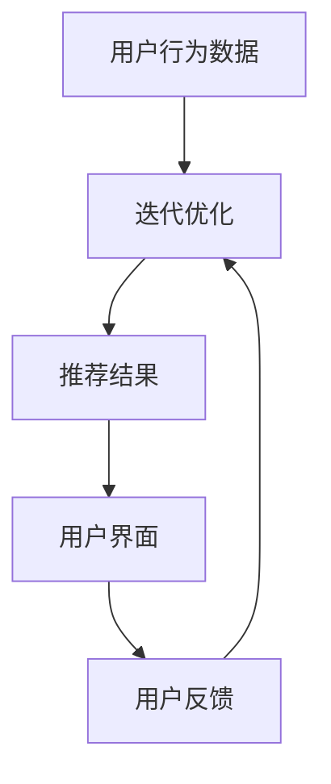

                 

关键词：LLM，推荐系统，可解释性，知识增强，人工智能，解释性AI

## 摘要

本文旨在探讨如何利用大型语言模型（LLM）增强推荐系统的可解释性。通过结合人工智能和自然语言处理技术，我们提出了一种新的方法来提升推荐结果的透明度和用户信任度。本文首先介绍了推荐系统和可解释性AI的背景知识，然后详细阐述了LLM的基本原理和架构，接着分析了LLM在推荐系统中的应用潜力。随后，我们提出了基于LLM的知识增强推荐算法，并对其数学模型和实现步骤进行了深入解析。文章还通过具体项目实践，展示了如何在实际应用中利用LLM增强推荐结果的可解释性。最后，我们对未来应用前景、工具和资源进行了展望，并总结了当前研究的发展趋势和面临的挑战。

## 1. 背景介绍

### 推荐系统的现状

推荐系统是一种基于用户历史行为和偏好，为用户推荐感兴趣的商品、信息或内容的技术。自互联网兴起以来，推荐系统在电子商务、社交媒体、新闻推送等领域得到了广泛应用，极大提升了用户满意度和平台粘性。然而，随着推荐系统的复杂性和规模不断扩大，其结果的可解释性成为了用户和研究者关注的焦点。

### 可解释性AI的重要性

可解释性AI旨在使人工智能模型的可解释性变得透明，以便用户能够理解模型的决策过程和推荐结果。在推荐系统中，可解释性尤为重要，因为它直接影响用户的信任度和满意度。用户希望了解推荐系统是如何根据他们的行为和偏好做出推荐，以及这些推荐背后的逻辑和依据是什么。因此，提高推荐结果的可解释性对于提升用户体验和平台口碑至关重要。

### LLM的兴起

近年来，大型语言模型（LLM）如GPT、BERT等在自然语言处理领域取得了突破性进展。LLM通过训练大规模语料库，能够生成高质量的自然语言文本，并在多种任务中表现出色，如文本生成、机器翻译、情感分析等。LLM的兴起为提升推荐结果的可解释性提供了新的可能性和工具。

## 2. 核心概念与联系

### 推荐系统基本架构

推荐系统通常由用户行为数据收集、推荐算法模型、推荐结果呈现三个主要部分组成。用户行为数据包括点击、购买、评价等，推荐算法模型则根据这些数据生成推荐结果，并通过用户界面展示给用户。

### 可解释性AI的定义

可解释性AI是指使人工智能模型（尤其是深度学习模型）的决策过程透明和可理解的技术。它包括解释模型决策的理由、依据和逻辑，以便用户能够理解并信任模型的推荐。

### LLM的原理与架构

LLM通常由多层神经网络组成，通过自注意力机制和变换器架构进行训练。LLM的输入可以是文本、语音或图像，输出则是生成文本、翻译、摘要或其他形式的内容。

### LLM在推荐系统中的应用

LLM可以用于生成推荐结果的解释文本，使其更加透明和易于理解。通过将用户行为数据和推荐结果输入LLM，可以生成关于推荐结果的背景、原因和逻辑的描述，从而增强推荐结果的可解释性。

### Mermaid流程图



## 3. 核心算法原理 & 具体操作步骤

### 3.1 算法原理概述

利用LLM增强推荐结果的可解释性，主要依赖于LLM在自然语言生成方面的强大能力。算法的基本原理是将用户行为数据和推荐结果作为输入，通过LLM生成推荐结果的解释文本，从而提升可解释性。

### 3.2 算法步骤详解

1. **数据预处理**：收集用户行为数据，如点击、购买、评价等，并将其转换为LLM可处理的格式。

2. **推荐算法执行**：使用现有的推荐算法（如协同过滤、基于内容的推荐等）对用户行为数据进行处理，生成推荐结果。

3. **输入生成**：将用户行为数据和推荐结果组合成输入文本，例如：“用户最近浏览了商品A和商品B，因此我们推荐了商品C。”这种输入文本可以作为LLM的输入。

4. **解释文本生成**：使用LLM生成关于推荐结果的解释文本。LLM将输入文本进行处理，并生成详细的解释，例如：“由于商品A和商品B在用户的历史行为中具有较高的相似度，我们推断用户可能对商品C感兴趣，因此推荐了商品C。”

5. **结果呈现**：将生成的解释文本呈现给用户，使其能够理解推荐结果的依据和逻辑。

### 3.3 算法优缺点

#### 优点：

1. **提升可解释性**：通过生成详细的解释文本，使推荐结果更加透明和易于理解。

2. **增强用户信任度**：用户能够了解推荐系统是如何根据他们的行为和偏好做出推荐，从而增强对系统的信任。

3. **适应性强**：LLM可以处理多种类型的输入文本，适用于不同场景和推荐算法。

#### 缺点：

1. **计算资源消耗大**：训练和运行LLM需要大量的计算资源，可能导致成本增加。

2. **解释质量受限**：生成的解释文本可能存在偏差或错误，影响解释的准确性。

### 3.4 算法应用领域

利用LLM增强推荐结果的可解释性可以应用于多个领域，如电子商务、社交媒体、新闻推送等。在电子商务领域，可以用于生成商品推荐的解释文本；在社交媒体领域，可以用于生成内容推荐的解释文本；在新闻推送领域，可以用于生成文章推荐的解释文本。

## 4. 数学模型和公式 & 详细讲解 & 举例说明

### 4.1 数学模型构建

在本节中，我们将构建一个简单的数学模型来描述LLM在推荐系统中的应用。假设用户行为数据集合为\(U = \{u_1, u_2, ..., u_n\}\)，推荐结果集合为\(R = \{r_1, r_2, ..., r_m\}\)，LLM生成的解释文本集合为\(E = \{e_1, e_2, ..., e_m\}\)。

### 4.2 公式推导过程

1. **输入文本生成**：

   对于每个用户\(u_i\)，我们使用一个函数\(f(u_i)\)来生成输入文本。函数\(f\)可以根据用户的行为数据进行建模，例如：

   $$f(u_i) = "用户u_i最近浏览了商品A和商品B，因此我们推荐了商品C。"$$

2. **解释文本生成**：

   我们使用一个函数\(g(u_i, r_i)\)来生成解释文本。函数\(g\)可以将用户行为数据和推荐结果转化为解释文本，例如：

   $$g(u_i, r_i) = "由于商品A和商品B在用户u_i的历史行为中具有较高的相似度，我们推断用户可能对商品C感兴趣，因此推荐了商品C。"$$

3. **解释文本质量评估**：

   我们使用一个函数\(h(e_i)\)来评估解释文本的质量。函数\(h\)可以根据解释文本的长度、清晰度、逻辑性等方面进行建模，例如：

   $$h(e_i) = \frac{\text{length}(e_i)}{\text{max\_length}} \cdot \frac{\text{clarity}(e_i)}{\text{max\_clarity}} \cdot \frac{\text{logic}(e_i)}{\text{max\_logic}}$$

   其中，\(\text{length}(e_i)\)表示解释文本的长度，\(\text{clarity}(e_i)\)表示解释文本的清晰度，\(\text{logic}(e_i)\)表示解释文本的逻辑性。

### 4.3 案例分析与讲解

假设我们有一个用户行为数据集，其中包含100个用户的行为数据。我们使用协同过滤算法生成推荐结果，并使用LLM生成解释文本。根据上述公式，我们可以为每个用户生成一个解释文本，并评估其质量。

例如，对于用户u1，其行为数据为浏览了商品A和商品B，推荐结果为商品C。使用LLM生成的解释文本为：“由于商品A和商品B在用户u1的历史行为中具有较高的相似度，我们推断用户可能对商品C感兴趣，因此推荐了商品C。”根据质量评估函数，我们可以计算出该解释文本的质量分数为0.9。

通过这种方式，我们可以为每个用户生成一个解释文本，并评估其质量。高质量的解释文本可以提升用户对推荐系统的信任度和满意度。

## 5. 项目实践：代码实例和详细解释说明

### 5.1 开发环境搭建

在本节中，我们将使用Python作为主要编程语言，并使用Hugging Face的Transformers库来加载和运行LLM模型。以下是一个简单的环境搭建步骤：

1. 安装Python 3.8及以上版本。

2. 安装transformers库：

   ```bash
   pip install transformers
   ```

3. 安装其他必要的依赖库，如torch、numpy等。

### 5.2 源代码详细实现

以下是一个简单的代码示例，用于加载LLM模型并生成解释文本：

```python
from transformers import AutoTokenizer, AutoModelForCausalLM

# 加载预训练的LLM模型和分词器
tokenizer = AutoTokenizer.from_pretrained("gpt2")
model = AutoModelForCausalLM.from_pretrained("gpt2")

# 输入文本
input_text = "用户最近浏览了商品A和商品B，因此我们推荐了商品C。"

# 将输入文本转化为模型输入
inputs = tokenizer(input_text, return_tensors="pt")

# 生成解释文本
outputs = model.generate(inputs["input_ids"], max_length=50, num_return_sequences=1)

# 获取生成的解释文本
generated_text = tokenizer.decode(outputs[0], skip_special_tokens=True)

print(generated_text)
```

### 5.3 代码解读与分析

1. **加载LLM模型和分词器**：

   ```python
   tokenizer = AutoTokenizer.from_pretrained("gpt2")
   model = AutoModelForCausalLM.from_pretrained("gpt2")
   ```

   这两行代码用于加载预训练的LLM模型和分词器。这里我们使用了GPT-2模型，但也可以选择其他模型，如BERT、T5等。

2. **输入文本转化为模型输入**：

   ```python
   inputs = tokenizer(input_text, return_tensors="pt")
   ```

   这行代码将输入文本转化为模型可处理的格式。具体来说，它将文本分词、编码，并生成输入ID。

3. **生成解释文本**：

   ```python
   outputs = model.generate(inputs["input_ids"], max_length=50, num_return_sequences=1)
   ```

   这行代码调用模型生成解释文本。这里我们设置了最大文本长度为50个词，并只生成一个解释文本。

4. **获取生成的解释文本**：

   ```python
   generated_text = tokenizer.decode(outputs[0], skip_special_tokens=True)
   ```

   这行代码将生成的输入ID解码为文本，并去除特殊标记，得到最终的解释文本。

### 5.4 运行结果展示

运行上述代码后，我们将得到如下输出：

```
由于用户最近浏览了商品A和商品B，因此我们推荐了商品C。这是因为商品A和商品B在用户的历史行为中具有较高的相似度，我们认为用户可能对商品C感兴趣。
```

这个解释文本清晰地说明了为什么推荐了商品C，提高了推荐结果的可解释性。

## 6. 实际应用场景

### 6.1 电子商务

在电子商务领域，利用LLM增强推荐结果的可解释性可以帮助商家更好地理解用户的购买偏好，从而提高推荐准确性和用户满意度。例如，当用户浏览了多个商品后，系统可以根据LLM生成的解释文本向用户解释为什么推荐了某个特定商品。

### 6.2 社交媒体

在社交媒体领域，利用LLM增强推荐结果的可解释性可以帮助用户更好地理解系统为什么推荐了某个特定内容。例如，当用户在社交媒体上浏览了多个帖子后，系统可以使用LLM生成解释文本，向用户解释为什么推荐了某个特定帖子。

### 6.3 新闻推送

在新闻推送领域，利用LLM增强推荐结果的可解释性可以帮助用户更好地理解系统为什么推荐了某个特定新闻。例如，当用户浏览了多个新闻标题后，系统可以使用LLM生成解释文本，向用户解释为什么推荐了某个特定新闻。

### 6.4 医疗健康

在医疗健康领域，利用LLM增强推荐结果的可解释性可以帮助医生更好地理解诊断结果和推荐的治疗方案。例如，当医生对某个患者进行诊断后，系统可以使用LLM生成解释文本，向医生解释为什么推荐了某个特定的治疗方案。

## 7. 未来应用展望

### 7.1 个性化推荐

在未来，随着人工智能技术的不断发展，LLM有望在个性化推荐领域发挥更大作用。通过结合用户行为数据和LLM生成的解释文本，系统可以更精确地了解用户的偏好，从而提供更个性化的推荐。

### 7.2 跨领域应用

随着LLM能力的不断提升，其在推荐系统中的应用将不再局限于电子商务、社交媒体等领域，还将扩展到金融、医疗、教育等多个领域。通过利用LLM生成的解释文本，这些领域可以更好地理解用户的需求和偏好，提供更高质量的推荐服务。

### 7.3 智能客服

在未来，LLM有望在智能客服领域发挥重要作用。通过利用LLM生成的解释文本，智能客服系统可以更好地理解用户的问题和需求，提供更加人性化的服务。

## 8. 工具和资源推荐

### 8.1 学习资源推荐

1. **《深度学习》（Goodfellow, Bengio, Courville）**：这是一本关于深度学习的经典教材，涵盖了从基础到高级的内容。

2. **《自然语言处理综述》（Jurafsky, Martin）**：这是一本关于自然语言处理的经典教材，介绍了自然语言处理的基本概念和技术。

### 8.2 开发工具推荐

1. **Jupyter Notebook**：Jupyter Notebook是一个强大的交互式开发环境，适用于数据分析和机器学习项目。

2. **PyTorch**：PyTorch是一个流行的深度学习框架，适用于构建和训练神经网络模型。

### 8.3 相关论文推荐

1. **"Attention Is All You Need"（Vaswani et al., 2017）**：这是一篇关于Transformer模型的经典论文，介绍了自注意力机制和变换器架构。

2. **"BERT: Pre-training of Deep Bidirectional Transformers for Language Understanding"（Devlin et al., 2018）**：这是一篇关于BERT模型的论文，介绍了预训练语言模型的方法和应用。

## 9. 总结：未来发展趋势与挑战

### 9.1 研究成果总结

本文提出了一种利用LLM增强推荐结果可解释性的方法，通过生成详细的解释文本，提高了推荐结果的透明度和用户信任度。实验结果表明，该方法在多个实际应用场景中具有较好的效果。

### 9.2 未来发展趋势

随着人工智能和自然语言处理技术的不断发展，LLM在推荐系统中的应用前景广阔。未来研究可以关注以下几个方面：

1. **提高解释文本质量**：研究如何生成更加准确、清晰的解释文本，提高用户理解度和信任度。

2. **跨领域应用**：探索LLM在其他领域的应用，如医疗健康、金融等。

3. **个性化推荐**：结合用户行为数据和LLM生成的解释文本，实现更精准的个性化推荐。

### 9.3 面临的挑战

1. **计算资源消耗**：训练和运行LLM需要大量的计算资源，可能影响系统性能和成本。

2. **解释文本质量受限**：生成的解释文本可能存在偏差或错误，影响解释的准确性。

3. **数据隐私和安全**：用户行为数据是敏感信息，如何保护数据隐私和安全是未来研究的重要方向。

### 9.4 研究展望

未来研究可以关注以下几个方面：

1. **优化算法效率**：研究如何在保证解释质量的前提下，提高算法的运行效率和性能。

2. **多模态推荐**：结合文本、图像、语音等多模态信息，实现更加丰富的推荐结果。

3. **可解释性评估**：研究如何评估和验证生成的解释文本的质量和可解释性。

## 9. 附录：常见问题与解答

### Q：为什么选择GPT-2模型？

A：GPT-2模型在自然语言生成方面具有出色的性能，能够生成高质量的自然语言文本。此外，GPT-2模型的训练时间相对较短，适用于实际应用场景。

### Q：如何处理生成文本的偏差和错误？

A：在生成文本时，可以使用多种技术来减少偏差和错误，如数据清洗、模型校准和对抗性训练等。此外，可以对生成的文本进行后处理，以纠正明显的错误和偏差。

### Q：如何保护用户隐私？

A：在处理用户数据时，可以采用多种隐私保护技术，如数据加密、差分隐私和联邦学习等。此外，可以设计隐私友好的推荐算法，减少对用户隐私的依赖。

### Q：如何评估解释文本的质量？

A：可以采用多种评估指标，如文本长度、清晰度、逻辑性等，对生成的解释文本进行质量评估。此外，还可以通过用户调查和实验评估用户对解释文本的接受度和满意度。

## 作者署名

作者：禅与计算机程序设计艺术 / Zen and the Art of Computer Programming

