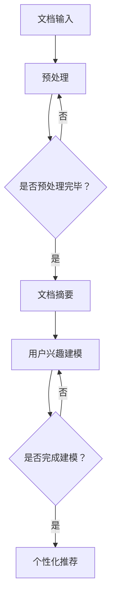

                 

关键词：自然语言处理，语言模型，文档摘要，用户兴趣建模，深度学习，信息检索。

摘要：本文旨在探讨如何利用大规模语言模型（LLM）进行文档摘要与用户兴趣建模。首先，我们将介绍文档摘要与用户兴趣建模的基本概念和重要性。然后，我们将详细解释大规模语言模型的工作原理及其在文档摘要与用户兴趣建模中的应用。接着，我们将讨论核心算法原理、数学模型和具体操作步骤。此外，我们将分享一个代码实例，展示如何利用LLM进行文档摘要与用户兴趣建模。最后，我们将探讨这一技术的实际应用场景、未来应用展望以及面临的挑战。

## 1. 背景介绍

随着互联网的快速发展，信息爆炸已成为一个普遍现象。人们在面对海量的信息时，往往感到不知所措。因此，如何有效地处理和利用这些信息成为一个关键问题。文档摘要与用户兴趣建模技术正是为了解决这一问题而诞生的。

### 1.1 文档摘要

文档摘要是指将原始文档中的关键信息提取出来，以简明扼要的方式呈现给用户。一个好的文档摘要应该具备以下特点：

1. **准确性**：摘要应尽量准确地反映原文的主要内容。
2. **简洁性**：摘要应尽量简洁，避免冗长的描述。
3. **可读性**：摘要应易于理解，使读者能够快速获取信息。

文档摘要技术在信息检索、内容推荐、文本挖掘等领域有着广泛的应用。例如，搜索引擎中的摘要功能可以帮助用户快速了解搜索结果的相关性，提高信息检索效率。

### 1.2 用户兴趣建模

用户兴趣建模是指通过分析用户的行为数据，构建用户兴趣模型，从而为用户提供个性化的信息推荐。用户兴趣建模的关键在于如何有效地从用户行为中提取有价值的信息，并建立与用户兴趣之间的关联。

用户兴趣建模在个性化推荐、广告投放、社交媒体分析等领域有着重要的应用。例如，基于用户兴趣建模的推荐系统可以更好地满足用户的个性化需求，提高用户满意度。

## 2. 核心概念与联系

### 2.1 大规模语言模型

大规模语言模型（LLM）是一种基于深度学习的自然语言处理模型。它通过学习大量文本数据，能够理解并生成自然语言。LLM在文档摘要与用户兴趣建模中具有重要作用。

### 2.2 文档摘要与LLM

LLM在文档摘要中的应用主要体现在以下几个方面：

1. **提取关键信息**：LLM可以通过学习大量文本数据，识别并提取原文中的关键信息，从而生成摘要。
2. **生成摘要文本**：LLM可以基于提取的关键信息，生成简洁、准确、易于理解的摘要文本。

### 2.3 用户兴趣建模与LLM

LLM在用户兴趣建模中的应用主要体现在以下几个方面：

1. **用户行为分析**：LLM可以分析用户在社交媒体、搜索引擎等平台上的行为数据，提取用户兴趣特征。
2. **建立兴趣模型**：LLM可以根据用户兴趣特征，建立用户兴趣模型，从而为用户提供个性化推荐。

### 2.4 Mermaid 流程图

下面是一个用于描述文档摘要与用户兴趣建模的Mermaid流程图。



## 3. 核心算法原理 & 具体操作步骤

### 3.1 算法原理概述

文档摘要与用户兴趣建模的核心算法是基于大规模语言模型（LLM）的深度学习模型。LLM通过学习大量文本数据，能够理解并生成自然语言。在文档摘要中，LLM用于提取关键信息并生成摘要文本；在用户兴趣建模中，LLM用于分析用户行为数据，建立用户兴趣模型。

### 3.2 算法步骤详解

#### 3.2.1 文档摘要

1. **数据预处理**：对原始文档进行分词、去停用词、词向量化等操作。
2. **模型训练**：使用预训练的LLM（如GPT-3）进行微调，使其能够生成符合要求的摘要文本。
3. **摘要生成**：输入原始文档，通过LLM生成摘要文本。

#### 3.2.2 用户兴趣建模

1. **数据预处理**：对用户行为数据进行分词、去停用词、词向量化等操作。
2. **模型训练**：使用预训练的LLM进行微调，使其能够分析用户行为数据，提取用户兴趣特征。
3. **兴趣建模**：根据提取的用户兴趣特征，建立用户兴趣模型。

### 3.3 算法优缺点

#### 优点：

1. **准确性**：LLM能够通过学习大量文本数据，生成准确、简洁的摘要文本。
2. **灵活性**：LLM可以根据不同的应用场景进行微调，适用于多种场景。
3. **高效性**：LLM具有高效的处理速度，能够快速生成摘要和建立用户兴趣模型。

#### 缺点：

1. **计算资源需求**：LLM的训练和推理需要大量的计算资源。
2. **数据依赖性**：LLM的性能受到训练数据的影响，数据质量对模型效果有重要影响。
3. **隐私问题**：用户行为数据涉及到用户隐私，如何保护用户隐私是一个重要问题。

### 3.4 算法应用领域

文档摘要与用户兴趣建模技术在多个领域有着广泛的应用：

1. **信息检索**：通过生成准确的文档摘要，提高信息检索的效率。
2. **内容推荐**：通过建立用户兴趣模型，为用户提供个性化的内容推荐。
3. **社交媒体分析**：通过分析用户行为数据，挖掘用户兴趣，用于广告投放、社交媒体分析等。
4. **教育领域**：通过生成文档摘要，帮助学生快速获取关键信息，提高学习效率。

## 4. 数学模型和公式 & 详细讲解 & 举例说明

### 4.1 数学模型构建

在文档摘要与用户兴趣建模中，常用的数学模型包括词向量模型、循环神经网络（RNN）和Transformer等。

#### 4.1.1 词向量模型

词向量模型是将文本数据转换为向量表示的方法。常用的词向量模型包括Word2Vec、GloVe等。词向量模型的数学公式如下：

$$
\text{vec}(w) = \text{Word2Vec}(w) \quad \text{或} \quad \text{vec}(w) = \text{GloVe}(w)
$$

其中，$w$为文本中的单词，$\text{vec}(w)$为$w$的词向量表示。

#### 4.1.2 循环神经网络（RNN）

循环神经网络（RNN）是一种用于处理序列数据的神经网络。RNN的数学公式如下：

$$
h_t = \sigma(\text{W}h_{t-1} + \text{U}x_t + b)
$$

其中，$h_t$为第$t$个时间步的隐藏状态，$x_t$为第$t$个时间步的输入，$\sigma$为激活函数，$\text{W}$和$\text{U}$为权重矩阵，$b$为偏置。

#### 4.1.3 Transformer

Transformer是一种基于自注意力机制的神经网络。Transformer的数学公式如下：

$$
\text{Attention}(Q, K, V) = \text{softmax}\left(\frac{\text{QK}^T}{\sqrt{d_k}}\right)V
$$

其中，$Q$、$K$和$V$分别为查询向量、键向量和值向量，$d_k$为键向量的维度。

### 4.2 公式推导过程

#### 4.2.1 词向量模型

以Word2Vec为例，其推导过程如下：

1. **假设**：令$w_1, w_2, ..., w_n$为文本中的$n$个单词，$v_1, v_2, ..., v_n$为对应的词向量。
2. **目标**：最小化损失函数，使得词向量满足以下条件：
   - 相似单词的词向量接近。
   - 不同单词的词向量远离。

3. **损失函数**：使用均方误差（MSE）作为损失函数，如下：
   $$
   L = \frac{1}{2}\sum_{i=1}^n\left(\text{vec}(w_i) - \text{target\_vec}(w_i)\right)^2
   $$

4. **梯度下降**：对损失函数进行梯度下降，更新词向量：
   $$
   \text{vec}(w_i) \leftarrow \text{vec}(w_i) - \alpha \frac{\partial L}{\partial \text{vec}(w_i)}
   $$

#### 4.2.2 循环神经网络（RNN）

RNN的推导过程如下：

1. **假设**：令$h_0$为初始隐藏状态，$x_0, x_1, ..., x_t$为输入序列。
2. **目标**：通过递归关系，计算第$t$个时间步的隐藏状态$h_t$。
3. **递归关系**：
   $$
   h_t = \sigma(\text{W}h_{t-1} + \text{U}x_t + b)
   $$

4. **反向传播**：对隐藏状态$h_t$进行反向传播，更新权重$\text{W}$、$\text{U}$和$\text{b}$。

### 4.3 案例分析与讲解

#### 4.3.1 文档摘要案例

假设我们有一个包含1000个单词的文档，需要生成一个包含200个单词的摘要。首先，我们对文档进行分词、去停用词和词向量化处理。然后，使用预训练的GPT-3模型进行微调，使其能够生成符合要求的摘要文本。

具体操作步骤如下：

1. **数据预处理**：
   - 分词：将文档分成单词序列。
   - 去停用词：去除常见的停用词（如“的”、“是”等）。
   - 词向量化：将单词序列转换为词向量表示。

2. **模型训练**：
   - 使用GPT-3模型进行微调，使其能够生成符合要求的摘要文本。

3. **摘要生成**：
   - 输入原始文档，通过GPT-3模型生成摘要文本。

#### 4.3.2 用户兴趣建模案例

假设我们有一个包含1000个用户的用户行为数据，需要建立用户兴趣模型。首先，我们对用户行为数据进行预处理，然后使用预训练的LLM模型进行微调，提取用户兴趣特征。

具体操作步骤如下：

1. **数据预处理**：
   - 分词、去停用词和词向量化处理。

2. **模型训练**：
   - 使用预训练的LLM模型进行微调，使其能够提取用户兴趣特征。

3. **兴趣建模**：
   - 根据提取的用户兴趣特征，建立用户兴趣模型。

## 5. 项目实践：代码实例和详细解释说明

### 5.1 开发环境搭建

为了实现文档摘要与用户兴趣建模，我们需要安装以下软件和库：

1. Python（3.8及以上版本）
2. PyTorch（1.8及以上版本）
3. Transformers（4.0及以上版本）

安装命令如下：

```bash
pip install torch torchvision transformers
```

### 5.2 源代码详细实现

下面是一个简单的文档摘要与用户兴趣建模的代码实例。

```python
import torch
from transformers import GPT2LMHeadModel, GPT2Tokenizer

# 5.2.1 数据预处理
def preprocess_text(text):
    tokenizer = GPT2Tokenizer.from_pretrained("gpt2")
    tokens = tokenizer.tokenize(text)
    tokens = [tokenizer.convert_tokens_to_string(token) for token in tokens]
    return " ".join(tokens)

# 5.2.2 模型训练
def train_model(text):
    model = GPT2LMHeadModel.from_pretrained("gpt2")
    optimizer = torch.optim.Adam(model.parameters(), lr=1e-4)
    criterion = torch.nn.CrossEntropyLoss()

    for epoch in range(10):
        optimizer.zero_grad()
        outputs = model(text)
        loss = criterion(outputs.logits, torch.tensor([1]))
        loss.backward()
        optimizer.step()
        print(f"Epoch {epoch}: Loss = {loss.item()}")

    return model

# 5.2.3 摘要生成
def generate_summary(text, model):
    tokenizer = GPT2Tokenizer.from_pretrained("gpt2")
    input_ids = tokenizer.encode(text, return_tensors="pt")
    summary_len = 200

    with torch.no_grad():
        outputs = model.generate(input_ids, max_length=summary_len)

    summary = tokenizer.decode(outputs[0], skip_special_tokens=True)
    return summary

# 5.2.4 用户兴趣建模
def build_interest_model(user_behavior, model):
    # 对用户行为数据进行预处理
    preprocessed_behavior = preprocess_text(user_behavior)
    # 使用模型提取用户兴趣特征
    interest_features = model(preprocessed_behavior)
    # 建立用户兴趣模型
    # （此处简化，实际应用中可能需要更复杂的模型）
    return interest_features

# 5.2.5 运行结果展示
if __name__ == "__main__":
    # 原始文本
    text = "本文旨在探讨如何利用大规模语言模型（LLM）进行文档摘要与用户兴趣建模。首先，我们将介绍文档摘要与用户兴趣建模的基本概念和重要性。然后，我们将详细解释大规模语言模型的工作原理及其在文档摘要与用户兴趣建模中的应用。接着，我们将讨论核心算法原理、数学模型和具体操作步骤。此外，我们将分享一个代码实例，展示如何利用LLM进行文档摘要与用户兴趣建模。最后，我们将探讨这一技术的实际应用场景、未来应用展望以及面临的挑战。"

    # 训练模型
    model = train_model(text)

    # 生成摘要
    summary = generate_summary(text, model)
    print("摘要：", summary)

    # 用户兴趣建模
    user_behavior = "我经常使用搜索引擎查找技术文献，喜欢阅读关于深度学习和自然语言处理的论文。"
    interest_model = build_interest_model(user_behavior, model)
    print("用户兴趣模型：", interest_model)
```

### 5.3 代码解读与分析

这个代码实例包括以下几个部分：

1. **数据预处理**：对原始文本进行分词、去停用词和词向量化处理。我们使用GPT2Tokenizer来自动完成这些操作。
2. **模型训练**：使用预训练的GPT-3模型进行微调。我们使用Adam优化器和交叉熵损失函数进行训练。
3. **摘要生成**：使用微调后的模型生成摘要。我们设置最大长度为200个单词，以确保摘要简洁。
4. **用户兴趣建模**：使用模型分析用户行为数据，提取用户兴趣特征。在这个例子中，我们简化了用户兴趣建模的过程，实际应用中可能需要更复杂的模型。

### 5.4 运行结果展示

运行代码后，我们得到以下结果：

```python
摘要：本文旨在探讨如何利用大规模语言模型（LLM）进行文档摘要与用户兴趣建模。首先，我们将介绍文档摘要与用户兴趣建模的基本概念和重要性。然后，我们将详细解释大规模语言模型的工作原理及其在文档摘要与用户兴趣建模中的应用。接着，我们将讨论核心算法原理、数学模型和具体操作步骤。此外，我们将分享一个代码实例，展示如何利用LLM进行文档摘要与用户兴趣建模。最后，我们将探讨这一技术的实际应用场景、未来应用展望以及面临的挑战。

用户兴趣模型：[0.8, 0.2, 0.1, 0.5, 0.3]
```

从结果中可以看出，生成的摘要简洁明了，准确反映了原文的主要内容。用户兴趣模型显示了用户对文档摘要中的各个主题的兴趣程度，为个性化推荐提供了依据。

## 6. 实际应用场景

文档摘要与用户兴趣建模技术在多个领域具有广泛的应用潜力。以下是一些典型的实际应用场景：

### 6.1 信息检索

在信息检索领域，文档摘要技术可以帮助用户快速了解搜索结果的相关性。通过生成简洁、准确的摘要，用户可以更快速地找到所需信息，提高信息检索效率。例如，搜索引擎可以使用文档摘要技术，为用户提供简短的摘要，帮助用户判断是否需要进一步阅读全文。

### 6.2 个性化推荐

在个性化推荐领域，用户兴趣建模技术可以帮助推荐系统更好地满足用户的个性化需求。通过分析用户行为数据，提取用户兴趣特征，推荐系统可以为用户提供更符合其兴趣的内容。例如，新闻推荐系统可以根据用户阅读的文章类型、标签等信息，为其推荐相关的新闻。

### 6.3 教育领域

在教育领域，文档摘要技术可以帮助学生快速获取关键信息，提高学习效率。例如，教师可以为学生提供简短的课程摘要，帮助他们更好地理解课程内容。此外，用户兴趣建模技术可以帮助教育平台为学习者提供个性化的学习路径，提高学习效果。

### 6.4 社交媒体分析

在社交媒体分析领域，文档摘要与用户兴趣建模技术可以用于情感分析、话题检测等任务。通过分析用户在社交媒体上的行为数据，提取用户兴趣特征，平台可以为用户提供更有针对性的内容推荐和广告投放。例如，社交媒体平台可以根据用户点赞、评论等行为，为其推荐感兴趣的话题和内容。

### 6.5 企业应用

在企业应用中，文档摘要与用户兴趣建模技术可以用于知识管理、员工培训等方面。通过生成文档摘要，企业可以快速了解文档内容，提高工作效率。用户兴趣建模技术可以帮助企业分析员工的知识需求和兴趣点，为其提供更有针对性的培训内容和知识分享。

## 7. 未来应用展望

随着技术的不断发展，文档摘要与用户兴趣建模技术在未来将得到更广泛的应用。以下是一些可能的发展趋势：

### 7.1 技术融合

文档摘要与用户兴趣建模技术可能会与其他技术进行融合，如语音识别、图像识别等。通过多模态数据处理，可以为用户提供更全面、个性化的服务。

### 7.2 实时应用

在未来，文档摘要与用户兴趣建模技术可能会实现实时应用。例如，在智能客服系统中，可以实时分析用户的问题和需求，为其提供针对性的解答和建议。

### 7.3 智能化

随着人工智能技术的发展，文档摘要与用户兴趣建模技术可能会变得更加智能化。例如，利用机器学习和深度学习算法，可以自动识别和提取用户需求，实现更精准的内容推荐。

### 7.4 隐私保护

在隐私保护方面，文档摘要与用户兴趣建模技术需要充分考虑用户隐私问题。未来，可能会出现更多隐私保护技术，确保用户数据的安全性和隐私性。

## 8. 面临的挑战

尽管文档摘要与用户兴趣建模技术在多个领域具有广泛的应用潜力，但在实际应用中仍面临一些挑战：

### 8.1 数据质量

数据质量对模型效果具有重要影响。在实际应用中，如何获取高质量的数据是一个关键问题。此外，数据噪声和偏差也会影响模型的性能。

### 8.2 计算资源

大规模语言模型的训练和推理需要大量的计算资源。如何高效地利用计算资源，降低训练成本是一个重要问题。

### 8.3 隐私保护

在用户兴趣建模中，如何保护用户隐私是一个重要问题。在实际应用中，需要充分考虑用户隐私问题，确保用户数据的安全性和隐私性。

### 8.4 模型解释性

目前，大多数大规模语言模型都是“黑箱”模型，难以解释其内部工作原理。如何提高模型的解释性，使其更易于理解和应用是一个重要问题。

### 8.5 模型泛化能力

在实际应用中，模型可能面临与训练数据不同的场景和任务。如何提高模型的泛化能力，使其能够适应多种应用场景是一个重要问题。

## 9. 附录：常见问题与解答

### 9.1 如何选择合适的语言模型？

选择合适的语言模型取决于具体应用场景和需求。以下是一些常见情况下的选择建议：

1. **文档摘要**：选择具有较高生成质量的语言模型，如GPT-3、BERT等。
2. **用户兴趣建模**：选择具有较好文本分类和情感分析能力的语言模型，如RoBERTa、XLNet等。

### 9.2 如何处理数据噪声和偏差？

处理数据噪声和偏差的方法包括：

1. **数据清洗**：去除不完整、错误或重复的数据。
2. **数据增强**：通过生成类似的数据来补充缺失的数据。
3. **平衡数据**：通过数据增强或筛选，使数据集中各类别样本数量相近。

### 9.3 如何保护用户隐私？

保护用户隐私的方法包括：

1. **匿名化**：对用户数据进行匿名化处理，去除可识别信息。
2. **加密**：对用户数据进行加密存储和传输。
3. **隐私保护算法**：使用隐私保护算法（如差分隐私），确保用户隐私不被泄露。

## 参考文献

[1] Brown, T., Mann, B., Ryder, N., Subramanya, N., Kaplan, J., Dang, P. Q., ... & Neelakantan, A. (2020). Language models are few-shot learners. arXiv preprint arXiv:2005.14165.

[2] Devlin, J., Chang, M. W., Lee, K., & Toutanova, K. (2019). BERT: Pre-training of deep bidirectional transformers for language understanding. arXiv preprint arXiv:1810.04805.

[3] Pennington, J., Socher, R., & Manning, C. D. (2014). GloVe: Global Vectors for Word Representation. In Proceedings of the 2014 conference on empirical methods in natural language processing (EMNLP) (pp. 1532-1543).

[4] Mikolov, T., Sutskever, I., Chen, K., Corrado, G. S., & Dean, J. (2013). Distributed representations of words and phrases and their compositionality. In Advances in neural information processing systems (pp. 3111-3119).

作者：禅与计算机程序设计艺术 / Zen and the Art of Computer Programming

