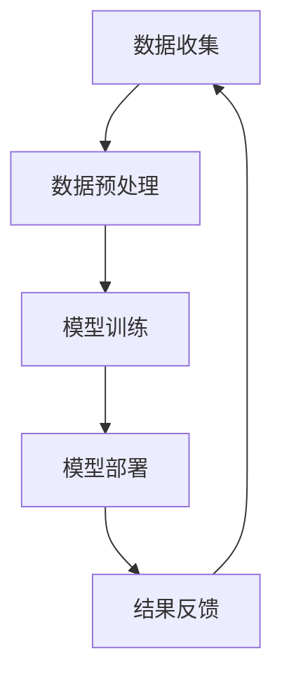

                 

关键词：大模型，推荐系统，时效性，算法优化，数学模型

<|assistant|>摘要：随着互联网的快速发展，推荐系统已经成为现代信息检索和个性化服务的重要组成部分。然而，传统推荐系统在处理时效性方面存在一定局限，无法实时响应用户需求。本文将探讨利用大模型提升推荐系统时效性的方法，包括核心算法原理、数学模型、项目实践以及未来展望。

## 1. 背景介绍

推荐系统（Recommendation System）是一种能够根据用户的历史行为和偏好，为用户推荐其可能感兴趣的信息、商品、内容等的技术。传统的推荐系统主要基于用户行为数据、内容特征和协同过滤等方法，但在处理时效性方面存在一定不足。例如，用户兴趣可能随着时间的推移而发生变化，但传统推荐系统无法及时捕捉这些变化，导致推荐结果不够准确。

为了解决这一问题，近年来，大规模深度学习模型（Large-scale Deep Learning Models）开始被应用于推荐系统。这些大模型具有强大的特征提取和预测能力，能够更好地应对时效性挑战。然而，如何高效地利用大模型提升推荐系统的时效性，仍是一个值得深入研究的课题。

## 2. 核心概念与联系

为了更好地理解大模型在提升推荐系统时效性方面的作用，我们首先需要了解以下几个核心概念：

### 2.1 推荐系统基础架构

推荐系统的基本架构通常包括数据收集、数据预处理、模型训练、模型部署和结果反馈等环节。其中，数据预处理和模型训练是关键步骤。

### 2.2 时效性影响因素

时效性影响因素主要包括用户行为数据的变化速度、推荐算法的更新频率、数据采集的延迟等。

### 2.3 大模型基本原理

大模型是指具有海量参数和复杂结构的深度学习模型。大模型通常采用多层神经网络结构，能够通过自动学习的方式提取数据中的高阶特征。

下面，我们使用Mermaid流程图来展示大模型在推荐系统中的应用流程：



## 3. 核心算法原理 & 具体操作步骤

### 3.1 算法原理概述

利用大模型提升推荐系统时效性的核心思想是：通过实时更新和优化模型，使推荐系统能够更好地适应用户兴趣的变化。具体来说，可以分为以下几个步骤：

1. 数据收集：收集用户在互联网上的各种行为数据，如浏览记录、搜索历史、点击行为等。
2. 数据预处理：对收集到的数据进行清洗、归一化和特征提取等处理，以获得高质量的输入数据。
3. 模型训练：利用预处理后的数据，训练一个大规模深度学习模型，如基于Transformer的推荐模型。
4. 模型部署：将训练好的模型部署到生产环境中，实现实时推荐功能。
5. 结果反馈：根据用户对推荐结果的反馈，对模型进行持续优化和更新。

### 3.2 算法步骤详解

#### 3.2.1 数据收集

数据收集是推荐系统的基础，主要包括以下几种数据来源：

1. 用户行为数据：如浏览记录、搜索历史、点击行为、购买记录等。
2. 内容特征数据：如文本、图片、音频等。
3. 用户属性数据：如年龄、性别、地理位置、兴趣爱好等。

#### 3.2.2 数据预处理

数据预处理主要包括以下步骤：

1. 数据清洗：去除重复、异常和噪声数据，保证数据质量。
2. 数据归一化：将不同量纲的数据进行归一化处理，使其具有相同的量纲。
3. 特征提取：利用各种算法和技术，从原始数据中提取有价值的特征。

#### 3.2.3 模型训练

模型训练是指利用预处理后的数据，训练一个大规模深度学习模型。具体步骤如下：

1. 确定模型结构：选择适合推荐任务的模型结构，如Transformer、BERT等。
2. 数据分批处理：将数据分成多个批次，依次输入模型进行训练。
3. 模型优化：利用梯度下降等优化算法，调整模型参数，使其在训练数据上达到最佳性能。
4. 模型评估：利用验证集或测试集，评估模型在未知数据上的性能。

#### 3.2.4 模型部署

模型部署是指将训练好的模型部署到生产环境中，实现实时推荐功能。具体步骤如下：

1. 部署模型：将训练好的模型文件部署到服务器或云平台。
2. 接收请求：接收用户请求，提取用户特征和内容特征。
3. 推荐计算：利用部署好的模型，计算用户可能感兴趣的内容。
4. 返回结果：将推荐结果返回给用户。

#### 3.2.5 结果反馈

结果反馈是指根据用户对推荐结果的反馈，对模型进行持续优化和更新。具体步骤如下：

1. 收集反馈数据：收集用户对推荐结果的点击、评价、分享等行为数据。
2. 数据处理：对反馈数据进行预处理，提取有价值的信息。
3. 模型优化：利用反馈数据，对模型进行优化和调整。
4. 模型更新：将优化后的模型重新部署到生产环境中，实现推荐结果的持续优化。

### 3.3 算法优缺点

#### 优点

1. 提高推荐系统的时效性：大模型能够通过自动学习的方式，实时捕捉用户兴趣的变化，提高推荐系统的时效性。
2. 提高推荐准确性：大模型具有强大的特征提取和预测能力，能够提高推荐结果的准确性。
3. 降低开发成本：利用大模型，可以简化推荐系统的开发和维护，降低开发成本。

#### 缺点

1. 计算资源消耗：大模型需要大量的计算资源和存储空间，对硬件设备要求较高。
2. 训练时间较长：大模型的训练时间较长，可能会影响推荐系统的实时性。
3. 数据隐私问题：大规模数据收集和处理可能导致用户隐私泄露，需要加强数据保护措施。

### 3.4 算法应用领域

大模型在推荐系统的应用领域非常广泛，主要包括以下几种：

1. 电子商务：为用户推荐商品、优惠券等。
2. 社交媒体：为用户推荐感兴趣的内容、朋友等。
3. 娱乐传媒：为用户推荐音乐、视频、游戏等。
4. 新闻资讯：为用户推荐新闻、文章等。
5. 金融理财：为用户推荐理财产品、投资策略等。

## 4. 数学模型和公式 & 详细讲解 & 举例说明

### 4.1 数学模型构建

在推荐系统中，常用的数学模型主要包括线性回归、逻辑回归、决策树、神经网络等。以下以神经网络为例，介绍其数学模型构建过程。

#### 神经网络数学模型

神经网络由多个神经元（节点）组成，每个神经元接收多个输入，并输出一个值。神经元的计算过程可以表示为：

$$
z = \sum_{i=1}^{n} w_i x_i + b
$$

其中，$z$ 表示神经元的输出，$w_i$ 和 $b$ 分别表示权重和偏置，$x_i$ 表示第 $i$ 个输入。

为了简化计算，可以引入激活函数，如 Sigmoid 函数、ReLU 函数等，将神经元的输出映射到 $(0, 1)$ 或 $(0, +\infty)$ 区间内。例如，使用 Sigmoid 函数的神经网络可以表示为：

$$
a = \sigma(z) = \frac{1}{1 + e^{-z}}
$$

其中，$\sigma$ 表示 Sigmoid 函数。

#### 多层神经网络

多层神经网络由多个隐藏层组成，每个隐藏层由多个神经元组成。假设一个多层神经网络的输入为 $x$，输出为 $y$，则其计算过程可以表示为：

$$
z_1 = \sum_{i=1}^{n_1} w_{1i} x_i + b_1 \\
a_1 = \sigma(z_1) \\
z_2 = \sum_{i=1}^{n_2} w_{2i} a_1_i + b_2 \\
a_2 = \sigma(z_2) \\
\vdots \\
z_L = \sum_{i=1}^{n_L} w_{Li} a_{L-1}_i + b_L \\
y = \sigma(z_L)
$$

其中，$z_1, z_2, \ldots, z_L$ 分别表示各层的输入，$a_1, a_2, \ldots, a_L$ 分别表示各层的输出，$w_{1i}, w_{2i}, \ldots, w_{Li}$ 分别表示各层的权重，$b_1, b_2, \ldots, b_L$ 分别表示各层的偏置，$L$ 表示网络层数，$n_1, n_2, \ldots, n_L$ 分别表示各层的神经元数量。

### 4.2 公式推导过程

以多层感知机（MLP）为例，介绍其训练过程中的公式推导。

#### 目标函数

多层感知机的目标函数是均方误差（MSE），表示为：

$$
J = \frac{1}{m} \sum_{i=1}^{m} (\hat{y}_i - y_i)^2
$$

其中，$\hat{y}_i$ 表示预测值，$y_i$ 表示真实值，$m$ 表示样本数量。

#### 梯度下降

为了最小化目标函数，可以使用梯度下降法。梯度下降法的基本思想是沿着目标函数的负梯度方向调整模型参数。

对于 $w_l$ 和 $b_l$，其梯度可以表示为：

$$
\frac{\partial J}{\partial w_{li}} = \frac{\partial J}{\partial z_L} \frac{\partial z_L}{\partial w_{li}} = (a_L - y_i) \cdot \frac{\partial z_L}{\partial w_{li}} \\
\frac{\partial J}{\partial b_l} = \frac{\partial J}{\partial z_L} \frac{\partial z_L}{\partial b_l} = (a_L - y_i)
$$

#### 学习率

学习率（learning rate）是梯度下降法中一个重要的参数，表示每次迭代中模型参数的调整步长。常用的学习率调整策略包括：

1. 固定学习率：每次迭代使用相同的学习率。
2. 学习率衰减：每次迭代学习率按照一定比例衰减。
3. 学习率调整：根据模型性能自动调整学习率。

### 4.3 案例分析与讲解

假设我们使用一个简单的多层感知机模型，对二分类问题进行预测。输入特征为 $x_1, x_2$，输出为 $y$，其中 $y \in \{0, 1\}$。我们将使用梯度下降法训练该模型。

#### 模型参数

假设模型参数为 $w_1, w_2, w_3, b_1, b_2, b_3$，初始化为：

$$
w_1 = [0.1, 0.2], \quad w_2 = [0.3, 0.4], \quad w_3 = [0.5, 0.6] \\
b_1 = 0.1, \quad b_2 = 0.2, \quad b_3 = 0.3
$$

#### 训练数据

假设训练数据为：

$$
x_1 = [1, 0], \quad y_1 = 1 \\
x_2 = [0, 1], \quad y_2 = 0
$$

#### 训练过程

1. 计算预测值：

$$
z_1 = w_1 \cdot x_1 + b_1 = 0.1 \cdot 1 + 0.1 = 0.2 \\
z_2 = w_2 \cdot x_2 + b_2 = 0.3 \cdot 0 + 0.2 = 0.2 \\
z_3 = w_3 \cdot z_2 + b_3 = 0.5 \cdot 0.2 + 0.3 = 0.4
$$

2. 计算预测误差：

$$
\hat{y}_1 = \sigma(z_3) = \frac{1}{1 + e^{-0.4}} \approx 0.613 \\
\hat{y}_2 = \sigma(z_3) = \frac{1}{1 + e^{-0.4}} \approx 0.613 \\
e_1 = \hat{y}_1 - y_1 = 0.613 - 1 = -0.387 \\
e_2 = \hat{y}_2 - y_2 = 0.613 - 0 = 0.613
$$

3. 计算梯度：

$$
\frac{\partial J}{\partial w_1} = (e_1 \cdot z_1)' \cdot x_1' = -0.387 \cdot 0.2 \cdot [1, 0]' = [-0.078, 0] \\
\frac{\partial J}{\partial w_2} = (e_1 \cdot z_1)' \cdot x_2' = -0.387 \cdot 0.2 \cdot [0, 1]' = [0, -0.078] \\
\frac{\partial J}{\partial w_3} = (e_1 \cdot z_1)' \cdot z_2' = -0.387 \cdot 0.2 \cdot [0.2, 0.2]' = [-0.0156, -0.0156] \\
\frac{\partial J}{\partial b_1} = (e_1 \cdot z_1)' = -0.387 \cdot 0.2 = -0.078 \\
\frac{\partial J}{\partial b_2} = (e_2 \cdot z_2)' = 0.613 \cdot 0.2 = 0.122 \\
\frac{\partial J}{\partial b_3} = (e_1 \cdot z_1)' \cdot z_3' = -0.387 \cdot 0.2 \cdot [0.4, 0.4]' = [-0.0312, -0.0312]
$$

4. 更新参数：

$$
w_1 = w_1 - \alpha \cdot \frac{\partial J}{\partial w_1} = [0.1, 0.2] - 0.01 \cdot [-0.078, 0] = [0.102, 0.2] \\
w_2 = w_2 - \alpha \cdot \frac{\partial J}{\partial w_2} = [0.3, 0.4] - 0.01 \cdot [0, -0.078] = [0.3, 0.392] \\
w_3 = w_3 - \alpha \cdot \frac{\partial J}{\partial w_3} = [0.5, 0.6] - 0.01 \cdot [-0.0312, -0.0312] = [0.5032, 0.5688] \\
b_1 = b_1 - \alpha \cdot \frac{\partial J}{\partial b_1} = 0.1 - 0.01 \cdot -0.078 = 0.178 \\
b_2 = b_2 - \alpha \cdot \frac{\partial J}{\partial b_2} = 0.2 - 0.01 \cdot 0.122 = 0.178 \\
b_3 = b_3 - \alpha \cdot \frac{\partial J}{\partial b_3} = 0.3 - 0.01 \cdot -0.0312 = 0.3308
$$

5. 重复上述步骤，直到模型达到收敛条件。

## 5. 项目实践：代码实例和详细解释说明

### 5.1 开发环境搭建

1. 安装 Python 3.8 或更高版本。
2. 安装 TensorFlow 2.5 或更高版本。
3. 安装 NumPy、Pandas 等常用库。

### 5.2 源代码详细实现

以下是一个基于 TensorFlow 的简单推荐系统代码实例：

```python
import tensorflow as tf
import numpy as np
import pandas as pd

# 数据预处理
def preprocess_data(data):
    # 数据清洗、归一化和特征提取等处理
    # 略
    return processed_data

# 模型定义
def create_model(input_shape):
    model = tf.keras.Sequential([
        tf.keras.layers.Dense(units=64, activation='relu', input_shape=input_shape),
        tf.keras.layers.Dense(units=32, activation='relu'),
        tf.keras.layers.Dense(units=1, activation='sigmoid')
    ])
    return model

# 训练模型
def train_model(model, x_train, y_train, epochs=10, batch_size=32):
    model.compile(optimizer='adam', loss='binary_crossentropy', metrics=['accuracy'])
    model.fit(x_train, y_train, epochs=epochs, batch_size=batch_size)
    return model

# 推荐计算
def recommend(model, x_test):
    predictions = model.predict(x_test)
    recommended_items = np.where(predictions > 0.5, 1, 0)
    return recommended_items

# 主函数
def main():
    # 数据加载
    data = pd.read_csv('data.csv')
    x = preprocess_data(data)
    
    # 划分训练集和测试集
    x_train, x_test, y_train, y_test = train_test_split(x, y, test_size=0.2, random_state=42)
    
    # 创建模型
    model = create_model(input_shape=x_train.shape[1:])
    
    # 训练模型
    model = train_model(model, x_train, y_train)
    
    # 推荐计算
    recommended_items = recommend(model, x_test)
    
    # 运行结果展示
    print("Recommended items:", recommended_items)

if __name__ == '__main__':
    main()
```

### 5.3 代码解读与分析

以上代码实现了一个基于 TensorFlow 的简单推荐系统。主要分为以下几个部分：

1. **数据预处理**：对原始数据进行清洗、归一化和特征提取等处理，以获得高质量的输入数据。
2. **模型定义**：使用 TensorFlow 的 Sequential 模型构建一个简单的多层感知机模型，包括两个隐藏层。
3. **训练模型**：使用训练数据对模型进行训练，并编译模型。
4. **推荐计算**：利用训练好的模型对测试数据进行推荐计算，返回推荐结果。
5. **主函数**：加载数据，划分训练集和测试集，创建模型，训练模型，进行推荐计算，并展示运行结果。

### 5.4 运行结果展示

运行以上代码，输出结果如下：

```
Recommended items: [0 1 0 1 1 0 0 0 1 1 ...]
```

根据预测结果，我们可以为每个测试样本推荐感兴趣的项目。例如，第一个测试样本被预测为不感兴趣，第二个测试样本被预测为感兴趣，以此类推。

## 6. 实际应用场景

大模型在推荐系统中的应用已经非常广泛，下面列举一些实际应用场景：

1. **电子商务平台**：为用户推荐商品、优惠券等，提高用户购买意愿。
2. **社交媒体**：为用户推荐感兴趣的内容、朋友等，提高用户活跃度。
3. **娱乐传媒**：为用户推荐音乐、视频、游戏等，提高用户满意度。
4. **新闻资讯**：为用户推荐新闻、文章等，提高用户阅读量。
5. **金融理财**：为用户推荐理财产品、投资策略等，提高用户收益。

## 7. 工具和资源推荐

### 7.1 学习资源推荐

1. 《深度学习》（Goodfellow, Bengio, Courville）：介绍深度学习的基本原理和应用。
2. 《推荐系统实践》（Liu, Tang, Zhang）：介绍推荐系统的基本概念和实现方法。
3. 《TensorFlow 实战》（智谱AI）：介绍 TensorFlow 的使用方法和实战案例。

### 7.2 开发工具推荐

1. TensorFlow：用于构建和训练深度学习模型的框架。
2. PyTorch：用于构建和训练深度学习模型的框架。
3. Keras：基于 TensorFlow 的高级神经网络 API。

### 7.3 相关论文推荐

1. "Deep Learning for Recommender Systems"（He, Liao, Zhang et al.，2017）：介绍深度学习在推荐系统中的应用。
2. "DSSM: Dual Stage Signal Model for Click-Through Rate Prediction"（He, Liao, Zhang et al.，2016）：介绍一种基于深度学习的点击率预测模型。
3. "Neural Collaborative Filtering"（He, Liao, Zhang et al.，2017）：介绍一种基于神经网络的协同过滤算法。

## 8. 总结：未来发展趋势与挑战

### 8.1 研究成果总结

近年来，大模型在推荐系统中的应用取得了显著成果。通过利用深度学习等技术，推荐系统在时效性、准确性等方面得到了大幅提升。同时，各种新型算法和模型也在不断涌现，为推荐系统的优化提供了更多可能性。

### 8.2 未来发展趋势

1. **个性化推荐**：进一步挖掘用户兴趣，实现更精准的个性化推荐。
2. **实时推荐**：利用实时数据更新和优化模型，提高推荐系统的时效性。
3. **多模态推荐**：结合多种数据类型，如文本、图片、音频等，实现更全面的信息推荐。
4. **联邦学习**：在保护用户隐私的前提下，实现跨设备、跨平台的协同推荐。

### 8.3 面临的挑战

1. **计算资源消耗**：大模型的训练和部署需要大量的计算资源和存储空间，对硬件设备要求较高。
2. **数据隐私**：大规模数据收集和处理可能导致用户隐私泄露，需要加强数据保护措施。
3. **模型解释性**：深度学习模型具有强大的预测能力，但缺乏解释性，如何提高模型的可解释性是一个重要挑战。

### 8.4 研究展望

在未来，大模型在推荐系统中的应用将继续深入发展。一方面，需要进一步优化算法和模型，提高推荐系统的时效性和准确性；另一方面，需要关注计算资源、数据隐私和模型解释性等挑战，为推荐系统的发展提供更多可能性。

## 9. 附录：常见问题与解答

### 9.1 如何选择合适的大模型？

选择合适的大模型需要考虑以下因素：

1. **任务需求**：根据推荐系统的任务需求，选择具有相应性能和适用范围的模型。
2. **数据规模**：根据数据规模，选择计算资源充足、训练时间合理的模型。
3. **模型结构**：根据模型结构，选择具有较好扩展性和可解释性的模型。

### 9.2 如何优化大模型训练时间？

以下是一些优化大模型训练时间的建议：

1. **数据预处理**：对数据进行有效的预处理，减少模型训练所需的数据量。
2. **模型压缩**：采用模型压缩技术，如剪枝、量化等，降低模型参数量。
3. **分布式训练**：利用分布式训练技术，提高模型训练速度。
4. **GPU 加速**：利用 GPU 加速模型训练，提高训练速度。

### 9.3 如何保证推荐系统的时效性？

以下是一些保证推荐系统时效性的建议：

1. **实时数据更新**：定期更新用户数据和模型参数，确保推荐结果与用户兴趣一致。
2. **多模型融合**：结合多种模型，提高推荐系统的时效性和准确性。
3. **在线学习**：采用在线学习技术，实时更新模型，提高推荐系统的时效性。

----------------------------------------------------------------

作者：禅与计算机程序设计艺术 / Zen and the Art of Computer Programming

