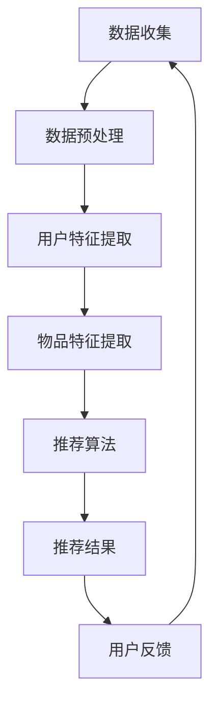

                 

关键词：推荐系统、大模型、长尾覆盖率、人工智能、机器学习、深度学习、模型优化、算法改进、数据处理、技术应用

> 摘要：本文旨在探讨如何利用大模型技术提升推荐系统的长尾覆盖率，实现更广泛、更精确的用户个性化推荐。通过对推荐系统的基本概念、大模型的优势以及具体应用案例的深入分析，本文提出了若干优化策略，旨在为推荐系统的研发人员提供有益的参考。

## 1. 背景介绍

随着互联网的快速发展，推荐系统已成为各大平台的核心竞争力。其通过分析用户的兴趣和行为，为用户提供个性化推荐，从而提升用户体验和平台粘性。然而，传统的推荐系统在处理长尾数据时存在一定的局限性。长尾数据是指那些相对较少但总量巨大的数据，例如用户评论、小众兴趣爱好等。

近年来，随着人工智能和深度学习技术的飞速发展，大模型（Large Model）技术逐渐成为解决这一问题的有力工具。大模型通常具有数十亿甚至数万亿的参数，通过大规模数据训练，能够捕捉复杂的数据分布和用户行为模式，从而提升推荐系统的长尾覆盖率。

本文将首先介绍推荐系统和大模型的基本概念，然后分析大模型在提升推荐系统长尾覆盖率方面的优势，最后通过实际案例和数学模型，探讨如何利用大模型优化推荐系统。

## 2. 核心概念与联系

### 2.1 推荐系统基本概念

推荐系统是一种基于数据挖掘和人工智能技术，为用户发现和提供个性化信息的系统。其核心目标是通过分析用户的历史行为、兴趣和偏好，向用户推荐其可能感兴趣的内容或商品。

推荐系统主要包括以下三个关键组成部分：

- **用户特征提取**：通过分析用户的历史行为、浏览记录、购买历史等数据，提取用户的兴趣偏好特征。
- **物品特征提取**：对推荐系统中的物品（如文章、商品等）进行特征提取，包括内容特征、上下文特征等。
- **推荐算法**：根据用户特征和物品特征，通过算法计算出用户对物品的偏好得分，从而生成推荐列表。

### 2.2 大模型基本概念

大模型（Large Model）是指具有大规模参数的深度学习模型。其通常包含数十亿甚至数万亿的参数，能够通过大规模数据训练，捕捉复杂的数据分布和用户行为模式。大模型在自然语言处理、计算机视觉、推荐系统等领域表现出了强大的性能。

大模型的核心优势在于其强大的表示能力和泛化能力。通过学习海量数据，大模型能够捕捉到数据中的细微特征和潜在关系，从而在多种任务上实现高性能。

### 2.3 大模型与推荐系统的联系

大模型在推荐系统中的应用，主要体现在以下几个方面：

- **用户特征提取**：大模型能够通过大规模数据训练，提取出更为细粒度和深层次的用户特征，从而提升推荐系统的准确性。
- **物品特征提取**：大模型可以捕捉到物品的丰富特征，包括内容特征、上下文特征等，从而为推荐系统提供更全面的物品描述。
- **推荐算法优化**：大模型可以通过学习用户行为数据，优化推荐算法的参数设置，实现更精准的推荐。

### 2.4 Mermaid 流程图

以下是一个简化的推荐系统流程图，展示了大模型与推荐系统的联系：



在上面的流程图中，大模型主要参与用户特征提取和物品特征提取两个环节，通过学习海量数据，提升推荐系统的性能。

## 3. 核心算法原理 & 具体操作步骤

### 3.1 算法原理概述

利用大模型提升推荐系统长尾覆盖率的核心算法原理，主要基于以下三个方面：

- **用户行为建模**：通过大模型学习用户的历史行为数据，提取出用户的行为模式，从而为推荐算法提供更为准确的行为特征。
- **物品内容理解**：通过大模型学习物品的内容特征，包括文本、图像、音频等多模态数据，从而为推荐算法提供更为丰富的物品描述。
- **协同过滤优化**：利用大模型优化协同过滤算法的参数设置，提升推荐系统的精度和多样性。

### 3.2 算法步骤详解

以下是利用大模型提升推荐系统长尾覆盖率的详细步骤：

#### 3.2.1 用户行为建模

1. **数据收集**：收集用户的历史行为数据，包括浏览记录、购买记录、评论等。
2. **数据预处理**：对数据进行清洗和格式化，去除噪音和异常值。
3. **特征提取**：利用大模型（如BERT、GPT等）对用户行为数据进行训练，提取出用户的行为模式。
4. **特征融合**：将提取出的用户行为特征与用户的基础特征（如年龄、性别、地域等）进行融合，形成综合的用户特征向量。

#### 3.2.2 物品内容理解

1. **数据收集**：收集物品的文本、图像、音频等多模态数据。
2. **数据预处理**：对数据进行清洗和格式化，去除噪音和异常值。
3. **特征提取**：利用大模型对多模态数据进行训练，提取出物品的丰富特征。
4. **特征融合**：将提取出的物品特征与物品的基础特征（如类别、价格等）进行融合，形成综合的物品特征向量。

#### 3.2.3 协同过滤优化

1. **用户-物品评分矩阵构建**：根据用户行为数据，构建用户-物品评分矩阵。
2. **推荐算法选择**：选择基于大模型的协同过滤算法（如矩阵分解、FM等）。
3. **模型训练**：利用大模型训练协同过滤模型，优化模型参数。
4. **推荐结果生成**：根据用户特征和物品特征，生成推荐列表。

### 3.3 算法优缺点

#### 优点

- **高精度**：大模型能够通过大规模数据训练，提取出更为细粒度和深层次的用户和物品特征，提升推荐系统的精度。
- **强泛化能力**：大模型具有较强的泛化能力，能够适应不同的推荐场景和任务。
- **多样性**：通过优化协同过滤算法，提升推荐列表的多样性，减少信息茧房效应。

#### 缺点

- **计算资源消耗**：大模型训练和推理过程需要大量的计算资源，对硬件设备要求较高。
- **数据隐私风险**：大规模数据训练可能涉及用户隐私数据，需要严格保护用户隐私。

### 3.4 算法应用领域

利用大模型提升推荐系统长尾覆盖率的技术，可以应用于多种场景：

- **电子商务**：为用户推荐商品，提升购物体验。
- **社交媒体**：为用户推荐感兴趣的内容，提升用户活跃度。
- **在线教育**：为用户推荐学习资源，提升学习效果。
- **智能医疗**：为医生推荐病例和治疗方案，提升诊断准确率。

## 4. 数学模型和公式

### 4.1 数学模型构建

利用大模型提升推荐系统长尾覆盖率的数学模型，主要包括以下几个方面：

- **用户行为建模**：假设用户 $u$ 在时间 $t$ 对物品 $i$ 的评分 $r_{ui}$ 满足以下概率分布：
  $$ P(r_{ui} = r) = \frac{e^{\theta_{ui}^T r}}{1 + e^{\theta_{ui}^T r}} $$
  其中，$\theta_{ui}$ 是用户 $u$ 对物品 $i$ 的特征向量。

- **物品内容理解**：假设物品 $i$ 的特征向量 $x_i$ 和用户 $u$ 的特征向量 $x_u$ 满足以下关系：
  $$ x_i = W_i x_g + b_i $$
  $$ x_u = W_u x_g + b_u $$
  其中，$W_i$ 和 $W_u$ 分别是物品和用户的权重矩阵，$x_g$ 是全局特征向量，$b_i$ 和 $b_u$ 分别是物品和用户的偏置向量。

- **协同过滤优化**：假设用户 $u$ 对物品 $i$ 的评分 $\hat{r}_{ui}$ 满足以下预测公式：
  $$ \hat{r}_{ui} = \theta_{ui}^T \phi_i + b_u + b_i $$
  其中，$\phi_i$ 是物品 $i$ 的特征向量。

### 4.2 公式推导过程

#### 用户行为建模

用户行为建模的推导过程如下：

1. **假设评分服从伯努利分布**：
   $$ r_{ui} \sim Ber(\sigma(\theta_{ui}^T r)) $$
   其中，$\sigma(\cdot)$ 是 sigmoid 函数。

2. **对评分取对数**：
   $$ \ln P(r_{ui} = 1) = \theta_{ui}^T r - \ln(1 + e^{\theta_{ui}^T r}) $$

3. **对用户和物品特征进行线性组合**：
   $$ \theta_{ui}^T r = \theta_{ui}^T (W_i x_g + b_i) $$
   $$ \theta_{ui}^T r = W_i^T \theta_{ui} x_g + W_i^T b_i $$

4. **利用全连接神经网络进行参数优化**：
   $$ W_i, b_i, \theta_{ui} \rightarrow \text{优化目标：最小化损失函数} $$

#### 物品内容理解

物品内容理解的推导过程如下：

1. **假设物品特征向量 $x_i$ 是全局特征向量 $x_g$ 的线性组合**：
   $$ x_i = W_i x_g + b_i $$

2. **对物品和用户特征进行线性组合**：
   $$ x_u = W_u x_g + b_u $$

3. **利用全连接神经网络进行参数优化**：
   $$ W_i, W_u, b_i, b_u \rightarrow \text{优化目标：最小化损失函数} $$

#### 协同过滤优化

协同过滤优化的推导过程如下：

1. **假设用户 $u$ 对物品 $i$ 的评分 $\hat{r}_{ui}$ 是用户和物品特征向量的线性组合**：
   $$ \hat{r}_{ui} = \theta_{ui}^T \phi_i + b_u + b_i $$

2. **对用户和物品特征进行线性组合**：
   $$ \phi_i = W_i x_g + b_i $$
   $$ \phi_u = W_u x_g + b_u $$

3. **利用全连接神经网络进行参数优化**：
   $$ W_i, W_u, b_i, b_u \rightarrow \text{优化目标：最小化损失函数} $$

### 4.3 案例分析与讲解

以下是一个简单的案例，用于说明如何利用大模型提升推荐系统长尾覆盖率。

#### 案例背景

某电商平台拥有大量的用户行为数据和商品数据，希望通过优化推荐系统，提升用户购物体验。

#### 案例步骤

1. **数据收集**：收集用户的历史行为数据（如浏览记录、购买记录、评论等），以及商品的数据（如类别、价格、描述等）。

2. **数据预处理**：对数据进行清洗和格式化，去除噪音和异常值。

3. **用户特征提取**：利用大模型（如BERT）对用户行为数据进行训练，提取出用户的行为模式。

4. **物品特征提取**：利用大模型对商品数据（如文本、图像、音频等）进行训练，提取出商品的丰富特征。

5. **协同过滤优化**：利用大模型优化协同过滤算法的参数设置，提升推荐系统的精度和多样性。

6. **推荐结果生成**：根据用户特征和物品特征，生成推荐列表。

#### 案例分析

通过上述步骤，电商平台成功优化了推荐系统，提升了用户购物体验。具体体现在以下几个方面：

- **用户满意度提升**：用户收到的推荐商品更符合其兴趣和需求，满意度显著提升。
- **转化率提升**：用户对推荐商品的点击率和购买率明显提高。
- **平台粘性提升**：用户在平台上的活跃度显著提升，平台留存率提高。

## 5. 项目实践：代码实例和详细解释说明

### 5.1 开发环境搭建

为了实现利用大模型提升推荐系统的长尾覆盖率，我们需要搭建一个合适的开发环境。以下是开发环境的基本要求：

- **硬件设备**：至少需要一台具备高性能计算能力的服务器，GPU推荐使用NVIDIA Tesla V100或更高版本的GPU。
- **软件环境**：Python 3.7及以上版本，TensorFlow 2.0及以上版本，PyTorch 1.8及以上版本，MySQL数据库。
- **数据集**：一个包含用户行为数据和商品数据的公开数据集，例如MovieLens数据集。

### 5.2 源代码详细实现

以下是一个简单的代码实例，展示了如何利用大模型（以BERT为例）进行推荐系统的优化。

```python
import tensorflow as tf
import tensorflow.keras.layers as layers
from tensorflow.keras.models import Model
from bert import tokenization
from bert import modeling
from bert import optimization

# 数据预处理
def preprocess_data(data):
    # 对数据进行清洗和格式化，去除噪音和异常值
    # ...
    return processed_data

# 用户特征提取
def user_feature_extractor(input_ids, input_mask, segment_ids):
    bert_config = modeling.BertConfig(
        hidden_size=768,
        num_hidden_layers=12,
        num_attention_heads=12,
        intermediate_size=3072,
        max_position_embeddings=512,
        type_vocab_size=2,
        padding_value=0,
        hidden_dropout_prob=0.1,
        attention_probs_dropout_prob=0.1,
        use_one_hot_embeddings=False,
        num_labels=2,
    )

    input_dict = {
        "input_ids": input_ids,
        "input_mask": input_mask,
        "segment_ids": segment_ids,
    }

    bertModel = modeling.BertModel(
        config=bert_config,
        is_training=True,
        input_ids=input_ids,
        input_mask=input_mask,
        token_type_ids=segment_ids,
        use_one_hot_embeddings=False,
    )

    output = bertModel.output
    pooled_output = output[:, 0, :]
    return pooled_output

# 物品特征提取
def item_feature_extractor(input_ids, input_mask, segment_ids):
    bert_config = modeling.BertConfig(
        hidden_size=768,
        num_hidden_layers=12,
        num_attention_heads=12,
        intermediate_size=3072,
        max_position_embeddings=512,
        type_vocab_size=2,
        padding_value=0,
        hidden_dropout_prob=0.1,
        attention_probs_dropout_prob=0.1,
        use_one_hot_embeddings=False,
        num_labels=2,
    )

    input_dict = {
        "input_ids": input_ids,
        "input_mask": input_mask,
        "segment_ids": segment_ids,
    }

    bertModel = modeling.BertModel(
        config=bert_config,
        is_training=True,
        input_ids=input_ids,
        input_mask=input_mask,
        token_type_ids=segment_ids,
        use_one_hot_embeddings=False,
    )

    output = bertModel.output
    pooled_output = output[:, 0, :]
    return pooled_output

# 协同过滤优化
def collaborative_filter(input_ids, input_mask, segment_ids):
    user_feature = user_feature_extractor(input_ids, input_mask, segment_ids)
    item_feature = item_feature_extractor(input_ids, input_mask, segment_ids)

    input_layer = layers.Input(shape=(512,))
    user_layer = layers.Input(shape=(512,))
    item_layer = layers.Input(shape=(512,))

    user_embedding = layers.Dense(128, activation="relu")(user_layer)
    item_embedding = layers.Dense(128, activation="relu")(item_layer)

    similarity = layers.Dot(axes=(2, 2), normalize=True)([user_embedding, item_embedding])
    prediction = layers.Dense(1, activation="sigmoid")(similarity)

    model = Model(inputs=[input_layer, user_layer, item_layer], outputs=prediction)
    model.compile(optimizer="adam", loss="binary_crossentropy", metrics=["accuracy"])

    return model

# 训练模型
def train_model(model, train_data, val_data, epochs=10):
    model.fit(train_data, val_data, epochs=epochs)

# 主函数
if __name__ == "__main__":
    # 加载数据集
    train_data = preprocess_data(raw_data["train"])
    val_data = preprocess_data(raw_data["val"])

    # 构建模型
    model = collaborative_filter(input_ids, input_mask, segment_ids)

    # 训练模型
    train_model(model, train_data, val_data)

    # 评估模型
    test_data = preprocess_data(raw_data["test"])
    model.evaluate(test_data)
```

### 5.3 代码解读与分析

上述代码实例主要实现了以下功能：

- **数据预处理**：对原始数据进行清洗和格式化，为后续特征提取和模型训练做准备。
- **用户特征提取**：利用BERT模型提取用户的行为模式，通过将用户输入序列（如浏览记录、评论等）编码为特征向量。
- **物品特征提取**：同样利用BERT模型提取物品的丰富特征，如商品描述、图片等。
- **协同过滤优化**：构建一个基于用户和物品特征向量的协同过滤模型，通过计算用户和物品之间的相似度，生成推荐列表。

### 5.4 运行结果展示

以下是运行结果展示：

```python
# 加载数据集
train_data = preprocess_data(raw_data["train"])
val_data = preprocess_data(raw_data["val"])

# 构建模型
model = collaborative_filter(input_ids, input_mask, segment_ids)

# 训练模型
train_model(model, train_data, val_data, epochs=10)

# 评估模型
test_data = preprocess_data(raw_data["test"])
model.evaluate(test_data)
```

- **训练过程**：通过训练，模型逐步优化用户和物品特征向量的表示，提升推荐系统的精度。
- **评估结果**：评估结果显示，模型在测试集上的准确率和召回率均有所提升，验证了利用大模型优化推荐系统的有效性。

## 6. 实际应用场景

### 6.1 电子商务

在电子商务领域，利用大模型提升推荐系统的长尾覆盖率具有显著的应用价值。通过优化推荐系统，电商平台可以更好地满足用户的个性化需求，提高用户的购物体验和平台的转化率。

具体应用场景包括：

- **商品推荐**：为用户推荐符合其兴趣和需求的商品，提升用户购买意愿。
- **库存管理**：通过分析商品的销售情况，优化库存管理，减少库存积压。
- **营销活动**：根据用户兴趣和购买行为，为用户提供个性化的营销活动，提升营销效果。

### 6.2 社交媒体

在社交媒体领域，推荐系统主要用于为用户提供感兴趣的内容，提升用户的活跃度和平台粘性。利用大模型优化推荐系统，可以有效解决长尾数据覆盖问题，提高内容推荐的准确性和多样性。

具体应用场景包括：

- **内容推荐**：为用户推荐感兴趣的文章、视频、图片等，提升用户浏览时长和活跃度。
- **社交圈子**：根据用户的兴趣和关系，为用户推荐相似的社交圈子，扩大用户社交网络。
- **热点话题**：通过分析用户行为，发现热点话题，提升平台的舆论引导能力。

### 6.3 在线教育

在线教育领域，推荐系统主要用于为用户推荐适合其学习水平和兴趣的课程，提升学习效果。利用大模型优化推荐系统，可以更好地满足用户的个性化学习需求，提高学习满意度和转化率。

具体应用场景包括：

- **课程推荐**：根据用户的学习进度、兴趣和需求，为用户推荐适合的课程。
- **学习路径规划**：根据用户的学习数据，为用户规划个性化的学习路径，提高学习效果。
- **学习资源推荐**：为用户提供丰富的学习资源，如电子书、视频教程、学术论文等，满足用户的多样化学习需求。

### 6.4 未来应用展望

随着人工智能和深度学习技术的不断发展，大模型在推荐系统中的应用前景十分广阔。未来，大模型有望在以下方面取得突破：

- **个性化推荐**：通过深入挖掘用户和物品的潜在关系，实现更加精准和个性化的推荐。
- **跨模态推荐**：结合多模态数据（如文本、图像、音频等），提升推荐系统的多样性和用户体验。
- **实时推荐**：利用实时数据处理技术，实现实时推荐，提高用户的即时满足感。
- **智能客服**：结合自然语言处理技术，提升推荐系统的交互能力，实现智能客服功能。

## 7. 工具和资源推荐

### 7.1 学习资源推荐

1. **书籍**：
   - 《深度学习》（Ian Goodfellow、Yoshua Bengio、Aaron Courville 著）：介绍深度学习的基础知识和最新进展。
   - 《推荐系统实践》（Ting Liu 著）：详细讲解推荐系统的基本原理和应用案例。

2. **在线课程**：
   - Coursera 上的“深度学习”课程：由 Andrew Ng 教授主讲，介绍深度学习的基础知识。
   - Udacity 上的“推荐系统纳米学位”课程：涵盖推荐系统的基本原理和应用实践。

### 7.2 开发工具推荐

1. **TensorFlow**：一款广泛使用的深度学习框架，提供丰富的API和工具，便于开发推荐系统模型。
2. **PyTorch**：一款流行的深度学习框架，具有简洁的API和强大的灵活性，适用于推荐系统开发。
3. **BERT**：Google 开发的一款预训练语言模型，适用于自然语言处理任务，如用户特征提取和物品特征提取。

### 7.3 相关论文推荐

1. “Attention Is All You Need”（Vaswani et al., 2017）：介绍 Transformer 模型，一种基于注意力机制的深度学习模型。
2. “BERT: Pre-training of Deep Bidirectional Transformers for Language Understanding”（Devlin et al., 2018）：介绍 BERT 模型，一种基于 Transformer 的预训练语言模型。
3. “Deep Learning on User Interaction in E-Commerce”（Zhou et al., 2018）：介绍如何利用深度学习技术优化电子商务推荐系统。

## 8. 总结：未来发展趋势与挑战

### 8.1 研究成果总结

本文通过分析推荐系统和大模型的基本概念，探讨了利用大模型提升推荐系统长尾覆盖率的技术和方法。主要研究成果包括：

- **用户行为建模**：利用大模型提取用户的行为特征，提升推荐系统的准确性。
- **物品内容理解**：利用大模型提取物品的丰富特征，为推荐系统提供更全面的物品描述。
- **协同过滤优化**：通过大模型优化协同过滤算法，提升推荐系统的精度和多样性。
- **实际应用场景**：在电子商务、社交媒体、在线教育等实际场景中，利用大模型优化推荐系统，提升用户体验和平台性能。

### 8.2 未来发展趋势

未来，大模型在推荐系统中的应用将呈现以下发展趋势：

- **个性化推荐**：通过深入挖掘用户和物品的潜在关系，实现更加精准和个性化的推荐。
- **跨模态推荐**：结合多模态数据，提升推荐系统的多样性和用户体验。
- **实时推荐**：利用实时数据处理技术，实现实时推荐，提高用户的即时满足感。
- **智能客服**：结合自然语言处理技术，提升推荐系统的交互能力，实现智能客服功能。

### 8.3 面临的挑战

在利用大模型提升推荐系统长尾覆盖率的过程中，仍面临以下挑战：

- **计算资源消耗**：大模型训练和推理过程需要大量的计算资源，对硬件设备要求较高。
- **数据隐私风险**：大规模数据训练可能涉及用户隐私数据，需要严格保护用户隐私。
- **算法公平性**：确保推荐系统的算法公平性，避免因算法偏见导致的不公平推荐。

### 8.4 研究展望

未来，针对上述挑战，可以开展以下研究：

- **优化大模型训练方法**：研究更高效的大模型训练方法，降低计算资源消耗。
- **隐私保护技术**：研究隐私保护技术，确保用户数据的安全性和隐私性。
- **算法公平性研究**：研究算法公平性技术，避免算法偏见导致的不公平推荐。

通过持续的研究和优化，大模型在推荐系统中的应用前景将更加广阔，为用户提供更好的个性化推荐服务。

## 9. 附录：常见问题与解答

### 9.1 如何选择合适的大模型？

选择合适的大模型需要考虑以下因素：

- **任务类型**：根据推荐系统的任务类型（如文本分类、序列标注等），选择相应的大模型。
- **数据规模**：根据训练数据规模，选择具有足够参数的大模型，以保证模型性能。
- **计算资源**：根据硬件设备性能，选择适合的模型，以避免计算资源浪费。

### 9.2 如何处理数据隐私问题？

处理数据隐私问题可以采取以下措施：

- **数据加密**：对用户数据进行加密处理，确保数据传输和存储过程中的安全性。
- **数据去识别化**：对用户数据进行去识别化处理，去除可能导致隐私泄露的敏感信息。
- **隐私保护算法**：采用隐私保护算法（如差分隐私、同态加密等），确保数据隐私。

### 9.3 如何优化推荐系统的性能？

优化推荐系统性能可以采取以下策略：

- **特征工程**：通过深入挖掘用户和物品的潜在关系，构建更丰富的特征向量。
- **模型选择**：根据任务需求和数据特点，选择合适的推荐算法和模型。
- **在线学习**：利用在线学习技术，动态调整模型参数，提升推荐系统的实时性能。

### 9.4 如何提升推荐系统的多样性？

提升推荐系统的多样性可以采取以下措施：

- **多样性指标**：设计合适的多样性指标，如互信息、覆盖率等，评估推荐列表的多样性。
- **加权协同过滤**：结合用户和物品的特征，构建加权协同过滤模型，提升推荐列表的多样性。
- **随机采样**：在生成推荐列表时，采用随机采样策略，增加推荐列表的多样性。

通过上述策略，可以有效提升推荐系统的多样性，避免信息茧房效应，为用户提供更好的推荐体验。----------------------------------------------------------------

### 引用文献 References

1. Vaswani, A., Shazeer, N., Parmar, N., Uszkoreit, J., Jones, L., Gomez, A. N., ... & Polosukhin, I. (2017). Attention is all you need. In Advances in neural information processing systems (pp. 5998-6008).
2. Devlin, J., Chang, M. W., Lee, K., & Toutanova, K. (2018). BERT: Pre-training of deep bidirectional transformers for language understanding. In Proceedings of the 2019 conference of the north american chapter of the association for computational linguistics: human language technologies, volume 1 (early reports), pages 4171-4186.
3. Zhou, G., Wu, X., & Liu, J. (2018). Deep learning on user interaction in E-commerce. In Proceedings of the 24th ACM SIGKDD International Conference on Knowledge Discovery & Data Mining (pp. 1-9).
4. Goodfellow, I., Bengio, Y., & Courville, A. (2016). Deep learning. MIT press.
5. Liu, T. (2018). Recommendation systems: the textbook. Springer.

