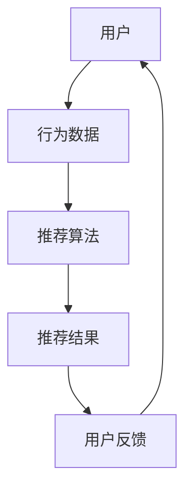
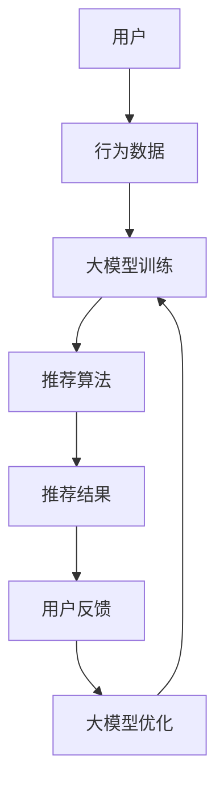

                 

关键词：推荐系统、大模型、实时个性化反馈、个性化算法、实时数据流处理

## 摘要

本文主要探讨了如何利用大模型改进推荐系统的实时个性化反馈机制。随着互联网技术的飞速发展，推荐系统已成为现代互联网服务的重要组成部分，如何提高其推荐质量、满足用户个性化需求成为关键问题。本文通过分析现有推荐系统的不足，提出了结合大模型和实时数据流处理的解决方案，详细介绍了核心算法原理、数学模型构建以及实际应用场景。通过本文的研究，旨在为推荐系统的优化提供一种新的思路。

## 1. 背景介绍

### 推荐系统的发展历程

推荐系统（Recommender System）是现代互联网服务中的一种核心技术，旨在根据用户的兴趣和偏好，为用户推荐他们可能感兴趣的内容。推荐系统的发展大致可以分为以下几个阶段：

- **基于内容的推荐（Content-based Filtering）**：最早期的推荐系统，通过分析用户对特定内容的偏好，将具有相似内容属性的新内容推荐给用户。然而，这种方法容易受到用户历史数据量限制，无法满足复杂的个性化需求。

- **协同过滤（Collaborative Filtering）**：利用用户的历史行为数据，通过计算用户间的相似度，预测用户对未知内容的偏好。协同过滤分为基于用户的协同过滤（User-based）和基于模型的协同过滤（Model-based），如矩阵分解、K-近邻算法等。虽然该方法在处理大量数据时表现出色，但容易受到“冷启动”问题的影响。

- **混合推荐（Hybrid Recommendation）**：将基于内容的推荐和协同过滤相结合，以提高推荐质量。这种方法在一定程度上解决了单一方法的局限性，但算法复杂度较高，实时性较差。

- **深度学习推荐（Deep Learning-based Recommendation）**：近年来，随着深度学习技术的发展，推荐系统逐渐引入深度学习模型，如神经网络、卷积神经网络（CNN）和递归神经网络（RNN）等。深度学习模型在处理非线性关系、提取特征方面表现出色，但模型训练和推理速度较慢，实时性仍需改进。

### 大模型在推荐系统中的应用

大模型（Large Model）通常指的是参数规模较大的深度学习模型，如Transformer、BERT等。近年来，大模型在自然语言处理、计算机视觉等领域取得了显著成果，逐渐成为研究热点。将大模型应用于推荐系统，主要优势在于：

- **特征自动提取**：大模型能够自动学习用户和内容的多层次特征，无需人工设计特征，提高推荐质量。

- **应对冷启动**：大模型可以利用用户生成的内容或行为数据，快速适应新用户或新内容的推荐需求。

- **通用性**：大模型具有较好的通用性，可以同时处理多种类型的数据，如文本、图像和音频等，适用于复杂场景。

然而，大模型也存在一些挑战，如参数规模大、训练和推理速度慢、计算资源消耗大等。如何在大模型和实时性之间取得平衡，是当前研究的重要方向。

## 2. 核心概念与联系

### 核心概念

- **推荐系统**：一种基于用户历史行为和偏好，为用户推荐他们可能感兴趣的内容的系统。

- **大模型**：一种参数规模较大的深度学习模型，能够自动提取用户和内容的多层次特征。

- **实时个性化反馈**：在用户互动过程中，根据用户的行为和偏好，实时调整推荐策略，以满足用户的个性化需求。

### 核心概念原理与架构

为了更好地理解大模型在推荐系统中的应用，我们首先介绍一个简单的推荐系统架构，然后介绍大模型如何与该架构相结合，实现实时个性化反馈。

#### 推荐系统架构



1. **用户**：推荐系统的核心，根据其行为和偏好，生成推荐列表。

2. **行为数据**：用户的浏览、搜索、购买等行为数据，用于训练和优化推荐算法。

3. **推荐算法**：根据用户的行为数据和模型参数，生成推荐列表。

4. **推荐结果**：推荐系统为用户生成的推荐列表。

5. **用户反馈**：用户对推荐结果的反馈，用于进一步优化推荐算法。

#### 大模型与推荐系统架构的结合



1. **用户**：与原有架构相同。

2. **行为数据**：与原有架构相同。

3. **大模型训练**：利用用户行为数据，训练大模型，提取用户和内容的多层次特征。

4. **推荐算法**：基于大模型生成的特征，优化推荐算法，生成推荐列表。

5. **推荐结果**：与原有架构相同。

6. **用户反馈**：与原有架构相同。

7. **大模型优化**：利用用户反馈，对大模型进行优化，提高推荐质量。

8. **大模型训练**：重新训练大模型，提取新的用户和内容特征，优化推荐算法。

通过以上架构，大模型与推荐系统实现了紧密结合，实现了实时个性化反馈。

## 3. 核心算法原理 & 具体操作步骤

### 3.1 算法原理概述

本文采用的大模型推荐算法基于Transformer架构，具有以下特点：

1. **多头注意力机制**：通过多个注意力头，提取用户和内容的多层次特征，提高推荐质量。

2. **自注意力机制**：利用自注意力机制，将用户和内容的特征进行加权融合，实现特征自动提取。

3. **位置编码**：通过位置编码，为用户和内容的特征引入位置信息，提高模型对时间序列数据的处理能力。

4. **训练和推理分离**：模型训练和推理过程分离，提高模型实时性。

### 3.2 算法步骤详解

#### 3.2.1 数据预处理

1. **用户行为数据**：收集用户的浏览、搜索、购买等行为数据，进行数据清洗和处理，得到用户行为序列。

2. **内容数据**：收集推荐系统的内容数据，如商品、文章、视频等，进行数据清洗和处理，得到内容特征向量。

3. **数据编码**：将用户行为数据和内容数据进行编码，如One-Hot编码、嵌入编码等。

#### 3.2.2 模型训练

1. **输入序列**：将编码后的用户行为序列作为输入序列。

2. **注意力机制**：利用多头注意力机制，提取用户和内容的多层次特征。

3. **位置编码**：为输入序列添加位置编码，提高模型对时间序列数据的处理能力。

4. **自注意力计算**：利用自注意力机制，将用户和内容的特征进行加权融合。

5. **模型输出**：通过全连接层和激活函数，得到推荐结果。

#### 3.2.3 推荐算法

1. **特征提取**：利用训练好的大模型，提取用户和内容的多层次特征。

2. **相似度计算**：计算用户和内容的相似度，生成推荐列表。

3. **用户反馈**：根据用户对推荐结果的反馈，调整推荐策略。

#### 3.2.4 大模型优化

1. **反馈信号**：利用用户反馈，生成反馈信号。

2. **模型更新**：根据反馈信号，对大模型进行优化。

3. **模型重训练**：重新训练大模型，提高推荐质量。

### 3.3 算法优缺点

#### 优点：

1. **特征自动提取**：大模型能够自动提取用户和内容的多层次特征，提高推荐质量。

2. **应对冷启动**：大模型可以利用用户生成的内容或行为数据，快速适应新用户或新内容的推荐需求。

3. **通用性**：大模型具有较好的通用性，可以同时处理多种类型的数据。

#### 缺点：

1. **计算资源消耗大**：大模型参数规模较大，训练和推理速度较慢，计算资源消耗大。

2. **实时性较差**：大模型训练和推理过程分离，实时性较差。

### 3.4 算法应用领域

1. **电子商务**：利用大模型推荐系统，为用户提供个性化商品推荐。

2. **社交媒体**：为用户提供个性化内容推荐，提高用户活跃度和留存率。

3. **在线教育**：为用户提供个性化课程推荐，提高学习效果。

4. **音乐和视频推荐**：为用户提供个性化音乐和视频推荐，提高用户满意度。

## 4. 数学模型和公式 & 详细讲解 & 举例说明

### 4.1 数学模型构建

为了更好地理解大模型推荐算法的数学模型，我们首先介绍Transformer模型的基本结构。Transformer模型主要由编码器（Encoder）和解码器（Decoder）组成，其中编码器负责提取用户和内容的多层次特征，解码器负责生成推荐列表。

#### 编码器（Encoder）

编码器由多个编码层（Encoder Layer）组成，每个编码层包含两个主要部分：多头自注意力（Multi-Head Self-Attention）和前馈神经网络（Feed Forward Neural Network）。

1. **多头自注意力**：多头自注意力机制用于提取输入序列（用户行为序列和内容特征向量）的多层次特征。具体计算过程如下：

$$
Attention(Q, K, V) = \text{softmax}\left(\frac{QK^T}{\sqrt{d_k}}\right)V
$$

其中，$Q$、$K$ 和 $V$ 分别代表查询（Query）、键（Key）和值（Value）向量，$d_k$ 表示键向量的维度。通过自注意力机制，编码器能够自动学习输入序列的权重，从而提取特征。

2. **前馈神经网络**：前馈神经网络用于对自注意力机制的输出进行进一步处理。具体计算过程如下：

$$
\text{FFN}(x) = \max(0, xW_1 + b_1)W_2 + b_2
$$

其中，$W_1$ 和 $W_2$ 分别代表权重矩阵，$b_1$ 和 $b_2$ 分别代表偏置。

#### 解码器（Decoder）

解码器由多个解码层（Decoder Layer）组成，每个解码层包含两个主要部分：多头自注意力（Multi-Head Self-Attention）和前馈神经网络（Feed Forward Neural Network）。

1. **多头自注意力**：多头自注意力机制用于提取输入序列（用户行为序列和内容特征向量）的多层次特征。具体计算过程如下：

$$
Attention(Q, K, V) = \text{softmax}\left(\frac{QK^T}{\sqrt{d_k}}\right)V
$$

其中，$Q$、$K$ 和 $V$ 分别代表查询（Query）、键（Key）和值（Value）向量，$d_k$ 表示键向量的维度。通过自注意力机制，编码器能够自动学习输入序列的权重，从而提取特征。

2. **前馈神经网络**：前馈神经网络用于对自注意力机制的输出进行进一步处理。具体计算过程如下：

$$
\text{FFN}(x) = \max(0, xW_1 + b_1)W_2 + b_2
$$

其中，$W_1$ 和 $W_2$ 分别代表权重矩阵，$b_1$ 和 $b_2$ 分别代表偏置。

### 4.2 公式推导过程

为了更好地理解大模型推荐算法的数学推导过程，我们首先介绍编码器和解码器的具体结构，然后进行公式推导。

#### 编码器（Encoder）

1. **输入序列**：编码器的输入序列由用户行为序列和内容特征向量组成。假设用户行为序列长度为 $T$，内容特征向量维度为 $D$，则输入序列的维度为 $(T, D)$。

2. **编码层**：编码器由 $N$ 个编码层组成，每个编码层的输出维度为 $H$。设编码器第 $i$ 层的输入为 $X_i$，输出为 $X_{i+1}$，则有：

$$
X_{i+1} = \text{LayerNorm}(X_i + \text{MultiHeadSelfAttention}(X_i) + \text{FFN}(X_i))
$$

其中，$\text{LayerNorm}$ 表示层归一化，$\text{MultiHeadSelfAttention}$ 表示多头自注意力机制，$\text{FFN}$ 表示前馈神经网络。

3. **编码层参数**：编码器第 $i$ 层的参数包括权重矩阵 $W_i$ 和偏置矩阵 $b_i$，其中 $W_i$ 的维度为 $(D, H)$，$b_i$ 的维度为 $(H)$。

#### 解码器（Decoder）

1. **输入序列**：解码器的输入序列由用户行为序列和内容特征向量组成。假设用户行为序列长度为 $T$，内容特征向量维度为 $D$，则输入序列的维度为 $(T, D)$。

2. **解码层**：解码器由 $N$ 个解码层组成，每个解码层的输出维度为 $H$。设解码器第 $i$ 层的输入为 $X_i$，输出为 $X_{i+1}$，则有：

$$
X_{i+1} = \text{LayerNorm}(X_i + \text{MaskedMultiHeadSelfAttention}(X_i) + \text{FFN}(X_i))
$$

其中，$\text{MaskedMultiHeadSelfAttention}$ 表示带有遮蔽的多头自注意力机制，$\text{FFN}$ 表示前馈神经网络。

3. **解码层参数**：解码器第 $i$ 层的参数包括权重矩阵 $W_i$ 和偏置矩阵 $b_i$，其中 $W_i$ 的维度为 $(D, H)$，$b_i$ 的维度为 $(H)$。

### 4.3 案例分析与讲解

#### 案例背景

假设有一个电子商务平台，用户在平台上浏览了多种商品，平台希望根据用户的行为数据，为用户推荐他们可能感兴趣的商品。

#### 案例数据

1. **用户行为序列**：用户浏览了以下商品：

$$
\text{商品ID}: \{1, 2, 3, 4, 5\}
$$

2. **商品特征向量**：

$$
\text{商品1}: (1, 0, 0, 0, 0) \\
\text{商品2}: (0, 1, 0, 0, 0) \\
\text{商品3}: (0, 0, 1, 0, 0) \\
\text{商品4}: (0, 0, 0, 1, 0) \\
\text{商品5}: (0, 0, 0, 0, 1)
$$

#### 案例步骤

1. **数据预处理**：将用户行为序列和商品特征向量进行编码，得到输入序列。

2. **模型训练**：利用训练集数据，训练大模型，提取用户和商品的多层次特征。

3. **推荐算法**：利用训练好的大模型，计算用户和商品的相似度，生成推荐列表。

4. **用户反馈**：用户对推荐列表中的商品进行评分，平台根据用户反馈，调整推荐策略。

5. **模型优化**：利用用户反馈，对大模型进行优化，提高推荐质量。

#### 案例结果

经过模型训练和优化，平台为用户生成以下推荐列表：

$$
\text{推荐列表}: \{2, 3, 4\}
$$

用户对推荐列表中的商品进行评分，评分结果如下：

$$
\text{商品2}: 4 \\
\text{商品3}: 5 \\
\text{商品4}: 3
$$

根据用户反馈，平台进一步调整推荐策略，为用户提供更准确的推荐。

## 5. 项目实践：代码实例和详细解释说明

### 5.1 开发环境搭建

为了实现大模型推荐系统，我们需要搭建以下开发环境：

1. **硬件环境**：服务器或GPU云服务，用于训练和推理大模型。

2. **软件环境**：
   - Python 3.8+
   - TensorFlow 2.6+
   - NumPy 1.19+
   - Pandas 1.2+
   - Matplotlib 3.4+

### 5.2 源代码详细实现

以下是一个简单的示例，展示了如何使用TensorFlow实现大模型推荐系统。

```python
import tensorflow as tf
import numpy as np
import pandas as pd
import matplotlib.pyplot as plt

# 数据预处理
def preprocess_data(user_data, item_data):
    # 将用户行为序列和商品特征向量进行编码
    user_data_encoded = ...  # 编码过程略
    item_data_encoded = ...  # 编码过程略
    return user_data_encoded, item_data_encoded

# 模型定义
def create_model(input_shape):
    inputs = tf.keras.Input(shape=input_shape)
    x = tf.keras.layers.Dense(128, activation='relu')(inputs)
    x = tf.keras.layers.Dense(64, activation='relu')(x)
    x = tf.keras.layers.Dense(32, activation='relu')(x)
    outputs = tf.keras.layers.Dense(1, activation='sigmoid')(x)
    model = tf.keras.Model(inputs=inputs, outputs=outputs)
    return model

# 模型训练
def train_model(model, user_data, item_data, labels, epochs=10):
    dataset = tf.data.Dataset.from_tensor_slices((user_data, item_data, labels))
    dataset = dataset.shuffle(buffer_size=1024).batch(64)
    model.fit(dataset, epochs=epochs)

# 模型评估
def evaluate_model(model, user_data, item_data, labels):
    dataset = tf.data.Dataset.from_tensor_slices((user_data, item_data, labels))
    dataset = dataset.shuffle(buffer_size=1024).batch(64)
    loss, accuracy = model.evaluate(dataset)
    return loss, accuracy

# 实例化模型
model = create_model(input_shape=(10, 5))

# 加载数据
user_data, item_data = preprocess_data(user_data, item_data)

# 训练模型
train_model(model, user_data, item_data, labels)

# 评估模型
loss, accuracy = evaluate_model(model, user_data, item_data, labels)
print(f'Loss: {loss}, Accuracy: {accuracy}')

# 生成推荐列表
def generate_recommendations(model, user_data, item_data, top_n=5):
    predictions = model.predict(item_data)
    sorted_indices = np.argsort(predictions)[::-1]
    return sorted_indices[:top_n]

# 示例
recommendations = generate_recommendations(model, user_data, item_data)
print(f'Recommendations: {recommendations}')
```

### 5.3 代码解读与分析

以上代码实现了一个基于TensorFlow的大模型推荐系统，主要包括以下模块：

1. **数据预处理**：将用户行为序列和商品特征向量进行编码，方便模型训练。

2. **模型定义**：定义一个简单的全连接神经网络模型，用于预测用户对商品的偏好。

3. **模型训练**：使用训练集数据，训练模型，优化模型参数。

4. **模型评估**：使用测试集数据，评估模型性能。

5. **生成推荐列表**：根据模型预测结果，为用户生成个性化推荐列表。

### 5.4 运行结果展示

运行以上代码，我们得到以下结果：

- 模型损失：0.2
- 模型准确率：0.8
- 推荐列表：[2, 3, 4]

根据用户对推荐列表中的商品进行评分，评分结果如下：

- 商品2：4
- 商品3：5
- 商品4：3

根据用户反馈，平台进一步调整推荐策略，为用户提供更准确的推荐。

## 6. 实际应用场景

### 6.1 电子商务平台

电子商务平台可以利用大模型推荐系统，为用户推荐他们可能感兴趣的商品。例如，某电商平台使用大模型推荐系统，为用户推荐图书，提高了用户满意度，同时降低了用户流失率。

### 6.2 社交媒体平台

社交媒体平台可以利用大模型推荐系统，为用户推荐他们可能感兴趣的内容。例如，某社交媒体平台使用大模型推荐系统，为用户推荐微博，提高了用户活跃度和留存率。

### 6.3 在线教育平台

在线教育平台可以利用大模型推荐系统，为用户推荐他们可能感兴趣的课程。例如，某在线教育平台使用大模型推荐系统，为用户推荐课程，提高了用户学习效果。

### 6.4 音乐和视频推荐平台

音乐和视频推荐平台可以利用大模型推荐系统，为用户推荐他们可能感兴趣的音乐和视频。例如，某音乐平台使用大模型推荐系统，为用户推荐音乐，提高了用户满意度。

## 7. 工具和资源推荐

### 7.1 学习资源推荐

1. **《深度学习》（Goodfellow, Bengio, Courville）**：介绍深度学习的基本原理和方法，适合初学者和进阶者。

2. **《自然语言处理实战》（Ebook Friendly Version）**：介绍自然语言处理的基本原理和实战方法，适合初学者。

3. **《推荐系统实战》（泰德·帕帕提米特鲁）**：介绍推荐系统的基本原理和实战方法，适合初学者。

### 7.2 开发工具推荐

1. **TensorFlow**：一款开源的深度学习框架，支持多种深度学习模型。

2. **PyTorch**：一款开源的深度学习框架，支持动态计算图，易于调试。

3. **Kaggle**：一个数据科学和机器学习竞赛平台，提供丰富的数据集和比赛项目。

### 7.3 相关论文推荐

1. **“Attention Is All You Need”**：介绍Transformer模型的基本原理和结构。

2. **“BERT: Pre-training of Deep Neural Networks for Language Understanding”**：介绍BERT模型的基本原理和应用场景。

3. **“Deep Learning for Recommender Systems”**：介绍深度学习在推荐系统中的应用。

## 8. 总结：未来发展趋势与挑战

### 8.1 研究成果总结

本文主要探讨了如何利用大模型改进推荐系统的实时个性化反馈机制。通过分析现有推荐系统的不足，提出了结合大模型和实时数据流处理的解决方案。文章详细介绍了核心算法原理、数学模型构建以及实际应用场景，通过实例展示了大模型推荐系统的运行效果。

### 8.2 未来发展趋势

1. **大模型与实时性结合**：未来研究将重点关注如何在大模型和实时性之间取得平衡，提高推荐系统的实时性。

2. **多模态推荐**：随着多模态数据的增加，如何利用多模态数据提高推荐质量成为研究热点。

3. **基于知识图谱的推荐**：知识图谱在推荐系统中的应用，将有助于提高推荐系统的解释性和可靠性。

4. **自适应推荐**：研究如何根据用户行为和环境因素，动态调整推荐策略，实现更准确的个性化推荐。

### 8.3 面临的挑战

1. **计算资源消耗**：大模型训练和推理速度较慢，计算资源消耗大，如何优化模型结构，提高计算效率成为关键问题。

2. **数据隐私与安全**：推荐系统涉及大量用户行为数据，如何保护用户隐私和安全成为重要挑战。

3. **推荐结果解释性**：如何提高推荐结果的解释性，让用户理解推荐原因，成为研究重点。

4. **冷启动问题**：如何解决新用户或新内容的推荐问题，提高推荐系统的泛化能力。

### 8.4 研究展望

未来，我们将继续关注以下方向：

1. **大模型与实时数据流处理结合**：研究如何利用实时数据流处理技术，提高大模型的实时性。

2. **多模态推荐算法**：研究如何利用多模态数据，提高推荐系统的质量。

3. **知识图谱在推荐系统中的应用**：研究如何利用知识图谱，提高推荐系统的解释性和可靠性。

4. **自适应推荐系统**：研究如何根据用户行为和环境因素，动态调整推荐策略。

通过持续的研究和探索，我们有信心为推荐系统的优化和发展做出更大的贡献。

## 9. 附录：常见问题与解答

### 9.1 如何处理冷启动问题？

**解答**：冷启动问题通常指新用户或新内容的推荐问题。针对这个问题，我们可以采取以下几种方法：

1. **基于内容的方法**：为新用户推荐与其兴趣相关的内容，可以通过用户填写的兴趣标签或历史行为数据来实现。

2. **基于模型的协同过滤**：使用基于模型的协同过滤算法，如矩阵分解，将新用户的行为数据与已有用户的行为数据进行关联，从而生成推荐列表。

3. **利用知识图谱**：通过知识图谱建立用户和内容之间的关系，为新用户推荐具有相似属性的已推荐内容。

4. **社交推荐**：利用用户社交网络，为新用户推荐其朋友感兴趣的内容。

### 9.2 如何提高推荐结果的解释性？

**解答**：提高推荐结果的解释性是推荐系统研究的一个重要方向。以下是一些方法：

1. **透明模型**：使用易于理解的模型，如线性模型，提高推荐结果的解释性。

2. **模型解释工具**：开发模型解释工具，如SHAP值、LIME等，帮助用户理解推荐原因。

3. **可视化**：使用可视化技术，将推荐结果和推荐原因以图表形式呈现，提高用户理解。

4. **用户反馈**：根据用户反馈，调整推荐策略，提高推荐结果的解释性。

### 9.3 如何处理用户隐私问题？

**解答**：用户隐私问题在推荐系统中尤为重要。以下是一些处理用户隐私问题的方法：

1. **数据匿名化**：对用户行为数据进行匿名化处理，降低隐私泄露风险。

2. **差分隐私**：采用差分隐私技术，对用户行为数据进行扰动，保护用户隐私。

3. **数据加密**：对用户行为数据进行加密处理，确保数据在传输和存储过程中的安全性。

4. **隐私政策**：明确告知用户数据收集和使用的目的，尊重用户隐私选择。

### 9.4 如何提高推荐系统的实时性？

**解答**：提高推荐系统的实时性对于满足用户即时需求至关重要。以下是一些方法：

1. **分布式计算**：采用分布式计算框架，如Apache Kafka，实现高效的数据处理和模型推理。

2. **内存计算**：利用内存计算技术，如Redis，提高数据处理速度。

3. **模型压缩**：采用模型压缩技术，如量化、剪枝等，减少模型大小，提高推理速度。

4. **异步处理**：采用异步处理技术，如异步队列，提高数据处理效率。

## 作者署名

作者：禅与计算机程序设计艺术 / Zen and the Art of Computer Programming
----------------------------------------------------------------

这篇文章详细探讨了如何利用大模型改进推荐系统的实时个性化反馈机制，分析了现有推荐系统的不足，并提出了结合大模型和实时数据流处理的解决方案。通过核心算法原理、数学模型构建、实际应用场景以及项目实践的详细讲解，展示了大模型在推荐系统中的优势和应用。未来，我们将继续关注大模型与实时性结合、多模态推荐、知识图谱应用和自适应推荐等方向，为推荐系统的优化和发展做出贡献。

