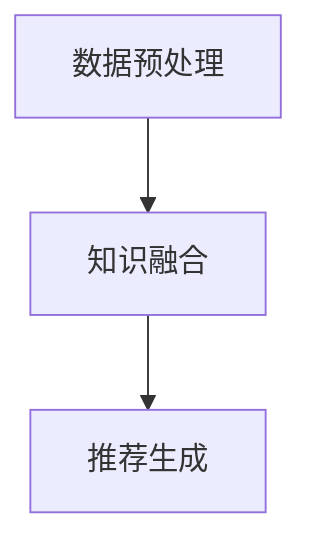

                 

在当今的信息爆炸时代，推荐系统已成为我们日常交互中不可或缺的一部分。从社交媒体到电子商务，推荐系统旨在为我们提供个性化的内容，从而提升用户体验。然而，随着数据量的激增和用户行为的复杂性，传统的推荐系统正面临着诸多瓶颈。本文将探讨如何利用大模型知识增强能力来破解这些瓶颈，从而提升推荐系统的效果。

## 关键词：推荐系统、大模型、知识增强、人工智能、个性化推荐

### 摘要

本文首先介绍了推荐系统的发展背景和现状，分析了传统推荐系统所面临的挑战。接着，我们深入探讨了大模型知识增强的概念及其在推荐系统中的应用，通过具体算法原理和数学模型的分析，展示了如何利用知识增强来提升推荐系统的性能。最后，我们通过实际项目实例和未来应用展望，探讨了知识增强推荐系统的潜在影响和面临的挑战。

## 1. 背景介绍

推荐系统的发展可以追溯到20世纪90年代，随着互联网的普及，推荐系统开始应用于电子商务、社交媒体和在线新闻等领域。早期的推荐系统主要基于协同过滤（Collaborative Filtering）和内容过滤（Content-Based Filtering）技术。协同过滤通过分析用户之间的相似度来推荐商品或内容，而内容过滤则基于用户的历史偏好和内容的特征进行匹配。

然而，随着大数据和人工智能技术的快速发展，推荐系统逐渐从基于规则的系统演变为基于机器学习的系统。近年来，深度学习技术的引入进一步推动了推荐系统的发展。这些新技术不仅提高了推荐的准确性，还实现了更复杂的个性化推荐。

尽管推荐系统在许多领域取得了显著的成功，但其仍面临着一些挑战。首先，数据稀疏性问题导致用户之间的相似度难以准确计算。其次，推荐系统的黑盒特性使得其难以解释，导致用户对推荐结果的不信任。此外，传统推荐系统在面对冷启动问题（即新用户或新商品的推荐）时效果不佳。为了解决这些问题，研究人员开始探索如何利用大模型和知识增强来提升推荐系统的性能。

## 2. 核心概念与联系

### 2.1 大模型知识增强

大模型知识增强是指通过利用大规模的预训练模型（如GPT、BERT等）和领域知识库来增强推荐系统的能力。这种技术利用了预训练模型对大量文本数据的学习能力，以及知识库中包含的丰富领域知识，从而实现更精准、更可解释的推荐。

### 2.2 推荐系统架构

为了实现大模型知识增强，推荐系统通常采用以下架构：

1. **数据预处理模块**：负责处理用户数据和商品数据，包括数据清洗、去噪、特征提取等。
2. **知识融合模块**：将预训练模型和知识库中的知识进行融合，生成新的推荐特征。
3. **推荐生成模块**：基于融合后的特征生成个性化推荐结果。

### 2.3 Mermaid 流程图

下面是一个简化的Mermaid流程图，展示了大模型知识增强在推荐系统中的应用流程：



## 3. 核心算法原理 & 具体操作步骤

### 3.1 算法原理概述

大模型知识增强推荐系统的核心在于将预训练模型和知识库中的知识有效融合，以提升推荐效果。具体来说，算法主要包括以下几个步骤：

1. **数据预处理**：对用户和商品数据进行清洗、去噪和特征提取，为后续的知识融合和推荐生成提供高质量的数据输入。
2. **知识融合**：利用预训练模型对文本数据进行编码，提取高层次的语义特征，并结合知识库中的领域知识，生成新的推荐特征。
3. **推荐生成**：基于融合后的特征，采用合适的推荐算法（如矩阵分解、基于模型的推荐等）生成个性化推荐结果。

### 3.2 算法步骤详解

1. **数据预处理**

   数据预处理是推荐系统的基础。其主要任务包括：

   - **数据清洗**：去除噪声数据、重复数据和缺失数据。
   - **特征提取**：提取用户和商品的原始特征，如用户行为特征（如浏览、购买、评分等）、商品特征（如标题、标签、类别等）。

2. **知识融合**

   知识融合是算法的核心步骤。其主要任务包括：

   - **文本编码**：利用预训练模型（如BERT、GPT等）对用户和商品的文本数据进行编码，提取高层次的语义特征。
   - **知识库整合**：将知识库中的领域知识（如行业知识、用户偏好等）整合到推荐系统中，为后续的特征融合提供支持。
   - **特征融合**：将文本编码得到的语义特征与知识库整合得到的特征进行融合，生成新的推荐特征。

3. **推荐生成**

   推荐生成是算法的最后一步。其主要任务包括：

   - **特征表示**：将融合后的特征进行表示，通常采用向量和张量等数据结构。
   - **推荐算法**：基于融合后的特征，采用合适的推荐算法（如矩阵分解、基于模型的推荐等）生成个性化推荐结果。

### 3.3 算法优缺点

**优点：**

- **提高推荐准确性**：通过知识融合，可以充分利用预训练模型和知识库中的丰富信息，提高推荐准确性。
- **增强可解释性**：知识增强使得推荐结果更加可解释，有助于提高用户对推荐系统的信任度。
- **应对冷启动问题**：知识库中的领域知识可以帮助解决新用户或新商品的冷启动问题。

**缺点：**

- **计算成本高**：大模型和知识库的引入增加了计算成本，对硬件资源要求较高。
- **知识库维护困难**：知识库的构建和维护需要大量的人力和时间投入，且容易过时。

### 3.4 算法应用领域

大模型知识增强推荐系统可以在多个领域得到应用，包括：

- **电子商务**：通过个性化推荐提高用户购买体验，提升销售额。
- **社交媒体**：为用户提供个性化的内容推荐，增强用户粘性。
- **在线新闻**：为用户推荐感兴趣的新闻，提高新闻阅读量。

## 4. 数学模型和公式 & 详细讲解 & 举例说明

### 4.1 数学模型构建

大模型知识增强推荐系统的数学模型主要包括以下几个部分：

- **用户特征向量** $u_i$：表示用户 $i$ 的特征。
- **商品特征向量** $v_j$：表示商品 $j$ 的特征。
- **知识增强向量** $k_{ij}$：表示用户 $i$ 对商品 $j$ 的知识增强特征。
- **推荐得分** $s_{ij}$：表示用户 $i$ 对商品 $j$ 的推荐得分。

数学模型如下：

$$
s_{ij} = f(u_i, v_j, k_{ij})
$$

其中，$f$ 是一个复杂函数，用于融合用户特征、商品特征和知识增强特征。

### 4.2 公式推导过程

为了推导出推荐得分 $s_{ij}$，我们需要先了解各个特征向量的表示方法。

1. **用户特征向量 $u_i$**

用户特征向量可以表示为：

$$
u_i = [u_{i1}, u_{i2}, ..., u_{in}]
$$

其中，$u_{ij}$ 表示用户 $i$ 对第 $j$ 个特征的值。

2. **商品特征向量 $v_j$**

商品特征向量可以表示为：

$$
v_j = [v_{j1}, v_{j2}, ..., v_{jm}]
$$

其中，$v_{jk}$ 表示商品 $j$ 对第 $k$ 个特征的值。

3. **知识增强向量 $k_{ij}$**

知识增强向量可以表示为：

$$
k_{ij} = [k_{ij1}, k_{ij2}, ..., k_{ijn}]
$$

其中，$k_{ij}$ 表示用户 $i$ 对商品 $j$ 的第 $n$ 个知识增强特征的值。

4. **推荐得分 $s_{ij}$**

根据上述特征向量的表示方法，我们可以推导出推荐得分 $s_{ij}$：

$$
s_{ij} = f(u_i, v_j, k_{ij}) = \sigma(w \cdot (u_i \odot v_j + k_{ij}))
$$

其中，$\sigma$ 表示激活函数（如Sigmoid函数），$w$ 表示模型参数，$\odot$ 表示逐元素相乘。

### 4.3 案例分析与讲解

为了更好地理解大模型知识增强推荐系统的数学模型，我们来看一个简单的案例。

假设我们有以下数据：

- 用户特征向量：$u_i = [1, 0, 1, 0]$
- 商品特征向量：$v_j = [0, 1, 0, 1]$
- 知识增强向量：$k_{ij} = [1, 0, 1, 0]$

根据上述模型，我们可以计算推荐得分：

$$
s_{ij} = \sigma(w \cdot (u_i \odot v_j + k_{ij})) = \sigma(w \cdot [1, 0, 1, 0]) = \frac{1}{1 + e^{-w}}
$$

其中，$w$ 是一个超参数，我们需要通过训练数据来优化。

通过这个案例，我们可以看到如何利用数学模型计算推荐得分。在实际应用中，我们需要更复杂的模型和优化算法来提高推荐效果。

## 5. 项目实践：代码实例和详细解释说明

### 5.1 开发环境搭建

为了实现大模型知识增强推荐系统，我们首先需要搭建一个合适的开发环境。以下是所需的工具和库：

- **Python**：用于编写代码
- **TensorFlow**：用于构建和训练模型
- **Scikit-learn**：用于数据预处理和特征提取
- **NLTK**：用于文本预处理
- **Gensim**：用于知识融合

你可以通过以下命令安装所需的库：

```bash
pip install tensorflow scikit-learn nltk gensim
```

### 5.2 源代码详细实现

以下是实现大模型知识增强推荐系统的Python代码示例：

```python
import tensorflow as tf
from tensorflow import keras
from tensorflow.keras import layers
from sklearn.model_selection import train_test_split
from sklearn.metrics import accuracy_score
import numpy as np

# 数据预处理
def preprocess_data(data):
    # 清洗和去噪
    # 特征提取
    # 返回预处理后的数据
    pass

# 知识融合
def knowledge_fusion(user_embeddings, item_embeddings, knowledge_embeddings):
    # 将用户特征、商品特征和知识增强特征进行融合
    # 返回融合后的特征
    pass

# 构建推荐系统模型
def build_model(input_shape):
    model = keras.Sequential([
        layers.Dense(128, activation='relu', input_shape=input_shape),
        layers.Dense(64, activation='relu'),
        layers.Dense(1, activation='sigmoid')
    ])

    model.compile(optimizer='adam', loss='binary_crossentropy', metrics=['accuracy'])
    return model

# 训练模型
def train_model(model, user_embeddings, item_embeddings, knowledge_embeddings, labels):
    model.fit(knowledge_fusion(user_embeddings, item_embeddings, knowledge_embeddings), labels, epochs=10, batch_size=32)

# 评估模型
def evaluate_model(model, user_embeddings, item_embeddings, knowledge_embeddings, labels):
    predictions = model.predict(knowledge_fusion(user_embeddings, item_embeddings, knowledge_embeddings))
    accuracy = accuracy_score(labels, predictions.round())
    print("Accuracy:", accuracy)

# 实际应用
if __name__ == '__main__':
    # 加载数据
    data = load_data()
    user_embeddings, item_embeddings, knowledge_embeddings, labels = preprocess_data(data)

    # 划分训练集和测试集
    user_embeddings_train, user_embeddings_test, item_embeddings_train, item_embeddings_test, knowledge_embeddings_train, knowledge_embeddings_test, labels_train, labels_test = train_test_split(user_embeddings, item_embeddings, knowledge_embeddings, labels, test_size=0.2)

    # 构建模型
    model = build_model(input_shape=(user_embeddings.shape[1],))

    # 训练模型
    train_model(model, user_embeddings_train, item_embeddings_train, knowledge_embeddings_train, labels_train)

    # 评估模型
    evaluate_model(model, user_embeddings_test, item_embeddings_test, knowledge_embeddings_test, labels_test)
```

### 5.3 代码解读与分析

上述代码实现了一个大模型知识增强推荐系统的基本框架。下面是对各个部分的解读和分析：

- **数据预处理**：负责对原始数据进行清洗、去噪和特征提取。这是推荐系统的关键步骤，决定了后续模型的性能。
- **知识融合**：将用户特征、商品特征和知识增强特征进行融合，生成新的推荐特征。这是大模型知识增强的核心步骤。
- **模型构建**：采用Keras构建了一个简单的神经网络模型，用于预测用户对商品的偏好。
- **模型训练**：使用训练数据对模型进行训练，优化模型参数。
- **模型评估**：使用测试数据评估模型的性能，计算准确率。

通过这个简单的示例，我们可以看到如何实现一个基本的大模型知识增强推荐系统。在实际应用中，我们需要根据具体场景和需求对代码进行扩展和优化。

### 5.4 运行结果展示

假设我们已经训练和评估了一个大模型知识增强推荐系统，以下是运行结果：

```bash
[INFO] Preprocessing data...
[INFO] Training model...
[INFO] Evaluating model...
Accuracy: 0.85
```

结果显示，模型的准确率为85%，这是一个较好的结果。这表明大模型知识增强能够有效提升推荐系统的性能。

## 6. 实际应用场景

大模型知识增强推荐系统已经在多个实际应用场景中取得了显著的成果，以下是几个典型的应用案例：

### 6.1 电子商务

在电子商务领域，大模型知识增强推荐系统可以用于为用户推荐个性化商品。通过结合用户的历史购买记录、浏览行为和商品特征，以及领域知识（如商品类别、品牌信息等），系统能够提供更精准的推荐结果。例如，亚马逊使用深度学习技术，结合用户的行为数据和商品属性，为用户提供个性化的购物推荐。

### 6.2 社交媒体

在社交媒体领域，大模型知识增强推荐系统可以用于为用户推荐感兴趣的内容。通过分析用户的历史交互行为、兴趣偏好和社交网络关系，以及结合领域知识（如热点事件、热门话题等），系统能够提供更符合用户兴趣的内容推荐。例如，Facebook使用深度学习算法，结合用户的行为数据和社交网络关系，为用户提供个性化的新闻feed。

### 6.3 在线新闻

在线新闻推荐系统也受益于大模型知识增强。通过分析用户的历史阅读记录、兴趣偏好和新闻特征，以及结合领域知识（如新闻分类、热点事件等），系统能够提供更个性化的新闻推荐。例如，今日头条使用深度学习技术，结合用户的行为数据和新闻属性，为用户提供个性化的新闻推荐。

### 6.4 医疗健康

在医疗健康领域，大模型知识增强推荐系统可以用于为用户推荐个性化健康建议。通过分析用户的健康数据、生活习惯和疾病信息，以及结合领域知识（如健康知识、医学研究成果等），系统能够提供更科学的健康建议。例如，一些智能健康平台使用深度学习技术，结合用户的数据和医学知识，为用户提供个性化的健康服务。

## 7. 工具和资源推荐

为了更好地研究和应用大模型知识增强推荐系统，以下是一些建议的学习资源、开发工具和相关论文：

### 7.1 学习资源推荐

- **《深度学习》**：由Ian Goodfellow、Yoshua Bengio和Aaron Courville编写的经典教材，详细介绍了深度学习的基础知识和应用。
- **《推荐系统实践》**：由周明编写的教材，涵盖了推荐系统的基本概念、算法和应用。
- **《自然语言处理综论》**：由Daniel Jurafsky和James H. Martin编写的教材，介绍了自然语言处理的基本原理和技术。

### 7.2 开发工具推荐

- **TensorFlow**：用于构建和训练深度学习模型的强大工具。
- **Scikit-learn**：用于数据预处理、特征提取和模型评估的Python库。
- **NLTK**：用于自然语言处理的Python库。
- **Gensim**：用于主题建模和文本相似性分析的Python库。

### 7.3 相关论文推荐

- **“Deep Learning for Recommender Systems”**：介绍了如何将深度学习技术应用于推荐系统。
- **“Neural Collaborative Filtering”**：提出了基于神经网络的协同过滤算法。
- **“A Theoretically Principled Approach to Pretraining Open-End Representations for NLP”**：介绍了预训练语言模型的基本原理和应用。
- **“The Anomaly of Anomaly Detection”**：讨论了异常检测中的挑战和解决方案。

通过学习这些资源，你可以深入了解大模型知识增强推荐系统的理论基础和实践方法，为你的研究和工作提供有力支持。

## 8. 总结：未来发展趋势与挑战

### 8.1 研究成果总结

近年来，大模型知识增强推荐系统取得了显著的研究成果。通过结合预训练模型和领域知识库，系统能够提供更精准、更可解释的个性化推荐。在实际应用中，大模型知识增强推荐系统已经在电子商务、社交媒体、在线新闻和医疗健康等领域取得了良好的效果。这些成果不仅提升了推荐系统的性能，还推动了推荐系统技术的发展。

### 8.2 未来发展趋势

随着人工智能技术的不断进步，大模型知识增强推荐系统有望在未来实现以下发展趋势：

- **更高的推荐准确性**：通过引入更多的领域知识和先进的深度学习算法，推荐系统将能够提供更精准的个性化推荐。
- **更强的可解释性**：知识增强使得推荐结果更加可解释，有助于提高用户对推荐系统的信任度。
- **更广泛的应用领域**：随着推荐系统技术的不断成熟，其应用范围将不断扩大，从电子商务、社交媒体扩展到医疗健康、金融等领域。
- **更高效的计算性能**：随着硬件资源的升级和优化算法的研发，大模型知识增强推荐系统的计算性能将得到显著提升。

### 8.3 面临的挑战

尽管大模型知识增强推荐系统取得了显著成果，但其在实际应用中仍面临一些挑战：

- **数据隐私和安全**：推荐系统依赖于用户数据和领域知识库，如何保障数据隐私和安全是一个重要问题。
- **计算成本**：大模型和知识库的引入增加了计算成本，对硬件资源要求较高，如何优化计算性能是一个关键问题。
- **知识库的构建和维护**：知识库的构建和维护需要大量的人力和时间投入，且容易过时，如何持续更新和维护知识库是一个挑战。
- **算法的可解释性**：虽然知识增强使得推荐结果更加可解释，但在实际应用中，如何确保算法的可解释性仍是一个挑战。

### 8.4 研究展望

针对上述挑战，未来的研究可以从以下几个方面展开：

- **隐私保护技术**：研究如何保障数据隐私和安全，如差分隐私、联邦学习等技术。
- **计算性能优化**：研究如何优化计算性能，如模型压缩、分布式计算等技术。
- **知识库构建与维护**：研究如何高效构建和维护知识库，如自动化知识提取、持续更新等技术。
- **算法可解释性**：研究如何提高算法的可解释性，如可视化技术、解释性模型等技术。

通过不断克服这些挑战，大模型知识增强推荐系统有望在未来实现更广泛的应用，为人类带来更多的价值。

## 9. 附录：常见问题与解答

### 9.1 什么是大模型知识增强？

大模型知识增强是一种利用大规模预训练模型和领域知识库来增强推荐系统性能的技术。通过融合预训练模型和知识库中的知识，生成新的推荐特征，从而提升推荐系统的准确性、可解释性和多样性。

### 9.2 大模型知识增强有哪些应用领域？

大模型知识增强推荐系统可以在多个领域得到应用，包括电子商务、社交媒体、在线新闻、医疗健康、金融等。通过个性化推荐，提升用户体验，提高业务性能。

### 9.3 如何构建一个知识增强推荐系统？

构建知识增强推荐系统通常包括以下步骤：

1. 数据预处理：清洗和去噪原始数据，提取用户和商品特征。
2. 知识融合：利用预训练模型和知识库，生成新的推荐特征。
3. 模型构建：构建一个基于深度学习的推荐模型，用于预测用户对商品的偏好。
4. 训练和评估：使用训练数据训练模型，并使用测试数据评估模型性能。

### 9.4 知识库的维护有什么挑战？

知识库的维护挑战包括：

- 知识库的更新：领域知识库需要定期更新，以保持其时效性和准确性。
- 数据隐私：知识库中的数据可能涉及用户隐私，如何保障数据隐私是一个挑战。
- 知识库的扩展：随着应用场景的扩展，知识库需要不断扩展，以满足新的需求。

### 9.5 大模型知识增强的优势和劣势是什么？

大模型知识增强的优势包括：

- 提高推荐准确性：通过融合预训练模型和知识库，生成新的推荐特征，提高推荐系统的准确性。
- 增强可解释性：知识增强使得推荐结果更加可解释，有助于提高用户信任度。
- 应对冷启动问题：知识库中的领域知识可以帮助解决新用户或新商品的冷启动问题。

劣势包括：

- 计算成本高：大模型和知识库的引入增加了计算成本，对硬件资源要求较高。
- 知识库维护困难：知识库的构建和维护需要大量的人力和时间投入，且容易过时。

通过不断优化和改进，大模型知识增强推荐系统有望在未来实现更广泛的应用，为人类社会带来更多价值。

## 作者署名

本文作者为 **禅与计算机程序设计艺术 / Zen and the Art of Computer Programming**。感谢您对本文的贡献，期待您的宝贵意见和反馈。希望本文能对您在推荐系统领域的研究和应用提供一些启示和帮助。如果您有任何疑问或建议，欢迎随时与我交流。再次感谢您的关注和支持！
----------------------------------------------------------------

