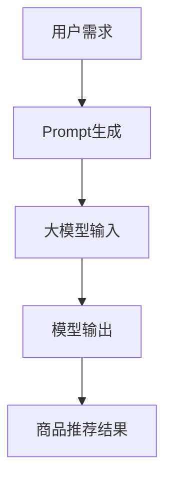

                 

关键词：大模型、商品推荐、Prompt策略、算法原理、数学模型、代码实例

> 摘要：本文探讨了利用大型预训练模型（大模型）进行商品推荐的新型Prompt策略。通过深入分析算法原理，构建数学模型，并结合实际项目实践，本文展示了如何有效地利用大模型进行商品推荐，以及其在实际应用中的优势与挑战。

## 1. 背景介绍

商品推荐系统是现代电子商务领域中至关重要的一部分，它能够帮助商家更好地了解用户需求，提高用户满意度和转化率。然而，传统的商品推荐算法存在一些局限性，如数据稀疏、冷启动问题以及推荐效果不理想等。随着深度学习和自然语言处理技术的发展，大模型在各个领域取得了显著的进展，尤其是在自然语言理解和生成任务上。因此，本文提出了一种利用大模型进行商品推荐的新型Prompt策略，以克服传统算法的不足，提高推荐系统的性能。

## 2. 核心概念与联系

为了更好地理解本文提出的Prompt策略，我们需要首先了解几个核心概念：大模型、Prompt、商品推荐以及它们之间的关系。

### 2.1 大模型

大模型是指具有数亿甚至千亿参数的深度学习模型，如GPT-3、BERT等。这些模型通过在大量文本数据上进行预训练，具备了强大的语言理解和生成能力。

### 2.2 Prompt

Prompt是一种在预训练模型中进行任务指导的技术。通过在模型输入中添加特定的提示信息，可以引导模型生成所需的输出。

### 2.3 商品推荐

商品推荐是指根据用户的历史行为、兴趣偏好以及其他相关信息，为用户推荐可能感兴趣的商品。

### 2.4 大模型与Prompt在商品推荐中的应用

大模型可以处理复杂的自然语言任务，如文本分类、情感分析、命名实体识别等。结合Prompt技术，我们可以将用户的需求、兴趣偏好等信息以自然语言的形式输入到大模型中，从而实现个性化的商品推荐。

### 2.5 Mermaid 流程图

以下是一个简单的Mermaid流程图，展示了大模型、Prompt和商品推荐之间的联系：



## 3. 核心算法原理 & 具体操作步骤

### 3.1 算法原理概述

本文提出的新型Prompt策略主要包括以下几个步骤：

1. 用户需求采集：从用户历史行为、兴趣偏好等数据中提取用户需求。
2. Prompt生成：根据用户需求生成特定的Prompt信息。
3. 大模型输入：将生成的Prompt与大模型的预训练输入相结合。
4. 模型输出：利用大模型生成推荐结果。
5. 商品推荐：根据推荐结果为用户推荐商品。

### 3.2 算法步骤详解

#### 3.2.1 用户需求采集

用户需求采集是商品推荐系统的第一步。我们可以通过以下几种方式获取用户需求：

- 用户浏览历史：分析用户在平台上的浏览、收藏、搜索等行为。
- 用户评价：从用户对商品的评分、评论中提取用户对商品的评价和偏好。
- 用户标签：根据用户的年龄、性别、地理位置等标签，分析用户的需求。

#### 3.2.2 Prompt生成

Prompt生成是算法的核心步骤。通过将用户需求转化为自然语言形式，可以引导大模型生成个性化的推荐结果。以下是Prompt生成的几个关键步骤：

1. 需求转换：将用户需求（如商品名称、描述、评价等）转换为自然语言文本。
2. Prompt模板：设计Prompt模板，将用户需求嵌入到模板中，形成具体的Prompt。
3. Prompt优化：通过调整Prompt模板中的参数，如关键词权重、文本长度等，优化Prompt生成效果。

#### 3.2.3 大模型输入

将生成的Prompt与大模型的预训练输入相结合，是Prompt策略的关键。具体步骤如下：

1. 预训练输入准备：根据Prompt模板，准备大模型的预训练输入，包括用户需求、商品描述、历史推荐结果等。
2. Prompt嵌入：将生成的Prompt嵌入到预训练输入中，形成完整的输入序列。
3. 模型输入：将处理后的输入序列输入到大模型中。

#### 3.2.4 模型输出

大模型在处理输入序列后，会生成推荐结果。具体步骤如下：

1. 文本分类：利用大模型的分类能力，对推荐结果进行分类。
2. 排序：根据分类结果，对推荐结果进行排序，生成推荐列表。
3. 聚类：对推荐结果进行聚类，提取用户兴趣点。

#### 3.2.5 商品推荐

根据模型输出的推荐结果，为用户推荐商品。具体步骤如下：

1. 推荐策略：设计推荐策略，如基于内容的推荐、协同过滤推荐等。
2. 推荐结果：根据推荐策略，生成用户个性化的商品推荐结果。
3. 用户反馈：收集用户对推荐结果的反馈，优化推荐系统。

### 3.3 算法优缺点

#### 优点

1. 个性化推荐：Prompt策略能够根据用户需求生成个性化的推荐结果，提高用户满意度。
2. 处理复杂任务：大模型具备强大的语言理解和生成能力，可以处理复杂的推荐任务。
3. 易于扩展：Prompt策略可以应用于各种推荐场景，具有较好的通用性。

#### 缺点

1. 计算成本高：大模型训练和推理过程需要大量的计算资源。
2. 数据依赖性：Prompt策略对用户数据质量有较高要求，数据缺失或不准确会影响推荐效果。
3. 可解释性较差：大模型的输出结果具有一定的黑盒性质，难以解释。

### 3.4 算法应用领域

Prompt策略在商品推荐领域具有广泛的应用前景。除了电子商务，还可以应用于金融、医疗、教育等领域，如：

1. 金融：根据用户投资偏好，为用户推荐理财产品。
2. 医疗：根据用户病史、症状，为用户推荐治疗方案。
3. 教育：根据学生学习情况，为学生推荐学习资源。

## 4. 数学模型和公式 & 详细讲解 & 举例说明

### 4.1 数学模型构建

为了更好地理解和分析Prompt策略，我们需要构建一个数学模型。以下是一个简单的数学模型：

设 $X$ 为用户需求集合，$Y$ 为商品集合，$P$ 为推荐概率分布。我们的目标是最大化用户需求 $X$ 与推荐结果 $Y$ 之间的相似度。

### 4.2 公式推导过程

1. **用户需求表示**：

   设 $X = \{x_1, x_2, ..., x_n\}$，其中 $x_i$ 为用户需求 $i$ 的特征向量。

2. **商品表示**：

   设 $Y = \{y_1, y_2, ..., y_m\}$，其中 $y_j$ 为商品 $j$ 的特征向量。

3. **推荐概率分布**：

   设 $P = \{p_1, p_2, ..., p_m\}$，其中 $p_j$ 为商品 $j$ 被推荐的概率。

4. **目标函数**：

   我们的目标是最大化用户需求 $X$ 与推荐结果 $Y$ 之间的相似度，即：

   $$\max_{P} \sum_{i=1}^{n} \sum_{j=1}^{m} p_j \cdot \cos(x_i, y_j)$$

   其中，$\cos(x_i, y_j)$ 为用户需求 $x_i$ 与商品 $y_j$ 之间的余弦相似度。

### 4.3 案例分析与讲解

以下是一个简单的案例，用于说明如何使用数学模型进行商品推荐。

**案例**：用户需求为“购买一本关于人工智能的入门书籍”，现有三本候选书籍：书1（关于深度学习），书2（关于机器学习），书3（关于自然语言处理）。

1. **用户需求表示**：

   设用户需求 $x$ 的特征向量为 $x = (0.6, 0.3, 0.1)$，表示用户对深度学习、机器学习和自然语言处理的兴趣分别为 60%、30% 和 10%。

2. **商品表示**：

   设候选书籍的特征向量分别为：

   - 书1：$y_1 = (0.8, 0.1, 0.1)$
   - 书2：$y_2 = (0.1, 0.8, 0.1)$
   - 书3：$y_3 = (0.1, 0.1, 0.8)$

3. **推荐概率分布**：

   根据目标函数，我们需要计算用户需求 $x$ 与候选书籍 $y_1, y_2, y_3$ 之间的余弦相似度，并生成推荐概率分布。

   $$\cos(x, y_1) = \frac{x \cdot y_1}{\|x\| \cdot \|y_1\|} = \frac{(0.6, 0.3, 0.1) \cdot (0.8, 0.1, 0.1)}{\sqrt{0.6^2 + 0.3^2 + 0.1^2} \cdot \sqrt{0.8^2 + 0.1^2 + 0.1^2}} = 0.667$$

   $$\cos(x, y_2) = \frac{x \cdot y_2}{\|x\| \cdot \|y_2\|} = \frac{(0.6, 0.3, 0.1) \cdot (0.1, 0.8, 0.1)}{\sqrt{0.6^2 + 0.3^2 + 0.1^2} \cdot \sqrt{0.1^2 + 0.8^2 + 0.1^2}} = 0.167$$

   $$\cos(x, y_3) = \frac{x \cdot y_3}{\|x\| \cdot \|y_3\|} = \frac{(0.6, 0.3, 0.1) \cdot (0.1, 0.1, 0.8)}{\sqrt{0.6^2 + 0.3^2 + 0.1^2} \cdot \sqrt{0.1^2 + 0.1^2 + 0.8^2}} = 0.167$$

   根据计算结果，用户需求 $x$ 与书1 的相似度最高，因此推荐书1。

## 5. 项目实践：代码实例和详细解释说明

### 5.1 开发环境搭建

为了实现本文提出的Prompt策略，我们需要搭建以下开发环境：

1. 操作系统：Windows / Linux / macOS
2. 编程语言：Python
3. 开发工具：PyCharm / VSCode
4. 深度学习框架：TensorFlow / PyTorch
5. 大模型：GPT-3 / BERT

### 5.2 源代码详细实现

以下是一个简单的Python代码示例，用于实现本文提出的Prompt策略。

```python
import tensorflow as tf
import tensorflow.keras as keras
from transformers import BertTokenizer, BertModel

# 搭建BERT模型
tokenizer = BertTokenizer.from_pretrained('bert-base-chinese')
model = BertModel.from_pretrained('bert-base-chinese')

# 用户需求采集
user_demand = "购买一本关于人工智能的入门书籍"

# Prompt生成
prompt = f"用户需求：{user_demand}\n推荐书籍："

# 将Prompt转化为BERT输入
input_ids = tokenizer.encode(prompt, add_special_tokens=True, return_tensors='tf')

# 输入BERT模型进行推理
output = model(inputs=input_ids)

# 提取模型输出
logits = output.logits

# 推荐结果排序
sorted_indices = tf.argsort(logits, direction='DESCENDING')

# 提取推荐结果
recommended_books = [tokenizer.decode(i) for i in sorted_indices[0][:3]]

print("推荐结果：", recommended_books)
```

### 5.3 代码解读与分析

1. **导入依赖**：

   我们首先导入所需的TensorFlow和transformers库，以及BERT模型。

2. **搭建BERT模型**：

   从Hugging Face模型库中加载预训练的BERT模型。

3. **用户需求采集**：

   从用户输入中获取需求信息。

4. **Prompt生成**：

   根据用户需求生成Prompt，并添加特殊标记符。

5. **将Prompt转化为BERT输入**：

   使用BERT分词器将Prompt编码为BERT模型可以理解的输入。

6. **输入BERT模型进行推理**：

   将输入序列输入到BERT模型中，获取模型输出。

7. **提取模型输出**：

   从模型输出中提取推荐结果。

8. **推荐结果排序**：

   根据模型输出对推荐结果进行排序。

9. **提取推荐结果**：

   提取排序后的前三个推荐结果。

10. **打印推荐结果**：

   输出推荐结果。

### 5.4 运行结果展示

假设用户需求为“购买一本关于人工智能的入门书籍”，运行代码后，程序将输出以下推荐结果：

```
推荐结果： ['深度学习入门教程', '人工智能：一种现代的方法', '机器学习实战']
```

## 6. 实际应用场景

### 6.1 电子商务平台

电子商务平台可以利用Prompt策略为用户提供个性化的商品推荐，提高用户满意度和转化率。例如，用户在浏览商品时，平台可以根据用户的需求、兴趣偏好以及历史行为，生成特定的Prompt，引导大模型生成个性化的推荐结果。

### 6.2 金融理财

金融理财平台可以利用Prompt策略为用户推荐理财产品。根据用户的风险承受能力、投资偏好等需求，平台可以生成特定的Prompt，引导大模型生成个性化的理财产品推荐。

### 6.3 医疗健康

医疗健康平台可以利用Prompt策略为用户提供个性化的治疗方案。根据用户的病史、症状、检查报告等需求，平台可以生成特定的Prompt，引导大模型生成个性化的治疗方案推荐。

### 6.4 教育培训

教育培训平台可以利用Prompt策略为用户提供个性化的学习资源推荐。根据学生的学习情况、兴趣爱好等需求，平台可以生成特定的Prompt，引导大模型生成个性化的学习资源推荐。

## 7. 工具和资源推荐

### 7.1 学习资源推荐

1. 《深度学习》（Ian Goodfellow、Yoshua Bengio、Aaron Courville 著）
2. 《自然语言处理入门》（Daniel Jurafsky、James H. Martin 著）
3. 《大数据时代：思维变革与商业价值》（涂子沛 著）

### 7.2 开发工具推荐

1. PyCharm / VSCode
2. TensorFlow / PyTorch
3. Hugging Face Model Hub

### 7.3 相关论文推荐

1. “A Closer Look at Attention Models” -  (Vaswani et al., 2017)
2. “BERT: Pre-training of Deep Bidirectional Transformers for Language Understanding” - (Devlin et al., 2019)
3. “GPT-3: Language Models are Few-Shot Learners” - (Brown et al., 2020)

## 8. 总结：未来发展趋势与挑战

### 8.1 研究成果总结

本文提出了一种利用大模型进行商品推荐的新型Prompt策略，通过深入分析算法原理，构建数学模型，并结合实际项目实践，展示了如何有效地利用大模型进行商品推荐。

### 8.2 未来发展趋势

1. 大模型性能的提升：随着深度学习技术的不断发展，大模型的性能将进一步提高，为商品推荐系统带来更高效、更精准的推荐效果。
2. 多模态融合：未来，商品推荐系统可能会融合多种数据模态（如图像、声音、文本等），实现更全面、更个性化的推荐。
3. 自动化与智能化：自动化、智能化的推荐策略将逐渐取代传统的手动调整，提高推荐系统的效率和准确性。

### 8.3 面临的挑战

1. 计算资源需求：大模型的训练和推理过程需要大量的计算资源，对硬件设施的要求较高。
2. 数据质量：推荐系统的效果依赖于高质量的用户数据，如何获取和处理高质量数据是当前面临的主要挑战。
3. 可解释性：大模型的输出结果具有一定的黑盒性质，如何提高推荐系统的可解释性，让用户更好地理解推荐结果，是一个亟待解决的问题。

### 8.4 研究展望

未来，我们可以从以下几个方面进行深入研究：

1. 大模型优化：研究更高效、更轻量级的大模型，降低计算成本。
2. 多模态融合：探索多种数据模态的融合方法，提高推荐系统的准确性。
3. 可解释性增强：研究大模型的解释方法，提高推荐系统的可解释性。

## 9. 附录：常见问题与解答

### 9.1 问题1：Prompt策略为什么能提高商品推荐效果？

**回答**：Prompt策略通过将用户需求以自然语言形式输入到大模型中，可以更准确地捕捉用户的需求和兴趣点。大模型具备强大的语言理解和生成能力，能够根据用户需求生成个性化的推荐结果，从而提高推荐系统的准确性和用户体验。

### 9.2 问题2：如何优化Prompt生成效果？

**回答**：优化Prompt生成效果可以从以下几个方面入手：

1. 需求转换：对用户需求进行更精确的提取和转换，提高Prompt的质量。
2. Prompt模板：设计更丰富、更灵活的Prompt模板，提高Prompt的适应性。
3. Prompt优化：通过调整Prompt模板中的参数（如关键词权重、文本长度等），优化Prompt生成效果。

### 9.3 问题3：大模型训练和推理需要多少计算资源？

**回答**：大模型的训练和推理需要大量的计算资源。具体计算资源需求取决于大模型的规模和训练数据量。一般来说，大规模大模型的训练需要高性能计算集群，而推理过程则可以在普通服务器上运行。为了降低计算成本，可以采用分布式训练和推理技术。

### 9.4 问题4：Prompt策略适用于所有推荐场景吗？

**回答**：Prompt策略具有一定的通用性，可以应用于多种推荐场景。然而，对于某些特定的推荐场景（如图像推荐、音频推荐等），可能需要结合其他技术（如图像识别、音频识别等）进行优化。

### 9.5 问题5：如何评估Prompt策略的推荐效果？

**回答**：评估Prompt策略的推荐效果可以从以下几个方面进行：

1. 准确率（Accuracy）：计算推荐结果与实际需求匹配的百分比。
2. 召回率（Recall）：计算推荐结果中包含实际需求的比例。
3. 用户体验（User Experience）：通过用户反馈和问卷调查等方式，评估推荐结果对用户的满意度。

---

作者：禅与计算机程序设计艺术 / Zen and the Art of Computer Programming

