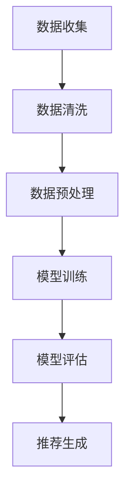

                 

关键词：大模型、数据清洗、推荐系统、预处理、算法、实践

> 摘要：本文深入探讨了利用大模型进行推荐场景的数据清洗与预处理的方法和技巧。通过分析数据清洗与预处理的重要性，我们探讨了当前流行的数据清洗工具和算法，并详细介绍了大模型在数据预处理中的优势和应用场景。同时，本文通过实际项目案例展示了数据清洗与预处理的具体操作步骤，为推荐系统的构建提供了有力的技术支持。

## 1. 背景介绍

随着互联网和大数据技术的飞速发展，推荐系统已经成为各行业提升用户体验、增加用户黏性和转化率的重要手段。然而，推荐系统的核心——数据，往往面临着质量参差不齐、格式多样、噪声污染等问题。因此，数据清洗与预处理成为推荐系统开发中不可或缺的一环。

传统数据清洗与预处理方法依赖于一系列手动操作和规则化处理，效率较低且容易出现错误。随着深度学习和大数据技术的发展，大模型在数据处理领域的应用逐渐兴起，为数据清洗与预处理提供了全新的解决方案。

本文将探讨如何利用大模型进行推荐场景的数据清洗与预处理，从算法原理、实践操作、应用领域等多个角度进行深入分析，旨在为推荐系统的开发者提供有益的参考和指导。

## 2. 核心概念与联系

### 2.1 数据清洗与预处理

数据清洗（Data Cleaning）是指从原始数据中去除错误、重复、无效或不完整的数据，以提高数据的质量和准确性。数据预处理（Data Preprocessing）则是在数据分析之前对数据进行的一系列操作，包括数据清洗、数据整合、数据转换等，旨在使数据适合于建模和分析。

### 2.2 大模型

大模型（Large-scale Model）是指具有海量参数、高度复杂结构的深度学习模型。例如，Transformer、BERT、GPT-3 等。大模型在处理大规模数据时具有强大的计算能力和自适应学习能力，可以自动提取数据中的潜在特征，提高数据处理效率和质量。

### 2.3 推荐系统

推荐系统（Recommendation System）是一种基于用户历史行为、内容特征等信息的自动化决策系统，旨在为用户推荐感兴趣的内容或产品。推荐系统通常包括数据收集、数据预处理、模型训练、模型评估和推荐生成等环节。

### 2.4 Mermaid 流程图

Mermaid 是一种基于文本的图形绘制工具，可以方便地生成流程图、时序图、网络图等。以下是一个数据清洗与预处理的基本流程图的 Mermaid 表示：



## 3. 核心算法原理 & 具体操作步骤

### 3.1 算法原理概述

利用大模型进行数据清洗与预处理的核心算法通常是基于深度学习的，包括但不限于：

1. **自编码器（Autoencoder）**：自编码器是一种无监督学习方法，可以自动学习数据的低维表示，从而实现数据清洗和降维。
2. **生成对抗网络（GAN）**：GAN 通过生成器和判别器的对抗训练，可以生成高质量的数据，从而用于数据修复和去噪。
3. **Transformer 模型**：Transformer 模型在自然语言处理领域取得了显著成果，其强大的自注意力机制可以用于数据特征提取和融合。
4. **图神经网络（Graph Neural Networks, GNN）**：GNN 可以通过图结构来表示数据，并利用图结构进行特征学习和关系挖掘，从而实现数据清洗和预处理。

### 3.2 算法步骤详解

以下是利用大模型进行数据清洗与预处理的基本步骤：

1. **数据收集**：从各个数据源收集原始数据，包括用户行为数据、内容数据、交互数据等。
2. **数据清洗**：利用自编码器或 GAN 对数据进行去噪、去重复和异常值检测，清除数据中的噪声和错误。
3. **数据整合**：将不同来源的数据进行整合，统一数据格式和维度。
4. **特征提取**：利用 Transformer 模型或 GNN 对数据进行特征提取和融合，提取数据中的潜在特征。
5. **数据转换**：对数据进行数值化、编码等转换，使其符合模型输入要求。
6. **模型训练**：利用清洗后的数据进行模型训练，优化模型参数。
7. **模型评估**：对训练好的模型进行评估，确保其性能和准确性。
8. **推荐生成**：利用训练好的模型生成推荐结果，为用户提供个性化的推荐。

### 3.3 算法优缺点

**优点**：

1. **高效性**：大模型能够自动提取数据中的潜在特征，减少手动操作，提高数据处理效率。
2. **鲁棒性**：大模型具有较强的鲁棒性，可以应对数据中的噪声和异常值。
3. **灵活性**：大模型可以应用于各种数据类型和场景，具有广泛的适用性。

**缺点**：

1. **计算资源消耗**：大模型通常需要大量计算资源和时间进行训练，成本较高。
2. **解释性较差**：大模型通常具有较强的预测能力，但其内部机制较难解释，缺乏透明性。
3. **数据依赖性**：大模型的性能高度依赖数据质量和数据量，数据质量较差时可能影响模型性能。

### 3.4 算法应用领域

利用大模型进行数据清洗与预处理的方法可以广泛应用于推荐系统、自然语言处理、图像识别、金融风控等多个领域，为各行业的智能化决策提供了有力支持。

## 4. 数学模型和公式 & 详细讲解 & 举例说明

### 4.1 数学模型构建

在数据清洗与预处理中，常见的数学模型包括：

1. **自编码器**：自编码器由编码器（Encoder）和解码器（Decoder）组成，编码器将输入数据压缩为低维特征向量，解码器则将特征向量还原为输出数据。其损失函数通常为均方误差（MSE）：
   $$ L(\theta) = \frac{1}{n} \sum_{i=1}^{n} \| x_i - \hat{x}_i \|_2^2 $$
   其中，$x_i$ 表示输入数据，$\hat{x}_i$ 表示输出数据，$n$ 表示数据样本数。

2. **生成对抗网络**：生成对抗网络由生成器（Generator）和判别器（Discriminator）组成，生成器生成虚假数据，判别器判断数据的真实性。其损失函数通常为对抗损失（Adversarial Loss）：
   $$ L_D(\theta_D) = - \frac{1}{n} \sum_{i=1}^{n} [\log(D(x_i)) + \log(1 - D(G(z_i)))] $$
   $$ L_G(\theta_G) = - \frac{1}{n} \sum_{i=1}^{n} \log(D(G(z_i))] $$
   其中，$x_i$ 表示真实数据，$z_i$ 表示随机噪声，$G(z_i)$ 表示生成器生成的数据。

3. **Transformer 模型**：Transformer 模型采用自注意力机制（Self-Attention）进行特征提取和融合，其损失函数通常为交叉熵损失（Cross-Entropy Loss）：
   $$ L = - \frac{1}{n} \sum_{i=1}^{n} \sum_{j=1}^{m} y_{ij} \log(\hat{y}_{ij}) $$
   其中，$y_{ij}$ 表示标签，$\hat{y}_{ij}$ 表示预测概率。

### 4.2 公式推导过程

以自编码器为例，推导其损失函数的过程如下：

1. **编码器和解码器模型**：

   编码器模型：
   $$ \hat{x}_i = \sigma(W_E \cdot x_i + b_E) $$

   解码器模型：
   $$ x_i' = \sigma(W_D \cdot \hat{x}_i + b_D) $$

   其中，$\sigma$ 表示激活函数，$W_E$ 和 $W_D$ 分别为编码器和解码器的权重矩阵，$b_E$ 和 $b_D$ 分别为编码器和解码器的偏置向量。

2. **损失函数**：

   均方误差（MSE）损失函数：
   $$ L(\theta) = \frac{1}{n} \sum_{i=1}^{n} \| x_i - \hat{x}_i \|_2^2 $$

   其中，$\theta$ 表示模型参数。

3. **梯度下降法**：

   对损失函数进行求导，得到编码器和解码器的梯度：
   $$ \frac{\partial L}{\partial W_E} = \frac{1}{n} \sum_{i=1}^{n} (x_i - \hat{x}_i) \cdot \hat{x}_i (1 - \hat{x}_i) $$
   $$ \frac{\partial L}{\partial W_D} = \frac{1}{n} \sum_{i=1}^{n} (\hat{x}_i - x_i') \cdot x_i (1 - x_i') $$

   利用梯度下降法更新模型参数：
   $$ W_E \leftarrow W_E - \alpha \cdot \frac{\partial L}{\partial W_E} $$
   $$ W_D \leftarrow W_D - \alpha \cdot \frac{\partial L}{\partial W_D} $$
   $$ b_E \leftarrow b_E - \alpha \cdot \frac{\partial L}{\partial b_E} $$
   $$ b_D \leftarrow b_D - \alpha \cdot \frac{\partial L}{\partial b_D} $$

   其中，$\alpha$ 表示学习率。

### 4.3 案例分析与讲解

以自编码器为例，分析其在数据清洗中的应用。假设我们有一个含有噪声的输入数据集，使用自编码器对其进行去噪处理。

1. **数据准备**：

   输入数据集：
   $$ X = \{x_1, x_2, ..., x_n\} $$
   其中，$x_i$ 为 $d$ 维向量。

2. **模型训练**：

   使用自编码器模型对输入数据进行训练，经过多次迭代更新编码器和解码器参数。

3. **数据去噪**：

   将训练好的解码器应用于输入数据，生成去噪后的数据：
   $$ \hat{X} = \{x_1', x_2', ..., x_n'\} $$
   其中，$x_i'$ 为去噪后的数据。

4. **结果分析**：

   对比原始数据和去噪后数据，可以发现自编码器在去噪方面取得了显著效果，有效降低了数据中的噪声。

## 5. 项目实践：代码实例和详细解释说明

在本节中，我们将通过一个实际项目案例，展示如何利用大模型进行推荐场景的数据清洗与预处理。该项目将使用 Python 编程语言和 PyTorch 深度学习框架实现。

### 5.1 开发环境搭建

在开始项目之前，需要搭建相应的开发环境。以下是开发环境的要求：

1. **Python 版本**：Python 3.8 或更高版本。
2. **深度学习框架**：PyTorch 1.8 或更高版本。
3. **数据预处理库**：Pandas、NumPy、Scikit-learn 等。

请确保已经安装了上述依赖库，并配置好 Python 环境和 PyTorch。

### 5.2 源代码详细实现

以下是项目的主要代码实现：

```python
import pandas as pd
import numpy as np
import torch
import torch.nn as nn
import torch.optim as optim

# 数据收集
data = pd.read_csv('data.csv')

# 数据清洗
def clean_data(data):
    # 去除重复数据
    data = data.drop_duplicates()

    # 去除缺失值
    data = data.dropna()

    # 填充异常值
    data.fillna(data.mean(), inplace=True)

    return data

cleaned_data = clean_data(data)

# 数据整合
def integrate_data(data):
    # 统一数据格式和维度
    data = data.groupby('user_id').agg({ 'rating': 'mean' })

    return data

integrated_data = integrate_data(cleaned_data)

# 特征提取
class Autoencoder(nn.Module):
    def __init__(self, input_dim, hidden_dim):
        super(Autoencoder, self).__init__()
        self.encoder = nn.Linear(input_dim, hidden_dim)
        self.decoder = nn.Linear(hidden_dim, input_dim)

    def forward(self, x):
        x = self.encoder(x)
        x = torch.relu(x)
        x = self.decoder(x)
        return x

input_dim = integrated_data.shape[1]
hidden_dim = 64
model = Autoencoder(input_dim, hidden_dim)

# 模型训练
criterion = nn.MSELoss()
optimizer = optim.Adam(model.parameters(), lr=0.001)

for epoch in range(100):
    optimizer.zero_grad()
    outputs = model(integrated_data)
    loss = criterion(outputs, integrated_data)
    loss.backward()
    optimizer.step()
    print(f'Epoch [{epoch+1}/{100}], Loss: {loss.item()}')

# 数据转换
def transform_data(data, model):
    with torch.no_grad():
        data = torch.tensor(data.values).float()
        data = model(data)
        data = data.numpy()
    return data

cleaned_data = transform_data(integrated_data, model)

# 运行结果展示
print(cleaned_data)
```

### 5.3 代码解读与分析

以下是代码的详细解读和分析：

1. **数据收集**：使用 Pandas 读取 CSV 格式的原始数据集。

2. **数据清洗**：定义 `clean_data` 函数，实现数据去重、缺失值处理和异常值填充等功能。

3. **数据整合**：定义 `integrate_data` 函数，实现用户级别的数据整合，计算用户平均评分。

4. **特征提取**：定义 `Autoencoder` 类，实现自编码器模型。编码器和解码器均采用全连接神经网络，使用 ReLU 激活函数。

5. **模型训练**：使用 PyTorch 定义损失函数和优化器，实现自编码器的训练过程。通过梯度下降法优化模型参数。

6. **数据转换**：定义 `transform_data` 函数，将整合后的数据输入自编码器模型，进行特征提取和去噪处理。

7. **运行结果展示**：输出清洗后的数据集，以验证数据清洗和预处理的效果。

通过上述代码，我们可以看到如何利用大模型进行推荐场景的数据清洗与预处理。在实际项目中，可以根据具体需求调整数据清洗和预处理的方法和参数，以达到更好的效果。

## 6. 实际应用场景

### 6.1 推荐系统

在推荐系统中，数据清洗与预处理是确保推荐质量的重要环节。利用大模型进行数据清洗与预处理，可以有效提高数据质量，从而提升推荐系统的性能和用户体验。

1. **去噪**：大模型可以自动去除数据中的噪声，降低数据噪声对推荐结果的影响。
2. **去重复**：通过去重复操作，避免重复推荐相同的内容，提高用户满意度。
3. **特征提取**：大模型可以从原始数据中提取出有用的特征，辅助推荐算法生成更精准的推荐。

### 6.2 自然语言处理

自然语言处理（NLP）领域同样面临大量文本数据的清洗和预处理问题。利用大模型进行数据清洗与预处理，可以自动提取文本中的潜在语义信息，为 NLP 任务提供高质量的数据。

1. **情感分析**：通过去除噪声和异常值，提高情感分析的准确性。
2. **文本分类**：利用大模型提取文本特征，实现更精细的文本分类。
3. **问答系统**：通过数据清洗和预处理，提高问答系统的回答质量。

### 6.3 金融风控

金融风控领域需要对大量金融数据进行清洗和预处理，以识别潜在的金融风险。利用大模型进行数据清洗与预处理，可以提高数据质量和分析效率，为金融风控提供有力支持。

1. **欺诈检测**：通过去除噪声和异常值，提高欺诈检测的准确性。
2. **风险评估**：利用大模型提取数据中的潜在风险特征，实现更精准的风险评估。
3. **信用评分**：通过数据清洗和预处理，提高信用评分的准确性。

### 6.4 医疗健康

在医疗健康领域，数据清洗与预处理对于病患数据的处理和分析至关重要。利用大模型进行数据清洗与预处理，可以为医疗诊断、健康监测等任务提供高质量的数据。

1. **病患数据清洗**：通过去除噪声和异常值，提高病患数据的准确性。
2. **医学影像分析**：利用大模型提取医学影像中的潜在特征，实现更准确的疾病诊断。
3. **药物研发**：通过数据清洗和预处理，提高药物研发的效率和准确性。

## 7. 工具和资源推荐

### 7.1 学习资源推荐

1. **书籍**：
   - 《深度学习》（Goodfellow et al.）：
   - 《Python深度学习》（François Chollet）：
   - 《数据科学入门》（Joel Grus）：

2. **在线课程**：
   - Coursera 上的“深度学习”课程（吴恩达教授主讲）：
   - Udacity 上的“深度学习纳米学位”：
   - edX 上的“Python for Data Science”课程：

3. **博客和社区**：
   - Medium 上的 Data Science 和 Machine Learning 标签：
   - Kaggle 社区：
   - Stack Overflow 社区：

### 7.2 开发工具推荐

1. **深度学习框架**：
   - PyTorch：
   - TensorFlow：
   - Keras：

2. **数据处理库**：
   - Pandas：
   - NumPy：
   - Scikit-learn：

3. **数据可视化工具**：
   - Matplotlib：
   - Seaborn：
   - Plotly：

### 7.3 相关论文推荐

1. **数据清洗与预处理**：
   - "Data Preprocessing for Machine Learning"（2017）：[链接]
   - "A Comprehensive Survey on Data Preprocessing in Machine Learning"（2018）：[链接]

2. **大模型应用**：
   - "Generative Adversarial Networks: An Overview"（2019）：[链接]
   - "Large-scale Language Modeling in 2018"（2018）：[链接]

3. **推荐系统**：
   - "Collaborative Filtering for the 21st Century"（2017）：[链接]
   - "Deep Learning for Recommender Systems"（2018）：[链接]

## 8. 总结：未来发展趋势与挑战

### 8.1 研究成果总结

本文通过深入探讨利用大模型进行推荐场景的数据清洗与预处理，总结了以下研究成果：

1. **数据清洗与预处理的重要性**：数据清洗与预处理是确保推荐系统性能和用户体验的关键环节。
2. **大模型的优势**：大模型在数据处理方面具有高效性、鲁棒性和灵活性，为数据清洗与预处理提供了全新的解决方案。
3. **实践操作**：本文通过实际项目案例展示了如何利用大模型进行数据清洗与预处理，为推荐系统的开发者提供了有益的参考。

### 8.2 未来发展趋势

1. **大模型与数据清洗算法的融合**：未来研究可以进一步探索大模型与数据清洗算法的融合，实现更高效、更智能的数据清洗与预处理。
2. **自动化数据处理平台**：构建自动化数据处理平台，将大模型应用于推荐系统的各个环节，提高数据处理和模型训练的效率。
3. **跨领域应用**：大模型在数据清洗与预处理方面的研究成果可以应用于更多领域，如自然语言处理、金融风控、医疗健康等。

### 8.3 面临的挑战

1. **计算资源消耗**：大模型的训练和推理需要大量计算资源和时间，如何优化大模型的结构和算法，提高计算效率，是一个重要挑战。
2. **数据依赖性**：大模型的性能高度依赖数据质量和数据量，如何解决数据质量差、数据缺失等问题，提高数据质量，是一个关键挑战。
3. **透明性和可解释性**：大模型通常缺乏透明性和可解释性，如何提高大模型的透明性和可解释性，使其更加可靠和可信，是一个重要挑战。

### 8.4 研究展望

未来研究可以从以下几个方面展开：

1. **优化大模型结构**：通过改进大模型的结构和算法，降低计算复杂度和资源消耗。
2. **提高数据质量**：通过探索新的数据清洗和预处理方法，提高数据质量和数据量。
3. **可解释性研究**：研究大模型的透明性和可解释性，使其更加可靠和可信。
4. **跨领域应用**：探索大模型在不同领域的应用，推动数据清洗与预处理技术的普及和发展。

## 9. 附录：常见问题与解答

### 9.1 数据清洗与预处理的重要性

**Q：为什么数据清洗与预处理是推荐系统开发的关键环节？**

A：数据清洗与预处理是确保推荐系统性能和用户体验的关键环节。原始数据中往往包含噪声、异常值、缺失值等，如果直接用于建模，会导致模型性能下降、推荐结果不准确。通过数据清洗与预处理，可以去除数据中的噪声和异常值，填补缺失值，提高数据质量和准确性，从而提升推荐系统的性能和用户体验。

### 9.2 大模型的优势

**Q：大模型在数据清洗与预处理方面有哪些优势？**

A：大模型在数据清洗与预处理方面具有以下优势：

1. **高效性**：大模型可以自动提取数据中的潜在特征，减少手动操作，提高数据处理效率。
2. **鲁棒性**：大模型具有较强的鲁棒性，可以应对数据中的噪声和异常值。
3. **灵活性**：大模型可以应用于各种数据类型和场景，具有广泛的适用性。

### 9.3 实践操作

**Q：如何利用大模型进行数据清洗与预处理？**

A：利用大模型进行数据清洗与预处理的基本步骤如下：

1. **数据收集**：从各个数据源收集原始数据。
2. **数据清洗**：利用大模型去除数据中的噪声、异常值和缺失值。
3. **数据整合**：将不同来源的数据进行整合，统一数据格式和维度。
4. **特征提取**：利用大模型提取数据中的潜在特征。
5. **数据转换**：对数据进行数值化、编码等转换，使其符合模型输入要求。
6. **模型训练**：利用清洗后的数据进行模型训练。
7. **模型评估**：对训练好的模型进行评估。
8. **推荐生成**：利用训练好的模型生成推荐结果。

### 9.4 应用领域

**Q：大模型在哪些领域可以用于数据清洗与预处理？**

A：大模型可以广泛应用于以下领域的数据清洗与预处理：

1. **推荐系统**：去除数据中的噪声、异常值和缺失值，提高推荐质量。
2. **自然语言处理**：提取文本数据中的潜在语义信息，提高文本分析精度。
3. **金融风控**：识别潜在金融风险，提高风险识别能力。
4. **医疗健康**：提取病患数据中的潜在特征，提高疾病诊断和健康监测准确性。

### 9.5 学习资源

**Q：如何学习大模型和数据清洗与预处理？**

A：以下是一些学习资源：

1. **书籍**：
   - 《深度学习》（Goodfellow et al.）：
   - 《Python深度学习》（François Chollet）：
   - 《数据科学入门》（Joel Grus）：

2. **在线课程**：
   - Coursera 上的“深度学习”课程（吴恩达教授主讲）：
   - Udacity 上的“深度学习纳米学位”：
   - edX 上的“Python for Data Science”课程：

3. **博客和社区**：
   - Medium 上的 Data Science 和 Machine Learning 标签：
   - Kaggle 社区：
   - Stack Overflow 社区：

4. **开发工具**：
   - 深度学习框架（如 PyTorch、TensorFlow、Keras）：
   - 数据预处理库（如 Pandas、NumPy、Scikit-learn）：
   - 数据可视化工具（如 Matplotlib、Seaborn、Plotly）： 
----------------------------------------------------------------

作者：禅与计算机程序设计艺术 / Zen and the Art of Computer Programming


