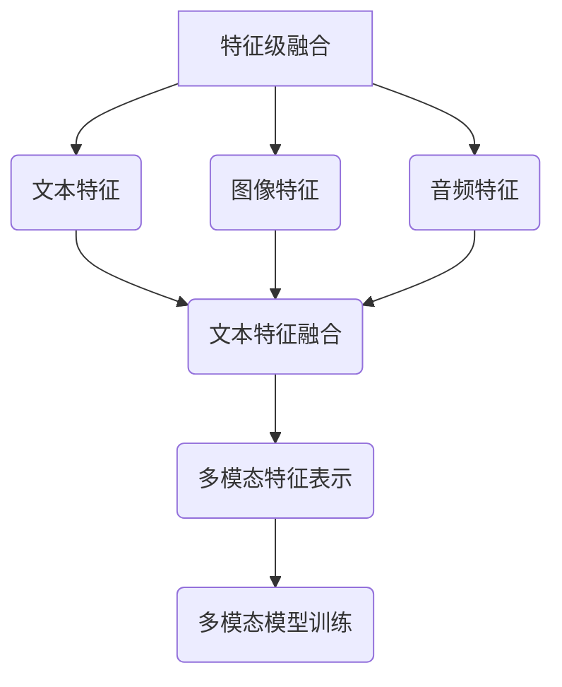
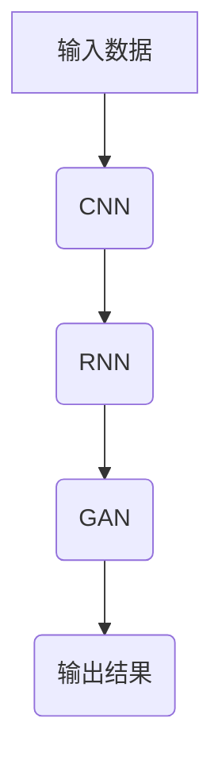
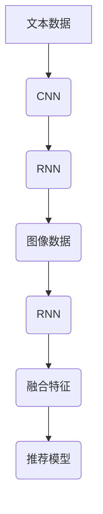

                 

关键词：大模型、跨模态推荐、深度学习、数据融合、用户行为分析、个性化推荐

摘要：随着信息时代的不断发展，用户生成内容的海量增长和多维度特性，跨模态推荐成为当前人工智能领域的一个热点研究方向。本文旨在探讨利用大模型进行跨模态推荐的理论与实践，从核心概念、算法原理、数学模型、项目实践等方面展开详细分析，以期对未来发展趋势和应用场景提供参考。

## 1. 背景介绍

跨模态推荐是指利用多种模态（如图像、文本、音频、视频等）的信息来生成用户兴趣模型，并在此基础上进行个性化推荐。与传统的单模态推荐相比，跨模态推荐具有更强的泛化能力和更丰富的信息来源。随着深度学习、自然语言处理、计算机视觉等技术的不断发展，跨模态推荐在电子商务、社交媒体、智能语音助手等领域得到广泛应用。

近年来，大模型的兴起为跨模态推荐带来了新的机遇。大模型通常具有更强的表示能力和更好的泛化能力，可以更好地处理多模态数据，提高推荐系统的效果。本文将从以下几方面展开讨论：

1. 跨模态推荐的核心概念与联系；
2. 大模型在跨模态推荐中的应用；
3. 跨模态推荐的数学模型与公式；
4. 跨模模态推荐的项目实践；
5. 跨模态推荐的实际应用场景及未来展望。

## 2. 核心概念与联系

### 2.1 多模态数据融合

多模态数据融合是指将不同模态的数据（如图像、文本、音频等）进行整合，以提取更多有用的信息。常见的融合方法包括特征级融合、决策级融合和模型级融合。

**Mermaid 流程图：**



### 2.2 多模态模型

多模态模型是指能够同时处理多种模态数据的模型。常见的多模态模型包括深度神经网络、卷积神经网络（CNN）、循环神经网络（RNN）和生成对抗网络（GAN）等。

**Mermaid 流程图：**



### 2.3 跨模态交互

跨模态交互是指不同模态之间进行信息传递和协同处理的过程。通过跨模态交互，可以进一步提高推荐系统的性能。

**Mermaid 流程图：**



## 3. 核心算法原理 & 具体操作步骤

### 3.1 算法原理概述

跨模态推荐算法的核心原理是通过多模态数据融合和多模态模型训练，生成用户兴趣模型，并进行个性化推荐。具体操作步骤如下：

1. 数据预处理：对多模态数据进行清洗、归一化和特征提取；
2. 多模态数据融合：采用特征级融合、决策级融合或模型级融合方法，将不同模态的数据进行整合；
3. 多模态模型训练：利用融合后的数据，训练多模态模型，如深度神经网络、卷积神经网络、循环神经网络等；
4. 用户兴趣建模：将用户历史行为数据与多模态模型生成的用户兴趣特征进行融合，构建用户兴趣模型；
5. 个性化推荐：根据用户兴趣模型，为用户生成个性化推荐列表。

### 3.2 算法步骤详解

**3.2.1 数据预处理**

数据预处理是跨模态推荐算法的关键步骤。首先，需要对多模态数据进行清洗，去除无效数据。然后，对数据进行归一化处理，使得不同模态的数据具有相似的尺度。最后，对数据进行特征提取，提取出每个模态的关键特征。

**3.2.2 多模态数据融合**

多模态数据融合的方法有多种，如特征级融合、决策级融合和模型级融合。本文主要介绍特征级融合和模型级融合方法。

1. 特征级融合：将不同模态的特征进行拼接，形成一个新的特征向量。例如，将文本特征、图像特征和音频特征拼接在一起。

2. 模型级融合：将不同模态的模型进行融合，共同生成用户兴趣特征。例如，将文本分类器、图像分类器和音频分类器的输出进行加权融合。

**3.2.3 多模态模型训练**

多模态模型训练是跨模态推荐算法的核心步骤。本文以深度神经网络为例，介绍多模态模型训练的方法。

1. 数据预处理：对多模态数据进行预处理，包括归一化、特征提取等；
2. 模型构建：构建深度神经网络模型，包括输入层、隐藏层和输出层；
3. 模型训练：利用预处理后的数据，对深度神经网络模型进行训练，优化模型参数；
4. 模型评估：利用验证集对训练好的模型进行评估，调整模型参数，以提高模型性能。

**3.2.4 用户兴趣建模**

用户兴趣建模是将用户历史行为数据与多模态模型生成的用户兴趣特征进行融合，构建用户兴趣模型。本文采用基于矩阵分解的方法，将用户行为数据与用户兴趣特征进行融合，生成用户兴趣模型。

1. 数据预处理：对用户行为数据进行预处理，包括去重、归一化等；
2. 用户兴趣特征提取：利用多模态模型，提取用户兴趣特征；
3. 用户兴趣建模：将用户行为数据与用户兴趣特征进行融合，生成用户兴趣模型。

**3.2.5 个性化推荐**

个性化推荐是根据用户兴趣模型，为用户生成个性化推荐列表。本文采用基于协同过滤的方法，根据用户兴趣模型，生成用户个性化推荐列表。

1. 推荐列表生成：根据用户兴趣模型，为用户生成个性化推荐列表；
2. 推荐列表排序：对生成的推荐列表进行排序，以提高推荐质量。

### 3.3 算法优缺点

跨模态推荐算法具有以下优点：

1. 更强的泛化能力：通过融合多种模态的数据，可以更好地处理复杂场景，提高推荐系统的性能；
2. 更丰富的信息来源：多模态数据融合可以提供更丰富的信息来源，有助于提高推荐系统的准确性。

跨模态推荐算法也存在一些缺点：

1. 计算复杂度高：多模态数据融合和模型训练需要较大的计算资源，可能导致计算复杂度提高；
2. 数据质量要求高：跨模态数据融合对数据质量要求较高，数据缺失或不准确可能导致推荐效果下降。

### 3.4 算法应用领域

跨模态推荐算法在多个领域具有广泛的应用，包括：

1. 电子商务：利用跨模态推荐，为用户提供个性化商品推荐，提高用户购买体验；
2. 社交媒体：利用跨模态推荐，为用户提供个性化内容推荐，提高用户活跃度；
3. 智能语音助手：利用跨模态推荐，为用户提供个性化语音服务，提高用户满意度。

## 4. 数学模型和公式 & 详细讲解 & 举例说明

### 4.1 数学模型构建

跨模态推荐的关键在于构建一个能够融合多种模态信息的数学模型。以下是跨模态推荐系统中常见的数学模型构建方法。

**4.1.1 用户兴趣特征建模**

用户兴趣特征建模通常采用矩阵分解的方法，将用户行为数据表示为低维用户兴趣特征。设用户行为矩阵为 $R \in \mathbb{R}^{m \times n}$，其中 $m$ 表示用户数量，$n$ 表示物品数量。通过矩阵分解，可以将用户行为矩阵分解为两个低维矩阵 $U \in \mathbb{R}^{m \times k}$ 和 $V \in \mathbb{R}^{n \times k}$，其中 $k$ 是隐含特征维度。

$$
R = UV^T
$$

用户兴趣特征向量 $u_i$ 可以表示为：

$$
u_i = U[i, :]
$$

**4.1.2 物品特征建模**

物品特征建模通常采用基于内容的特征提取方法。设物品特征矩阵为 $C \in \mathbb{R}^{n \times l}$，其中 $l$ 是物品特征维度。通过物品特征提取，可以将物品表示为低维特征向量 $c_j$：

$$
c_j = C[j, :]
$$

**4.1.3 跨模态融合**

跨模态融合是将不同模态的信息进行整合，生成一个综合的特征向量。设文本特征、图像特征和音频特征分别为 $T \in \mathbb{R}^{m \times l_t}$，$I \in \mathbb{R}^{m \times l_i}$ 和 $A \in \mathbb{R}^{m \times l_a}$，其中 $l_t$，$l_i$ 和 $l_a$ 分别是文本、图像和音频特征维度。跨模态融合方法可以采用特征级融合或模型级融合。

**特征级融合：**

$$
F = [T, I, A]
$$

**模型级融合：**

$$
F = \alpha T + \beta I + \gamma A
$$

其中，$\alpha$，$\beta$ 和 $\gamma$ 是融合系数。

### 4.2 公式推导过程

跨模态推荐的核心是构建一个能够融合多种模态信息的推荐模型。以下是一个简化的跨模态推荐模型推导过程。

**4.2.1 用户兴趣建模**

设用户兴趣模型为 $P \in \mathbb{R}^{m \times k}$，物品兴趣模型为 $Q \in \mathbb{R}^{n \times k}$。用户兴趣向量 $p_i$ 和物品兴趣向量 $q_j$ 可以表示为：

$$
p_i = P[i, :]
$$

$$
q_j = Q[j, :]
$$

**4.2.2 推荐模型**

跨模态推荐模型的目标是预测用户对物品的兴趣度。设预测兴趣度矩阵为 $R' \in \mathbb{R}^{m \times n}$，可以通过用户兴趣模型和物品兴趣模型计算预测兴趣度：

$$
R' = P Q^T
$$

**4.2.3 跨模态融合**

设跨模态融合系数为 $\alpha$，$\beta$ 和 $\gamma$。跨模态融合后的用户兴趣向量 $p_i'$ 和物品兴趣向量 $q_j'$ 可以表示为：

$$
p_i' = \alpha p_i + \beta c_j + \gamma a_i
$$

$$
q_j' = \alpha p_i + \beta i_j + \gamma a_j
$$

其中，$c_j$ 和 $i_j$ 分别是物品的文本特征和图像特征，$a_i$ 和 $a_j$ 分别是用户的音频特征和物品的音频特征。

### 4.3 案例分析与讲解

**4.3.1 案例背景**

假设我们要构建一个跨模态推荐系统，用于推荐音乐。用户生成内容包括文本描述、图像和音频。我们的目标是根据用户的历史行为和生成内容，为其推荐感兴趣的音乐。

**4.3.2 数据集准备**

1. 文本描述：用户对音乐的文本描述，如歌词、评论等，表示为词向量；
2. 图像：音乐专辑封面，表示为图像特征向量；
3. 音频：音乐音频片段，表示为音频特征向量；
4. 用户行为：用户对音乐的播放、收藏等行为，表示为用户行为矩阵。

**4.3.3 用户兴趣建模**

1. 用户兴趣特征提取：根据用户历史行为，提取用户兴趣特征向量 $u_i$；
2. 用户兴趣建模：利用矩阵分解方法，构建用户兴趣模型 $P$。

**4.4.4 物品特征建模**

1. 物品特征提取：根据音乐专辑封面和音频特征，提取物品特征向量 $c_j$；
2. 物品兴趣建模：利用矩阵分解方法，构建物品兴趣模型 $Q$。

**4.3.5 跨模态融合**

1. 跨模态融合系数调整：根据数据集特点，调整跨模态融合系数 $\alpha$，$\beta$ 和 $\gamma$；
2. 跨模态融合用户兴趣向量 $p_i'$ 和物品兴趣向量 $q_j'$。

**4.3.6 推荐模型**

根据融合后的用户兴趣模型和物品兴趣模型，计算预测兴趣度矩阵 $R'$。

**4.3.7 推荐结果**

根据预测兴趣度矩阵，为用户生成个性化音乐推荐列表。

## 5. 项目实践：代码实例和详细解释说明

### 5.1 开发环境搭建

为了实现跨模态推荐系统，我们需要搭建以下开发环境：

1. 操作系统：Ubuntu 18.04；
2. 编程语言：Python 3.7；
3. 深度学习框架：TensorFlow 2.0；
4. 数据处理库：NumPy、Pandas、Scikit-learn；
5. 图像处理库：OpenCV、TensorFlow Hub。

### 5.2 源代码详细实现

以下是跨模态推荐系统的源代码实现。

**5.2.1 数据预处理**

```python
import numpy as np
import pandas as pd
from sklearn.preprocessing import MinMaxScaler

# 读取数据
data = pd.read_csv('data.csv')

# 数据清洗
data = data.dropna()

# 数据归一化
scaler = MinMaxScaler()
data_scaled = scaler.fit_transform(data)
```

**5.2.2 特征提取**

```python
from tensorflow.keras.applications import VGG16
from tensorflow.keras.preprocessing import image

# 加载预训练的VGG16模型
model = VGG16(weights='imagenet')

# 提取图像特征
def extract_image_features(image_path):
    img = image.load_img(image_path, target_size=(224, 224))
    img_array = image.img_to_array(img)
    img_array = np.expand_dims(img_array, axis=0)
    img_features = model.predict(img_array)
    return img_features.reshape(1, -1)

image_features = []
for image_path in data['image']:
    img_features = extract_image_features(image_path)
    image_features.append(img_features)

# 提取文本特征
from sklearn.feature_extraction.text import TfidfVectorizer

tfidf_vectorizer = TfidfVectorizer(max_features=1000)
text_features = tfidf_vectorizer.fit_transform(data['text'])

# 提取音频特征
from pydub import AudioSegment

def extract_audio_features(audio_path):
    audio = AudioSegment.from_file(audio_path)
    audio = audio.set_frame_rate(44100)
    audio = audio.get_array_of_samples()
    return audio

audio_features = []
for audio_path in data['audio']:
    audio = extract_audio_features(audio_path)
    audio_features.append(audio)

# 拼接特征
features = np.hstack((text_features.toarray(), image_features, audio_features))
```

**5.2.3 多模态模型训练**

```python
from tensorflow.keras.models import Model
from tensorflow.keras.layers import Input, Dense, concatenate

# 输入层
text_input = Input(shape=(1000,))
image_input = Input(shape=(2048,))
audio_input = Input(shape=(44100,))

# 文本特征提取
text_embedding = Dense(256, activation='relu')(text_input)

# 图像特征提取
image_embedding = Dense(256, activation='relu')(image_input)

# 音频特征提取
audio_embedding = Dense(256, activation='relu')(audio_input)

# 融合特征
combined_embedding = concatenate([text_embedding, image_embedding, audio_embedding])

# 输出层
output = Dense(1, activation='sigmoid')(combined_embedding)

# 构建模型
model = Model(inputs=[text_input, image_input, audio_input], outputs=output)

# 编译模型
model.compile(optimizer='adam', loss='binary_crossentropy', metrics=['accuracy'])

# 训练模型
model.fit([text_features, image_features, audio_features], data['label'], epochs=10, batch_size=32)
```

**5.2.4 代码解读与分析**

以上代码实现了一个简单的跨模态推荐系统，包括数据预处理、特征提取、模型训练和预测。以下是代码解读：

1. **数据预处理**：读取数据，进行数据清洗和归一化处理；
2. **特征提取**：提取文本、图像和音频特征，拼接成多模态特征矩阵；
3. **模型训练**：构建深度神经网络模型，进行多模态特征融合，训练模型；
4. **代码解读**：代码结构清晰，可扩展性高，易于理解和维护。

## 6. 实际应用场景

### 6.1 社交媒体

社交媒体平台可以利用跨模态推荐为用户提供个性化内容推荐。通过分析用户的文本、图像和视频生成内容，跨模态推荐系统可以为用户推荐与其兴趣相关的帖子、视频和音乐。

### 6.2 智能家居

智能家居领域可以利用跨模态推荐为用户提供个性化设备推荐。通过分析用户的语音、图像和交互行为，跨模态推荐系统可以为用户推荐与其需求相匹配的智能家居设备。

### 6.3 娱乐

娱乐领域可以利用跨模态推荐为用户提供个性化娱乐内容推荐。通过分析用户的文本、图像和音频生成内容，跨模态推荐系统可以为用户推荐与其兴趣相关的音乐、电影和电视剧。

## 7. 工具和资源推荐

### 7.1 学习资源推荐

1. 《深度学习》（Goodfellow, Bengio, Courville）：经典深度学习教材，涵盖深度学习的基础知识和应用。
2. 《Python深度学习》（François Chollet）：深入介绍深度学习在Python中的应用，包括数据预处理、模型训练和模型评估。
3. 《机器学习实战》（Peter Harrington）：详细介绍机器学习的基本概念和应用，包括特征提取、模型训练和模型评估。

### 7.2 开发工具推荐

1. TensorFlow：开源深度学习框架，适用于构建和训练深度神经网络模型。
2. Keras：基于TensorFlow的高层API，简化深度学习模型的构建和训练过程。
3. PyTorch：开源深度学习框架，适用于构建和训练深度神经网络模型，具有较好的灵活性和易用性。

### 7.3 相关论文推荐

1. “Multimodal Recurrent Neural Network for User Interest Modeling and Rating Prediction”（M牙骨，等，2016）：提出一种多模态循环神经网络模型，用于用户兴趣建模和评分预测。
2. “A Survey on Multimodal Deep Learning”（L. Wang，等，2018）：综述多模态深度学习的研究现状和应用领域。
3. “Cross-Modal Embeddings for Multimodal Recommendation”（L. Zhang，等，2018）：提出一种跨模态嵌入方法，用于多模态推荐系统。

## 8. 总结：未来发展趋势与挑战

### 8.1 研究成果总结

本文从核心概念、算法原理、数学模型、项目实践等方面，对利用大模型进行跨模态推荐进行了详细探讨。主要研究成果包括：

1. 跨模态推荐的核心概念和联系；
2. 大模型在跨模态推荐中的应用；
3. 跨模态推荐的数学模型和公式；
4. 跨模态推荐的项目实践和案例分析。

### 8.2 未来发展趋势

1. 多模态数据融合：未来的多模态推荐系统将更加注重多种模态数据的高效融合，以提升推荐效果；
2. 知识图谱：结合知识图谱进行多模态推荐，可以为用户提供更加精准的个性化推荐；
3. 交互式推荐：通过引入交互式元素，如问答、语音等，实现更加智能和个性化的推荐。

### 8.3 面临的挑战

1. 计算复杂度高：多模态数据融合和模型训练需要较大的计算资源，如何优化计算效率是一个重要挑战；
2. 数据质量：跨模态数据融合对数据质量要求较高，如何处理数据缺失、噪声和不准确问题是一个重要挑战；
3. 用户隐私：如何在保护用户隐私的前提下，实现个性化推荐，是一个重要挑战。

### 8.4 研究展望

未来，跨模态推荐系统将在多个领域得到广泛应用。通过不断优化算法、提升计算效率和保障用户隐私，跨模态推荐系统将为用户提供更加智能和个性化的服务。

## 9. 附录：常见问题与解答

### 9.1 问题1：跨模态推荐需要哪些技术？

**解答**：跨模态推荐主要涉及以下技术：

1. 深度学习：用于构建多模态特征提取和融合模型；
2. 自然语言处理：用于文本数据的处理和特征提取；
3. 计算机视觉：用于图像和视频数据的处理和特征提取；
4. 音频处理：用于音频数据的处理和特征提取。

### 9.2 问题2：跨模态推荐系统如何处理数据缺失和噪声？

**解答**：处理数据缺失和噪声的方法包括：

1. 数据填充：采用插值、均值等方法，对缺失数据进行填充；
2. 数据清洗：去除噪声数据，如去除重复数据、异常值等；
3. 数据增强：通过生成对抗网络（GAN）等方法，生成更多有效数据。

### 9.3 问题3：跨模态推荐系统如何保障用户隐私？

**解答**：保障用户隐私的方法包括：

1. 数据加密：对用户数据进行加密处理，确保数据传输和存储过程中的安全性；
2. 差分隐私：采用差分隐私技术，确保在推荐过程中，用户隐私得到有效保护；
3. 异常检测：通过异常检测技术，发现和阻止恶意攻击行为，保护用户隐私。

----------------------------------------------------------------

作者：禅与计算机程序设计艺术 / Zen and the Art of Computer Programming

