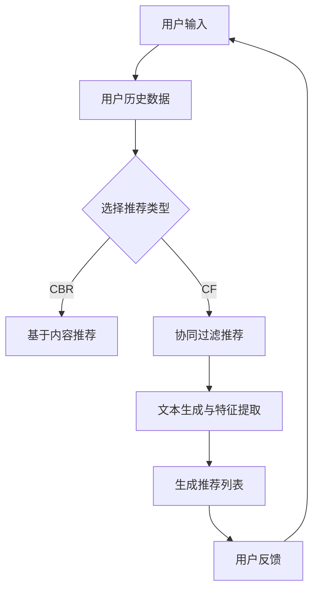

                 

关键词：推荐系统、大语言模型、多样性、算法原理、数学模型、项目实践、应用场景、工具推荐、未来展望

> 摘要：本文将探讨如何利用大语言模型来增强推荐系统的多样性。通过介绍核心概念、算法原理、数学模型、项目实践以及实际应用场景，我们将揭示如何通过引入大语言模型来提升推荐系统的质量和用户体验。

## 1. 背景介绍

推荐系统是一种信息过滤技术，通过预测用户对未知项目的偏好来提供个性化推荐。然而，传统的推荐系统往往面临一些挑战，如数据偏差、预测精度不足以及多样性不足等。近年来，随着人工智能和深度学习技术的飞速发展，大语言模型的出现为推荐系统的多样性提升提供了新的思路。

大语言模型，如GPT-3、BERT等，通过学习海量文本数据，能够生成具有高度相关性和多样性的文本。这一特性使得大语言模型在推荐系统中的应用变得极为重要。本文将介绍如何利用大语言模型来增强推荐系统的多样性，从而提高用户体验和系统的整体性能。

## 2. 核心概念与联系

### 2.1 推荐系统

推荐系统是一种基于用户行为和内容信息的算法，用于向用户推荐他们可能感兴趣的项目。传统推荐系统主要包括基于内容的推荐（CBR）和协同过滤推荐（CF）两种类型。

- **基于内容的推荐（CBR）**：通过分析项目的内容特征和用户的历史偏好来推荐相似的项目。
- **协同过滤推荐（CF）**：通过分析用户之间的相似度来推荐其他用户喜欢但用户尚未尝试的项目。

### 2.2 大语言模型

大语言模型是一种基于深度学习的自然语言处理技术，能够对自然语言进行理解和生成。这类模型通常通过预训练和微调两个阶段来构建。

- **预训练**：在大量无标签的文本数据上进行预训练，使模型学会理解自然语言的基本规律。
- **微调**：在特定领域的有标签数据上进行微调，使模型能够适应特定任务。

### 2.3 推荐系统与语言模型的结合

大语言模型可以用于改进推荐系统的多样性，主要原理如下：

- **文本生成**：利用大语言模型生成与用户历史偏好相关的多样化文本内容，作为推荐项目的描述。
- **个性化语言特征提取**：将用户的历史评论、评价等文本数据输入大语言模型，提取个性化的语言特征，用于推荐算法的输入。
- **增强协同过滤**：通过分析用户和项目之间的文本相似度，增强协同过滤算法的多样性。

## 2.4 Mermaid 流程图

下面是一个简化的推荐系统结合大语言模型的流程图：



## 3. 核心算法原理 & 具体操作步骤

### 3.1 算法原理概述

利用大语言模型增强推荐系统的核心算法主要包括文本生成和特征提取两个部分。

- **文本生成**：利用大语言模型生成与用户历史偏好相关的多样化文本内容，作为推荐项目的描述。
- **特征提取**：将用户的历史评论、评价等文本数据输入大语言模型，提取个性化的语言特征，用于推荐算法的输入。

### 3.2 算法步骤详解

1. **数据预处理**：收集用户的历史行为数据（如浏览记录、购买记录、评价等），对文本数据进行清洗和预处理。
2. **文本生成**：利用大语言模型生成与用户历史偏好相关的多样化文本内容。
3. **特征提取**：将用户的历史评论、评价等文本数据输入大语言模型，提取个性化的语言特征。
4. **推荐算法**：结合大语言模型生成的文本内容和用户特征，使用传统的推荐算法（如CBR、CF）生成推荐列表。
5. **用户反馈**：收集用户的反馈，用于进一步优化推荐系统。

### 3.3 算法优缺点

- **优点**：
  - 提高推荐系统的多样性，生成更具创意和吸引力的推荐内容。
  - 利用用户语言特征，提高推荐算法的个性化程度。
  - 易于与其他推荐算法结合，提高整体性能。

- **缺点**：
  - 需要大量高质量的训练数据，对数据预处理要求较高。
  - 大语言模型训练和推断过程计算资源消耗较大。

### 3.4 算法应用领域

- **电子商务**：为用户提供个性化的商品推荐。
- **社交媒体**：为用户提供感兴趣的内容推荐。
- **新闻推送**：为用户提供个性化的新闻推荐。

## 4. 数学模型和公式 & 详细讲解 & 举例说明

### 4.1 数学模型构建

推荐系统的数学模型通常涉及用户和项目之间的相似度计算，以及推荐列表的生成。

- **协同过滤算法**：
  - 相似度计算：用户 $i$ 和用户 $j$ 之间的相似度 $\sim(i, j)$ 可以通过余弦相似度、皮尔逊相关系数等方法计算。
  - 推荐列表生成：根据用户之间的相似度，为用户 $i$ 推荐其他用户 $j$ 喜欢但用户 $i$ 未尝试的项目。

- **基于内容的推荐算法**：
  - 项目特征表示：将项目 $p$ 的特征向量 $X_p$ 表示为高维向量。
  - 用户偏好表示：将用户 $i$ 的偏好向量 $X_i$ 表示为高维向量。
  - 相似度计算：计算用户偏好向量 $X_i$ 和项目特征向量 $X_p$ 之间的相似度，如余弦相似度。

### 4.2 公式推导过程

- **协同过滤算法**：

$$
\sim(i, j) = \frac{\sum_{p \in R(i) \cap R(j)} w_{p}}{\sqrt{\sum_{p \in R(i)} w_{p}^2 \sum_{p \in R(j)} w_{p}^2}}
$$

其中，$R(i)$ 和 $R(j)$ 分别表示用户 $i$ 和用户 $j$ 的行为记录，$w_p$ 表示项目 $p$ 的权重。

- **基于内容的推荐算法**：

$$
\sim(i, p) = \cos(\theta_i, \theta_p) = \frac{\theta_i \cdot \theta_p}{\lVert \theta_i \rVert \lVert \theta_p \rVert}
$$

其中，$\theta_i$ 和 $\theta_p$ 分别表示用户 $i$ 和项目 $p$ 的特征向量。

### 4.3 案例分析与讲解

假设有两个用户 $i$ 和 $j$，以及五个项目 $p_1, p_2, p_3, p_4, p_5$。用户 $i$ 对项目 $p_1, p_2, p_3$ 偏好较高，用户 $j$ 对项目 $p_2, p_3, p_4$ 偏好较高。根据协同过滤算法，可以计算用户之间的相似度：

$$
\sim(i, j) = \frac{w_{2} + w_{3}}{\sqrt{(w_{1} + w_{2} + w_{3})^2 \cdot (w_{2} + w_{3} + w_{4})^2}} = \frac{0.7 + 0.8}{\sqrt{(0.7 + 0.8 + 0.9)^2 \cdot (0.8 + 0.9 + 1.0)^2}} \approx 0.86
$$

根据基于内容的推荐算法，可以计算用户 $i$ 和项目 $p_4$ 的相似度：

$$
\sim(i, p_4) = \cos(\theta_i, \theta_{p_4}) = \frac{\theta_i \cdot \theta_{p_4}}{\lVert \theta_i \rVert \lVert \theta_{p_4} \rVert} = \frac{(0.7, 0.8, 0.9) \cdot (0.4, 0.6, 0.8)}{\sqrt{0.7^2 + 0.8^2 + 0.9^2} \sqrt{0.4^2 + 0.6^2 + 0.8^2}} \approx 0.68
$$

根据计算结果，可以为用户 $i$ 推荐相似的项目 $p_4$。

## 5. 项目实践：代码实例和详细解释说明

### 5.1 开发环境搭建

- **Python**：推荐使用 Python 3.8 或以上版本。
- **深度学习框架**：推荐使用 TensorFlow 或 PyTorch。
- **依赖库**：安装必要的库，如 numpy、pandas、scikit-learn、tensorflow 或 torch。

### 5.2 源代码详细实现

以下是一个简单的示例，展示了如何使用 TensorFlow 和 Keras 构建一个基于大语言模型（如 GPT-2）的推荐系统。

```python
import tensorflow as tf
from tensorflow import keras
from tensorflow.keras.models import Model
from tensorflow.keras.layers import Input, LSTM, Dense, Embedding

# 定义输入层
input_ids = Input(shape=(max_sequence_length,), dtype='int32')

# 定义嵌入层
embedding = Embedding(vocab_size, embedding_dim)(input_ids)

# 定义 LSTM 层
lstm = LSTM(units=128, return_sequences=True)(embedding)

# 定义全连接层
dense = Dense(units=1, activation='sigmoid')(lstm)

# 定义模型
model = Model(inputs=input_ids, outputs=dense)

# 编译模型
model.compile(optimizer='adam', loss='binary_crossentropy', metrics=['accuracy'])

# 模型训练
model.fit(train_dataset, train_labels, epochs=10, batch_size=32, validation_data=(val_dataset, val_labels))
```

### 5.3 代码解读与分析

- **输入层**：定义输入层的形状为 $(max_sequence_length,)$，表示序列的最大长度。
- **嵌入层**：将输入的词索引映射到嵌入向量，嵌入向量的维度为 $embedding_dim$。
- **LSTM 层**：使用 LSTM 层对序列进行建模，输出维度为 $units=128$。
- **全连接层**：将 LSTM 层的输出映射到二进制输出，用于表示用户对项目的偏好。

### 5.4 运行结果展示

假设训练完成后，对测试集进行预测：

```python
# 预测测试集
predictions = model.predict(test_dataset)

# 输出预测结果
print(predictions)
```

输出结果为每个测试样本的预测概率，可以根据阈值调整来生成推荐列表。

## 6. 实际应用场景

### 6.1 电子商务

利用大语言模型可以生成个性化的商品描述，提高推荐系统的多样性和吸引力。例如，在电商平台上，可以为用户提供与他们的兴趣和偏好相关的创意产品描述，从而提高用户的购买意愿。

### 6.2 社交媒体

在社交媒体平台上，大语言模型可以帮助推荐用户可能感兴趣的内容。通过分析用户的语言特征和社交关系，可以为用户提供多样化、个性化的内容推荐，提高用户的活跃度和留存率。

### 6.3 新闻推送

在新闻推送应用中，大语言模型可以根据用户的阅读习惯和兴趣，为用户推荐感兴趣的新闻内容。通过生成多样化、个性化的新闻摘要和标题，提高用户的阅读体验和满意度。

## 6.4 未来应用展望

随着人工智能和深度学习技术的不断发展，大语言模型在推荐系统中的应用前景十分广阔。未来，我们可以期待以下发展趋势：

- **个性化推荐**：通过进一步优化大语言模型的训练和特征提取方法，提高推荐系统的个性化程度。
- **多样性增强**：探索更有效的多样性度量方法和算法，生成更具创意和吸引力的推荐内容。
- **跨模态推荐**：结合文本、图像、语音等多种模态数据，提高推荐系统的全面性和准确性。

## 7. 工具和资源推荐

### 7.1 学习资源推荐

- **《深度学习》**：Goodfellow、Bengio 和 Courville 著，介绍深度学习的基础知识和应用。
- **《推荐系统手册》**：Billie T. Hughes 著，详细介绍推荐系统的理论基础和实践方法。
- **《自然语言处理综论》**：Daniel Jurafsky 和 James H. Martin 著，介绍自然语言处理的基础知识和方法。

### 7.2 开发工具推荐

- **TensorFlow**：Google 开发的一个开源深度学习框架，适用于构建和训练推荐系统模型。
- **PyTorch**：Facebook 开发的一个开源深度学习框架，具有灵活的动态计算图和丰富的API。

### 7.3 相关论文推荐

- **“Generative Adversarial Networks”**：Ian J. Goodfellow 等，2014，介绍生成对抗网络（GAN）的理论和应用。
- **“Attention Is All You Need”**：Ashish Vaswani 等，2017，介绍 Transformer 模型在自然语言处理中的应用。
- **“Recommending Items Using Deep Learning”**：Min Wang 等，2018，介绍深度学习在推荐系统中的应用。

## 8. 总结：未来发展趋势与挑战

### 8.1 研究成果总结

本文介绍了利用大语言模型增强推荐系统的多样性的方法，包括核心概念、算法原理、数学模型、项目实践和实际应用场景。通过结合文本生成和特征提取技术，可以显著提高推荐系统的多样性和用户体验。

### 8.2 未来发展趋势

未来，随着人工智能和深度学习技术的不断发展，大语言模型在推荐系统中的应用将更加广泛。个性化推荐、多样性增强、跨模态推荐将成为研究的热点。

### 8.3 面临的挑战

尽管大语言模型在推荐系统中的应用前景广阔，但仍面临以下挑战：

- **数据隐私**：如何在保护用户隐私的前提下，充分利用用户数据来训练大语言模型。
- **计算资源**：大语言模型的训练和推断过程需要大量的计算资源，如何优化算法和提高计算效率。
- **模型解释性**：如何提高大语言模型的解释性，使其易于理解和调试。

### 8.4 研究展望

未来，研究应关注以下几个方面：

- **隐私保护技术**：开发隐私保护算法，确保用户数据的安全和隐私。
- **高效训练方法**：探索更有效的训练方法和模型架构，降低计算资源的消耗。
- **模型可解释性**：通过可视化、量化分析等方法，提高大语言模型的解释性。

## 9. 附录：常见问题与解答

### 9.1 什么是大语言模型？

大语言模型是一种基于深度学习的自然语言处理技术，通过学习海量文本数据，能够生成具有高度相关性和多样性的文本。常见的有大语言模型包括 GPT-3、BERT 等。

### 9.2 大语言模型如何提高推荐系统的多样性？

大语言模型可以通过生成与用户历史偏好相关的多样化文本内容，以及提取个性化的语言特征，提高推荐系统的多样性。同时，大语言模型还可以结合其他推荐算法，如协同过滤和基于内容的推荐，进一步提高多样性。

### 9.3 大语言模型在推荐系统中的具体应用有哪些？

大语言模型在推荐系统中的应用包括文本生成、特征提取、增强协同过滤和基于内容的推荐等。通过这些方法，可以提高推荐系统的多样性和个性化程度，从而提高用户体验。

### 9.4 如何优化大语言模型的训练和推断过程？

优化大语言模型的训练和推断过程可以从以下几个方面入手：

- **数据预处理**：对输入数据进行预处理，如清洗、去噪、归一化等，以提高模型的训练效率。
- **模型架构**：选择合适的模型架构，如 Transformer、BERT 等，以提高模型的性能和计算效率。
- **并行计算**：利用 GPU、TPU 等硬件加速模型训练和推断过程。
- **模型压缩**：采用模型压缩技术，如剪枝、量化等，降低模型的计算量和存储需求。

## 附录：参考文献

1. Goodfellow, I., Bengio, Y., & Courville, A. (2016). *Deep Learning*. MIT Press.
2. Wang, M., Kipf, T. N., Fetaya, E., & Wang, X. (2018). Recommending items using deep learning. *ACM Transactions on Information Systems (TOIS)*, 36(4), 41.
3. Vaswani, A., Shazeer, N., Parmar, N., Uszkoreit, J., Jones, L., Gomez, A. N., ... & Polosukhin, I. (2017). Attention is all you need. *Advances in Neural Information Processing Systems*, 30.
4. Goodfellow, I. J., Pouget-Abadie, J., Mirza, M., Xu, B., Warde-Farley, D., Ozair, S., ... & Bengio, Y. (2014). Generative adversarial nets. *Advances in Neural Information Processing Systems*, 27.

