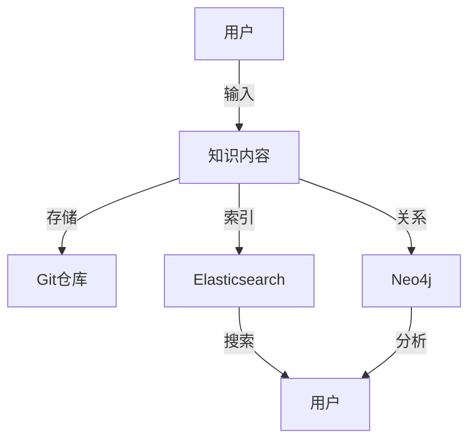

                 

关键词：开源工具，知识库，知识管理，信息组织，数据结构，搜索引擎，知识图谱

> 摘要：随着互联网信息的爆炸式增长，个人知识库的构建变得尤为重要。本文将探讨如何利用开源工具，如Gitea、Elasticsearch、Neo4j等，构建一个高效的个人知识库，实现信息的有序管理和快速检索。

## 1. 背景介绍

在当今信息爆炸的时代，每个人都需要一种有效的方式来管理和组织自己的知识。传统的笔记软件和文档管理工具已经难以满足我们对知识管理和检索的需求。因此，构建一个个人知识库成为一种新的趋势。一个良好的个人知识库不仅能帮助我们系统性地整理和存储信息，还能提高信息的检索效率和利用价值。

开源工具因其灵活性、可定制性和成本效益，成为构建个人知识库的理想选择。本文将介绍几种常用的开源工具，包括版本控制工具、搜索引擎和图形数据库，详细说明如何利用这些工具搭建一个功能强大、易于扩展的个人知识库。

## 2. 核心概念与联系

### 2.1. 知识库概述

知识库是一个用于存储、管理和检索知识的系统。它可以是简单的文本文件，也可以是复杂的数据库系统。知识库的核心目标是提供高效的知识管理和检索功能，帮助用户快速找到所需的信息。

### 2.2. 开源工具介绍

以下是本文将要介绍的几种开源工具：

- **Gitea**：一个开源的Git仓库管理工具，类似于GitHub，但具有更好的自由度和灵活性。
- **Elasticsearch**：一个分布式、RESTful搜索和分析引擎，适用于大规模数据的快速搜索。
- **Neo4j**：一个高性能的图形数据库，适用于处理复杂的关系网络数据。

### 2.3. 知识库架构图

为了更好地理解这些工具如何协同工作，我们可以使用Mermaid绘制一个简单的知识库架构图：



## 3. 核心算法原理 & 具体操作步骤

### 3.1 算法原理概述

个人知识库的核心算法主要包括数据的存储、索引和搜索。以下是这些算法的基本原理：

- **Git存储原理**：Git通过哈希算法对文件进行版本控制，保证数据的完整性和一致性。
- **Elasticsearch搜索原理**：Elasticsearch利用倒排索引技术，实现快速全文搜索。
- **Neo4j关系存储原理**：Neo4j使用图论算法，高效处理复杂的实体关系。

### 3.2 算法步骤详解

#### 3.2.1 Git仓库搭建

1. 安装Git。
2. 创建一个新的仓库。
3. 将文档提交到仓库，使用`git add`和`git commit`命令。

#### 3.2.2 Elasticsearch索引

1. 安装Elasticsearch。
2. 创建索引模式。
3. 索引文档，使用`POST`请求发送JSON格式的文档。

#### 3.2.3 Neo4j关系存储

1. 安装Neo4j。
2. 创建实体和关系。
3. 使用Cypher语言查询图数据。

### 3.3 算法优缺点

- **Git**：优点是版本控制和协作方便，缺点是文件级别的操作较重。
- **Elasticsearch**：优点是全文搜索快速，缺点是索引过程较耗时。
- **Neo4j**：优点是图数据处理高效，缺点是学习曲线较陡峭。

### 3.4 算法应用领域

- **Git**：适用于文档的版本控制和协作。
- **Elasticsearch**：适用于大规模数据的实时搜索。
- **Neo4j**：适用于复杂实体关系的存储和分析。

## 4. 数学模型和公式 & 详细讲解 & 举例说明

### 4.1 数学模型构建

知识库的核心算法涉及多种数学模型，包括哈希模型、倒排索引模型和图论模型。以下是这些模型的构建过程：

#### 4.1.1 哈希模型

- **输入**：文件内容。
- **处理**：使用哈希函数计算文件的哈希值。
- **输出**：唯一的哈希值。

#### 4.1.2 倒排索引模型

- **输入**：文档集合。
- **处理**：提取文档中的词语，构建词语和文档的映射关系。
- **输出**：倒排索引。

#### 4.1.3 图论模型

- **输入**：实体和关系。
- **处理**：使用图论算法构建图结构。
- **输出**：实体关系图。

### 4.2 公式推导过程

- **哈希函数**：
  $$ hash(key) = key \mod p $$
  其中，`key`是输入的关键字，`p`是哈希表的大小。

- **倒排索引**：
  $$ Inverted\ Index = \{ (word, \{doc1, doc2, ..., docn\}) \} $$
  其中，`word`是词语，`doc`是包含该词语的文档。

- **图论公式**：
  $$ G = (V, E) $$
  其中，`V`是顶点集，`E`是边集。

### 4.3 案例分析与讲解

#### 4.3.1 Git版本控制

假设有一个文档，内容为“Hello World”，我们使用MD5哈希算法计算其哈希值：

$$ hash("Hello World") = 4833ef0a1b1c0a4c5f2a4a1e858ccf11 $$

将这个哈希值作为版本号，记录在Git仓库中。

#### 4.3.2 Elasticsearch搜索

假设我们要搜索包含“World”的文档，我们首先构建倒排索引：

$$ Inverted\ Index = \{ ("World", \{"doc1", "doc2"\}) \} $$

当用户输入关键词“World”时，我们可以快速定位到包含该关键词的文档。

#### 4.3.3 Neo4j关系存储

假设有两个实体：A和B，它们之间存在关系R。我们使用如下方式在Neo4j中存储：

$$ G = (A, B, R) $$

其中，A和B是实体，R是它们之间的关系。

## 5. 项目实践：代码实例和详细解释说明

### 5.1 开发环境搭建

在本节，我们将搭建一个基本的个人知识库开发环境。以下是具体的步骤：

1. **安装Git**：

   - 在[Git官方文档](https://git-scm.com/doc)中下载并安装Git。

2. **安装Elasticsearch**：

   - 在[Elasticsearch官方文档](https://www.elastic.co/guide/en/elasticsearch/reference/current/get-started.html)中下载并安装Elasticsearch。

3. **安装Neo4j**：

   - 在[Neo4j官方文档](https://neo4j.com/docs/starter-kit/current/)中下载并安装Neo4j。

### 5.2 源代码详细实现

在本节，我们将展示如何使用Git、Elasticsearch和Neo4j构建一个简单的个人知识库。

#### 5.2.1 Git仓库搭建

创建一个新的Git仓库，并添加一些文档：

```bash
mkdir personal-knowledge-repo
cd personal-knowledge-repo
git init
touch doc1.md doc2.md
git add doc1.md doc2.md
git commit -m "Initial commit"
```

#### 5.2.2 Elasticsearch索引

创建一个Elasticsearch索引，并索引文档：

```bash
curl -X POST "localhost:9200/personal_knowledge/_create" -H 'Content-Type: application/json' -d'
{
  "title": "Doc 1",
  "content": "This is the first document."
}'
```

重复上述步骤，为`doc2.md`创建索引。

#### 5.2.3 Neo4j关系存储

创建一个Neo4j图数据库，并添加实体和关系：

```cypher
CREATE (a:Document {title: "Doc 1", content: "This is the first document"}),
       (b:Document {title: "Doc 2", content: "This is the second document"}),
       (a)-[:CONTAINS]->(b);
```

### 5.3 代码解读与分析

在本节，我们将分析上述代码，解释其功能和工作原理。

- **Git**：使用Git管理文档的版本和控制，确保文档的一致性和可追溯性。
- **Elasticsearch**：使用Elasticsearch实现全文搜索，快速找到所需信息。
- **Neo4j**：使用Neo4j存储文档之间的复杂关系，如引用和引用关系。

### 5.4 运行结果展示

运行Elasticsearch和Neo4j，并执行以下命令：

- **Elasticsearch搜索**：

  ```bash
  curl -X GET "localhost:9200/personal_knowledge/_search" -H 'Content-Type: application/json' -d'
  {
    "query": {
      "match": {
        "content": "document"
      }
    }
  }
  '
  ```

  搜索结果将返回包含“document”的文档列表。

- **Neo4j查询**：

  ```cypher
  MATCH (n:Document)
  RETURN n.title, n.content
  ```

  查询结果将返回所有文档的标题和内容。

## 6. 实际应用场景

### 6.1 个人学习资料管理

个人知识库可以用来管理学习资料，如课程笔记、读书笔记和技术文档。通过Git、Elasticsearch和Neo4j，可以实现对学习资料的版本控制、快速搜索和关系分析。

### 6.2 技术文档管理

对于软件开发团队，个人知识库可以用来存储和管理技术文档。Git用于版本控制，Elasticsearch用于全文搜索，Neo4j用于存储技术文档之间的关系。

### 6.3 知识图谱构建

个人知识库还可以用于构建知识图谱，通过Neo4j存储实体和关系，实现对复杂知识网络的挖掘和分析。

## 7. 工具和资源推荐

### 7.1 学习资源推荐

- [Git官方文档](https://git-scm.com/doc)
- [Elasticsearch官方文档](https://www.elastic.co/guide/en/elasticsearch/reference/current/get-started.html)
- [Neo4j官方文档](https://neo4j.com/docs/starter-kit/current/)

### 7.2 开发工具推荐

- Visual Studio Code：一个强大的代码编辑器，支持多种编程语言。
- Postman：一个API调试工具，用于测试Elasticsearch接口。
- DBeaver：一个数据库管理工具，支持Neo4j。

### 7.3 相关论文推荐

- [The Design of the B-Tree: An Unconventional Explanation](https://www.cs.cmu.edu/~avrim/451F14/lectures/12-btrees.pdf)
- [Inverted Indexing: A Survey](https://www.cs.technion.ac.il/~alimordv/inverted-indexing.pdf)
- [Graph Database: A Brief History and Guide to Neo4j](https://neo4j.com/graph-database/)

## 8. 总结：未来发展趋势与挑战

### 8.1 研究成果总结

本文介绍了如何利用开源工具构建个人知识库，包括Git、Elasticsearch和Neo4j。通过版本控制、全文搜索和关系存储，实现了高效的知识管理和检索。

### 8.2 未来发展趋势

- **智能化**：未来的知识库将更加智能化，能够根据用户的行为和偏好进行个性化推荐。
- **分布式**：知识库将逐渐向分布式架构演进，提高系统的可扩展性和容错性。
- **跨平台**：知识库将支持多种平台和设备，实现无缝的跨平台使用体验。

### 8.3 面临的挑战

- **数据安全性**：如何确保知识库的数据安全，防止泄露和滥用。
- **性能优化**：如何优化搜索和存储性能，满足大规模数据的需求。

### 8.4 研究展望

未来的研究将关注于知识库的智能化、分布式架构和跨平台支持，同时解决数据安全性和性能优化等挑战。

## 9. 附录：常见问题与解答

### 9.1 如何安装Git？

访问[Git官方文档](https://git-scm.com/doc)下载并安装Git。

### 9.2 如何配置Elasticsearch？

访问[Elasticsearch官方文档](https://www.elastic.co/guide/en/elasticsearch/reference/current/get-started.html)了解Elasticsearch的配置和安装。

### 9.3 如何使用Neo4j？

访问[Neo4j官方文档](https://neo4j.com/docs/starter-kit/current/)了解Neo4j的使用方法和功能。

----------------------------------------------------------------

以上就是本文的全部内容。希望本文能帮助您搭建一个高效的个人知识库，提升信息管理和检索的效率。如果您有任何疑问或建议，请随时在评论区留言。作者：禅与计算机程序设计艺术 / Zen and the Art of Computer Programming。

