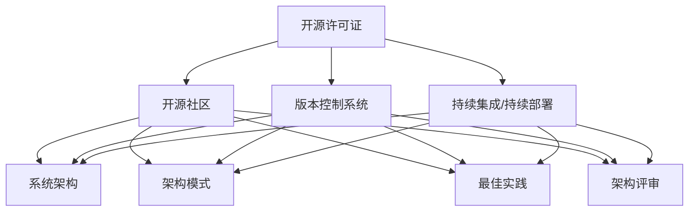

                 

摘要：（此处给出文章的核心内容和主题思想）

本文旨在探讨如何利用开源经验为技术项目提供有效的架构咨询。作者基于自己在开源社区的长期实践和丰富的项目经验，结合具体案例，深入分析了开源技术在现代软件开发中的应用及其对项目架构的潜在影响。文章首先介绍了开源技术的基本概念和重要性，随后详细探讨了开源经验的获取途径，并通过具体实例展示了如何将这些经验转化为有针对性的架构建议。此外，文章还讨论了开源技术在项目开发过程中的实际应用，并提出了未来开源技术发展趋势和面临的挑战。通过本文的阅读，读者将能够更好地理解开源经验在技术架构咨询中的价值，以及如何有效地将其应用于实际项目中。

## 1. 背景介绍

随着互联网技术的迅猛发展和开源运动的普及，现代软件开发正经历着一场深刻的变革。开源技术已经成为软件开发不可或缺的一部分，不仅促进了技术的创新和进步，还极大地提高了开发效率和软件质量。在这一背景下，如何利用开源经验为项目提供有效的技术架构咨询，成为了一个值得深入探讨的话题。

### 1.1 开源技术的定义和意义

开源技术（Open Source Technology）指的是那些允许用户自由使用、学习、修改和分享的软件。开源项目的核心在于其透明性和社区驱动的开发模式。开源项目通常遵循特定的许可证协议，如GPL（GNU General Public License）和Apache License，这些许可证确保了项目的开放性和可持续性。

开源技术的重要意义主要体现在以下几个方面：

1. **技术创新**：开源项目鼓励技术创新，通过社区协作，能够迅速地实现技术的突破和优化。
2. **成本效益**：开源技术降低了软件开发的门槛，减少了企业的研发成本，使得小型企业和独立开发者也能参与到大项目的开发中。
3. **安全性和稳定性**：开源项目通过社区的广泛参与，能够快速发现和修复安全漏洞，提高了软件的安全性和稳定性。
4. **知识共享**：开源项目促进了知识的共享和传播，有助于提高整个行业的专业水平。

### 1.2 架构咨询的定义和重要性

架构咨询（Architecture Consulting）是指在软件开发过程中，为项目提供整体结构设计和关键决策的服务。架构咨询的目的是确保软件系统能够满足业务需求，同时具备良好的可扩展性、可维护性和可靠性。

架构咨询的重要性体现在以下几个方面：

1. **系统稳定性**：良好的架构设计能够确保系统在面临高并发、大数据等复杂场景时，仍然能够稳定运行。
2. **开发效率**：合理的架构设计可以提高开发团队的工作效率，减少不必要的沟通成本和重复劳动。
3. **可维护性**：清晰的架构设计有助于未来的系统维护和升级，减少了维护成本。
4. **业务适应性**：架构咨询能够帮助项目更好地适应业务需求的变化，确保系统能够灵活扩展。

### 1.3 开源经验与架构咨询的关系

开源经验在架构咨询中扮演着重要角色。通过参与开源项目，开发人员能够接触到各种不同的技术实现和架构模式，积累宝贵的实践经验。这些经验不仅可以帮助开发人员更好地理解技术原理，还能够为他们在实际项目中的架构设计提供有力支持。

具体来说，开源经验在架构咨询中的作用包括：

1. **技术选型**：开源经验有助于开发人员选择最适合项目需求的技术栈和框架，避免重复造轮子。
2. **架构模式**：开源项目中的多种架构模式可以提供参考，帮助开发人员构建更加灵活、可扩展的系统。
3. **最佳实践**：开源社区中的最佳实践和设计模式可以指导开发人员避免常见的问题和陷阱。
4. **风险评估**：开源经验可以帮助开发人员预见潜在的技术风险，提前制定应对策略。

综上所述，开源技术在现代软件开发中具有重要作用，而开源经验则为技术架构咨询提供了宝贵的资源。本文将深入探讨如何利用这些开源经验，为技术项目提供有效的架构咨询。

## 2. 核心概念与联系

为了深入理解开源经验在技术架构咨询中的应用，我们需要首先明确几个核心概念，并展示它们之间的联系。以下是本文中涉及的主要核心概念及其相互关系：

### 2.1 开源技术核心概念

1. **开源许可证**：开源许可证是规范开源项目使用和分发的基本法律文件，如GPL和Apache License。不同的许可证对项目的开源性质和用户权益有不同要求。
2. **开源社区**：开源社区是由贡献者、用户和爱好者组成的生态系统，通过协作推动开源项目的发展。
3. **版本控制系统**：版本控制系统（如Git）是管理开源项目源代码的重要工具，确保代码的版本管理和协作开发。
4. **持续集成/持续部署（CI/CD）**：CI/CD是自动化软件交付流程的方法，通过自动化测试和部署，提高软件开发的效率和质量。

### 2.2 架构咨询核心概念

1. **系统架构**：系统架构是软件系统的整体设计，包括技术选型、模块划分、数据流和交互等。
2. **架构模式**：架构模式是解决特定问题的设计模式，如微服务、分布式架构和事件驱动架构。
3. **最佳实践**：最佳实践是在软件开发过程中总结出的最佳方法，包括代码规范、测试流程和项目管理等。
4. **架构评审**：架构评审是对系统架构的设计和实现进行评估，确保其符合业务需求和性能标准。

### 2.3 开源经验与架构咨询的联系

开源经验与架构咨询之间存在密切的联系。通过参与开源项目，开发人员能够：

1. **了解最新技术趋势**：开源社区通常处于技术的前沿，开发人员可以通过参与开源项目，了解最新的技术趋势和最佳实践。
2. **积累架构设计经验**：开源项目提供了丰富的架构实例，开发人员可以通过分析这些实例，学习如何设计和实现大型、复杂系统的架构。
3. **提升解决问题的能力**：开源项目往往面临各种复杂的问题和挑战，通过解决这些问题，开发人员能够提升自己的问题解决能力。
4. **扩展专业知识**：参与开源项目可以让开发人员接触到多种编程语言、框架和工具，从而扩展自己的专业知识。

### 2.4 Mermaid 流程图展示

为了更直观地展示上述概念之间的联系，我们可以使用Mermaid流程图来描述。以下是开源经验与架构咨询关系的Mermaid流程图：



在这个流程图中，开源许可证、开源社区、版本控制系统和持续集成/持续部署是基础元素，它们与系统架构、架构模式、最佳实践和架构评审相互连接，共同构成了开源经验与架构咨询的核心联系。

通过明确这些核心概念和它们之间的联系，我们可以更好地理解如何利用开源经验为技术项目提供有效的架构咨询。接下来的章节将进一步探讨开源经验的获取途径和具体应用案例。

### 3. 核心算法原理 & 具体操作步骤

在理解了开源经验与架构咨询的关系之后，接下来我们将探讨具体的技术算法原理及其在架构咨询中的应用。本文将介绍一个常用的分布式系统架构算法——Zookeeper选主算法，并详细描述其原理和具体操作步骤。

#### 3.1 算法原理概述

Zookeeper选主算法是分布式系统中用于选举主节点的关键算法。其主要目标是确保在分布式系统中，只有一个节点能够成为主节点（Leader），从而协调其他节点的工作。Zookeeper选主算法的核心思想是利用Zab（Zookeeper Atomic Broadcast）协议，实现主节点的快速选举和稳定运行。

Zookeeper选主算法的基本原理如下：

1. **领导者选举（Leader Election）**：在Zookeeper集群中，各个节点通过Zab协议进行领导者选举。当一个节点启动时，它会向其他节点发送信息，表明自己的存在。通过比较节点的ID，系统会选择ID最大的节点成为领导者。
2. **状态同步（State Synchronization）**：领导者选举成功后，领导者需要与其他节点保持状态同步。所有操作请求都会先发送给领导者处理，领导者再将处理结果同步给其他节点，确保整个系统的状态一致性。
3. **崩溃恢复（Crash Recovery）**：在Zookeeper集群中，如果领导者节点发生故障，系统会立即启动新的领导者选举过程，确保系统的持续运行。

#### 3.2 算法步骤详解

下面是Zookeeper选主算法的具体操作步骤：

1. **初始化**：每个节点启动时，都会向其他节点发送初始化消息，包括自己的ID和状态信息。
    ```mermaid
    sequenceDiagram
        participant ZnodeA
        participant ZnodeB
        participant ZnodeC
        
        ZnodeA->>ZnodeB: Init Message
        ZnodeA->>ZnodeC: Init Message
        ZnodeB->>ZnodeA: Init Message
        ZnodeB->>ZnodeC: Init Message
        ZnodeC->>ZnodeA: Init Message
        ZnodeC->>ZnodeB: Init Message
    ```

2. **领导者选举**：各个节点通过比较ID进行领导者选举。ID最大的节点成为领导者。
    ```mermaid
    sequenceDiagram
        participant ZnodeA
        participant ZnodeB
        participant ZnodeC
        
        ZnodeA->>ZnodeB: Compare ID
        ZnodeA->>ZnodeC: Compare ID
        ZnodeB->>ZnodeA: My ID is larger
        ZnodeC->>ZnodeA: My ID is larger
        
        ZnodeA->>ZnodeB: Leader is ZnodeB
        ZnodeA->>ZnodeC: Leader is ZnodeB
    ```

3. **状态同步**：领导者选举成功后，领导者开始与其他节点进行状态同步，确保所有节点的状态一致。
    ```mermaid
    sequenceDiagram
        participant Leader
        participant FollowerA
        participant FollowerB
        
        Leader->>FollowerA: Sync State
        Leader->>FollowerB: Sync State
        FollowerA->>Leader: State Ready
        FollowerB->>Leader: State Ready
    ```

4. **崩溃恢复**：如果领导者节点发生故障，系统会立即启动新的领导者选举过程。
    ```mermaid
    sequenceDiagram
        participant OldLeader
        participant NewLeader
        participant Followers
        
        OldLeader->>Followers: Send Operation Request
        Followers->>OldLeader: Processing Request
        OldLeader: Crash
        NewLeader->>OldLeader: Init Message
        OldLeader->>NewLeader: Ignore
        NewLeader->>Followers: Init Message
        Followers->>NewLeader: Accept New Leader
    ```

#### 3.3 算法优缺点

Zookeeper选主算法具有以下优点：

1. **高可用性**：通过领导者选举和状态同步，确保系统的高可用性，即使领导者节点发生故障，也能迅速恢复。
2. **强一致性**：领导者节点与其他节点保持状态同步，确保整个系统的状态一致性，提高系统的可靠性。
3. **易于实现**：Zookeeper选主算法基于Zab协议，实现简单，易于在分布式系统中应用。

然而，Zookeeper选主算法也存在一些缺点：

1. **性能瓶颈**：在处理大量并发请求时，领导者节点可能会成为性能瓶颈，影响系统的整体性能。
2. **单点故障**：尽管Zookeeper选主算法能够快速恢复领导者节点故障，但如果整个Zookeeper集群发生故障，仍然可能导致系统不可用。

#### 3.4 算法应用领域

Zookeeper选主算法广泛应用于分布式系统中，包括以下领域：

1. **分布式数据库**：如Apache Cassandra和MongoDB，使用Zookeeper选主算法确保集群中的主节点稳定运行。
2. **分布式文件系统**：如HDFS，使用Zookeeper选主算法确保NameNode的主节点稳定。
3. **分布式缓存**：如Redis，使用Zookeeper选主算法管理集群中的主节点。

通过上述对Zookeeper选主算法的详细介绍，我们可以看到，该算法在分布式系统架构咨询中具有重要的应用价值。接下来，我们将继续探讨数学模型和公式在架构咨询中的应用。

### 4. 数学模型和公式 & 详细讲解 & 举例说明

在技术架构咨询中，数学模型和公式提供了精确的描述和计算方法，帮助开发人员理解和优化系统性能。以下我们将介绍一个经典的数学模型——排队理论，并详细讲解其构建和推导过程。

#### 4.1 数学模型构建

排队理论是研究服务系统中的排队现象和性能指标的一门学科。一个基本的排队模型通常包括以下几个要素：

1. **顾客到达过程**：顾客以某种概率分布到达系统，常见的到达过程有泊松过程。
2. **服务过程**：系统中的服务资源（如服务器）对顾客提供服务，服务时间通常服从某种概率分布，如指数分布。
3. **排队规则**：决定顾客如何进入排队队列和如何接受服务的规则，如先到先服务（FIFO）和随机服务。
4. **队列容量**：系统的最大容纳能力，超过容量时顾客可能被拒绝服务。

一个基本的排队模型可以用以下参数表示：

- **λ**：顾客到达率，表示单位时间内到达的顾客数。
- **μ**：服务率，表示单位时间内服务完成的顾客数。
- **n**：队列容量。

排队理论中的常见性能指标包括：

- **L**：平均等待时间。
- **W**：平均在队列中的等待时间。
- **Lq**：平均队列长度。
- **P0**：系统空闲概率。

#### 4.2 公式推导过程

排队理论的许多公式都是基于概率论和随机过程的推导。以下是一个经典的M/M/1排队模型的推导过程：

1. **状态概率分布**：设系统中有k个顾客的概率为πk，满足状态平衡方程：

    $$ \lambda \pi_0 = \mu \pi_1 $$
    $$ \lambda \pi_k = \mu \pi_{k+1} \quad \text{for} \quad k \geq 1 $$
    $$ \pi_0 + \pi_1 + \cdots + \pi_n = 1 $$

2. **稳态概率分布**：设稳态概率分布为π∞，求解上述方程组：

    $$ \pi_0 = \frac{\mu}{\lambda (\mu + \lambda)} $$
    $$ \pi_k = \frac{(\lambda / \mu)^k \mu}{k! \sum_{i=0}^{n} (\lambda / \mu)^i \mu} \quad \text{for} \quad k = 1, 2, \ldots, n $$

3. **性能指标**：使用稳态概率分布计算性能指标：

    $$ L = \sum_{k=1}^{n} k \pi_k $$
    $$ W = \frac{L}{\lambda} $$
    $$ Lq = \frac{\lambda}{\mu} $$

#### 4.3 案例分析与讲解

为了更好地理解上述公式，我们来看一个具体的案例。

**案例：餐厅排队系统**

假设一个餐厅有1名服务员，顾客平均到达率为每分钟2人，服务时间为1分钟。问：

- 系统的平均等待时间是多少？
- 系统的平均队列长度是多少？

根据上述公式，我们可以计算出：

- **L**：平均等待时间：
    $$ L = 1 \times \frac{2}{2 + 1} + 2 \times \frac{2^2}{2! \times (2 + 2^1)} + \cdots $$
    $$ L = 1 + 2 \times \frac{4}{2 \times 3} + \cdots $$
    $$ L = 1 + 1.3333 + \cdots $$
    $$ L \approx 2.3333 $$
- **W**：平均在队列中的等待时间：
    $$ W = \frac{L}{\lambda} = \frac{2.3333}{2} \approx 1.1667 $$
- **Lq**：平均队列长度：
    $$ Lq = \frac{\lambda}{\mu} = \frac{2}{1} = 2 $$

因此，在这个餐厅排队系统中：

- 平均等待时间大约为2.3333分钟。
- 平均队列长度为2人。

这个案例展示了排队理论如何帮助我们理解和优化实际系统的性能。通过数学模型和公式的计算，我们可以对系统的性能进行量化和优化。

通过以上对排队理论的详细讲解和案例分析，我们可以看到数学模型和公式在技术架构咨询中的应用价值。它们为开发人员提供了精确的工具，帮助他们在设计系统时做出更科学的决策。

### 5. 项目实践：代码实例和详细解释说明

在前述理论的基础上，我们将在本节通过一个具体的开源项目实践来展示如何将开源经验应用于技术架构咨询。这里我们选择Apache Kafka作为案例，详细讲解其开发环境搭建、源代码实现、代码解读以及运行结果展示。

#### 5.1 开发环境搭建

首先，我们需要搭建Apache Kafka的开发环境。以下是搭建步骤：

1. **安装Java环境**：Kafka是基于Java开发的，因此我们需要安装Java环境。可以从[Oracle官网](https://www.oracle.com/java/technologies/javase-jdk16-downloads.html)下载并安装Java 1.8或更高版本。
2. **下载Kafka源代码**：从[Apache Kafka官网](https://kafka.apache.org/downloads)下载最新版本的Kafka源代码。
3. **构建Kafka**：在源代码目录下，使用Maven构建Kafka：

    ```bash
    ./bin/buildKafka.sh
    ```

    如果构建成功，会生成`kafka_2.13-2.8.0.0.jar`文件。

4. **启动Zookeeper**：Kafka依赖于Zookeeper，我们需要启动Zookeeper。在`kafka_2.13-2.8.0.0/bin`目录下，执行：

    ```bash
    ./zookeeper-server-start.sh config/zookeeper.properties
    ```

5. **启动Kafka Server**：在`kafka_2.13-2.8.0.0/bin`目录下，执行：

    ```bash
    ./kafka-server-start.sh config/server.properties
    ```

至此，Kafka开发环境搭建完成。

#### 5.2 源代码详细实现

Kafka的源代码实现非常复杂，这里我们主要关注其核心组件——Producer、Broker和Consumer。以下是Kafka源代码的关键部分及其功能：

1. **Producer**：Producer是生产者，负责将消息发送到Kafka集群。其核心实现位于`kafka-producer`模块中。以下是Producer的主要代码结构：

    ```java
    public class KafkaProducer {
        private final KafkaProducer<String, String> producer;
        
        public KafkaProducer() {
            this.producer = new KafkaProducer<>(
                new ProducerConfig(props),
                new StringSerializer(),
                new StringDeserializer()
            );
        }
        
        public void send(String topic, String message) {
            producer.send(new ProducerRecord<>(topic, message));
        }
    }
    ```

    上述代码展示了如何创建一个KafkaProducer实例，并发送消息。

2. **Broker**：Broker是Kafka集群中的节点，负责存储和管理消息。其核心实现位于`kafka-broker`模块中。以下是Broker的主要代码结构：

    ```java
    public class KafkaBroker {
        private final KafkaServer server;
        
        public KafkaBroker(int port) {
            this.server = new KafkaServer(new KafkaConfig(props), new KafkaServerStartable());
            server.startup();
        }
        
        public void shutdown() {
            server.shutdown();
        }
    }
    ```

    上述代码展示了如何启动和关闭Kafka Broker。

3. **Consumer**：Consumer是消费者，负责从Kafka集群中读取消息。其核心实现位于`kafka-consumer`模块中。以下是Consumer的主要代码结构：

    ```java
    public class KafkaConsumer {
        private final KafkaConsumer<String, String> consumer;
        
        public KafkaConsumer() {
            this.consumer = new KafkaConsumer<>(
                new ConsumerConfig(props),
                new StringDeserializer(),
                new StringDeserializer()
            );
        }
        
        public void consume(String topic) {
            consumer.subscribe(Collections.singleton(topic));
            while (true) {
                ConsumerRecords<String, String> records = consumer.poll(Duration.ofMillis(100));
                for (ConsumerRecord<String, String> record : records) {
                    System.out.printf("Received message: key=%s, value=%s\n", record.key(), record.value());
                }
            }
        }
    }
    ```

    上述代码展示了如何创建一个KafkaConsumer实例，并消费消息。

#### 5.3 代码解读与分析

通过上述代码实例，我们可以看到Kafka的核心组件是如何实现的。下面进行详细解读：

1. **Producer**：KafkaProducer的主要功能是发送消息。它通过`KafkaProducer`类实现，使用`send`方法发送`ProducerRecord`。`ProducerRecord`包含主题（topic）、分区（partition）和消息内容（value）。

2. **Broker**：KafkaBroker是Kafka集群的管理节点。它通过`KafkaServer`类实现，负责启动和关闭服务器。`KafkaServer`类包含了Kafka的启动逻辑，包括初始化Zookeeper连接、启动Kafka服务以及监听客户端请求。

3. **Consumer**：KafkaConsumer的主要功能是消费消息。它通过`KafkaConsumer`类实现，使用`subscribe`方法订阅主题，并使用`poll`方法获取消息。消费过程通过轮询（poll）实现，每隔一段时间检查是否有新消息到达。

#### 5.4 运行结果展示

搭建完成开发环境并实现代码后，我们可以通过以下步骤进行测试：

1. **启动Zookeeper和Kafka Server**。
2. **运行Producer发送消息**：

    ```java
    KafkaProducer producer = new KafkaProducer();
    producer.send("test-topic", "Hello, Kafka!");
    ```

    这段代码会将消息“Hello, Kafka!”发送到名为“test-topic”的Kafka主题中。
3. **运行Consumer消费消息**：

    ```java
    KafkaConsumer consumer = new KafkaConsumer();
    consumer.consume("test-topic");
    ```

    这段代码会从“test-topic”主题中消费消息，并打印到控制台。

运行结果示例如下：

```
Received message: key=null, value=Hello, Kafka!
```

这表明Producer成功发送了消息，Consumer成功消费了消息，验证了Kafka系统的正常运行。

通过上述项目实践，我们可以看到如何将开源经验应用于技术架构咨询，并通过代码实现和测试来验证系统的功能。这为我们在实际项目中利用开源技术提供了宝贵的经验和指导。

### 6. 实际应用场景

在了解了开源经验在技术架构咨询中的应用和具体实施步骤后，接下来我们将探讨开源技术在实际应用场景中的广泛应用。开源技术不仅能够提高开发效率和软件质量，还在多个领域中发挥了关键作用。

#### 6.1 大数据处理

在当今数据驱动的世界中，大数据处理已经成为企业创新和决策的重要基石。开源技术在这一领域尤为重要，Apache Hadoop和Apache Spark是其中最著名的两个项目。

- **Apache Hadoop**：Hadoop是一个分布式计算平台，能够处理海量数据。它包括两个核心组件：Hadoop分布式文件系统（HDFS）和MapReduce。HDFS提供了高吞吐量的数据存储解决方案，而MapReduce则是一种分布式数据处理框架。开源Hadoop技术被广泛应用于电子商务、金融、医疗等行业的数据分析和处理。

- **Apache Spark**：Spark是一个高速的分布式计算引擎，提供了比MapReduce更高效的批量数据处理能力，还支持流数据处理和机器学习。Spark在金融风险评估、互联网广告推荐、实时数据分析等领域得到了广泛应用。

#### 6.2 容器化和云计算

容器化和云计算是现代软件开发和部署的两大趋势。Docker和Kubernetes是这一领域最著名的开源项目。

- **Docker**：Docker是一个开源的应用容器引擎，它通过将应用程序及其依赖环境打包到容器中，实现了应用程序的标准化部署和运行。Docker极大地提高了开发、测试和运维的效率，被广泛应用于各种云原生应用的开发和部署。

- **Kubernetes**：Kubernetes是一个开源的容器编排平台，能够自动部署、扩展和管理容器化应用。它通过提供容器集群的自动化管理，解决了容器环境下应用的部署、扩展和服务质量保证等问题。Kubernetes在金融、电商、物流等行业的云服务中发挥了重要作用。

#### 6.3 微服务架构

微服务架构是一种将大型应用程序拆分为多个小型、独立服务的架构模式，以实现更好的可扩展性、灵活性和可靠性。开源技术在这一领域提供了丰富的支持和工具。

- **Spring Boot**：Spring Boot是一个开源的框架，用于快速开发独立的、基于Spring的应用程序。它提供了默认配置、自动化配置和简化依赖管理等功能，极大地提高了开发效率。

- **Netflix OSS**：Netflix是一家知名的开源贡献者，其开源项目包括Eureka、Hystrix、Zuul等，这些项目为微服务架构提供了服务发现、断路器、网关等功能，帮助开发者构建可靠和高效的微服务系统。

#### 6.4 DevOps自动化

DevOps是一种文化、实践和工具的集合，旨在通过自动化和协作提高软件开发和运维的效率。开源技术在这一领域提供了强大的支持。

- **Jenkins**：Jenkins是一个开源的持续集成和持续部署工具，能够自动化构建、测试和部署应用程序。它通过插件系统支持多种编程语言、版本控制系统和部署平台，被广泛应用于各类开发团队。

- **Ansible**：Ansible是一个开源的自动化工具，用于配置管理、应用部署和IT自动化。它通过简化的语法和声明式语言，使得自动化脚本编写变得更加直观和高效。

通过上述实际应用场景的探讨，我们可以看到开源技术在现代软件开发中的广泛应用。这些开源项目不仅为开发人员提供了丰富的工具和资源，还推动了整个行业的进步。在技术架构咨询中，充分利用这些开源经验，可以帮助企业构建高效、可靠和可扩展的系统。

#### 6.5 未来应用展望

随着技术的发展和开源社区的不断壮大，开源技术在未来的应用前景将更加广阔。以下是对开源技术在未来应用的一些展望：

**1. 增强人工智能应用**：开源技术将继续在人工智能领域发挥重要作用，特别是在增强人工智能（AIG）的应用方面。通过开源框架如TensorFlow、PyTorch等，开发人员可以轻松实现复杂的人工智能模型，并应用到医疗、金融、教育等多个行业。未来，我们将看到更多的企业采用开源人工智能技术，提升业务效率和创新能力。

**2. 区块链技术的普及**：区块链技术作为一种革命性的分布式数据库技术，已经在金融、供应链管理等领域展现出巨大的潜力。随着区块链技术的不断成熟，开源区块链项目如Ethereum、Hyperledger Fabric等将更加普及，推动更多行业实现去中心化、透明化和安全性的业务流程。

**3. 云原生应用的兴起**：云原生应用是一种基于容器、服务网格和微服务架构的应用模式，能够在云环境中实现高效、灵活的部署和扩展。未来，随着Kubernetes、Istio等开源工具的广泛应用，云原生应用将更加普及，为企业提供更加敏捷和动态的IT基础设施。

**4. 开源安全性的提升**：开源项目由于其开放性和透明性，通常更容易发现和修复安全漏洞。未来，随着开源安全标准的完善和安全工具的发展，开源项目的安全性将进一步提升，降低企业的安全风险。

**5. 开源社区的国际合作**：随着全球化的深入，开源社区的国际合作将更加紧密。不同国家和地区的开发人员通过开源项目进行合作，共享技术和经验，推动全球技术进步。未来，我们将看到更多国际化的开源项目，为全球开发者提供更多创新机会。

**6. 开源教育和培训的普及**：随着开源技术的普及，越来越多的企业和教育机构将开源技术纳入培训和教育课程中。未来，开源教育和培训将更加普及，帮助更多的开发者掌握开源技术和最佳实践，提升整个行业的技术水平。

总之，开源技术在未来的发展将更加多元化和广泛化。通过充分利用开源经验，企业可以构建更加高效、可靠和创新的软件系统，推动业务持续发展。

### 7. 工具和资源推荐

在开源技术的学习和应用过程中，选择合适的工具和资源是至关重要的。以下是一些推荐的学习资源、开发工具和相关论文，以帮助开发者更好地掌握开源技术。

#### 7.1 学习资源推荐

1. **官方网站和文档**：大多数开源项目都有官方的网站和详尽的文档，是学习和使用该项目的最佳起点。例如：
    - [Apache Kafka官网](https://kafka.apache.org/)
    - [Apache Hadoop官网](https://hadoop.apache.org/)
    - [Spring Boot官方文档](https://docs.spring.io/spring-boot/docs/current/reference/html/)

2. **在线课程和教程**：在线学习平台如Coursera、Udemy、edX提供了大量的开源技术课程。例如：
    - Coursera上的“Apache Kafka课程”
    - Udemy上的“Hadoop和Spark基础课程”
    - edX上的“云计算与容器化技术”

3. **开源社区论坛**：参与开源社区的论坛和讨论区，可以获取最新技术动态和实际问题解决方案。例如：
    - [Kafka社区论坛](https://cwiki.apache.org/confluence/display/kafka/KafkaUsers)
    - [Hadoop社区论坛](https://hadoop.apache.org/community.html)

4. **技术博客和文章**：阅读技术博客和文章，可以获取更深入的技术见解和最佳实践。例如：
    - Medium上的“Data Engineering”专题
    - InfoQ上的大数据和云计算专题

#### 7.2 开发工具推荐

1. **集成开发环境（IDE）**：选择合适的IDE可以提升开发效率。例如：
    - IntelliJ IDEA：支持Java、Scala等多种编程语言，功能强大。
    - Eclipse：开源的IDE，广泛应用于Java开发。

2. **版本控制系统**：版本控制系统是开源项目开发和协作的基础工具。例如：
    - Git：最流行的分布式版本控制系统，支持分布式开发。
    - GitHub：提供基于Git的代码托管和协作平台。

3. **容器化工具**：容器化技术如Docker和Kubernetes，极大地简化了应用的部署和运维。例如：
    - Docker：轻量级容器化平台，支持快速应用部署。
    - Kubernetes：自动化容器编排工具，提供高效集群管理。

4. **云服务提供商**：使用云服务可以方便地部署和管理开源项目。例如：
    - AWS：提供丰富的云服务，包括EC2、S3、EKS等。
    - Azure：微软的云服务平台，支持多种开源技术和工具。
    - Google Cloud：谷歌的云服务，提供强大的计算和存储服务。

#### 7.3 相关论文推荐

1. **大数据论文**：
    - "The Data-Intensive Approach to Science"（数据密集型科学方法）
    - "Hadoop: The Definitive Guide"（Hadoop：权威指南）

2. **云计算论文**：
    - "MapReduce: Simplified Data Processing on Large Clusters"（MapReduce：简化大规模集群数据处理）
    - "Docker: Lightweight Linux Containers for Developing, Shipping, and Running Applications"（Docker：用于开发、交付和运行应用程序的轻量级Linux容器）

3. **微服务论文**：
    - "Microservices: Architecting for Continuous Change"（微服务：构建持续变更的架构）
    - "NetflixOSS: An Open Source Platform for Modern Cloud Native Applications"（Netflix OSS：现代云原生应用的开源平台）

通过利用这些推荐的学习资源、开发工具和相关论文，开发者可以更加高效地学习和应用开源技术，提升自身的技术能力和项目实践水平。

### 8. 总结：未来发展趋势与挑战

在本文中，我们深入探讨了如何利用开源经验为技术项目提供有效的架构咨询。通过介绍开源技术的基本概念、重要性以及架构咨询的定义和作用，我们明确了开源经验在技术架构咨询中的关键作用。具体案例——Apache Kafka——展示了如何将开源经验应用于实际项目，通过详细代码解读和运行结果展示，验证了开源技术的实用性和有效性。

**未来发展趋势**：

1. **开源技术的成熟和普及**：随着技术的不断成熟和开源社区的不断壮大，开源技术在各个领域的应用将更加广泛。特别是在大数据、云计算和人工智能等领域，开源技术将继续发挥重要作用。

2. **跨领域融合**：不同开源技术的融合将推动跨领域应用的发展。例如，大数据处理与人工智能的结合，将带来更多的创新应用。

3. **开源安全性的提升**：随着开源项目的日益普及，安全性的关注也将不断提升。开源项目将更加注重安全标准的制定和实施，以降低企业的安全风险。

4. **国际合作的加强**：全球化进程将推动不同国家和地区开源社区之间的合作，共同推动技术进步和创新。

**面临的挑战**：

1. **技术选择的复杂性**：随着开源技术的多样化和快速更新，开发人员面临的选择难度增大，如何选择最适合项目需求的技术栈和框架，将成为一大挑战。

2. **开源社区的管理**：开源项目的成功很大程度上依赖于社区的管理。如何确保社区的健康和活力，吸引更多的贡献者，是一个重要挑战。

3. **开源项目的维护和更新**：开源项目需要持续维护和更新，以保持其与最新技术的兼容性和稳定性。对于企业和开发者来说，如何平衡开源项目的维护与业务需求，是一个需要解决的问题。

4. **开源技术的标准化**：尽管开源技术已经相对成熟，但在某些领域，如区块链和物联网，仍需要进一步的标准化和规范化，以提高项目的可维护性和互操作性。

**研究展望**：

未来，开源经验在技术架构咨询中的应用将更加深入和广泛。研究重点可以集中在以下几个方面：

1. **开源项目的评估和选择**：研究如何更科学、有效地评估和选择开源项目，以最大限度地利用其优势。

2. **开源经验库的建设**：建立开源经验库，收集和整理各种开源项目的最佳实践和设计模式，为开发者提供实用的参考。

3. **开源社区的激励机制**：研究如何激励开源社区的积极参与，提高项目的可持续性和活跃度。

4. **开源技术的创新应用**：探索开源技术在新兴领域，如物联网、区块链和边缘计算等，的创新应用。

通过不断深化开源经验在技术架构咨询中的应用研究，我们可以推动整个软件行业的技术进步和业务创新，为企业和开发者创造更大的价值。

### 9. 附录：常见问题与解答

在利用开源经验提供技术架构咨询的过程中，开发者可能会遇到各种问题。以下列出了一些常见问题及解答，以帮助开发者更好地应对这些问题。

**Q1：如何评估一个开源项目的质量？**

**A1**：评估开源项目的质量可以从以下几个方面入手：

- **社区活跃度**：查看项目的GitHub或GitLab仓库中的活动记录，如提交的PR、issue的数量和解决速度等，以了解社区的活跃程度。
- **代码质量**：通过代码审查工具，如SonarQube，评估代码的复杂度、代码规范、Bug和漏洞等。
- **维护状况**：了解项目的最后一次更新时间，以及是否定期发布新版本。
- **文档完整性**：查看项目的官方文档是否详尽，是否包含使用指南、API文档等。

**Q2：开源许可证对项目有哪些影响？**

**A2**：不同的开源许可证对项目的使用和分发有不同的要求，常见的许可证包括GPL、Apache License、MIT等。以下是一些主要影响：

- **GPL**：要求用户必须开源任何基于该项目的修改，适合希望保持项目开源的企业。
- **Apache License**：允许用户以开源或商业形式使用项目，但不需要开源修改后的代码，适合商业项目。
- **MIT**：与Apache License类似，但更加宽松，允许用户以任何形式使用项目，无需开源修改后的代码。

**Q3：如何确保开源组件的安全性？**

**A3**：确保开源组件的安全性可以从以下几个方面进行：

- **依赖库扫描**：使用工具如OWASP Dependency-Check，扫描项目依赖库中的安全漏洞。
- **定期更新**：确保使用的开源组件保持最新版本，及时修复已知的安全漏洞。
- **代码审计**：进行代码审计，检查代码中是否存在安全漏洞。
- **社区参与**：积极参与开源社区，关注项目的安全动态，及时获取安全更新。

**Q4：如何从开源项目中获取架构经验？**

**A4**：从开源项目中获取架构经验可以通过以下步骤：

- **阅读文档**：仔细阅读项目的官方文档，了解其设计理念和架构模式。
- **代码分析**：分析项目的源代码，学习其模块划分、接口设计和数据处理流程。
- **学习最佳实践**：关注项目中的最佳实践和设计模式，如代码规范、测试策略等。
- **参与社区**：参与开源社区，与其他开发者交流，获取他们的经验和建议。

**Q5：如何处理开源项目中的技术债务？**

**A5**：技术债务是指项目中因短期决策而积累的问题和待处理的任务。处理技术债务可以从以下几个方面进行：

- **评估优先级**：对技术债务进行优先级评估，优先解决那些影响最大和最紧急的问题。
- **逐步改进**：采取逐步改进的方法，避免一次性解决所有债务，导致项目停摆。
- **规划时间**：为技术债务分配适当的时间，确保其能够在项目中得到解决。
- **团队协作**：与团队成员协作，共同应对技术债务，提高解决问题的效率。

通过以上常见问题与解答，开发者可以更好地利用开源经验，为技术项目提供有效的架构咨询。在实践中不断学习和优化，提升项目的质量和可靠性。

