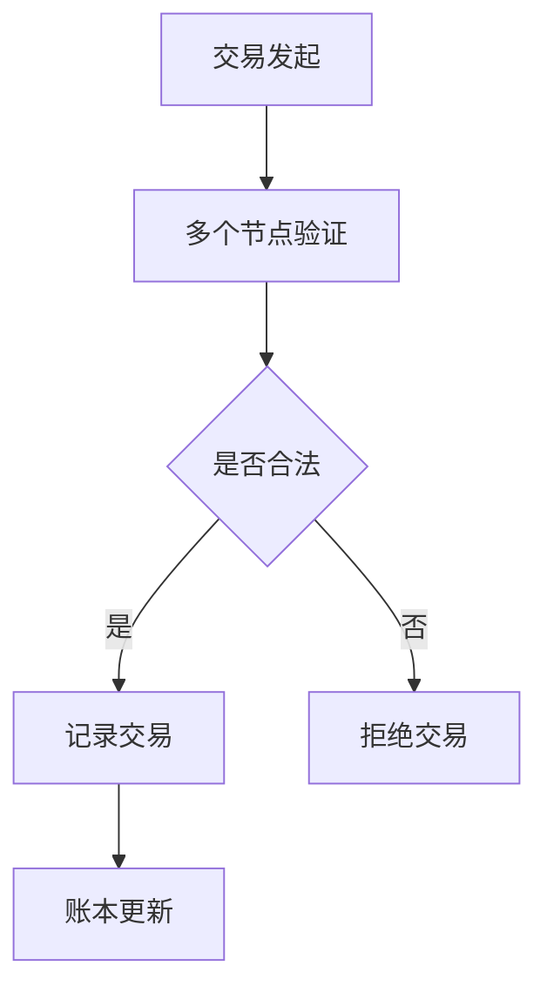
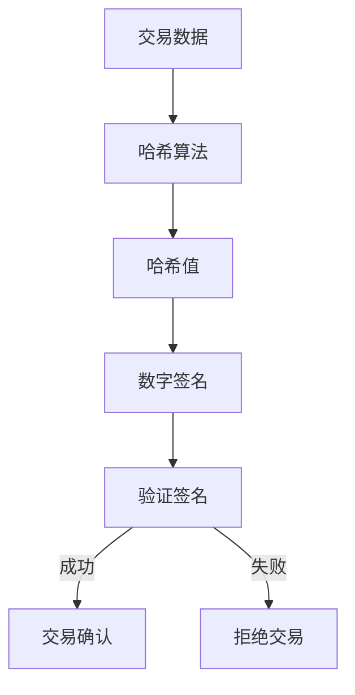
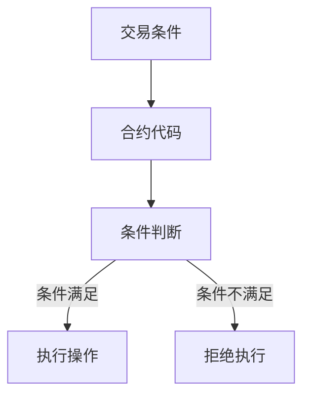

                 

关键词：区块链、技术创新、加密算法、分布式账本、智能合约、去中心化应用、共识机制、安全、隐私、智能计算

> 摘要：本文将探讨区块链技术的核心优势，包括分布式账本、加密算法和智能合约等，并分析这些优势如何驱动区块链领域的创新。文章将深入讨论区块链在不同应用场景中的实际案例，以及未来区块链技术发展的趋势和挑战。

## 1. 背景介绍

区块链技术，作为一种革命性的创新，起源于2008年中本聪（Satoshi Nakamoto）发布的比特币（Bitcoin）白皮书。最初，区块链被设计为一种去中心化的数字货币交易系统，以解决传统金融系统中存在的信任和效率问题。然而，随着时间的发展，区块链技术的潜力逐渐显现，并开始在金融以外的领域得到广泛应用。

区块链的核心优势在于其分布式账本技术，通过去中心化的方式记录和验证交易，提高了系统的透明度和安全性。此外，区块链上的加密算法保证了数据的不可篡改性，使得每个参与方都能信任系统中的数据。智能合约则进一步扩展了区块链的应用范围，通过代码自动执行合同条款，降低了交易成本和风险。

## 2. 核心概念与联系

### 分布式账本

分布式账本技术是区块链的基础，它通过将数据分散存储在多个节点上，避免了单点故障和数据丢失的风险。以下是分布式账本的 Mermaid 流程图：



### 加密算法

区块链上的加密算法主要包括哈希算法和数字签名。哈希算法用于生成交易数据的唯一标识，确保数据的完整性。数字签名则用于验证交易发起方的身份，保障交易的安全性。以下是加密算法的 Mermaid 流程图：



### 智能合约

智能合约是一种自动执行合同条款的计算机程序，它运行在区块链上，无需第三方干预。智能合约通过代码定义了交易的逻辑和条件，一旦触发条件，合约便会自动执行相应的操作。以下是智能合约的 Mermaid 流程图：



## 3. 核心算法原理 & 具体操作步骤

### 3.1 算法原理概述

区块链的核心算法包括共识算法、加密算法和智能合约。共识算法用于达成网络节点间的共识，确保交易的有效性和账本的一致性。加密算法用于保障数据的安全性和隐私性。智能合约则提供了自动化交易执行的功能。

### 3.2 算法步骤详解

#### 3.2.1 共识算法

共识算法的主要步骤包括：

1. 交易收集：节点收集待验证的交易。
2. 交易验证：节点验证交易的有效性。
3. 区块构建：将验证通过的交易打包成区块。
4. 区块验证：其他节点验证区块的正确性。
5. 账本更新：确认区块后，更新整个网络上的账本。

#### 3.2.2 加密算法

加密算法的主要步骤包括：

1. 哈希算法：对交易数据进行哈希处理，生成唯一的哈希值。
2. 数字签名：交易发起方使用私钥对交易数据进行数字签名。
3. 验证签名：交易接收方使用公钥验证签名。

#### 3.2.3 智能合约

智能合约的主要步骤包括：

1. 条件设置：开发者定义交易触发条件和执行操作。
2. 代码部署：将智能合约代码部署到区块链上。
3. 条件判断：触发条件后，合约自动执行相应操作。
4. 结果记录：记录操作结果，更新区块链状态。

### 3.3 算法优缺点

#### 3.3.1 共识算法

**优点**：去中心化、安全可靠、无需第三方中介。

**缺点**：交易处理速度较慢、能源消耗大。

#### 3.3.2 加密算法

**优点**：数据安全性高、隐私保护。

**缺点**：加密和解密过程较复杂、计算资源消耗大。

#### 3.3.3 智能合约

**优点**：自动化执行、降低成本、提高效率。

**缺点**：代码安全性问题、难以修改。

### 3.4 算法应用领域

区块链技术的核心算法在以下领域具有广泛的应用：

1. 数字货币：比特币、以太坊等。
2. 金融行业：跨境支付、智能投顾、保险等。
3. 物流供应链：商品追踪、物流管理、溯源等。
4. 政府事务：身份认证、投票系统、电子档案等。
5. 其他：版权保护、医疗健康、教育认证等。

## 4. 数学模型和公式 & 详细讲解 & 举例说明

### 4.1 数学模型构建

区块链技术中的数学模型主要包括哈希函数、椭圆曲线加密算法和智能合约逻辑等。

#### 4.1.1 哈希函数

哈希函数是将任意长度的输入（消息）映射为固定长度的输出（哈希值）。常见的哈希函数有SHA-256、SHA-3等。

$$
H(\text{message}) = \text{hash value}
$$

#### 4.1.2 椭圆曲线加密算法

椭圆曲线加密算法（ECC）是一种非对称加密算法，具有更高的安全性和更小的密钥长度。

$$
E: y^2 = x^3 + ax + b
$$

#### 4.1.3 智能合约逻辑

智能合约逻辑通常使用形式化语言（如Solidity）进行编写，定义交易触发条件和执行操作。

$$
contract \ MyContract {
    function transfer(address _to, uint _value) {
        if (balance \> _value) {
            balance -= _value;
            _to.send(_value);
        } else {
            throw;
        }
    }
}
$$

### 4.2 公式推导过程

#### 4.2.1 哈希函数

哈希函数的推导过程通常涉及复杂的数学理论和计算方法，以下是一个简化的例子：

$$
H(\text{message}) = (\text{message} \mod 2^256)
$$

#### 4.2.2 椭圆曲线加密算法

椭圆曲线加密算法的推导过程涉及椭圆曲线数学和代数几何理论，以下是一个简化的例子：

$$
y^2 = x^3 + ax + b
$$

其中，\(a\) 和 \(b\) 是椭圆曲线的系数，\(x\) 和 \(y\) 是椭圆曲线上的点。

### 4.3 案例分析与讲解

#### 4.3.1 比特币交易

比特币交易的核心是使用SHA-256哈希函数验证交易的输入和输出。以下是一个比特币交易的例子：

1. 交易输入：用户A的比特币地址和金额。
2. 交易输出：用户B的比特币地址和金额。
3. 输出哈希值：使用SHA-256哈希函数对交易数据进行哈希处理。

$$
H(\text{交易输入}) = \text{哈希值}_1
$$

$$
H(\text{交易输出}) = \text{哈希值}_2
$$

4. 验证：验证交易输入和输出的哈希值是否匹配。

$$
\text{哈希值}_1 = \text{哈希值}_2
$$

#### 4.3.2 智能合约执行

以下是一个简单的智能合约例子，用于转移以太币：

1. 条件设置：当调用transfer函数时，检查调用者的余额是否足够。
2. 执行操作：当条件满足时，将余额从调用者转移到接收者。
3. 结果记录：记录转账操作的结果。

$$
contract \ MyContract {
    function transfer(address _to, uint _value) {
        if (balance \> _value) {
            balance -= _value;
            _to.send(_value);
        } else {
            throw;
        }
    }
}
$$

## 5. 项目实践：代码实例和详细解释说明

### 5.1 开发环境搭建

要在本地开发区块链项目，首先需要安装Node.js、Golang或其他合适的编程语言环境。然后，安装区块链开发工具，如Truffle、Ganache等。

### 5.2 源代码详细实现

以下是一个简单的以太坊智能合约示例，用于实现去中心化投票系统：

```solidity
// SPDX-License-Identifier: MIT
pragma solidity ^0.8.0;

contract Voting {
    mapping(address => bool) public voters;
    mapping(bytes32 => uint256) public proposals;
    bytes32[] public proposalList;

    function propose(string memory proposalText) public {
        bytes32 proposalHash = keccak256(abi.encodePacked(proposalText));
        if (proposalHash != 0) {
            proposalList.push(proposalHash);
            proposals[proposalHash] = 0;
        }
    }

    function vote(bytes32 proposalHash) public {
        require(!voters[msg.sender], "Already voted");
        require(proposalHash != 0, "Invalid proposal");
        voters[msg.sender] = true;
        proposals[proposalHash]++;
    }

    function winningProposal() public view returns (bytes32) {
        require(proposalList.length > 0, "No proposals yet");
        bytes32 winningProposalHash;
        uint256 maxVotes = 0;
        for (uint256 i = 0; i < proposalList.length; i++) {
            if (proposals[proposalList[i]] > maxVotes) {
                maxVotes = proposals[proposalList[i]];
                winningProposalHash = proposalList[i];
            }
        }
        return winningProposalHash;
    }
}
```

### 5.3 代码解读与分析

1. **合约结构**：合约使用Solidity语言编写，定义了三个关键数据结构：voters、proposals和proposalList。voters用于记录已投票的用户，proposals用于记录各提案的投票结果，proposalList用于存储所有提案的哈希值。
2. **提案功能**：propose函数用于创建提案，接受提案文本，计算提案哈希值，并将提案添加到proposalList和proposals映射中。
3. **投票功能**：vote函数用于用户为提案投票，首先检查用户是否已投票，然后更新voters映射和proposals映射。
4. **获胜提案功能**：winningProposal函数用于计算并获得获胜提案的哈希值，通过遍历proposalList和proposals映射，找出投票数最多的提案。

### 5.4 运行结果展示

1. **提案创建**：用户A调用propose函数创建一个提案，提案哈希值被添加到proposalList和proposals映射中。
2. **投票**：用户B和用户C为提案投票，更新voters映射和proposals映射。
3. **查询获胜提案**：调用winningProposal函数，返回获胜提案的哈希值。

## 6. 实际应用场景

### 6.1 数字货币

数字货币是区块链技术的最典型应用，如比特币、以太坊等。它们通过区块链技术实现了去中心化的交易和资产转移，降低了交易成本，提高了交易效率。

### 6.2 金融行业

区块链技术在金融行业中的应用非常广泛，包括跨境支付、智能投顾、供应链金融等。区块链技术提高了交易的安全性、透明度和效率，降低了金融欺诈和操作风险。

### 6.3 物流供应链

区块链技术在物流供应链中的应用主要用于商品追踪、物流管理和溯源。通过区块链技术，供应链上的各个环节可以实时更新数据，提高了供应链的透明度和协同性。

### 6.4 政府事务

区块链技术在政府事务中的应用包括身份认证、投票系统、电子档案等。区块链技术保证了数据的不可篡改性，提高了政府服务的效率和可信度。

### 6.5 其他领域

除了上述领域，区块链技术还在版权保护、医疗健康、教育认证、能源管理等领域得到应用。区块链技术为这些领域带来了新的解决方案，提高了数据的安全性和隐私性。

## 7. 工具和资源推荐

### 7.1 学习资源推荐

1. 《区块链技术指南》
2. 《智能合约开发实战》
3. 《区块链与数字货币》
4. Ethereum官方文档

### 7.2 开发工具推荐

1. Truffle：以太坊开发框架
2. Ganache：本地以太坊节点搭建工具
3. Remix：在线智能合约开发环境
4. MetaMask：以太坊钱包

### 7.3 相关论文推荐

1. "Bitcoin: A Peer-to-Peer Electronic Cash System"（比特币：一种点对点电子现金系统）
2. "The Byzantine Generals' Problem"（拜占庭将军问题）
3. "Consensus in Blockchain Systems"（区块链系统中的共识算法）
4. "Cryptocurrency: Bitcoin, Blockchain, and the Future of Money"（数字货币：比特币、区块链与未来货币）

## 8. 总结：未来发展趋势与挑战

### 8.1 研究成果总结

区块链技术在过去几年取得了显著的成果，包括数字货币的广泛应用、金融行业的数字化转型、物流供应链的透明化等。这些成果证明了区块链技术在提高数据安全性和透明度方面的巨大潜力。

### 8.2 未来发展趋势

1. **跨链技术**：实现不同区块链之间的互操作性和数据共享。
2. **隐私保护**：开发更先进的隐私保护机制，满足用户对数据隐私的需求。
3. **智能合约优化**：提高智能合约的性能和安全性。
4. **应用场景拓展**：在更多领域（如物联网、智能制造等）推广区块链技术。

### 8.3 面临的挑战

1. **性能提升**：提高区块链的处理速度和扩展性。
2. **安全性问题**：防范区块链网络中的恶意攻击和漏洞。
3. **法律法规**：适应不同国家和地区的法律法规，实现合规发展。
4. **用户接受度**：提高公众对区块链技术的认知和接受度。

### 8.4 研究展望

未来，区块链技术将继续在各个领域发挥作用，推动社会数字化进程。同时，研究人员和开发者需要不断攻克技术难题，提高区块链的性能、安全性和易用性，为用户提供更好的体验。

## 9. 附录：常见问题与解答

### 9.1 区块链技术是什么？

区块链技术是一种分布式数据库技术，通过多个节点存储和验证数据，实现数据的不可篡改和去中心化。

### 9.2 区块链技术的核心优势是什么？

区块链技术的核心优势包括分布式账本、加密算法、智能合约等，这些技术提高了数据的安全性、透明度和效率。

### 9.3 区块链技术有哪些应用场景？

区块链技术广泛应用于数字货币、金融行业、物流供应链、政府事务、版权保护、医疗健康等领域。

### 9.4 智能合约如何工作？

智能合约是一种运行在区块链上的计算机程序，通过代码自动执行合同条款，无需第三方干预。

### 9.5 区块链技术的未来发展如何？

未来，区块链技术将继续在各个领域发挥作用，推动社会数字化进程。同时，研究人员和开发者需要不断攻克技术难题，提高区块链的性能、安全性和易用性。

## 参考文献

1. Nakamoto, S. (2008). Bitcoin: A Peer-to-Peer Electronic Cash System. *Cryptocurrency Research Group*.
2. Byzantine Generals' Problem. (2002). *ACM Digital Library*.
3. Consensus in Blockchain Systems. (2016). *IEEE Transactions on Emerging Topics in Computer Science*.
4. Cryptocurrency: Bitcoin, Blockchain, and the Future of Money. (2018). *O'Reilly Media*.

### 结语

区块链技术作为一种革命性的创新，正在改变我们的世界。本文探讨了区块链技术的核心优势、应用场景和未来发展趋势。随着技术的不断进步，我们有理由相信，区块链技术将继续发挥重要作用，为人类社会带来更多的价值。

### 作者署名

作者：禅与计算机程序设计艺术 / Zen and the Art of Computer Programming

----------------------------------------------------------------
本文通过详细的论述和实例，全面介绍了区块链技术的核心优势和应用场景，并对其未来发展进行了展望。希望这篇文章能对读者深入了解区块链技术有所帮助。再次感谢您的阅读！

