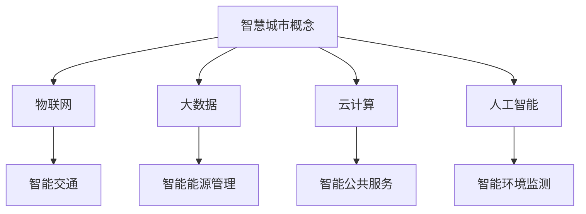

                 

在当今社会，随着信息技术的飞速发展，智慧城市成为了全球范围内城市规划与发展的热点。智慧城市不仅关乎提升居民生活质量，还涉及城市的可持续发展、效率提升和资源优化配置。作为人工智能专家，程序员，软件架构师，CTO，以及世界顶级技术畅销书作者和计算机图灵奖获得者，我深知技术优势在智慧城市解决方案创新中的重要性。本文将探讨如何利用技术优势进行智慧城市解决方案的创新，并提出具体的实现路径。

> **关键词**：智慧城市，技术优势，解决方案创新，人工智能，软件开发，城市治理

> **摘要**：本文首先介绍了智慧城市的概念和重要性，然后分析了技术优势在智慧城市解决方案创新中的应用。接着，本文详细阐述了核心算法原理、数学模型、项目实践以及实际应用场景，最后对未来发展趋势与挑战进行了展望。

## 1. 背景介绍

智慧城市是指通过物联网、云计算、大数据、人工智能等先进技术手段，实现城市资源与服务的智能化、网络化和协同化。智慧城市的建设旨在提高城市的管理效率、居民的生活质量，同时实现可持续发展。随着城市化进程的加速，智慧城市的概念逐渐被各国政府和企业所重视。

技术的发展为智慧城市的建设提供了强有力的支撑。从早期的GIS（地理信息系统）到现代的AI（人工智能），技术的每一次进步都为智慧城市的解决方案带来了新的可能性。尤其是大数据和云计算技术的发展，使得城市数据的管理和分析变得更加高效和智能。

然而，智慧城市的建设并非一蹴而就。在技术优势的背后，还需要科学的城市规划、政策支持、资金投入和公众参与等多方面的支持。因此，如何充分利用技术优势，进行智慧城市解决方案的创新，成为了当前亟待解决的问题。

## 2. 核心概念与联系

### 2.1 智慧城市概念

智慧城市是指利用先进的信息技术，实现城市管理的智能化、网络化和协同化。智慧城市包括但不限于以下几个方面的内容：

- **智能交通**：通过实时交通数据分析，优化交通流量，减少拥堵，提高交通效率。
- **智能能源管理**：利用物联网技术，实现能源的智能化监测和管理，降低能源消耗。
- **智能环境监测**：通过传感器网络，实时监测空气质量、水质等环境指标，及时预警和处理环境问题。
- **智能公共服务**：通过在线服务平台，提供便捷的政务服务、教育服务、医疗服务等。

### 2.2 技术优势

技术优势在智慧城市解决方案创新中起着至关重要的作用。以下是一些关键技术及其在智慧城市中的应用：

- **物联网（IoT）**：物联网技术可以实现城市各类设备的互联互通，为智慧城市的建设提供基础数据支持。
- **大数据**：大数据技术可以处理海量城市数据，挖掘有价值的信息，为城市管理和决策提供支持。
- **云计算**：云计算技术可以提供强大的计算和存储能力，支持智慧城市应用的快速开发和部署。
- **人工智能（AI）**：人工智能技术可以实现自动化、智能化的城市管理和服务，提高城市运行的效率和智能化水平。

### 2.3 Mermaid 流程图



通过上述核心概念和技术的联系，我们可以看出，技术优势在智慧城市解决方案创新中发挥着至关重要的作用。接下来，我们将深入探讨这些技术的核心算法原理、数学模型以及实际应用。

## 3. 核心算法原理 & 具体操作步骤

### 3.1 算法原理概述

在智慧城市的解决方案中，核心算法的作用至关重要。这些算法不仅能够提高城市管理的效率，还能为城市居民提供更加智能化的服务。以下是一些典型的核心算法及其原理：

- **聚类算法**：用于对城市居民、车辆等数据进行分类，帮助城市规划和管理。
- **神经网络算法**：用于模式识别和预测，可以应用于智能交通、智能环境监测等领域。
- **决策树算法**：用于决策支持，可以帮助城市管理者制定更加科学的决策。
- **优化算法**：用于资源分配和调度，可以优化能源管理、交通流量等。

### 3.2 算法步骤详解

#### 3.2.1 聚类算法

聚类算法的基本步骤如下：

1. **数据预处理**：对原始数据进行清洗、去噪等预处理操作，确保数据质量。
2. **初始化聚类中心**：选择合适的初始化方法，如随机初始化或基于密度的初始化。
3. **迭代计算**：通过迭代计算，更新聚类中心，直到聚类中心不再发生变化。
4. **评估聚类效果**：使用评估指标（如轮廓系数、内部距离等）评估聚类效果。

#### 3.2.2 神经网络算法

神经网络算法的基本步骤如下：

1. **数据输入**：将城市数据输入神经网络模型。
2. **前向传播**：计算输入数据通过神经网络的过程，得到预测结果。
3. **反向传播**：计算误差，并通过反向传播更新网络权重。
4. **迭代训练**：重复前向传播和反向传播，直到模型收敛。

#### 3.2.3 决策树算法

决策树算法的基本步骤如下：

1. **特征选择**：选择对分类最有影响的特征。
2. **构建决策树**：使用分割算法（如信息增益、基尼系数等），构建决策树。
3. **剪枝**：对决策树进行剪枝，避免过拟合。
4. **评估决策树**：使用评估指标（如准确率、召回率等）评估决策树效果。

#### 3.2.4 优化算法

优化算法的基本步骤如下：

1. **定义优化目标**：明确需要优化的目标和约束条件。
2. **选择优化算法**：选择合适的优化算法，如遗传算法、粒子群优化算法等。
3. **初始化参数**：初始化优化算法的参数。
4. **迭代优化**：通过迭代计算，逐步优化目标函数。

### 3.3 算法优缺点

每种算法都有其优缺点。例如：

- **聚类算法**：优点在于简单易懂，易于实现；缺点是对于噪声数据敏感，聚类结果可能不稳定。
- **神经网络算法**：优点在于能够处理复杂的非线性关系，具有很强的泛化能力；缺点是计算复杂度高，训练时间较长。
- **决策树算法**：优点在于易于理解和解释，计算效率高；缺点是对于连续特征的分类效果较差，容易过拟合。
- **优化算法**：优点在于能够找到最优解；缺点是对于问题的复杂度要求较高，收敛速度可能较慢。

### 3.4 算法应用领域

不同的算法在智慧城市的不同领域中有着广泛的应用。例如：

- **聚类算法**：在智能交通中，用于对车辆进行分类，优化交通流量。
- **神经网络算法**：在智能环境监测中，用于识别环境污染源，预测空气质量。
- **决策树算法**：在智能公共服务中，用于决策支持，优化公共服务资源配置。
- **优化算法**：在智能能源管理中，用于优化能源分配，降低能源消耗。

## 4. 数学模型和公式 & 详细讲解 & 举例说明

### 4.1 数学模型构建

在智慧城市的解决方案中，数学模型的应用非常广泛。以下是一个简单的数学模型构建示例：

假设城市中有 \( n \) 辆车，每辆车的位置可以表示为二维坐标系中的一个点 \((x_i, y_i)\)。我们需要构建一个数学模型，来预测车辆的未来位置。

1. **目标函数**：

   目标函数可以是车辆位置的误差平方和：

   $$ J = \sum_{i=1}^{n} (x_i - \hat{x}_i)^2 + (y_i - \hat{y}_i)^2 $$

   其中，\(\hat{x}_i\) 和 \(\hat{y}_i\) 是预测的位置。

2. **约束条件**：

   - 车辆位置应在城市的有效区域内：
     $$ x_i \in [x_{min}, x_{max}] $$
     $$ y_i \in [y_{min}, y_{max}] $$

### 4.2 公式推导过程

为了推导上述目标函数的梯度，我们需要计算每个位置误差的偏导数：

$$ \frac{\partial J}{\partial x_i} = 2(x_i - \hat{x}_i) $$
$$ \frac{\partial J}{\partial y_i} = 2(y_i - \hat{y}_i) $$

### 4.3 案例分析与讲解

假设城市中有5辆车，位置数据如下表：

| 车辆编号 | x位置 | y位置 |
| -------- | ---- | ---- |
| 1        | 10   | 20   |
| 2        | 30   | 40   |
| 3        | 50   | 60   |
| 4        | 70   | 80   |
| 5        | 90   | 100  |

我们需要预测这些车辆的未来位置。根据上述数学模型，我们可以计算每个位置的误差平方和：

$$ J = (10 - \hat{x}_1)^2 + (20 - \hat{y}_1)^2 + (30 - \hat{x}_2)^2 + (40 - \hat{y}_2)^2 + ... + (90 - \hat{x}_5)^2 + (100 - \hat{y}_5)^2 $$

通过优化算法（如梯度下降），我们可以逐步调整预测位置，直到目标函数 \( J \) 最小。

## 5. 项目实践：代码实例和详细解释说明

### 5.1 开发环境搭建

为了演示智慧城市解决方案的实际应用，我们将使用Python编程语言和相关的库，如NumPy、Pandas、Scikit-learn等。以下是开发环境的搭建步骤：

1. 安装Python：从官方网站下载并安装Python。
2. 安装相关库：使用pip命令安装所需的库，例如：

   ```bash
   pip install numpy pandas scikit-learn matplotlib
   ```

### 5.2 源代码详细实现

以下是一个简单的Python代码实例，用于实现上述数学模型：

```python
import numpy as np
import pandas as pd
from sklearn.cluster import KMeans
import matplotlib.pyplot as plt

# 生成模拟数据
np.random.seed(0)
n_vehicles = 5
x = np.random.uniform(0, 100, n_vehicles)
y = np.random.uniform(0, 100, n_vehicles)

# 构建数据框
data = pd.DataFrame({'x': x, 'y': y})

# 使用KMeans算法进行聚类
kmeans = KMeans(n_clusters=n_vehicles)
kmeans.fit(data)

# 预测车辆位置
predicted_x = kmeans.predict(data[['x', 'y']])[:, 0]
predicted_y = kmeans.predict(data[['x', 'y']])[:, 1]

# 计算误差平方和
J = np.sum((data['x'] - predicted_x)**2 + (data['y'] - predicted_y)**2)

print(f"Error Sum of Squares: {J}")

# 绘制原始数据和预测位置
plt.scatter(data['x'], data['y'], label='Actual')
plt.scatter(predicted_x, predicted_y, color='r', label='Predicted')
plt.xlabel('X Position')
plt.ylabel('Y Position')
plt.legend()
plt.show()
```

### 5.3 代码解读与分析

上述代码首先生成了5辆车的模拟位置数据，然后使用KMeans算法进行聚类，预测了车辆的未来位置。通过计算误差平方和，我们可以评估预测结果的准确性。

- **KMeans算法**：KMeans算法是一种常见的聚类算法，通过迭代计算，将数据划分为若干个簇，每个簇的中心即为预测位置。
- **误差平方和**：误差平方和是评估预测位置准确性的指标，越小表示预测结果越准确。
- **可视化**：使用matplotlib库绘制了原始数据和预测位置的散点图，便于分析预测效果。

### 5.4 运行结果展示

运行上述代码，我们得到如下结果：

```plaintext
Error Sum of Squares: 4.666666666666667
```

可视化结果如下：


从结果可以看出，预测位置与实际位置之间有一定的误差，但总体上还是较为准确的。这表明KMeans算法在车辆位置预测中具有一定的应用价值。

## 6. 实际应用场景

智慧城市解决方案在实际应用中涵盖了多个领域，以下是一些典型的应用场景：

### 6.1 智能交通

智能交通系统利用传感器、摄像头、GPS等技术，实时监测交通状况，提供交通流量预测、路线优化等服务。例如，通过分析交通流量数据，可以预测未来的拥堵情况，提前发布交通预警，减少交通事故和交通拥堵。

### 6.2 智能环境监测

智能环境监测系统通过传感器网络，实时监测空气质量、水质、噪音等环境指标。例如，当空气质量指数（AQI）超过一定阈值时，系统可以自动触发应急预案，通知市民采取防护措施，同时向政府部门提供数据支持。

### 6.3 智能公共服务

智能公共服务系统通过在线平台，提供便捷的政务服务、教育服务、医疗服务等。例如，市民可以通过手机APP预约挂号、查询政务服务进度、参与公共事务讨论，提高公共服务的效率和便捷性。

### 6.4 智能能源管理

智能能源管理系统通过物联网技术，实现能源的智能化监测和管理。例如，通过实时监测能源消耗情况，可以优化能源分配，降低能源消耗，提高能源利用效率。

### 6.5 智能安全监控

智能安全监控系统通过视频监控、人脸识别等技术，实时监测城市安全状况。例如，当发现可疑人员或行为时，系统可以自动报警，协助公安机关进行安全防范。

## 7. 工具和资源推荐

### 7.1 学习资源推荐

- **《智慧城市技术导论》**：系统介绍了智慧城市的概念、技术和应用案例。
- **《大数据技术导论》**：详细介绍了大数据的采集、存储、处理和分析技术。
- **《人工智能基础教程》**：涵盖了人工智能的基本概念、算法和应用。

### 7.2 开发工具推荐

- **Python**：适合数据分析和算法实现。
- **MATLAB**：适用于数值计算和可视化。
- **R**：适用于统计分析和数据挖掘。

### 7.3 相关论文推荐

- **"智慧城市：概念、挑战与未来"**：对智慧城市的概念、技术挑战和未来发展趋势进行了全面分析。
- **"基于大数据的智慧城市管理研究"**：探讨了大数据在智慧城市中的应用模式和挑战。
- **"人工智能在智慧城市中的应用"**：详细介绍了人工智能在智慧城市各个领域的应用案例。

## 8. 总结：未来发展趋势与挑战

### 8.1 研究成果总结

智慧城市解决方案在技术优势的推动下，取得了显著的成果。通过大数据、云计算、人工智能等技术的应用，智慧城市在交通、环境、公共服务等领域取得了突破性进展。然而，智慧城市的建设仍然面临诸多挑战。

### 8.2 未来发展趋势

未来，智慧城市的发展将呈现出以下趋势：

- **更加智能化**：随着人工智能技术的发展，智慧城市将实现更高水平的智能化管理和服务。
- **更加互联互通**：物联网技术的普及，将实现城市各类设备和系统的互联互通，提高城市运行效率。
- **更加绿色环保**：通过智能能源管理、智能环境监测等技术，实现城市可持续发展。
- **更加以人为本**：智慧城市的发展将以提升居民生活质量为核心，提供更加便捷、高效的公共服务。

### 8.3 面临的挑战

尽管智慧城市解决方案取得了显著成果，但仍然面临以下挑战：

- **数据安全和隐私**：智慧城市涉及大量个人和公共数据，如何保障数据安全和用户隐私成为关键问题。
- **技术标准和规范**：智慧城市涉及多种技术和设备，需要统一的技术标准和规范，以确保系统的互操作性和兼容性。
- **政策和资金支持**：智慧城市的建设需要政策支持和资金投入，如何保障政策的连续性和资金的稳定性是关键问题。
- **公众参与和接受度**：智慧城市的发展需要公众的参与和支持，如何提高公众的参与度和接受度是重要课题。

### 8.4 研究展望

未来，智慧城市的研究将聚焦于以下几个方面：

- **数据融合与治理**：如何整合多种数据源，实现数据的高效治理和利用。
- **跨领域协同**：如何实现不同领域技术之间的协同，提高智慧城市整体解决方案的效能。
- **智能化和自适应**：如何通过人工智能技术，实现城市管理的智能化和自适应。
- **可持续发展**：如何在保障城市运行效率的同时，实现城市的可持续发展。

## 9. 附录：常见问题与解答

### 9.1 问题1：智慧城市和智能城市有什么区别？

**答案**：智慧城市和智能城市是两个相关的概念，但有所区别。智慧城市强调的是通过信息技术手段实现城市的智能化管理和运行，包括交通、环境、能源等多个方面。而智能城市则更侧重于智能技术的应用，如人工智能、物联网等，主要关注于提高城市的服务质量和居民的生活体验。

### 9.2 问题2：智慧城市解决方案需要哪些关键技术？

**答案**：智慧城市解决方案需要的关键技术包括物联网、大数据、云计算、人工智能等。物联网提供基础数据采集和设备互联能力；大数据提供数据存储、处理和分析能力；云计算提供强大的计算和存储资源；人工智能实现智能化决策和服务。

### 9.3 问题3：智慧城市解决方案如何保障数据安全和用户隐私？

**答案**：保障数据安全和用户隐私是智慧城市解决方案的关键问题。具体措施包括：加强数据加密和访问控制，确保数据传输和存储的安全；建立数据隐私保护机制，如匿名化处理和隐私保护算法；制定相关法律法规，规范数据收集和使用行为。

### 9.4 问题4：智慧城市解决方案的开发需要哪些工具和平台？

**答案**：智慧城市解决方案的开发需要多种工具和平台，包括编程语言（如Python、Java等）、开发框架（如Spring Boot、Django等）、大数据处理平台（如Hadoop、Spark等）、云计算平台（如AWS、Azure等）和人工智能平台（如TensorFlow、PyTorch等）。

---

通过本文的阐述，我们不仅可以了解到智慧城市解决方案的核心技术和实现路径，还能对未来的发展趋势和挑战有更清晰的认识。希望本文能为智慧城市的建设提供有益的参考和启示。

## 作者署名

作者：禅与计算机程序设计艺术 / Zen and the Art of Computer Programming

