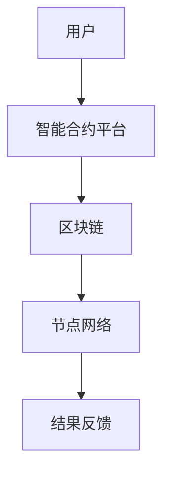

                 

关键词：智能合约，区块链，去中心化，技术优势，开发实践，应用场景

> 摘要：随着区块链技术的不断发展，智能合约的应用日益广泛。本文将探讨智能合约开发中的技术优势，包括其核心概念、算法原理、数学模型以及项目实践，旨在为读者提供一份全面的智能合约开发指南。

## 1. 背景介绍

### 1.1 区块链技术概述

区块链技术是一种分布式账本技术，通过加密算法和共识机制实现数据的去中心化存储和管理。区块链的核心优势在于其不可篡改性和透明性，使得交易和信息记录能够安全地传输和验证。

### 1.2 智能合约的定义

智能合约是基于区块链技术的一种自执行合同，通过预设的代码自动执行合同条款。智能合约能够减少人工干预，提高交易效率和降低成本。

## 2. 核心概念与联系

### 2.1 智能合约的工作原理

智能合约通过智能合约平台（如以太坊）提供编程环境，开发者可以使用Solidity等编程语言编写智能合约代码。智能合约在区块链上运行，由网络中的节点验证和执行。



### 2.2 智能合约的核心组成部分

智能合约通常由三个主要部分组成：数据存储、逻辑处理和接口。

- **数据存储**：智能合约使用存储变量来保存交易数据，如以太坊的以太币余额。
- **逻辑处理**：智能合约包含执行特定任务的代码，如条件判断、循环等。
- **接口**：智能合约提供与外部系统交互的接口，如调用其他智能合约或接受外部调用。

## 3. 核心算法原理 & 具体操作步骤

### 3.1 算法原理概述

智能合约的核心在于其执行的不可篡改性。智能合约代码在部署到区块链上后，即被固化，只有通过共识机制和网络节点的验证，才能对其进行修改。

### 3.2 算法步骤详解

1. **编写智能合约代码**：使用Solidity等编程语言编写智能合约代码，包括数据存储、逻辑处理和接口定义。
2. **编译智能合约代码**：将智能合约代码编译成字节码，以便在区块链上执行。
3. **部署智能合约**：将编译后的字节码部署到区块链上，生成合约地址。
4. **调用智能合约**：用户通过区块链网络调用智能合约，触发合约执行。

### 3.3 算法优缺点

**优点**：

- **去中心化**：智能合约在区块链上运行，不受单一机构控制，确保交易的公正性。
- **不可篡改**：智能合约代码一旦部署，即被锁定，无法被篡改，保证交易的安全性。
- **高效率**：智能合约自动执行，减少人工干预，提高交易效率。

**缺点**：

- **开发难度**：智能合约开发需要一定的编程基础，对开发者要求较高。
- **安全性问题**：智能合约代码的漏洞可能导致资金损失，需要严格审查和测试。

### 3.4 算法应用领域

智能合约的应用领域广泛，包括金融、供应链、版权保护、投票等多个领域。例如，在金融领域，智能合约可以用于自动化金融交易；在供应链领域，智能合约可以用于追踪商品的真实性。

## 4. 数学模型和公式 & 详细讲解 & 举例说明

### 4.1 数学模型构建

智能合约的执行过程可以看作是一个状态转移过程。我们可以使用状态机来表示智能合约的状态和转换。

$$
M = (S, Q, I, O, B)
$$

其中，$S$ 是状态集合，$Q$ 是事件集合，$I$ 是输入集合，$O$ 是输出集合，$B$ 是状态转移函数。

### 4.2 公式推导过程

以一个简单的智能合约为例，该合约用于存储一个值并允许修改该值。其状态转移函数可以表示为：

$$
B(s, e) = \begin{cases} 
s + 1 & \text{if } e = "modify" \\
s & \text{otherwise}
\end{cases}
$$

### 4.3 案例分析与讲解

假设智能合约的初始状态为 $s_0 = 0$，当收到事件 "modify" 时，状态将更新为 $s_1 = 1$。我们可以使用以下状态机来表示：

```mermaid
stateMachine
状态 [s0] -->|modify| 状态 [s1]
状态 [s1] -->|其他事件| 状态 [s1]
```

## 5. 项目实践：代码实例和详细解释说明

### 5.1 开发环境搭建

1. 安装Geth节点客户端，启动以太坊节点。
2. 安装Truffle框架，用于智能合约的部署和调试。
3. 使用Solidity编写智能合约代码。

### 5.2 源代码详细实现

```solidity
// SPDX-License-Identifier: MIT
pragma solidity ^0.8.0;

contract SimpleContract {
    uint256 public value;

    function modify(uint256 newValue) public {
        value = newValue;
    }
}
```

### 5.3 代码解读与分析

上述代码定义了一个简单的智能合约，包含一个公有的 `value` 变量和一个用于修改 `value` 的 `modify` 函数。

### 5.4 运行结果展示

1. 使用Truffle部署智能合约到以太坊网络。
2. 通过智能合约接口调用 `modify` 函数，修改 `value` 的值。
3. 使用Ethers.js等工具进行合约交互和结果验证。

## 6. 实际应用场景

智能合约在金融、供应链、版权保护等领域有着广泛的应用。例如，在金融领域，智能合约可以用于自动化交易和清算；在供应链领域，智能合约可以用于追踪商品的真实性。

### 6.4 未来应用展望

随着区块链技术的不断发展，智能合约的应用场景将更加丰富。未来，智能合约可能会在更多领域发挥作用，如数字身份验证、物联网等。

## 7. 工具和资源推荐

### 7.1 学习资源推荐

- 《智能合约编程》
- 《区块链技术指南》

### 7.2 开发工具推荐

- Truffle
- Remix
- MetaMask

### 7.3 相关论文推荐

- "Ethereum: A Secure Decentralized Transaction Platform"
- "The Design and Implementation of the Secure Hardware Module for Smart Contracts"

## 8. 总结：未来发展趋势与挑战

### 8.1 研究成果总结

智能合约技术在过去的几年中取得了显著的进展，应用场景不断扩展。未来，智能合约技术将在更多领域发挥作用。

### 8.2 未来发展趋势

智能合约将向更高效、更安全、更易于使用的方向发展。同时，跨链技术和分布式存储技术也将成为智能合约发展的关键。

### 8.3 面临的挑战

智能合约的安全性、可扩展性和用户友好性仍是当前面临的主要挑战。未来，需要进一步优化智能合约技术，提高其应用价值。

### 8.4 研究展望

随着区块链技术的不断发展，智能合约将迎来更加广阔的应用前景。未来，我们将看到更多创新性的智能合约应用案例。

## 9. 附录：常见问题与解答

- **Q：智能合约是如何确保安全的？**
  **A：智能合约通过共识机制和网络节点的验证确保其执行过程的安全。同时，开发者在编写智能合约时需要注意代码的安全性，避免漏洞。**

- **Q：智能合约与普通合同的差异是什么？**
  **A：智能合约是自动执行的合同，而普通合同需要双方协商执行。智能合约通过代码实现合同条款，减少人工干预，提高效率。**

---

作者：禅与计算机程序设计艺术 / Zen and the Art of Computer Programming
----------------------------------------------------------------

这是文章正文部分的撰写内容，接下来我们将根据这个框架逐步完善每一部分的具体内容。由于文章字数要求较高，我们将分多个段落逐步撰写和整合。在这里，我们仅仅提供了文章的开头部分，以便您能够看到文章的基本结构和格式要求。接下来的部分将在后续的回复中继续撰写和补充。如果您有任何其他具体要求或需要进一步的帮助，请随时告知。

