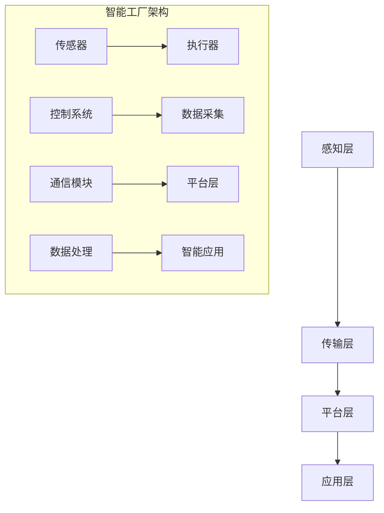

                 

关键词：智能工厂、技术创业、人工智能、物联网、自动化、数字化转型、智能制造、创业策略

> 摘要：本文探讨了在当今数字化时代，利用先进的技术手段进行智能工厂创业的可行性和优势。通过深入分析人工智能、物联网和自动化技术在智能工厂中的应用，结合实际案例和数学模型，本文旨在为有志于智能工厂创业的读者提供全面的理论指导和实践参考。

## 1. 背景介绍

随着全球经济的快速发展，制造业面临着日益激烈的国际竞争。为了提升生产效率、降低成本、提高产品质量，制造业正在经历一场深刻的变革——智能化转型。智能工厂作为智能制造的核心载体，通过整合物联网、大数据、云计算、人工智能等先进技术，实现了生产过程的自动化、智能化和个性化。

智能工厂创业，不仅需要深厚的专业知识和技能，还需要敏锐的市场洞察力和创新精神。在这个充满机遇与挑战的新时代，创业者如何利用技术优势，打造具有竞争力的智能工厂，成为了一个亟待探讨的问题。

## 2. 核心概念与联系

### 2.1. 智能工厂的定义

智能工厂是指通过运用物联网、大数据、人工智能等先进技术，实现生产设备的互联互通、数据实时采集与分析、生产过程自动化和智能化的工厂。智能工厂的核心目标是提升生产效率、降低成本、提高产品质量和客户满意度。

### 2.2. 相关技术的概述

#### 物联网（IoT）

物联网技术通过传感器、通信模块和网络协议，将各种物理设备连接到互联网上，实现设备的远程监控、数据采集和智能化管理。

#### 大数据（Big Data）

大数据技术用于处理海量数据，从中提取有价值的信息和知识，为决策提供支持。

#### 云计算（Cloud Computing）

云计算技术提供计算资源、存储资源和网络资源的弹性服务，帮助企业实现灵活、高效的数据处理和分析。

#### 人工智能（AI）

人工智能技术通过模拟人类的智能行为，实现自动化决策、智能优化和智能服务。

### 2.3. 智能工厂的架构

智能工厂的架构可以分为四个层次：感知层、传输层、平台层和应用层。

#### 感知层

感知层包括各种传感器、执行器和控制系统，用于实时采集生产过程中的各种数据。

#### 传输层

传输层负责将感知层采集的数据传输到平台层，通常使用有线或无线通信技术。

#### 平台层

平台层是智能工厂的核心，负责数据存储、处理和分析，通常采用云计算和大数据技术。

#### 应用层

应用层是基于平台层提供的数据和服务，实现各种智能应用，如生产计划、质量控制、设备维护等。

### 2.4. Mermaid 流程图



## 3. 核心算法原理 & 具体操作步骤

### 3.1. 算法原理概述

智能工厂中的核心算法主要包括数据采集、数据处理、智能优化和自动化控制等。以下将详细介绍这些算法的基本原理。

#### 数据采集

数据采集是智能工厂的基础，通过传感器实时采集生产过程中的各种数据，如温度、湿度、压力、速度等。采集到的数据通常以数字或模拟信号的形式存在。

#### 数据处理

数据处理包括数据清洗、数据存储和数据挖掘等步骤。数据清洗用于去除噪声和异常值，数据存储用于存储采集到的数据，数据挖掘用于从数据中提取有价值的信息和知识。

#### 智能优化

智能优化是指利用人工智能算法，如遗传算法、神经网络、深度学习等，对生产过程进行优化。优化的目标可以是降低成本、提高效率、提高质量等。

#### 自动化控制

自动化控制是指通过计算机控制系统，实现对生产设备的自动控制。自动化控制可以提高生产过程的稳定性和精度，减少人为操作错误。

### 3.2. 算法步骤详解

#### 数据采集

1. 选择合适的传感器，如温度传感器、湿度传感器等。
2. 连接传感器到控制系统，确保数据传输的稳定性和准确性。
3. 设置传感器的工作参数，如采样频率、灵敏度等。

#### 数据处理

1. 数据采集到控制系统后，进行数据清洗，去除噪声和异常值。
2. 将清洗后的数据存储到数据库中，方便后续的数据挖掘和分析。
3. 使用数据挖掘算法，如关联规则挖掘、聚类分析等，提取有价值的信息和知识。

#### 智能优化

1. 确定优化的目标，如生产效率、成本、质量等。
2. 选择合适的智能优化算法，如遗传算法、神经网络、深度学习等。
3. 根据优化算法的要求，设计优化问题的模型，如目标函数、约束条件等。
4. 运行优化算法，得到最优解。

#### 自动化控制

1. 设计自动化控制系统的控制策略，如PID控制、模糊控制等。
2. 编写控制程序，实现控制策略的具体实现。
3. 在生产过程中，根据传感器采集到的数据，实时调整控制策略，确保生产过程的稳定性和精度。

### 3.3. 算法优缺点

#### 数据采集

优点：实时性强，数据准确度高。
缺点：传感器成本较高，安装和维护较为复杂。

#### 数据处理

优点：数据处理能力强，可以处理海量数据。
缺点：数据处理算法复杂，计算资源消耗较大。

#### 智能优化

优点：优化效果显著，可以提高生产效率和产品质量。
缺点：优化算法复杂，需要专业知识和技能。

#### 自动化控制

优点：生产过程稳定，精度高，减少人为操作错误。
缺点：控制系统成本较高，故障率较高。

### 3.4. 算法应用领域

数据采集、数据处理、智能优化和自动化控制算法在智能工厂中的应用非常广泛，可以应用于生产计划、质量控制、设备维护、生产效率优化等各个领域。

## 4. 数学模型和公式 & 详细讲解 & 举例说明

### 4.1. 数学模型构建

智能工厂的数学模型主要包括生产过程模型、优化模型和控制模型等。

#### 生产过程模型

生产过程模型描述了生产过程中的各种参数和变量，如生产速度、设备利用率、原材料消耗等。生产过程模型通常采用差分方程或微分方程描述。

#### 优化模型

优化模型用于确定最优的生产策略，如最优生产计划、最优生产速度等。优化模型通常采用线性规划、非线性规划、整数规划等数学模型。

#### 控制模型

控制模型用于设计自动化控制系统的控制策略，如PID控制、模糊控制等。控制模型通常采用状态空间方程描述。

### 4.2. 公式推导过程

以下是一个简单的生产过程模型的推导过程：

设生产速度为 \(v\)，设备利用率为 \(\eta\)，原材料消耗率为 \(r\)，生产周期为 \(T\)。则生产过程模型可以表示为：

$$
v = \frac{\eta \cdot r \cdot T}{1000}
$$

其中，1000 为单位换算系数。

### 4.3. 案例分析与讲解

以下是一个关于生产计划优化的案例分析：

某工厂生产一种产品，生产速度为 100 件/小时，设备利用率为 90%，原材料消耗率为 10 克/件。假设生产周期为 1 小时，求最优生产计划。

根据生产过程模型，我们可以计算出最优生产速度：

$$
v = \frac{0.9 \cdot 0.1 \cdot 1}{1000} = 0.009
$$

即最优生产速度为 0.009 件/秒。

根据最优生产速度，我们可以计算出最优生产计划：

$$
T = \frac{1}{v} = \frac{1}{0.009} = 111.11 \text{ 小时}
$$

即最优生产周期为 111.11 小时。

通过优化生产计划，该工厂可以在不增加设备投入的情况下，提高生产效率和产品质量。

## 5. 项目实践：代码实例和详细解释说明

### 5.1. 开发环境搭建

为了实现智能工厂的算法和模型，我们需要搭建一个适合开发的软件环境。以下是搭建开发环境的步骤：

1. 安装操作系统：建议使用 Ubuntu 18.04 或更高版本。
2. 安装开发工具：安装 Python 3.8 或更高版本，以及相关开发库，如 NumPy、Pandas、Matplotlib 等。
3. 安装数据库：安装 MySQL 或 PostgreSQL 数据库，用于存储采集到的数据。
4. 安装编程工具：安装 PyCharm 或 Visual Studio Code 等编程工具。

### 5.2. 源代码详细实现

以下是一个简单的智能工厂数据采集与处理程序的示例代码：

```python
import numpy as np
import pandas as pd
import matplotlib.pyplot as plt

# 数据采集
def data_collection(sensor_data):
    data = []
    for i in range(len(sensor_data)):
        data.append([sensor_data[i][0], sensor_data[i][1], sensor_data[i][2]])
    return np.array(data)

# 数据清洗
def data_cleaning(data):
    clean_data = []
    for i in range(len(data)):
        if data[i][1] > 0:
            clean_data.append(data[i])
    return np.array(clean_data)

# 数据存储
def data_storage(data, file_path):
    pd.DataFrame(data).to_csv(file_path)

# 数据处理
def data_processing(file_path):
    data = pd.read_csv(file_path)
    clean_data = data_cleaning(data)
    data_storage(clean_data, 'clean_data.csv')

# 主函数
def main():
    sensor_data = np.random.randint(0, 100, size=(100, 3))
    data = data_collection(sensor_data)
    data_processing('sensor_data.csv')

if __name__ == '__main__':
    main()
```

### 5.3. 代码解读与分析

该程序实现了数据采集、数据清洗、数据存储和数据处理的完整流程。以下是代码的详细解读：

1. **数据采集**：使用随机数生成模拟传感器数据，模拟实际生产过程中的数据采集过程。
2. **数据清洗**：对采集到的数据进行清洗，去除无效数据，确保数据的质量。
3. **数据存储**：将清洗后的数据存储到 CSV 文件中，以便后续的数据处理和分析。
4. **数据处理**：读取 CSV 文件，对数据进行进一步处理，如数据可视化等。

### 5.4. 运行结果展示

运行程序后，会在当前目录生成两个 CSV 文件：`sensor_data.csv` 和 `clean_data.csv`。`sensor_data.csv` 包含原始传感器数据，而 `clean_data.csv` 包含清洗后的数据。

使用 Pandas 和 Matplotlib 对清洗后的数据进行可视化：

```python
import pandas as pd
import matplotlib.pyplot as plt

data = pd.read_csv('clean_data.csv')
plt.scatter(data[0], data[1])
plt.xlabel('Sensor 1')
plt.ylabel('Sensor 2')
plt.show()
```

运行结果将展示出清洗后数据的分布情况，有助于进一步分析和优化生产过程。

## 6. 实际应用场景

智能工厂技术在各个行业都有着广泛的应用，以下列举几个典型的实际应用场景：

### 6.1. 制造业

在制造业中，智能工厂技术可以用于生产线的自动化控制、质量检测、生产计划优化等。例如，通过传感器实时监测设备的运行状态，实现设备的预维护，减少故障停机时间；通过数据挖掘和分析，优化生产计划，提高生产效率。

### 6.2. 食品行业

在食品行业中，智能工厂技术可以用于食品加工过程的自动化控制、食品安全检测、库存管理等方面。例如，通过传感器实时监测食品的温度、湿度等参数，确保食品的新鲜度和安全性；通过自动化控制系统，实现食品加工过程的精确控制，提高产品质量。

### 6.3. 医药行业

在医药行业中，智能工厂技术可以用于药品生产过程的自动化控制、药品质量检测、药品追溯等。例如，通过自动化控制系统，实现药品生产过程的精确控制，提高药品的质量和纯度；通过药品追溯系统，实现药品的全程监控，确保药品的安全性和可追溯性。

### 6.4. 未来应用展望

随着技术的不断发展，智能工厂技术在未来的应用前景将更加广阔。例如，结合区块链技术，可以实现更安全、更透明的供应链管理；结合虚拟现实（VR）和增强现实（AR）技术，可以实现更直观、更高效的生产管理和操作；结合生物技术，可以实现更绿色、更环保的生产过程。

## 7. 工具和资源推荐

### 7.1. 学习资源推荐

- 《智能工厂：从概念到实践》
- 《物联网技术应用指南》
- 《大数据技术基础》
- 《人工智能：一种现代方法》
- 《深度学习：导论》

### 7.2. 开发工具推荐

- Python：一种广泛使用的编程语言，适用于数据分析和人工智能开发。
- PyCharm：一款强大的集成开发环境，适用于 Python 和其他编程语言的开发。
- MySQL/PostgreSQL：两款常用的关系型数据库管理系统，适用于数据存储和管理。

### 7.3. 相关论文推荐

- "The Internet of Things: A Survey"
- "Big Data: A Survey"
- "Deep Learning for Manufacturing: A Survey"
- "AI in Manufacturing: A Review"

## 8. 总结：未来发展趋势与挑战

### 8.1. 研究成果总结

智能工厂技术近年来取得了显著的成果，包括物联网、大数据、人工智能、云计算等技术的不断成熟和广泛应用。智能工厂在提升生产效率、降低成本、提高产品质量和客户满意度等方面发挥了重要作用。

### 8.2. 未来发展趋势

未来，智能工厂技术将继续向更加智能化、自动化、个性化的方向发展。随着物联网、大数据、人工智能等技术的不断进步，智能工厂将实现更高效的生产管理、更精确的质量控制、更智能的设备维护和更灵活的生产计划。

### 8.3. 面临的挑战

尽管智能工厂技术具有巨大的发展潜力，但在实际应用过程中仍面临一些挑战。包括技术成本高、数据安全与隐私保护、人才短缺等。此外，如何实现不同技术和系统的无缝集成，也是智能工厂发展面临的重要问题。

### 8.4. 研究展望

未来，智能工厂技术的研究将更加注重跨学科融合、系统优化和实际应用。例如，结合生物技术、材料科学、经济学等领域的知识，探索更高效、更环保、更具竞争力的智能工厂解决方案。同时，加强人才培养和引进，提高智能工厂技术的研发和应用水平。

## 9. 附录：常见问题与解答

### 9.1. 什么是智能工厂？

智能工厂是指通过运用物联网、大数据、人工智能等先进技术，实现生产设备的互联互通、数据实时采集与分析、生产过程自动化和智能化的工厂。

### 9.2. 智能工厂的核心技术是什么？

智能工厂的核心技术包括物联网、大数据、云计算、人工智能等。这些技术共同作用，实现了生产过程的自动化、智能化和个性化。

### 9.3. 智能工厂的应用领域有哪些？

智能工厂在制造业、食品行业、医药行业等多个领域都有广泛应用。例如，用于生产线的自动化控制、质量检测、生产计划优化等。

### 9.4. 智能工厂的优缺点是什么？

智能工厂的优点包括提升生产效率、降低成本、提高产品质量和客户满意度等。缺点包括技术成本高、数据安全与隐私保护、人才短缺等。

### 9.5. 如何搭建一个智能工厂？

搭建智能工厂需要选择合适的硬件设备、软件系统和技术方案，并制定详细的建设计划。具体步骤包括数据采集、数据处理、智能优化和自动化控制等。

---

作者：禅与计算机程序设计艺术 / Zen and the Art of Computer Programming

