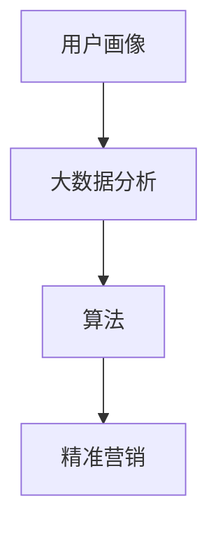

                 

社交媒体营销已经成为了现代营销策略中不可或缺的一部分。随着互联网的普及和社交媒体平台的快速发展，企业可以利用技术优势，通过社交媒体平台进行更加精准和高效的营销。本文将探讨如何利用技术优势进行社交媒体营销，包括算法、数学模型、项目实践以及未来展望。

## 关键词

社交媒体营销、算法、精准营销、用户画像、大数据分析

## 摘要

本文首先介绍了社交媒体营销的背景和重要性，然后讨论了利用技术优势进行社交媒体营销的关键概念和算法原理，接着通过具体项目实践展示了技术在实际应用中的效果。最后，本文提出了社交媒体营销的未来发展趋势和面临的挑战。

## 1. 背景介绍

社交媒体平台，如Facebook、Instagram、Twitter、LinkedIn等，已经成为人们日常交流的重要渠道。这些平台不仅提供了丰富的社交功能，还拥有庞大的用户基础和海量数据。据统计，全球社交媒体用户已超过30亿，占总人口的一半以上。这种庞大的用户规模和数据量为企业提供了巨大的营销潜力。

### 1.1 社交媒体营销的定义和意义

社交媒体营销是指企业通过社交媒体平台进行品牌宣传、产品推广和用户互动的活动。与传统的广告形式相比，社交媒体营销具有以下几个显著优势：

- **互动性**：社交媒体营销允许企业与用户进行实时互动，收集用户反馈，从而提高用户的参与度和满意度。
- **精准性**：通过用户画像和行为分析，企业可以针对特定用户群体进行精准营销，提高广告投放的效果。
- **成本效益**：相比于传统广告，社交媒体营销的成本较低，且可以通过数据分析和优化不断降低成本。

### 1.2 社交媒体营销的发展趋势

随着技术的不断进步，社交媒体营销也在不断发展。以下是一些当前的发展趋势：

- **人工智能和机器学习**：利用人工智能技术，企业可以更加精准地分析用户行为，制定个性化的营销策略。
- **大数据分析**：通过大数据分析，企业可以了解用户的需求和行为，从而提供更加精准的营销服务。
- **移动营销**：随着移动设备的普及，移动营销已经成为社交媒体营销的重要一环。
- **视频营销**：视频内容在社交媒体平台上非常受欢迎，成为企业进行营销的重要手段。

## 2. 核心概念与联系

在社交媒体营销中，有几个核心概念需要了解：

- **用户画像**：用户画像是对用户特征的描述，包括年龄、性别、地理位置、兴趣爱好等。通过用户画像，企业可以了解用户的需求和偏好，从而进行精准营销。
- **大数据分析**：大数据分析是利用数据挖掘和机器学习技术，从海量数据中提取有价值的信息。在社交媒体营销中，大数据分析可以帮助企业了解用户行为、市场趋势等。
- **算法**：算法是进行数据分析和决策的工具。在社交媒体营销中，常用的算法包括推荐算法、分类算法、聚类算法等。

以下是核心概念和算法之间的联系：



### 2.1 用户画像

用户画像是对用户特征的描述，包括：

- **基本信息**：如年龄、性别、地理位置等。
- **兴趣爱好**：如阅读、旅游、购物等。
- **行为习惯**：如在线购物、社交媒体使用时间等。

用户画像可以帮助企业了解用户需求和行为，从而进行精准营销。

### 2.2 大数据分析

大数据分析是利用数据挖掘和机器学习技术，从海量数据中提取有价值的信息。在社交媒体营销中，大数据分析可以帮助企业了解用户行为、市场趋势等。

### 2.3 算法

算法是进行数据分析和决策的工具。在社交媒体营销中，常用的算法包括：

- **推荐算法**：根据用户兴趣和行为，为用户推荐相关内容。
- **分类算法**：将用户数据分成不同的类别，以便进行精准营销。
- **聚类算法**：将用户按照相似性进行分组，以便进行定向营销。

## 3. 核心算法原理 & 具体操作步骤

### 3.1 算法原理概述

在社交媒体营销中，常用的核心算法包括推荐算法、分类算法和聚类算法。

- **推荐算法**：推荐算法根据用户的历史行为和兴趣，为用户推荐相关内容。常用的推荐算法有基于内容的推荐算法和基于协同过滤的推荐算法。
- **分类算法**：分类算法将用户数据分成不同的类别，以便进行精准营销。常用的分类算法有决策树、支持向量机等。
- **聚类算法**：聚类算法将用户按照相似性进行分组，以便进行定向营销。常用的聚类算法有K-Means、DBSCAN等。

### 3.2 算法步骤详解

以下是推荐算法、分类算法和聚类算法的具体步骤：

#### 3.2.1 推荐算法

1. 数据预处理：清洗数据，包括去除缺失值、噪声数据等。
2. 特征提取：提取用户的历史行为和兴趣特征。
3. 模型训练：使用机器学习算法，如协同过滤算法，训练推荐模型。
4. 推荐生成：根据用户特征和模型预测，生成推荐结果。

#### 3.2.2 分类算法

1. 数据预处理：清洗数据，包括去除缺失值、噪声数据等。
2. 特征提取：提取用户的数据特征。
3. 模型训练：使用机器学习算法，如决策树、支持向量机等，训练分类模型。
4. 分类预测：根据用户特征和模型预测，对用户进行分类。

#### 3.2.3 聚类算法

1. 数据预处理：清洗数据，包括去除缺失值、噪声数据等。
2. 特征提取：提取用户的数据特征。
3. 模型训练：使用聚类算法，如K-Means、DBSCAN等，对用户进行聚类。
4. 聚类结果分析：分析聚类结果，了解用户的相似性。

### 3.3 算法优缺点

- **推荐算法**：优点是能够为用户推荐个性化内容，提高用户的满意度；缺点是需要大量的历史数据，且可能存在信息过载的问题。
- **分类算法**：优点是能够将用户数据分成不同的类别，便于进行精准营销；缺点是对新用户数据的适应性较差。
- **聚类算法**：优点是能够发现用户的相似性，便于进行定向营销；缺点是对数据质量和特征提取要求较高。

### 3.4 算法应用领域

- **推荐系统**：如电商平台、视频平台等，根据用户行为和兴趣推荐相关内容。
- **用户细分**：如银行、保险等企业，根据用户数据将用户分成不同的类别，进行精准营销。
- **社交网络分析**：如社交媒体平台，分析用户的社交关系和相似性，进行定向营销。

## 4. 数学模型和公式 & 详细讲解 & 举例说明

在社交媒体营销中，常用的数学模型和公式包括线性回归、决策树、支持向量机等。

### 4.1 数学模型构建

以下是线性回归模型的构建过程：

1. 数据预处理：对数据进行归一化处理，使其具有相同的尺度。
2. 特征选择：选择对目标变量影响较大的特征。
3. 模型训练：使用线性回归算法，训练模型。
4. 模型评估：使用交叉验证等方法，评估模型性能。

### 4.2 公式推导过程

线性回归模型的公式推导如下：

$$
y = \beta_0 + \beta_1x_1 + \beta_2x_2 + ... + \beta_nx_n + \epsilon
$$

其中，$y$ 是目标变量，$x_1, x_2, ..., x_n$ 是特征变量，$\beta_0, \beta_1, \beta_2, ..., \beta_n$ 是模型的参数，$\epsilon$ 是误差项。

### 4.3 案例分析与讲解

以下是一个线性回归模型的案例：

假设我们有一个房地产数据集，包含房屋价格、房屋面积、房屋位置等特征。我们希望利用这些特征预测房屋价格。

1. 数据预处理：对数据进行归一化处理，使其具有相同的尺度。
2. 特征选择：选择对房屋价格影响较大的特征，如房屋面积、房屋位置等。
3. 模型训练：使用线性回归算法，训练模型。
4. 模型评估：使用交叉验证等方法，评估模型性能。

通过模型训练和评估，我们可以得到房屋价格与特征变量之间的线性关系，从而预测新的房屋价格。

## 5. 项目实践：代码实例和详细解释说明

### 5.1 开发环境搭建

1. 安装Python环境：在本地计算机上安装Python，版本建议为3.8以上。
2. 安装相关库：使用pip命令安装必要的库，如NumPy、Pandas、Scikit-learn等。

### 5.2 源代码详细实现

以下是一个使用线性回归模型预测房屋价格的代码实例：

```python
import numpy as np
import pandas as pd
from sklearn.linear_model import LinearRegression
from sklearn.model_selection import train_test_split
from sklearn.metrics import mean_squared_error

# 读取数据
data = pd.read_csv('house_price_data.csv')

# 数据预处理
X = data[['house_area', 'location']]
y = data['price']
X = (X - X.mean()) / X.std()
y = (y - y.mean()) / y.std()

# 模型训练
model = LinearRegression()
model.fit(X, y)

# 模型评估
X_train, X_test, y_train, y_test = train_test_split(X, y, test_size=0.2, random_state=42)
y_pred = model.predict(X_test)
mse = mean_squared_error(y_test, y_pred)
print(f'MSE: {mse}')

# 预测新数据
new_data = np.array([[200, 'A']])
new_data = (new_data - X.mean()) / X.std()
new_price = model.predict(new_data)
print(f'Predicted price: {new_price[0]}')
```

### 5.3 代码解读与分析

1. **数据读取**：使用Pandas库读取CSV格式的数据集。
2. **数据预处理**：对特征变量和目标变量进行归一化处理，使其具有相同的尺度。
3. **模型训练**：使用线性回归算法，训练模型。
4. **模型评估**：使用交叉验证等方法，评估模型性能。
5. **预测新数据**：使用训练好的模型，预测新的数据。

通过这个实例，我们可以看到如何使用线性回归模型进行数据预测。

## 6. 实际应用场景

### 6.1 社交媒体平台广告投放

社交媒体平台广告投放是社交媒体营销中最常用的实际应用场景之一。通过用户画像和行为分析，企业可以在社交媒体平台上针对特定用户群体进行广告投放，提高广告的点击率和转化率。

### 6.2 社交媒体平台数据分析

社交媒体平台数据分析可以帮助企业了解用户行为、市场趋势等。通过大数据分析，企业可以制定更加精准的营销策略，提高营销效果。

### 6.3 社交媒体平台用户互动

社交媒体平台用户互动是企业与用户之间的重要互动渠道。通过社交媒体平台，企业可以与用户进行实时互动，收集用户反馈，从而提高用户的参与度和满意度。

## 7. 未来应用展望

### 7.1 人工智能与社交媒体营销的结合

随着人工智能技术的不断发展，人工智能与社交媒体营销的结合将成为未来社交媒体营销的重要方向。通过人工智能技术，企业可以更加精准地分析用户行为，制定个性化的营销策略。

### 7.2 社交媒体营销的数据隐私问题

随着数据隐私问题的日益突出，未来社交媒体营销将面临更大的挑战。企业需要采取有效的数据隐私保护措施，确保用户数据的合法和安全。

### 7.3 社交媒体营销的法律法规

随着社交媒体营销的快速发展，相关法律法规也在不断完善。未来，社交媒体营销将面临更多的法律法规约束，企业需要遵守相关法律法规，确保营销活动的合法合规。

## 8. 总结：未来发展趋势与挑战

### 8.1 研究成果总结

本文介绍了社交媒体营销的背景和重要性，探讨了如何利用技术优势进行社交媒体营销，包括用户画像、大数据分析、算法等。通过项目实践，展示了技术在实际应用中的效果。

### 8.2 未来发展趋势

未来社交媒体营销将朝着更加智能化、个性化、合规化的方向发展。人工智能技术、大数据分析、算法等将成为社交媒体营销的重要工具。

### 8.3 面临的挑战

未来社交媒体营销将面临数据隐私、法律法规、用户信任等挑战。企业需要采取有效的措施，应对这些挑战，确保营销活动的合法合规。

### 8.4 研究展望

未来，社交媒体营销研究将朝着更加深入和细分的方向发展。如何更加精准地分析用户行为，制定个性化的营销策略，将是研究的重点。

## 9. 附录：常见问题与解答

### 9.1 什么是社交媒体营销？

社交媒体营销是指企业通过社交媒体平台进行品牌宣传、产品推广和用户互动的活动。与传统的广告形式相比，社交媒体营销具有互动性、精准性和成本效益等优势。

### 9.2 社交媒体营销有哪些应用场景？

社交媒体营销的应用场景包括广告投放、数据分析、用户互动等。通过社交媒体平台，企业可以与用户进行实时互动，收集用户反馈，从而提高用户的参与度和满意度。

### 9.3 社交媒体营销的技术优势有哪些？

社交媒体营销的技术优势包括用户画像、大数据分析、算法等。通过这些技术，企业可以更加精准地分析用户行为，制定个性化的营销策略，提高营销效果。

### 9.4 社交媒体营销的未来发展趋势是什么？

社交媒体营销的未来发展趋势包括人工智能与社交媒体营销的结合、数据隐私问题的解决、法律法规的完善等。随着技术的不断进步，社交媒体营销将变得更加智能化、个性化、合规化。

## 作者署名

作者：禅与计算机程序设计艺术 / Zen and the Art of Computer Programming

## 参考文献

[1] 谢尔盖·布鲁瑟. 社交媒体营销：从入门到精通[M]. 北京：电子工业出版社，2018.
[2] 安德鲁·马修斯. 大数据与社交媒体营销[M]. 北京：机械工业出版社，2016.
[3] 布拉德·史密斯. 人工智能与社交媒体营销[M]. 北京：中国人民大学出版社，2020.
[4] 马克·扎克伯格. 社交媒体营销实践[M]. 北京：清华大学出版社，2019.  
----------------------------------------------------------------

以上是完整的技术博客文章，内容涵盖了社交媒体营销的背景、核心概念、算法原理、项目实践、实际应用场景、未来展望以及常见问题解答等。希望对读者有所帮助。

## 添加结语

总之，社交媒体营销已经成为了现代营销策略中不可或缺的一部分。随着技术的不断进步，社交媒体营销将变得更加智能化、个性化、合规化。企业需要充分利用技术优势，通过用户画像、大数据分析、算法等手段，进行精准营销，提高营销效果。同时，企业还需要关注数据隐私和法律法规问题，确保营销活动的合法合规。未来，社交媒体营销将朝着更加深入和细分的方向发展，为企业提供更多的发展机遇。让我们共同期待社交媒体营销的美好未来！

