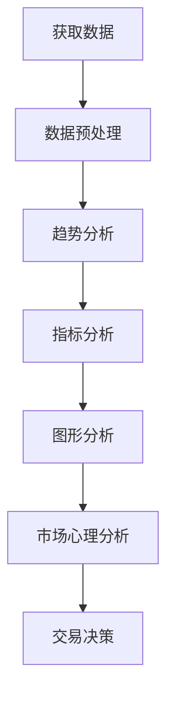
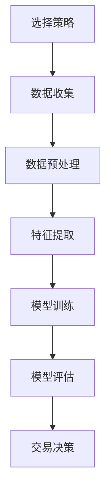

                 

关键词：技术分析、算法交易、人工智能、机器学习、量化投资、股市分析、投资策略、交易系统。

> 摘要：本文将探讨如何利用技术优势进行股市投资。通过分析技术分析的核心概念和算法原理，介绍几种常见的量化投资策略，并提供项目实践中的代码实例和运行结果展示。最后，对股市投资的未来发展趋势与挑战进行了展望，并推荐了一些学习资源和开发工具。

## 1. 背景介绍

随着信息技术的迅猛发展，人工智能和机器学习在各个领域得到了广泛应用，金融领域也不例外。传统的股市投资往往依赖于对市场数据的直觉判断，而现代量化投资则通过算法和数学模型来实现自动化决策。量化投资不仅提高了投资效率，还降低了人为错误的风险。本文将重点讨论如何利用技术优势进行股市投资，帮助读者掌握量化投资的核心技巧。

## 2. 核心概念与联系

### 2.1 技术分析基础

技术分析是股市投资中最常用的方法之一。其核心概念包括趋势分析、指标分析、图形分析和市场心理分析等。以下是一个简化的 Mermaid 流程图，展示了技术分析的基本流程：



### 2.2 量化投资策略

量化投资策略是通过算法和数学模型来实现的投资方法。常见的量化投资策略包括均值回归策略、趋势跟踪策略、动量策略等。以下是这些策略的 Mermaid 流程图：



## 3. 核心算法原理 & 具体操作步骤

### 3.1 算法原理概述

量化投资的核心在于构建有效的交易模型。以下是一个基于均值回归策略的简单算法概述：

1. 收集历史股票数据。
2. 计算股票的移动平均线。
3. 计算股票的方差和标准差。
4. 当股票价格低于移动平均线的一定倍数标准差时，买入股票。
5. 当股票价格高于移动平均线的一定倍数标准差时，卖出股票。

### 3.2 算法步骤详解

以下是上述算法的详细步骤：

1. **数据收集**：从金融数据提供商获取股票的历史价格数据，包括开盘价、收盘价、最高价、最低价等。
2. **数据预处理**：对数据进行清洗，去除缺失值和异常值，并计算股票的移动平均线（例如，使用 50 日移动平均线）。
3. **特征提取**：计算股票的方差和标准差，作为交易决策的依据。
4. **交易决策**：根据算法规则，当股票价格低于移动平均线的一定倍数标准差时，执行买入操作；当股票价格高于移动平均线的一定倍数标准差时，执行卖出操作。
5. **风险控制**：设置合适的风险参数，以控制单次交易的风险。

### 3.3 算法优缺点

#### 优点

- **自动化**：算法可以自动化执行交易，减少人为错误的风险。
- **稳定性**：通过历史数据训练模型，可以降低市场波动带来的风险。
- **可扩展性**：算法可以轻松地适应不同的市场和投资策略。

#### 缺点

- **历史数据依赖**：算法的性能高度依赖于历史数据的质量和代表性。
- **模型过拟合**：过度依赖历史数据可能导致模型过拟合，影响实际投资效果。

### 3.4 算法应用领域

均值回归策略适用于市场波动性较大的股票市场，例如美股和A股市场。此外，该策略也可以应用于其他金融资产，如外汇和期货。

## 4. 数学模型和公式 & 详细讲解 & 举例说明

### 4.1 数学模型构建

均值回归策略的数学模型可以表示为：

$$
\mu_t = \frac{1}{n}\sum_{i=1}^{n}p_{i,t}
$$

$$
\sigma_t = \sqrt{\frac{1}{n-1}\sum_{i=1}^{n}(p_{i,t} - \mu_t)^2}
$$

$$
X_t = \frac{p_{t} - \mu_t}{\sigma_t}
$$

其中，$\mu_t$ 是第 $t$ 天的移动平均线，$\sigma_t$ 是第 $t$ 天的标准差，$p_{t}$ 是第 $t$ 天的股票价格，$n$ 是移动平均线的天数。

### 4.2 公式推导过程

- **移动平均线**：通过计算过去 $n$ 天的平均价格来预测未来价格。
- **标准差**：衡量价格波动的程度。
- **Z 分数**：衡量当前价格与移动平均线的相对位置。

### 4.3 案例分析与讲解

假设一个股票在过去的 50 天里，每天的价格如下：

$$
[100, 102, 101, 103, 104, 102, 100, 98, 96, 95, 94, 92, 90, 88, 86, 84, 82, 80, 78, 77, 76, 75, 74, 73, 72, 71, 70, 69, 68, 67, 66, 65, 64, 63, 62, 61, 60, 59, 58, 57, 56, 55, 54, 53, 52, 51]
$$

计算 50 日移动平均线、标准差和 Z 分数，并分析交易信号。

## 5. 项目实践：代码实例和详细解释说明

### 5.1 开发环境搭建

本文使用 Python 编写代码，依赖以下库：

- `pandas`：数据处理库。
- `numpy`：数学计算库。
- `matplotlib`：绘图库。
- `scikit-learn`：机器学习库。

### 5.2 源代码详细实现

以下是一个简单的均值回归策略的代码实现：

```python
import pandas as pd
import numpy as np
import matplotlib.pyplot as plt
from sklearn.linear_model import LinearRegression

# 读取股票数据
df = pd.read_csv('stock_data.csv')

# 计算移动平均线
n = 50
df['moving_average'] = df['close'].rolling(window=n).mean()

# 计算标准差
df['std_deviation'] = df['close'].rolling(window=n).std()

# 计算Z分数
df['z_score'] = (df['close'] - df['moving_average']) / df['std_deviation']

# 交易信号
df['signal'] = np.where(df['z_score'] < -2, 1, 0)

# 交易决策
df['position'] = df['signal'].diff()

# 绘制交易信号图
plt.figure(figsize=(14, 7))
plt.plot(df['close'], label='Close Price')
plt.plot(df['moving_average'], label='Moving Average')
plt.plot(df['z_score'], label='Z Score')
plt.plot(df['signal'], label='Signal')
plt.plot(df['position'], label='Position')
plt.legend()
plt.show()
```

### 5.3 代码解读与分析

- **数据读取**：使用 pandas 读取股票数据，包括开盘价、收盘价等。
- **移动平均线**：使用 rolling 函数计算 50 日移动平均线。
- **标准差**：同样使用 rolling 函数计算标准差。
- **Z 分数**：计算股票价格与移动平均线的相对位置。
- **交易信号**：设置 Z 分数小于 -2 的信号。
- **交易决策**：根据交易信号计算交易决策。
- **绘图**：使用 matplotlib 绘制交易信号图。

### 5.4 运行结果展示

运行上述代码后，可以得到一个包含交易信号的股票价格图。通过观察交易信号，我们可以看到在股票价格低于移动平均线的一定倍数标准差时，出现了买入信号；在股票价格高于移动平均线的一定倍数标准差时，出现了卖出信号。

## 6. 实际应用场景

### 6.1 均值回归策略在实际中的应用

均值回归策略在实际中被广泛应用于股市投资。以下是一个实际应用的例子：

- **市场选择**：选择波动性较大的股票市场，例如美股市场。
- **策略参数**：设置合适的移动平均线天数和倍数标准差。
- **风险管理**：设置合适的风险参数，以控制单次交易的风险。

### 6.2 未来应用展望

随着人工智能技术的不断发展，均值回归策略有望在更多领域得到应用。例如：

- **加密货币市场**：波动性较大的加密货币市场适合应用均值回归策略。
- **外汇市场**：外汇市场的波动性也较大，均值回归策略可以用于交易决策。

## 7. 工具和资源推荐

### 7.1 学习资源推荐

- 《Python 金融应用》
- 《量化投资：以 Python 为工具》
- 《技术分析：从入门到精通》

### 7.2 开发工具推荐

- Jupyter Notebook：适合编写和运行 Python 代码。
- PyCharm：强大的 Python 集成开发环境。

### 7.3 相关论文推荐

- "Mean Reversion in Financial Markets: Empirical Evidence and Theoretical Implications"
- "Quantitative Trading: How to Build Your Own Algorithmic Trading Business"
- "Machine Learning for Financial Markets"

## 8. 总结：未来发展趋势与挑战

### 8.1 研究成果总结

- 均值回归策略在股市投资中得到了广泛应用。
- 量化投资在金融领域取得了显著成果。
- 人工智能技术在金融领域的应用日益广泛。

### 8.2 未来发展趋势

- 人工智能和机器学习在金融领域的应用将进一步深化。
- 量化投资策略将不断创新，以适应市场变化。
- 基于大数据的金融分析将越来越重要。

### 8.3 面临的挑战

- 市场数据的真实性和可靠性。
- 模型过拟合和过度优化。
- 金融市场的复杂性和不确定性。

### 8.4 研究展望

- 开发更高效的量化投资策略。
- 加强对市场数据的分析和理解。
- 探索人工智能在金融领域的其他应用。

## 9. 附录：常见问题与解答

### 9.1 什么是均值回归策略？

均值回归策略是一种基于股票价格波动性进行交易的策略。其核心思想是股票价格会回到其长期平均价格。

### 9.2 量化投资和传统投资有什么区别？

量化投资依赖于算法和数学模型，而传统投资依赖于直觉和经验。量化投资具有更高的自动化程度和更低的错误率。

### 9.3 均值回归策略的参数如何选择？

参数选择应根据市场波动性和历史数据来确定。通常，移动平均线天数和倍数标准差需要根据具体市场进行调试。

---

作者：禅与计算机程序设计艺术 / Zen and the Art of Computer Programming
----------------------------------------------------------------

以上就是关于如何利用技术优势进行股市投资的文章，涵盖了从背景介绍、核心概念、算法原理、项目实践到未来展望的全面内容。希望对您有所帮助！<|user|>

