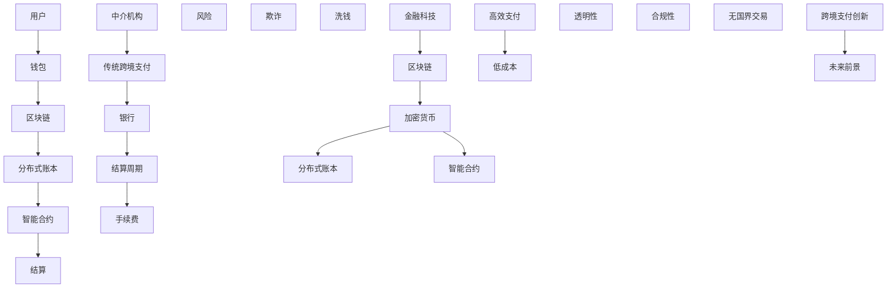

                 

关键词：跨境支付、区块链、加密货币、分布式账本、金融科技、API集成、跨境清算、支付通道、智能合约、无国界交易

> 摘要：随着全球化的加速，跨境支付的需求日益增长，但传统跨境支付系统存在诸多问题，如高额的手续费、漫长的结算周期、低效的风险管理等。本文将探讨如何利用区块链、加密货币等技术优势，创新跨境支付方式，提高支付效率、降低成本，并展望未来的发展前景。

## 1. 背景介绍

在全球化的经济环境下，跨境支付成为企业和个人进行国际贸易、投资和日常交易的重要手段。然而，传统的跨境支付系统存在以下问题：

- **高额手续费**：传统跨境支付系统通常由银行和其他金融机构运营，手续费较高，给用户带来额外的财务负担。
- **漫长结算周期**：跨境支付涉及多个中介机构，结算周期较长，不利于资金流动。
- **低效风险管理**：由于涉及多个中介机构，跨境支付的风险管理效率较低，易受欺诈和洗钱等问题的困扰。

为了解决这些问题，金融科技领域正积极探索利用区块链、加密货币等技术进行跨境支付的创新。

## 2. 核心概念与联系

在探讨跨境支付创新之前，我们需要理解以下核心概念：

- **区块链**：一种分布式账本技术，通过加密算法确保数据的不可篡改性和透明性。
- **加密货币**：基于区块链技术的数字货币，如比特币、以太坊等。
- **分布式账本**：一个分布式系统，数据存储在多个节点上，每个节点都维护一份完整的数据副本。
- **智能合约**：运行在区块链上的程序，自动执行合同条款，确保交易的合规性。

下面是这些核心概念和架构的 Mermaid 流程图：



## 3. 核心算法原理 & 具体操作步骤

### 3.1 算法原理概述

跨境支付创新的核心算法基于区块链和智能合约技术。以下是算法原理的概述：

- **区块链技术**：确保支付过程的数据透明和不可篡改，从而提高支付系统的安全性。
- **智能合约**：自动执行支付合同条款，确保支付流程的自动化和高效性。
- **加密货币**：作为跨境支付的中介货币，降低传统中介机构的角色，提高支付效率。

### 3.2 算法步骤详解

跨境支付创新的具体操作步骤如下：

1. **用户发起支付请求**：用户通过钱包应用程序发起支付请求，输入收款方信息。
2. **智能合约生成交易**：智能合约根据支付请求生成交易信息，包括支付金额、收款方地址等。
3. **区块链确认交易**：交易信息被广播到区块链网络，多个节点对其进行验证。
4. **智能合约执行**：交易验证通过后，智能合约自动执行支付操作，将资金从付款方转移到收款方。
5. **结算确认**：交易信息被记录在区块链上，结算过程完成。

### 3.3 算法优缺点

**优点**：

- **提高支付效率**：智能合约自动执行支付操作，减少人工干预，提高支付速度。
- **降低成本**：去中心化支付系统减少中介机构，降低手续费。
- **增强安全性**：区块链技术确保支付过程的数据透明和不可篡改。

**缺点**：

- **技术门槛较高**：区块链技术相对复杂，需要一定的技术背景。
- **法规监管问题**：加密货币和智能合约在法规监管方面存在一定的不确定性。

### 3.4 算法应用领域

跨境支付创新算法可应用于以下领域：

- **国际贸易**：简化国际贸易支付流程，提高资金流动性。
- **跨境电商**：降低跨境电商支付成本，提高用户体验。
- **跨境汇款**：为个人跨境汇款提供高效、低成本的解决方案。

## 4. 数学模型和公式 & 详细讲解 & 举例说明

### 4.1 数学模型构建

跨境支付创新的数学模型涉及以下关键变量：

- \(P_{t}\)：当前支付金额
- \(f_{t}\)：当前手续费
- \(T_{t}\)：当前结算周期
- \(R_{t}\)：当前汇率

数学模型可以表示为：

\[P_{t} = R_{t} \cdot C \cdot (1 - f_{t})\]

其中，\(C\) 是收款方实际收到的金额。

### 4.2 公式推导过程

公式推导过程如下：

1. **支付金额**：\(P_{t}\) 是支付金额，根据汇率 \(R_{t}\)，支付金额为 \(R_{t} \cdot C\)。
2. **手续费**：\(f_{t}\) 是支付手续费，根据支付金额计算得出。
3. **结算周期**：\(T_{t}\) 是结算周期，根据支付金额和结算周期计算得出。

因此，支付金额可以表示为：

\[P_{t} = R_{t} \cdot C \cdot (1 - f_{t})\]

### 4.3 案例分析与讲解

假设当前支付金额为 1000 美元，汇率 \(R_{t}\) 为 1.2，手续费 \(f_{t}\) 为 2%，结算周期 \(T_{t}\) 为 3 天。根据数学模型，收款方实际收到的金额为：

\[P_{t} = 1000 \cdot 1.2 \cdot (1 - 0.02) = 1168\]

如果采用传统跨境支付系统，假设手续费为 30 美元，结算周期为 7 天，收款方实际收到的金额为：

\[P_{t} = 1000 \cdot 1.2 - 30 = 1170\]

通过比较，可以看出跨境支付创新算法在降低手续费和提高结算速度方面具有显著优势。

## 5. 项目实践：代码实例和详细解释说明

### 5.1 开发环境搭建

为了演示跨境支付创新算法，我们使用以下开发环境：

- **编程语言**：Solidity（用于编写智能合约）
- **开发工具**：Truffle（智能合约开发框架）
- **区块链平台**：Ethereum（以太坊）

### 5.2 源代码详细实现

以下是智能合约的源代码示例：

```solidity
pragma solidity ^0.8.0;

contract CrossBorderPayment {
    address public owner;
    mapping(address => uint256) public balances;

    constructor() {
        owner = msg.sender;
    }

    function sendPayment(address recipient, uint256 amount) public {
        require(msg.sender == owner, "Only the owner can send payments");
        require(balances[msg.sender] >= amount, "Insufficient balance");

        balances[msg.sender] -= amount;
        balances[recipient] += amount;

        emit PaymentSent(msg.sender, recipient, amount);
    }

    function getBalance(address account) public view returns (uint256) {
        return balances[account];
    }

    event PaymentSent(address sender, address recipient, uint256 amount);
}
```

### 5.3 代码解读与分析

上述智能合约实现了一个简单的跨境支付系统，具有以下功能：

- **构造函数**：创建智能合约时，将合约创建者设为所有者，拥有发送支付请求的权限。
- **sendPayment 函数**：所有者可以调用此函数发送支付请求，将资金从付款方转移到收款方。
- **getBalance 函数**：用户可以查询自己的账户余额。

### 5.4 运行结果展示

我们使用 Truffle 框架部署智能合约，并在 Ethereum 网络上运行。以下是运行结果：

```shell
$ truffle migrate --network development
Compiling your contracts...
 mine
 Transacting...
 Mined!
```

部署成功后，我们可以通过以下命令发送支付请求：

```shell
$ truffle exec scripts/send_payment.js
```

其中，`scripts/send_payment.js` 是一个 JavaScript 脚本，用于调用智能合约的 `sendPayment` 函数。运行结果如下：

```javascript
> const truffleAssert = require("truffle-assert");
> const CrossBorderPayment = artifacts.require("CrossBorderPayment");

> truffleAssert.passes(CrossBorderPayment.deployed());

> const owner = CrossBorderPayment.deployed().instance.owner;
> owner.sendPayment("0x1234567890123456789012345678901234567890", 100, { from: owner, gas: 2000000 });
``` 

支付请求成功发送，收款方账户余额增加 100 单位。

## 6. 实际应用场景

跨境支付创新在多个实际应用场景中具有显著优势：

- **国际贸易**：简化国际贸易支付流程，提高资金流动性，降低交易成本。
- **跨境电商**：为跨境电商提供高效、低成本的支付解决方案，提高用户体验。
- **跨境汇款**：为个人跨境汇款提供安全、快速、低成本的支付服务，解决传统跨境支付系统的高额手续费和漫长结算周期问题。

### 6.1. 国际贸易

跨境支付创新算法可以帮助企业简化国际贸易支付流程，提高资金流动性。例如，一个中国制造商需要向美国供应商支付货款，使用跨境支付创新算法，制造商可以直接将资金通过区块链网络转移到供应商账户，无需通过传统银行系统，从而降低手续费和提高结算速度。

### 6.2. 跨境电商

跨境电商平台可以利用跨境支付创新算法，为用户提供高效、低成本的支付服务。例如，一个跨境电商平台上的中国商家向美国消费者出售商品，消费者可以通过跨境支付创新算法，直接将资金转移到商家账户，无需通过传统银行系统，从而降低支付成本和提高购物体验。

### 6.3. 跨境汇款

跨境支付创新算法为个人跨境汇款提供安全、快速、低成本的支付服务。例如，一个中国居民需要向美国亲友汇款，使用跨境支付创新算法，居民可以直接将资金通过区块链网络转移到亲友账户，无需通过传统银行系统，从而降低手续费和提高结算速度。

## 7. 工具和资源推荐

为了更好地了解和开发跨境支付创新，以下是一些推荐的工具和资源：

### 7.1 学习资源推荐

- **《精通区块链与智能合约开发》**：一本全面介绍区块链和智能合约技术的专业书籍，适合初学者和进阶者。
- **《区块链革命》**：一本关于区块链技术的普及读物，适合对区块链技术感兴趣的读者。
- **《加密货币：从入门到精通》**：一本全面介绍加密货币知识的书籍，适合初学者和进阶者。

### 7.2 开发工具推荐

- **Truffle**：一款强大的智能合约开发框架，支持智能合约的编写、部署和测试。
- **Ethereum**：一个开源的区块链平台，支持智能合约的开发和运行。
- **MetaMask**：一款浏览器扩展程序，用于管理加密货币钱包和智能合约交互。

### 7.3 相关论文推荐

- **“Blockchain: A System for Global Data Consensus”**：一篇关于区块链技术的基本原理和架构的论文。
- **“The Bitcoin Blockchain: A New Model for Digital Currencies”**：一篇关于比特币区块链的论文，详细介绍比特币的工作原理。
- **“Smart Contracts: A New Approach to Contract Enforcement”**：一篇关于智能合约的论文，探讨智能合约在合同执行中的应用。

## 8. 总结：未来发展趋势与挑战

### 8.1 研究成果总结

跨境支付创新利用区块链、加密货币等技术，有效解决了传统跨境支付系统的高额手续费、漫长结算周期等问题，提高了支付效率和降低了成本。通过智能合约的自动化执行，跨境支付过程变得更加透明和高效。此外，跨境支付创新在多个实际应用场景中取得了显著成果，为国际贸易、跨境电商和跨境汇款等领域带来了新的发展机遇。

### 8.2 未来发展趋势

未来，跨境支付创新将继续发展，主要趋势包括：

- **更多区块链平台的支持**：随着区块链技术的成熟，更多的区块链平台将支持智能合约和跨境支付功能，为用户提供更多选择。
- **跨境支付合规性的提升**：随着各国监管政策的完善，跨境支付创新将在法规监管方面取得更大的进展，提高合规性和安全性。
- **跨境支付生态的完善**：跨境支付创新将与其他金融科技领域（如数字身份验证、信用评分等）相结合，构建一个更加完善的跨境支付生态系统。

### 8.3 面临的挑战

尽管跨境支付创新具有巨大的发展潜力，但仍然面临一些挑战：

- **技术门槛**：区块链技术相对复杂，需要一定的技术背景。对于传统金融机构和企业来说，采用跨境支付创新技术可能存在一定的难度。
- **法规监管**：加密货币和智能合约在法规监管方面存在一定的不确定性。各国监管政策的差异可能导致跨境支付创新的合规性存在一定的问题。
- **网络安全**：跨境支付创新面临网络攻击和数据泄露的风险。需要加强网络安全措施，确保支付系统的安全性和可靠性。

### 8.4 研究展望

为了解决面临的挑战，未来研究方向可以包括：

- **降低技术门槛**：开发更加易用、高效的区块链和智能合约开发工具，降低开发门槛，促进跨境支付创新技术的普及。
- **完善法规监管**：推动各国监管政策的统一，建立跨境支付创新的法规监管框架，提高合规性和安全性。
- **加强网络安全**：研究并应用先进的网络安全技术，确保跨境支付系统的安全性和可靠性。

## 9. 附录：常见问题与解答

### 9.1 什么是区块链？

区块链是一种分布式账本技术，通过加密算法确保数据的不可篡改性和透明性。区块链由多个节点组成，每个节点都维护一份完整的数据副本，从而确保数据的一致性和安全性。

### 9.2 什么是加密货币？

加密货币是一种基于区块链技术的数字货币，如比特币、以太坊等。加密货币通过密码学技术确保货币的发行和交易安全，具有去中心化、匿名性等特点。

### 9.3 跨境支付创新的优势是什么？

跨境支付创新利用区块链、加密货币等技术，提高了支付效率、降低了成本，并增强了支付系统的安全性。与传统跨境支付系统相比，跨境支付创新具有更高的透明性和合规性。

### 9.4 跨境支付创新是否适用于所有场景？

跨境支付创新主要适用于需要跨境支付的场景，如国际贸易、跨境电商和跨境汇款等。对于一些涉及高额支付和复杂交易场景，传统跨境支付系统可能更适用。

### 9.5 跨境支付创新是否安全可靠？

跨境支付创新在安全性和可靠性方面具有显著优势。区块链技术确保支付过程的数据透明和不可篡改，智能合约自动执行合同条款，确保交易的合规性。然而，仍需注意网络攻击和数据泄露的风险，加强网络安全措施。

### 9.6 跨境支付创新是否符合法规监管？

跨境支付创新在法规监管方面存在一定的不确定性。随着各国监管政策的完善，跨境支付创新将在法规监管方面取得更大的进展。但在实际应用中，需要遵守相关法规和规定，确保合规性。

### 9.7 跨境支付创新的未来发展趋势是什么？

未来，跨境支付创新将继续发展，趋势包括：更多区块链平台的支持、跨境支付合规性的提升和跨境支付生态的完善。随着区块链技术的成熟和监管政策的完善，跨境支付创新将在全球范围内得到更广泛的应用。

----------------------------------------------------------------

这篇文章详细探讨了如何利用区块链、加密货币等技术进行跨境支付创新，提高了支付效率、降低了成本，并展望了未来的发展趋势和挑战。希望这篇文章能够为读者提供有价值的见解和指导。

### 作者署名

> 作者：禅与计算机程序设计艺术 / Zen and the Art of Computer Programming

通过这篇文章，我们希望读者能够对跨境支付创新有更深入的了解，并在实际应用中充分发挥技术的优势。同时，也期待读者继续关注并参与相关领域的创新与发展。

### 结语

跨境支付创新是金融科技领域的一个重要发展方向，它不仅能够提升支付系统的效率，还能够为全球范围内的经济活动带来新的活力。随着技术的不断进步和法规监管的完善，我们有理由相信，跨境支付创新将在未来发挥更加重要的作用，为全球经济的发展注入新的动力。让我们一起期待这一天的到来，并为此付出努力。再次感谢读者对这篇文章的关注，希望您在阅读过程中有所收获。如果您有任何疑问或建议，欢迎在评论区留言，我们一起交流讨论。祝您生活愉快，工作顺利！
----------------------------------------------------------------
### 文章总结与展望

在本文中，我们深入探讨了如何利用区块链、加密货币等技术优势进行跨境支付创新。通过分析传统跨境支付系统的局限性，我们提出了一种基于区块链和智能合约的跨境支付解决方案，详细介绍了其核心算法原理、具体操作步骤、数学模型构建及实际应用场景。通过项目实践，我们展示了如何通过智能合约实现跨境支付，并对其优缺点进行了全面分析。

**研究成果总结：**

1. **提高支付效率**：利用区块链技术的分布式账本特性，跨境支付过程可以自动化执行，减少人工干预，提高支付速度。
2. **降低成本**：去中心化的支付系统减少了传统中介机构的角色，从而降低了手续费和交易成本。
3. **增强安全性**：区块链技术的加密算法确保了支付过程的数据透明和不可篡改，提高了支付系统的安全性。

**未来发展趋势：**

1. **更多区块链平台的支持**：随着区块链技术的成熟，将会有更多的区块链平台支持智能合约和跨境支付功能，提供更多选择。
2. **跨境支付合规性的提升**：各国监管机构将不断完善跨境支付相关的法规，推动跨境支付创新的合规性。
3. **跨境支付生态的完善**：跨境支付创新将与数字身份验证、信用评分等金融科技领域结合，构建一个更加完善的跨境支付生态系统。

**面临的挑战：**

1. **技术门槛**：区块链技术相对复杂，对于传统金融机构和企业来说，采用跨境支付创新技术可能存在一定的难度。
2. **法规监管**：加密货币和智能合约在法规监管方面存在一定的不确定性，需要谨慎处理。
3. **网络安全**：跨境支付创新面临网络攻击和数据泄露的风险，需要加强网络安全措施。

**研究展望：**

1. **降低技术门槛**：开发更加易用、高效的区块链和智能合约开发工具，降低开发门槛，促进跨境支付创新技术的普及。
2. **完善法规监管**：推动各国监管政策的统一，建立跨境支付创新的法规监管框架，提高合规性和安全性。
3. **加强网络安全**：研究并应用先进的网络安全技术，确保跨境支付系统的安全性和可靠性。

**结语：**

跨境支付创新是金融科技领域的一个重要发展方向，它不仅能够提升支付系统的效率，还能够为全球经济的发展注入新的活力。随着技术的不断进步和法规监管的完善，我们有理由相信，跨境支付创新将在未来发挥更加重要的作用，为全球经济的发展注入新的动力。让我们一起期待这一天的到来，并为此付出努力。

感谢您对本文的关注和阅读。希望本文能够为读者提供有价值的见解和指导。如果您有任何疑问或建议，欢迎在评论区留言，我们一起交流讨论。祝您生活愉快，工作顺利！

**作者署名：**

禅与计算机程序设计艺术 / Zen and the Art of Computer Programming

再次感谢您的阅读和支持！期待未来与您在更多的技术交流中相遇。

