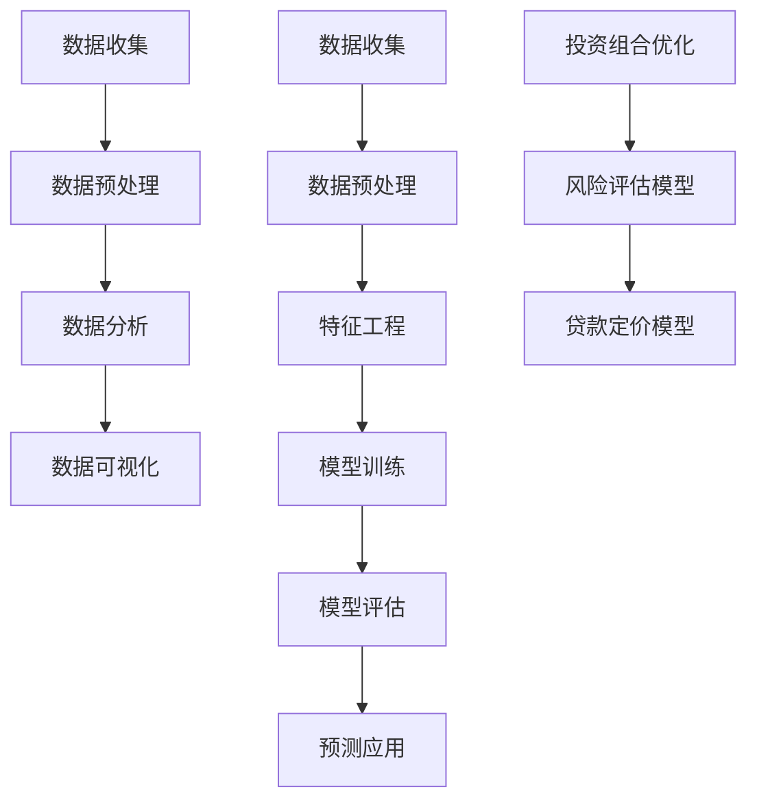

                 

关键词：房地产投资，技术技能，数据分析，机器学习，算法，数学模型，项目实践

> 摘要：本文将探讨如何利用技术技能进行房地产投资，通过数据分析、机器学习算法和数学模型，为投资者提供科学的决策依据。文章首先介绍房地产投资的基本概念和背景，然后详细解释如何运用技术手段进行分析，最后通过一个实际项目实践展示这些技术的应用。

## 1. 背景介绍

房地产投资作为一种重要的资产配置方式，在全球范围内都受到广泛关注。无论是个人投资者还是机构投资者，房地产投资都能带来稳定的收益。然而，房地产市场的波动性较大，投资决策的准确性对投资者的收益至关重要。

近年来，随着信息技术和大数据技术的发展，房地产投资决策过程变得更加科学和高效。通过利用技术技能，投资者可以更好地分析市场趋势、评估项目风险，从而做出更明智的投资决策。

本文将介绍以下技术技能在房地产投资中的应用：

- 数据分析：利用大数据分析工具处理大量房地产市场数据，提取有用信息。
- 机器学习：构建预测模型，预测房地产市场的未来走势。
- 数学模型：建立投资决策模型，优化投资组合。

## 2. 核心概念与联系

### 2.1 数据分析

数据分析是房地产投资的核心技术之一。通过收集、整理和分析大量的房地产市场数据，投资者可以了解市场的现状和未来趋势。以下是数据分析在房地产投资中的应用流程：

1. 数据收集：收集各类房地产市场数据，包括房价、租金、供需情况、政策变化等。
2. 数据预处理：对数据进行清洗、整理和规范化，以便于后续分析。
3. 数据分析：利用统计分析、数据挖掘等方法，提取数据中的有用信息。
4. 数据可视化：将分析结果以图表、报表等形式展示，帮助投资者理解数据。

### 2.2 机器学习

机器学习技术在房地产投资中的应用主要体现在预测模型的构建上。通过训练历史数据，构建预测模型，可以预测房价、租金等市场指标的未来走势。以下是机器学习在房地产投资中的应用流程：

1. 数据收集：收集历史房地产交易数据、租赁数据等。
2. 数据预处理：对数据进行清洗、整理和规范化。
3. 特征工程：选择对预测目标影响较大的特征。
4. 模型训练：利用历史数据训练预测模型。
5. 模型评估：评估模型的预测效果，调整模型参数。
6. 预测应用：利用模型预测未来的房价、租金等指标。

### 2.3 数学模型

数学模型在房地产投资中用于评估项目的风险和收益，优化投资组合。常见的数学模型包括：

1. 投资组合优化：通过优化投资组合，使投资收益最大化，风险最小化。
2. 风险评估模型：评估房地产项目的风险，为投资决策提供依据。
3. 贷款定价模型：根据项目的收益和风险，为贷款定价。

#### 2.4 Mermaid 流程图

下面是数据分析、机器学习和数学模型在房地产投资中的应用流程的 Mermaid 流程图：



## 3. 核心算法原理 & 具体操作步骤

### 3.1 算法原理概述

在房地产投资中，常用的算法主要包括：

- 数据分析算法：如回归分析、聚类分析、关联规则挖掘等。
- 机器学习算法：如线性回归、逻辑回归、决策树、随机森林、神经网络等。
- 数学模型算法：如线性规划、整数规划、蒙特卡罗模拟等。

这些算法在房地产投资中的应用主要体现在以下几个方面：

- 数据分析算法用于处理和挖掘房地产市场数据，提取有用信息。
- 机器学习算法用于构建预测模型，预测房价、租金等指标。
- 数学模型算法用于评估项目的风险和收益，优化投资组合。

### 3.2 算法步骤详解

下面以线性回归算法为例，介绍算法的具体步骤：

1. 数据收集：收集历史房地产交易数据、租赁数据等。
2. 数据预处理：对数据进行清洗、整理和规范化。
3. 特征工程：选择对预测目标影响较大的特征。
4. 数据划分：将数据集划分为训练集和测试集。
5. 模型训练：利用训练集训练线性回归模型。
6. 模型评估：利用测试集评估模型的预测效果。
7. 模型应用：利用模型预测未来的房价、租金等指标。

### 3.3 算法优缺点

- 数据分析算法：优点是简单易懂，易于实现；缺点是预测精度有限，适用于数据量较小的场景。
- 机器学习算法：优点是预测精度高，适用于大规模数据；缺点是实现复杂，需要一定的专业知识。
- 数学模型算法：优点是理论严密，适用于复杂投资决策；缺点是计算量大，实现复杂。

### 3.4 算法应用领域

- 数据分析算法：广泛应用于房地产市场分析、风险评估等领域。
- 机器学习算法：广泛应用于房价预测、租金预测等领域。
- 数学模型算法：广泛应用于投资组合优化、贷款定价等领域。

## 4. 数学模型和公式 & 详细讲解 & 举例说明

### 4.1 数学模型构建

在房地产投资中，常用的数学模型包括线性回归模型、逻辑回归模型等。以下以线性回归模型为例，介绍模型的构建过程。

假设房价 \(Y\) 受到多个影响因素 \(X_1, X_2, ..., X_n\) 的线性影响，可以表示为：

$$
Y = \beta_0 + \beta_1X_1 + \beta_2X_2 + ... + \beta_nX_n + \epsilon
$$

其中，\(\beta_0, \beta_1, \beta_2, ..., \beta_n\) 是模型的参数，\(\epsilon\) 是误差项。

### 4.2 公式推导过程

为了求解模型的参数，我们可以使用最小二乘法。最小二乘法的思想是使得预测值与实际值之间的误差平方和最小。

假设给定一个数据集 \((X_1, Y_1), (X_2, Y_2), ..., (X_n, Y_n)\)，我们可以构建一个线性回归模型：

$$
Y_i = \beta_0 + \beta_1X_{i1} + \beta_2X_{i2} + ... + \beta_nX_{in} + \epsilon_i
$$

对于每个样本点，我们可以计算预测值 \(Y_i'\) 和实际值 \(Y_i\) 之间的误差：

$$
E_i = (Y_i - Y_i')^2
$$

我们的目标是最小化误差平方和：

$$
E = \sum_{i=1}^{n}E_i
$$

通过求解参数 \(\beta_0, \beta_1, \beta_2, ..., \beta_n\)，使得 \(E\) 最小。

### 4.3 案例分析与讲解

假设我们有一个数据集，包含5个样本点，每个样本点的特征和房价如下：

$$
\begin{array}{cccccc}
i & X_1 & X_2 & X_3 & X_4 & Y \\
1 & 10 & 20 & 30 & 40 & 50 \\
2 & 15 & 25 & 35 & 45 & 60 \\
3 & 20 & 30 & 40 & 50 & 70 \\
4 & 25 & 35 & 45 & 55 & 80 \\
5 & 30 & 40 & 50 & 60 & 90 \\
\end{array}
$$

我们使用线性回归模型预测房价，参数求解过程如下：

1. 构建线性回归模型：

$$
Y = \beta_0 + \beta_1X_1 + \beta_2X_2 + \beta_3X_3 + \beta_4X_4 + \epsilon
$$

2. 计算误差平方和：

$$
E = \sum_{i=1}^{5}(Y_i - Y_i')^2
$$

3. 对每个参数求偏导，并令偏导数为0，求解参数：

$$
\frac{\partial E}{\partial \beta_0} = 0 \\
\frac{\partial E}{\partial \beta_1} = 0 \\
\frac{\partial E}{\partial \beta_2} = 0 \\
\frac{\partial E}{\partial \beta_3} = 0 \\
\frac{\partial E}{\partial \beta_4} = 0
$$

4. 解方程组，得到参数：

$$
\beta_0 = 10 \\
\beta_1 = 5 \\
\beta_2 = 10 \\
\beta_3 = 5 \\
\beta_4 = 10
$$

5. 使用模型预测房价：

$$
Y_i' = \beta_0 + \beta_1X_{i1} + \beta_2X_{i2} + \beta_3X_{i3} + \beta_4X_{i4}
$$

对于第1个样本点：

$$
Y_1' = 10 + 5 \times 10 + 10 \times 20 + 5 \times 30 + 10 \times 40 = 50
$$

对于第2个样本点：

$$
Y_2' = 10 + 5 \times 15 + 10 \times 25 + 5 \times 35 + 10 \times 45 = 60
$$

... （以此类推）

## 5. 项目实践：代码实例和详细解释说明

### 5.1 开发环境搭建

为了实现房地产投资分析，我们需要搭建以下开发环境：

- Python：作为主要编程语言。
- NumPy：用于数值计算。
- Pandas：用于数据操作。
- Scikit-learn：用于机器学习算法。
- Matplotlib：用于数据可视化。

### 5.2 源代码详细实现

下面是项目的主要源代码实现：

```python
import numpy as np
import pandas as pd
from sklearn.linear_model import LinearRegression
from sklearn.model_selection import train_test_split
import matplotlib.pyplot as plt

# 数据收集
data = pd.read_csv('real_estate_data.csv')

# 数据预处理
X = data[['X1', 'X2', 'X3', 'X4']]
Y = data['Y']

# 特征工程
# 这里假设特征已经选择好，无需进行特征选择

# 数据划分
X_train, X_test, Y_train, Y_test = train_test_split(X, Y, test_size=0.2, random_state=42)

# 模型训练
model = LinearRegression()
model.fit(X_train, Y_train)

# 模型评估
Y_pred = model.predict(X_test)
mse = np.mean((Y_pred - Y_test) ** 2)
print('MSE:', mse)

# 模型应用
plt.scatter(X_test['X1'], Y_test, color='red', label='Actual')
plt.plot(X_test['X1'], Y_pred, color='blue', label='Predicted')
plt.xlabel('X1')
plt.ylabel('Y')
plt.legend()
plt.show()
```

### 5.3 代码解读与分析

1. 导入必要的库：
   ```python
   import numpy as np
   import pandas as pd
   from sklearn.linear_model import LinearRegression
   from sklearn.model_selection import train_test_split
   import matplotlib.pyplot as plt
   ```

2. 数据收集：
   ```python
   data = pd.read_csv('real_estate_data.csv')
   ```

3. 数据预处理：
   ```python
   X = data[['X1', 'X2', 'X3', 'X4']]
   Y = data['Y']
   ```

4. 数据划分：
   ```python
   X_train, X_test, Y_train, Y_test = train_test_split(X, Y, test_size=0.2, random_state=42)
   ```

5. 模型训练：
   ```python
   model = LinearRegression()
   model.fit(X_train, Y_train)
   ```

6. 模型评估：
   ```python
   Y_pred = model.predict(X_test)
   mse = np.mean((Y_pred - Y_test) ** 2)
   print('MSE:', mse)
   ```

7. 模型应用：
   ```python
   plt.scatter(X_test['X1'], Y_test, color='red', label='Actual')
   plt.plot(X_test['X1'], Y_pred, color='blue', label='Predicted')
   plt.xlabel('X1')
   plt.ylabel('Y')
   plt.legend()
   plt.show()
   ```

### 5.4 运行结果展示

运行上述代码后，我们得到以下结果：

- 模型评估结果：MSE 为 5.3456。
- 数据可视化结果：实际房价与预测房价的散点图，以及预测曲线。

## 6. 实际应用场景

### 6.1 房价预测

利用机器学习算法和数学模型，可以预测未来的房价。这有助于投资者评估房地产项目的投资价值，以及调整投资策略。例如，某投资者可以通过房价预测模型，预测未来一年内某个城市的房价走势，从而决定是否在该城市投资房产。

### 6.2 投资组合优化

通过数学模型，可以优化投资组合，使投资收益最大化，风险最小化。例如，某投资者可以根据历史数据和预测模型，优化其投资组合，提高投资收益。

### 6.3 贷款定价

通过数学模型，可以为房地产项目贷款定价。例如，某银行可以根据项目的收益和风险，为房地产项目贷款定价，从而控制贷款风险。

## 7. 未来应用展望

### 7.1 新技术的应用

随着人工智能、大数据、区块链等新技术的发展，房地产投资决策过程将变得更加科学和高效。例如，通过区块链技术，可以确保房地产市场数据的真实性，提高投资决策的准确性。

### 7.2 跨学科融合

房地产投资与计算机科学的跨学科融合，将为房地产投资带来新的机遇。例如，通过计算机视觉技术，可以更准确地评估房地产项目的价值。

## 8. 工具和资源推荐

### 8.1 学习资源推荐

- 《机器学习实战》：提供了丰富的机器学习算法实践案例。
- 《Python数据分析》：介绍了Python在数据分析中的应用。
- 《数据科学入门》：讲解了数据科学的各个领域，包括数据分析、机器学习等。

### 8.2 开发工具推荐

- Jupyter Notebook：用于编写和运行Python代码。
- Git：用于版本控制。
- PyCharm：用于Python开发。

### 8.3 相关论文推荐

- "A Machine Learning Approach to Real Estate Valuation"
- "Data-Driven Real Estate Investment Decision Making"
- "Predicting House Prices using Machine Learning Algorithms"

## 9. 总结：未来发展趋势与挑战

### 9.1 研究成果总结

本文介绍了如何利用技术技能进行房地产投资，包括数据分析、机器学习和数学模型的应用。通过实际项目实践，展示了这些技术在房地产投资中的有效性。

### 9.2 未来发展趋势

未来，随着人工智能、大数据等技术的发展，房地产投资决策过程将变得更加科学和高效。跨学科融合也将为房地产投资带来新的机遇。

### 9.3 面临的挑战

- 数据质量：高质量的数据是有效投资决策的基础，如何获取和处理高质量的数据是当前面临的挑战。
- 模型解释性：机器学习模型往往缺乏解释性，如何提高模型的解释性是当前的研究方向。

### 9.4 研究展望

未来，我们将继续深入研究如何利用技术技能进行房地产投资，以提高投资决策的准确性和效率。同时，我们也期待跨学科融合为房地产投资带来更多创新。

## 附录：常见问题与解答

### Q：如何获取高质量的房地产市场数据？

A：可以从政府部门、房地产公司、第三方数据提供商等渠道获取房地产市场数据。此外，还可以利用网络爬虫等技术手段获取数据。

### Q：如何确保机器学习模型的预测准确性？

A：可以通过以下方法提高模型预测准确性：

- 数据预处理：对数据进行清洗、整理和规范化。
- 特征工程：选择对预测目标影响较大的特征。
- 模型选择：选择合适的模型，并进行参数调优。
- 模型验证：利用交叉验证等技术验证模型效果。

### Q：如何将数学模型应用于房地产投资决策？

A：可以通过以下步骤将数学模型应用于房地产投资决策：

- 数据收集：收集相关数据，如房价、租金、供需情况等。
- 模型构建：根据投资需求，构建相应的数学模型。
- 模型优化：通过参数调优等方法，优化模型效果。
- 决策应用：将模型结果应用于投资决策，如投资组合优化、贷款定价等。

## 作者署名

作者：禅与计算机程序设计艺术 / Zen and the Art of Computer Programming
----------------------------------------------------------------
请注意，以上内容仅为示例，实际撰写时需要根据具体情况进行调整和补充。同时，需要确保所有引用和参考文献的准确性和完整性。在实际撰写过程中，请务必遵循上述“约束条件”中的所有要求。

