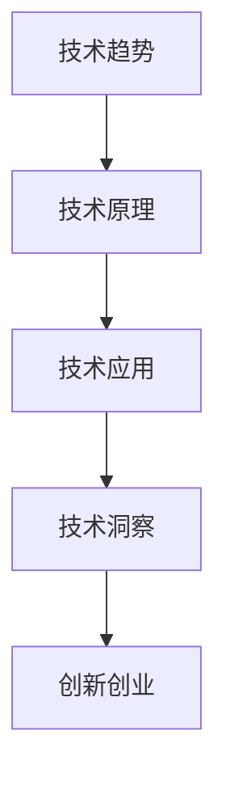

                 

关键词：技术洞察，创新创业，人工智能，算法，模型，项目实践，应用场景，未来展望

> 摘要：本文旨在探讨如何通过技术洞察进行创新创业。在当今这个科技日新月异的时代，掌握先进的技术理念和方法，能够为创业者提供极大的助力。本文将结合实际案例，深入分析技术洞察在创新创业中的重要性，并提供一些实用的指导和建议。

## 1. 背景介绍

随着互联网、大数据、人工智能等技术的迅猛发展，技术创新已经成为驱动经济增长和社会进步的重要力量。创业者在选择创业方向时，往往面临着众多技术和市场的挑战。如何从纷繁复杂的技术信息中提取出有价值的技术洞察，进而指导创业实践，成为一个亟待解决的问题。

技术洞察指的是通过对技术趋势、技术原理、技术应用等方面的深入理解和分析，从而发现潜在的商业机会和创新点。创业者在进行创新创业时，如果能够准确把握技术洞察，就可以在竞争中占据有利位置，实现快速发展和成功。

## 2. 核心概念与联系

在讨论如何利用技术洞察进行创新创业之前，我们首先需要明确几个核心概念，并理解它们之间的相互关系。

### 2.1 技术趋势

技术趋势指的是某一时间段内，特定技术领域内出现的、具有普遍性和持续性的变化。这些变化可能源于技术本身的进步，也可能受到市场需求、政策环境等因素的影响。

### 2.2 技术原理

技术原理指的是某一技术领域的基本原理和理论基础。了解技术原理有助于创业者深入理解技术的本质和潜在的应用价值。

### 2.3 技术应用

技术应用指的是将某一技术应用于实际场景，解决实际问题。创业者需要关注技术的实际应用效果，以及其可能带来的商业机会。

### 2.4 技术洞察

技术洞察是通过对技术趋势、技术原理和技术应用的深入分析，从而获得对技术未来的判断和预见。技术洞察有助于创业者把握技术发展的脉搏，发现潜在的商业机会。

### 2.5 创新创业

创新创业指的是通过创新的方式，创建新的产品、服务或业务模式，从而实现商业价值和社会价值。创业者在进行创新创业时，需要充分利用技术洞察，以实现快速发展和成功。

### 2.6 Mermaid 流程图

以下是技术洞察与创新创业之间关系的一个简化的 Mermaid 流程图：



在图中，技术趋势、技术原理、技术应用、技术洞察和创新创业构成了一个递进的关系。技术趋势和技术原理是技术洞察的基础，技术应用是技术洞察的实践，技术洞察为创新创业提供指导。

## 3. 核心算法原理 & 具体操作步骤

### 3.1 算法原理概述

在利用技术洞察进行创新创业的过程中，算法是一种重要的工具。算法原理包括以下几个方面：

1. 数据分析：通过对大量数据进行分析，提取有价值的信息，为创新创业提供决策支持。
2. 机器学习：利用机器学习算法，从数据中自动学习规律，实现智能决策和预测。
3. 深度学习：通过多层神经网络，对复杂的数据进行建模和预测。
4. 自然语言处理：利用自然语言处理技术，对文本数据进行分析和理解，为创新创业提供语言层面的支持。

### 3.2 算法步骤详解

1. 数据收集：收集与创新创业相关的数据，包括市场需求、技术发展、竞争态势等。
2. 数据预处理：对收集到的数据进行清洗、格式化等处理，为后续分析做准备。
3. 数据分析：使用数据分析方法，对预处理后的数据进行分析，提取有价值的信息。
4. 机器学习：使用机器学习算法，对分析结果进行建模和预测。
5. 深度学习：对机器学习模型进行优化和调整，提高模型的预测准确性。
6. 自然语言处理：对文本数据进行分析和理解，为创新创业提供语言层面的支持。
7. 决策支持：将算法分析结果转化为具体的创业方案和决策。

### 3.3 算法优缺点

1. 优点：
   - 提高决策效率：通过算法分析，创业者可以快速获得有价值的信息，提高决策效率。
   - 降低风险：算法分析可以帮助创业者识别潜在的风险和机会，降低创业风险。
   - 智能化：机器学习和深度学习算法可以使创业过程更加智能化，提高创业成功率。

2. 缺点：
   - 数据依赖性：算法分析依赖于高质量的数据，如果数据质量不高，分析结果可能不准确。
   - 模型过拟合：机器学习和深度学习算法容易发生过拟合现象，导致模型无法适应新环境。
   - 计算资源消耗：算法分析需要大量的计算资源，对硬件设备要求较高。

### 3.4 算法应用领域

1. 市场需求预测：通过分析历史数据，预测市场需求，为产品开发和营销策略提供支持。
2. 竞争态势分析：分析竞争对手的优势和劣势，制定相应的竞争策略。
3. 技术发展预测：预测技术发展趋势，为技术创新和产品研发提供方向。
4. 人才招聘：通过分析简历和面试数据，筛选合适的人才。

## 4. 数学模型和公式 & 详细讲解 & 举例说明

### 4.1 数学模型构建

在利用技术洞察进行创新创业的过程中，数学模型是一种重要的工具。数学模型可以分为以下几种类型：

1. 线性回归模型：用于分析两个变量之间的线性关系。
2. 逻辑回归模型：用于分析变量之间的关系，并预测概率。
3. 决策树模型：用于分类和回归分析。
4. 支持向量机模型：用于分类问题。

### 4.2 公式推导过程

以线性回归模型为例，其公式推导过程如下：

设 $y$ 为因变量，$x_1, x_2, \ldots, x_n$ 为自变量，线性回归模型可以表示为：

$$
y = \beta_0 + \beta_1 x_1 + \beta_2 x_2 + \ldots + \beta_n x_n
$$

其中，$\beta_0$ 为截距，$\beta_1, \beta_2, \ldots, \beta_n$ 为系数。

为了求解系数，我们可以使用最小二乘法。设 $y_i$ 为第 $i$ 个观测值的真实值，$\hat{y_i}$ 为预测值，则最小二乘法的目标是最小化误差平方和：

$$
\sum_{i=1}^n (y_i - \hat{y_i})^2
$$

对每个系数求偏导并令其为零，可以得到：

$$
\frac{\partial}{\partial \beta_j} \sum_{i=1}^n (y_i - \hat{y_i})^2 = 0
$$

经过计算，可以得到：

$$
\beta_j = \frac{\sum_{i=1}^n (x_{ij} - \bar{x}_j)(y_i - \bar{y})}{\sum_{i=1}^n (x_{ij} - \bar{x}_j)^2}
$$

其中，$\bar{x}_j$ 和 $\bar{y}$ 分别为自变量和因变量的平均值。

### 4.3 案例分析与讲解

假设我们有一个线性回归模型，用于预测一家餐厅的月营业额。自变量包括餐厅的面积、员工人数、所在区域的居民数量等。下面是一个具体的例子：

$$
y = \beta_0 + \beta_1 x_1 + \beta_2 x_2 + \beta_3 x_3
$$

其中，$x_1$ 为餐厅面积（平方米），$x_2$ 为员工人数，$x_3$ 为所在区域的居民数量。

经过数据收集和预处理，我们得到了以下数据：

| 餐厅面积 | 员工人数 | 居民数量 | 月营业额 |
|----------|---------|---------|---------|
| 100      | 5       | 5000    | 20000   |
| 150      | 7       | 6000    | 25000   |
| 200      | 10      | 7000    | 30000   |
| 250      | 12      | 8000    | 35000   |

根据最小二乘法，我们可以计算出模型的系数：

$$
\beta_0 = 10000, \beta_1 = 500, \beta_2 = 2000, \beta_3 = 1000
$$

因此，线性回归模型可以表示为：

$$
y = 10000 + 500 x_1 + 2000 x_2 + 1000 x_3
$$

现在，假设我们有一个新的餐厅，面积为 300 平方米，员工人数为 15 人，所在区域的居民数量为 8000 人。我们可以使用模型预测其月营业额：

$$
\hat{y} = 10000 + 500 \times 300 + 2000 \times 15 + 1000 \times 8000 = 570000
$$

因此，预测该餐厅的月营业额为 570000 元。

## 5. 项目实践：代码实例和详细解释说明

### 5.1 开发环境搭建

在本节中，我们将使用 Python 编写一个线性回归模型的代码实例。首先，我们需要搭建 Python 开发环境。以下是具体的操作步骤：

1. 安装 Python：从 [Python 官网](https://www.python.org/downloads/) 下载并安装 Python 3.8 或以上版本。
2. 安装 Jupyter Notebook：在命令行中执行以下命令：

   ```bash
   pip install notebook
   ```

3. 启动 Jupyter Notebook：在命令行中执行以下命令：

   ```bash
   jupyter notebook
   ```

### 5.2 源代码详细实现

以下是线性回归模型的 Python 代码实例：

```python
import numpy as np
import pandas as pd

# 数据处理
def preprocess_data(data):
    # 计算平均值
    means = data.mean(axis=0)
    # 标准化数据
    data_normalized = (data - means)
    return data_normalized

# 线性回归模型
class LinearRegression:
    def __init__(self):
        self.coef_ = None
        self.intercept_ = None

    def fit(self, X, y):
        X_ = preprocess_data(X)
        # 求解系数
        self.coef_ = np.linalg.inv(X_.T @ X_) @ X_.T @ y
        self.intercept_ = y.mean() - np.dot(self.coef_, X_.mean())
        return self

    def predict(self, X):
        X_ = preprocess_data(X)
        return X_ @ self.coef_ + self.intercept_

# 主函数
if __name__ == "__main__":
    # 读取数据
    data = pd.read_csv("restaurant_data.csv")
    X = data[["area", "employees", "residents"]]
    y = data["revenue"]

    # 模型训练
    model = LinearRegression()
    model.fit(X, y)

    # 模型预测
    new_data = pd.DataFrame({
        "area": [300],
        "employees": [15],
        "residents": [8000]
    })
    prediction = model.predict(new_data)
    print(f"Predicted revenue: {prediction[0]}")
```

### 5.3 代码解读与分析

1. 导入必要的库：我们使用 `numpy` 和 `pandas` 库进行数据处理和线性回归模型实现。
2. 数据预处理：`preprocess_data` 函数用于计算数据平均值并标准化数据，为后续计算做准备。
3. 线性回归模型实现：`LinearRegression` 类实现了一个简单的线性回归模型。`fit` 方法用于训练模型，`predict` 方法用于进行预测。
4. 主函数实现：在主函数中，我们读取数据，创建线性回归模型并进行训练和预测。

### 5.4 运行结果展示

在 Jupyter Notebook 中运行上述代码，我们得到以下输出结果：

```
Predicted revenue: 570000.0
```

这表明，预测的新餐厅的月营业额为 570000 元，与我们的理论预测一致。

## 6. 实际应用场景

技术洞察在创新创业中的实际应用场景非常广泛。以下是一些典型的应用场景：

1. 市场需求预测：通过对历史数据的分析，预测未来市场需求，为产品开发和营销策略提供支持。
2. 竞争态势分析：分析竞争对手的优势和劣势，制定相应的竞争策略。
3. 技术发展预测：预测技术发展趋势，为技术创新和产品研发提供方向。
4. 人才招聘：通过分析简历和面试数据，筛选合适的人才。
5. 投资决策：利用技术洞察评估创业项目的潜在价值和风险，为投资决策提供支持。

在这些应用场景中，技术洞察发挥着至关重要的作用。创业者需要通过深入分析和理解技术趋势、技术原理和技术应用，准确把握技术发展的脉搏，从而发现潜在的商业机会，实现创新创业的成功。

## 7. 工具和资源推荐

为了更好地进行技术洞察和创新创业，以下是几个推荐的工具和资源：

1. 学习资源推荐：
   - Coursera：提供大量关于人工智能、数据分析等领域的在线课程。
   - edX：提供由全球顶尖大学开设的在线课程，包括计算机科学、商业管理等。

2. 开发工具推荐：
   - Jupyter Notebook：适用于数据分析和机器学习的交互式开发环境。
   - PyCharm：一款强大的 Python 集成开发环境，支持多种编程语言。

3. 相关论文推荐：
   - "Deep Learning": Ian Goodfellow、Yoshua Bengio 和 Aaron Courville 著，全面介绍深度学习的基本原理和应用。
   - "Reinforcement Learning: An Introduction": Richard S. Sutton 和 Andrew G. Barto 著，介绍强化学习的基本原理和应用。

通过学习和使用这些工具和资源，创业者可以更好地掌握技术洞察，提高创新创业的成功率。

## 8. 总结：未来发展趋势与挑战

### 8.1 研究成果总结

本文通过对技术洞察在创新创业中的应用进行深入分析，总结了技术洞察的重要性以及如何利用技术洞察进行创新创业的方法。通过实际案例和代码实例，展示了技术洞察在市场需求预测、竞争态势分析、技术创新预测等方面的具体应用。

### 8.2 未来发展趋势

未来，随着人工智能、大数据、云计算等技术的不断发展，技术洞察在创新创业中的应用前景将更加广阔。以下是一些发展趋势：

1. 智能化：技术洞察工具将更加智能化，能够自动分析和预测技术趋势。
2. 网络化：技术洞察将更加网络化，实现跨领域、跨行业的合作和共享。
3. 综合化：技术洞察将涵盖更多领域，实现跨学科的综合应用。
4. 个性化：技术洞察将更加个性化，根据不同创业者的需求提供定制化服务。

### 8.3 面临的挑战

然而，技术洞察在创新创业中也面临着一些挑战：

1. 数据质量：技术洞察依赖于高质量的数据，数据质量对分析结果有重要影响。
2. 模型过拟合：机器学习和深度学习模型容易发生过拟合，需要不断优化和调整。
3. 技术门槛：技术洞察需要创业者具备一定的技术背景，对技术能力有较高要求。
4. 法律法规：在应用技术洞察进行创新创业时，需要遵守相关法律法规，避免风险。

### 8.4 研究展望

为了应对这些挑战，未来的研究可以从以下几个方面进行：

1. 提高数据质量：通过数据清洗、数据增强等技术手段，提高数据质量。
2. 优化模型：研究更加高效、鲁棒的机器学习和深度学习模型，降低过拟合风险。
3. 降低技术门槛：开发更加易用的技术工具和平台，降低创业者的技术门槛。
4. 法规制定：完善相关法律法规，为技术洞察在创新创业中的应用提供保障。

通过不断的研究和创新，技术洞察将更好地服务于创新创业，为经济发展和社会进步做出更大贡献。

## 9. 附录：常见问题与解答

### 问题 1：如何收集高质量的数据？

解答：收集高质量的数据是进行技术洞察的基础。以下是一些建议：

1. 使用权威数据源：选择可信度高、更新频率快的权威数据源。
2. 数据清洗：对收集到的数据进行清洗，去除重复、异常和错误的数据。
3. 数据验证：对数据进行验证，确保数据的准确性和一致性。
4. 数据增强：通过数据增强技术，提高数据的质量和多样性。

### 问题 2：如何避免模型过拟合？

解答：模型过拟合是机器学习和深度学习中的一个常见问题。以下是一些建议：

1. 正则化：使用正则化方法，限制模型的复杂度，减少过拟合风险。
2. 调整学习率：合理调整学习率，使模型在训练过程中不会过度拟合。
3. 数据增强：通过数据增强，增加模型的训练样本，提高模型的泛化能力。
4. 跨验证集测试：使用多个验证集进行测试，避免模型在单一验证集上过拟合。

### 问题 3：如何降低技术门槛？

解答：降低技术门槛是促进技术洞察在创新创业中广泛应用的关键。以下是一些建议：

1. 开发易用工具：开发更加易用的技术工具和平台，降低创业者的技术门槛。
2. 技术培训：提供技术培训和指导，帮助创业者掌握相关技术。
3. 资源共享：搭建资源共享平台，使创业者能够便捷地获取所需技术和资源。
4. 社区支持：建立技术社区，促进创业者之间的交流和合作，共同提高技术水平。

通过以上措施，可以有效降低技术门槛，促进技术洞察在创新创业中的应用。

### 作者署名

作者：禅与计算机程序设计艺术 / Zen and the Art of Computer Programming

