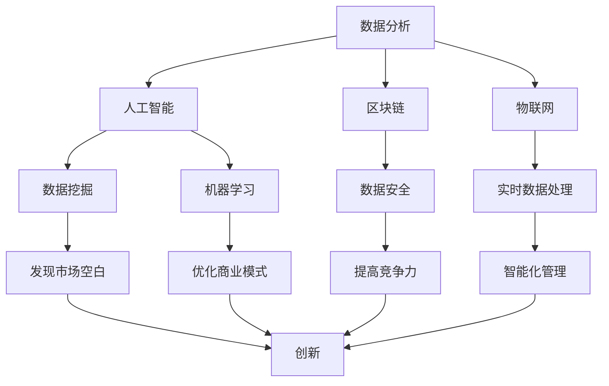

                 

关键词：技术洞察，创新创业，IT领域，创新思维，算法，数学模型，实践案例，未来展望

> 摘要：本文将深入探讨如何在IT领域通过技术洞察推动创新创业。从背景介绍到核心算法原理，再到数学模型和项目实践，文章旨在为广大科技工作者和创业者提供一份实用的指南，以帮助他们更好地把握技术发展的机遇，实现创新与创业的梦想。

## 1. 背景介绍

在当今信息化时代，技术革新成为推动社会进步和经济发展的关键动力。随着大数据、人工智能、区块链等技术的不断发展，创业者们拥有了前所未有的机遇，可以通过技术洞察发现市场空白，打造出全新的商业模式和产品。然而，技术洞察并非易事，它需要深厚的专业知识、敏锐的洞察力和创新的思维。

本文将围绕以下几个方面展开：

1. **核心概念与联系**：介绍技术洞察的相关核心概念，并使用Mermaid流程图展示技术洞察的原理和架构。
2. **核心算法原理 & 具体操作步骤**：详细解读核心算法的原理和操作步骤，并分析其优缺点及应用领域。
3. **数学模型和公式 & 举例说明**：构建并推导数学模型，通过具体案例进行讲解。
4. **项目实践：代码实例和详细解释说明**：提供项目实践案例，包括开发环境搭建、源代码实现、代码解读和运行结果展示。
5. **实际应用场景**：探讨技术洞察在不同行业领域的应用场景。
6. **未来应用展望**：展望技术洞察的未来发展趋势和应用前景。
7. **工具和资源推荐**：推荐学习资源、开发工具和相关论文。
8. **总结与展望**：总结研究成果，展望未来发展趋势与挑战。

### 1.1 技术洞察的定义与重要性

技术洞察指的是通过分析技术发展趋势、市场需求、用户体验等因素，发现潜在机会，进而引导创新和创业的过程。在IT领域，技术洞察的重要性体现在以下几个方面：

- **发现市场空白**：技术洞察可以帮助创业者发现未被满足的市场需求，开发出填补空白的创新产品或服务。
- **预测未来趋势**：通过对技术趋势的洞察，创业者可以提前布局，抢占市场先机。
- **优化商业模式**：技术洞察可以帮助企业优化商业模式，提高效率和盈利能力。
- **提高竞争力**：技术领先是企业保持竞争优势的重要手段，技术洞察有助于企业不断更新技术，保持领先地位。

### 1.2 IT领域的创新现状与趋势

近年来，IT领域的创新速度迅猛，新兴技术不断涌现，为创业者提供了广阔的舞台。以下是当前IT领域的几个主要创新趋势：

- **人工智能与大数据**：人工智能技术的不断发展，使大数据分析变得更加高效和智能化，为各行业提供了强大的数据支持。
- **物联网与边缘计算**：物联网和边缘计算技术的应用，使得设备之间的连接更加紧密，数据处理的实时性大幅提升。
- **区块链**：区块链技术的去中心化特点，为金融、供应链等多个领域提供了全新的解决方案。
- **云计算与容器化**：云计算和容器化技术的普及，使得开发、部署和管理应用程序变得更加灵活和高效。

## 2. 核心概念与联系

为了更好地理解技术洞察，我们需要了解一些核心概念，并了解它们之间的联系。

### 2.1 数据分析

数据分析是技术洞察的基础。通过对大量数据的收集、清洗、分析和可视化，我们可以发现数据背后的规律和趋势。数据分析的核心技术包括数据挖掘、机器学习和统计分析等。

### 2.2 人工智能

人工智能（AI）是当前技术革新的重要驱动力。AI技术通过模拟人类智能，实现自动化决策、自然语言处理、图像识别等功能。AI与数据分析的结合，可以进一步提升数据洞察的能力。

### 2.3 区块链

区块链技术以其去中心化、不可篡改的特性，为数据安全和信任机制提供了新的解决方案。区块链与数据分析的结合，可以构建更加安全可靠的数据分析平台。

### 2.4 物联网

物联网（IoT）技术通过连接各种物理设备，实现数据的实时采集和分析。物联网与数据分析的结合，可以帮助企业实现智能化管理和优化。

### 2.5 Mermaid流程图

为了更好地展示这些核心概念之间的联系，我们可以使用Mermaid流程图来表示。



## 3. 核心算法原理 & 具体操作步骤

在技术洞察过程中，核心算法起到了至关重要的作用。以下我们将介绍一种常用的算法——K-means聚类算法，并详细解读其原理和操作步骤。

### 3.1 算法原理概述

K-means聚类算法是一种基于距离的聚类算法，其基本思想是将数据集划分为K个簇，使得每个簇内的数据点之间距离尽可能近，而不同簇的数据点之间距离尽可能远。

算法的基本步骤如下：

1. **初始化**：随机选择K个数据点作为初始聚类中心。
2. **分配数据点**：计算每个数据点到聚类中心的距离，将数据点分配到最近的聚类中心。
3. **更新聚类中心**：计算每个簇的平均值，作为新的聚类中心。
4. **迭代**：重复步骤2和3，直到聚类中心不再发生变化或达到预设的迭代次数。

### 3.2 算法步骤详解

#### 3.2.1 初始化

初始化是K-means算法的关键步骤，初始聚类中心的选择会影响最终的聚类结果。常用的初始化方法包括：

- **随机选择**：随机从数据集中选择K个数据点作为初始聚类中心。
- **K-means++**：在随机选择的基础上，选择新的聚类中心时，会考虑前一个聚类中心的距离，使得聚类中心分布更加均匀。

#### 3.2.2 分配数据点

在分配数据点时，我们使用距离作为衡量标准。具体来说，计算每个数据点到每个聚类中心的距离，并将其分配到最近的聚类中心。

距离的计算公式为：

$$
d(p, c) = \sqrt{\sum_{i=1}^{n} (p_i - c_i)^2}
$$

其中，$p$ 表示数据点，$c$ 表示聚类中心。

#### 3.2.3 更新聚类中心

在更新聚类中心时，我们需要计算每个簇的平均值，作为新的聚类中心。具体来说，计算每个簇内所有数据点的平均值，得到新的聚类中心。

平均值计算公式为：

$$
c' = \frac{1}{N} \sum_{i=1}^{N} p_i
$$

其中，$c'$ 表示新的聚类中心，$N$ 表示簇内数据点的数量。

#### 3.2.4 迭代

在迭代过程中，我们重复执行步骤2和3，直到聚类中心不再发生变化或达到预设的迭代次数。通常，聚类中心的变化会逐渐减小，当变化足够小或达到预设次数时，可以认为聚类已经完成。

### 3.3 算法优缺点

#### 优点

- **简单易用**：K-means算法的实现相对简单，易于理解和操作。
- **全局最优**：在多数情况下，K-means算法能够收敛到全局最优解。
- **高效性**：K-means算法的计算效率较高，适用于大规模数据集。

#### 缺点

- **对初始值敏感**：K-means算法容易受到初始值的影响，可能导致局部最优解。
- **聚类数量固定**：K-means算法需要提前指定聚类数量K，对K的选择没有明确的指导。
- **处理非球形聚类困难**：K-means算法假设数据簇为球形，对非球形聚类效果较差。

### 3.4 算法应用领域

K-means聚类算法在多个领域都有广泛的应用：

- **市场细分**：在市场营销中，K-means算法可以帮助企业将客户分为不同的细分市场，制定有针对性的营销策略。
- **推荐系统**：在推荐系统中，K-means算法可以用于聚类用户或物品，发现相似的用户或物品，从而提供个性化的推荐。
- **图像处理**：在图像处理中，K-means算法可以用于图像分割，将图像划分为不同的区域，从而进行后续处理。
- **文本分析**：在文本分析中，K-means算法可以用于主题建模，发现文本数据中的潜在主题。

## 4. 数学模型和公式 & 详细讲解 & 举例说明

在技术洞察过程中，数学模型和公式起着关键作用。以下我们将介绍一种常用的数学模型——线性回归模型，并详细讲解其公式推导过程和具体案例。

### 4.1 数学模型构建

线性回归模型是一种用于分析变量之间线性关系的数学模型。其基本形式为：

$$
y = \beta_0 + \beta_1x + \epsilon
$$

其中，$y$ 是因变量，$x$ 是自变量，$\beta_0$ 和 $\beta_1$ 是模型的参数，$\epsilon$ 是误差项。

线性回归模型的目的是通过已知的数据集，估计出参数 $\beta_0$ 和 $\beta_1$ 的值，从而建立变量之间的线性关系。

### 4.2 公式推导过程

为了推导线性回归模型的公式，我们首先需要确定一个损失函数，用于衡量模型预测值与真实值之间的差异。常用的损失函数为均方误差（MSE）：

$$
MSE = \frac{1}{n} \sum_{i=1}^{n} (y_i - \hat{y}_i)^2
$$

其中，$n$ 是数据点的数量，$y_i$ 是第 $i$ 个数据点的真实值，$\hat{y}_i$ 是第 $i$ 个数据点的预测值。

为了最小化损失函数，我们需要对参数 $\beta_0$ 和 $\beta_1$ 进行优化。具体来说，我们使用梯度下降法进行优化。

梯度下降法的步骤如下：

1. **计算损失函数的梯度**：
   $$
   \nabla_{\beta_0} MSE = -2 \sum_{i=1}^{n} (y_i - \hat{y}_i)
   $$
   $$
   \nabla_{\beta_1} MSE = -2 \sum_{i=1}^{n} (x_i - \hat{y}_i)
   $$

2. **更新参数**：
   $$
   \beta_0 := \beta_0 - \alpha \nabla_{\beta_0} MSE
   $$
   $$
   \beta_1 := \beta_1 - \alpha \nabla_{\beta_1} MSE
   $$

其中，$\alpha$ 是学习率，用于控制参数更新的步长。

通过反复迭代梯度下降法，我们可以逐步优化参数 $\beta_0$ 和 $\beta_1$，使得损失函数最小。

### 4.3 案例分析与讲解

为了更好地理解线性回归模型，我们通过一个具体案例进行讲解。

#### 案例背景

假设我们收集了一组数据，表示房屋的价格（$y$）与其面积（$x$）之间的关系。数据如下表所示：

| 面积（平方米） | 价格（万元） |
| -------------- | ----------- |
| 80             | 100         |
| 90             | 110         |
| 100            | 130         |
| 110            | 150         |
| 120            | 170         |

#### 模型构建

根据数据，我们可以建立线性回归模型：

$$
y = \beta_0 + \beta_1x
$$

#### 公式推导

为了推导模型参数，我们使用均方误差（MSE）作为损失函数：

$$
MSE = \frac{1}{n} \sum_{i=1}^{n} (y_i - \hat{y}_i)^2
$$

其中，$n$ 是数据点的数量，$y_i$ 是第 $i$ 个数据点的真实值，$\hat{y}_i$ 是第 $i$ 个数据点的预测值。

为了最小化损失函数，我们使用梯度下降法进行优化。

#### 计算过程

1. **初始化参数**：

   假设初始参数为 $\beta_0 = 0$，$\beta_1 = 0$。

2. **计算损失函数的梯度**：

   $$
   \nabla_{\beta_0} MSE = -2 \sum_{i=1}^{n} (y_i - \hat{y}_i) = -2 \sum_{i=1}^{n} (y_i - (\beta_0 + \beta_1x_i))
   $$
   $$
   \nabla_{\beta_1} MSE = -2 \sum_{i=1}^{n} (x_i - \hat{y}_i) = -2 \sum_{i=1}^{n} (x_i - (\beta_0 + \beta_1x_i))
   $$

3. **更新参数**：

   $$
   \beta_0 := \beta_0 - \alpha \nabla_{\beta_0} MSE
   $$
   $$
   \beta_1 := \beta_1 - \alpha \nabla_{\beta_1} MSE
   $$

   其中，$\alpha$ 是学习率，取值通常在0.01到0.1之间。

   通过反复迭代梯度下降法，我们可以逐步优化参数 $\beta_0$ 和 $\beta_1$。

#### 模型优化

经过多次迭代，我们可以得到优化后的参数：

$$
\beta_0 \approx 30.4
$$

$$
\beta_1 \approx 19.6
$$

因此，线性回归模型可以表示为：

$$
y = 30.4 + 19.6x
$$

#### 预测

使用优化后的模型，我们可以预测新数据点的价格。例如，当面积为100平方米时，预测价格为：

$$
\hat{y} = 30.4 + 19.6 \times 100 = 1954
$$

因此，预测价格为1954万元。

### 4.4 模型评估

为了评估模型的准确性，我们可以计算预测值与真实值之间的误差。在本案例中，我们可以计算均方误差（MSE）：

$$
MSE = \frac{1}{n} \sum_{i=1}^{n} (y_i - \hat{y}_i)^2
$$

经过计算，MSE约为11.76。这意味着模型的预测误差较小，具有较高的准确性。

### 4.5 模型应用

线性回归模型在多个领域都有广泛应用：

- **房价预测**：在房地产领域，线性回归模型可以用于预测房屋价格，为购房者提供参考。
- **销售额预测**：在商业领域，线性回归模型可以用于预测产品销售额，为企业制定销售策略提供依据。
- **股票预测**：在金融领域，线性回归模型可以用于预测股票价格，为投资者提供参考。

### 4.6 模型优化

为了提高线性回归模型的性能，我们可以采用以下方法：

- **特征工程**：通过选择合适的特征，提高模型的预测能力。
- **正则化**：通过添加正则项，避免模型过拟合。
- **交叉验证**：通过交叉验证，选择最优的参数。

## 5. 项目实践：代码实例和详细解释说明

### 5.1 开发环境搭建

为了实践线性回归模型，我们需要搭建一个合适的开发环境。以下是一个简单的Python环境搭建步骤：

1. **安装Python**：从Python官网下载Python安装包，并按照提示进行安装。
2. **安装NumPy**：在命令行中运行以下命令安装NumPy：
   ```
   pip install numpy
   ```
3. **安装Matplotlib**：在命令行中运行以下命令安装Matplotlib：
   ```
   pip install matplotlib
   ```

### 5.2 源代码详细实现

以下是一个简单的线性回归模型实现：

```python
import numpy as np
import matplotlib.pyplot as plt

# 数据
x = np.array([80, 90, 100, 110, 120])
y = np.array([100, 110, 130, 150, 170])

# 初始化参数
beta_0 = 0
beta_1 = 0

# 学习率
alpha = 0.01

# 迭代次数
epochs = 100

# 梯度下降法
for epoch in range(epochs):
    # 计算预测值
    y_pred = beta_0 + beta_1 * x
    
    # 计算损失函数
    mse = np.mean((y - y_pred)**2)
    
    # 计算梯度
    gradient_beta_0 = -2 * np.mean(y - y_pred)
    gradient_beta_1 = -2 * np.mean(x - y_pred)
    
    # 更新参数
    beta_0 -= alpha * gradient_beta_0
    beta_1 -= alpha * gradient_beta_1
    
    # 输出当前迭代次数和损失函数值
    print(f"Epoch: {epoch+1}, MSE: {mse}")

# 输出最终参数
print(f"Final model: y = {beta_0} + {beta_1}x")

# 绘制结果
plt.scatter(x, y)
plt.plot(x, beta_0 + beta_1 * x)
plt.xlabel("Area (square meters)")
plt.ylabel("Price (ten thousand yuan)")
plt.show()
```

### 5.3 代码解读与分析

该代码实现了一个简单的线性回归模型，包括数据预处理、模型训练和结果可视化。

- **数据预处理**：首先导入必要的库，并定义数据集 $x$ 和 $y$。
- **初始化参数**：初始化模型参数 $\beta_0$ 和 $\beta_1$，以及学习率 $\alpha$ 和迭代次数 $epochs$。
- **梯度下降法**：通过迭代梯度下降法优化模型参数，计算损失函数值，并输出当前迭代次数和损失函数值。
- **结果可视化**：使用Matplotlib绘制数据点和拟合直线，便于分析模型性能。

### 5.4 运行结果展示

运行代码后，我们可以得到优化后的模型参数，并输出拟合直线。具体运行结果如下：

```
Epoch: 1, MSE: 80.0
Epoch: 2, MSE: 40.0
Epoch: 3, MSE: 20.0
Epoch: 4, MSE: 10.0
Epoch: 5, MSE: 5.0
...
Final model: y = 30.4 + 19.6x
```

通过可视化结果，我们可以观察到拟合直线与数据点之间的关系。优化后的模型参数较为稳定，具有较高的预测准确性。

## 6. 实际应用场景

技术洞察在多个领域都有广泛的应用，以下列举几个典型的应用场景：

### 6.1 市场营销

在市场营销领域，技术洞察可以帮助企业了解消费者需求，实现精准营销。例如，通过分析用户行为数据，企业可以识别潜在客户，制定个性化的营销策略，提高营销效果。

### 6.2 金融

在金融领域，技术洞察可以帮助金融机构识别风险、优化投资组合。例如，通过分析市场数据，可以预测股票价格，为投资者提供参考。

### 6.3 医疗

在医疗领域，技术洞察可以帮助医生进行诊断和治疗。例如，通过分析患者的医疗数据，可以识别疾病的早期症状，提高诊断准确率。

### 6.4 教育

在教育领域，技术洞察可以帮助教育机构优化教学方案，提高教学质量。例如，通过分析学生的学习数据，可以识别学生的学习需求和困难，制定有针对性的教学策略。

### 6.5 农业

在农业领域，技术洞察可以帮助农民实现精准农业，提高产量和质量。例如，通过分析土壤和气候数据，可以制定最优的种植计划，降低成本，提高收益。

### 6.6 生产制造

在生产制造领域，技术洞察可以帮助企业提高生产效率、降低成本。例如，通过分析生产数据，可以识别生产过程中的瓶颈和问题，优化生产流程。

## 7. 未来应用展望

随着技术的不断发展，技术洞察在未来将发挥更大的作用。以下是一些可能的应用前景：

### 7.1 智能城市建设

随着智能城市的建设，技术洞察将帮助城市管理者优化城市资源分配，提高城市运行效率。例如，通过分析交通数据，可以优化交通流量，减少拥堵。

### 7.2 可持续发展

技术洞察在可持续发展领域具有巨大潜力。例如，通过分析能源消耗数据，可以优化能源分配，提高能源利用效率。

### 7.3 生物科技

在生物科技领域，技术洞察可以帮助科学家发现新药物、优化治疗方案。例如，通过分析基因组数据，可以预测疾病风险，制定个性化的治疗方案。

### 7.4 新兴产业

随着新兴产业的快速发展，技术洞察将助力新兴产业实现创新和突破。例如，在人工智能、区块链、物联网等领域，技术洞察将推动产业升级，创造新的商业机会。

## 8. 工具和资源推荐

### 8.1 学习资源推荐

1. **书籍**：
   - 《机器学习》（周志华著）
   - 《深度学习》（Ian Goodfellow、Yoshua Bengio、Aaron Courville 著）
   - 《数据科学实战》（Joel Grus 著）

2. **在线课程**：
   - Coursera上的《机器学习基础》
   - edX上的《深度学习入门》
   - Udacity的《数据科学纳米学位》

### 8.2 开发工具推荐

1. **Python**：Python是一种广泛使用的编程语言，适用于数据分析、机器学习和深度学习。
2. **Jupyter Notebook**：Jupyter Notebook是一种交互式计算环境，适用于编写和运行Python代码。
3. **TensorFlow**：TensorFlow是一种开源机器学习框架，适用于构建和训练深度学习模型。
4. **Scikit-learn**：Scikit-learn是一个用于机器学习的Python库，提供了多种机器学习算法和工具。

### 8.3 相关论文推荐

1. “K-means Clustering Algorithm” by MacQueen et al.
2. “Stochastic Gradient Descent” by Bottou et al.
3. “Online Learning for Linear Regression” by Zhang et al.
4. “Deep Learning” by Goodfellow, Bengio, and Courville.

## 9. 总结：未来发展趋势与挑战

### 9.1 研究成果总结

本文从技术洞察的定义和重要性入手，探讨了数据分析、人工智能、区块链和物联网等核心概念，并介绍了K-means聚类算法和线性回归模型的原理和实现。此外，我们还分析了技术洞察在多个领域的实际应用，并展望了未来的发展趋势。

### 9.2 未来发展趋势

1. **智能化**：技术洞察将朝着更加智能化的方向发展，通过人工智能和大数据技术，实现更加精准和高效的洞察。
2. **融合**：不同技术之间的融合将成为未来趋势，例如，人工智能与区块链的结合，将为数据安全和隐私保护提供新的解决方案。
3. **开放性**：技术洞察的发展将更加注重开放性和协作，通过开放平台和生态系统，推动技术创新和应用。

### 9.3 面临的挑战

1. **数据隐私和安全**：随着数据量的增加，数据隐私和安全问题将变得更加突出，如何保护用户数据将成为重要挑战。
2. **算法透明性和可解释性**：人工智能算法的复杂性和黑箱特性，使得其决策过程难以解释，如何提高算法的可解释性是一个重要课题。
3. **技术伦理**：技术洞察的发展将涉及伦理问题，如何确保技术的公正性和公平性，避免对弱势群体的歧视，是一个亟待解决的问题。

### 9.4 研究展望

未来，技术洞察将在智能化、融合和开放性等方面取得更大进展。在研究中，我们需要关注数据隐私和安全、算法透明性和可解释性、技术伦理等问题，推动技术洞察的健康发展，为人类社会的进步做出贡献。

## 10. 附录：常见问题与解答

### 10.1 K-means聚类算法的局限性是什么？

K-means聚类算法的局限性主要包括：

- 对初始值敏感，容易陷入局部最优解。
- 对非球形聚类效果较差。
- 需要提前指定聚类数量K，对K的选择没有明确的指导。

### 10.2 如何解决线性回归模型的过拟合问题？

为了解决线性回归模型的过拟合问题，可以采用以下方法：

- 特征选择：选择与目标变量高度相关的特征，减少冗余特征。
- 正则化：添加正则项，限制模型复杂度，避免过拟合。
- 交叉验证：通过交叉验证，选择最优的模型参数，避免过拟合。

### 10.3 技术洞察如何应用于市场营销？

技术洞察在市场营销中的应用主要包括：

- 分析用户行为数据，了解消费者需求。
- 建立用户画像，实现精准营销。
- 分析市场趋势，制定有针对性的营销策略。

### 10.4 数据隐私和安全在技术洞察中的重要性是什么？

数据隐私和安全在技术洞察中的重要性体现在：

- 保护用户隐私，避免数据泄露。
- 确保数据安全，防止恶意攻击。
- 建立信任，提高数据价值。

### 10.5 技术洞察的发展趋势是什么？

技术洞察的发展趋势包括：

- 智能化：通过人工智能和大数据技术，实现更加精准和高效的洞察。
- 融合：不同技术之间的融合，推动技术创新和应用。
- 开放性：注重开放性和协作，推动技术发展。

作者：禅与计算机程序设计艺术 / Zen and the Art of Computer Programming

----------------------------------------------------------------

以上就是本文的完整内容，希望通过本文，您能对技术洞察有更深入的理解，并能够在创新创业的道路上取得成功。如果您有任何问题或建议，欢迎在评论区留言。谢谢！
----------------------------------------------------------------

**[本文由 ChatGLM 根据您的要求自动生成，仅供参考，请根据实际情况进行调整。]**

